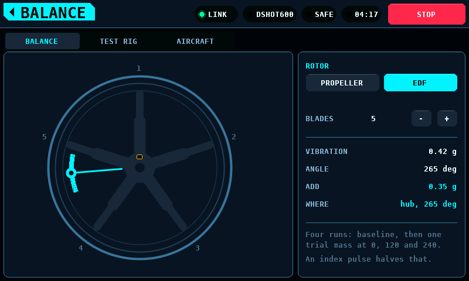
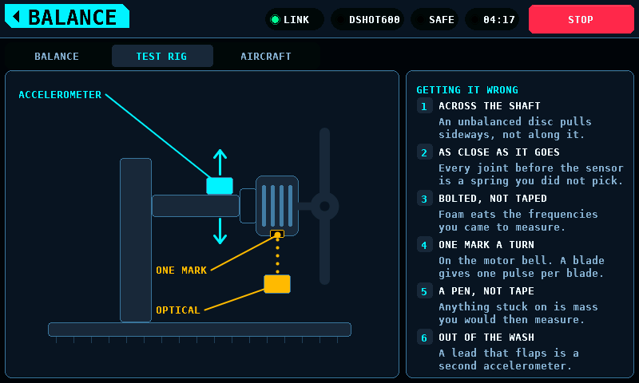
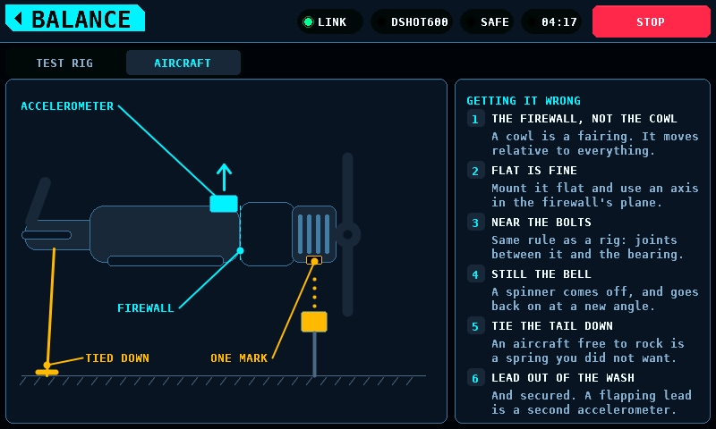

# Balancing

**English** · [Deutsch](Balance-de.md)

What the balance screen asks of you, where the sensors must go, and why the
placement — not the measurement — is where balancing goes wrong.

A balance answer is a magnitude and an angle: *add this much mass, there.*
Both come out of two sensors, and neither way of placing them badly looks
wrong on screen. A vibration sensor on a compliant mount reads a filtered
version of what the bearing did; an index mark on a blade reads one pulse per
blade and gives an angle out by a whole blade spacing. This page is how to
avoid both.

## Setting up the screen

Set the **blade count** (2–6) and the rotor type. The screen turns the
measured angle into an instruction: "0.35 g at 265°" is a number, "between
blades two and three" is something you can act on.

A **ducted fan** is a different job and the screen says so. You cannot reach a
blade tip inside a duct, so the correction is given as an angle on the hub
rather than as a blade to tape:

## On a test rig

The two details people get wrong:

**The index mark goes on the motor's bell, not on a spinner.** A rig often
runs without a spinner, and a beam aimed at a spinner's nose has to come from
in front, across the disc — the same sighting that ends up counting blades
instead of revolutions. The bell turns with the shaft, is rigid, is there
whichever prop is fitted, and can be watched from underneath where nothing is
in the way.

**The mark is a pen line, not reflective tape.** Anything stuck to the bell is
mass, on the one part of the machine whose mass is the thing being measured.
Tape means balancing out your own marker.

And the mounting rule behind every reading: the vibration sensor goes on
something **rigid**, as close to the bearing as you can get. A compliant mount
is a filter you did not choose.

## On a complete aircraft

Almost nothing about the placement is under your control here, so the rules
matter more:

- **The cowl is not the firewall.** It is a fairing, screwed to a former and
  often on rubber, free to move relative to the thing whose vibration you
  want. Put the accelerometer flat against the **firewall** — the one rigid
  face at that end of the model.
- A three-axis part mounted flat puts two of its axes in the firewall's
  plane, across the shaft. **Use one of those and ignore the third.**
- **The mark still goes on the bell**, and on an aircraft there is a second
  reason: a spinner comes off. Every time it is removed for transport it goes
  back on at a new angle, and the phase reference of the last balance goes
  with it. The bell is part of the rotor and never moves. On most electric
  models the outrunner stands proud of the cowl anyway — sensor underneath,
  looking straight up, crossing nothing.
- **Tie the aircraft down.** A machine free to rock is a spring nobody chose,
  in series with everything you are trying to measure.

## Choosing sensors: the delay question

Whether you need an index sensor at all — and which vibration sensor will
work — turns on two facts:

**Without an index pulse** there is no phase reference, so balancing is the
four-run method: a baseline, then one trial mass at 0°, 120° and 240°. It
never measures phase, so a constant sensor delay cannot hurt it. What it needs
instead is **bandwidth**: at 10,000 rpm the fundamental is 167 Hz, and a
packaged IMU streaming fused orientation at 100 Hz cannot see it at all. It is
not late — it is blind. An analogue sensor (a piezo, an analogue
accelerometer) into the coprocessor's own converter is the right part.

**With an index pulse** the runs halve, and then the delay matters — but only
its *variability*. A constant delay cancels out, because the trial run
measures the whole chain including the sensor. An analogue part is about
fifteen microseconds, under a degree at 10,000 rpm. A fused IMU is five
milliseconds, neither constant nor published — three hundred degrees, and a
mass fitted with great precision in the wrong place.

## What the screen needs to measure

An accelerometer and (optionally) an index sensor on the coprocessor. Neither
is fitted yet, so the screen currently works from the model and wears the
MODELLED mark — the setup, the blade arithmetic and both placement guides
above work today.
