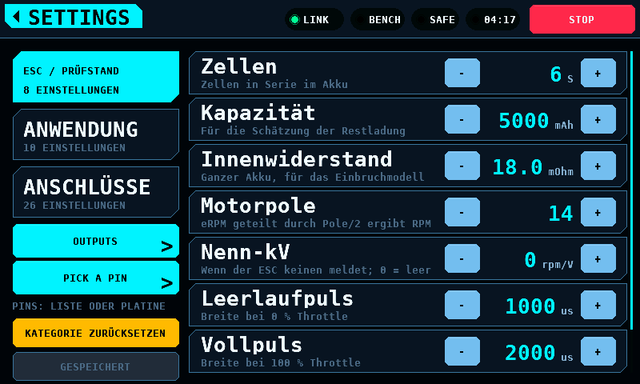

# Sprache der Oberfläche

[English](Language.md)

Das Panel zeigt seine Oberfläche auf Englisch oder auf Deutsch. SETUP,
ANWENDUNG, Sprache wählt sie (ENGLISH, DEUTSCH). Die Wahl gilt zusammen mit
dem Design, das nächste Bild erscheint in der neuen Sprache; nichts startet
neu. Sie liegt wie jede Einstellung im NVS (Non-Volatile Storage), sobald
SPEICHERN sie übernimmt.



## Was der Sprache folgt und was nicht

| Folgt der Sprache | Bleibt, wie es ist |
| --- | --- |
| Beschriftungen, Namen und Hilfetexte der Einstellungen, Alarme im Band, Warnfelder, Ablehnungshinweise, die Details des Splash | die Begriffe unter [Begriffe, die Englisch bleiben](#begriffe-die-englisch-bleiben) |
| der TXT-Bericht (reiner Text) des Servotests, in der Sprache beim Start des Laufs | die CSV-Datei (Comma-Separated Values) des Servotests: Kopfzeile und die Wörter in ihren Zeilen (`test`, `phase`, `mode`), damit Werkzeuge jeden Lauf gleich lesen |
| die Hinweise und Ablehnungen der Stick-Programmierung | Namen, Punkte und Werte der Profile des ESC (Electronic Speed Controller), die aus den Anleitungen stammen |
| | die Parameternamen des Programmers und ihre Werte, die der Firmware gehören, wie ihre Konfiguratoren sie zeigen |
| | das Konsolen-Log |

Aktuelle Einschränkungen:

- Ein Alarm, der schon im Band steht, bleibt in der Sprache, in der er
  entstand, bis er ersetzt, weggetippt oder nach 30 s (`UI_ALERT_SHOW_S`)
  gelöscht wird. Der gehaltene Alarm für einen Touch-Controller, der beim
  Start nicht antwortete, entsteht in der Sprache aus dem NVS und bleibt bis
  zum Neustart; ohne Touch lässt sich die Sprache bis dahin nicht ändern.
- Die Meldezeile von LOG VIEWER (eine Datei, die sich nicht öffnen oder
  löschen ließ, eine gelöschte Datei) bleibt in ihrer Sprache, bis die
  nächste geöffnete oder gelöschte Datei sie ersetzt oder leert.
- Der Titel eines schon offenen Tastenfelds oder einer Auswahlliste bleibt
  in seiner Sprache, bis es sich schließt.
- Die Stick-Engine meldet eine Ablehnung auf Englisch, und die Seite findet
  die Übersetzung über dieses Englisch. Eine Ablehnung, die die Tabelle nicht
  kennt, erscheint auf Englisch. `test_text` prüft, dass jede Ablehnung der
  einkompilierten Profile einen deutschen Eintrag hat.
- Zwei englische Hilfetexte in SETUP sind länger als die 36 Zellen der Zeile
  und werden dort abgeschnitten: die von Capacity und von Rated kV.
  `render_ui.py --fit` führt sie als Hinweise.

## Zahlen

Die Seiten, der TXT-Bericht und die CSV schreiben in jeder Sprache den
Dezimalpunkt: 7.4 V, 0.05 A. Es ist das Trennzeichen des Senders, der
ESC-Konfiguratoren und der eigenen Anzeige des Netzteils, und eine CSV mit
Dezimalkomma bräuchte ein anderes Feldtrennzeichen. Die deutschen Seiten
dieser Dokumentation schreiben im Fließtext das deutsche Dezimalkomma
(7,4 V); ein Text, der vom Bildschirm zitiert wird, behält seinen Punkt
(`seit 1.5 s kein Messwert`).

## Begriffe, die Englisch bleiben

Das sind die Wörter, die ein Bediener am Sender, in einem ESC-Konfigurator,
in einer Anleitung oder einem Datenblatt findet, und die
Sicherheitsbedienelemente, die in jeder Sprache gleich lauten. Ein
übersetztes ARM würde nicht zum Wort in der Anleitung neben dem Prüfstand
passen.

- Die Sicherheits- und Antriebsbedienung: ARM, DISARM, ARMED, DISARMED,
  STOP, SWEEP, HOLD, CENTRE, TRIM, REVERSE.
- Die Seitentitel: MOTOR & ESC, SERVO, SUPPLY, ANALYSER, LOGS, SETUP,
  SETTINGS, BATTERY, BALANCE, PROGRAMMER, OUTPUTS, PICK A PIN, LOG VIEWER,
  CAN BUS FAULT, LINK LOST. Ein Hinweis, der eine Seite nennt, nennt sie
  beim Titel: "der Seite SUPPLY".
- Protokoll- und Modusnamen: DShot, PWM (Pulse-Width Modulation), PPM
  (Pulse-Position Modulation), OneShot, S.BUS, CAN (Controller Area
  Network), BLHeli_S, AM32, ESCape32, VESC, KISS, PD mini, AUTO, CV
  (Constant Voltage), CC (Constant Current), STANDARD PWM, HELI CYCLIC,
  ESC STICK, BUS OFF.
- Zwei Zustandswörter, kurz genug für ihren Platz: SAFE im Statusband und
  SILENT im Urteil des ANALYSER.
- Die Begriffe des Fachs: Frame Rate, Throttle, Failsafe, Brown-out, Timing,
  Endpoint, Link, Live, Online, Touch, Display, Pin, Slot, Pad, Resync,
  Bad tail, tx err, rx err, bus err, Frame.
- Einheiten, die Stickpositionen MIN, MID und MAX und die Tastenbeschriftungen
  DEL, CLR und OK.

## Glossar

Ein deutsches Wort je englischem Begriff, auf jeder Seite und im Bericht.

| Englisch | Deutsch |
| --- | --- |
| bench | Prüfstand |
| supply | Netzteil |
| output | Ausgang |
| set point | Sollwert |
| input (of a supply), wiring | Eingang, Verdrahtung |
| current limit | Strombegrenzung |
| cap | Obergrenze |
| trip (die eigene Abschaltung des Netzteils), current trip, voltage trip | Abschaltung (ABSCH. auf der Karte MODUS), Überstrom, Überspannung |
| card | Karte |
| run | Lauf |
| step (des Netzteils) | Stufe |
| report | Bericht |
| reading | Messwert |
| setting (ein Eintrag in SETUP) | Einstellung |
| SETTINGS (das eigene Overlay einer Seite) | OPTIONEN |
| save, reset, apply, close | speichern, zurücksetzen, übernehmen, schließen |
| cancel, abort | abbrechen |
| hold to … | … halten |
| refused | abgelehnt |
| screen (eine Seite der Oberfläche) | Seite |
| screen (das Display) | Bildschirm |
| coprocessor | Koprozessor |
| board | Platine |
| pack, cell, spread | Akku, Zelle, Streuung |
| peak | Spitze (max auf einer Karte) |
| idle current, holding current | Ruhestrom, Haltestrom |
| travel, travel time | Weg, Stellzeit |
| stall | blockieren |
| movement, dwell, settle | Bewegung, Verweilen, Einschwingen |
| speed (des Servotests), range | Tempo, Bereich |
| device under test | Prüfling |
| pass, fail, aborted (ein Urteil) | bestanden, nicht bestanden, abgebrochen |
| FAULT (ein Zustand) | FEHLER |
| ON, OFF | EIN, AUS |
| beep | Piepton |
| item, value (eines ESC-Menüs) | Punkt, Wert |
| entry (in ein ESC-Menü), power-up | Einstieg, Einschalten |
| threshold | Schwelle |
| defaults | Vorgaben |
| channel | Kanal |
| probe (des CAN-Selbsttests) | Testframe |
| terminator, branch (eines Busses) | Abschluss, Stichleitung |
| separator, row, column | Trenner, Zeile, Spalte |
| plot, table | Grafik, Tabelle |
| simulated, modelled (vom Panel berechnet) | simuliert |
| model (ein Flugmodell, ein ESC-Produkt) | Modell |
| protocol page (des Links) | Page |
| floor (des Stroms, Stick-Programmierung) | Grund |
| horn (eines Servos) | Ruderhorn |
| start (einen Lauf) | starten, START auf einem Knopf |
| surface (die Rolle eines Ausgangs) | Ruder |
| connect, disconnect, read, write | verbinden, trennen, lesen, schreiben |

Der Ton ist der eines Messgeräts: ein Substantiv, wo eine Beschriftung
reicht, der Imperativ, wo eine Anweisung nötig ist, kein "Sie". Eine
Beschriftung in Großbuchstaben schreibt ß als SS (SCHLIESSEN, GRÖSSE); Text
in gemischter Schreibung schreibt ß. Das große ẞ (U+1E9E) ist nicht in den
Fonts.

## Die Kodierung

Jeder Text ist UTF-8 (Unicode Transformation Format, 8 Bit), vom C-Quelltext
bis zum TXT-Bericht auf der Karte. `gfx` dekodiert ihn, und ein Codepoint ist
eine Zelle:

- Die beiden Text-Fonts enthalten druckbares ASCII (American Standard Code
  for Information Interchange, 0x20 bis 0x7E) und die sieben deutschen
  Buchstaben Ä Ö Ü ß ä ö ü (U+00C4, U+00D6, U+00DC, U+00DF, U+00E4, U+00F6,
  U+00FC), je 102 Glyphen. Der Ziffern-Font enthält nur Ziffern und
  Satzzeichen.
- Ein Codepoint, den ein Font nicht enthält, erscheint als `?`. Ein Byte,
  das keine gültige Folge beginnt, eine abgeschnittene Folge und eine
  überlange Form sind je ein `?`, und der Dekoder liest nie über das
  Endezeichen hinaus.
- Eine Breite ist Zellen mal Zellbreite: `gfx_text_width()` und
  `gfx_text_cells()` zählen Codepoints, und `gfx_text_prefix()` liefert die
  Bytelänge der ersten n Zellen, damit ein Schnitt zwischen zwei Zeichen
  fällt.
- Ein Puffer misst Bytes, und ein deutscher Buchstabe belegt zwei. Das
  Alarmband fasst `UI_ALERT_MAX`, 128 Bytes mit Endezeichen.

UTF-8 statt einer Ein-Byte-Codepage: Die Tabellen bleiben im Quelltext
lesbar, und der Bericht öffnet sich in jedem Editor am PC richtig. Der Preis
ist, dass keine Breite aus `strlen()` kommen darf; die Seiten messen mit den
Funktionen oben.

## Die Tabellen

| Datei | Enthält |
| --- | --- |
| `shared/ui/include/ui_text.def` | jeden übersetzten Text: seine ID (Identifier), die Zellen seines Feldes, wo kein Screenshot ihn zeigt, und sein Englisch |
| `shared/ui/ui_text_de.c` | das Deutsche nach ID; Beschriftungen, Hilfetexte, Optionen und Kategorien der Einstellungen; die Wörter des Servotests und den Bericht |
| `shared/ui/ui_text.c` | die Suche: `TR(ID)`, `ui_setting_label()`, `ui_servo_str()` und die übrigen |

Ein Eintrag, den eine Sprache auf `NULL` lässt, zeigt das Englische; eine
unvollständige Tabelle funktioniert also. Ein übersetztes Format wandelt
dieselben Argumente in derselben Reihenfolge wie sein Englisch.

## Die Passprüfungen

```bash
python3 tools/render_ui.py --fit
```

baut den Renderer mit `GFX_TEXT_TRACE`, zeichnet alle 57 Ansichten auf
Englisch und auf Deutsch und schlägt fehl, wenn ein deutscher Text

- breiter ist als die Box, die `gfx_text_in()` bekam,
- am Rand des Bereichs abgeschnitten wird, in dem er steht,
- über die gefüllte Form hinausläuft, auf der er steht,
- einen anderen Text des Bildes überlappt, oder
- von einer später gezeichneten Fläche übermalt und nicht neu
  gezeichnet wird. Nur die Zeichen zählen: eine Fläche über den Leerzeichen,
  mit denen eine Beschriftung aufgefüllt ist, ist kein Befund. OUTPUTS mit
  offener Protokollliste (`outputs-protocol`) ist ausgenommen, weil die
  Liste die Pins daneben absichtlich verdeckt.

Englische Befunde erscheinen als Hinweise: Englisch ist das Layout, für das
die Seiten gezeichnet sind. Ein deutscher Befund, den das Englische Wort für
Wort teilt, gehört dem Layout und nicht der Übersetzung und ist ebenfalls ein
Hinweis. Die Prüfung schlägt auch bei einem Text ohne angegebene Breite fehl,
den keine Ansicht zeichnet.

```bash
python3 tools/check_formats.py
```

kompiliert `shared/` mit jedem Aufruf von `TR()` und jedem Wort des Berichts
durch sein englisches Literal ersetzt, unter `-Wformat=2
-Wformat-nonliteral -Wformat-signedness`, und schlägt bei jeder Warnung
fehl: jedes englische Format passt zu den Argumenten seines Aufrufs. Die
`main.c` des Panels liegt nicht in `shared/` und ist nicht abgedeckt.

`test_text` deckt den Rest ab: jede ID hat Deutsch, jedes deutsche Format
wandelt, was sein Englisch wandelt, jeder Text mit angegebener Breite passt
in jeder Sprache hinein, Alarme und Splash-Details passen in ihre Puffer,
übersetzte Einstellungen passen in SETUP und die TIMING-Seite, und Spalten
und Beschriftungen des Berichts stehen bündig.

`tools/check_docs.py` schlägt fehl, wenn eine deutsche Wiki-Seite in
Backticks das Englische eines Textes zitiert, den der Bildschirm deutsch
zeigt: einen Text der Oberfläche, die Ausgabe eines Formats, mit Zahlen oder Text
an der Stelle seiner Umwandlungen, Name, Hilfetext, Option oder Kategorie einer Einstellung oder
ein Wort des Servotests, auch ein Zitat, das über zwei Zeilen umbricht.
Fließtext ohne Backticks wird nicht geprüft: Er nennt auch
Protokoll-Pages, Befehle an das Netzteil und Beschriftungen der Platine, die
ein Wort mit einer Beschriftung der Oberfläche teilen.

## Eine Sprache hinzufügen

1. `UI_LANG_xx` in `ui_lang_t` in `shared/ui/include/ui_text.h` eintragen,
   und den eigenen Namen der Sprache an derselben Stelle in `k_language` in
   `shared/settings/settings.c`.
2. `shared/ui/ui_text_de.c` nach `ui_text_xx.c` kopieren, übersetzen und
   `ui_lang_xx` in `k_langs` in `shared/ui/ui_text.c` und seine Deklaration
   in `ui_text.h` eintragen.
3. Die Datei in `shared/ui/CMakeLists.txt` und in `SOURCES` in
   `tools/render_ui.py` und `tools/frame_cost.py` eintragen.
4. Ein Buchstabe, den die Fonts nicht enthalten, kommt in die Liste in
   `FONTS` in `tools/gen_font.py`, und `python3 tools/gen_font.py` erzeugt
   sie neu.
5. Die Sprache in `LANGS` in `tools/render_ui.py` und im Argument von
   `test/host/render_screen.c` eintragen, dann
   `python3 tools/render_ui.py --fit` und `python3 tools/render_ui.py`
   ausführen.
6. `german_has_every_string` in `test/host/test_text.c` auf die neue
   Tabelle erweitern, ihr Glossar hier schreiben und diese Seite übersetzen.
