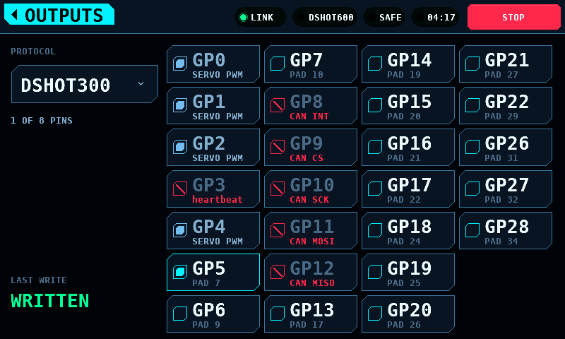
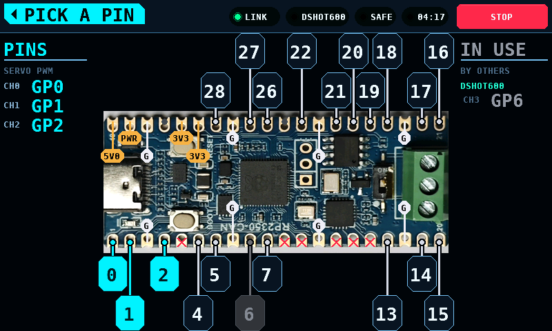
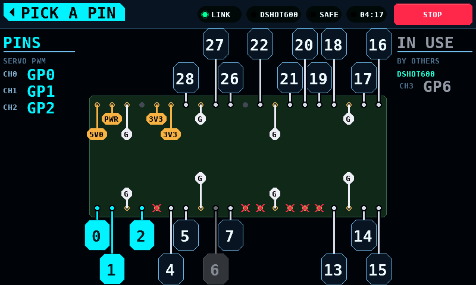

# Bildschirme

[English](Screens.md) · **Deutsch**

Was auf jedem Bildschirm steht, was die Marken im Menü bedeuten und wie die
einzelnen Bildschirme bedient werden.

## Das Statusband

Das obere Band ist auf allen Bildschirmen gleich. Von rechts: STOP, die
Laufzeituhr (im scharfen Zustand oder nach einem Lauf), ARMED oder SAFE, ein
FAULT-Code, sobald einer gemeldet wird, der Ausgangsmodus (LINK oder SIM) und
LINK oder NO LINK.

STOP funktioniert auf jedem Bildschirm. Es entschärft und rastet ein: der
Prüfstand bleibt entschärft, bis er erneut scharf geschaltet wird. Ein
Bildschirmwechsel, ein ablaufender Hinweis oder ein zurückkehrender Link hebt
einen Stopp nicht auf.

ARM sitzt unten auf einem Prüfstandsbildschirm; STOP sitzt oben im Band.

## Marken im Menü

| Marke | Bedeutung |
| --- | --- |
| SOON | den Bildschirm gibt es nicht; die Kachel nennt, was er tun wird und worauf er wartet |
| MODELLED | den Bildschirm gibt es und er funktioniert, aber seine Hardware ist nicht bestückt; jeder Wert ist simuliert, und der Bildschirm sagt das |
| keine | die Hardware ist bestückt, die Messwerte sind gemessen |

Die Marke wird aus den Capability-Bits abgeleitet, die der Koprozessor beim
Hochfahren meldet. Ein Bildschirm ohne seine Hardware öffnet trotzdem und
arbeitet aus dem Modell.

Das Menü im hellen Theme:

## Splash

Jedes Subsystem meldet beim Hochfahren sein Ergebnis: Platine, Display,
Touch, SD-Karte, Einstellungen, Link, Koprozessor. Die Zeile der Platine
trägt die Firmware-Version des Panels selbst, die Zeile des Koprozessors die
Protokollversion und die Firmware-Version, die dieser Koprozessor gemeldet
hat — zwei Platinen können dasselbe Protokoll sprechen und verschiedene
Builds sein, und hier zeigt sich das. Eine fehlende Karte ist
eine Warnung. Ein Touch-Controller, der nicht antwortet, oder ein Koprozessor
mit einer anderen Major-Version des Protokolls ist ein Fehler, und der
Prüfstand schaltet nicht scharf. Wenn alle Schritte geantwortet haben,
übergibt der Splash nach 1,6 s an das Menü; ein Tippen überspringt das Warten.

## Motor & ESC

Zwei Spalten. Der Plot und das Gas nehmen die linke, die vier Anzeigen und
die Bedienelemente eine Leiste auf der rechten, damit das Ablesen der Werte
und das Bedienen des Gases nicht um denselben Teil des Bildschirms
konkurrieren.

Der Streifen über beiden Spalten trägt die Abfragerate, die Fehlerzahl des
Links (CRC-Fehler und Resyncs zusammengezählt; CRC: Cyclic Redundancy Check)
und drei Temperaturen. ESC und MOT kommen von der Bench-Page. MCU ist der
eigene Die des Panels, gelesen vom Sensor des ESP32-S3: die Temperatur der
Displayplatine, nicht die des Koprozessors.

Das Gas bewegt sich um die Strecke, die ein Finger zurücklegt, nicht auf die
Stelle, an der er landet. Ein Druck auf den Track kommandiert nichts, sodass
eine Berührung am Ende nicht mit einem Kontakt den vollen Weg anfordern kann.
`-1` und `+1` an den Enden des Tracks schalten um einen Prozentpunkt.

ARM wird gehalten. Die Füllung blendet über zwei Sekunden von Grün ins
Gefahrenrot, und der Prüfstand schaltet scharf, wenn die Blende
durchgelaufen ist; früher loszulassen schaltet nichts scharf, und das
Loslassen selbst ebenfalls nicht. Das Scharfschalten lässt den ganzen Button
zweimal aufblitzen: weiss, schwarz, rot, und noch einmal, je ein gezeichneter
Frame. Ein scharfer Prüfstand trägt das Gefahrenrot, und DISARM ist ein Druck
und kein Halten: Anhalten braucht nie ein Halten. DISARM und STOP halten den
Ausgang sofort an, ohne Rampe. RESET PEAKS löscht die Spitzenwertmarken und
lässt die Live-Anzeigen unverändert.

### EFF ist eine Guessimetrik

Der Header des Telemetrie-Panels zeigt die Nenn-kV, die Umdrehungen je Minute
und Volt, die der Motor tatsächlich dreht, und EFF: das Zweite geteilt durch
das Erste.

Die Rechnung dahinter ist tragfähig. Die Klemmenspannung teilt sich in den
ohmschen Abfall und die Gegen-EMK (elektromotorische Kraft) auf, weshalb rpm/V
unter Last die Nenn-kV skaliert mit dem Anteil der Spannung ist, der die
Gegen-EMK erreicht, und dieser Anteil ist der Anteil der Eingangsleistung, der
mechanisch wird. Im idealen Motor ist das Verhältnis exakt der
Umsetzungswirkungsgrad.

Die Zahl auf dem Bildschirm ist das nicht, aus drei Gründen, und sie heisst
deshalb EFF und nicht Wirkungsgrad:

- Sie erfasst nur die Kupferverluste (I hoch 2 mal R). Eisenverluste, Reibung
  und Luftwiderstand fallen auf die mechanische Seite der Aufteilung, also ist
  die Zahl eine obere Schranke des Wellenwirkungsgrads und nicht sein Wert.
- Der Prüfstand misst die Pack-Spannung, nicht die Klemmen des Motors, also
  stecken die Durchlass- und Schaltverluste des ESC in der Zahl. Sie
  beschreibt den Antriebsstrang; ein Vergleich mit einem Motordatenblatt
  vergleicht zwei verschiedene Dinge.
- Sie ist nur so gut wie die Nenn-kV. Ein Fehler dort geht direkt in den
  Prozentwert, und ein Wert über 100 % bedeutet, dass die Nennangabe falsch
  ist; der Bildschirm zeigt das, statt es zu verbergen, gedeckelt bei 199 %.

Die Nenn-kV kommt vom angeschlossenen ESC, sobald einer sie meldet. Noch
meldet sie keiner, also ist es in der Praxis die Einstellung `Rated kV`, deren
Standardwert null ist: eine geratene kV ergibt einen plausibel aussehenden,
aber falschen Prozentwert, und ohne Wert bleibt das Feld leer und es wird kein
Prozentwert gezeigt. Die gemessene rpm/V wird in jedem Fall gezeigt, weil sie
eine Messung und keine Herleitung ist.

Solange die Werte simuliert sind, steht SIMULATION quer über dem Bildschirm.
Das Panel simuliert nur, solange kein Koprozessor antwortet; das Watermark
verschwindet also, sobald einer antwortet. An seine Stelle tritt, was dieser
Koprozessor tatsächlich messen kann: heute rpm über Bidirectional DShot, und
seine eigenen Sensoren, sobald ein Messfrontend bestückt ist. Eine Größe, die
nichts misst, wird als leeres Feld gezeichnet und nicht als modellierter
Wert.

## Servo

An beliebiger Stelle auf dem Bogen ziehen, um eine Stellung zu befehlen. Der
kräftige Arm ist die gemessene Stellung, der blasse Arm die befohlene. Der
Abstand zwischen beiden ist die Verzögerung des Servos selbst. Die Ringe um
die Spitze pulsieren, solange das Servo angesteuert wird. Loslassen des Bogens
löscht den Ausgangs-Slot.

## Analyser

Sechzehn Kanäle, jeder mit 1,5 s Verlauf und einem Balken für den aktuellen
Wert. CH17 und CH18 sind die beiden Digitalkanäle. Ein Glitch ist eine Spitze
in einer Spur; ein Dropout ist eine Kerbe durch alle sechzehn im selben
Moment.

Der Zustandsblock zeigt einen von SILENT, FAILSAFE, FRAME LOST und LIVE, mit
einer Zeile Erklärung:

Im FAILSAFE sendet der Empfänger wohlgeformte Werte, die er selbst erzeugt;
jede Spur wird rot gezeichnet. FAILSAFE als Stopp behandeln, nicht als
sechzehn gültige Kanäle. [Empfängerbusse](Receivers-de.md) beschreibt die
Zustände.

## Programmierer

Die Reihenfolge: Geräteklasse, Protokoll, verbinden.

Jede Protokollzeile nennt ihren Transport. Eine automatische Erkennung gibt
es nicht:

BLHeli_32 steht nicht in der ESC-Liste. Der Prüfstand erkennt diese ESCs,
steuert sie an und sendet die DShot Special Commands, kann ihre Parameter aber
nicht lesen: [BLHeli_32-Parameter](BLHeli32-de.md).

Bevor ein Gerät geantwortet hat, ist nichts editierbar:

Nachdem ein Gerät geantwortet hat, erscheinen die Parameter in Gruppen, mit
der Hilfe zur ausgewählten Zeile unter der Liste:

Jede Firmware zeigt ihre Einstellungen in ihren eigenen Einheiten. BLHeli_S
zeigt das Timing als benannte Stufen, die anderen in Grad Vorzündung:

Ein geänderter Wert wird erst geschrieben, wenn WRITE gedrückt wird.
Vorgemerkte Änderungen tragen eine Markierung und eine eigene Farbe, und der
WRITE-Knopf zeigt, wie viele vorgemerkt sind:

Stepper halten an den Enden einer Liste an; sie springen nicht auf die andere
Seite.

Eine Ebene zurück trennt die Verbindung. Zurück geht eine Ebene auf einmal;
das Home-Tag im Band verlässt den Bildschirm.

## Akku

Die Zellen werden als Abweichung vom Mittelwert des Packs gezeichnet. Das
Urteil folgt der Spreizung, dem größten Abstand zwischen zwei beliebigen
Zellen: HEALTHY unter 30 mV, WATCH ab 30 mV, REPLACE ab 60 mV. Die Skala folgt
dem Pack bis hinunter zu einer Untergrenze von 12 mV und steht neben dem Plot.

Unter Last messen. In Ruhe liest sich eine schwache Zelle wie die anderen.

## Logs

Karte durchsehen, Datei öffnen, prüfen, was der Import erkannt hat, dann
plotten:

Der Reader für CSV (Comma-Separated Values) akzeptiert Dezimalkomma und
Dezimalpunkt, eine Einheitenzeile und Zeilen ungleicher Länge; die
Importansicht zeigt, was er entschieden hat, bevor die Datei geplottet wird.
Vom Prüfstand aufgezeichnete Läufe werden als `BENCHnnn.CSV` im
Wurzelverzeichnis der Karte abgelegt.

## Setup

Die Einstellungen liegen hinter der SETUP-Kachel, in beiden Themes:

## Outputs

Hinter der OUTPUTS-Taste auf dem Setup-Bildschirm. Die Protokolle, die an die
Pins des Koprozessors gebunden sind, und welche Pins jedes davon treibt.

Ein Pin-Satz je Protokoll, nicht acht unabhängige Slots: ein Prüfstand wird
protokollweise verkabelt — vier Servokabel, dann ein ESC (Electronic Speed
Controller) — und erst nach dem Protokoll und dann nach seinen Pins zu fragen
ist die Form dieser Arbeit. Mehr als ein Protokoll kann gleichzeitig gebunden
sein, und ein Pin gehört höchstens einem davon.

Jeder angehakte Pin wird ein Slot auf der [OUTPUTS-Page](Link-de.md#page-map),
in Pin-Reihenfolge über alle Protokolle hinweg, mit Kanälen ab null — der
niedrigste angehakte Pin ist also Kanal 0, in welcher Reihenfolge der
Bildschirm auch berührt wurde und welches Protokoll ihn auch hält. Acht Slots
und acht Kanäle sind das Budget, geteilt. PPM rendert acht Kanäle auf seinem
einen Pin, ein Prüfstand mit PPM hat also für nichts anderes Platz.

Das Protokoll ist eine Liste und kein Stepper: es gibt sieben davon, und sich
an sechs vorbeizuschieben, um das siebte zu erreichen, ist keine Auswahl.

Reservierte Pins werden gezeigt und lassen sich nicht anhaken. GP3 trägt die
Safety-Heartbeat-Leitung und GP8 bis GP12 den CAN-Controller (Controller Area
Network); jeder sagt das unter seinem Namen. Sie zu verstecken hieße, dass
jemand GP10 sucht und eine Lücke findet. [DShot und die
Output-Treiber](DShot-de.md#welcher-pin) hat die ganze Übersicht.

Die Pad-Nummer unter jedem Pin ist die auf der Platine aufgedruckte, damit wer
Pads zählt und wer GPIO-Nummern (General-Purpose Input/Output) liest beim
gleichen Pin ankommen.

Jede Änderung schreibt die Pages sofort. Es gibt keine APPLY-Taste: ein
Bildschirm mit einer nicht gesendeten Auswahl ist ein Bildschirm, der dem
Prüfstand widerspricht, und nichts sagt, welcher von beiden treibt. Was aus dem
Schreiben wurde, steht unter dem Protokoll — WRITTEN, NO LINK oder REFUSED.

Ein Protokollwechsel sagt, welcher Satz gerade bearbeitet wird. Nichts wird
verworfen: die Pins des verlassenen Protokolls bleiben gebunden, und die Pins
des erreichten kommen zurück, wie sie waren. Ein Selektor, der die aktuellen
Pins umlenkte, hieße, dass ein zweites Protokoll zu binden das erste löst.

Ein Pin, den ein anderes Protokoll hält, wird grau gezeichnet, mit dem Namen
dieses Protokolls darunter, wo ein freier Pin seine Pad-Nummer zeigt. Das ist
eine Auswahl, rückgängig gemacht bei diesem Protokoll — anders als ein
reservierter Pin, der rot und durchgestrichen ist, weil er die Verkabelung ist
und keine Auswahl.

Vier Servokabel und ein ESC, mit DShot600 als bearbeitetem Protokoll. GP5 ist
angehakt; GP0, GP1, GP2 und GP4 sagen SERVO PWM und lassen sich hier nicht
anhaken; GP3 und GP8 bis GP12 sind rot, weil der Koprozessor sie reserviert:

Eine Zelle ist also in einem von vier Zuständen, und jeder sagt, was zu tun
ist: in diesem Protokoll angehakt, von einem anderen gehalten und benannt,
reserviert und durchgestrichen, oder frei und mit seiner Pad-Nummer.

### Pin auswählen

Hinter der Taste PICK A PIN auf dem Setup-Bildschirm, und dieselbe Bindung,
die der Outputs-Bildschirm hält. Die Liste beantwortet „welcher GPIO ist
gebunden"; dieser beantwortet „wo stecke ich das Kabel an".

Die Tasten sind nicht die Pads. In jeder Größe, die auf ein 480-Pixel-Panel
passt, ist ein Pad unter 40 Pixel breit und damit kleiner als eine
Fingerkuppe. Also werden die Pads gezeichnet, wo sie sind, und berührt wird
auf versetzten Tastenreihen neben der Platine, jede an einer geraden Leitung
zu ihrem eigenen Pad.

Eine Taste ist gefärbt wie ihre Zelle auf dem Outputs-Bildschirm: die Pins
dieses Protokolls in der Akzentfarbe, ein Pin, den ein anderes Protokoll
hält, grau, und ein vom Koprozessor reservierter Pin hat gar keine Taste — er
ist auf dem Pad durchgestrichen, denn eine Taste unter einem Pin, der nicht
gewählt werden kann, sagt, er ließe sich wählen.

Links stehen die Pins dieses Protokolls in Kanalreihenfolge, rechts die Pins,
die andere Protokolle halten, mit Namen. Beide zusammen lesen sich als ein
Lauf von Kanälen, denn das ist, was die OUTPUTS-Page trägt.

Wo die Pads liegen, kommt von der Platine und nicht vom Panel: die
[Shape-Page](Link-de.md#page-map) trägt den Umriss, das Raster und die Ecke,
an der Pad 1 sitzt. Eine Platine, die das nicht sagt, wird gar nicht
gezeichnet — ein Bild aus einer geratenen Form zeigt mit derselben
Überzeugung auf den falschen wie auf den richtigen Pad, und die ganze Aufgabe
dieses Bildschirms ist es, einen Pad auf der Platine vor dir zu finden. Ihre
Pins stehen weiterhin auf dem Outputs-Bildschirm.

Das Foto ist wieder davon getrennt. Mit einem ist die Platine auf dem
Bildschirm die Platine in deinen Händen; ohne eines werden Umriss und jedes
Pad aus der Form gezeichnet, und die Tasten liegen an denselben Stellen:

Das Foto wird einmal je Platine über den Link geholt und im Flash des Panels
behalten. Es kostet also etwa zehn Sekunden, wenn eine Platine zum ersten Mal
gesehen wird, und danach nichts. Eine Platine ohne Foto, oder eine, deren
Übertragung nicht fertig wurde, wird gezeichnet statt leer gelassen.

Ein Servokabel hat drei Adern, und die Tasten beschreiben eine davon. Die
anderen beiden sind auf der Platine selbst markiert: eine Masse trägt ein
weißes **G**, eine Versorgung ihre Spannung — **5V0**, **3V3**. Eine
Versorgung, die ein Eingang und keine feste Spannung ist, trägt stattdessen
**PWR**, denn eine Zahl, die nur manchmal stimmt, ist hier schlechter als
keine. Pads, die keines von beidem sind, etwa RUN, bekommen einen Punkt und
keine Beschriftung.

Sie werden innerhalb des Umrisses an einer kurzen Leitung markiert, in zwei
Tiefen, damit eine Reihe von Versorgungen an einem Ende nicht eine
Beschriftung über die nächste zeichnet. Innen ist der einzige verbleibende
Platz: der Raum neben der Platine gehört den Tasten, und eine Markierung auf
dem Pad selbst wäre so klein wie das Pad.

Sie kommen von der [Pads-Page](Link-de.md#page-map), die vom Katalog getrennt
ist, weil sie dort nicht hineinpassen — eine Page hat 32 Register, und eine
Platine mit 40 Pads hat zwischen beiden mehr Pads als das. Eine Platine, die
sie nicht bedient, hat ihre Massen und Versorgungen unmarkiert, und ein Kabel
wird gesteckt, indem man die Platine liest statt den Bildschirm.

### Der Koprozessor hält sie, nicht das Panel

Eine Bindung beschreibt die Verkabelung, und das Panel ist nicht die Platine,
in der die Drähte stecken. Der Koprozessor schreibt die Pages OUTPUTS und
CHAN_CFG in seinen eigenen Flash und stellt sie beim Booten wieder her; das
Panel speichert keine Bindung und sendet keine ungefragt. Kommt der Link hoch,
liest das Panel die Page und zeigt, was drüben konfiguriert ist. Nach einem
Panel-Neustart sind das, was dieser Bildschirm zeigt, und das, was Pins treibt,
dieselbe Sache.

Das Wiederherstellen konfiguriert die Outputs. Es treibt sie nicht: jeder
Treiber ist daran gebunden, dass der Prüfstand armed ist, die
Heartbeat-Leitung vertraut wird und ein Befehl eintrifft. Eine
wiederhergestellte Bindung belegt also ihre Pins und hält sie im Idle, bis
jemand armed. Kanalbefehle werden nicht wiederhergestellt — eine Konfiguration
überlebt einen Power-Cycle, eine Gasstellung nicht.

Das Speichern wartet, bis der Prüfstand nicht mehr treibt. Flash zu schreiben
hält den Koprozessor zig Millisekunden mit abgeschalteten Interrupts an, länger
als das Fenster des Heartbeats; eine Änderung während des Treibens wird also
geschrieben, sobald es aufhört.

Eine Page, die der Bildschirm nicht beschreiben kann — zwei Protokolle
gleichzeitig, eine Rate, die kein Eintrag anbietet, ein Pin, der nicht auf dem
Header liegt — liest sich als "nichts konfiguriert" zurück, statt als eine
Auswahl, die der Page widerspricht, aus der sie stammt.

## Auswuchten

Auf einer eigenen Seite beschrieben: [Auswuchten](Balance-de.md).

## Bildschirme, die nicht fertig sind

Eine Kachel mit der Marke SOON nennt, was der Bildschirm tun wird und auf
welches Bauteil oder welche Entscheidung er wartet.
