# Bildschirme

<sub>[English](Screens.md) · **Deutsch**</sub>

Was auf jedem Bildschirm steht, was die Marken im Menü bedeuten und wie die
einzelnen Bildschirme bedient werden.

## Das Statusband

Das obere Band ist auf allen Bildschirmen gleich. Von rechts: STOP, die
Laufzeituhr (im scharfen Zustand oder nach einem Lauf), ARMED oder SAFE, ein
FAULT-Code, sobald einer gemeldet wird, der Ausgangsmodus (LINK oder SIM) und
LINK oder NO LINK.

STOP funktioniert auf jedem Bildschirm. Es entschärft und rastet ein: der
Prüfstand bleibt entschärft, bis er erneut scharf geschaltet wird. Ein
Bildschirmwechsel, ein ablaufender Hinweis oder ein zurückkehrender Link hebt
einen Stopp nicht auf.

ARM sitzt unten auf einem Prüfstandsbildschirm; STOP sitzt oben im Band.

## Das Alert-Band

Eine Störung, die der Bildschirm selbst nicht zeigt, erscheint in einem roten
Band, 34 px hoch, unten über jedem Bildschirm mit Statusband. Solange es
steht, verdeckt es den unteren Rand des Bildschirms, ARM eingeschlossen.

- Es verschwindet 30 s nach dem Frame, in dem es kam. Ein neuer Alert, auch
  mit demselben Text, startet die 30 s neu.
- Ein Tippen auf das Band löscht es früher: auf dem Band drücken und
  loslassen, rechts mit einem `x` markiert. Der Bildschirm darunter bekommt
  weder dieses Tippen noch das eines zweiten Fingers auf dem Band; nur das
  Loslassen des ersten Fingers löscht.
- Ein Alert, der kommt, während ein Finger auf dem Band liegt, wird durch
  dieses Loslassen nicht gelöscht.
- "touch did not answer -- the bench will not arm" beim Start bleibt bis zum
  Neustart und hat kein `x`: es gibt keinen Touch, mit dem man tippen könnte.
  Ein späterer Alert erscheint darüber; ist er gelöscht, steht wieder dieser.

## Marken im Menü

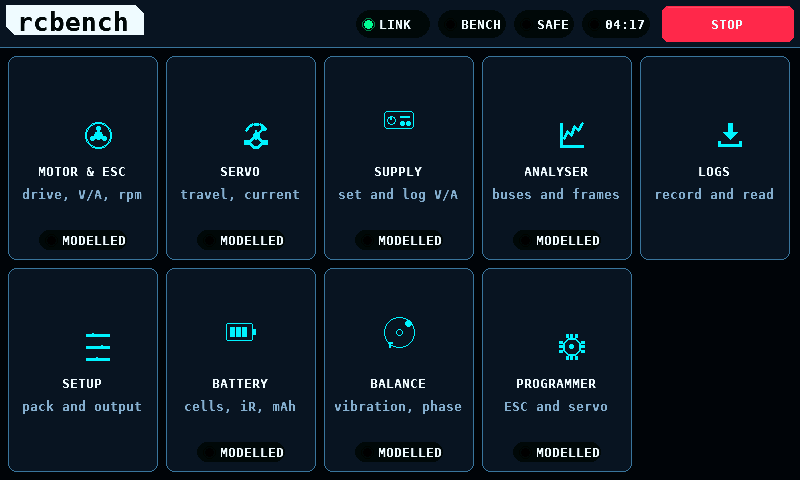

| Marke | Bedeutung |
| --- | --- |
| SOON | den Bildschirm gibt es nicht; die Kachel nennt, was er tun wird und worauf er wartet |
| MODELLED | den Bildschirm gibt es und er funktioniert, aber seine Hardware ist nicht bestückt; jeder Wert ist simuliert, und der Bildschirm sagt das |
| keine | die Hardware ist bestückt, die Messwerte sind gemessen |

Die Marke wird aus den Capability-Bits abgeleitet, die der Koprozessor beim
Hochfahren meldet. Ein Bildschirm ohne seine Hardware öffnet trotzdem und
arbeitet aus dem Modell. SUPPLY trägt MODELLED, solange der PD mini in SETUP
unter INTERFACES abgeschaltet ist, unabhängig davon, was der Koprozessor
meldet: Das Panel rechnet dann sein eigenes Modell eines Netzteils.

Das Menü im hellen Theme:

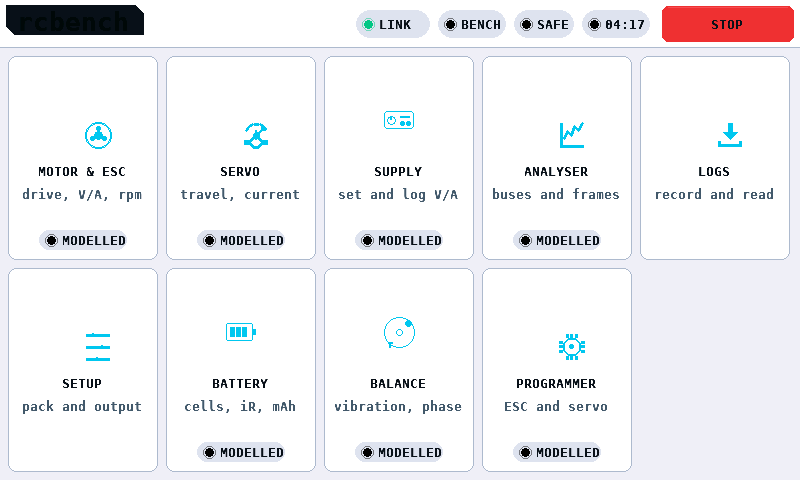

## Splash

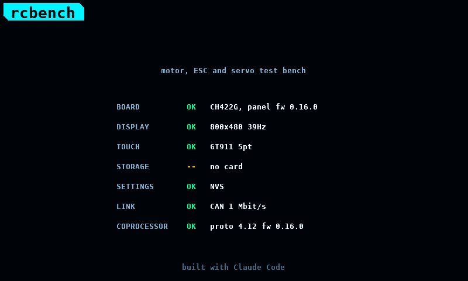

Jedes Subsystem meldet beim Hochfahren sein Ergebnis: Platine, Display,
Touch, SD-Karte, Einstellungen, Link, Koprozessor. Die Zeile der Platine
trägt die Firmware-Version des Panels selbst, die Zeile des Koprozessors die
Protokollversion und die Firmware-Version, die dieser Koprozessor gemeldet
hat — zwei Platinen können dasselbe Protokoll sprechen und verschiedene
Builds sein, und hier zeigt sich das. Eine fehlende Karte ist
eine Warnung. Ein Touch-Controller, der nicht antwortet, oder ein Koprozessor
mit einer anderen Major-Version des Protokolls ist ein Fehler, und der
Prüfstand schaltet nicht scharf. Wenn alle Schritte geantwortet haben,
übergibt der Splash nach 1,6 s an das Menü; ein Tippen überspringt das Warten.

## Motor & ESC

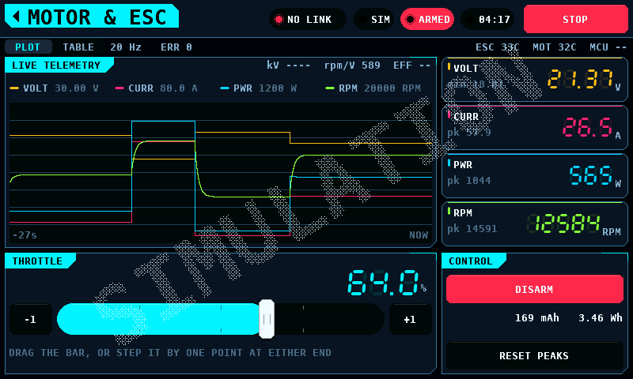

Zwei Spalten. Der Plot und das Gas nehmen die linke, die vier Anzeigen und
die Bedienelemente eine Leiste auf der rechten, damit das Ablesen der Werte
und das Bedienen des Gases nicht um denselben Teil des Bildschirms
konkurrieren.
### Der Plot zeigt einen Lauf

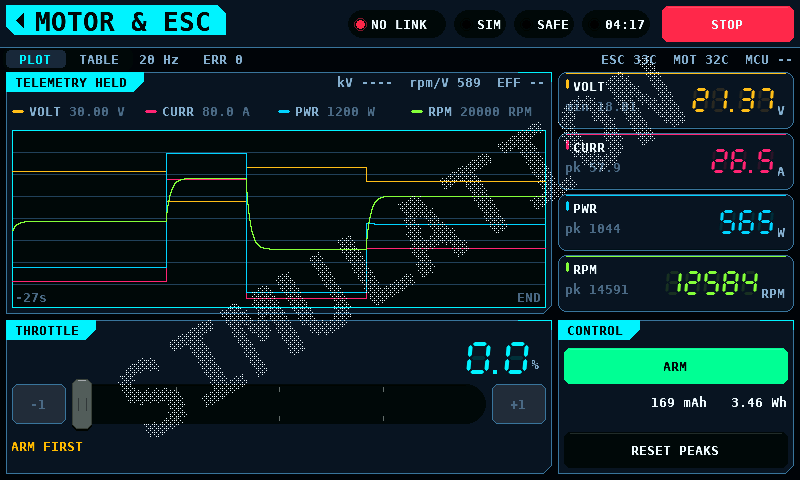

Die Kurve ist die Aufzeichnung eines Laufs. Sie läuft nur, solange der
Prüfstand scharf ist: das Scharfschalten löscht sie, das Entschärfen hält sie
so an, wie sie stand. Die Beschriftung der Fläche liest `LIVE TELEMETRY`,
solange sie läuft, `TELEMETRY HELD`, solange sie einen Lauf hält, und
`TELEMETRY IDLE` vor dem ersten Scharfschalten, wenn im Plot
`no run recorded` steht. Die rechte Achsenbeschriftung liest `NOW`, solange
sie läuft, und `END` dort, wo eine gehaltene stehen geblieben ist. Die
Anzeigen, die TABLE-Seite, die Summen und die Temperaturleiste sind
jederzeit live, ob scharf oder nicht.

Das Fenster ist 534 Spalten breit bei 20 Abtastungen je Sekunde, also 26,7 s.
Ein längerer Lauf hält seine letzten 26,7 s; was davor liegt, steht in der
CSV-Datei und nicht auf dem Bildschirm.

Die Kurve endet beim Entschärfen, nicht wenn der Motor steht. Das Entschärfen
kommandiert null Gas, und die Luftschraube läuft danach aus. Dieses Auslaufen
steht auf den Anzeigen und nicht im Plot, und auch nicht in der CSV-Datei, die
an derselben Flanke schliesst.

Das Scharfschalten löscht den Plot, und ein eingerasteter Stopp wird durch
Scharfschalten gelöst -- die Kurve eines Laufs, den ein STOP beendet hat,
überlebt es also nicht, den Prüfstand wieder benutzbar zu machen. Ein
Scharfschalten schreibt eine CSV-Datei, und der Log-Viewer stellt sie dar.


Der Streifen über beiden Spalten trägt die Abfragerate, die Fehlerzahl des
Links (CRC-Fehler und Resyncs zusammengezählt; CRC: Cyclic Redundancy Check)
und drei Temperaturen. ESC und MOT kommen von der Bench-Page. MCU ist der
eigene Die des Panels, gelesen vom Sensor des ESP32-S3: die Temperatur der
Displayplatine, nicht die des Koprozessors.

Das Gas bewegt sich um die Strecke, die ein Finger zurücklegt, nicht auf die
Stelle, an der er landet. Ein Druck auf den Track kommandiert nichts, eine
Berührung am Ende fordert also nichts an; ein Drag über den ganzen Track
fordert den ganzen Weg an, und der Pin folgt ihm ohne Rampe. `-1` und `+1` an
den Enden des Tracks schalten um einen Prozentpunkt.

ARM wird gehalten. Die Füllung blendet über zwei Sekunden von Grün ins
Gefahrenrot, und der Prüfstand schaltet scharf, wenn die Blende
durchgelaufen ist; früher loszulassen schaltet nichts scharf, und das
Loslassen selbst ebenfalls nicht.

Der Finger muss auf dem Button bleiben. Verlässt er ihn, ist das Halten
abgebrochen — die Geste ist der Kontakt mit dem Bedienelement und nicht mit
dem Panel. Zurückrutschen setzt es nicht fort: der Kontakt ist für ARM
beendet, und Scharfschalten verlangt danach, den Finger abzuheben und neu zu
drücken. Wird der Prüfstand unter einem noch gehaltenen Finger unscharf,
endet die Geste ebenfalls — sonst würde genau der Kontakt, mit dem angehalten
wurde, zwei Sekunden später wieder scharf schalten. Das Scharfschalten lässt den ganzen Button
zweimal aufblitzen: weiss, schwarz, rot, und noch einmal, je ein gezeichneter
Frame. Ein scharfer Prüfstand trägt das Gefahrenrot, und DISARM ist ein Druck
und kein Halten: Anhalten braucht nie ein Halten. DISARM und STOP halten den
Ausgang sofort an, ohne Rampe. RESET PEAKS löscht die Spitzenwertmarken und
lässt die Live-Anzeigen unverändert.

### EFF ist eine Guessimetrik

Der Header des Telemetrie-Panels zeigt die Nenn-kV, die Umdrehungen je Minute
und Volt, die der Motor tatsächlich dreht, und EFF: das Zweite geteilt durch
das Erste.

Die Rechnung dahinter ist tragfähig. Die Klemmenspannung teilt sich in den
ohmschen Abfall und die Gegen-EMK (elektromotorische Kraft) auf, weshalb rpm/V
unter Last die Nenn-kV skaliert mit dem Anteil der Spannung ist, der die
Gegen-EMK erreicht, und dieser Anteil ist der Anteil der Eingangsleistung, der
mechanisch wird. Im idealen Motor ist das Verhältnis exakt der
Umsetzungswirkungsgrad.

Die Zahl auf dem Bildschirm ist das nicht, aus drei Gründen, und sie heisst
deshalb EFF und nicht Wirkungsgrad:

- Sie erfasst nur die Kupferverluste (I hoch 2 mal R). Eisenverluste, Reibung
  und Luftwiderstand fallen auf die mechanische Seite der Aufteilung, also ist
  die Zahl eine obere Schranke des Wellenwirkungsgrads und nicht sein Wert.
- Der Prüfstand misst die Pack-Spannung, nicht die Klemmen des Motors, also
  stecken die Durchlass- und Schaltverluste des ESC in der Zahl. Sie
  beschreibt den Antriebsstrang; ein Vergleich mit einem Motordatenblatt
  vergleicht zwei verschiedene Dinge.
- Sie ist nur so gut wie die Nenn-kV. Ein Fehler dort geht direkt in den
  Prozentwert, und ein Wert über 100 % bedeutet, dass die Nennangabe falsch
  ist; der Bildschirm zeigt das, statt es zu verbergen, gedeckelt bei 199 %.

Die Nenn-kV kommt vom angeschlossenen ESC, sobald einer sie meldet. Noch
meldet sie keiner, also ist es in der Praxis die Einstellung `Rated kV`, deren
Standardwert null ist: eine geratene kV ergibt einen plausibel aussehenden,
aber falschen Prozentwert, und ohne Wert bleibt das Feld leer und es wird kein
Prozentwert gezeigt. Die gemessene rpm/V wird in jedem Fall gezeigt, weil sie
eine Messung und keine Herleitung ist.

Solange die Werte simuliert sind, steht SIMULATION quer über dem Bildschirm.
Das Panel simuliert nur, solange kein Koprozessor antwortet; das Watermark
verschwindet also, sobald einer antwortet. An seine Stelle tritt, was dieser
Koprozessor tatsächlich messen kann: heute rpm über Bidirectional DShot, und
seine eigenen Sensoren, sobald ein Messfrontend bestückt ist. Eine Größe, die
nichts misst, wird als leeres Feld gezeichnet und nicht als modellierter
Wert.

## Servo

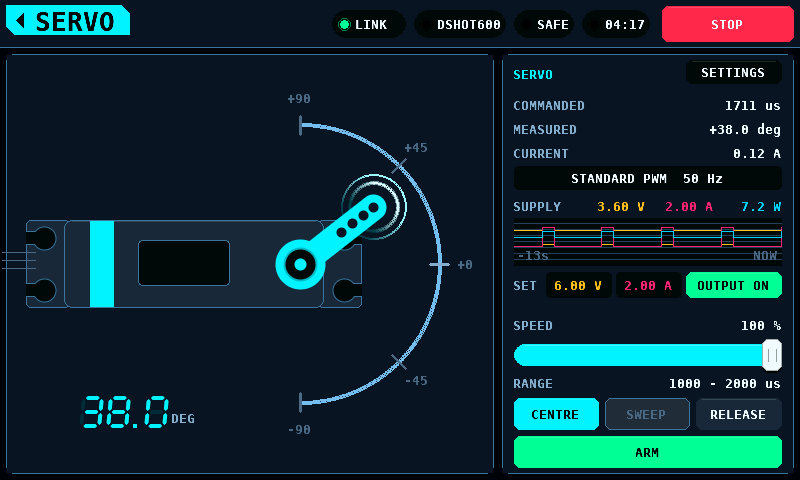

An beliebiger Stelle auf dem Bogen ziehen, um eine Stellung zu befehlen. Der
kräftige Arm ist die gemessene Stellung, der blasse Arm die befohlene. Der
Abstand zwischen beiden ist die Verzögerung des Servos selbst. Die Ringe um
die Spitze pulsieren, solange das Servo angesteuert wird. Den Finger zu heben
lässt noch nicht los: Der Bildschirm wiederholt die letzte Stellung alle
SERVO_HOLD_MS, ein Servo bleibt also stehen, wo es hingestellt wurde. Erst
**RELEASE**, die Schaltfläche, führt die Ruderflächen auf die Mitte zurück --
und auch dann bleiben die Pins gebunden und treiben weiter, auf der Mitte
ihres Wegs. Beendet werden die Flanken durch ein Entschärfen oder durch das
Verlassen des Bildschirms, was entschärft.

Der Bildschirm treibt die Kanäle, die die Bindung als Ruderflächen markiert,
und weder einen festen Pin noch ein festes Protokoll. Die acht Kanäle von PPM
sind ebenfalls Ruderflächen, ein gebundener PPM-Ausgang bewegt sich also mit
diesem Bildschirm genau wie ein gebundener SERVO-PWM-Ausgang. Ist überhaupt
kein Ruderflächen-Kanal gebunden, kommandiert er nichts und kein Pin bewegt
sich.

SPEED ist die Geschwindigkeit, mit der der Prüfstand den Ausgang bewegen
darf, und nicht nur eine Geschwindigkeit für die Zeichnung. Bei 100 % geht
der Befehl unverändert durch und das Servo läuft mit seiner eigenen
Geschwindigkeit; darunter rampt der Prüfstand den Befehl davor, 30 % braucht
also dreimal so lange wie 90 %. Die Änderung wirkt sofort auf einen
gehaltenen Ausgang.

**Vor jeder Bewegung ARM.** Solange der Prüfstand nicht scharf ist, schreibt
der Koprozessor auf jeden PWM-Pin einen Impuls der Länge null: der Arm auf dem
Bildschirm folgt dem Finger, das Servo nicht. Der Knopf ist ein
Zwei-Sekunden-Halten, dieselbe Geste und dieselbe Blende wie auf MOTOR & ESC,
und ein Druck darauf im scharfen Zustand schaltet unscharf. Das Verlassen des
Bildschirms schaltet unscharf und gibt den Pin frei: ein Bildschirm, den man
nicht sieht, darf weder ein Servo halten noch den Prüfstand scharf
zurücklassen.

Die rechte Karte zeigt, was befohlen und gemessen ist, Typ und Bildwiederholrate,
die gelten -- in der Gefahrenfarbe, solange sie ein Servo zerstören können, das
nicht dafür gebaut ist -- und das Netzteil, das das Servo versorgt: Spannung,
Strom und Leistung, abgelesen und über die letzten 13 s geplottet. Ohne Sample
vom Netzteil stehen dort `--`.

**Das Netzteil wird auch hier eingestellt und geschaltet.** Die Zeile SET
unter dem Plot trägt die beiden Sollwerte von SUPPLY, Spannung und
Strombegrenzung, und seinen Ausgangsschalter. Es sind die von SUPPLY, keine
Kopie: eine Änderung auf einem Bildschirm ist die Änderung auf beiden.

- Ein Tippen auf einen Sollwert öffnet das Keypad über der linken Karte. Ein
  Wert außerhalb der Grenzen wird hineingeholt, wie auf SUPPLY.
- Ist der Ausgang an, wartet ein getippter Sollwert auf die Rückfrage von
  SUPPLY, OUTPUT IS ON, mit APPLY und CANCEL, außer SUPPLYs SETTINGS, CONFIRM
  WHILE ON, KEYPAD ist aus. Die Rückfrage verschwindet unbeantwortet, wenn
  der Ausgang ausgeht.
- Eine Spannung, die von 6,0 V oder darunter auf mehr als 6,0 V erhöht wird,
  öffnet die Warnung HV SERVOS ONLY: Standardservos sind für 4,8 bis 6,0 V
  ausgelegt, darüber arbeitet nur ein als HV (high voltage) spezifiziertes
  Servo innerhalb seiner Spezifikation; ein Standardservo kann darüber sofort
  zerstört werden. Die Spannung gilt erst, nachdem HOLD
  TO APPLY 2 s gehalten wurde, dieselbe Geste wie bei der Profilwarnung;
  CANCEL verwirft sie. STOP beendet das Halten. Bei eingeschaltetem Ausgang ersetzt sie die Rückfrage
  von SUPPLY und bleibt stehen, wenn der Ausgang ausgeht. Eine Spannung, die
  schon über 6,0 V liegt, ändert sich ohne sie. Eine auf SUPPLY eingestellte
  Spannung öffnet sie nicht.

  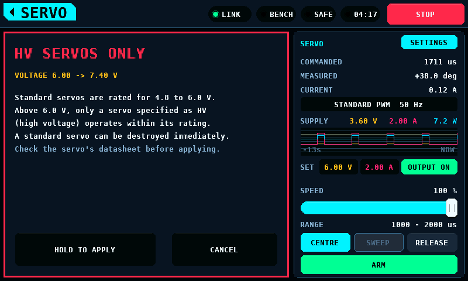

- OUTPUT ON ist ein Halten über zwei Sekunden, OUTPUT OFF ein Tippen, wie auf
  SUPPLY. STOP beendet ein laufendes Halten. Liegt der Spannungssollwert über
  6,0 V, gleich wo er eingestellt wurde, öffnet OUTPUT ON stattdessen HV
  SERVOS ONLY mit der Spannung, und der Ausgang geht erst an, nachdem HOLD TO
  APPLY 2 s gehalten wurde; das Halten des Schalters selbst und ein Tippen
  auf APPLY schalten nichts ein. Ein Sollwert, der während des gewöhnlichen
  Haltens über 6,0 V steigt -- auf SUPPLY, oder nach einem Lauf
  zurückgesetzt --, wird beim Abschluss des Haltens gesehen: HV SERVOS ONLY
  öffnet sich, und nichts geht an. Beim Verlassen von SERVO bleibt
  der Ausgang, wie er ist; ein Druck auf OUTPUT OFF beim Verlassen wird als
  das OFF gesendet, das er war.

**SWEEP fährt das Servo eine Kurve ab**, auf dem Koprozessor, wo das Timing
nicht vom Link abhängt: CURVE (Rechteck, Sinus oder Dreieck), SPEED (0,05 bis
5 Zyklen je Sekunde) und DWELL (die Haltezeit an jedem Ende) von der
TEST-Seite, um PULSE CENTRE herum. RANGE ist ein Anteil des Wegs, den das
Servo machen darf: von TRAVEL und vom näheren von PULSE MIN und MAX, damit die
Kurve kein Ende erreicht, das sie nicht erreichen darf. SPEED auf der rechten
Karte begrenzt sie wie ein Ziehen, Trim gilt nicht. Das Horn folgt derselben
Kurve, im Panel gerechnet und ab dem Moment, in dem der Koprozessor seine
gestartet hat. Während sie läuft, heißt der Knopf HOLD; ein Tippen hält die
Kurve dort an, wo der Ausgang gerade steht -- SPEED kann ihn hinter der Kurve
zurücklassen --, und hält ihn dort. Das Halten übernimmt der Koprozessor,
weil nur er genau weiß, wo das ist; ohne Rückmeldung ist das im Panel
gezeichnete Horn eine Schätzung davon. Ein HOLD wartet nicht hinter
Sweep-Schreibvorgängen, die schon auf dem Draht sind. Ein HOLD, den der Link
500 ms nicht wiederholt hat, hat das andere Ende losgelassen; das Panel gibt
die Surfaces dann zur Mitte frei, und das Horn geht dorthin. Ein Finger auf der
Skala, CENTRE, RELEASE, ein Disarm und das Verlassen des Screens beenden sie
ebenfalls, und verlorene Touch-Ereignisse halten sie an wie HOLD. Eine geänderte Einstellung startet sie mit der neuen Kurve neu; ein
geändertes Profil oder eine geänderte Frame Rate geht sofort mit.
SWEEP gibt es bei scharfem Prüfstand und einem Koprozessor mit Protokoll 4.2;
der Koprozessor hält eine Kurve an, die das Panel 500 ms nicht wiederholt hat,
und lässt jede Surface dort stehen, wo ihr Ausgang gerade ist.

**START TEST startet den automatischen Test** auf der TEST-Seite: das Servo
wird durch die dort gewählten Spannungen geführt, sein Strom in Ruhe, in
Bewegung und beim Halten gemessen, seine Stellzeit gemessen, und die
Spannung gesucht, bei der es sich nicht mehr bewegt. [Servoverfahren](Servo-de.md#automatischer-test)
beschreibt das Verfahren und die Dateien. START TEST braucht einen scharfen
Prüfstand und ein Netzteil, das antwortet; die Zeile darunter sagt ARM FIRST,
A STEP IS OUTSIDE THE CAPS (eine gewählte Stufe über der geltenden
Spannungsgrenze, geprüft, bevor eine Warnung aufgeht), LAST REPORT STILL
WRITING oder, warum ein Lauf abgelehnt wurde, und folgt dem Prüfstand, wenn
sich das ändert. Es ist ein Halten über zwei Sekunden,
die Geste von OUTPUT ON, weil ein Lauf das Netzteil einschaltet und das Servo
bewegt. Ist HV SERVO an und eine Stufe über 6,0 V gewählt, öffnet ein Tippen
stattdessen HV SERVOS ONLY mit der höchsten Stufe, und der Lauf startet erst,
nachdem HOLD TO APPLY 2 s gehalten wurde. HV SERVO gilt für die Sitzung:
jeder Neustart schaltet es aus.

Die Einstellungen schließen sich beim Start, und Stufe und Phase stehen oben
auf der linken Karte. Der Lauf führt das Servo und die Sollwerte und den
Schalter von SUPPLY, bis er endet. Er endet vorzeitig, mit ausgeschaltetem
Ausgang und dem Servo zur Mitte freigegeben, bei STOP TEST (auf der linken
Karte oder der TEST-Seite), STOP, einem Disarm, wenn der Link geht, beim
Verlassen des Screens, bei einem Finger auf der Skala, CENTRE, SWEEP,
RELEASE, einem Tippen auf einen Sollwert, einer Änderung an Typ, Impulsen,
Trim, Weg, Reverse oder SPEED des Servos, bei verlorenen Touch-Ereignissen
und beim Netzteil: siehe [die Liste](Servo-de.md#was-einen-lauf-beendet).
Ist ein Lauf vorbei, gehen die Sollwerte von SUPPLY auf ihre Werte vor dem
Lauf zurück, gleich welcher Screen oben ist. Das wartet, bis das OFF des
Laufs gesendet ist, ein danach genommener Messwert den Ausgang aus zeigt,
kein ON unterwegs ist und OUTPUT ON nicht gehalten wird. Sollwerte, die nach
dem Ende des Laufs geändert wurden, bleiben, wie sie sind.

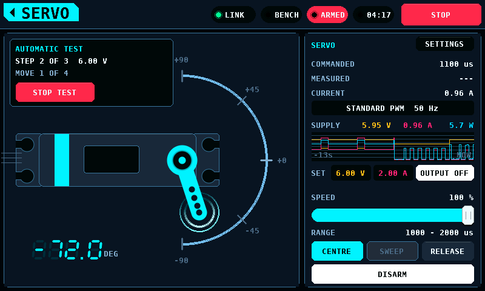

Das Ergebnis bleibt bis CLOSE auf der linken Karte: PASS, FAIL oder ABORTED
und der Grund, die längste Stellzeit und der höchste Haltestrom, und die
Dateien, die die Karte angenommen hat: `BENCHnnn.CSV`, und `+ .TXT`, sobald
die Karte den Bericht vollständig angenommen hat.

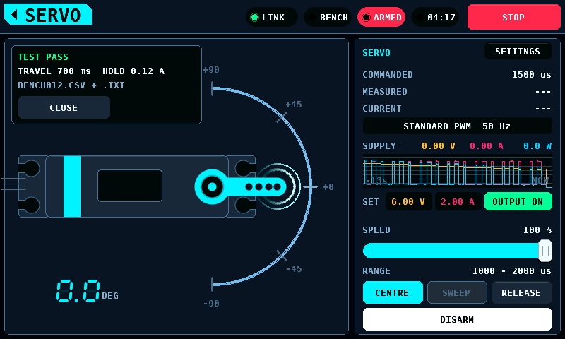

### Einstellungen

SETTINGS, oben auf der rechten Karte, öffnet die Einstellungen des Servos über
der linken Karte. ARM, CENTRE, RELEASE und STOP bleiben, wo sie sind, und
funktionieren. Ein Wert öffnet die Tastatur, eine Liste eine Liste, ein
Schalter kippt beim Tippen, und der Name öffnet eine Buchstabentastatur.

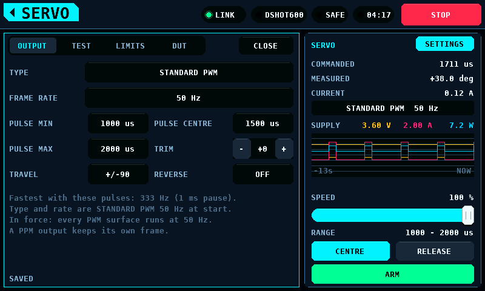

| Seite | Einstellung | Wirkung |
| --- | --- | --- |
| OUTPUT | TYPE | das Servoprofil: STANDARD PWM, NARROW 760, WIDE, HELI CYCLIC oder HELI TAIL 760 |
| OUTPUT | FRAME RATE | wie oft ein Impuls gesendet wird; die Liste des Typs oder CUSTOM über die Tastatur |
| OUTPUT | PULSE MIN, CENTRE, MAX | die Impulsbreiten, auf die der Weg abgebildet wird, 400 bis 2500 us: -90 Grad ist MIN, 0 ist CENTRE, +90 Grad ist MAX, und RELEASE ruht auf CENTRE. Ein Ende liegt nicht weiter von CENTRE entfernt als CENTRE von 400 us oder 2500 us |
| OUTPUT | TRIM | zur Mitte addiert, 5 us je Schritt, bis 200 us in jede Richtung |
| OUTPUT | TRAVEL | wie weit der Arm in jede Richtung darf, 10 bis 90 Grad |
| OUTPUT | REVERSE | die Richtung, in der der Winkel auf den Impuls abgebildet wird |
| TEST | CURVE, SPEED, RANGE | die Bewegung von SWEEP: Rechteck, Sinus oder Dreieck, 0,05 bis 5 Hz, 10 bis 100 % des Wegs. Der automatische Test springt zwischen den Enden, die RANGE ergibt |
| TEST | LENGTH BY, TEST TIME, MOVEMENTS | wie lange jede Spannungsstufe läuft: eine Zeit oder eine Zahl von Bewegungen |
| TEST | DWELL, SETTLE | Haltezeit an jedem Ende; Wartezeit nach einer Spannungsstufe vor dem Messen |
| TEST | STEP 4,8 / 6,0 / 7,4 / 8,4 V, BROWN-OUT | die Spannungsstufen und der Brown-out-Lauf ab 5,0 V abwärts; 7,4 und 8,4 V laufen nur mit HV SERVO an |
| TEST | HV SERVO | nimmt die Stufen 7,4 und 8,4 V hinzu, vorgegeben aus und nach jedem Neustart aus; ein Lauf mit ihnen startet nur über HV SERVOS ONLY |
| TEST | START TEST | der automatische Test: 2 s Halten bei scharfem Prüfstand; STOP TEST, solange er läuft |
| LIMITS | VOLTAGE MAX, CURRENT MAX | die Grenzen des Bildschirms SUPPLY, dieselben Einstellungen |
| LIMITS | STALL AT | über diesem Strom gilt das Servo als blockiert |
| LIMITS | IDLE CURRENT, HOLD CURRENT, TRAVEL TIME | Pass/Fail-Grenzen; 0 wird nicht geprüft |
| DUT | NAME | das Testobjekt, bis 23 Zeichen, für den Bericht |
| DUT | REPORT | ein Textbericht neben dem Log jedes Tests |

| Typ | Mitte | Weg | Bildwiederholraten |
| --- | --- | --- | --- |
| STANDARD PWM | 1500 us | 1000-2000 us | 50, 60, 100, 150, 200, 250, 300, 333 Hz |
| NARROW 760 | 760 us | 660-860 us | wie STANDARD PWM |
| WIDE | 1500 us | 800-2200 us | wie STANDARD PWM, bis 312 Hz |
| HELI CYCLIC | 1520 us | 820-2220 us | 50, 120, 200, 333 Hz |
| HELI TAIL 760 | 760 us | 410-1110 us | 200, 333, 560 Hz |

Ein Impuls braucht eine Pause vor dem nächsten Frame. STANDARD PWM, NARROW 760
und WIDE halten mindestens 1 ms zwischen den Impulsen, ihre höchste Rate ist
also 1 / (längster Impuls + 1 ms): 333 Hz bei 2000 us. Die Heli-Profile laufen
mit den Raten, die Rotorflight für digitale Taumelscheiben- und
Schmalband-Heckservos nennt, mit mindestens 0,5 ms zwischen den Impulsen. Eine
Rate, die den Impulsen keine Pause lässt, wird abgelehnt, ebenso ein längerer
PULSE MAX bei einer Rate, in die er nicht passt. Die Pause gilt nach dem
längsten Impuls, den der Koprozessor ausgeben kann, dem oberen Ende des
Bereichs, den ein Befehl trägt: PULSE MAX, oder darüber hinaus, wenn CENTRE
nicht in der Mitte liegt, um so viel, wie CENTRE näher an MAX liegt als an MIN.
Ein CENTRE, der dieses Ende über die Pause der Rate schieben würde, wird
ebenfalls abgelehnt.

**Ein Heli-Typ oder jede Bildwiederholrate über 60 Hz kann ein Servo zerstören,
das nicht dafür gebaut ist.** Die Wahl öffnet eine Warnung in der
Gefahrenfarbe, die nennt, was gewählt ist und was es mit einem nicht dafür
gebauten Servo macht; angewendet wird es erst, nachdem HOLD TO APPLY 2 s
gehalten wurde. CANCEL, ein abrutschender Finger, ein Touch-Verlust und das
Verlassen des Bildschirms wenden nichts an. Typ und Rate bleiben auf der
rechten Karte rot, und jeder Neustart geht auf STANDARD PWM mit 50 Hz zurück:
ein nach einem Neustart angestecktes Servo bekommt nie eine Rate, die für ein
anderes gedacht war.

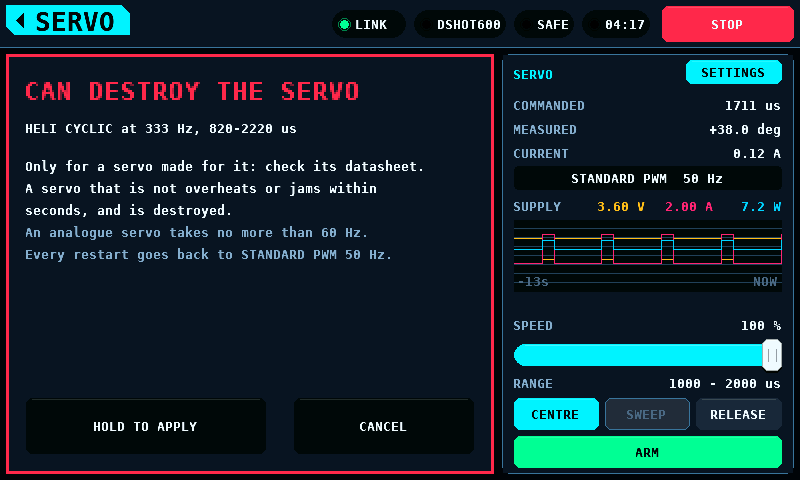

**Die Frame Rate erreicht die Pins** über die SERVO-Page des Koprozessors
(Protokoll 4.1). Sie gilt für jeden PWM-Ausgang, dessen erster Kanal die Rolle
surface hat; ein PPM-Ausgang behält seinen eigenen Frame. Sie geht mit jeder
gehaltenen Stellung hinaus, und ein Profilwechsel, während das scharfe Servo
ruht, setzt die Ruhelage mit ihr neu; einer, der während eines laufenden Arm
geschieht, ist der, den der Arm verwendet. Eine schnellere Rate folgt den
Impulsbreiten, sobald alle angekommen sind; jede andere Rate geht ihnen voraus,
und nichts Breiteres geht hinaus, bevor sie angekommen ist. So tragen die Pins
nie eine schnelle Rate mit den breiteren Impulsen eines langsameren Profils.
Die OUTPUT-Seite sagt, was aus ihr wurde:

| Hinweis | Bedeutung |
| --- | --- |
| In force | jede PWM-Surface läuft mit der angezeigten Rate |
| The rate goes with the next position | noch nicht geschrieben |
| REFUSED | eine Surface teilt sich einen PWM-Slice mit einem Ausgang auf einer anderen Rate; die Pins behalten ihre Rate |
| This coprocessor takes no frame rate | Protokoll 4.0: jeder PWM-Ausgang läuft mit den 50 Hz seiner Bindung |

Ein Neustart des Koprozessors und jede auf OUTPUTS geschriebene Bindung setzen
jeden Slot auf seine eigene Rate zurück, 50 Hz für ein Servo; der Screen sendet
seine Rate mit der nächsten Stellung erneut, gegen die dann geltende Bindung.
Eine Bindung wird nicht geschrieben, solange das Zurücksetzen auf die eigene
Rate jedes Slots unbeantwortet bleibt, und der Prüfstand wird von keinem
Screen aus scharf, solange die Rate der Surfaces nicht bekannt ist: Der Arm
wird mit `servo frame rate not known -- arm again` abgelehnt, und ein Arm, der
bei unterbrochenem Link gemacht wurde, erreicht den Koprozessor erst, wenn das
Zurücksetzen angekommen ist.

Die OUTPUT-Einstellungen und HV SERVO gelten für die Sitzung; die übrigen
Einstellungen unter TEST, LIMITS und DUT liegen im NVS (Non-Volatile Storage)
und werden wie bei SUPPLY geschrieben.

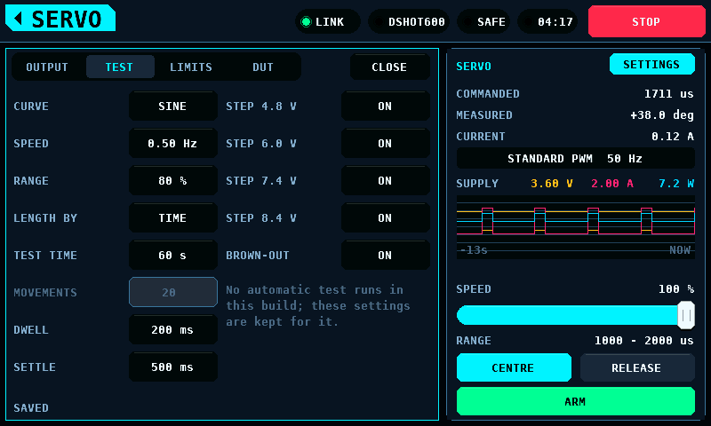
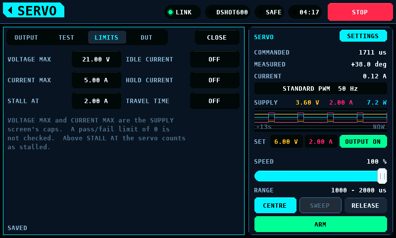
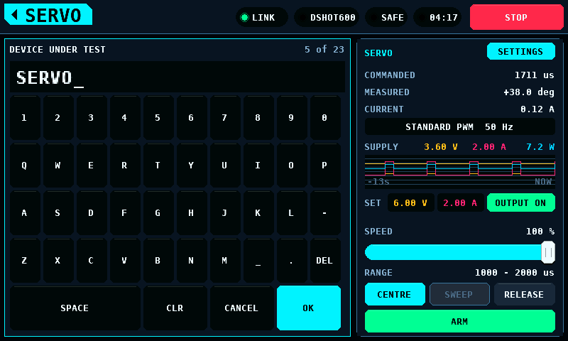

Aktuelle Einschränkungen:

- Bis der Screen eine Stellung sendet, laufen die Pins mit der Rate, die die
  SERVO-Page hält; nach einem Neustart oder einer neuen Bindung sind das 50 Hz.
- Der automatische Test ist nicht auf Hardware gelaufen, und am
  Netzteilmodell des Panels sind seine Ströme die Last des Modells, nicht die
  des Servos: ein Lauf dort misst das Modell. [Was nicht gemessen ist](Servo-de.md#nicht-auf-hardware-gelaufen).
- Das Netzteil auf der rechten Karte ist das von SUPPLY: der PD mini, wenn
  SETUP ihn einschaltet, sonst das Modell des Panels, dessen Spannung, Strom
  und Leistung simuliert und nicht gemessen sind.

## Netzteil

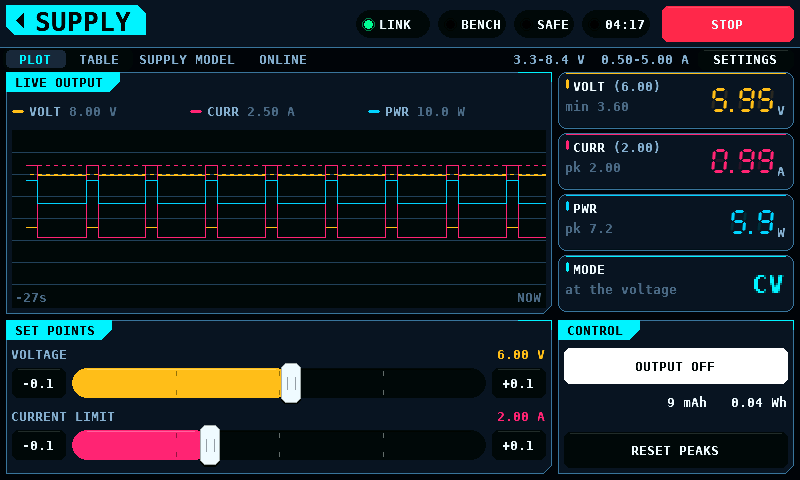

Stellt ein programmierbares Netzteil ein, schaltet es und zeichnet es auf: den
PD mini, einen USB-PD-Trigger (USB Power Delivery), der über einen UART
(Universal Asynchronous Receiver-Transmitter) gesteuert wird. Der
Koprozessor steuert ihn über einen PIO-UART (PIO: Programmable
Input/Output) auf zwei seiner Pins, über die SUPPLY-Link-Page (Protokoll
4.3). Das Panel schreibt die Page und liest sie alle 100 ms. Ist der PD mini
in SETUP unter INTERFACES eingeschaltet, sagt die Kopfzeile PD MINI. Ist er
abgeschaltet, rechnet das Panel an seiner Stelle ein Modell eines
Netzteils: die Kopfzeile sagt SUPPLY MODEL, und die Kachel im Menü trägt
MODELLED. Gegen ein Modul ist der PD mini noch nicht gelaufen.

Das Layout ist das von MOTOR & ESC. Der Plot zeigt Spannung, Strom und
Leistung der letzten 27 s. Die Leiste rechts zeigt die Messwerte, die
niedrigste Spannung des Laufs und seinen höchsten Strom und seine höchste
Leistung. MODE sagt, welchen Sollwert das Netzteil hält: CV (constant voltage)
bei der eingestellten Spannung oder CC (constant current) an der
Strombegrenzung. CC steht in der Warnfarbe: ein Netzteil in CC liefert der
Last nicht die Spannung, auf die es gestellt ist.

Ein Sollwert steht neben seinem Messwert. VOLT und CURR tragen ihn in Klammern
hinter dem Namen, und der Plot zeichnet ihn gestrichelt in der Farbe und auf
der Skala des Messwerts. TABLE führt beide auf. Der Wert in Klammern ist der
Sollwert, den das Netzteil zu halten meldet; solange es nicht antwortet, der
des Bildschirms.

| Sollwert | Modell | PD mini | Knöpfe |
| --- | --- | --- | --- |
| VOLTAGE | 3,3 bis 21 V, Schritte von 20 mV | 1 bis 20 V, Schritte von 10 mV | 0,1 V |
| CURRENT LIMIT | 0,5 bis 5 A, Schritte von 50 mA | 0,05 bis 3 A, Schritte von 10 mA | 0,1 A |

Die Bereiche des Modells sind das weiteste Profil einer USB-PD-PPS-Quelle
(Programmable Power Supply), 3,3 bis 21 V bei bis zu 5 A. Die des PD mini
stammen von der Seite des Herstellers und sind nicht gemessen. Der PD mini
ist ein Abwärtswandler und gibt nicht mehr ab, als er bekommt: seine
Spannung ist zusätzlich auf 0,5 V unter der Eingangsspannung begrenzt, die
er meldet, an 5 V Eingang also höchstens 4,5 V. Ein Sollwert über dem
Eingang bringt das Modul in ERR, bis es stromlos war; die 0,5 V Abstand
sind nicht gemessen. Beide engen
die Grenzen unter SETTINGS ein, und die Schieber folgen dem Netzteil, das
in Gebrauch ist. Ein Tippen auf eine Spur setzt den Wert unter dem Finger.

**Ein Tippen auf die Karte VOLT oder CURR oder auf den Wert eines Sollwerts
öffnet eine Tastatur** über der linken Spalte. Sie zeigt den Bereich in der
Titelzeile und den aktuellen Wert blass, bis eine Ziffer getippt ist. OK
übernimmt einen Wert im Bereich, gerundet auf den Schritt des Netzteils; ein
Wert außerhalb wird abgelehnt, und der Bereich wechselt in die Warnfarbe. OK
ohne Eingabe und CANCEL lassen den Sollwert, wie er war.

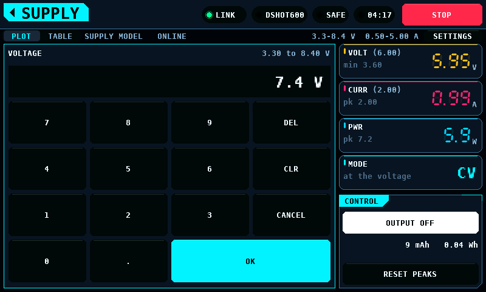

**Eine Änderung an einem eingeschalteten Ausgang fragt zuerst.** Solange der
Ausgang an ist, öffnet ein neuer Sollwert vom Schieber oder seinen
Schrittknöpfen oder von der Tastatur eine Frage, die die Änderung nennt.
APPLY gibt sie dem Netzteil; CANCEL verwirft sie, und der Schieber geht
zurück. Ein Ziehen fragt einmal, beim Loslassen, und bis dahin hält das
Netzteil den alten Sollwert. Bei ausgeschaltetem Ausgang wird nichts gefragt.
SETTINGS schaltet die Frage für den Schieber und für die Tastatur getrennt
ab.

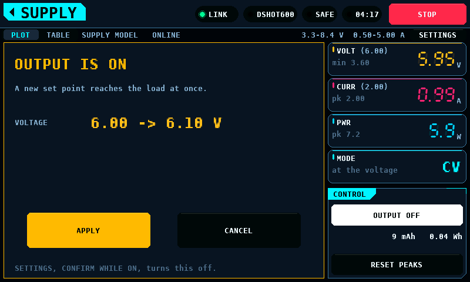

**OUTPUT ON ist ein Zwei-Sekunden-Halten**, dieselbe Geste und dieselbe Blende
wie ARM. OUTPUT OFF ist ein Tippen. STOP schaltet den Ausgang auf jedem
Bildschirm ab. Ebenso jeder andere Stopp, den der Prüfstand zählt -- ein
Touch, der nicht mehr antwortet, ein ON, dessen Touch-Ereignisse verloren
gingen, bevor der Bildschirm es zeigte, und ein Koprozessor, der nicht scharf
bleiben will -- sowie ein Netzteil, das nicht mehr antwortet, und ein Trip.
Der Ausgang bleibt aus, bis er wieder eingeschaltet wird. Das Verlassen des
Bildschirms lässt den Ausgang an, damit ein Servo oder ein ESC am Netzteil auf
dem Bildschirm versorgt bleibt, der es testet; der Bildschirm für den
verlorenen Link, der kein STOP hat, öffnet sich nicht, solange der Ausgang an
ist.

**Mit dem PD mini** geht ein OFF vor allem anderen an die SUPPLY-Page, was
das Panel ihr schuldet, und der Koprozessor schaltet den Ausgang selbst ab,
wenn der Heartbeat des Panels ausbleibt. Ein eingeschalteter PD mini zeigt
NOT ANSWERING, solange kein Koprozessor antwortet, der Protokoll 4.3
spricht, oder solange die Messwerte der Page älter als 1500 ms sind; ein
Ausgang, der an ist, wird dann abgeschaltet. Ebenfalls abgeschaltet, mit
einer Zeile im Band, wird der Ausgang, wenn der Koprozessor ein ON abweist
(kein Heartbeat) oder eines fallen lässt (sein Heartbeat blieb aus, oder er
ist neu gestartet). Schaltet das Modul den Ausgang selbst ab -- sein Überstromschutz oder sein
Knopf --, wird er ebenfalls abgeschaltet und erst mit einem neuen Halten
wieder eingeschaltet. Das Band sagt außerdem, wenn die Pins abgewiesen werden,
wenn der Ausgang nicht schalten will und wenn die Sollwerte nicht übernommen
werden. Eine Änderung der Pins oder der Baudrate und das Ein- oder Ausschalten
des PD mini schalten den Ausgang ab.

OUTPUT ON und OFF, RESET PEAKS und die Messwerte bleiben unter der Tastatur,
der Frage und SETTINGS bedienbar. Ein Finger zur Zeit: solange einer ein
Bedienelement hält, bewirkt ein zweiter Finger nirgends auf dem Bildschirm
etwas.

### Einstellungen

SETTINGS, rechts in der Leiste über beiden Spalten, öffnet die Einstellungen
des Netzteils über der linken Spalte. Jede liegt im NVS (Non-Volatile Storage)
des Panels und übersteht einen Neustart. Ein Wert öffnet die Tastatur, ein
Schalter kippt beim Tippen. Jede Änderung wird im nächsten Frame geschrieben,
in dem der Prüfstand unscharf ist, der Ausgang des Netzteils aus ist und nicht
das Foto der Platine geladen wird, und mit ihr jede ungespeicherte Änderung
aus SETUP: ein Flash-Schreibvorgang hält beide Kerne an, OUTPUT OFF und die
Trips eingeschlossen. Die unterste Zeile sagt SAVED, SAVE WAITING, NOT SAVED
(der Schreibvorgang wurde abgelehnt) oder SETUP CHANGES NOT SAVED: eine
Änderung in SETUP, die ohne SAVE verlassen wurde und die nichts schreibt, bis
SAVE dort oder eine Änderung hier danach fragt.

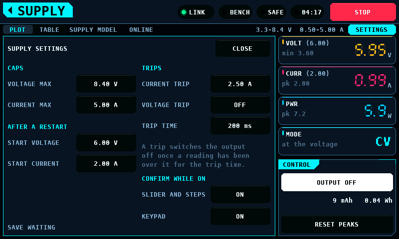

| Einstellung | Bereich | Vorgabe | Wirkung |
| --- | --- | --- | --- |
| VOLTAGE MAX | 3,3 bis 21 V | 21,00 V | die höchste Spannung, die ein Sollwert annimmt |
| CURRENT MAX | 0,5 bis 5 A | 5,00 A | die höchste Strombegrenzung, die ein Sollwert annimmt |
| START VOLTAGE | bis VOLTAGE MAX | 6,00 V | der Spannungs-Sollwert nach einem Neustart |
| START CURRENT | bis CURRENT MAX | 2,00 A | die Strombegrenzung nach einem Neustart |
| CURRENT TRIP | 0 bis 5 A | OFF | Ausgang aus, wenn der Strom TRIP TIME lang darüber lag |
| VOLTAGE TRIP | 0 bis 21 V | OFF | Ausgang aus, wenn die Spannung TRIP TIME lang darüber lag |
| TRIP TIME | 0 bis 5000 ms | 100 ms | wie lange ein Messwert über einem Trip liegt, bevor er auslöst |
| SLIDER AND STEPS | ON, OFF | ON | fragen, bevor der Schieber einen eingeschalteten Ausgang ändert |
| KEYPAD | ON, OFF | ON | fragen, bevor die Tastatur einen eingeschalteten Ausgang ändert |

Eine Grenze, die unter einen Sollwert gesenkt wird, holt den Sollwert sofort
auf sie herunter, und einen Startwert mit ihm. Ein getippter Wert kommt in der
sicheren Richtung auf den Schritt der Einstellung: eine Grenze rundet ab, 12,01 V
erlauben also 12,00 V, und ein Trip über 0 ist mindestens ein Schritt, nie OFF.
Ein Trip von 0 ist aus. Die Zeit über einem Trip zählt ab dem ersten Messwert
darüber. Ein
Messwert unter seinem Trip beginnt die Zählung neu; ein Messwert, der nicht
ankam, lässt sie stehen. Ein Trip schaltet den Ausgang ab, MODE zeigt TRIP,
bis der Ausgang wieder eingeschaltet wird, und das Band sagt, welcher Trip
ausgelöst hat. Das Netzteil hält seine Strombegrenzung in CC, daher löst ein
Strom-Trip auf oder über CURRENT LIMIT nicht aus; unter der Begrenzung
gesetzt, schaltet er eine Last ab, die zu lange zu viel zieht.

Nach einem Neustart ist der Ausgang aus, welche Startwerte auch gelten.

Ist der PD mini das Netzteil, bietet SETTINGS außerdem RESET PD MINI. Das
schaltet den Ausgang ab und startet das Modul neu (sein Befehl
SYSTEM_RESET), für ein Modul, das ERR zeigt -- ein Sollwert über seinem
Eingang bringt es dorthin --, ohne es abzustecken. Etwa 1 s später wird es
wieder gefragt, wer es ist. Ob ein Neustart jedes ERR löst, ist nicht
gemessen. Ein Koprozessor älter als Protokoll 4.4 kann nicht neu starten:
der Ausgang geht aus, und das Band sagt es.

### Das Log

Ein Lauf ist ein Einschalten des Ausgangs. Der Plot leert sich, wenn der
Ausgang angeht, und hält den Lauf, nachdem er ausgeht. mAh und Wh unter dem
Schalter zählen den Lauf aus den angezeigten Messwerten, jeder Schritt auf 1 s
begrenzt. RESET PEAKS beginnt die niedrigsten und höchsten Werte neu ab dem
aktuellen Messwert.

Ein Lauf wird in eine eigene `BENCHnnn.CSV` geschrieben, eine Zeile alle
50 ms:

```
time (s);set (V);voltage (V);limit (A);current (A);power (W);mode;charge (mAh);energy (Wh)
```

Ein Messwert, der nicht ankam, ist eine leere Zelle. `mode` ist CV, CC oder
OFF und leer, solange das Netzteil nicht antwortet. Der Prüfstand hat beim
Log Vorrang: ARM während eines Netzteil-Laufs beendet dessen Datei, und ein
Ausgang, der beim Unscharfschalten noch an ist, beginnt eine neue. Ladung und
Energie dieser Datei zählen von den Summen seit dem Einschalten des Ausgangs
weiter, wie auf dem Bildschirm; ihre erste Zeile beginnt also nicht bei 0. Das
Netzteil wird in seinem eigenen 50-ms-Takt geführt und geloggt, auch während
die Steuer-Task auf den Link wartet; ein Koprozessor, der nicht antwortet,
dünnt weder den Plot noch das Log des Netzteils aus.

Das Modell ist eine Last von 6 Ohm mit einem Stoß von 1,4 A für 0,6 s alle
3 s, hinter einem Quellwiderstand von 0,05 Ohm. Bei den Startwerten, 6,00 V
und 2,00 A, bringt der Stoß es in CC. Seine Messwerte sind nicht gemessen,
und am Prüfstand wird nichts versorgt.

Die Verdrahtung des PD mini -- PD mini, PD mini TX, PD mini RX und PD mini
baud -- steht in SETUP unter INTERFACES. TX und RX sind GPIO-Nummern des
Koprozessors: TX geht zum DM des Moduls, RX kommt von seinem DP. Der
Koprozessor weist einen Pin ab, der reserviert, an einen Ausgang gebunden
oder der andere Pin ist. PD mini baud ist die eigene UART-Baudrate-
Einstellung des Moduls: 9600, 19200 (ab Werk), 38400, 57600, 115200, 230400
oder 460800 Baud, oder AUTO. AUTO, die Vorgabe, lässt den Koprozessor sie
finden: er versucht jede der 7 Raten, eine pro Sekunde. Die Kopfzeile von
SUPPLY zeigt die Rate in Gebrauch hinter ONLINE, z. B. `ONLINE 38400`, bei
AUTO wie bei einer festen Rate.

## Analyser

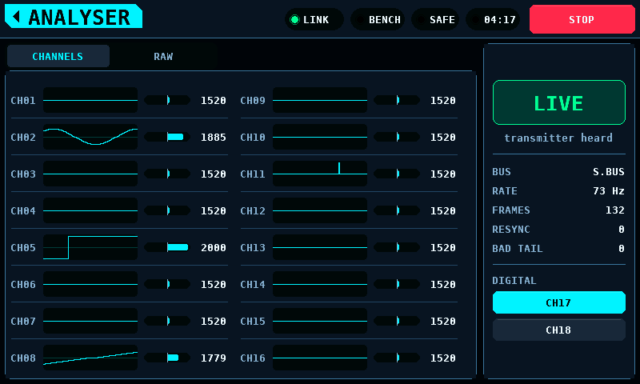

Sechzehn Kanäle, jeder mit 1,5 s Verlauf und einem Balken für den aktuellen
Wert. CH17 und CH18 sind die beiden Digitalkanäle. Ein Glitch ist eine Spitze
in einer Spur; ein Dropout ist eine Kerbe durch alle sechzehn im selben
Moment.

Der Zustandsblock zeigt einen von SILENT, FAILSAFE, FRAME LOST und LIVE, mit
einer Zeile Erklärung:

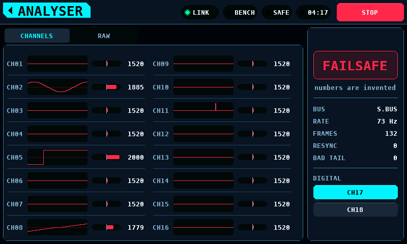

Im FAILSAFE sendet der Empfänger wohlgeformte Werte, die er selbst erzeugt;
jede Spur wird rot gezeichnet. FAILSAFE als Stopp behandeln, nicht als
sechzehn gültige Kanäle. [Empfängerbusse](Receivers-de.md) beschreibt die
Zustände.

## Programmierer

Die Reihenfolge: Geräteklasse, Protokoll, verbinden.

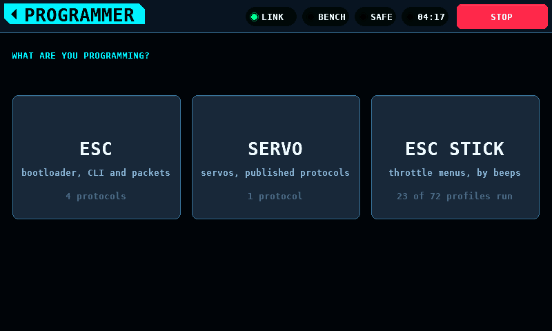

Jede Protokollzeile nennt ihren Transport. Eine automatische Erkennung gibt
es nicht:

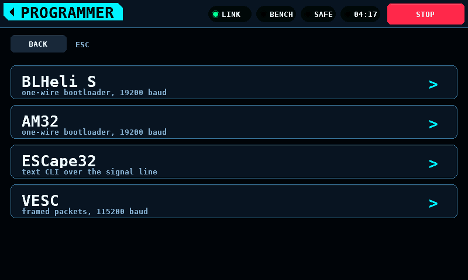

BLHeli_32 steht nicht in der ESC-Liste. Der Prüfstand erkennt diese ESCs,
steuert sie an und sendet die DShot Special Commands, kann ihre Parameter aber
nicht lesen: [BLHeli_32-Parameter](BLHeli32-de.md).

Bevor ein Gerät geantwortet hat, ist nichts editierbar:

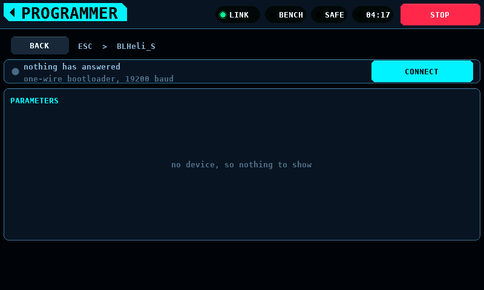

Nachdem ein Gerät geantwortet hat, erscheinen die Parameter in Gruppen, mit
der Hilfe zur ausgewählten Zeile unter der Liste:

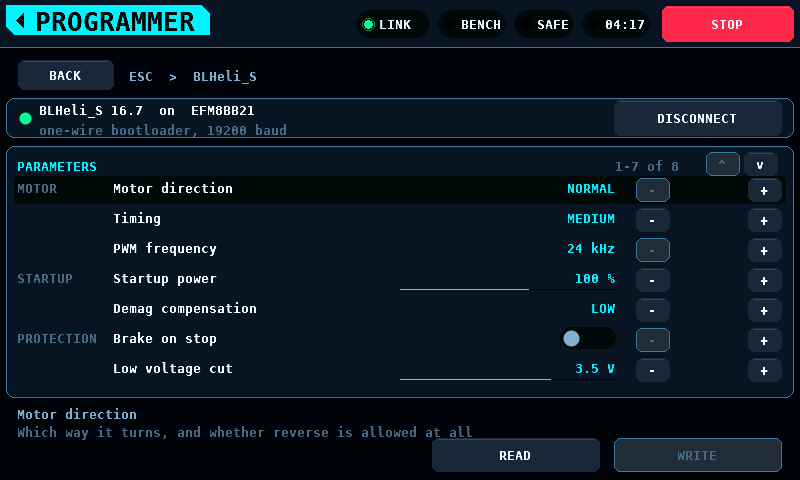

Jede Firmware zeigt ihre Einstellungen in ihren eigenen Einheiten. BLHeli_S
zeigt das Timing als benannte Stufen, die anderen in Grad Vorzündung:

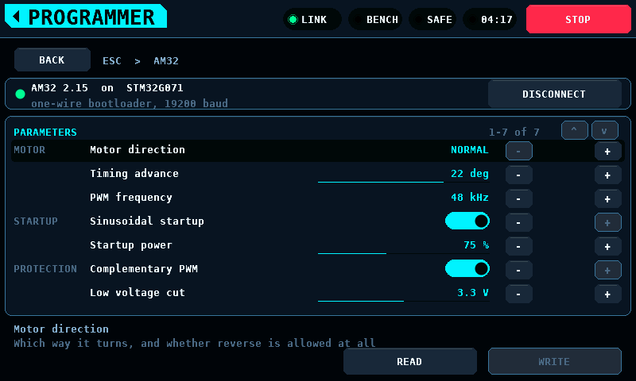

Ein geänderter Wert wird erst geschrieben, wenn WRITE gedrückt wird.
Vorgemerkte Änderungen tragen eine Markierung und eine eigene Farbe, und der
WRITE-Knopf zeigt, wie viele vorgemerkt sind:

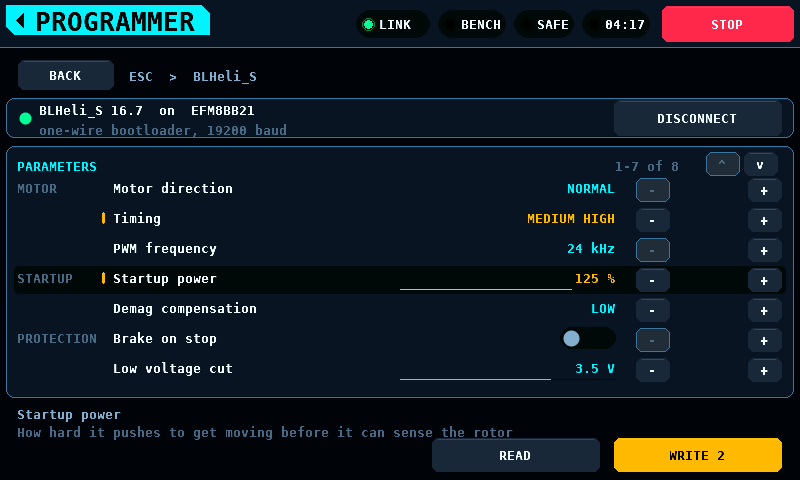

Stepper halten an den Enden einer Liste an; sie springen nicht auf die andere
Seite.

Eine Ebene zurück trennt die Verbindung. Zurück geht eine Ebene auf einmal;
das Home-Tag im Band verlässt den Bildschirm.

## Akku

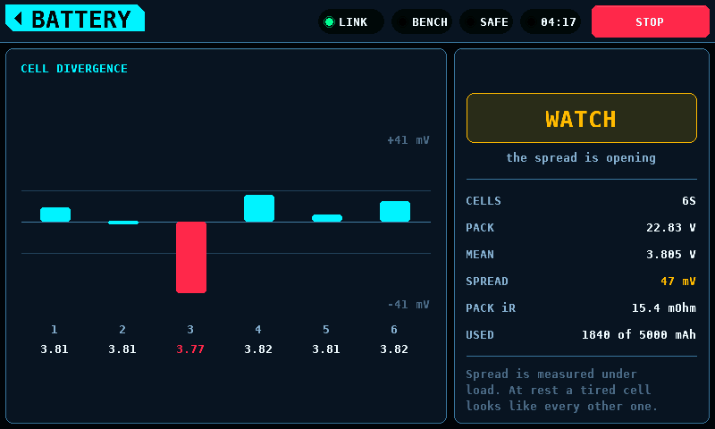

Die Zellen werden als Abweichung vom Mittelwert des Packs gezeichnet. Das
Urteil folgt der Spreizung, dem größten Abstand zwischen zwei beliebigen
Zellen: HEALTHY unter 30 mV, WATCH ab 30 mV, REPLACE ab 60 mV. Die Skala folgt
dem Pack bis hinunter zu einer Untergrenze von 12 mV und steht neben dem Plot.

Unter Last messen. In Ruhe liest sich eine schwache Zelle wie die anderen.

## Logs


Karte durchsehen, Datei öffnen, prüfen, was der Import erkannt hat, dann
plotten:

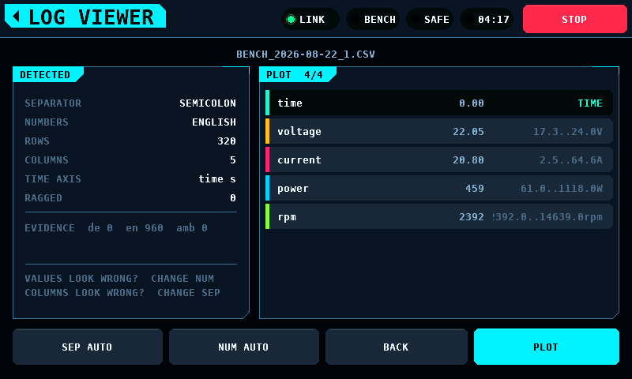
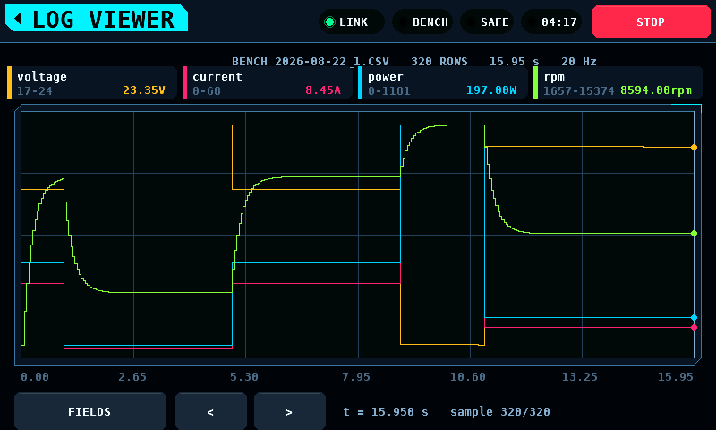

Der Reader für CSV (Comma-Separated Values) akzeptiert Dezimalkomma und
Dezimalpunkt, eine Einheitenzeile und Zeilen ungleicher Länge; die
Importansicht zeigt, was er entschieden hat, bevor die Datei geplottet wird.
Vom Prüfstand aufgezeichnete Läufe werden als `BENCH001.CSV` bis
`BENCH999.CSV` im Wurzelverzeichnis der Karte abgelegt. Ein Lauf ist ein
Scharfschalten oder, solange der Prüfstand nicht scharf ist, ein Einschalten
des SUPPLY-Ausgangs. Ein automatischer Servotest nimmt ebenfalls die nächste
Nummer: sein Log ist `BENCHnnn.CSV`, das die Liste als Lauf zeigt, sein
Bericht `BENCHnnn.TXT`, den die Liste nicht zeigt. Eine Nummer, die eine der
beiden Dateien trägt, ist vergeben, und DELETE auf einem Lauf löscht seinen
Bericht mit.

Die Liste fasst 48 Einträge, die Karte bis zu 999 Läufe. Passen nicht alle
hinein, behält die Liste die neuesten Läufe, und ihr Reiter zeigt
`48 OF 137 FILES` statt `FILES`: ein Lauf, der in der Liste fehlt, ist dann
einer, für den die Liste zu kurz war, und nicht einer, der nie geschrieben
wurde. Was neu heißt, steht in der Nummer im Namen: die Panel-Platine hat
keine Uhr, die einen Stromausfall übersteht, deshalb trägt jede Datei auf der
Karte das Datum 1980-01-01. Ein Lauf geht einer Datei vor, die der Prüfstand
nicht geschrieben hat, also listet eine Karte mit 48 oder mehr Läufen keine
andere Datei mehr. Alte Läufe löschen, um eine zurückzuholen.

DELETE löscht die ausgewählte Datei von der Karte. Vorher kommt eine Rückfrage:
ein zweites Feld nennt die Datei und ihre Größe, und erst dessen eigenes
DELETE, auf dem Knopf gedrückt und losgelassen, löscht sie. CANCEL oder das
Verlassen des Bildschirms schließt die Rückfrage, ohne zu löschen. Der Lauf,
den der Logger offen hat, wird abgewiesen. Eine Datei, die in der
Importansicht oder im Plot offen war, verschwindet beim Löschen aus beiden.
Der Logger nummeriert jeden Lauf über dem höchsten Lauf, den er auf der Karte
gefunden hat. Er liest die Karte beim ersten Lauf nach dem Start und nach einem
Lauf, der sich nicht öffnen ließ, und zählt sonst von dort weiter. Eine
gelöschte Nummer wird nur wieder vergeben, wenn sie bei diesem Lesen über allen
verbliebenen Läufen lag.

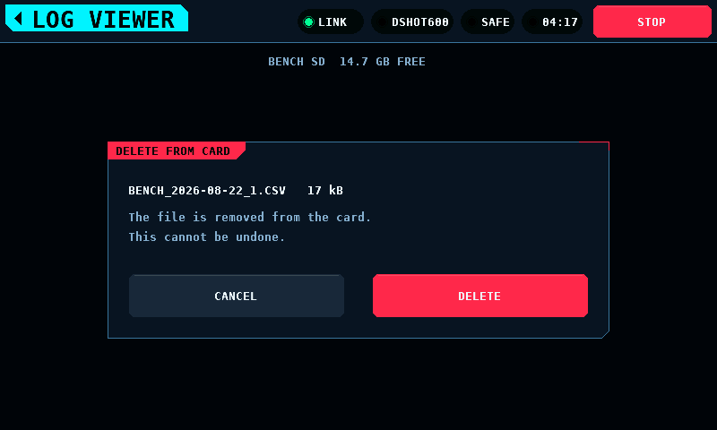

Ein Lauf wird alle 20 Zeilen oder 1000 ms Laufzeit auf die Karte festgeschrieben,
je nachdem, was zuerst eintritt. Ein Stromausfall mitten im Lauf kostet die
Zeilen, mit denen das Festschreiben noch nicht fertig ist, und die Zeilen, die
noch in der Queue zwischen der Control-Task und der Karten-Task stehen: unter
1,0 s Laufzeit, solange die Karte mitkommt, und 84 Zeilen, 4,20 s bei den 20 Hz
des Panels, wenn die Karte hängt und die Queue voll ist. Der Rest der Datei
bleibt in beiden Fällen lesbar. Geschrieben wird von
einer eigenen Task. Eine SD-Karte (Secure Digital) darf sich für einen Schreibvorgang
250 ms Zeit nehmen, und die Task, die die Sicherheitsleitung schlägt, hat eine
Obergrenze von 150 ms.

Acht Meldungen sagen, was die Karte mit einem Lauf gemacht hat. Jede
erscheint im Band:

| Meldung | Was passiert ist |
|---|---|
| `no card -- this run is not recorded` | nichts ist gemountet, der Lauf wurde nie geöffnet |
| `card unreadable -- run not recorded` | die Karte ließ sich nicht auflisten, es war keine Laufnummer wählbar |
| `card full or unwritable -- run not recorded` | es ließ sich keine Laufnummer anlegen |
| `the card did not keep up -- run not recorded` | jede Zeile wurde verworfen, es gibt für diesen Lauf gar keine Datei |
| `the card fell behind -- the log has gaps` | einzelne Zeilen wurden verworfen; die Zeitspalte der Datei zeigt, wo |
| `the card stopped taking rows -- run not recorded past here` | ein Schreibvorgang ist mitten im Lauf fehlgeschlagen, jede weitere Zeile wird abgewiesen |
| `the card stopped taking rows -- the log is short` | derselbe Fehler, beim Schließen des Laufs noch einmal gemeldet |
| `the card failed on the last write -- the log is short` | das Schließen ist fehlgeschlagen, die Zeilen seit dem letzten Festschreiben fehlen in der Datei |

Bei den ersten vier gibt es keine Datei zu suchen. Bei den letzten vier gibt
es eine, und sie hört zu früh auf.

Ein Lauf, der gerade geschrieben wird, erscheint nicht in LOGS. Die Länge einer
Datei steht in ihrem Verzeichniseintrag und wird beim Schließen geschrieben, ein
noch offener Lauf stünde also mit seiner zuletzt festgeschriebenen Länge in der
Liste und läse sich wie ein fertiger.

## Setup

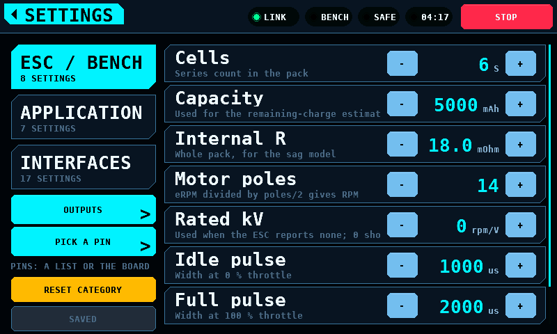

Die Einstellungen liegen hinter der SETUP-Kachel, in beiden Themes:

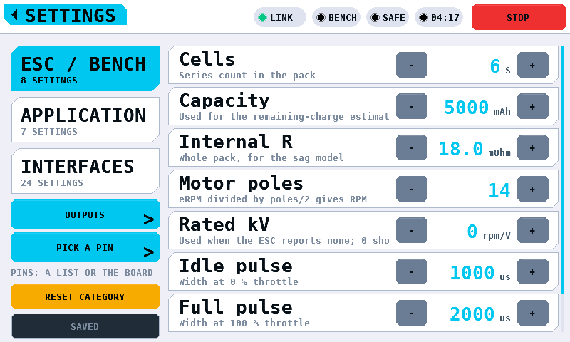

### Werte behalten

Ein geänderter Wert wirkt sofort und wird erst in den Flash geschrieben, wenn
SAVE gedrückt wird. Die Taste unter RESET CATEGORY nennt einen von drei
Zuständen:

| Beschriftung | Bedeutung |
| --- | --- |
| `SAVED` | Nichts ist ungeschrieben. Die Taste ist inaktiv. |
| `SAVE` | Etwas ist ungeschrieben. Ein Druck fordert das Schreiben an. |
| `WHEN IDLE` | Das Schreiben ist angefordert und wartet auf einen Moment dafür. |
| `NOT SAVED` | Der Store hat das Schreiben abgelehnt. Was auf das Medium gelangt ist, geht aus dem Bildschirm nicht hervor: Eine Ablehnung bei einem Key lässt die davor geschriebenen Keys committed, der nächste Boot kann also eine Mischung aus neuen und alten Werten laden. Ein Druck versucht es erneut. |

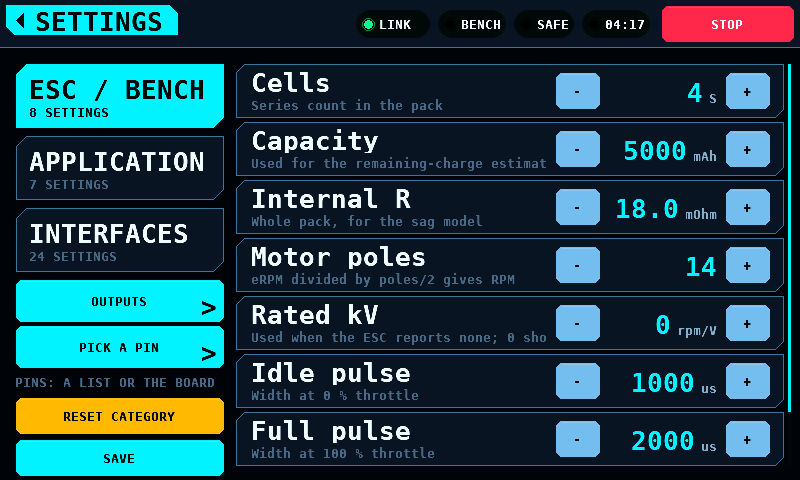

Der Druck fordert an, er schreibt nicht. Einstellungen zu schreiben committet
eine Page im NVS (Non-Volatile Storage), und eine Flash-Operation auf dem
ESP32-S3 schaltet den Instruction Cache ab, es läuft also für ihre Dauer auf
keinem der beiden Kerne Code. Geschrieben wird im ersten Frame, in dem der
Prüfstand disarmed ist und kein Platinenfoto geholt oder abgelegt wird. Auf
dem Einstellungs-Bildschirm ist das der nächste Frame, und die Beschriftung
steht auf `SAVED`, so schnell wie das Auge dem Druck folgt. Armed steht die
Anforderung als `WHEN IDLE`, bis der Prüfstand disarmed wird.

Ein Store, der ablehnt, lässt die Beschriftung in der Danger-Farbe auf
`NOT SAVED` stehen, bis das nächste erfolgreiche Schreiben oder die nächste
Änderung kommt. Eine Ablehnung macht nicht rückgängig, was schon geschrieben
wurde: Die Werte werden Key für Key gesetzt, und ein Fehlschlag mittendrin
lässt die früheren Keys committed, das Medium kann also eine Mischung aus
neuen und alten Werten halten. Der Bildschirm kann nicht sagen, welche. Ein
Panel, dessen NVS gar nicht hochkam, lehnt jedes Schreiben der Sitzung ab,
schreibt nichts und sagt das zusätzlich einmal auf dem Splash als
`NVS unavailable`.

Nicht gespeicherte Werte bleiben, bis das Panel ausgeschaltet wird. Das
Verlassen des Bildschirms schreibt nichts.

## Der Bus-Fehler-Bildschirm

Das Panel führt den CAN-Echo-Selbsttest (Controller Area Network) bei jedem
Start aus, 1200 ms lang innerhalb des Splash. Ein anderes Urteil als „alle
Probes kamen unversehrt zurück" bringt diesen Bildschirm auf das Panel statt
des Menüs.

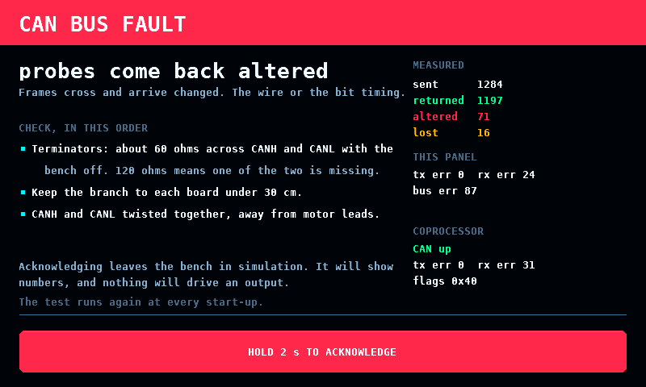

Es gibt ihn, weil der Fehler von jedem anderen Bildschirm aus unsichtbar ist:
ein Bus, der keine Frames trägt, sieht genauso aus wie ein Koprozessor, der
nicht bestückt ist, und beides sieht aus wie ein Prüfstand, der einfach keine
Zahlen zeigt. Das Urteil ist die Überschrift, die Liste ist das, was der
Reihe nach zu prüfen ist, und die rechte Spalte ist das, was beide Enden
gezählt haben.

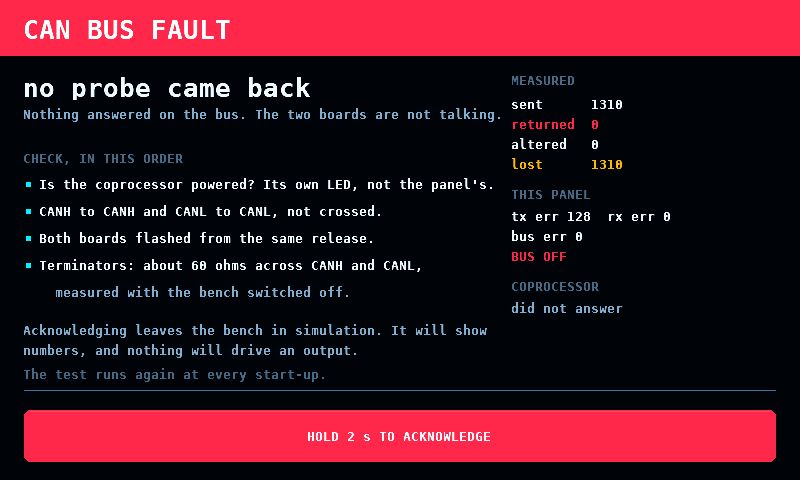

Verlassen kostet zwei Sekunden Halten — die ARM-Geste und dieselbe
Überblendung. Das Quittieren repariert nichts: der Prüfstand läuft in
Simulation, nichts treibt einen Ausgang, und der Test läuft beim nächsten
Start wieder. Es gibt kein Band und kein STOP, denn dahinter kann nichts
armiert sein.

### Ein Link, der abreißt

Derselbe Bildschirm trägt die andere Hälfte: ein Link, der stand und seit 4 s
weg ist. Die Überschrift ist das, was der CAN-Controller dieses Panels gerade
tut — der Draht hat eben noch Frames getragen.

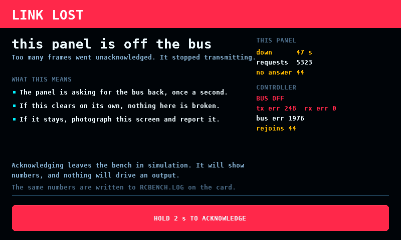

| Überschrift | Bedeutung |
| --- | --- |
| `this panel is off the bus` | zu viele Frames blieben unquittiert; es hat aufgehört zu senden |
| `this panel is rejoining the bus` | es zählt die Ruhezeit ab, die ein Rejoin braucht, rund 3 s |
| `this panel's controller has stopped` | untätig und nicht neu gestartet — ein Fehler in der Firmware |
| `the link stopped answering` | der Controller ist am Bus und niemand antwortet |
| `the controller cannot be read` | der Treiber läuft nicht; es kann nichts gesendet werden |

Vier Sekunden, nicht eine: der Link fällt gelegentlich für einen Poll aus, und
ein Bildschirm, der bei jedem Zucken übernimmt, ist einer, den man wegklickt.

**Niemals bei armiertem Prüfstand.** Der Bildschirm hat kein STOP, und einem
Prüfstand, an dem sich etwas dreht, darf keine Diagnose die Stopptaste
verdecken. Armiert sagt das Alert-Band, dass der Link weg ist, und der
Bildschirm wartet auf das Disarmieren.

Dieselben Zahlen gehen in `RCBENCH.LOG` auf der SD-Karte, eine Zeile je
Report, solange der Link unten ist:

    t=182s link=down for 47s  bus=OFF tx_err=248 rx_err=0 bus_err=1976 rejoins=44/44  polls=5323 replies=5279 timeouts=44

Die Felder sind jedes Mal dieselben in derselben Reihenfolge. `rejoins` ist
dieser Ausfall über der Gesamtzahl seit dem Start, und ein Controller, der
sich nicht lesen lässt, schreibt `?` in seine Spalten statt einer anders
geformten Zeile: die Ablesung, die einen Zeitstempel am nötigsten hat, ist
genau die, bei der der Controller nicht geantwortet hat.

Die Karte ist dafür da, weil die Konsole des Panels nicht auf jeder Platine
erreichbar ist. Die native USB-Buchse führt GPIO19 und GPIO20, die der
Multiplexer etwa eine Sekunde nach dem Start an CAN übergibt — sie ist also
weg, bevor ein Fehler am Prüfstand passiert. Die gebrückte Buchse liegt an
UART0 und trägt die Konsole normalerweise durchgehend; womit sie verbunden
ist, ist aber umschaltbar: ein Schiebeschalter neben den Tastern BOOT und
RESET ist mit UART1 und UART2 beschriftet. In einer Stellung meldet sich der
Bridge-Chip an und lässt in keine Richtung etwas durch, und dann hat das Panel
gar keine Konsole.

[Den Link in Betrieb nehmen](Link-de.md) hat die Urteile und was jedes
bedeutet.

## Outputs

Hinter der OUTPUTS-Taste auf dem Setup-Bildschirm. Die Protokolle, die an die
Pins des Koprozessors gebunden sind, und welche Pins jedes davon treibt.


Ein Pin-Satz je Protokoll, nicht acht unabhängige Slots: ein Prüfstand wird
protokollweise verkabelt — vier Servokabel, dann ein ESC (Electronic Speed
Controller) — und erst nach dem Protokoll und dann nach seinen Pins zu fragen
ist die Form dieser Arbeit. Mehr als ein Protokoll kann gleichzeitig gebunden
sein, und ein Pin gehört höchstens einem davon.

Jeder angehakte Pin wird ein Slot auf der [OUTPUTS-Page](Link-de.md#page-map),
in Pin-Reihenfolge über alle Protokolle hinweg, mit Kanälen ab null — der
niedrigste angehakte Pin ist also Kanal 0, in welcher Reihenfolge der
Bildschirm auch berührt wurde und welches Protokoll ihn auch hält. Acht Slots
und acht Kanäle sind das Budget, geteilt. PPM rendert acht Kanäle auf seinem
einen Pin, ein Prüfstand mit PPM hat also für nichts anderes Platz. Es läuft
mit 40 Hz und nicht mit den 50 Hz der übrigen Pulstreiber: acht Kanäle
brauchen 23 300 us Rahmen, und 50 Hz geben 20 000.

SERVO PWM und MOTOR PWM sind derselbe Puls mit denselben 50 Hz und
unterscheiden sich darin, wofür der Kanal da ist. Ein Servokanal geht in die
Mitte, wenn ihn nichts kommandiert; ein Motorkanal geht auf null. Am Puls ist
nicht zu erkennen, was am Pin hängt, also sagt es der Eintrag: einen ESC als
MOTOR PWM binden, ein Ruder als SERVO PWM. Der Gasregler auf MOTOR & ESC
treibt jeden als Motor gebundenen Kanal — MOTOR PWM und die DShot-Einträge —
und lässt die Servokanäle in Ruhe.

Ein MOTOR-PWM-Kanal sendet 0 % Gas als Idle pulse und 100 % als Full pulse:
1000 us und 2000 us ab Werk, einstellbar unter SETUP, ESC / BENCH, in Schritten
von 10 us (Idle pulse 800 bis 1600 us, Full pulse 1400 bis 2400 us). Die
beiden Einstellungen gehen an die als Motor gebundenen Kanäle und an keine
anderen: ein SERVO-PWM-Kanal behält 1000 bis 2000 us oder den Bereich, den der
SERVO-Bildschirm für das dort gewählte Servo sendet. Eine Änderung erreicht
den Coprozessor 300 ms nach der letzten Eingabe, solange der Prüfstand nicht
scharf ist; eine Änderung im scharfen Zustand wartet auf das Entschärfen.
Ein Coprozessor, der sich verbindet, bekommt die beiden Einstellungen, bevor
der Prüfstand ihn treibt: bei einem schon scharfen Prüfstand bleibt er
entschärft, bis er sie hat. Ein
Idle pulse, der nicht unter dem Full pulse liegt, wird nicht gesendet, und das
Band zeigt `idle pulse must be below full pulse -- not sent`.

Ein ESC, dessen Gasweg an einem Sender kalibriert wurde, nimmt den kürzesten
Puls dieses Senders als null. Ein Idle pulse darüber liest der ESC als Gas,
das nicht ganz unten ist, und er schaltet nicht scharf; viele ESCs piepen dann
schnell. Den Idle pulse auf oder unter den kürzesten Puls des Senders stellen
und den Full pulse auf oder über seinen längsten: bei einem Sender mit 985 bis
2012 us also 980 us und 2020 us.

Wenn das Protokoll keinen Pin mehr nehmen kann, steht der Grund in Bernstein
darunter: `NEEDS 8 CHANNELS, 4 FREE`, `ALL 8 SLOTS IN USE` oder `SERVO PWM
TAKES 8 PINS`. Eine komplett graue Platine ohne Begründung daneben liest sich
wie ein Defekt, und PPM färbt die ganze Platine grau, sobald irgendetwas
anderes gebunden ist.

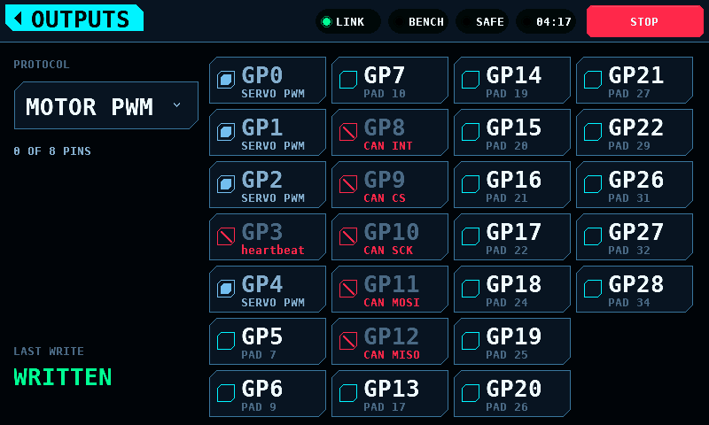

Das Protokoll ist eine Liste und kein Stepper: es gibt acht davon, und sich
an sieben vorbeizuschieben, um das achte zu erreichen, ist keine Auswahl.

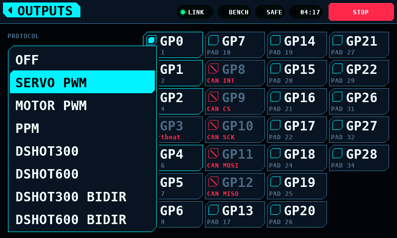

Reservierte Pins werden gezeigt und lassen sich nicht anhaken. GP3 trägt die
Safety-Heartbeat-Leitung und GP8 bis GP12 den CAN-Controller (Controller Area
Network); jeder sagt das unter seinem Namen. Sie zu verstecken hieße, dass
jemand GP10 sucht und eine Lücke findet. [DShot und die
Output-Treiber](DShot-de.md#welcher-pin) hat die ganze Übersicht.

Die Pad-Nummer unter jedem Pin ist die auf der Platine aufgedruckte, damit wer
Pads zählt und wer GPIO-Nummern (General-Purpose Input/Output) liest beim
gleichen Pin ankommen.

Jede Änderung schreibt die Pages sofort. Es gibt keine APPLY-Taste: ein
Bildschirm mit einer nicht gesendeten Auswahl ist ein Bildschirm, der dem
Prüfstand widerspricht, und nichts sagt, welcher von beiden treibt. Was aus dem
Schreiben wurde, steht unter dem Protokoll — WRITTEN, NO LINK oder REFUSED.

Ein Protokollwechsel sagt, welcher Satz gerade bearbeitet wird. Nichts wird
verworfen: die Pins des verlassenen Protokolls bleiben gebunden, und die Pins
des erreichten kommen zurück, wie sie waren. Ein Selektor, der die aktuellen
Pins umlenkte, hieße, dass ein zweites Protokoll zu binden das erste löst.

Ein Pin, den ein anderes Protokoll hält, wird grau gezeichnet, mit dem Namen
dieses Protokolls darunter, wo ein freier Pin seine Pad-Nummer zeigt. Das ist
eine Auswahl, rückgängig gemacht bei diesem Protokoll — anders als ein
reservierter Pin, der rot und durchgestrichen ist, weil er die Verkabelung ist
und keine Auswahl.

Vier Servokabel und ein ESC, mit DShot600 als bearbeitetem Protokoll. GP5 ist
angehakt; GP0, GP1, GP2 und GP4 sagen SERVO PWM und lassen sich hier nicht
anhaken; GP3 und GP8 bis GP12 sind rot, weil der Koprozessor sie reserviert:

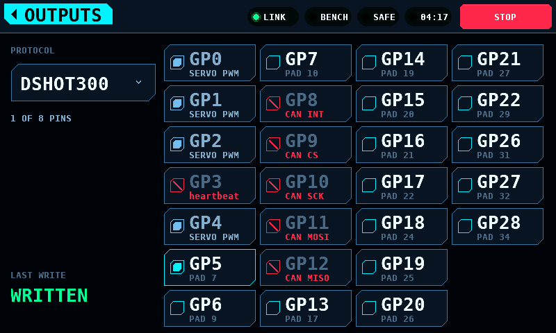

Eine Zelle ist also in einem von vier Zuständen, und jeder sagt, was zu tun
ist: in diesem Protokoll angehakt, von einem anderen gehalten und benannt,
reserviert und durchgestrichen, oder frei und mit seiner Pad-Nummer.

### Pin auswählen

Hinter der Taste PICK A PIN auf dem Setup-Bildschirm, und dieselbe Bindung,
die der Outputs-Bildschirm hält. Die Liste beantwortet „welcher GPIO ist
gebunden“; dieser beantwortet „wo stecke ich das Kabel an“.

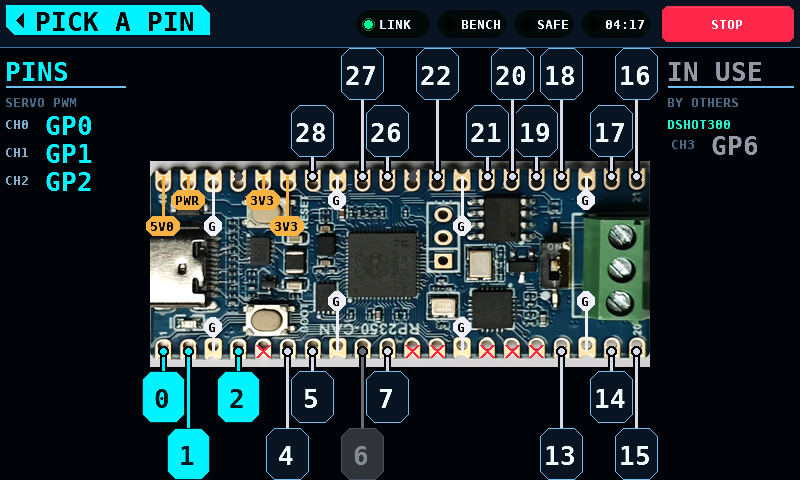

Die Tasten sind nicht die Pads. In jeder Größe, die auf ein 480-Pixel-Panel
passt, ist ein Pad unter 40 Pixel breit und damit kleiner als eine
Fingerkuppe. Also werden die Pads gezeichnet, wo sie sind, und berührt wird
auf versetzten Tastenreihen neben der Platine, jede an einer geraden Leitung
zu ihrem eigenen Pad.

Eine Taste ist gefärbt wie ihre Zelle auf dem Outputs-Bildschirm: die Pins
dieses Protokolls in der Akzentfarbe, ein Pin, den ein anderes Protokoll
hält, grau, und ein vom Koprozessor reservierter Pin hat gar keine Taste — er
ist auf dem Pad durchgestrichen, denn eine Taste unter einem Pin, der nicht
gewählt werden kann, sagt, er ließe sich wählen.

Links stehen die Pins dieses Protokolls in Kanalreihenfolge, rechts die Pins,
die andere Protokolle halten, mit Namen. Beide zusammen lesen sich als ein
Lauf von Kanälen, denn das ist, was die OUTPUTS-Page trägt.

Wo die Pads liegen, kommt von der Platine und nicht vom Panel: die
[Shape-Page](Link-de.md#page-map) trägt den Umriss, das Raster und die Ecke,
an der Pad 1 sitzt. Eine Platine, die das nicht sagt, wird gar nicht
gezeichnet — ein Bild aus einer geratenen Form zeigt mit derselben
Überzeugung auf den falschen wie auf den richtigen Pad, und die ganze Aufgabe
dieses Bildschirms ist es, einen Pad auf der Platine vor dir zu finden. Ihre
Pins stehen weiterhin auf dem Outputs-Bildschirm.

Das Foto ist wieder davon getrennt. Mit einem ist die Platine auf dem
Bildschirm die Platine in deinen Händen; ohne eines werden Umriss und jedes
Pad aus der Form gezeichnet, und die Tasten liegen an denselben Stellen:

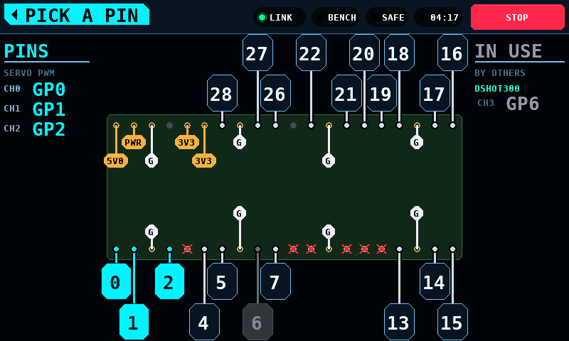

Das Foto wird einmal je Platine über den Link geholt und im Flash des Panels
behalten. Es kostet also etwa zehn Sekunden, wenn eine Platine zum ersten Mal
gesehen wird, und danach nichts. Eine Platine ohne Foto, oder eine, deren
Übertragung nicht fertig wurde, wird gezeichnet statt leer gelassen.

Ein Servokabel hat drei Adern, und die Tasten beschreiben eine davon. Die
anderen beiden sind auf der Platine selbst markiert: eine Masse trägt ein
weißes **G**, eine Versorgung ihre Spannung — **5V0**, **3V3**. Eine
Versorgung, die ein Eingang und keine feste Spannung ist, trägt stattdessen
**PWR**, denn eine Zahl, die nur manchmal stimmt, ist hier schlechter als
keine. Pads, die keines von beidem sind, etwa RUN, bekommen einen Punkt und
keine Beschriftung.

Sie werden innerhalb des Umrisses an einer kurzen Leitung markiert, in zwei
Tiefen, damit eine Reihe von Versorgungen an einem Ende nicht eine
Beschriftung über die nächste zeichnet. Innen ist der einzige verbleibende
Platz: der Raum neben der Platine gehört den Tasten, und eine Markierung auf
dem Pad selbst wäre so klein wie das Pad.

Sie kommen von der [Pads-Page](Link-de.md#page-map), die vom Katalog getrennt
ist, weil sie dort nicht hineinpassen — eine Page hat 32 Register, und eine
Platine mit 40 Pads hat zwischen beiden mehr Pads als das. Eine Platine, die
sie nicht bedient, hat ihre Massen und Versorgungen unmarkiert, und ein Kabel
wird gesteckt, indem man die Platine liest statt den Bildschirm.

### Der Koprozessor hält sie, nicht das Panel

Eine Bindung beschreibt die Verkabelung, und das Panel ist nicht die Platine,
in der die Drähte stecken. Der Koprozessor schreibt die Pages OUTPUTS und
CHAN_CFG in seinen eigenen Flash und stellt sie beim Booten wieder her; das
Panel speichert keine Bindung und sendet keine ungefragt. Kommt der Link hoch,
liest das Panel die Page und zeigt, was drüben konfiguriert ist. Nach einem
Panel-Neustart sind das, was dieser Bildschirm zeigt, und das, was Pins treibt,
dieselbe Sache.

Das Wiederherstellen konfiguriert die Outputs. Es treibt sie nicht: jeder
Treiber ist daran gebunden, dass die Bank armed ist, was der Koprozessor nur
gewährt, solange das ARM-Register gesetzt ist, der Link nicht im Failsafe ist
und der Heartbeat vertraut wird. Eine wiederhergestellte Bindung belegt also
ihre Pins und hält sie im Idle, bis jemand armed. Kanalbefehle werden nicht
wiederhergestellt — eine Konfiguration überlebt einen Power-Cycle, eine
Gasstellung nicht.

Das Speichern wartet, bis der Prüfstand nicht mehr treibt, und dann auf eine
Lücke im Verkehr. Flash zu schreiben hält den Koprozessor mit abgeschalteten
Interrupts an, und solange antwortet er auf nichts: auf dem
Inbetriebnahme-Modul wurde ein Speichervorgang, der in einem Fenster gelöscht
und programmiert hat, mit 19.178 us gemessen, gegen einen CAN-Frame von etwa
130 us und zwei Frames Puffer im Controller. Löschen und Page Program sind
nicht getrennt voneinander gemessen. Ein in diesem Fenster verlorener Request
kostet das Panel 1000 ms Wartezeit, was über dem 200-ms-Failsafe des
Koprozessors liegt; ein einziger verlorener Frame endet also als `FAULT 01`
(`LINK_FAULT_LINK_SILENT`) an einem Kabel, an dem nichts fehlt.

Der Sektor wird deshalb nicht je Speichervorgang gelöscht. Zwei Sektoren
halten je sechzehn Records; ein Speichervorgang schreibt den nächsten Record,
und ein Sektor wird erst gelöscht, wenn jeder Record darin überholt ist.
Dieses Löschen wird vor den Speichervorgang gezogen, der es braucht: beim
Booten, bevor der Koprozessor antwortet, oder in einem Durchlauf nach dem
Speichervorgang, der zuerst in den anderen Sektor schreibt, sobald der Bus
5 ms ruhig war. Gelöscht wird der zurückgelassene Sektor, nicht der gerade
gefüllte, und zwischen dem Löschen und dem Speichervorgang, der es braucht,
liegen die fünfzehn Speichervorgänge dazwischen.
Fünfzehn von sechzehn Speichervorgängen kosten damit ein Page Program und
kein Löschen. Wie lange ein Page Program auf dem Flash des Moduls dauert, ist
nicht gemessen; die Konsolenzeile nach jedem Speichervorgang trägt den Wert.

Ein Stromausfall während des Speicherns lässt die Bindung von davor stehen.
Der gerade geschriebene Record fällt durch seine Prüfsumme, der Record davor
ist weiterhin der neueste gültige, und der gelöschte Sektor ist nie der, in
dem der noch gebrauchte Record liegt.

Eine Page, die der Bildschirm nicht beschreiben kann — zwei Protokolle
gleichzeitig, eine Rate, die kein Eintrag anbietet, ein Pin, der nicht auf dem
Header liegt — liest sich als "nichts konfiguriert" zurück, statt als eine
Auswahl, die der Page widerspricht, aus der sie stammt.

## Auswuchten

Auf einer eigenen Seite beschrieben: [Auswuchten](Balance-de.md).

## Bildschirme, die nicht fertig sind

Eine Kachel mit der Marke SOON nennt, was der Bildschirm tun wird und auf
welches Bauteil oder welche Entscheidung er wartet.
