# Bildschirme

<sub>[English](Screens.md) · **Deutsch**</sub>

Was auf jedem Bildschirm steht, was die Marken im Menü bedeuten und wie die
einzelnen Bildschirme bedient werden.

## Das Statusband

Das obere Band ist auf allen Bildschirmen gleich. Von rechts: STOP, die
Laufzeituhr (im scharfen Zustand oder nach einem Lauf), ARMED oder SAFE, ein
FEHLER-Code, sobald einer gemeldet wird, der Modus und LINK oder KEIN LINK.
Der Modus ist BENCH, solange der Link steht und das Panel die Ausgänge des
Koprozessors ansteuert, und SIM, solange kein Koprozessor antwortet und das
Panel mit seinen eigenen Modellen rechnet.

STOP funktioniert auf jedem Bildschirm. Es entschärft und rastet ein: der
Prüfstand bleibt entschärft, bis er erneut scharf geschaltet wird. Ein
Bildschirmwechsel, ein ablaufender Hinweis oder ein zurückkehrender Link hebt
einen Stopp nicht auf.

ARM sitzt unten auf einem Prüfstandsbildschirm; STOP sitzt oben im Band.

Eine Berührung gehört dem, worauf sie aufgesetzt hat, bis sie abhebt. Das
Band sind die oberen 48 px des Panels.

- Eine Berührung, die auf dem Band aufsetzt, bleibt beim Band. Rutscht sie
  nach unten in den Bildschirm, bewegt sie dort nichts, und hebt sie dort ab,
  drückt sie nichts.
- Eine Berührung, die auf dem Bildschirm aufsetzt und nach oben ins Band
  rutscht, wird an der letzten Stelle losgelassen, die sie auf dem Bildschirm
  hatte. Ein Drag auf einem Schieberegler oder auf dem SERVO-Zifferblatt endet
  mit dem Wert von dieser Stelle, und der Weg auf dem Band wird nicht
  dazugerechnet. Ein Halten auf ARM oder OUTPUT ON ist abgebrochen. Eine
  Schaltfläche wirkt wie bei einem Finger, der an dieser Stelle abhebt: Eine,
  die der Finger schon verlassen hatte, fordert nichts an. Die Berührung wird
  nicht wieder aufgenommen, wenn der Finger zurück auf den Bildschirm kommt;
  abheben und neu drücken.
- STOP und das Home-Tag reagieren auf einen Druck, der auf ihnen aufsetzt.
  Ein Finger, der vom Bildschirm auf STOP rutscht, stoppt nichts.
- Ein zweiter Finger auf STOP, auf dem Home-Tag oder auf dem Alert-Band wird
  bedient, während der erste zieht. Nach dem Home-Tag bewegt der Finger, der
  noch auf dem Glas liegt, auf der Übersicht nichts.

## Das Alert-Band

Eine Störung, die der Bildschirm selbst nicht zeigt, erscheint in einem roten
Band, 34 px hoch, unten über jedem Bildschirm mit Statusband. Solange es
steht, verdeckt es den unteren Rand des Bildschirms, ARM eingeschlossen.

- Es verschwindet 30 s nach dem Frame, in dem es kam. Ein neuer Alert, auch
  mit demselben Text, startet die 30 s neu.
- Ein Tippen auf das Band löscht es früher: auf dem Band drücken und
  loslassen, rechts mit einem `x` markiert. Der Bildschirm darunter bekommt
  weder dieses Tippen noch das eines zweiten Fingers auf dem Band; nur das
  Loslassen des ersten Fingers löscht.
- Ein Alert, der kommt, während ein Finger auf dem Band liegt, wird durch
  dieses Loslassen nicht gelöscht.
- "Touch antwortete nicht -- der Prüfstand nimmt kein ARM an" beim Start
  bleibt bis zum Neustart und hat kein `x`: es gibt keinen Touch, mit dem man tippen könnte.
  Ein späterer Alert erscheint darüber; ist er gelöscht, steht wieder dieser.

## Marken im Menü

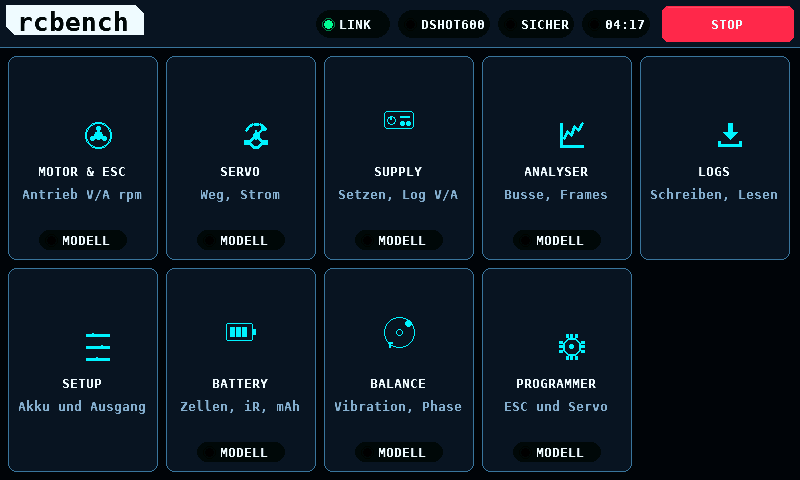

| Marke | Bedeutung |
| --- | --- |
| BALD | den Bildschirm gibt es nicht; die Kachel nennt, was er tun wird und worauf er wartet |
| SIMULIERT | den Bildschirm gibt es und er funktioniert, aber seine Hardware ist nicht bestückt; jeder Wert ist simuliert, und der Bildschirm sagt das |
| keine | die Hardware ist bestückt, die Messwerte sind gemessen |

Die Marke wird aus den Capability-Bits abgeleitet, die der Koprozessor beim
Hochfahren meldet. Ein Bildschirm ohne seine Hardware öffnet trotzdem und
arbeitet aus dem Modell. SUPPLY trägt SIMULIERT, solange der PD mini in SETUP
unter ANSCHLÜSSE abgeschaltet ist, unabhängig davon, was der Koprozessor
meldet: Das Panel rechnet dann sein eigenes Modell eines Netzteils.

Das Menü im hellen Design:

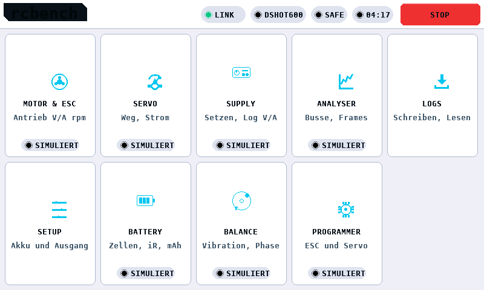

## Splash

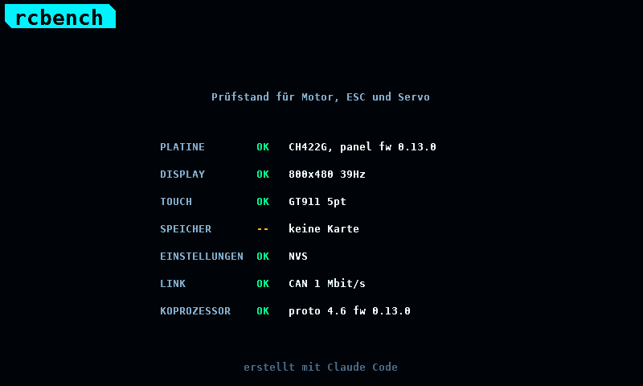

Jedes Subsystem meldet beim Hochfahren sein Ergebnis: Platine, Display,
Touch, SD-Karte, Einstellungen, Link, Koprozessor. Die Zeile der Platine
trägt die Firmware-Version des Panels selbst, die Zeile des Koprozessors die
Protokollversion und die Firmware-Version, die dieser Koprozessor gemeldet
hat — zwei Platinen können dasselbe Protokoll sprechen und verschiedene
Builds sein, und hier zeigt sich das. Eine fehlende Karte ist
eine Warnung. Ein Touch-Controller, der nicht antwortet, oder ein Koprozessor
mit einer anderen Major-Version des Protokolls ist ein Fehler, und der
Prüfstand schaltet nicht scharf. Wenn alle Schritte geantwortet haben,
übergibt der Splash nach 1,6 s an das Menü; ein Tippen überspringt das Warten.

## Motor & ESC

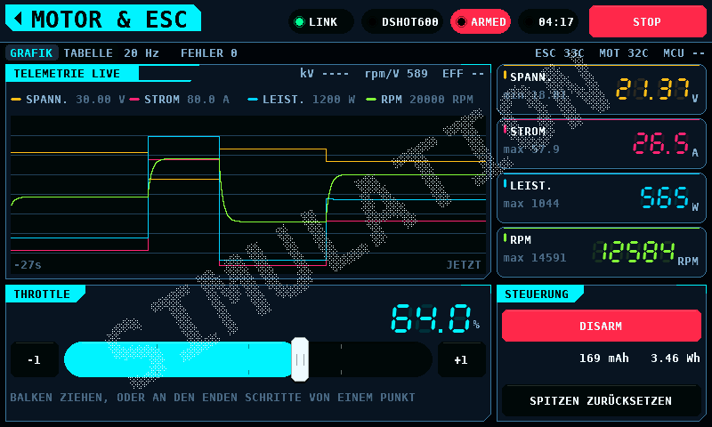

Zwei Spalten. Der Plot und das Gas nehmen die linke, die vier Anzeigen und
die Bedienelemente eine Leiste auf der rechten, damit das Ablesen der Werte
und das Bedienen des Gases nicht um denselben Teil des Bildschirms
konkurrieren. Bei eingeschaltetem Drehknopf bewegt dessen Drehung das Gas
([der Knopf](#anwendung-der-drehknopf)).
### Der Plot zeigt einen Lauf

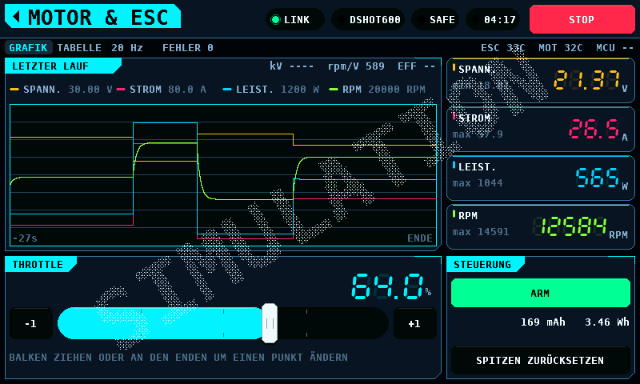

Die Kurve ist die Aufzeichnung eines Laufs. Sie läuft nur, solange der
Prüfstand scharf ist: das Scharfschalten löscht sie, das Entschärfen hält sie
so an, wie sie stand. Die Beschriftung der Fläche liest `TELEMETRIE LIVE`,
solange sie läuft, `TELEMETRIE, LETZTER LAUF`, solange sie einen Lauf hält, und
`TELEMETRIE RUHT` vor dem ersten Scharfschalten, wenn im Plot
`kein Lauf aufgezeichnet` steht. Die rechte Achsenbeschriftung liest `JETZT`, solange
sie läuft, und `ENDE` dort, wo eine gehaltene stehen geblieben ist. Die
Anzeigen, die TABELLE-Seite, die Summen und die Temperaturleiste sind
jederzeit live, ob scharf oder nicht.

Das Fenster ist 534 Spalten breit bei 20 Abtastungen je Sekunde, also 26,7 s.
Ein längerer Lauf hält seine letzten 26,7 s; was davor liegt, steht in der
CSV-Datei und nicht auf dem Bildschirm.

Die Kurve endet beim Entschärfen, nicht wenn der Motor steht. Das Entschärfen
kommandiert null Gas, und die Luftschraube läuft danach aus. Dieses Auslaufen
steht auf den Anzeigen und nicht im Plot, und auch nicht in der CSV-Datei, die
an derselben Flanke schliesst.

Das Scharfschalten löscht den Plot, und ein eingerasteter Stopp wird durch
Scharfschalten gelöst -- die Kurve eines Laufs, den ein STOP beendet hat,
überlebt es also nicht, den Prüfstand wieder benutzbar zu machen. Ein
Scharfschalten schreibt eine CSV-Datei, und der Log-Viewer stellt sie dar.


Der Streifen über beiden Spalten trägt die Abfragerate, die Fehlerzahl des
Links (CRC-Fehler und Resyncs zusammengezählt; CRC: Cyclic Redundancy Check)
und drei Temperaturen. ESC und MOT kommen von der Bench-Page. MCU ist der
eigene Die des Panels, gelesen vom Sensor des ESP32-S3: die Temperatur der
Displayplatine, nicht die des Koprozessors.

Das Gas bewegt sich um die Strecke, die ein Finger zurücklegt, nicht auf die
Stelle, an der er landet. Ein Druck auf den Track kommandiert nichts, eine
Berührung am Ende fordert also nichts an; ein Drag über den ganzen Track
fordert den ganzen Weg an, und der Pin folgt ihm ohne Rampe. `-1` und `+1` an
den Enden des Tracks schalten um einen Prozentpunkt.

Das Scharfschalten setzt das Gas auf 0 %. Auf einem entschärften Prüfstand
lässt sich der Schieberegler bewegen und kommandiert dort nichts; wenn das
Halten auf ARM durchgelaufen ist, und noch einmal, wenn der Prüfstand scharf
meldet, stehen Schieberegler, Anzeige und die Schritte `-1` und `+1` auf
0,0 %, das erste `+1` nach dem Scharfschalten fordert also 1,0 % an. Ein
Finger, der beim Scharfschalten oder Entschärfen auf dem Track liegt, bewegt
nichts, bis er abhebt und neu drückt.

ARM wird gehalten. Die Füllung blendet über zwei Sekunden von Grün ins
Gefahrenrot, und der Prüfstand schaltet scharf, wenn die Blende
durchgelaufen ist; früher loszulassen schaltet nichts scharf, und das
Loslassen selbst ebenfalls nicht.

Der Finger muss auf dem Button bleiben. Verlässt er ihn, ist das Halten
abgebrochen — die Geste ist der Kontakt mit dem Bedienelement und nicht mit
dem Panel. Zurückrutschen setzt es nicht fort: der Kontakt ist für ARM
beendet, und Scharfschalten verlangt danach, den Finger abzuheben und neu zu
drücken. Wird der Prüfstand unter einem noch gehaltenen Finger unscharf,
endet die Geste ebenfalls — sonst würde genau der Kontakt, mit dem angehalten
wurde, zwei Sekunden später wieder scharf schalten. Das Scharfschalten lässt den ganzen Button
zweimal aufblitzen: weiss, schwarz, rot, und noch einmal, je ein gezeichneter
Frame. Ein scharfer Prüfstand trägt das Gefahrenrot, und DISARM ist ein Druck
und kein Halten: Anhalten braucht nie ein Halten. DISARM und STOP halten den
Ausgang sofort an, ohne Rampe. SPITZEN ZURÜCKSETZEN löscht die Spitzenwertmarken und
lässt die Live-Anzeigen unverändert.

### EFF ist eine Guessimetrik

Der Header des Telemetrie-Panels zeigt die Nenn-kV, die Umdrehungen je Minute
und Volt, die der Motor tatsächlich dreht, und EFF: das Zweite geteilt durch
das Erste.

Die Rechnung dahinter ist tragfähig. Die Klemmenspannung teilt sich in den
ohmschen Abfall und die Gegen-EMK (elektromotorische Kraft) auf, weshalb rpm/V
unter Last die Nenn-kV skaliert mit dem Anteil der Spannung ist, der die
Gegen-EMK erreicht, und dieser Anteil ist der Anteil der Eingangsleistung, der
mechanisch wird. Im idealen Motor ist das Verhältnis exakt der
Umsetzungswirkungsgrad.

Die Zahl auf dem Bildschirm ist das nicht, aus drei Gründen, und sie heisst
deshalb EFF und nicht Wirkungsgrad:

- Sie erfasst nur die Kupferverluste (I hoch 2 mal R). Eisenverluste, Reibung
  und Luftwiderstand fallen auf die mechanische Seite der Aufteilung, also ist
  die Zahl eine obere Schranke des Wellenwirkungsgrads und nicht sein Wert.
- Der Prüfstand misst die Pack-Spannung, nicht die Klemmen des Motors, also
  stecken die Durchlass- und Schaltverluste des ESC in der Zahl. Sie
  beschreibt den Antriebsstrang; ein Vergleich mit einem Motordatenblatt
  vergleicht zwei verschiedene Dinge.
- Sie ist nur so gut wie die Nenn-kV. Ein Fehler dort geht direkt in den
  Prozentwert, und ein Wert über 100 % bedeutet, dass die Nennangabe falsch
  ist; der Bildschirm zeigt das, statt es zu verbergen, gedeckelt bei 199 %.

Die Nenn-kV kommt vom angeschlossenen ESC, sobald einer sie meldet. Noch
meldet sie keiner, also ist es in der Praxis die Einstellung `Nenn-kV`, deren
Standardwert null ist: eine geratene kV ergibt einen plausibel aussehenden,
aber falschen Prozentwert, und ohne Wert bleibt das Feld leer und es wird kein
Prozentwert gezeigt. Die gemessene rpm/V wird in jedem Fall gezeigt, weil sie
eine Messung und keine Herleitung ist.

Solange die Werte simuliert sind, steht SIMULATION quer über dem Bildschirm.
Das Panel simuliert nur, solange kein Koprozessor antwortet; das Watermark
verschwindet also, sobald einer antwortet. An seine Stelle tritt, was dieser
Koprozessor tatsächlich messen kann: heute rpm über Bidirectional DShot, und
seine eigenen Sensoren, sobald ein Messfrontend bestückt ist. Eine Größe, die
nichts misst, wird als leeres Feld gezeichnet und nicht als modellierter
Wert.

### TABELLE, und was der ESC meldet

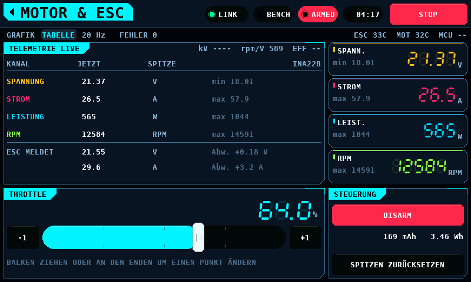

TABELLE listet die vier Kanäle, jeden mit seinem Extremwert. Ein Kanal, für
den nichts geantwortet hat, liest `--`.

Ist der INA228 unter SETUP, ANSCHLÜSSE eingeschaltet und antwortet er
(BENCH-Flag Bit 5), sind Spannung, Strom und Leistung die des INA228: die
Mittelwerte des letzten 50-ms-Fensters des Koprozessors, gelesen mit 20 Hz,
mit den Spitzen des Laufs aus seinen 500-Hz-Abtastungen. Die Kopfzeile nennt
die Quelle, `INA228`, und fügt `ÜBERSTEUERT` an, solange ein Strom im letzten
Fenster oder seit dem Scharfschalten das Ende des Messbereichs des Bauteils
erreicht hat: Strom und Leistung, oder ihre Spitzen, sind dann Grenzen und
keine Werte. Unter den Kanälen listet `ESC MELDET` die eigene
Telemetriespannung und den eigenen Telemetriestrom des ESC von der SENSE-Page,
und `Abw.` ist der Wert des ESC minus den des INA228. Ein ESC, der einen
Strom meldet, den er nicht misst, zeigt eine Abweichung so groß wie der
Messwert. Hört der INA228 während eines Laufs auf zu antworten, bleiben
Spannung, Strom und Leistung bis zum Ende dieses Laufs leer; sie fallen
nicht auf die Werte des ESC zurück. Die Spitzen, die er in diesem Lauf
gemessen hat, bleiben sichtbar, hier und in der Leiste. Ohne INA228 sind die
Kanäle die Telemetrie des ESC, und `ESC MELDET` wird nicht gezeigt.

Die mAh und Wh unter ARM sind die eigenen des INA228, solange BENCH-Flag
Bit 6 gesetzt ist: seine Ladung und Energie seit dem Scharfschalten, im
Bauteil bei jeder Wandlung aufsummiert und in Schritten von 0,01 mAh und
0,01 Wh gelesen. Der Koprozessor nimmt die Summen des letzten Laufs und
Bit 6 beim Scharfschalten von der Bench-Page, und das Panel zählt die ersten
100 ms eines Laufs zusätzlich selbst, sodass eine vor dem Scharfschalten
gebaute Page die Summen des letzten Laufs nicht in diesen trägt. Ohne Bit 6 zählt das Panel beide aus dem gezeigten Strom
und der gezeigten Leistung. Hört der INA228 mitten im Lauf auf zu antworten,
zählt das Panel von seiner letzten Summe weiter, und die Summe geht nicht
zurück.

Die CSV-Datei eines Laufs hat alle 50 ms eine Zeile:

```
time (s);voltage (V);current (A);power (W);rpm (rpm);esc (C);motor (C);charge (mAh);energy (Wh);ina voltage (V);ina current (A);esc current (A);window;ch1 current (A);ch1 max (A);ch1 voltage (V);ch2 current (A);ch2 max (A);ch2 voltage (V);ch3 current (A);ch3 max (A);ch3 voltage (V)
```

`voltage`, `current` und `power` sind, was der Bildschirm zeigt.
`ina voltage` und `ina current` sind die des INA228 und leer, solange er
nicht die Quelle ist; `esc current` ist der eigene Telemetriestrom des ESC,
von der SENSE-Page, solange der INA228 die Quelle ist, sonst von der
BENCH-Page, und leer, wenn der ESC keinen meldet oder das Panel den
Prüfstand simuliert. Eine Größe, die nichts gemessen hat, ist eine leere
Zelle. `window` und die neun Kanalspalten sind das 50-ms-Fenster des
INA3221 -- je Kanal der mittlere und der höchste Strom und die niedrigste
Busspannung -- in der ersten Zeile, nachdem das Panel es gelesen hat, und in
keiner anderen, sodass jedes Fenster einmal in der Datei steht, unter seiner
Nummer; ein Kanal ohne Messwerte im Fenster ist leer. Der Log-Viewer
gruppiert `ina voltage`, `ina current` und `esc current` unter INA228 und
ESC und die Spalten des Fensters unter INA3221.

## Servo


An beliebiger Stelle auf dem Bogen ziehen, um eine Stellung zu befehlen. Der
kräftige Arm ist die gemessene Stellung, der blasse Arm die befohlene. Der
Abstand zwischen beiden ist die Verzögerung des Servos selbst. Die Ringe um
die Spitze pulsieren, solange das Servo angesteuert wird. Den Finger zu heben
lässt noch nicht los: Der Bildschirm wiederholt die letzte Stellung alle
SERVO_HOLD_MS, ein Servo bleibt also stehen, wo es hingestellt wurde. Erst
**FREIGEBEN**, die Schaltfläche, führt die Ruderflächen auf die Mitte zurück --
und auch dann bleiben die Pins gebunden und treiben weiter, auf der Mitte
ihres Wegs. Beendet werden die Flanken durch ein Entschärfen oder durch das
Verlassen des Bildschirms, was entschärft. Bei eingeschaltetem Drehknopf
bewegt dessen Drehung das Horn von dort aus, wo es steht
([der Knopf](#anwendung-der-drehknopf)).

Ein Finger zieht das Zifferblatt. Ein Druck eines zweiten Fingers irgendwo
auf dem Bildschirm beendet den Drag, wie er einen Drag auf SPEED beendet: Das
Horn bleibt, wo es befohlen wurde, und das Zifferblatt folgt wieder nach
einem neuen Druck darauf.

Der Bildschirm treibt die Kanäle, die die Bindung als Ruderflächen markiert,
und weder einen festen Pin noch ein festes Protokoll. Die acht Kanäle von PPM
sind ebenfalls Ruderflächen, ein gebundener PPM-Ausgang bewegt sich also mit
diesem Bildschirm genau wie ein gebundener SERVO-PWM-Ausgang. Ist überhaupt
kein Ruderflächen-Kanal gebunden, kommandiert er nichts und kein Pin bewegt
sich.

TEMPO ist die Geschwindigkeit, mit der der Prüfstand den Ausgang bewegen
darf, und nicht nur eine Geschwindigkeit für die Zeichnung. Bei 100 % geht
der Befehl unverändert durch und das Servo läuft mit seiner eigenen
Geschwindigkeit; darunter rampt der Prüfstand den Befehl davor, 30 % braucht
also dreimal so lange wie 90 %. Die Änderung wirkt sofort auf einen
gehaltenen Ausgang. Ohne Rückmeldung wird das Horn mit derselben Rate
bewegt gezeichnet, bei 100 % sofort am Befehl.

**Vor jeder Bewegung ARM.** Solange der Prüfstand nicht scharf ist, schreibt
der Koprozessor auf jeden PWM-Pin einen Impuls der Länge null: der Arm auf dem
Bildschirm folgt dem Finger, das Servo nicht. Der Knopf ist ein
Zwei-Sekunden-Halten, dieselbe Geste und dieselbe Blende wie auf MOTOR & ESC,
und ein Druck darauf im scharfen Zustand schaltet unscharf. Das Verlassen des
Bildschirms schaltet unscharf und gibt den Pin frei: ein Bildschirm, den man
nicht sieht, darf weder ein Servo halten noch den Prüfstand scharf
zurücklassen.

Die rechte Karte zeigt, was befohlen und gemessen ist, Typ und Bildwiederholrate,
die gelten -- in der Gefahrenfarbe, solange sie ein Servo zerstören können, das
nicht dafür gebaut ist -- und das Netzteil, das das Servo versorgt: Spannung,
Strom und Leistung, abgelesen und über die letzten 13 s geplottet. Ohne Sample
vom Netzteil stehen dort `--`.

GEMESSEN ist der Winkel des Horns ab dem Mittenwert, solange AS5600 in SETUP,
ANSCHLÜSSE eingeschaltet ist, der Sensor antwortet und seinen Magneten
erkennt: `+38.0 deg`, Zehntelgrad, -180.0 bis +179.9, 20-mal in der Sekunde
gelesen. Antwortet der Sensor nicht oder meldet er keinen Magneten (STATUS MD
nicht gesetzt), steht dort `---`: sein Zählerstand ist dann kein Winkel. Ein
als zu schwach oder zu stark gemeldeter Magnet lässt den Winkel stehen; das
Alert-Band sagt, welches von beiden. Bei ausgeschaltetem AS5600 zeigt die Zeile
den Winkel der Rückmeldung. Die befohlene Stellung
daneben ist die Pulsbreite in Mikrosekunden.

**Das Netzteil wird auch hier eingestellt und geschaltet.** Die Zeile SOLL
unter dem Plot trägt die beiden Sollwerte von SUPPLY, Spannung und
Strombegrenzung, und seinen Ausgangsschalter. Es sind die von SUPPLY, keine
Kopie: eine Änderung auf einem Bildschirm ist die Änderung auf beiden.

- Ein Tippen auf einen Sollwert öffnet das Keypad über der linken Karte. Ein
  Wert außerhalb der Grenzen wird hineingeholt, wie auf SUPPLY.
- Ist der Ausgang an, wartet ein getippter Sollwert auf die Rückfrage von
  SUPPLY, AUSGANG IST EIN, mit ÜBERNEHMEN und ABBRECHEN, außer SUPPLYs OPTIONEN, RÜCKFRAGE
  IM BETRIEB, TASTENFELD ist aus. Die Rückfrage verschwindet unbeantwortet, wenn
  der Ausgang ausgeht oder STOP gedrückt wird. Ein ÜBERNEHMEN im selben Frame
  wie STOP übernimmt nichts, auch wenn das Netzteil den Ausgang erst eine
  Messung später als aus meldet.
- Eine Spannung, die von 6,0 V oder darunter auf mehr als 6,0 V erhöht wird,
  öffnet die Warnung NUR HV-SERVOS: Standardservos sind für 4,8 bis 6,0 V
  ausgelegt, darüber arbeitet nur ein als HV (high voltage) spezifiziertes
  Servo innerhalb seiner Spezifikation; ein Standardservo kann darüber sofort
  zerstört werden. Die Spannung gilt erst, nachdem HALTEN
  ZUM ÜBERNEHMEN 2 s gehalten wurde, dieselbe Geste wie bei der Profilwarnung;
  ABBRECHEN verwirft sie. STOP beendet das Halten. Bei eingeschaltetem Ausgang ersetzt sie die Rückfrage
  von SUPPLY und bleibt stehen, wenn der Ausgang ausgeht. Eine Spannung, die
  schon über 6,0 V liegt, ändert sich ohne sie. Eine auf SUPPLY eingestellte
  Spannung öffnet sie nicht.

  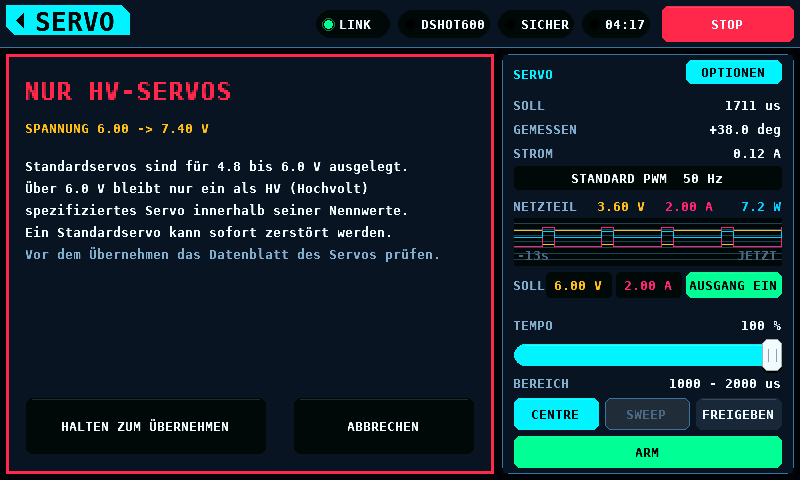

- AUSGANG EIN ist ein Halten über zwei Sekunden, AUSGANG AUS ein Tippen, wie auf
  SUPPLY. STOP beendet ein laufendes Halten. Liegt der Spannungssollwert über
  6,0 V, gleich wo er eingestellt wurde, öffnet AUSGANG EIN stattdessen NUR
  HV-SERVOS mit der Spannung, und der Ausgang geht erst an, nachdem HALTEN ZUM
  ÜBERNEHMEN 2 s gehalten wurde; das Halten des Schalters selbst und ein Tippen
  auf ÜBERNEHMEN schalten nichts ein. Ein Sollwert, der während des gewöhnlichen
  Haltens über 6,0 V steigt -- auf SUPPLY, oder nach einem Lauf
  zurückgesetzt --, wird beim Abschluss des Haltens gesehen: NUR HV-SERVOS
  öffnet sich, und nichts geht an. Beim Verlassen von SERVO bleibt
  der Ausgang, wie er ist; ein Druck auf AUSGANG AUS beim Verlassen wird als
  das OFF gesendet, das er war.

**SWEEP fährt das Servo eine Kurve ab**, auf dem Koprozessor, wo das Timing
nicht vom Link abhängt: KURVE (Rechteck, Sinus oder Dreieck), TEMPO (0,05 bis
5 Zyklen je Sekunde) und VERWEILEN (die Haltezeit an jedem Ende) von der
TEST-Seite, um PULS CENTRE herum. BEREICH ist ein Anteil des Wegs, den das
Servo machen darf: von WEG und vom näheren von PULS MIN und MAX, damit die
Kurve kein Ende erreicht, das sie nicht erreichen darf. TEMPO auf der rechten
Karte begrenzt sie wie ein Ziehen, Trim gilt nicht. Das Horn folgt derselben
Kurve, im Panel gerechnet und ab dem Moment, in dem der Koprozessor seine
gestartet hat. Das Panel zeichnet nur, was der Koprozessor bekanntermaßen
tut: ein verlangter oder fortgesetzter Sweep wird gezeichnet, sobald sein
Start quittiert ist, und bis dahin bleibt das Horn, wo der Ausgang ist.
Ohne Rückmeldung wird es dann ab der Stelle weitergerechnet, an der der
Ausgang war, als der Koprozessor begann, entlang der Kurve mit TEMPO. Zwei
Tipper auf den Sweep-Knopf, die den Bildschirm im selben Frame erreichen,
bevor der Befehl des ersten hinaus ist, heben sich auf: nichts wird
gesendet, und der Sweep läuft weiter wie zuvor.

**PAUSE hält sie an.** Während ein Sweep läuft, heißt der Knopf PAUSE, in der
Akzentfarbe. Ein Tippen hält die Kurve dort an, wo der Ausgang gerade steht
-- TEMPO kann ihn hinter der Kurve zurücklassen --, und hält ihn dort; der
Knopf heißt dann PAUSIERT, gefüllt in der Warnfarbe. Das Halten übernimmt der
Koprozessor (das HOLD des Links, SWEEP-Register 4), weil nur er genau weiß,
wo das ist; ohne Rückmeldung ist das im Panel gezeichnete Horn eine Schätzung
davon. Das Panel wiederholt das Halten alle 100 ms (`SERVO_HOLD_MS`), daher
überdauert eine Pause die 500-ms-Regel des Koprozessors. Eine Pause wartet
nicht hinter Sweep-Schreibvorgängen, die schon auf dem Draht sind. Ein
Tippen auf PAUSIERT setzt den Sweep an dem Punkt der Kurve fort, an dem er
angehalten wurde: die Stelle in einem Verweilen und die erreichten Enden
laufen von dort weiter, und das Horn wird ab dieser Phase gezeichnet. Die
Phase ist die der Kurve, als der Koprozessor das HOLD quittiert hat, nicht
die beim Tippen: dort läuft die Kurve während des Austauschs dazwischen
weiter, und so läuft auch die Zeichnung weiter, mit dem TEMPO, das beim
Tippen galt, höchstens 500 ms lang -- so lange führt der Koprozessor einen
Sweep, von dem er nichts mehr hört. Ohne Rückmeldung wird das Horn dann
dorthin gesetzt, wo der Ausgang bei der Quittung war: die Kurve bis zu
dieser Phase, verlangsamt wie in der Zeichnung. Ein dazwischen geändertes TEMPO erreicht den Koprozessor erst mit dem
Fortsetzen. Ein Tippen auf PAUSIERT lässt das Horn stehen, bis das
Fortsetzen quittiert ist; dann misst das Panel die Zeichnung ab der Phase,
die der Koprozessor behalten hat, so wie es die beiden Quittungen gemessen
hat, auch wenn das Tippen vor der Quittung des HOLD kam; diese Quittung
setzt das Horn dann noch dorthin, wo der Koprozessor den Ausgang gehalten
hat, und das Fortsetzen geht von dort weiter. Der
Koprozessor behält die Phase, solange er hält, und setzt die Kurve fort
(`LINK_SV_RESUME`, Protokoll 4.6); der Ausgang fährt mit der Rate von TEMPO
von der gehaltenen Stelle zur Kurve, bei 100 % sofort, und ist meist schon
dort. Eine während der Pause auf der TEST-Seite geänderte Kurve startet
stattdessen als neuer Sweep. Ein Koprozessor älter als 4.6, oder einer, der
das Fortsetzen abweist, weil sein Halten geendet hat, startet die Kurve von
ihrem Anfang -- in der Mitte bei Sinus und Dreieck, am ersten Ende beim
Rechteck --, und das Alert-Band sagt es: `Koprozessor älter als 4.6 -- der
Sweep beginnt von vorn` oder `Koprozessor lehnte das Fortsetzen ab -- der
Sweep beginnt von vorn`. Ebenso ein Tippen auf PAUSIERT, während der HOLD
unbeantwortet ist, denn der Koprozessor kann dann halten oder noch laufen:
`Pause unbeantwortet -- der Sweep beginnt von vorn`. Ein Tippen auf
PAUSIERT vor einem HOLD, den das Panel dann loslässt (siehe unten),
startet nichts: die Pause endet mit diesem HOLD.

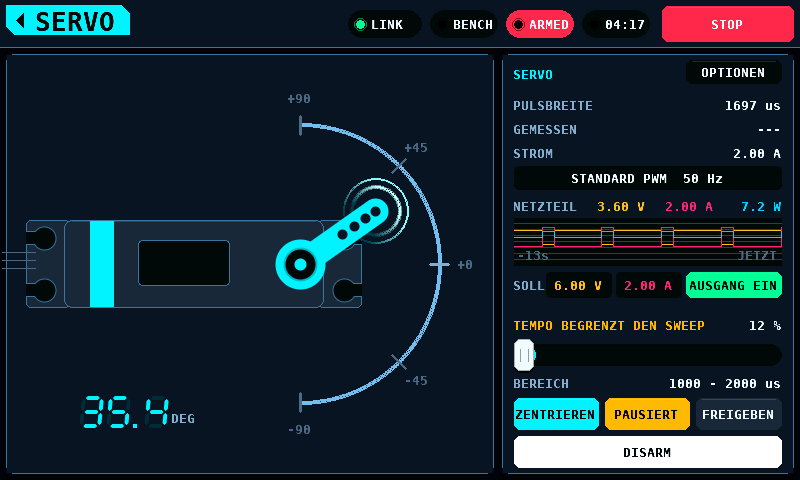

Ein Halten, das der Link 500 ms nicht wiederholt hat, hat das andere Ende
losgelassen; das Panel gibt die Surfaces dann zur Mitte frei, und das Horn
geht dorthin. Ebenso ein HOLD, der erst bei einer Wiederholung oder nach
mehr als 500 ms beantwortet wurde: der Koprozessor kann ihn losgelassen und
anderswo erneut gehalten haben, wo er hält, ist im Panel also nicht
bekannt, und die Pause endet, statt einen Winkel zu behalten, den eine
spätere Profiländerung an das Servo schicken würde. Fällt der Link weg,
endet ein Sweep oder eine Pause ebenfalls, und das Horn wird in Ruhe
gezeichnet, wie der Koprozessor die Surfaces 500 ms nach dem letzten
Schreiben in Ruhe setzt; kein vorher verlangter Sweep und kein Halten
wird gesendet, wenn der Link zurückkommt, und das nächste Tippen startet
einen Sweep. Ein Finger auf der Skala, ZENTRIEREN, FREIGEBEN, STOP, ein
Disarm und das Verlassen der Seite beenden einen Sweep, ob er läuft oder
angehalten ist, und der Knopf heißt wieder SWEEP. Ein geänderter Typ, eine
geänderte Frame Rate, Pulsbreite, Trim, WEG oder REVERSE beenden auch eine
Pause; das Servo wird dann als Position am Winkel der Pause gehalten. Mit
Rückmeldung ist das der Winkel, den das Servo zuletzt gemeldet hat und zu
dem es sich nach dem Tippen noch bewegen kann; ohne Rückmeldung ist es die
gezeichnete Schätzung bei der Quittung. Ein
geändertes TEMPO lässt die Pause stehen; das Fortsetzen läuft mit dem neuen
TEMPO. Verlorene Touch-Ereignisse halten einen laufenden Sweep an wie PAUSE.
Eine geänderte Einstellung startet einen laufenden Sweep mit der neuen Kurve
neu, gezeichnet ab der Quittung des Koprozessors; bis dahin wird die alte
Kurve weitergezeichnet, wie der Koprozessor sie fährt, mit den Pulsen und
dem WEG, mit denen sie gesendet wurde. Jede Quittung wird dem Befehl
zugeordnet, den sie beantwortet: ein TEMPO oder eine Kurve, die geändert
wird, während ein Start wartet, wird nicht von der Quittung des früheren
Befehls gezeichnet. Ein geändertes
Profil oder eine geänderte Frame Rate geht sofort mit.
SWEEP gibt es bei scharfem Prüfstand, mit einer gebundenen Surface und
stehendem Link und einem Koprozessor mit Protokoll 4.2, sonst ist der Knopf ausgegraut;
der Koprozessor hält eine Kurve an, die das Panel 500 ms nicht wiederholt hat,
und lässt jede Surface dort stehen, wo ihr Ausgang gerade ist.

**TEMPO BEGRENZT DEN SWEEP** steht in der Warnfarbe statt der Beschriftung
TEMPO auf der rechten Karte, solange TEMPO langsamer ist als die schnellste
Änderung, die die Kurve verlangt. Dann bestimmt TEMPO die Bewegung, nicht
KURVE: Rechteck, Sinus und Dreieck laufen alle als Rampen mit der Rate von
TEMPO und sehen gleich aus, und der Ausgang kann umkehren, bevor er ein Ende
erreicht. Die Zeile folgt den Einstellungen; sie erscheint also schon vor
dem Druck auf SWEEP und ebenso, während ein Sweep läuft. TEMPO erhöhen oder
TEMPO (die Rate in Hz) oder BEREICH auf der TEST-Seite senken, dann
verschwindet sie. Ein Rechteck springt zwischen seinen Enden, daher erscheint
sie dort bei jedem TEMPO unter 100 %. Mit den Vorgaben der TEST-Seite
(Sinus, 0,5 Hz, BEREICH 80 %) und WEG +/-90 Grad verschwindet sie
ab TEMPO 63 %, beim Dreieck ab 40 %.
[Servoverfahren](Servo-de.md#sweep-und-tempo) nennt die Regel.

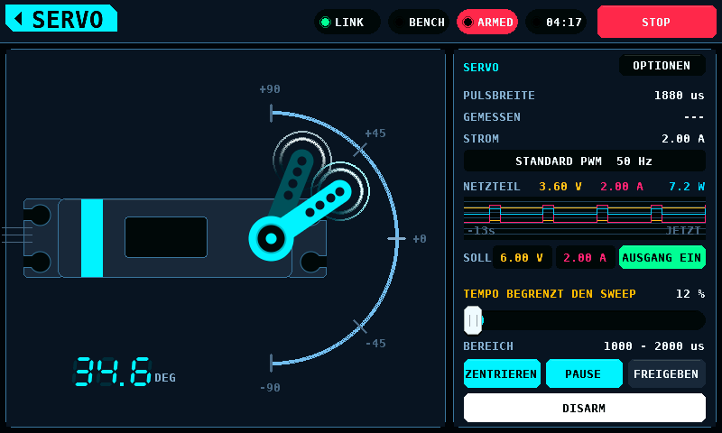

**TEST STARTEN startet den automatischen Test** auf der TEST-Seite: das Servo
wird durch die dort gewählten Spannungen geführt, sein Strom in Ruhe, in
Bewegung und beim Halten gemessen, seine Stellzeit gemessen, und die
Spannung gesucht, bei der es sich nicht mehr bewegt. [Servoverfahren](Servo-de.md#automatischer-test)
beschreibt das Verfahren und die Dateien. TEST STARTEN braucht einen scharfen
Prüfstand und ein Netzteil, das antwortet; die Zeile darunter sagt ZUERST ARM,
KEINE STUFE GEWÄHLT, NETZTEIL ANTWORTET NICHT, BEREICH ZU KLEIN (die Enden aus BEREICH
und WEG fallen auf PULS CENTRE), STUFE ÜBER DEN OBERGRENZEN (eine
gewählte Stufe über der geltenden Spannungsgrenze, geprüft, bevor eine
Warnung aufgeht) oder LETZTER BERICHT SCHREIBT NOCH und folgt dem Prüfstand und
den Einstellungen, wenn sie sich ändern. Es ist ein Halten über zwei Sekunden,
die Geste von AUSGANG EIN, weil ein Lauf das Netzteil einschaltet und das Servo
bewegt. Ist HV SERVO an und eine Stufe über 6,0 V gewählt, öffnet ein Tippen
stattdessen NUR HV-SERVOS mit der höchsten Stufe, und der Lauf startet erst,
nachdem HALTEN ZUM ÜBERNEHMEN 2 s gehalten wurde. HV SERVO gilt für die Sitzung:
jeder Neustart schaltet es aus.

Die Einstellungen schließen sich beim Start, und Stufe und Phase stehen oben
auf der linken Karte. Der Lauf führt das Servo und die Sollwerte und den
Schalter von SUPPLY, bis er endet. Er endet vorzeitig, mit ausgeschaltetem
Ausgang und dem Servo zur Mitte freigegeben, bei TEST BEENDEN (auf der linken
Karte oder der TEST-Seite), STOP, einem Disarm, wenn der Link geht, beim
Verlassen der Seite, bei einem Finger auf der Skala, ZENTRIEREN, SWEEP,
FREIGEBEN, einem Tippen auf einen Sollwert, einer Änderung an Typ, Impulsen,
Trim, Weg, Reverse oder TEMPO des Servos, bei verlorenen Touch-Ereignissen
und beim Netzteil: siehe [die Liste](Servo-de.md#was-einen-lauf-beendet).
Ist ein Lauf vorbei, gehen die Sollwerte von SUPPLY auf ihre Werte vor dem
Lauf zurück, gleich welche Seite oben ist. Das wartet, bis das OFF des
Laufs gesendet ist, ein danach genommener Messwert zeigt, dass das
Netzteil selbst den Ausgang aus meldet -- nicht die Anforderung des Panels,
der das PD mini einen Link-Austausch und eine Modultransaktion später
folgt --,
kein ON unterwegs ist und AUSGANG EIN weder auf SERVO noch auf SUPPLY
gehalten wird. Sollwerte, die nach
dem Ende des Laufs geändert wurden, bleiben, wie sie sind.


Das Ergebnis bleibt bis SCHLIESSEN auf der linken Karte: BESTANDEN, NICHT BESTANDEN oder ABGEBROCHEN
und der Grund, die längste Stellzeit und der höchste Haltestrom, und die
Dateien, die die Karte angenommen hat: `BENCHnnn.CSV`, und `+ .TXT`, sobald
die Karte den Bericht vollständig angenommen hat.

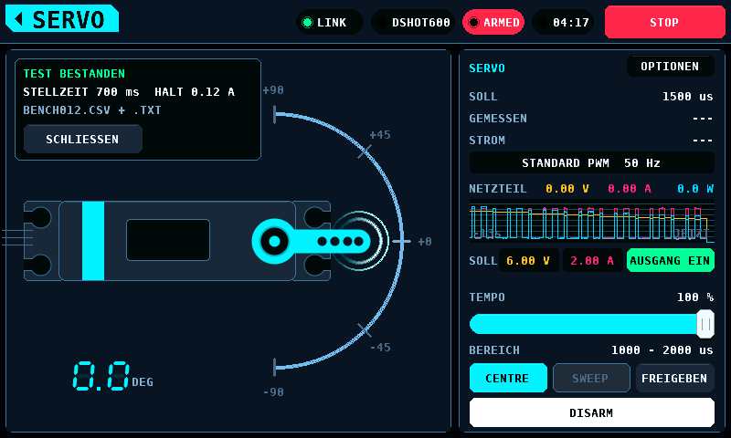

### Einstellungen

OPTIONEN, oben auf der rechten Karte, öffnet die Einstellungen des Servos über
der linken Karte. ARM, ZENTRIEREN, FREIGEBEN und STOP bleiben, wo sie sind, und
funktionieren. Ein Wert öffnet die Tastatur, eine Liste eine Liste, ein
Schalter kippt beim Tippen, und der Name öffnet eine Buchstabentastatur.

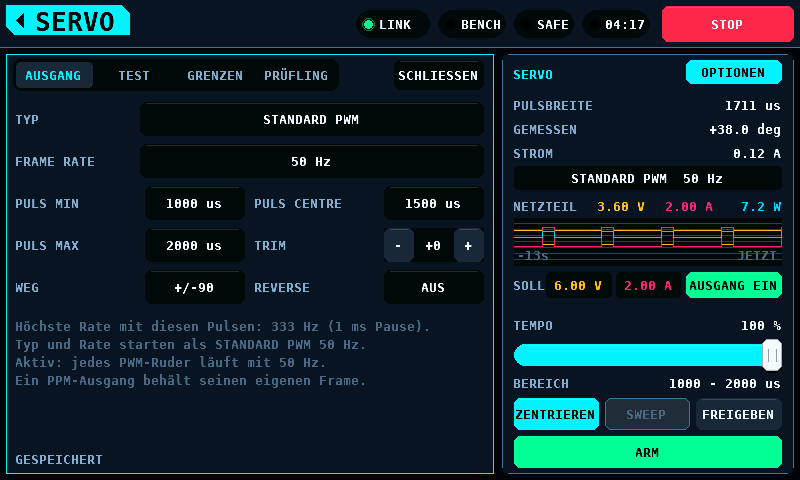

| Seite | Einstellung | Wirkung |
| --- | --- | --- |
| AUSGANG | TYP | das Servoprofil: STANDARD PWM, NARROW 760, WIDE, HELI CYCLIC oder HELI TAIL 760 |
| AUSGANG | FRAME RATE | wie oft ein Impuls gesendet wird; die Liste des Typs oder EIGENE über die Tastatur |
| AUSGANG | PULS MIN, CENTRE, MAX | die Impulsbreiten, auf die der Weg abgebildet wird, 400 bis 2500 us: -90 Grad ist MIN, 0 ist CENTRE, +90 Grad ist MAX, und FREIGEBEN ruht auf CENTRE. Ein Ende liegt nicht weiter von CENTRE entfernt als CENTRE von 400 us oder 2500 us |
| AUSGANG | TRIM | zur Mitte addiert, 5 us je Schritt, bis 200 us in jede Richtung |
| AUSGANG | WEG | wie weit der Arm in jede Richtung darf, 10 bis 90 Grad |
| AUSGANG | REVERSE | die Richtung, in der der Winkel auf den Impuls abgebildet wird |
| TEST | KURVE, TEMPO, BEREICH | die Bewegung von SWEEP: Rechteck, Sinus oder Dreieck, 0,05 bis 5 Hz, 10 bis 100 % des Wegs. Der automatische Test springt zwischen den Enden, die BEREICH ergibt |
| TEST | LÄNGE NACH, TESTZEIT, BEWEGUNGEN | wie lange jede Spannungsstufe läuft: eine Zeit oder eine Zahl von Bewegungen |
| TEST | VERWEILEN, EINSCHWINGEN | Haltezeit an jedem Ende; Wartezeit nach einer Spannungsstufe vor dem Messen |
| TEST | STUFE 4.8 / 6.0 / 7.4 / 8.4 V, BROWN-OUT | die Spannungsstufen und der Brown-out-Lauf ab 5,0 V abwärts; 7,4 und 8,4 V laufen nur mit HV SERVO an |
| TEST | HV SERVO | nimmt die Stufen 7,4 und 8,4 V hinzu, vorgegeben aus und nach jedem Neustart aus; ein Lauf mit ihnen startet nur über NUR HV-SERVOS |
| TEST | TEST STARTEN | der automatische Test: 2 s Halten bei scharfem Prüfstand; TEST BEENDEN, solange er läuft |
| GRENZEN | SPANNUNG MAX, STROM MAX | die Grenzen des Bildschirms SUPPLY, dieselben Einstellungen |
| GRENZEN | BLOCKIERT AB | über diesem Strom gilt das Servo als blockiert |
| GRENZEN | RUHESTROM, HALTESTROM, STELLZEIT | Pass/Fail-Grenzen; 0 wird nicht geprüft |
| PRÜFLING | NAME | das Testobjekt, bis 23 Zeichen, für den Bericht |
| PRÜFLING | BERICHT | ein Textbericht neben dem Log jedes Tests |
| PRÜFLING | AS5600 | der Ausgangsencoder, dieselbe Einstellung wie SETUP, ANSCHLÜSSE, AS5600: fügt den Winkel des Horns der Zeile GEMESSEN sowie der CSV und dem Bericht eines Laufs hinzu ([Servo](Servo-de.md#der-ausgangsencoder)) |
| PRÜFLING | ENC-MITTE | ein Tippen nimmt den aktuellen Zählerstand als Mitte, wenn das Servo in Neutral steht, und setzt nichts ohne einen Messwert vom aktuellen Link (keinen nach einem Linkverlust, bis ein neuer eintrifft) und solange der Sensor keinen Magneten meldet; die Zeile zeigt den gespeicherten Zählerstand, 0 bis 4095, und ist bei ausgeschaltetem AS5600 gedimmt. Dieselbe Einstellung wie SETUP, ANSCHLÜSSE, AS5600-Mitte |

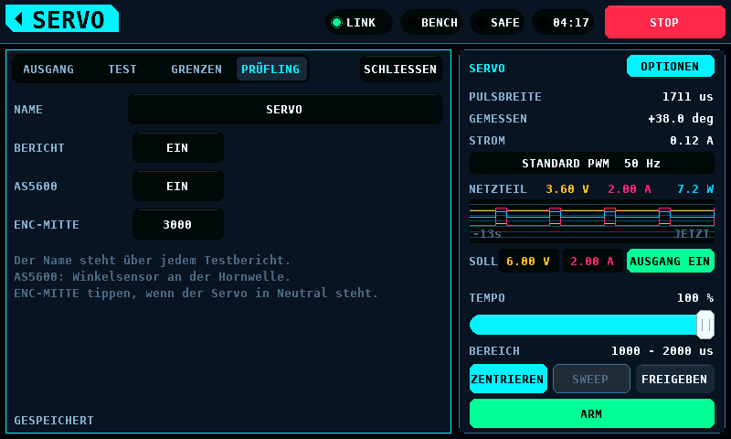

| Typ | Mitte | Weg | Bildwiederholraten |
| --- | --- | --- | --- |
| STANDARD PWM | 1500 us | 1000-2000 us | 50, 60, 100, 150, 200, 250, 300, 333 Hz |
| NARROW 760 | 760 us | 660-860 us | wie STANDARD PWM |
| WIDE | 1500 us | 800-2200 us | wie STANDARD PWM, bis 312 Hz |
| HELI CYCLIC | 1520 us | 820-2220 us | 50, 120, 200, 333 Hz |
| HELI TAIL 760 | 760 us | 410-1110 us | 200, 333, 560 Hz |

Ein Impuls braucht eine Pause vor dem nächsten Frame. STANDARD PWM, NARROW 760
und WIDE halten mindestens 1 ms zwischen den Impulsen, ihre höchste Rate ist
also 1 / (längster Impuls + 1 ms): 333 Hz bei 2000 us. Die Heli-Profile laufen
mit den Raten, die Rotorflight für digitale Taumelscheiben- und
Schmalband-Heckservos nennt, mit mindestens 0,5 ms zwischen den Impulsen. Eine
Rate, die den Impulsen keine Pause lässt, wird abgelehnt, ebenso ein längerer
PULS MAX bei einer Rate, in die er nicht passt. Die Pause gilt nach dem
längsten Impuls, den der Koprozessor ausgeben kann, dem oberen Ende des
Bereichs, den ein Befehl trägt: PULS MAX, oder darüber hinaus, wenn CENTRE
nicht in der Mitte liegt, um so viel, wie CENTRE näher an MAX liegt als an MIN.
Ein CENTRE, der dieses Ende über die Pause der Rate schieben würde, wird
ebenfalls abgelehnt.

**Ein Heli-Typ oder jede Bildwiederholrate über 60 Hz kann ein Servo zerstören,
das nicht dafür gebaut ist.** Die Wahl öffnet eine Warnung in der
Gefahrenfarbe, die nennt, was gewählt ist und was es mit einem nicht dafür
gebauten Servo macht; angewendet wird es erst, nachdem HALTEN ZUM ÜBERNEHMEN 2 s
gehalten wurde. ABBRECHEN, ein abrutschender Finger, ein Touch-Verlust und das
Verlassen des Bildschirms wenden nichts an. Typ und Rate bleiben auf der
rechten Karte rot, und jeder Neustart geht auf STANDARD PWM mit 50 Hz zurück:
ein nach einem Neustart angestecktes Servo bekommt nie eine Rate, die für ein
anderes gedacht war.

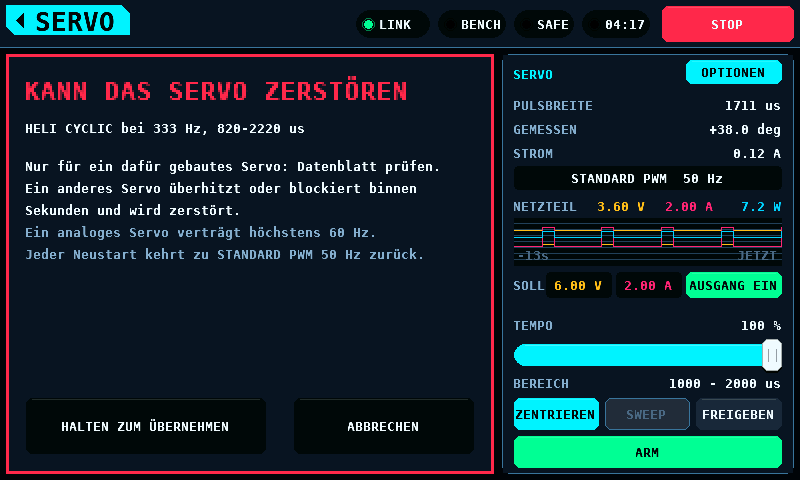

**Die Frame Rate erreicht die Pins** über die SERVO-Page des Koprozessors
(Protokoll 4.1). Sie gilt für jeden PWM-Ausgang, dessen erster Kanal die Rolle
surface hat; ein PPM-Ausgang behält seinen eigenen Frame. Sie geht mit jeder
gehaltenen Stellung hinaus, und ein Profilwechsel, während das scharfe Servo
ruht, setzt die Ruhelage mit ihr neu; einer, der während eines laufenden Arm
geschieht, ist der, den der Arm verwendet. Eine schnellere Rate folgt den
Impulsbreiten, sobald alle angekommen sind; jede andere Rate geht ihnen voraus,
und nichts Breiteres geht hinaus, bevor sie angekommen ist. So tragen die Pins
nie eine schnelle Rate mit den breiteren Impulsen eines langsameren Profils.
Die AUSGANG-Seite sagt, was aus ihr wurde:

| Hinweis | Bedeutung |
| --- | --- |
| In force | jede PWM-Surface läuft mit der angezeigten Rate |
| The rate goes with the next position | noch nicht geschrieben |
| ABGELEHNT | eine Surface teilt sich einen PWM-Slice mit einem Ausgang auf einer anderen Rate; die Pins behalten ihre Rate |
| This coprocessor takes no frame rate | Protokoll 4.0: jeder PWM-Ausgang läuft mit den 50 Hz seiner Bindung |

Ein Neustart des Koprozessors und jede auf OUTPUTS geschriebene Bindung setzen
jeden Slot auf seine eigene Rate zurück, 50 Hz für ein Servo; die Seite sendet
ihre Rate mit der nächsten Stellung erneut, gegen die dann geltende Bindung.
Eine Bindung wird nicht geschrieben, solange das Zurücksetzen auf die eigene
Rate jedes Slots unbeantwortet bleibt, und der Prüfstand wird von keiner
Seite aus scharf, solange die Rate der Surfaces nicht bekannt ist: Der Arm
wird mit `Frame Rate des Servos unbekannt -- erneut ARM` abgelehnt, und ein Arm, der
bei unterbrochenem Link gemacht wurde, erreicht den Koprozessor erst, wenn das
Zurücksetzen angekommen ist.

Die AUSGANG-Einstellungen und HV SERVO gelten für die Sitzung; die übrigen
Einstellungen unter TEST, GRENZEN und PRÜFLING liegen im NVS (Non-Volatile Storage)
und werden wie bei SUPPLY geschrieben.

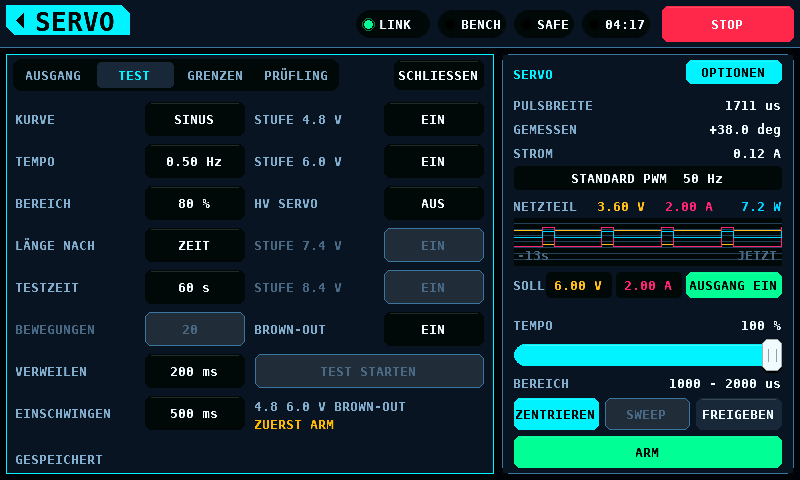
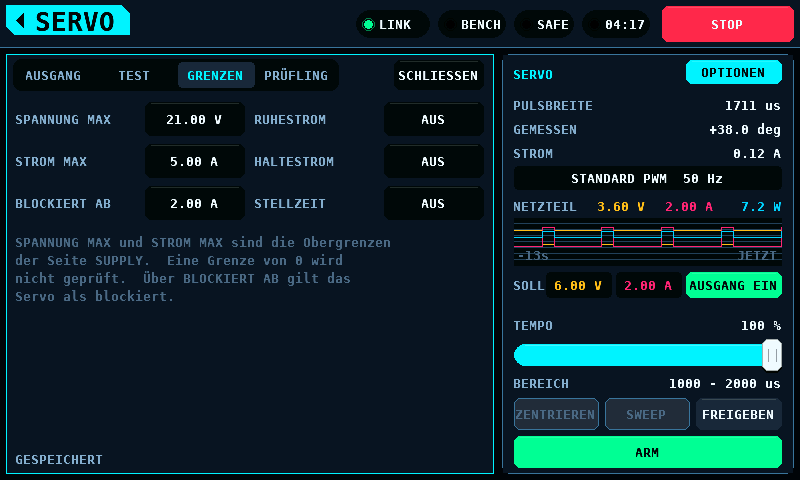
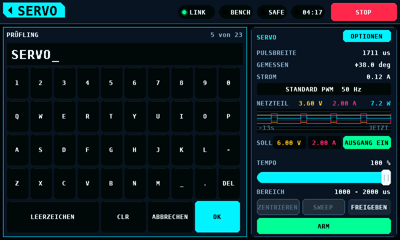

Aktuelle Einschränkungen:

- Bis die Seite eine Stellung sendet, laufen die Pins mit der Rate, die die
  SERVO-Page hält; nach einem Neustart oder einer neuen Bindung sind das 50 Hz.
- Der automatische Test ist nicht auf Hardware gelaufen, und am
  Netzteilmodell des Panels sind seine Ströme die Last des Modells, nicht die
  des Servos: ein Lauf dort misst das Modell. [Was nicht gemessen ist](Servo-de.md#nicht-auf-hardware-gelaufen).
- Das Netzteil auf der rechten Karte ist das von SUPPLY: der PD mini, wenn
  SETUP ihn einschaltet, sonst das Modell des Panels, dessen Spannung, Strom
  und Leistung simuliert und nicht gemessen sind.

## Netzteil

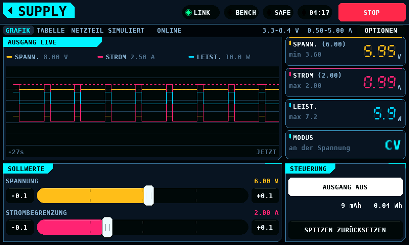

Stellt ein programmierbares Netzteil ein, schaltet es und zeichnet es auf: den
PD mini, einen USB-PD-Trigger (USB Power Delivery), der über einen UART
(Universal Asynchronous Receiver-Transmitter) gesteuert wird. Der
Koprozessor steuert ihn über einen PIO-UART (PIO: Programmable
Input/Output) auf zwei seiner Pins, über die SUPPLY-Link-Page (Protokoll
4.3). Das Panel schreibt die Page und liest sie alle 100 ms. Ist der PD mini
in SETUP unter ANSCHLÜSSE eingeschaltet, sagt die Kopfzeile PD MINI. Ist er
abgeschaltet, rechnet das Panel an seiner Stelle ein Modell eines
Netzteils: die Kopfzeile sagt NETZTEIL SIMULIERT, und die Kachel im Menü trägt
SIMULIERT. Gegen ein Modul lief der PD mini mit 0.10.0 und 0.10.1; nichts,
was nach 0.10.1 hinzukam.

Das Layout ist das von MOTOR & ESC. Der Plot zeigt Spannung, Strom und
Leistung der letzten 27 s. Die Leiste rechts zeigt die Messwerte, die
niedrigste Spannung des Laufs und seinen höchsten Strom und seine höchste
Leistung. MODUS sagt, welchen Sollwert das Netzteil hält: CV (constant voltage)
bei der eingestellten Spannung oder CC (constant current) an der
Strombegrenzung. CC steht in der Warnfarbe: ein Netzteil in CC liefert der
Last nicht die Spannung, auf die es gestellt ist.

Ein Sollwert steht neben seinem Messwert. SPANN. und STROM tragen ihn in Klammern
hinter dem Namen, und der Plot zeichnet ihn gestrichelt in der Farbe und auf
der Skala des Messwerts. TABELLE führt beide auf. Der Wert in Klammern ist der
Sollwert, den das Netzteil zu halten meldet; solange es nicht antwortet, der
des Bildschirms.

| Sollwert | Modell | PD mini | Knöpfe |
| --- | --- | --- | --- |
| SPANNUNG | 3,3 bis 21 V, Schritte von 20 mV | 1 bis 20 V, Schritte von 10 mV | 0,1 V |
| STROMBEGRENZUNG | 0,5 bis 5 A, Schritte von 50 mA | 0,05 bis 3 A, Schritte von 10 mA | 0,1 A |

Die Bereiche des Modells sind das weiteste Profil einer USB-PD-PPS-Quelle
(Programmable Power Supply), 3,3 bis 21 V bei bis zu 5 A. Die des PD mini
stammen von der Seite des Herstellers und sind nicht gemessen. Der PD mini
ist ein Abwärtswandler und gibt nicht mehr ab, als er bekommt: seine
Spannung ist zusätzlich auf 0,5 V unter der Eingangsspannung begrenzt, die
er meldet, an 5 V Eingang also höchstens 4,5 V. Ein Sollwert über dem
Eingang bringt das Modul in ERR, bis es stromlos war; die 0,5 V Abstand
sind nicht gemessen. Beide engen
die Grenzen unter OPTIONEN ein, und die Schieber folgen dem Netzteil, das
in Gebrauch ist. Ein Tippen auf eine Spur setzt den Wert unter dem Finger.

**Ein Tippen auf die Karte SPANN. oder STROM oder auf den Wert eines Sollwerts
öffnet eine Tastatur** über der linken Spalte. Sie zeigt den Bereich in der
Titelzeile und den aktuellen Wert blass, bis eine Ziffer getippt ist. OK
übernimmt einen Wert im Bereich, gerundet auf den Schritt des Netzteils; ein
Wert außerhalb wird abgelehnt, und der Bereich wechselt in die Warnfarbe. OK
ohne Eingabe und ABBRECHEN lassen den Sollwert, wie er war.

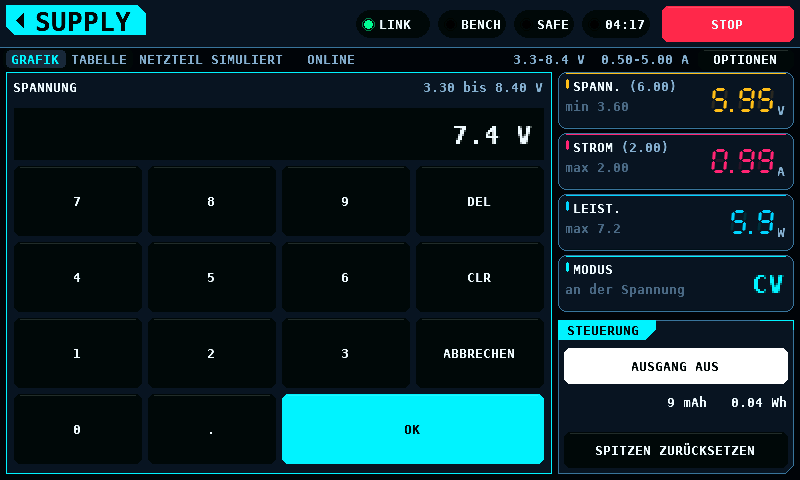

**Eine Änderung an einem eingeschalteten Ausgang fragt zuerst.** Solange der
Ausgang an ist, öffnet ein neuer Sollwert vom Schieber oder seinen
Schrittknöpfen oder von der Tastatur eine Frage, die die Änderung nennt.
ÜBERNEHMEN gibt sie dem Netzteil; ABBRECHEN verwirft sie, und der Schieber geht
zurück. Ein Ziehen fragt einmal, beim Loslassen, und bis dahin hält das
Netzteil den alten Sollwert. Bei ausgeschaltetem Ausgang wird nichts gefragt.
STOP schließt die Frage unbeantwortet: ein ÜBERNEHMEN im selben Frame (etwa
50 ms) wie STOP übernimmt nichts. OPTIONEN schaltet die Frage für den Schieber und für die Tastatur getrennt
ab.

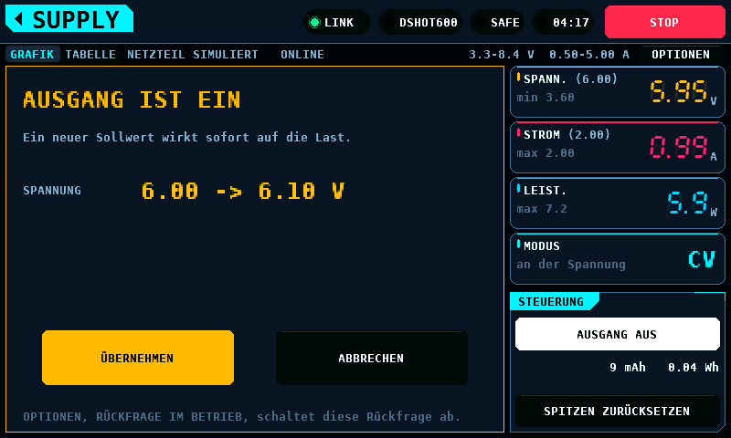

**AUSGANG EIN ist ein Zwei-Sekunden-Halten**, dieselbe Geste und dieselbe Blende
wie ARM. AUSGANG AUS ist ein Tippen. STOP schaltet den Ausgang auf jedem
Bildschirm ab. Ebenso jeder andere Stopp, den der Prüfstand zählt -- ein
Touch, der nicht mehr antwortet, ein ON, dessen Touch-Ereignisse verloren
gingen, bevor der Bildschirm es zeigte, und ein Koprozessor, der nicht scharf
bleiben will -- sowie ein Netzteil, das nicht mehr antwortet, und eine Abschaltung.
Der Ausgang bleibt aus, bis er wieder eingeschaltet wird. Das Verlassen des
Bildschirms lässt den Ausgang an, damit ein Servo oder ein ESC am Netzteil auf
dem Bildschirm versorgt bleibt, der es testet; der Bildschirm für den
verlorenen Link, der kein STOP hat, öffnet sich nicht, solange der Ausgang an
ist.

**Mit dem PD mini** geht ein OFF vor allem anderen an die SUPPLY-Page, was
das Panel ihr schuldet, und der Koprozessor schaltet den Ausgang selbst ab,
wenn der Heartbeat des Panels ausbleibt. Ein eingeschalteter PD mini zeigt
ANTWORTET NICHT, solange kein Koprozessor antwortet, der Protokoll 4.3
spricht, oder solange die Messwerte der Page älter als 1500 ms sind; ein
Ausgang, der an ist, wird dann abgeschaltet. Ebenfalls abgeschaltet, mit
einer Zeile im Band, wird der Ausgang, wenn der Koprozessor ein ON abweist
(kein Heartbeat) oder eines fallen lässt (sein Heartbeat blieb aus, oder er
ist neu gestartet). Schaltet das Modul den Ausgang selbst ab -- sein Überstromschutz oder sein
Knopf --, wird er ebenfalls abgeschaltet und erst mit einem neuen Halten
wieder eingeschaltet. Das Band sagt außerdem, wenn die Pins abgewiesen werden,
wenn der Ausgang nicht schalten will und wenn die Sollwerte nicht übernommen
werden. Eine Änderung der Pins oder der Baudrate und das Ein- oder Ausschalten
des PD mini schalten den Ausgang ab.

**Ein einbrechender Eingang schaltet den PD mini ab.** Solange der Ausgang an
ist, liest der Koprozessor den Eingang des Moduls alle 500 ms. Liegt der
Eingang bei 2 Lesungen hintereinander unter dem Sollwert plus 0,5 V, schaltet
er den Ausgang sofort ab, und das Band nennt Eingang und Sollwert, zum
Beispiel `Eingang des PD mini 6.18 V unter Sollwert 6.00 V + 0,5 V -- Ausgang aus`.
Der Ausgang bleibt aus bis zu einem neuen Halten. Eine einzelne niedrige
Lesung schaltet nichts, und eine fehlgeschlagene Lesung zählt weder mit noch
setzt sie zurück. Solange der Ausgang an ist, wird sein Sollwert einem
fallenden Eingang nicht nachgeführt. Die Regel ist ohne Messung am Prüfstand
gewählt: ob ein eingeschaltetes Modul bei einbrechendem Eingang in ERR geht,
ist nicht gemessen, also kann die Regel einen Lauf abbrechen, der
durchgehalten hätte.

AUSGANG EIN und AUS, SPITZEN ZURÜCKSETZEN und die Messwerte bleiben unter der Tastatur,
der Frage und OPTIONEN bedienbar. Ein Finger zur Zeit: solange einer ein
Bedienelement hält, bewirkt ein zweiter Finger nirgends auf dem Bildschirm
etwas.

### Einstellungen

OPTIONEN, rechts in der Leiste über beiden Spalten, öffnet die Einstellungen
des Netzteils über der linken Spalte. Jede liegt im NVS (Non-Volatile Storage)
des Panels und übersteht einen Neustart. Ein Wert öffnet die Tastatur, ein
Schalter kippt beim Tippen. Jede Änderung wird im nächsten Frame geschrieben,
in dem der Prüfstand unscharf ist, der Ausgang des Netzteils aus ist und nicht
das Foto der Platine geladen wird, und mit ihr jede ungespeicherte Änderung
aus SETUP: ein Flash-Schreibvorgang hält beide Kerne an, AUSGANG AUS und die
Abschaltungen eingeschlossen. Die unterste Zeile sagt GESPEICHERT, SPEICHERN WARTET, NICHT GESPEICHERT
(der Schreibvorgang wurde abgelehnt) oder SETUP NICHT GESPEICHERT: eine
Änderung in SETUP, die ohne SPEICHERN verlassen wurde und die nichts schreibt, bis
SPEICHERN dort oder eine Änderung hier danach fragt.

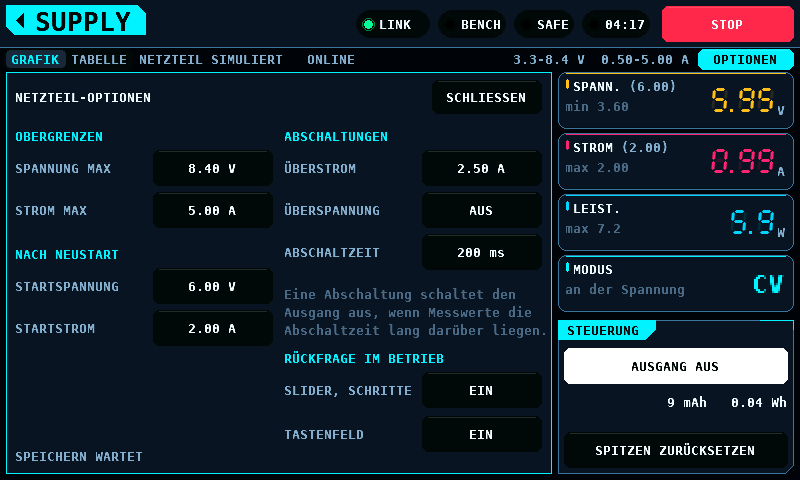

| Einstellung | Bereich | Vorgabe | Wirkung |
| --- | --- | --- | --- |
| SPANNUNG MAX | 3,3 bis 21 V | 21,00 V | die höchste Spannung, die ein Sollwert annimmt |
| STROM MAX | 0,5 bis 5 A | 5,00 A | die höchste Strombegrenzung, die ein Sollwert annimmt |
| STARTSPANNUNG | bis SPANNUNG MAX | 6,00 V | der Spannungs-Sollwert nach einem Neustart |
| STARTSTROM | bis STROM MAX | 2,00 A | die Strombegrenzung nach einem Neustart |
| ÜBERSTROM | 0 bis 5 A | AUS | Ausgang aus, wenn der Strom ABSCHALTZEIT lang darüber lag |
| ÜBERSPANNUNG | 0 bis 21 V | AUS | Ausgang aus, wenn die Spannung ABSCHALTZEIT lang darüber lag |
| ABSCHALTZEIT | 0 bis 5000 ms | 100 ms | wie lange ein Messwert über einer Abschaltschwelle liegt, bevor sie auslöst |
| SLIDER, SCHRITTE | EIN, AUS | EIN | fragen, bevor der Schieber einen eingeschalteten Ausgang ändert |
| TASTENFELD | EIN, AUS | EIN | fragen, bevor die Tastatur einen eingeschalteten Ausgang ändert |

Eine Grenze, die unter einen Sollwert gesenkt wird, holt den Sollwert sofort
auf sie herunter, und einen Startwert mit ihm. Ein getippter Wert kommt in der
sicheren Richtung auf den Schritt der Einstellung: eine Grenze rundet ab, 12,01 V
erlauben also 12,00 V, und eine Abschaltschwelle über 0 ist mindestens ein Schritt, nie
AUS. Eine Abschaltschwelle von 0 ist aus. Die Zeit über einer
Abschaltschwelle zählt ab dem ersten Messwert darüber. Ein Messwert unter
seiner Abschaltschwelle beginnt die Zählung neu; ein Messwert, der nicht
ankam, lässt sie stehen. Eine Abschaltung schaltet den Ausgang ab, MODUS zeigt
ABSCH., bis der Ausgang wieder eingeschaltet wird, und das Band sagt, welche
Schwelle ausgelöst hat. Das Netzteil hält seine Strombegrenzung in CC, daher löst ein
ÜBERSTROM auf oder über STROMBEGRENZUNG nicht aus; unter der Begrenzung
gesetzt, schaltet er eine Last ab, die zu lange zu viel zieht.

Nach einem Neustart ist der Ausgang aus, welche Startwerte auch gelten.

Ist der PD mini das Netzteil, bietet OPTIONEN außerdem PD MINI ZURÜCKSETZEN. Das
schaltet den Ausgang ab und startet das Modul neu (sein Befehl
SYSTEM_RESET), für ein Modul, das ERR zeigt -- ein Sollwert über seinem
Eingang bringt es dorthin --, ohne es abzustecken. Etwa 1 s später wird es
wieder gefragt, wer es ist. Ob ein Neustart jedes ERR löst, ist nicht
gemessen. Ein Koprozessor älter als Protokoll 4.4 kann nicht neu starten:
der Ausgang geht aus, und das Band sagt es.

### Das Log

Ein Lauf ist ein Einschalten des Ausgangs. Der Plot leert sich, wenn der
Ausgang angeht, und hält den Lauf, nachdem er ausgeht. mAh und Wh unter dem
Schalter zählen den Lauf aus den angezeigten Messwerten, jeder Schritt auf 1 s
begrenzt. SPITZEN ZURÜCKSETZEN beginnt die niedrigsten und höchsten Werte neu ab dem
aktuellen Messwert.

Ein Lauf wird in eine eigene `BENCHnnn.CSV` geschrieben, eine Zeile alle
50 ms:

```
time (s);set (V);voltage (V);limit (A);current (A);power (W);mode;charge (mAh);energy (Wh)
```

Ein Messwert, der nicht ankam, ist eine leere Zelle. `mode` ist CV, CC oder
OFF und leer, solange das Netzteil nicht antwortet. Der Prüfstand hat beim
Log Vorrang: ARM während eines Netzteil-Laufs beendet dessen Datei, und ein
Ausgang, der beim Unscharfschalten noch an ist, beginnt eine neue. Ladung und
Energie dieser Datei zählen von den Summen seit dem Einschalten des Ausgangs
weiter, wie auf dem Bildschirm; ihre erste Zeile beginnt also nicht bei 0. Das
Netzteil wird in seinem eigenen 50-ms-Takt geführt und geloggt, auch während
die Steuer-Task auf den Link wartet; ein Koprozessor, der nicht antwortet,
dünnt weder den Plot noch das Log des Netzteils aus.

Das Modell ist eine Last von 6 Ohm mit einem Stoß von 1,4 A für 0,6 s alle
3 s, hinter einem Quellwiderstand von 0,05 Ohm. Bei den Startwerten, 6,00 V
und 2,00 A, bringt der Stoß es in CC. Seine Messwerte sind nicht gemessen,
und am Prüfstand wird nichts versorgt.

Die Verdrahtung des PD mini -- PD mini, PD mini TX, PD mini RX und PD mini
Baud -- steht in SETUP unter ANSCHLÜSSE. TX und RX sind GPIO-Nummern des
Koprozessors: TX geht zum DM des Moduls, RX kommt von seinem DP. Der
Koprozessor weist einen Pin ab, der reserviert, an einen Ausgang gebunden
oder der andere Pin ist. Hat das Modul einmal geantwortet, wartet eine
Änderung auf eine danach gesendete Zustandslesung des Moduls, höchstens etwa
1,2 s, und wird nur übernommen, wenn diese den Ausgang aus zeigt: das Modul
kann sich zwischen zwei der 500-ms-Lesungen selbst einschalten, über seinen
Knopf oder seine Einstellung AUTO OUT, und neue Pins ließen ihm keinen Weg
zum OFF. Zeigt die Lesung den Ausgang an oder schlägt sie fehl, wird die
Änderung abgewiesen, und das Band sagt
`Verdrahtung des PD mini abgelehnt -- sein Ausgang kann an sein`. Eine
abgewiesene Änderung wird erst wieder geschrieben, wenn sich die Verdrahtung
in SETUP ändert. PD mini Baud ist die eigene UART-Baudrate-
Einstellung des Moduls: 9600, 19200 (ab Werk), 38400, 57600, 115200, 230400
oder 460800 Baud, oder AUTO. AUTO, die Vorgabe, lässt den Koprozessor sie
finden: er versucht jede der 7 Raten, eine pro Sekunde. Die Kopfzeile von
SUPPLY zeigt die Rate in Gebrauch hinter ONLINE, z. B. `ONLINE 38400`, bei
AUTO wie bei einer festen Rate.

## Analyser

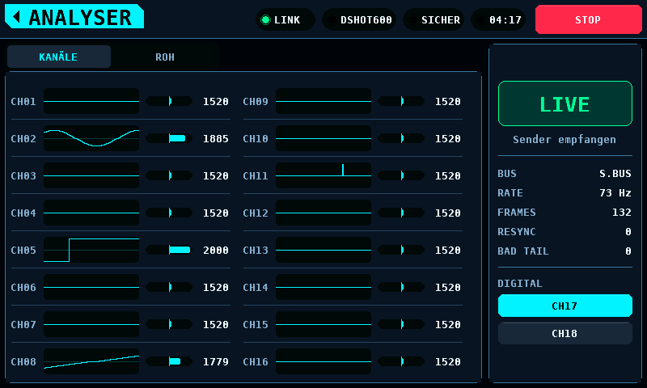

Sechzehn Kanäle, jeder mit 1,5 s Verlauf und einem Balken für den aktuellen
Wert. CH17 und CH18 sind die beiden Digitalkanäle. Ein Glitch ist eine Spitze
in einer Spur; ein Dropout ist eine Kerbe durch alle sechzehn im selben
Moment.

Der Zustandsblock zeigt einen von SILENT, FAILSAFE, FRAME LOST und LIVE, mit
einer Zeile Erklärung:


Im FAILSAFE sendet der Empfänger wohlgeformte Werte, die er selbst erzeugt;
jede Spur wird rot gezeichnet. FAILSAFE als Stopp behandeln, nicht als
sechzehn gültige Kanäle. [Empfängerbusse](Receivers-de.md) beschreibt die
Zustände.

## Programmierer

Die Reihenfolge: Geräteklasse, Protokoll, verbinden. ESC STICK, die dritte
Klasse, listet ESC-Profile statt Protokollen und programmiert einen ESC über
sein Gasknüppel-Menü; sie hat eine eigene Seite,
[Stick-Programmierung](StickProgramming-de.md).

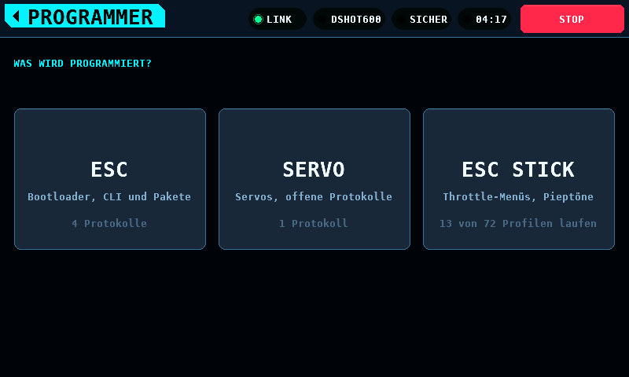

Jede Protokollzeile nennt ihren Transport. Eine automatische Erkennung gibt
es nicht:

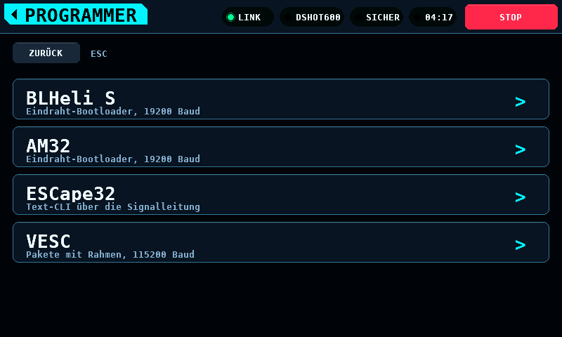

BLHeli_32 steht nicht in der ESC-Liste. Der Prüfstand erkennt diese ESCs,
steuert sie an und sendet die DShot Special Commands, kann ihre Parameter aber
nicht lesen: [BLHeli_32-Parameter](BLHeli32-de.md).

Bevor ein Gerät geantwortet hat, ist nichts editierbar:


Nachdem ein Gerät geantwortet hat, erscheinen die Parameter in Gruppen, mit
der Hilfe zur ausgewählten Zeile unter der Liste:

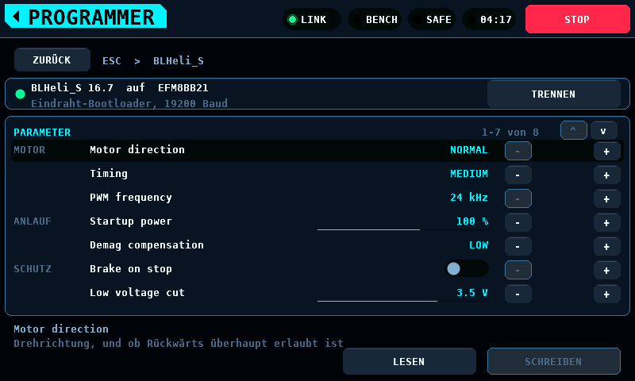

Jede Firmware zeigt ihre Einstellungen in ihren eigenen Einheiten. BLHeli_S
zeigt das Timing als benannte Stufen, die anderen in Grad Vorzündung:

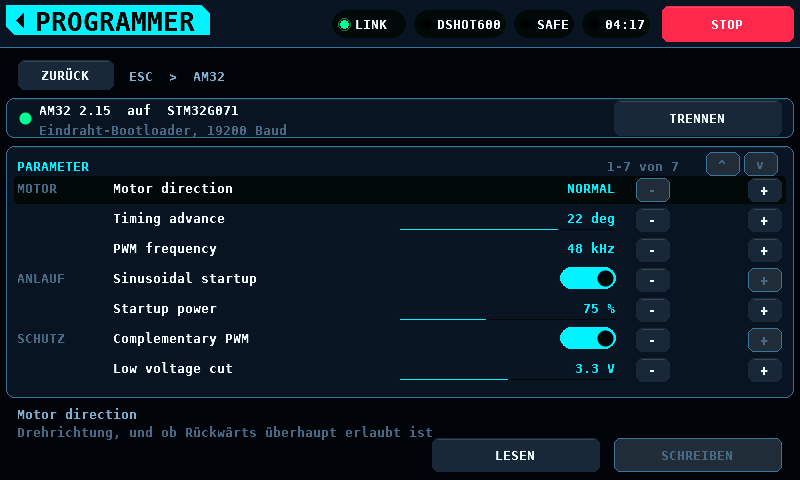

Ein geänderter Wert wird erst geschrieben, wenn SCHREIBEN gedrückt wird.
Vorgemerkte Änderungen tragen eine Markierung und eine eigene Farbe, und der
SCHREIBEN-Knopf zeigt, wie viele vorgemerkt sind:

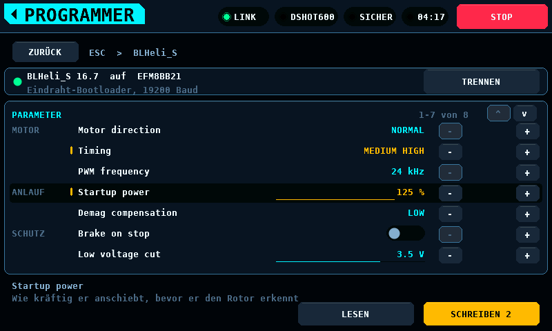

Stepper halten an den Enden einer Liste an; sie springen nicht auf die andere
Seite.

Eine Ebene zurück trennt die Verbindung. Zurück geht eine Ebene auf einmal;
das Home-Tag im Band verlässt den Bildschirm.

### ESC STICK

Die Liste zeigt zuerst die Hersteller, alphabetisch, jeden mit der Zahl
seiner Modelle, die laufen:

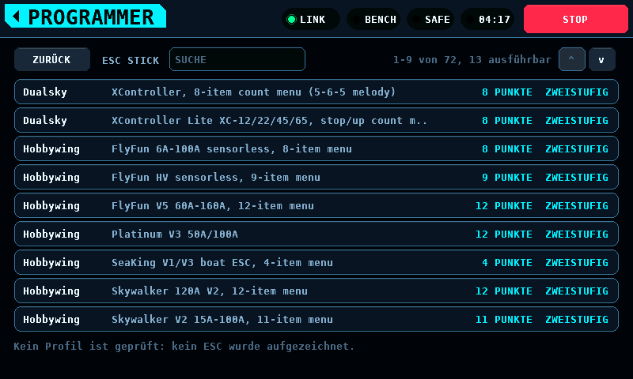

Ein Hersteller öffnet seine Modelle, eine Zeile je Modell, nach Strom, dann
Spannung, dann Name, jedes mit seiner Familie und was das Profil ist oder
warum es nicht läuft. Ein Modell öffnet das Profil seiner Familie:

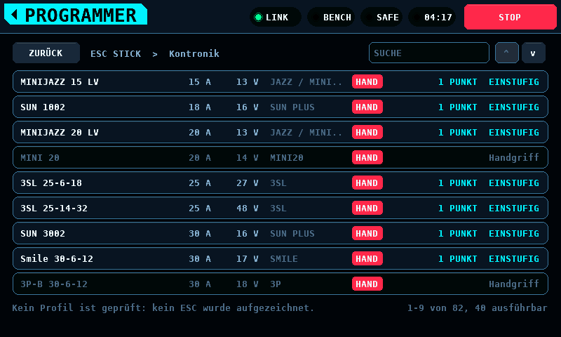

SUCHE filtert die gezeigte Ebene. Ihre Tastatur dockt rechts an, die
Zeilen werden daneben schmaler, und jede Taste filtert sofort. Ein Modell
wird gefunden, wenn der Text in Hersteller und Familie steht, als ein Text
gelesen, oder in Hersteller und seinem eigenen Namen; ein Hersteller
erscheint, wenn eines seiner Modelle gefunden ist. Groß- und
Kleinschreibung spielen keine Rolle, und `*` steht für eine beliebige Folge
von Zeichen:

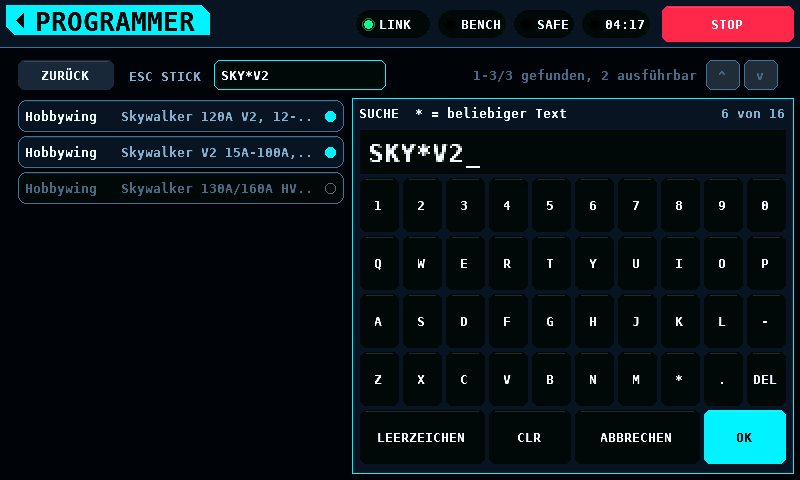

OK behält die Suche auf beiden Ebenen, X leert sie:

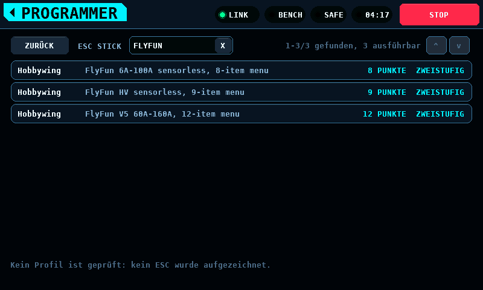

Die Punkte eines Profils stehen anfangs auf BEHALTEN. Die Stepper wählen einen
Wert; START zählt die gewählten Werte:

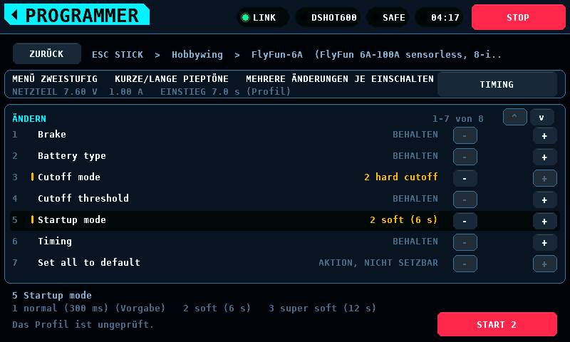

START öffnet eine Warnung über den ganzen Bildschirm, KEIN PROPELLER, MOTOR
GESICHERT?: ein Motor am ESC muss fest montiert sein und darf keinen
Propeller tragen, oder ein Lastwiderstand tritt an seine Stelle. Der Lauf
beginnt, wenn HALTEN ZUM STARTEN 2 s gehalten ist:

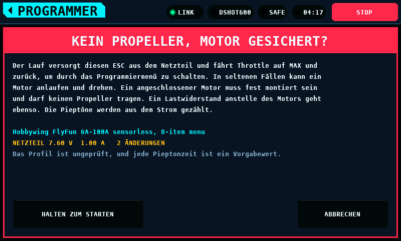

Ein Profil, dessen ESC einen Menschen am ESC braucht -- einen Jumper stecken
und abziehen, einen Taster drücken --, trägt in der Liste ein rotes Schild
HAND und auf seiner Seite rot MANUELLER EINGRIFF NÖTIG. Der Knopf zeigt die
Schritte und wann jeder fällig ist; ebenso das erste Öffnen des Profils. Die
Warnung nennt die Schritte vor dem Einschalten, und der Lauf hält für jeden
späteren Schritt mit ERLEDIGT und ABBRECHEN an und wartet höchstens 60 s
([Handgriffe](StickProgramming-de.md#handgriffe)):

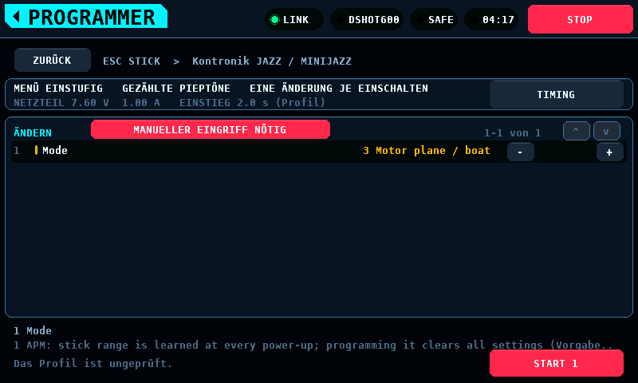

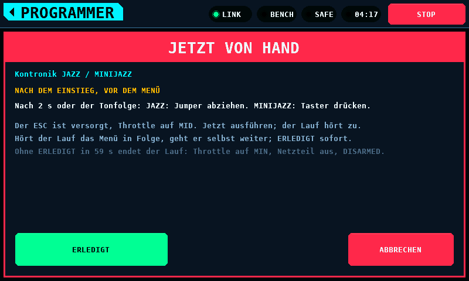

Ein Kontronik-ESC, der sich sperrt, wenn sein Netzteil ausschaltet, bevor
er den gespeicherten Modus bestätigt hat, hält den Lauf nach dem Speichern
versorgt, den Knüppel, wo er speicherte, bis ERLEDIGT:

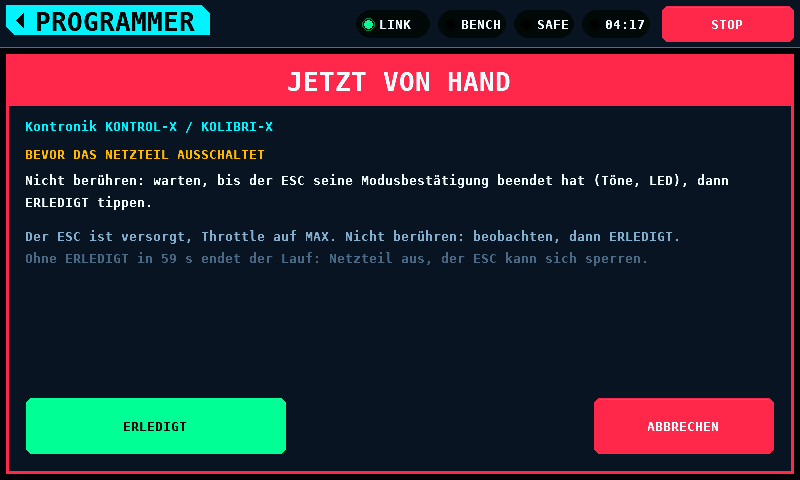

Während er läuft, zeigt die Seite die Phase, die Pieptöne der laufenden
Gruppe und die letzte Gruppe. ABBRECHEN, STOP und das Verlassen des Bildschirms
beenden ihn mit dem Gas auf MIN, dem Netzteil aus und dem Prüfstand
entschärft. Das Grün der Signalsäule leuchtet, solange ein Piepton erkannt
ist, mindestens 150 ms:

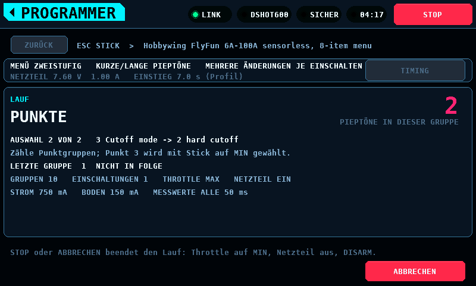

Solange der Phasenabgriff unter SETUP eingeschaltet ist, ergänzt die Seite des
Laufs unter der Stromzeile eine reine Anzeige: den Zustand des Abgriffs, die
Tonhöhe seines letzten 8-ms-Fensters, die Zähler der Pieptöne, die der
Koprozessor verlor, und der Pieptöne, die das Panel nicht gelesen hat, und die letzten vier Pieptöne
mit Nummer, Länge in ms und mittlerer Tonhöhe in Hz. Der Lauf zählt seine
Pieptöne weiter aus dem Netzteilstrom.

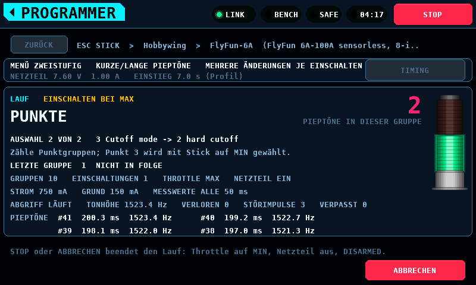

| Zustand | Bedeutung |
| --- | --- |
| `LÄUFT` | die Aufnahme läuft |
| `ÜBERLAUF` | sie läuft, und der Aufnahmering oder die FIFO ist seit dem Einschalten des Abgriffs übergelaufen |
| `WARTET` | kein Link, oder die TONE-Page hat in den letzten 500 ms nicht geantwortet |
| `KEINE TONE-PAGE` | der Koprozessor spricht ein Protokoll älter als 4.8 |
| `PIN BELEGT` | der Koprozessor hält den Abgriff aus: sein Pin ist anderweitig gebunden |
| `LÄUFT NICHT` | eingeschaltet, und die Page hält den Abgriff aus oder lässt ihn nicht laufen: die Einstellung wurde abgelehnt oder ist noch nicht geschrieben |

Das Ergebnis bleibt bis OK. Sein Rot leuchtet, wenn der Lauf endete, weil
etwas nicht wie erwartet war, ein Stopp des Prüfstands selbst eingeschlossen,
und bleibt aus bei FERTIG, gedrücktem STOP, ABBRECHEN und
dem Verlassen des Bildschirms ([die Liste](StickProgramming-de.md#wie-ein-lauf-endet)):

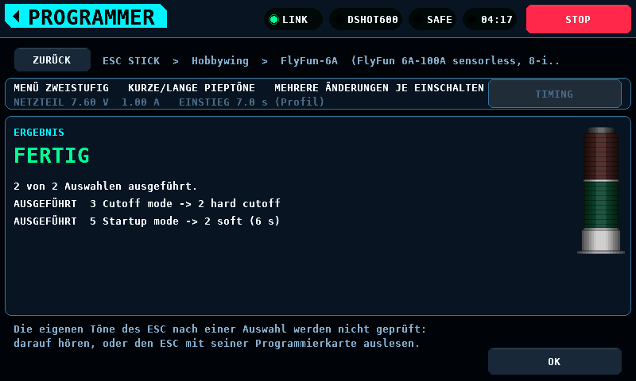

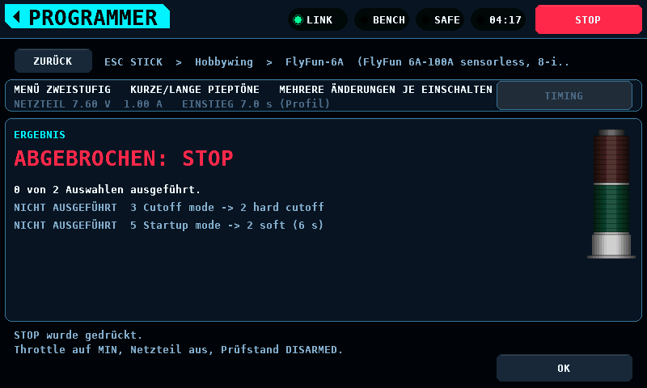

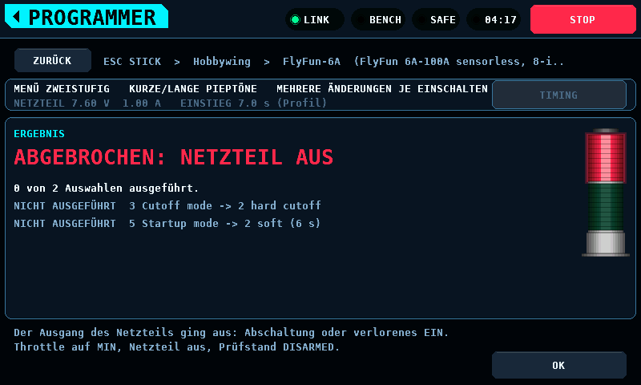

TIMING enthält die Zeiten der Pieptöne und die Netzteil-Einstellungen. Keine
davon ist gemessen:

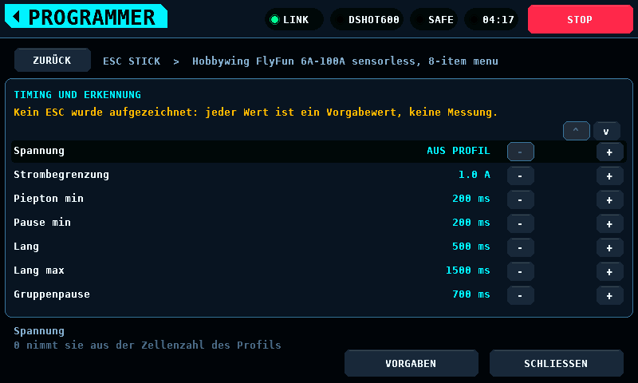

## Akku

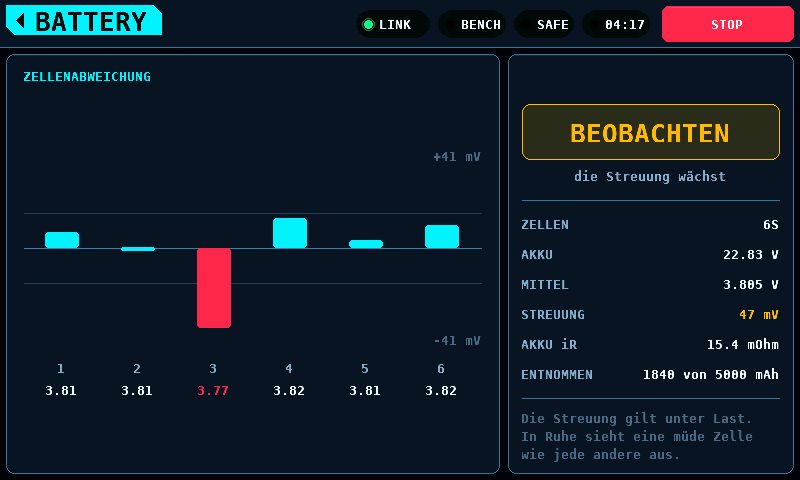

Die Zellen werden als Abweichung vom Mittelwert des Packs gezeichnet. Das
Urteil folgt der Spreizung, dem größten Abstand zwischen zwei beliebigen
Zellen: GUT unter 30 mV, BEOBACHTEN ab 30 mV, ERSETZEN ab 60 mV. Die Skala folgt
dem Pack bis hinunter zu einer Untergrenze von 12 mV und steht neben dem Plot.

Unter Last messen. In Ruhe liest sich eine schwache Zelle wie die anderen.

## Logs

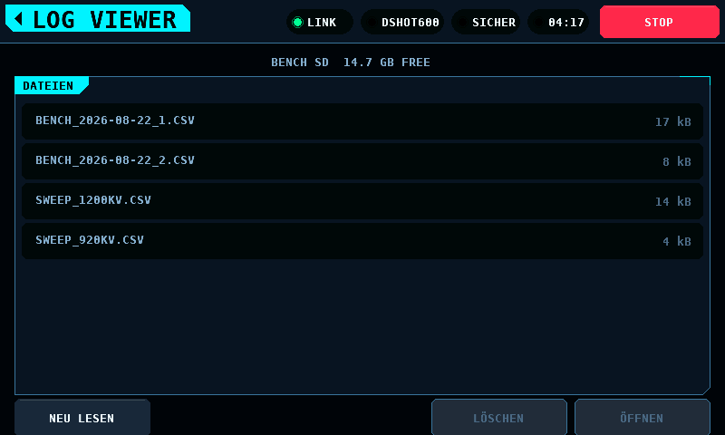

Karte durchsehen, Datei öffnen, prüfen, was der Import erkannt hat, dann
plotten:

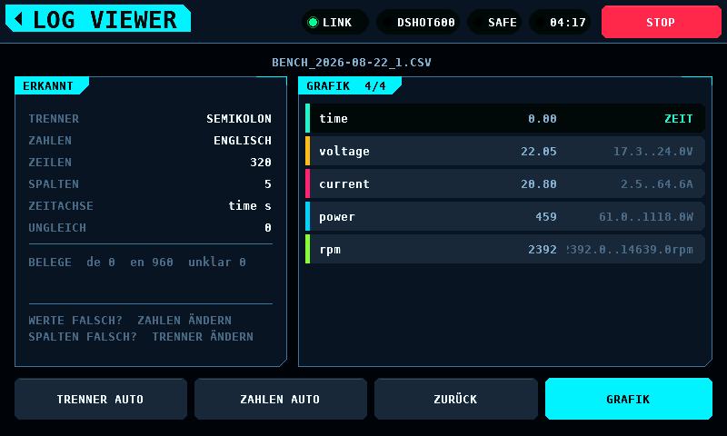
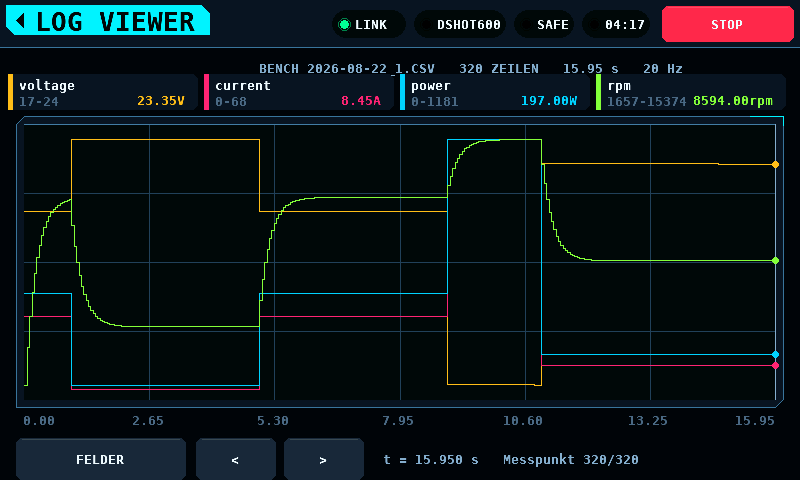

Der Reader für CSV (Comma-Separated Values) akzeptiert Dezimalkomma und
Dezimalpunkt, eine Einheitenzeile und Zeilen ungleicher Länge; die
Importansicht zeigt, was er entschieden hat, bevor die Datei geplottet wird.
Vom Prüfstand aufgezeichnete Läufe werden als `BENCH001.CSV` bis
`BENCH999.CSV` im Wurzelverzeichnis der Karte abgelegt. Ein Lauf ist ein
Scharfschalten oder, solange der Prüfstand nicht scharf ist, ein Einschalten
des SUPPLY-Ausgangs. Ein automatischer Servotest nimmt ebenfalls die nächste
Nummer: sein Log ist `BENCHnnn.CSV`, das die Liste als Lauf zeigt, sein
Bericht `BENCHnnn.TXT`, den die Liste nicht zeigt. Eine Nummer, die eine der
beiden Dateien trägt, ist vergeben, und LÖSCHEN auf einem Lauf löscht seinen
Bericht mit.

Die Liste fasst 48 Einträge, die Karte bis zu 999 Läufe. Passen nicht alle
hinein, behält die Liste die neuesten Läufe, und ihr Reiter zeigt
`48 VON 137 DATEIEN` statt `DATEIEN`: ein Lauf, der in der Liste fehlt, ist dann
einer, für den die Liste zu kurz war, und nicht einer, der nie geschrieben
wurde. Was neu heißt, steht in der Nummer im Namen: die Panel-Platine hat
keine Uhr, die einen Stromausfall übersteht, deshalb trägt jede Datei auf der
Karte das Datum 1980-01-01. Ein Lauf geht einer Datei vor, die der Prüfstand
nicht geschrieben hat, also listet eine Karte mit 48 oder mehr Läufen keine
andere Datei mehr. Alte Läufe löschen, um eine zurückzuholen.

NEU LESEN, und jedes Lesen der Karte, wählt den neuesten Lauf aus und rollt
ihn ins Bild, sodass ÖFFNEN den gerade aufgezeichneten Lauf öffnet. Eine Karte
ohne nummerierten Lauf wählt nichts aus.

In der Grafik zoomen zwei Finger: Auseinanderziehen vergrößert,
Zusammenziehen verkleinert, beide zusammen bewegt verschiebt den Ausschnitt.
Der Ausschnitt bleibt, wo die Finger ihn lassen, und ein Balken unter der
Grafik zeigt, welcher Teil des Laufs zu sehen ist. Der engste Ausschnitt sind
8 Messpunkte, der weiteste der ganze Lauf. Ein Finger und die Knöpfe `<` und
`>` bewegen den Cursor wie bisher; läuft der Cursor über den Rand eines
vergrößerten Ausschnitts, wandert der Ausschnitt mit. ZURÜCK führt zur
Importansicht.

SETUP → ANWENDUNG → Ein Finger schiebt, standardmäßig aus, lässt einen
einzelnen Finger den vergrößerten Ausschnitt verschieben. Ist die Einstellung
an und der Ausschnitt vergrößert, zieht ein Finger, der sich mehr als 10 px
von der Stelle entfernt, an der er aufgesetzt wurde, den Ausschnitt zur Seite,
und der Messpunkt unter dem Finger bleibt unter ihm. Eine Berührung, die
innerhalb von 10 px bleibt, wählt einen Wert wie bei ausgeschalteter
Einstellung, und nach dem Verschieben bleibt der Cursor, wo er war. Ein
Ausschnitt, der den ganzen Lauf zeigt, wird nicht verschoben: ein Finger
bewegt den Cursor. Ein zweiter Finger auf der Grafik beginnt wie bisher das
Zoomen.

LÖSCHEN löscht die ausgewählte Datei von der Karte. Vorher kommt eine Rückfrage:
ein zweites Feld nennt die Datei und ihre Größe, und erst dessen eigenes
LÖSCHEN, auf dem Knopf gedrückt und losgelassen, löscht sie. ABBRECHEN oder das
Verlassen des Bildschirms schließt die Rückfrage, ohne zu löschen. Der Lauf,
den der Logger offen hat, wird abgewiesen. Eine Datei, die in der
Importansicht oder im Plot offen war, verschwindet beim Löschen aus beiden.
Der Logger nummeriert jeden Lauf über dem höchsten Lauf, den er auf der Karte
gefunden hat. Er liest die Karte beim ersten Lauf nach dem Start und nach einem
Lauf, der sich nicht öffnen ließ, und zählt sonst von dort weiter. Eine
gelöschte Nummer wird nur wieder vergeben, wenn sie bei diesem Lesen über allen
verbliebenen Läufen lag.

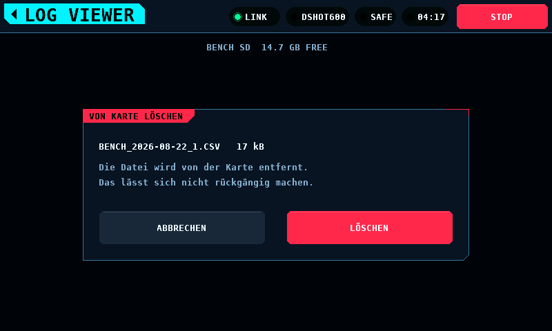

Ein Lauf wird alle 20 Zeilen oder 1000 ms Laufzeit auf die Karte festgeschrieben,
je nachdem, was zuerst eintritt. Ein Stromausfall mitten im Lauf kostet die
Zeilen, mit denen das Festschreiben noch nicht fertig ist, und die Zeilen, die
noch in der Queue zwischen der Control-Task und der Karten-Task stehen: unter
1,0 s Laufzeit, solange die Karte mitkommt, und 84 Zeilen, 4,20 s bei den 20 Hz
des Panels, wenn die Karte hängt und die Queue voll ist. Der Rest der Datei
bleibt in beiden Fällen lesbar. Geschrieben wird von
einer eigenen Task. Eine SD-Karte (Secure Digital) darf sich für einen Schreibvorgang
250 ms Zeit nehmen, und die Task, die die Sicherheitsleitung schlägt, hat eine
Obergrenze von 150 ms.

Acht Meldungen sagen, was die Karte mit einem Lauf gemacht hat. Jede
erscheint im Band:

| Meldung | Was passiert ist |
|---|---|
| `keine Karte -- dieser Lauf wird nicht aufgezeichnet` | nichts ist gemountet, der Lauf wurde nie geöffnet |
| `Karte nicht lesbar -- Lauf nicht aufgezeichnet` | die Karte ließ sich nicht auflisten, es war keine Laufnummer wählbar |
| `Karte voll oder nicht beschreibbar -- Lauf nicht aufgezeichnet` | es ließ sich keine Laufnummer anlegen |
| `die Karte kam nicht nach -- Lauf nicht aufgezeichnet` | jede Zeile wurde verworfen, es gibt für diesen Lauf gar keine Datei |
| `die Karte fiel zurück -- das Log hat Lücken` | einzelne Zeilen wurden verworfen; die Zeitspalte der Datei zeigt, wo |
| `die Karte nimmt keine Zeilen mehr an -- Lauf ab hier nicht aufgezeichnet` | ein Schreibvorgang ist mitten im Lauf fehlgeschlagen, jede weitere Zeile wird abgewiesen |
| `die Karte nimmt keine Zeilen mehr an -- das Log ist unvollständig` | derselbe Fehler, beim Schließen des Laufs noch einmal gemeldet |
| `die Karte versagte beim letzten Schreiben -- das Log ist unvollständig` | das Schließen ist fehlgeschlagen, die Zeilen seit dem letzten Festschreiben fehlen in der Datei |

Bei den ersten vier gibt es keine Datei zu suchen. Bei den letzten vier gibt
es eine, und sie hört zu früh auf.

Ein Lauf, der gerade geschrieben wird, erscheint nicht in LOGS. Die Länge einer
Datei steht in ihrem Verzeichniseintrag und wird beim Schließen geschrieben, ein
noch offener Lauf stünde also mit seiner zuletzt festgeschriebenen Länge in der
Liste und läse sich wie ein fertiger.

## Setup


Die Einstellungen liegen hinter der SETUP-Kachel, in beiden Designs:

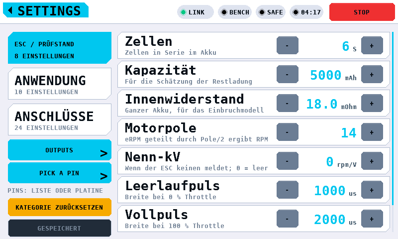

Sprache unter ANWENDUNG schaltet die ganze Oberfläche ab dem nächsten Bild
zwischen Englisch und Deutsch um, ohne Neustart. Was ihr folgt, was Englisch
bleibt und warum: [Sprache der Oberfläche](Language-de.md). Ein Finger
schiebt, in derselben Kategorie, legt fest, ob ein Finger die vergrößerte
Log-Grafik verschiebt; die Einstellung ist standardmäßig aus und steht bei der
Logansicht beschrieben.

### ANWENDUNG: der Drehknopf

Ein magnetischer Winkelsensor AS5600 am I2C-Anschluss des Panels (I2C:
Inter-Integrated Circuit) dreht den Regler des obersten Prüfstandsbildschirms:
das Gas auf MOTOR & ESC, das Horn auf SERVO. Verdrahtung:
[Bauen](Building-de.md#verdrahtung-des-drehknopfs). Andere Bildschirme
ignorieren ihn.

| Einstellung | Bereich | Standard |
| --- | --- | --- |
| `Drehknopf` | AUS, EIN | AUS |
| `Knopf-Skala` | 90 bis 720 deg in Schritten von 10 | 270 deg |

`Knopf-Skala` ist der Knopfwinkel, der den Regler über seinen ganzen Weg
bewegt. Bei 270 deg bewegt eine Vierteldrehung das Gas um 33,3 Punkte und das
Horn über ein Drittel seines Wegs von -Weg bis +Weg.

- Der Knopf bewegt einen Wert um die Strecke, die er gedreht wird, nie auf
  die Stelle, auf die er zeigt. Eine Drehung addiert sich zum Gas oder zum
  Winkel des Horns und endet bei 0 und 100 % oder am Wegende. Über ein Ende
  hinaus und zurück gedreht, bewegt sich der Wert vom Ende aus.
- Er schärft nie. ARM bleibt derselbe Hold auf derselben Taste.
- Die erste Messung nach dem Einschalten und die erste nach einem Ausfall des
  Sensors setzen eine Referenz und bewegen nichts; ein Knopf, der verdreht
  zurückkommt, lässt den Regler also nicht springen.
- Der Sensor wird alle 10 ms gelesen, und alle 100 ms, solange er nicht
  antwortet. Eine Messung ohne erkannten Magneten, mit zu schwachem oder zu
  starkem Magneten oder mit Magnitude 0 gilt als keine Antwort. Ein Sprung von
  mehr als 90 deg zwischen zwei Messungen gilt als Störung und wird verworfen.
- Ein Finger auf dem Gas-Track oder dem SERVO-Zifferblatt besitzt den Wert,
  solange er aufliegt, und für den ganzen Frame, in dem er das Bedienelement
  berührt hat, auch wenn er in diesem Frame abhebt. Auf SERVO nimmt der Knopf das Horn nicht aus einem
  laufenden oder pausierten Sweep, einem Testlauf oder dem offenen
  Einstellungsfeld.
- Ein Frame, der Touch-Ereignisse verloren hat, verwirft die Bewegung des
  Knopfs zusammen mit den Gesten, ebenso ein Frame, in dem der Router
  überhaupt navigiert hat, auch weg vom Bildschirm und zurück. Das Kommando
  des Knopfs geht mit dem nächsten Frame hinaus; findet dieser Frame zuerst
  verlorene Touch-Ereignisse, wird das Kommando zurückgenommen, und der
  Regler kehrt auf seinen Wert vor dem Knopf zurück.
- Der Knopf ersetzt nur ein Gas oder eine Horn-Position. Wartet ein anderes
  Kommando auf den Frame (ein eben vollendetes Schärfen, ein Entschärfen, ein
  Zurücksetzen der Spitzen, ein Freigeben), wird die Bewegung des Knopfs in
  diesem Frame verworfen, nicht aufgehoben.
- Angenommen wird, dass der Sensor ohne Kollision unter 0x36 antwortet: 0x36 liegt außerhalb der Kommandoadressen des CH422G in dessen Datenblatt, Waveshares Wiki reserviert auf diesem Bus 0x30 bis 0x3F, und es ist nicht an Hardware geprüft.

### ANSCHLÜSSE: die Strommonitore

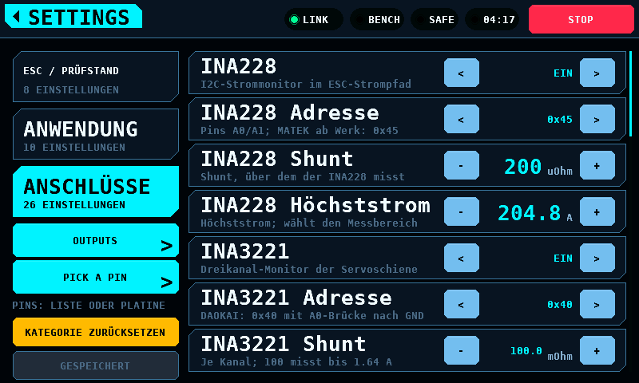

Der Koprozessor liest zwei I2C-Strommonitore (I2C: Inter-Integrated Circuit)
an einem Bus auf zwei seiner Pins: einen TI INA228 im Strompfad des ESC und
einen TI INA3221 an der Servoschiene. Ihre Zeilen stehen oben unter
ANSCHLÜSSE:

| Einstellung | Bereich | Standard | |
| --- | --- | --- | --- |
| INA228 | EIN, AUS | AUS | der Monitor im Strompfad des ESC |
| INA228 Adresse | 0x40 bis 0x4F | 0x45 | der MATEK I2C-INA-BM ab Werk; seine Lötbrücken geben 0x44 oder 0x41 |
| INA228 Shunt | 50 bis 20000 µΩ, Schritte von 1 µΩ | 200 | der des MATEK |
| INA228 Höchststrom | 1,0 bis 300,0 A, Schritte von 0,1 A | 204,8 | der Strom, für den der Messbereich eingestellt wird: er wählt den ADC-Bereich (ADC: Analog-Digital-Wandler) und sonst nichts. 300 A ist das Auslegungsmaximum des Prüfstands; mehr lehnt der Koprozessor ab. Seine Ablehnung eines Bereichs über 2000 A Vollausschlag bleibt, und 300 A am kleinsten Shunt, 50 µΩ, erreichen sie nicht |
| INA3221 | EIN, AUS | AUS | die drei Kanäle der Servoschiene |
| INA3221 Adresse | 0x40 bis 0x43 | 0x40 | das DAOKAI-Modul ab Werk |
| INA3221 Shunt | 5,0 bis 1000,0 mΩ, Schritte von 0,1 mΩ | 100,0 | einer je Kanal; der R100 des DAOKAI misst bis 1,64 A |
| INA3221 Kanäle | CH1, CH1+2+3 | CH1 | CH1 ist der des Servotests, CH2 und CH3 die eines synchronisierten Paars |
| Sensor-SDA | −1, 0 bis 47 | 16 | GPIO des Koprozessors (GPIO: General-Purpose Input/Output); −1, bis er verdrahtet ist |
| Sensor-SCL | −1, 0 bis 47 | 17 | der GPIO nach SDA |

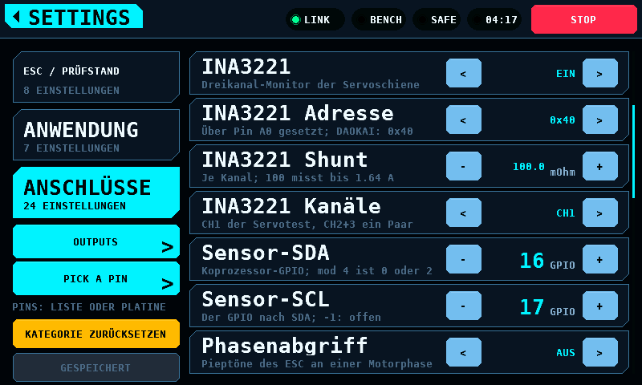

SDA und SCL sind das Paar eines I2C-Blocks: die GPIO-Nummer von SDA ist
modulo 4 gleich 0 oder 2, und SCL ist der GPIO danach. Der Bus läuft mit
400 kHz, und das ist keine Einstellung: der Koprozessor nimmt keinen anderen
Takt. Ein Messwert am oberen Ende des Bereichs des INA3221, 163,8 mV über dem
Shunt, wird als übersteuert gezeigt und nie als Wert.

Das Panel schreibt die Einstellung 500 ms nach der letzten Änderung auf die
SENSE-Page des Koprozessors (Protokoll 4.7), nur bei unscharfem Prüfstand,
und nur, was von dem abweicht, was die Page hält: der Koprozessor lehnt eine
Änderung ab, solange er Ausgänge treibt, und legt jede Änderung im Flash ab.
Bei jedem Link-Aufbau liest es die Page zuerst, eine Einstellung, die der
Koprozessor schon hält, wird also nicht noch einmal geschrieben. Ändern sich
die eigenen Werte eines Monitors, während beide eingeschaltet sind, werden
zuerst beide auf der Page ausgeschaltet und danach wieder ein, sodass kein
Schritt dazwischen die zwei Bauteile auf eine Adresse legt. Einem Koprozessor älter als 4.7 wird nichts
gesendet. Nachdem ein Schreiben angenommen ist, liest das Panel die Identität
des Koprozessors erneut: die Capability-Bits 3 und 4 folgen der Einstellung,
und mit eingeschaltetem INA228 verliert die Kachel MOTOR & ESC ihre Marke
`SIMULIERT`.

Solange ein Monitor eingeschaltet ist, liest das Panel die 14
Nur-Lese-Register der SENSE-Page alle 50 ms; solange der INA3221
eingeschaltet ist, die Kanalfenster der SERVO_SENSE-Page alle 50 ms, jedes 50-ms-Fenster
einmal. Das
Band sagt, was sie zeigen, jedes einmal und eines nach dem anderen: das
Dringendste zuerst und das nächste frühestens 5 s später, sodass zwei
gleichzeitige beide gesagt werden. In dieser Reihenfolge:

| Meldung | Wann |
| --- | --- |
| `Koprozessor ohne SENSE-Page -- Strommonitore nicht gelesen` | ein Monitor ist eingeschaltet, und der Koprozessor spricht ein Protokoll älter als 4.7; gesagt beim Link-Aufbau und wenn ein Monitor eingeschaltet wird, während er antwortet |
| `Sensor-SDA oder -SCL nicht gesetzt -- siehe SETUP ANSCHLÜSSE` | ein Monitor ist mit einem Pin auf −1 eingeschaltet; auf der Page ist keiner eingeschaltet |
| `INA228 und INA3221 beide auf 0x40 -- siehe SETUP ANSCHLÜSSE` | beide auf einer Adresse eingeschaltet; auf der Page ist keiner eingeschaltet |
| `Sensor-Pins GP5/GP6 abgelehnt -- siehe SETUP ANSCHLÜSSE` | der Koprozessor hat die Pins abgelehnt: kein Paar eines I2C-Blocks, reserviert, an einen Ausgang gebunden oder vom PD mini belegt; beide Monitore bleiben aus |
| `INA228 Shunt oder Höchststrom abgelehnt -- siehe SETUP ANSCHLÜSSE` | die Spannung über dem Shunt beim Höchststrom übersteigt 163,84 mV, oder der Messbereich, den er ergibt, übersteigt 2000 A; der INA228 bleibt aus |
| `INA3221-Einstellung abgelehnt -- siehe SETUP ANSCHLÜSSE` | der INA3221 bleibt aus |
| `Sensorbus hängt: SDA auf low -- wird freigetaktet` | der Koprozessor fand SDA auf low gehalten und taktet ihn frei |
| `INA228 antwortet nicht auf 0x45` | eingeschaltet, und 2,5 s nach Annahme seiner Einstellung keine Antwort, oder keine Antwort mehr, nachdem er geantwortet hat. `-- 0x44 antwortet` wird angefügt, wenn der Adress-Scan des Koprozessors dort etwas gefunden hat, wo das Bauteil sein könnte |
| `0x40 antwortet mit 1408h, kein INA3221 -- nicht benutzt` | an der Adresse des Bauteils antwortet etwas mit einer anderen Identität |
| `INA228-Strom am Ende des Messbereichs -- Strom ist eine Grenze` | der INA228 hat im letzten 50-ms-Fenster oder seit dem Scharfschalten das Ende seines Bereichs gelesen |
| `INA3221 CH1 übersteuert bei 1.64 A -- Strom ist eine Grenze` | ein Kanal, den der INA3221 liest, hat das obere Ende seines Bereichs erreicht; der Strom ist sein Vollausschlag |
| `Speicher des Koprozessors aus -- Einstellungen gelten bis zum Neustart` | STATUS-Fehlerbit 6: der Koprozessor speichert in diesem Boot nichts, die Einstellung, die Bindungen und die Verdrahtung des Netzteils sind bei seinem Neustart verloren; einmal je Link-Aufbau gesagt |

Eine abgelehnte Einstellung wird erst wieder geschrieben, wenn sie sich unter
SETUP ändert. Pins, die das Paar eines I2C-Blocks sind und abgelehnt wurden,
weil ein Ausgang, der PD mini oder die Platine einen davon hält, werden alle
5 s ohne weiteren Alert erneut angeboten; einen Pin unter OUTPUTS oder
NETZTEIL freizugeben öffnet den Bus also. Ein Monitor, der nicht mehr antwortet, schaltet den Prüfstand
nicht unscharf: auf den Messwerten der Monitore löst nichts aus.

### ANSCHLÜSSE: der Ausgangsencoder

Ein magnetischer Winkelsensor AS5600 von ams OSRAM auf der Ausgangswelle des
Servos, am Sensorbus neben den Monitoren, an seiner festen Adresse 0x36
(Protokoll 4.9):

| Einstellung | Bereich | Standard | |
| --- | --- | --- | --- |
| AS5600 | EIN, AUS | AUS | der Ausgangsencoder; er nimmt SDA und SCL des Sensorbusses oben, beide Pins müssen gesetzt sein |
| AS5600-Mitte | 0 bis 4095, Schritt 1 | 0 | der 12-Bit-Zählerstand des Sensors, wenn das Servo in Neutral steht; 4096 Schritte je Umdrehung, 0,0879 Grad je Schritt. ENC-MITTE auf der Seite SERVO setzt ihn aus dem aktuellen Wert |

Das Panel schreibt das Freigabe-Bit mit dem Rest des Bus-Frames, 500 ms nach
der letzten Änderung und nur bei unscharfem Prüfstand, an einen Koprozessor,
der Protokoll 4.9 nennt; einem älteren wird nichts gesendet. Solange der Encoder
freigegeben ist, liest es die Register 12 bis 31 von SENSE alle 40 ms. Das Band
sagt, jeweils einmal und eins nach dem anderen wie bei den Monitoren:

| Meldung | Wann |
| --- | --- |
| `Koprozessor älter als 4.9 -- AS5600 nicht gelesen` | der Encoder ist eingeschaltet, und der Koprozessor spricht ein Protokoll älter als 4.9; gesagt beim Link-Aufbau und wenn der Encoder eingeschaltet wird, während er antwortet |
| `AS5600 antwortet nicht an 0x36` | eingeschaltet, und 2,5 s nach seiner Einstellung ohne Antwort, oder nicht mehr antwortend, nachdem er es tat; auch wenn etwas an 0x36 einen STATUS gibt, den kein AS5600 gibt, ML und MH zugleich |
| `AS5600 sieht keinen Magneten -- Magnet auf der Hornwelle prüfen` | er antwortet, ein Winkel wurde gelesen, und STATUS MD (Magnet erkannt) ist nicht gesetzt. Der Zählerstand ist kein Winkel: GEMESSEN zeigt `---`, ENC-MITTE setzt nichts, und ein Lauf protokolliert und beurteilt keinen Winkel |
| `AS5600: Magnet zu schwach -- näher heranbringen` | STATUS MD und ML sind gesetzt. Der Winkel wird verwendet; das Datenblatt des Sensors spezifiziert sein Rauschen nur für 30 bis 90 mT |
| `AS5600: Magnet zu stark -- weiter weg` | STATUS MD und MH sind gesetzt. Der Winkel wird verwendet, wie bei ML |

Eine Magnetmeldung wird einmal gesagt, bis das Feld wieder stimmt, und noch
einmal, wenn ein als schwach oder stark gelesener Magnet verschwindet oder ein
fehlender schwach oder stark zurückkommt: mit dem ersten hört der Winkel auf,
mit dem zweiten kommt er wieder. Der DIR-Pin
des Sensors bestimmt die Richtung, in der sein Zählerstand steigt; das Panel
nimmt an, dass er mit der Pulsbreite des Servos steigt. Nicht auf Hardware
gelaufen.

### ANSCHLÜSSE: der Phasenabgriff

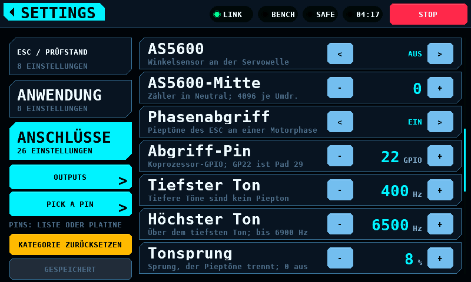

Der Phasenabgriff hört die Pieptöne eines ESC an einer Motorphase. Ein GPIO
des Koprozessors liest die Phase über einen Vorwiderstand und eine
Zener-Klemme; der Koprozessor misst die Zeiten der Flanken am Pin und meldet
Länge und Tonhöhe jedes Pieptons. Die Verdrahtung steht nicht im Bauhandbuch.
Der Abgriff ist ein Eingang: er treibt nichts, und der Koprozessor nimmt eine
Änderung bei scharfem wie bei unscharfem Prüfstand an. Seine Zeilen folgen den
Pins des Busses:

| Einstellung | Bereich | Standard | |
| --- | --- | --- | --- |
| Phasenabgriff | EIN, AUS | AUS | die Aufnahme läuft auf dem Koprozessor |
| Abgriff-Pin | 0 bis 47 | 22 | GPIO des Koprozessors; GP22 ist Pad 29. Abgelehnt: ein ADC-Pin (ADC: Analog-Digital-Wandler), GP26 bis GP29 am RP2350A und GP40 bis GP47 am RP2354B; ein Pin, der an einen Ausgang gebunden ist; ein Pin, den die SENSE- oder SUPPLY-Page hält |
| Tiefster Ton | 50 bis 2000 Hz, Schritte von 10 Hz | 400 | ein tieferer Ton ist kein Piepton |
| Höchster Ton | 100 bis 6900 Hz, Schritte von 50 Hz | 6500 | über dem tiefsten Ton |
| Tonsprung | 0 bis 50 %, Schritte von 1 % | 8 | ein Tonhöhensprung dieser Größe beginnt einen neuen Piepton ohne Stille dazwischen; 0 trennt nur an Stille |
| Abgriff-Pause | 1 bis 100 ms | 3 | die Stille, die einen Piepton beendet; mindestens eine Periode des tiefsten Tons, bei 50 Hz also 20 ms |
| Min. Perioden | 1 bis 64 | 3 | die Tonperioden, die einen Piepton ergeben |

Das Panel schreibt die Einstellung 500 ms nach der letzten Änderung auf die
TONE-Page des Koprozessors (Protokoll 4.8), und nur, was von dem abweicht,
was die Page hält: der Koprozessor legt jede Änderung im Flash ab. Bei jedem
Link-Aufbau liest es die Page zuerst. Die Einstellung geht in zwei Frames,
der Pin und der Tonbereich, dann der Sprung, die Pause und die Perioden.
Ändern sich beide, geht der zuerst, der der Page eine gültige Einstellung
lässt: ein tieferer Ton mit einer Pause kürzer als seine Periode wird
abgelehnt, die Pause wird also geschrieben, bevor der Ton sinkt, und nachdem
er steigt. Einem Koprozessor älter als 4.8 wird nichts gesendet.

Solange die Page den Abgriff eingeschaltet hält, liest das Panel ihre 16
Leseregister alle 50 ms: die Flags, die Tonhöhe des letzten 8-ms-Fensters,
die Nummer des neuesten Pieptons und die Zähler der verlorenen Pieptöne und
der ignorierten Tiefs. Die Pieptöne holt es einzeln nach Nummer. Der
Koprozessor hält die letzten 64 Pieptöne, nummeriert von 1 bis 65535 und
dann wieder ab 1, und ein Lesen entfernt keinen, eine auf dem Link verlorene
Antwort kostet also keinen Piepton. Ein Piepton, der den Ring verlassen hat,
bevor er gelesen wurde, oder an dem der Ring vorbeizog, während das Panel
mehr als 64 zurücklag, wird als verpasst gezählt. Die letzten 8 Pieptöne
hält das Panel für den Bildschirm; die Laufseite von ESC STICK zeigt 4
davon ([Programmierer](#programmierer)).

Das Band sagt, was der Abgriff meldet, je einmal und eins nach dem anderen,
wie bei den Strommonitoren:

| Meldung | Wann |
| --- | --- |
| `Koprozessor ohne TONE-Page -- Phasenabgriff nicht gelesen` | der Abgriff ist eingeschaltet und der Koprozessor spricht ein Protokoll älter als 4.8; gesagt beim Link-Aufbau und wenn der Abgriff eingeschaltet wird, während er antwortet |
| `Phasenabgriff an GP22, 400 bis 6500 Hz abgelehnt -- siehe SETUP ANSCHLÜSSE` | der Koprozessor lehnte den ersten Frame ab: der Pin ist nicht erlaubt oder der Tonbereich nicht einer, den er nimmt (der höchste Ton nicht über dem tiefsten, oder die Pause kürzer als die Periode des tiefsten Tons). Alle 5 s ohne weitere Meldung erneut angeboten, damit ein freigegebener Pin den Abgriff startet |
| `Phasenabgriff: Sprung, Pause oder Perioden abgelehnt -- siehe SETUP ANSCHLÜSSE` | der Koprozessor lehnte den zweiten Frame ab; nicht erneut geschrieben, bis sich ein Wert ändert |
| `Phasenabgriff: Pin GP22 nicht frei -- Abgriff läuft nicht` | der Koprozessor meldet den Pin als abgelehnt: eine im Flash gehaltene Einstellung traf bei seinem Start auf eine Bindung |
| `Phasenabgriff: Aufnahme übergelaufen -- Pieptöne abgeschnitten` | der Aufnahmering oder die FIFO (First in, first out: Warteschlange) des Koprozessors ist seit dem Einschalten des Abgriffs übergelaufen; der laufende Piepton wurde abgeschnitten |

### Werte behalten

Ein geänderter Wert wirkt sofort und wird erst in den Flash geschrieben, wenn
SPEICHERN gedrückt wird. Die Taste unter KATEGORIE ZURÜCKSETZEN nennt einen von drei
Zuständen:

| Beschriftung | Bedeutung |
| --- | --- |
| `GESPEICHERT` | Nichts ist ungeschrieben. Die Taste ist inaktiv. |
| `SPEICHERN` | Etwas ist ungeschrieben. Ein Druck fordert das Schreiben an. |
| `BEI STILLSTAND` | Das Schreiben ist angefordert und wartet auf einen Moment dafür. |
| `NICHT GESPEICHERT` | Der Store hat das Schreiben abgelehnt. Was auf das Medium gelangt ist, geht aus dem Bildschirm nicht hervor: Eine Ablehnung bei einem Key lässt die davor geschriebenen Keys committed, der nächste Boot kann also eine Mischung aus neuen und alten Werten laden. Ein Druck versucht es erneut. |

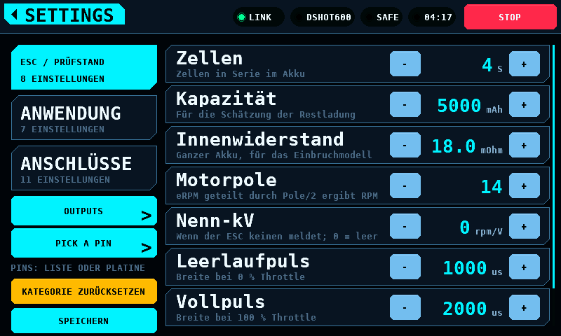

Der Druck fordert an, er schreibt nicht. Einstellungen zu schreiben committet
eine Page im NVS (Non-Volatile Storage), und eine Flash-Operation auf dem
ESP32-S3 schaltet den Instruction Cache ab, es läuft also für ihre Dauer auf
keinem der beiden Kerne Code. Geschrieben wird im ersten Frame, in dem der
Prüfstand disarmed ist und kein Platinenfoto geholt oder abgelegt wird. Auf
dem Einstellungs-Bildschirm ist das der nächste Frame, und die Beschriftung
steht auf `GESPEICHERT`, so schnell wie das Auge dem Druck folgt. Armed steht die
Anforderung als `BEI STILLSTAND`, bis der Prüfstand disarmed wird.

Ein Store, der ablehnt, lässt die Beschriftung in der Danger-Farbe auf
`NICHT GESPEICHERT` stehen, bis das nächste erfolgreiche Schreiben oder die nächste
Änderung kommt. Eine Ablehnung macht nicht rückgängig, was schon geschrieben
wurde: Die Werte werden Key für Key gesetzt, und ein Fehlschlag mittendrin
lässt die früheren Keys committed, das Medium kann also eine Mischung aus
neuen und alten Werten halten. Der Bildschirm kann nicht sagen, welche. Ein
Panel, dessen NVS gar nicht hochkam, lehnt jedes Schreiben der Sitzung ab,
schreibt nichts und sagt das zusätzlich einmal auf dem Splash als
`NVS nicht verfügbar`.

Nicht gespeicherte Werte bleiben, bis das Panel ausgeschaltet wird. Das
Verlassen des Bildschirms schreibt nichts.

## Der Bus-Fehler-Bildschirm

Das Panel führt den CAN-Echo-Selbsttest (Controller Area Network) bei jedem
Start aus, 1200 ms lang innerhalb des Splash. Ein anderes Urteil als „alle
Probes kamen unversehrt zurück" bringt diesen Bildschirm auf das Panel statt
des Menüs.

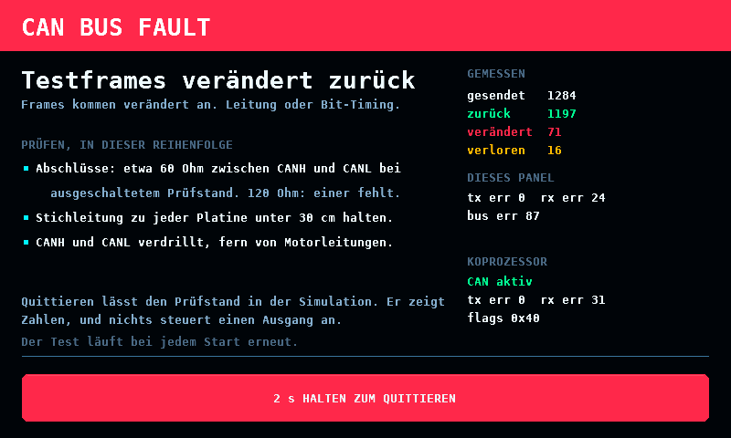

Es gibt ihn, weil der Fehler von jedem anderen Bildschirm aus unsichtbar ist:
ein Bus, der keine Frames trägt, sieht genauso aus wie ein Koprozessor, der
nicht bestückt ist, und beides sieht aus wie ein Prüfstand, der einfach keine
Zahlen zeigt. Das Urteil ist die Überschrift, die Liste ist das, was der
Reihe nach zu prüfen ist, und die rechte Spalte ist das, was beide Enden
gezählt haben.

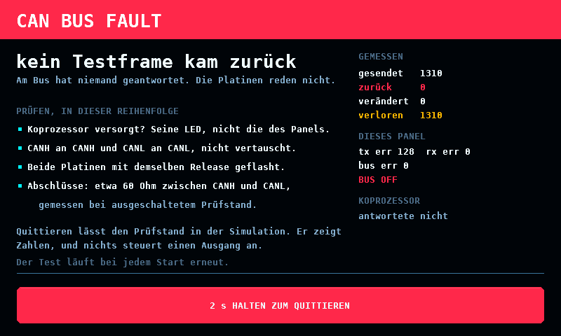

Verlassen kostet zwei Sekunden Halten — die ARM-Geste und dieselbe
Überblendung. Das Quittieren repariert nichts: der Prüfstand läuft in
Simulation, nichts treibt einen Ausgang, und der Test läuft beim nächsten
Start wieder. Es gibt kein Band und kein STOP, denn dahinter kann nichts
armiert sein.

### Ein Link, der abreißt

Derselbe Bildschirm trägt die andere Hälfte: ein Link, der stand und seit 4 s
weg ist. Die Überschrift ist das, was der CAN-Controller dieses Panels gerade
tut — der Draht hat eben noch Frames getragen.

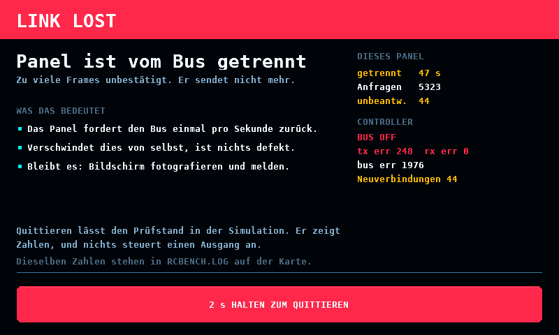

| Überschrift | Bedeutung |
| --- | --- |
| `Panel ist vom Bus getrennt` | zu viele Frames blieben unquittiert; es hat aufgehört zu senden |
| `Panel verbindet sich neu` | es zählt die Ruhezeit ab, die ein Rejoin braucht, rund 3 s |
| `Controller des Panels steht` | untätig und nicht neu gestartet — ein Fehler in der Firmware |
| `Link antwortet nicht mehr` | der Controller ist am Bus und niemand antwortet |
| `Controller nicht lesbar` | der Treiber läuft nicht; es kann nichts gesendet werden |

Vier Sekunden, nicht eine: der Link fällt gelegentlich für einen Poll aus, und
ein Bildschirm, der bei jedem Zucken übernimmt, ist einer, den man wegklickt.

**Niemals bei armiertem Prüfstand.** Der Bildschirm hat kein STOP, und einem
Prüfstand, an dem sich etwas dreht, darf keine Diagnose die Stopptaste
verdecken. Armiert sagt das Alert-Band, dass der Link weg ist, und der
Bildschirm wartet auf das Disarmieren.

Dieselben Zahlen gehen in `RCBENCH.LOG` auf der SD-Karte, eine Zeile je
Report, solange der Link unten ist:

    t=182s link=down for 47s  bus=OFF tx_err=248 rx_err=0 bus_err=1976 rejoins=44/44  polls=5323 replies=5279 timeouts=44

Die Felder sind jedes Mal dieselben in derselben Reihenfolge. `rejoins` ist
dieser Ausfall über der Gesamtzahl seit dem Start, und ein Controller, der
sich nicht lesen lässt, schreibt `?` in seine Spalten statt einer anders
geformten Zeile: die Ablesung, die einen Zeitstempel am nötigsten hat, ist
genau die, bei der der Controller nicht geantwortet hat.

Die Karte ist dafür da, weil die Konsole des Panels nicht auf jeder Platine
erreichbar ist. Die native USB-Buchse führt GPIO19 und GPIO20, die der
Multiplexer etwa eine Sekunde nach dem Start an CAN übergibt — sie ist also
weg, bevor ein Fehler am Prüfstand passiert. Die gebrückte Buchse liegt an
UART0 und trägt die Konsole normalerweise durchgehend; womit sie verbunden
ist, ist aber umschaltbar: ein Schiebeschalter neben den Tastern BOOT und
RESET ist mit UART1 und UART2 beschriftet. In einer Stellung meldet sich der
Bridge-Chip an und lässt in keine Richtung etwas durch, und dann hat das Panel
gar keine Konsole.

[Den Link in Betrieb nehmen](Link-de.md) hat die Urteile und was jedes
bedeutet.

## Outputs

Hinter der OUTPUTS-Taste auf dem Setup-Bildschirm. Die Protokolle, die an die
Pins des Koprozessors gebunden sind, und welche Pins jedes davon treibt.

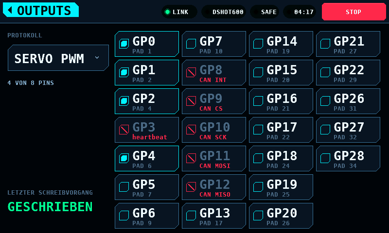

Ein Pin-Satz je Protokoll, nicht acht unabhängige Slots: ein Prüfstand wird
protokollweise verkabelt — vier Servokabel, dann ein ESC (Electronic Speed
Controller) — und erst nach dem Protokoll und dann nach seinen Pins zu fragen
ist die Form dieser Arbeit. Mehr als ein Protokoll kann gleichzeitig gebunden
sein, und ein Pin gehört höchstens einem davon.

Jeder angehakte Pin wird ein Slot auf der [OUTPUTS-Page](Link-de.md#page-map),
in Pin-Reihenfolge über alle Protokolle hinweg, mit Kanälen ab null — der
niedrigste angehakte Pin ist also Kanal 0, in welcher Reihenfolge der
Bildschirm auch berührt wurde und welches Protokoll ihn auch hält. Acht Slots
und acht Kanäle sind das Budget, geteilt. PPM rendert acht Kanäle auf seinem
einen Pin, ein Prüfstand mit PPM hat also für nichts anderes Platz. Es läuft
mit 40 Hz und nicht mit den 50 Hz der übrigen Pulstreiber: acht Kanäle
brauchen 23 300 us Rahmen, und 50 Hz geben 20 000.

SERVO PWM und MOTOR PWM sind derselbe Puls mit denselben 50 Hz und
unterscheiden sich darin, wofür der Kanal da ist. Ein Servokanal geht in die
Mitte, wenn ihn nichts kommandiert; ein Motorkanal geht auf null. Am Puls ist
nicht zu erkennen, was am Pin hängt, also sagt es der Eintrag: einen ESC als
MOTOR PWM binden, ein Ruder als SERVO PWM. Der Gasregler auf MOTOR & ESC
treibt jeden als Motor gebundenen Kanal — MOTOR PWM und die DShot-Einträge —
und lässt die Servokanäle in Ruhe.

Ein MOTOR-PWM-Kanal sendet 0 % Gas als Leerlaufpuls und 100 % als Vollpuls:
1000 us und 2000 us ab Werk, einstellbar unter SETUP, ESC / PRÜFSTAND, in Schritten
von 10 us (Leerlaufpuls 800 bis 1600 us, Vollpuls 1400 bis 2400 us). Die
beiden Einstellungen gehen an die als Motor gebundenen Kanäle und an keine
anderen: ein SERVO-PWM-Kanal behält 1000 bis 2000 us oder den Bereich, den der
SERVO-Bildschirm für das dort gewählte Servo sendet. Eine Änderung erreicht
den Coprozessor 300 ms nach der letzten Eingabe, solange der Prüfstand nicht
scharf ist; eine Änderung im scharfen Zustand wartet auf das Entschärfen.
Ein Coprozessor, der sich verbindet, bekommt die beiden Einstellungen, bevor
der Prüfstand ihn treibt: bei einem schon scharfen Prüfstand bleibt er
entschärft, bis er sie hat. Ein
Leerlaufpuls, der nicht unter dem Vollpuls liegt, wird nicht gesendet, und das
Band zeigt `Leerlaufpuls muss unter dem Vollpuls liegen -- nicht gesendet`.

Ein ESC, dessen Gasweg an einem Sender kalibriert wurde, nimmt den kürzesten
Puls dieses Senders als null. Einen Leerlaufpuls darüber liest der ESC als Gas,
das nicht ganz unten ist, und er schaltet nicht scharf; viele ESCs piepen dann
schnell. Den Leerlaufpuls auf oder unter den kürzesten Puls des Senders stellen
und den Vollpuls auf oder über seinen längsten: bei einem Sender mit 985 bis
2012 us also 980 us und 2020 us.

Wenn das Protokoll keinen Pin mehr nehmen kann, steht der Grund in Bernstein
darunter: `BRAUCHT 8 KANÄLE, 4 FREI`, `ALLE 8 SLOTS BELEGT` oder
`SERVO PWM BELEGT 8 PINS`. Eine komplett graue Platine ohne Begründung daneben liest sich
wie ein Defekt, und PPM färbt die ganze Platine grau, sobald irgendetwas
anderes gebunden ist.


Das Protokoll ist eine Liste und kein Stepper: es gibt acht davon, und sich
an sieben vorbeizuschieben, um das achte zu erreichen, ist keine Auswahl.

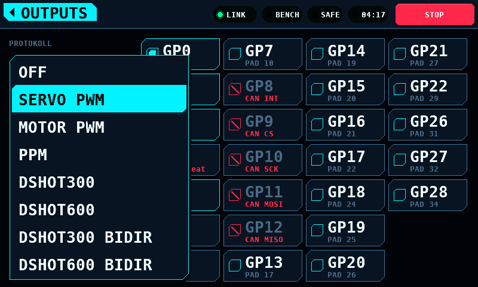

Reservierte Pins werden gezeigt und lassen sich nicht anhaken. GP3 trägt die
Safety-Heartbeat-Leitung und GP8 bis GP12 den CAN-Controller (Controller Area
Network); jeder sagt das unter seinem Namen. Sie zu verstecken hieße, dass
jemand GP10 sucht und eine Lücke findet. [DShot und die
Output-Treiber](DShot-de.md#welcher-pin) hat die ganze Übersicht.

Die Pad-Nummer unter jedem Pin ist die auf der Platine aufgedruckte, damit wer
Pads zählt und wer GPIO-Nummern (General-Purpose Input/Output) liest beim
gleichen Pin ankommen.

Jede Änderung schreibt die Pages sofort. Es gibt keine ÜBERNEHMEN-Taste: ein
Bildschirm mit einer nicht gesendeten Auswahl ist ein Bildschirm, der dem
Prüfstand widerspricht, und nichts sagt, welcher von beiden treibt. Was aus dem
Schreiben wurde, steht unter dem Protokoll — GESCHRIEBEN, KEIN LINK oder ABGELEHNT.

Ein Protokollwechsel sagt, welcher Satz gerade bearbeitet wird. Nichts wird
verworfen: die Pins des verlassenen Protokolls bleiben gebunden, und die Pins
des erreichten kommen zurück, wie sie waren. Ein Selektor, der die aktuellen
Pins umlenkte, hieße, dass ein zweites Protokoll zu binden das erste löst.

Ein Pin, den ein anderes Protokoll hält, wird grau gezeichnet, mit dem Namen
dieses Protokolls darunter, wo ein freier Pin seine Pad-Nummer zeigt. Das ist
eine Auswahl, rückgängig gemacht bei diesem Protokoll — anders als ein
reservierter Pin, der rot und durchgestrichen ist, weil er die Verkabelung ist
und keine Auswahl.

Vier Servokabel und ein ESC, mit DShot600 als bearbeitetem Protokoll. GP5 ist
angehakt; GP0, GP1, GP2 und GP4 sagen SERVO PWM und lassen sich hier nicht
anhaken; GP3 und GP8 bis GP12 sind rot, weil der Koprozessor sie reserviert:


Eine Zelle ist also in einem von vier Zuständen, und jeder sagt, was zu tun
ist: in diesem Protokoll angehakt, von einem anderen gehalten und benannt,
reserviert und durchgestrichen, oder frei und mit seiner Pad-Nummer.

### Pin auswählen

Hinter der Taste PICK A PIN auf dem Setup-Bildschirm, und dieselbe Bindung,
die der Outputs-Bildschirm hält. Die Liste beantwortet „welcher GPIO ist
gebunden“; dieser beantwortet „wo stecke ich das Kabel an“.

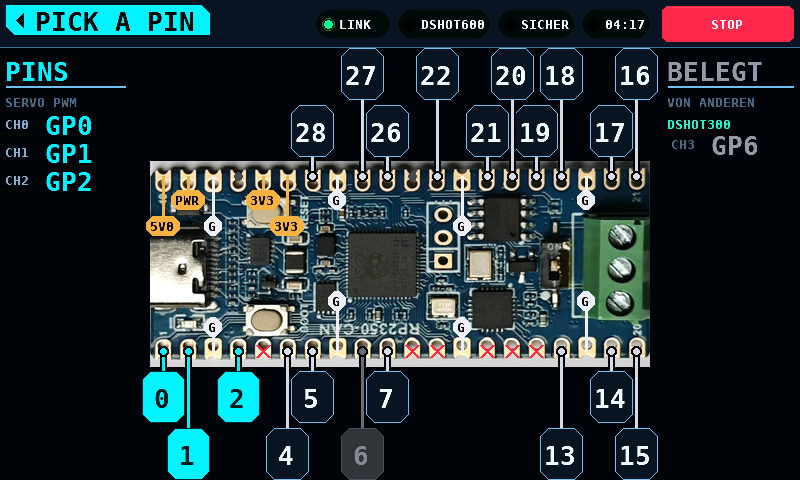

Die Tasten sind nicht die Pads. In jeder Größe, die auf ein 480-Pixel-Panel
passt, ist ein Pad unter 40 Pixel breit und damit kleiner als eine
Fingerkuppe. Also werden die Pads gezeichnet, wo sie sind, und berührt wird
auf versetzten Tastenreihen neben der Platine, jede an einer geraden Leitung
zu ihrem eigenen Pad.

Eine Taste ist gefärbt wie ihre Zelle auf dem Outputs-Bildschirm: die Pins
dieses Protokolls in der Akzentfarbe, ein Pin, den ein anderes Protokoll
hält, grau, und ein vom Koprozessor reservierter Pin hat gar keine Taste — er
ist auf dem Pad durchgestrichen, denn eine Taste unter einem Pin, der nicht
gewählt werden kann, sagt, er ließe sich wählen.

Links stehen die Pins dieses Protokolls in Kanalreihenfolge, rechts die Pins,
die andere Protokolle halten, mit Namen. Beide zusammen lesen sich als ein
Lauf von Kanälen, denn das ist, was die OUTPUTS-Page trägt.

Wo die Pads liegen, kommt von der Platine und nicht vom Panel: die
[Shape-Page](Link-de.md#page-map) trägt den Umriss, das Raster und die Ecke,
an der Pad 1 sitzt. Eine Platine, die das nicht sagt, wird gar nicht
gezeichnet — ein Bild aus einer geratenen Form zeigt mit derselben
Überzeugung auf den falschen wie auf den richtigen Pad, und die ganze Aufgabe
dieses Bildschirms ist es, einen Pad auf der Platine vor dir zu finden. Ihre
Pins stehen weiterhin auf dem Outputs-Bildschirm.

Das Foto ist wieder davon getrennt. Mit einem ist die Platine auf dem
Bildschirm die Platine in deinen Händen; ohne eines werden Umriss und jedes
Pad aus der Form gezeichnet, und die Tasten liegen an denselben Stellen:

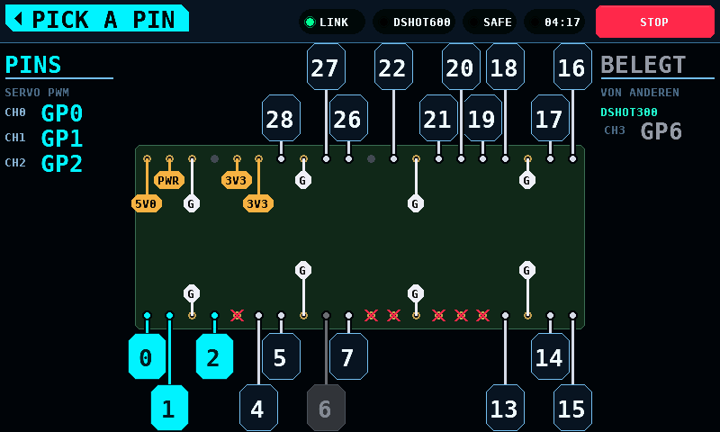

Das Foto wird einmal je Platine über den Link geholt und im Flash des Panels
behalten. Es kostet also etwa zehn Sekunden, wenn eine Platine zum ersten Mal
gesehen wird, und danach nichts. Eine Platine ohne Foto, oder eine, deren
Übertragung nicht fertig wurde, wird gezeichnet statt leer gelassen.

Ein Servokabel hat drei Adern, und die Tasten beschreiben eine davon. Die
anderen beiden sind auf der Platine selbst markiert: eine Masse trägt ein
weißes **G**, eine Versorgung ihre Spannung — **5V0**, **3V3**. Eine
Versorgung, die ein Eingang und keine feste Spannung ist, trägt stattdessen
**PWR**, denn eine Zahl, die nur manchmal stimmt, ist hier schlechter als
keine. Pads, die keines von beidem sind, etwa RUN, bekommen einen Punkt und
keine Beschriftung.

Sie werden innerhalb des Umrisses an einer kurzen Leitung markiert, in zwei
Tiefen, damit eine Reihe von Versorgungen an einem Ende nicht eine
Beschriftung über die nächste zeichnet. Innen ist der einzige verbleibende
Platz: der Raum neben der Platine gehört den Tasten, und eine Markierung auf
dem Pad selbst wäre so klein wie das Pad.

Sie kommen von der [Pads-Page](Link-de.md#page-map), die vom Katalog getrennt
ist, weil sie dort nicht hineinpassen — eine Page hat 32 Register, und eine
Platine mit 40 Pads hat zwischen beiden mehr Pads als das. Eine Platine, die
sie nicht bedient, hat ihre Massen und Versorgungen unmarkiert, und ein Kabel
wird gesteckt, indem man die Platine liest statt den Bildschirm.

### Der Koprozessor hält sie, nicht das Panel

Eine Bindung beschreibt die Verkabelung, und das Panel ist nicht die Platine,
in der die Drähte stecken. Der Koprozessor schreibt die Pages OUTPUTS und
CHAN_CFG in seinen eigenen Flash und stellt sie beim Booten wieder her; das
Panel speichert keine Bindung und sendet keine ungefragt. Kommt der Link hoch,
liest das Panel die Page und zeigt, was drüben konfiguriert ist. Nach einem
Panel-Neustart sind das, was dieser Bildschirm zeigt, und das, was Pins treibt,
dieselbe Sache.

Das Wiederherstellen konfiguriert die Outputs. Es treibt sie nicht: jeder
Treiber ist daran gebunden, dass die Bank armed ist, was der Koprozessor nur
gewährt, solange das ARM-Register gesetzt ist, der Link nicht im Failsafe ist
und der Heartbeat vertraut wird. Eine wiederhergestellte Bindung belegt also
ihre Pins und hält sie im Idle, bis jemand armed. Kanalbefehle werden nicht
wiederhergestellt — eine Konfiguration überlebt einen Power-Cycle, eine
Gasstellung nicht.

Das Speichern wartet, bis der Prüfstand nicht mehr treibt, und dann auf eine
Lücke im Verkehr. Flash zu schreiben hält den Koprozessor mit abgeschalteten
Interrupts an, und solange antwortet er auf nichts: auf dem
Inbetriebnahme-Modul wurde ein Speichervorgang, der in einem Fenster gelöscht
und programmiert hat, mit 19.178 us gemessen, gegen einen CAN-Frame von etwa
130 us und zwei Frames Puffer im Controller. Löschen und Page Program sind
nicht getrennt voneinander gemessen. Ein in diesem Fenster verlorener Request
kostet das Panel 1000 ms Wartezeit, was über dem 200-ms-Failsafe des
Koprozessors liegt; ein einziger verlorener Frame endet also als `FEHLER 01`
(`LINK_FAULT_LINK_SILENT`) an einem Kabel, an dem nichts fehlt.

Der Sektor wird deshalb nicht je Speichervorgang gelöscht. Zwei Sektoren
halten je sechzehn Records; ein Speichervorgang schreibt den nächsten Record,
und ein Sektor wird erst gelöscht, wenn jeder Record darin überholt ist.
Dieses Löschen wird vor den Speichervorgang gezogen, der es braucht: beim
Booten, bevor der Koprozessor antwortet, oder in einem Durchlauf nach dem
Speichervorgang, der zuerst in den anderen Sektor schreibt, sobald der Bus
5 ms ruhig war. Gelöscht wird der zurückgelassene Sektor, nicht der gerade
gefüllte, und zwischen dem Löschen und dem Speichervorgang, der es braucht,
liegen die fünfzehn Speichervorgänge dazwischen.
Fünfzehn von sechzehn Speichervorgängen kosten damit ein Page Program und
kein Löschen. Wie lange ein Page Program auf dem Flash des Moduls dauert, ist
nicht gemessen; die Konsolenzeile nach jedem Speichervorgang trägt den Wert.

Ein Stromausfall während des Speicherns lässt die Bindung von davor stehen.
Der gerade geschriebene Record fällt durch seine Prüfsumme, der Record davor
ist weiterhin der neueste gültige, und der gelöschte Sektor ist nie der, in
dem der noch gebrauchte Record liegt.

Eine Page, die der Bildschirm nicht beschreiben kann — zwei Protokolle
gleichzeitig, eine Rate, die kein Eintrag anbietet, ein Pin, der nicht auf dem
Header liegt — liest sich als "nichts konfiguriert" zurück, statt als eine
Auswahl, die der Page widerspricht, aus der sie stammt.

## Auswuchten

Auf einer eigenen Seite beschrieben: [Auswuchten](Balance-de.md).

## Bildschirme, die nicht fertig sind

Eine Kachel mit der Marke BALD nennt, was der Bildschirm tun wird und auf
welches Bauteil oder welche Entscheidung er wartet.
