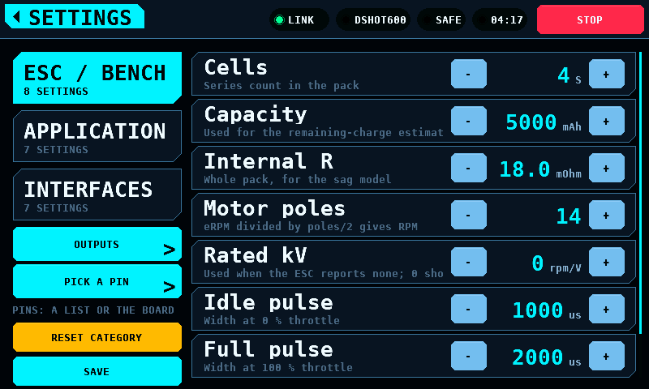
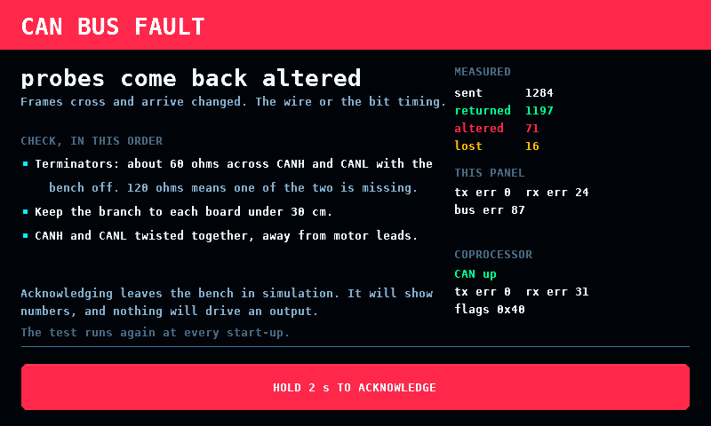
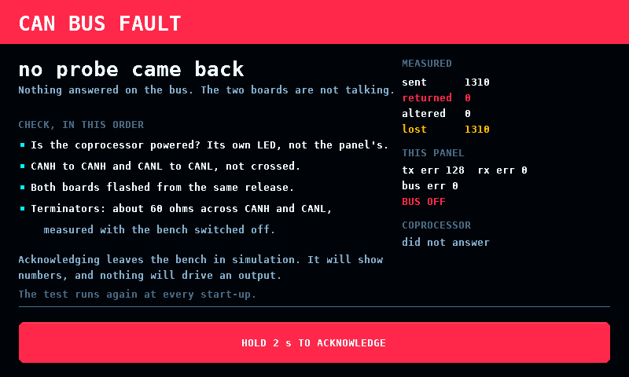
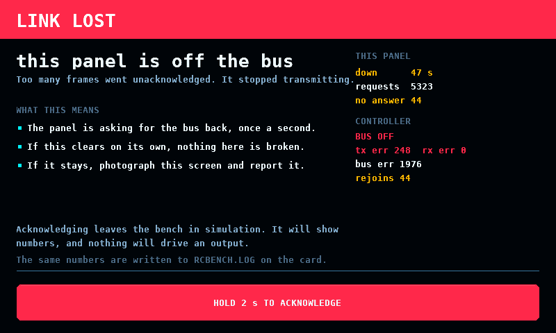
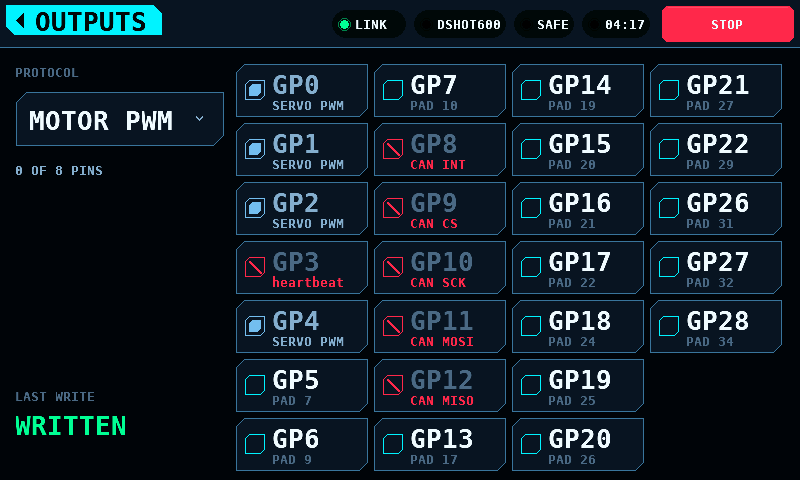

# Screens

**English** · [Deutsch](Screens-de.md)

What is on every screen, what the menu marks mean, and how each screen is
operated.

## The status band

The top band is shared by every screen. From the right: STOP, the run clock
(while armed or after a run), ARMED or SAFE, a FAULT code when one is reported,
the output mode (LINK or SIM), and LINK or NO LINK.

STOP works on every screen. It disarms and latches: the bench stays disarmed
until it is armed again. Navigating away, an alert expiring or the link
recovering does not clear a stop.

ARM is at the bottom of a bench screen; STOP is at the top of the band.

## Menu marks

| Mark | Meaning |
| --- | --- |
| SOON | the screen does not exist; the tile lists what it will do and what it waits on |
| MODELLED | the screen exists and works, but its hardware is not fitted; every value is simulated and the screen says so |
| none | the hardware is fitted and the readings are measured |

The mark is derived from the capability bits the coprocessor reports at
bring-up. A screen whose hardware is missing opens and runs from the model.

The menu in the light theme:

## Splash

Each subsystem reports its result as it comes up: board, display, touch, SD
card, settings, link, coprocessor. The board line carries the panel's own
firmware version, and the coprocessor line carries the protocol version and
the firmware version that the coprocessor reported -- two boards can speak
the same protocol and be different builds, and this is where that shows.

A missing card or an unusable NVS (non-volatile storage) is a warning. A
touch controller that does not answer, or a coprocessor with a different
protocol major version, is a failure and the bench will not arm.

When every step has answered, the splash hands over to the menu after a hold
of 1.6 s; a tap skips the hold.

## Motor & ESC

Two columns. The plot and the throttle take the left, the four readouts and
the controls take a rail on the right, so reading the numbers and working the
throttle do not compete for the same part of the screen.

The strip above both columns carries the poll rate, the link's error count
(cyclic redundancy check failures and resyncs added together) and three
temperatures. ESC and MOT come from the bench page. MCU is the panel's own
die, read from the ESP32-S3's sensor: it is the display board's temperature,
not the coprocessor's.

The throttle moves by how far a finger travels, not to where it lands. A press
on the track commands nothing, so a touch at the far end cannot ask for full
travel in one contact. `-1` and `+1` at the ends of the track step one
percentage point.

ARM is a hold. The fill fades from green to the danger red across two
seconds, and the bench arms when the fade completes; letting go before then
arms nothing, and the release itself arms nothing either.

The finger has to stay on the button. One that leaves it abandons the hold,
because the gesture is contact with the control and not with the panel.
Coming back is not resuming: the contact is finished as far as ARM is
concerned, so arming after that takes lifting the finger and pressing again.
A bench that disarms under a finger still held on the button ends the gesture
too — otherwise the contact made to stop it would arm it again two seconds
later. Arming flashes the
whole button twice: white, black, red, and again, one drawn frame each. An
armed bench carries the danger red, and DISARM is a press rather than a hold:
stopping never needs a hold. DISARM and STOP stop the output immediately, with
no ramp. RESET PEAKS clears the peak markers and leaves the live readings.

### EFF is a guessimetric

The telemetry panel's header shows the rated kV, the revolutions per minute
per volt the motor is actually turning, and EFF, the second divided by the
first.

The arithmetic behind it is sound. Terminal voltage divides into the resistive
drop and the back electromotive force (back-EMF), so rpm/V under load is the
rated kV scaled by the fraction of the voltage that reaches the back-EMF, and
that fraction is the fraction of the input power that becomes mechanical. In
an ideal motor the ratio is the conversion efficiency exactly.

The number on the screen is not that, for three reasons, and it is labelled
EFF rather than efficiency because of them:

- It accounts for copper loss (I squared R) only. Iron loss, friction and
  windage fall on the mechanical side of the split, so the figure is an upper
  bound on shaft efficiency rather than a value of it.
- The bench measures pack voltage, not the motor's terminals, so the ESC's
  conduction and switching losses are inside the figure. It describes the
  drivetrain, and comparing it against a motor datasheet compares two
  different things.
- It is only as good as the rated kV. An error there maps straight into the
  percentage, and a figure above 100 % means the rated value is wrong; the
  screen shows that rather than hiding it, capped at 199 %.

The rated kV comes from the connected ESC when it reports one. No ESC reports
it yet, so in practice it is the `Rated kV` setting, which defaults to zero: a
guessed kV produces a plausible-looking percentage that is wrong, so with no
value the field is drawn empty and no percentage is shown. The measured rpm/V
is shown either way, being a measurement rather than an inference.

While the values are simulated, SIMULATION is drawn across the screen. The
panel simulates only while no coprocessor answers, so the watermark goes when
one does. What replaces it is what that coprocessor can actually measure: rpm
from bidirectional DShot today, and its own sensors when a measurement front
end is fitted. A quantity nothing measures is drawn as an empty field rather
than as a modelled number.

## Servo

Drag anywhere on the sweep to command a position. The solid arm is the measured
position; the faint arm is the commanded position. The gap between them is the
servo's own lag. The rings around the tip pulse while the servo is being
driven. Releasing the sweep clears the output slot.

SPEED is the rate the bench may move the output, in degrees a second of the
horn's travel, not a speed for the drawing alone. At 100% the command goes
straight through and the servo moves at its own rate; below that the bench
ramps the command in front of it, so 30% takes three times as long to cross
as 90%. It applies to a held output as soon as it is changed.

**ARM before anything moves.** While the bench is not armed the coprocessor
writes a pulse of length zero to every PWM pin, so the horn on screen follows
the finger and the servo does not. The button is a two-second hold, the same
gesture and the same fade as the one on MOTOR & ESC, and a press on it while
armed disarms. Leaving the screen disarms and lets go of the pin: a screen
that is not visible must not be holding a servo somewhere, or leaving the
bench armed behind it.

## Analyser

Sixteen channels, each with 1.5 s of history and a bar for its current value.
CH17 and CH18 are the two digital channels. A glitch is a spike in one lane; a
dropout is a notch across all sixteen at the same instant.

The state block shows one of SILENT, FAILSAFE, FRAME LOST and LIVE, with one
line of explanation:

In FAILSAFE the receiver is sending well-formed values it has generated itself;
every trace is drawn red. Treat FAILSAFE as a stop, not as sixteen valid
channels. [Receiver buses](Receivers.md) describes the states.

## Programmer

The sequence is: device class, protocol, connect.

Every protocol row names its transport. There is no autodetection:

BLHeli_32 is not in the ESC list. The bench identifies and drives these ESCs
and sends the DShot special commands, but cannot read their parameters:
[BLHeli_32 parameters](BLHeli32.md).

Nothing is editable until a device has answered:

After a device answers, the parameters are shown in groups with the selected
row's help under the list:

Each firmware shows its settings in its own units. BLHeli_S shows timing as
named steps; the others show degrees of advance:

A changed value is not written until WRITE is pressed. Staged changes carry a
mark and their own colour, and the WRITE button shows how many are staged:

Steppers stop at the ends of a list; they do not wrap.

Going back one level drops the connection. Back climbs one level at a time; the
band's home tag leaves the screen.

## Battery

Cells are drawn as their departure from the pack's mean. The verdict follows
the spread, the widest gap between any two cells: HEALTHY below 30 mV, WATCH
from 30 mV, REPLACE from 60 mV. The scale follows the pack down to a floor of
12 mV and is printed beside the plot.

Measure under load. At rest a weak cell reads like the others.

## Logs

Browse the card, open a file, check what the import detected, then plot:

The CSV (comma-separated values) reader accepts decimal comma and decimal
point, a units row and ragged rows; the import view shows what it decided
before the file is plotted. Runs recorded by the bench are written as
`BENCH001.CSV` to `BENCH999.CSV` in the card's root directory.

The list holds 48 entries and a card holds up to 999 runs. When there are more
than fit, the list keeps the newest runs and its tab reads `48 OF 137 FILES`
instead of `FILES`, so a run that is missing from the list is a run the list
was too short for rather than a run that was never written. The number in the
name is what newest means: the panel has no clock that survives a power cycle,
so every file on the card is dated 1980-01-01. A run outranks a file the bench
did not write, so a card holding 48 or more runs lists no other file. Delete
old runs on a computer to get one back.

A run is committed to the card every 20 rows or 1000 ms of run, whichever
comes first. Power lost mid-run costs the rows since that commit and the rows
still in the queue between the control task and the card's own task: under
1.0 s of run while the card keeps up, and 83 rows, 4.15 s at the panel's 20 Hz
sample rate, if the card has stalled and the queue is full. The rest of the
file is readable either way. The card is written by a task of its own: an SD (Secure
Digital) card is allowed 250 ms to finish a write, and the task that beats the
safety line has a ceiling of 150 ms. If that task falls behind the run, the
panel says `the card fell behind -- the log has gaps` when the run closes and
the file's time column shows where the gap is.

## Setup

Settings are behind the SETUP tile, in both themes:

### Keeping the values

A changed value takes effect at once and is not written to flash until SAVE is
pressed. The button under RESET CATEGORY says which of three states the
screen is in:

| Label | Meaning |
| --- | --- |
| `SAVED` | Nothing is unwritten. The button is inert. |
| `SAVE` | Something is unwritten. Pressing it asks for a write. |
| `WHEN IDLE` | A write has been asked for and is waiting for a moment to happen in. |

The press asks; it does not write. Writing settings commits a page of NVS
(non-volatile storage), and a flash operation on the ESP32-S3 disables the
instruction cache, so neither core runs for its duration. The write is taken
on the first frame at which the bench is disarmed and no board photograph is
being fetched or stored. On the settings screen that is the next frame, and
the label goes to `SAVED` as fast as the eye follows the press. Armed, the
request stands as `WHEN IDLE` until the bench is disarmed.

Values not saved are kept until the panel is switched off. Leaving the screen
writes nothing.

## The bus-fault screen

The panel runs the CAN (Controller Area Network) echo self-test at every
start-up, for 1200 ms inside the splash. A verdict other than every probe
coming back intact puts this on the panel instead of the menu.

It exists because the fault is invisible from every other screen: a bus that
does not carry frames looks exactly like a coprocessor that is not fitted, and
both look like a bench that shows no numbers. The verdict is the heading, the
list is what to check in the order that costs least to check, and the right
column is what both ends counted.

Leaving it takes a two-second hold, the ARM gesture and the same fade.
Acknowledging repairs nothing: the bench runs in simulation, nothing drives an
output, and the test runs again at the next start-up. There is no band and no
STOP, because nothing can be armed behind it.

### A link that stops

The same screen carries the other half: a link that was up and has been gone
for 4 s. The heading is what this panel's own CAN controller is doing, because
the wire carried frames a moment ago.

| Heading | Meaning |
| --- | --- |
| `this panel is off the bus` | too many frames went unacknowledged; it stopped transmitting |
| `this panel is rejoining the bus` | it is counting the quiet time a rejoin needs, about 3 s |
| `this panel's controller has stopped` | idle and not restarted — a fault in the firmware |
| `the link stopped answering` | the controller is on the bus and nothing answers |
| `the controller cannot be read` | the driver is not running; nothing can be sent |

Four seconds, not one: the link drops for a poll now and then, and a screen
that took over on every blip is a screen operators learn to dismiss.

**Never while armed.** The screen has no STOP, and a bench with something
spinning must not have its stop button covered by a diagnosis. Armed, the
alert band says the link is gone and the screen waits for the disarm.

The same numbers go to `RCBENCH.LOG` on the SD card, one line per report while
the link is down:

    t=182s link=down for 47s  bus=OFF tx_err=248 rx_err=0 bus_err=1976 rejoins=44/44  polls=5323 replies=5279 timeouts=44

The fields are the same in the same order every time. `rejoins` is this outage
over the total since boot, and an unreadable controller writes `?` in its
columns rather than a differently shaped line: the reading that most needs a
timestamp is the one where the controller would not answer.

The card is there because the panel's console is not reachable on every board.
The native USB socket carries GPIO19 and GPIO20, which the multiplexer hands to
CAN about a second into boot, so it is gone before a bench fault happens. The
bridged socket is on UART0 and normally carries the console right through, but
what it is connected to is switchable: a slide switch beside the BOOT and
RESET buttons is marked UART1 and UART2. In one position the bridge chip
enumerates and passes nothing in either direction, and the panel then has no
console at all.

[Bringing up the link](Link.md) has the verdicts and what each one means.

## Outputs

Behind the OUTPUTS key on the Setup screen. The protocols bound to the
coprocessor's pins, and which pins each one drives.

A set of pins per protocol, not eight independent slots: a bench is wired a
protocol at a time — four servo leads, then one ESC (electronic speed
controller) — and asking for the protocol and then for its pins is the shape
of that job. More than one protocol can be bound at once, and a pin belongs to
at most one of them.

Each ticked pin becomes one slot on the [OUTPUTS page](Link.md#page-map), in
pin order across every protocol, taking channels from zero upward — so the
lowest ticked pin is channel 0 whatever order the screen was touched in and
whichever protocol holds it. Eight slots and eight channels are the budget,
shared. PPM renders eight channels on its one pin, so a bench with PPM on it
has room for nothing else. It runs at 40 Hz, not the 50 Hz the pulse drivers
use: eight channels need 23,300 us of frame and 50 Hz gives 20,000.

SERVO PWM and MOTOR PWM are the same pulse at the same 50 Hz and differ in
what the channel is for. A servo channel centres when nothing commands it; a
motor channel stops. Nothing in the pulse says which is on the pin, so the
entry says it: bind an ESC as MOTOR PWM and a control surface as SERVO PWM.
The MOTOR & ESC throttle drives every channel bound as a motor — MOTOR PWM
and the DShot entries — and leaves the servo channels alone.

When the protocol can take no more pins, the reason is under it in amber:
`NEEDS 8 CHANNELS, 4 FREE`, `ALL 8 SLOTS IN USE`, or `SERVO PWM TAKES 8
PINS`. A board drawn entirely in grey with nothing beside it reads as a
fault, and PPM greys the whole board whenever anything else is bound.

The protocol is a list rather than a stepper, because there are eight of them
and stepping past seven to reach the eighth is not choosing:

Reserved pins are shown and cannot be ticked. GP3 carries the safety heartbeat
and GP8 to GP12 are the CAN (Controller Area Network) controller, and each
says so under its name. Hiding them would leave an operator hunting for GP10
and finding a gap. [DShot and the output drivers](DShot.md#which-pin) has the
whole map.

The pad number under each pin is the one printed on the board, so an operator
counting pads and an operator reading GPIO (general-purpose input/output)
numbers arrive at the same pin.

Changing anything writes the pages at once. There is no APPLY key: a screen
holding a choice that has not been sent is a screen that disagrees with the
bench, with nothing to say which of the two is driving. What became of the
write is under the protocol — WRITTEN, NO LINK, or REFUSED.

Switching protocol says which set is being edited. Nothing is dropped: the
pins ticked for the protocol being left stay bound, and the pins of the one
arrived at come back as they were. A selector that retargeted the current pins
would make binding a second protocol mean unbinding the first.

A pin another protocol holds is drawn greyed, with that protocol's name under
it where a free pin shows its pad number. That is a choice, undone by going to
that protocol and unticking it there — unlike a reserved pin, which is drawn
red and struck through because it is the wiring rather than a choice.

Four servo leads and an ESC, with DShot600 the protocol being edited. GP5 is
ticked; GP0, GP1, GP2 and GP4 say SERVO PWM and cannot be ticked here; GP3 and
GP8 to GP12 are red because the coprocessor reserves them:

So a cell is in one of four states, and each says what to do about it: ticked
in this protocol, held by another and named, reserved and struck through, or
free and showing its pad number.

### Pick a pin

Behind the PICK A PIN key on the Setup screen, and the same binding the
Outputs screen holds. The list answers "which GPIO is bound"; this answers
"where do I put the lead".

The buttons are not the pads. At any size that fits a 480-pixel panel a pad is
under 40 pixels across, which is smaller than a fingertip, so the pads are
drawn where they are and the touching happens on staggered rows of buttons
beside the board, each on a straight trace to its own pad.

A button is coloured the way its cell is on the Outputs screen: this
protocol's pins are accented, a pin another protocol holds is grey, and a pin
the coprocessor reserves has no button at all — it is crossed on the pad,
because a button under a pin that cannot be chosen says it could be.

Down the left are this protocol's pins in channel order; down the right are
the pins other protocols hold, named. The two together read as one run of
channels, because that is what the OUTPUTS page carries.

Where the pads are comes from the board, not from the panel: the [shape
page](Link.md#page-map) carries the outline, the pitch and the corner pad 1
sits at. A board that does not say is not drawn at all — a picture from a
guessed shape points at the wrong pad as confidently as the right one, and
this screen's whole job is finding a pad on the board in front of you. Its
pins are still on the Outputs screen.

The photograph is separate again. With one, the board on screen is the board
in your hands; without one, the outline and every pad are drawn from the
shape and the buttons are in the same places:

The photograph is fetched over the link once per board and kept in the
panel's flash, so it costs about ten seconds the first time a board is seen
and nothing after that. A board with no photograph, or one whose transfer has
not finished, is drawn rather than left blank.

A servo lead has three wires and the buttons describe one. The other two are
marked on the board itself: a ground carries a white **G**, and a rail carries
its voltage — **5V0**, **3V3**. A rail that is an input rather than a fixed
voltage carries **PWR** instead, because a number that is only sometimes true
is worse here than no number. Pads that are neither, like RUN, are dotted and
left unlabelled.

They are marked inside the outline on a short trace, at two depths so a run of
rails at one end of a row does not draw one label over the next. Inside is the
only room left: the space beside the board belongs to the buttons, and a mark
on the pad itself would be as small as the pad.

These come from the [pads page](Link.md#page-map), which is separate from the
catalogue because they do not fit in it — a page is 32 registers and a
40-pad board has more pads than that between the two. A board that does not
serve it has its grounds and rails unmarked, and a lead is placed by reading
the board rather than the screen.

### The coprocessor keeps it, not the panel

A binding describes wiring, and the panel is not the board the wires are in.
The coprocessor writes the OUTPUTS and CHAN_CFG pages to its own flash and
restores them at boot; the panel never stores a binding and never sends one
unasked. When the link comes up the panel reads the page and shows what is
configured over there. After a panel restart, what this screen shows and what
is driving pins are the same thing.

Restoring configures the outputs. It does not drive them: every driver is
gated on the bench being armed, the heartbeat being trusted and a command
arriving, so a restored binding claims its pins and holds them at idle until
somebody arms. Channel commands are not restored — a configuration survives a
power cycle and a throttle position does not.

The save waits for the bench to stop driving. Writing flash stops the
coprocessor for tens of milliseconds with interrupts off, which is longer than
the heartbeat's window, so a change made while something is being driven is
written once it stops.

A page the screen cannot describe — two protocols at once, a rate no entry
offers, a pin that is not on the header — reads back as nothing configured
rather than as a selection that disagrees with the page it came from.

## Balancing

Described on its own page: [Balancing](Balance.md).

## Screens that are not ready

A tile marked SOON names what the screen will do and the part or decision it
waits on.
