# Screens

The bench is eight tiles behind a menu, plus a splash that tells you what came
up. This page covers the shell; each bench gets its own page as it is built.

## Why a status band, when the predecessor deliberately had none

The predecessor gave every screen its whole 800×480 and shared nothing but a
home tag, on the argument that a log viewer, a settings list and a live plot
want very different things from their top edge. That argument still holds for
the *body* of a screen, and is why the band is only 48 px.

What overturned the rest of it: **more than one screen can now arm something.**
STOP has to be in the same place everywhere, and a band is horizontal — the
cheap direction on a panel whose frame rate is bandwidth-bound, see
[Performance](Performance.md).

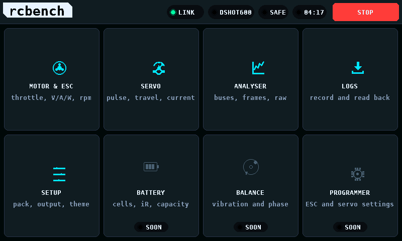

Right to left, so no item has to guess another's width: link state, the output
mode, armed, the run clock, and STOP. **STOP is global and always live** — it
disarms from any screen, so it never needs explaining.

One consequence is deliberate: **ARM lives at the bottom of a bench and STOP at
the top of the band**, separated by the full height of the panel, so reaching
for one cannot find the other.

### The band is enforced, not agreed

The router owns the top 48 px and hands each screen a **sub-canvas** of what is
left, via `gfx_canvas_sub`. Not by convention: physically. Every screen begins
by clearing its canvas, so a screen handed the whole panel would erase STOP on
the way past — silently, and looking like a cosmetic glitch rather than the
safety problem it is. `test_nav` asserts the band's own pixels survive a full
render of every screen.

Screens also work in their own coordinates. The offset is removed once, in the
router, rather than remembered in nine places.

## The splash is the self-test

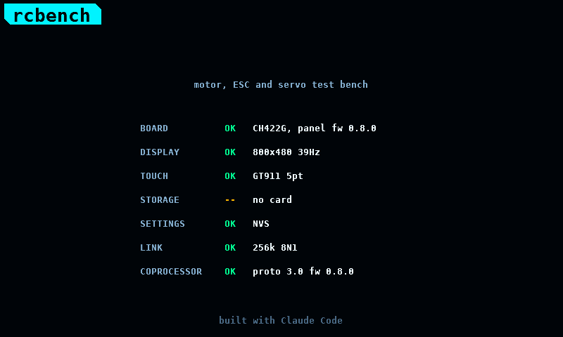

Not decoration. Each subsystem reports its own result as it initialises, so a
board with no card, a touch controller that did not answer, or a coprocessor
speaking a protocol version this panel does not, says so on the way past —
rather than looking mysteriously broken three screens later.

A **failure still counts as reported**: you must be able to read it and move
on, not be stranded here. Once every step has answered, the list holds briefly
and hands over to the menu; a tap skips the hold.

## The menu is things, not capabilities

The catalogue runs to sixty-odd entries across measure, drive, listen, program
and compute. A menu of *capabilities* would be a filing system, and a workshop
tool is not one. A tile is **a physical object you have in front of you**, and
the benches combine measure, drive and listen for that one object.

Five are live. Three are named, routed and honest:

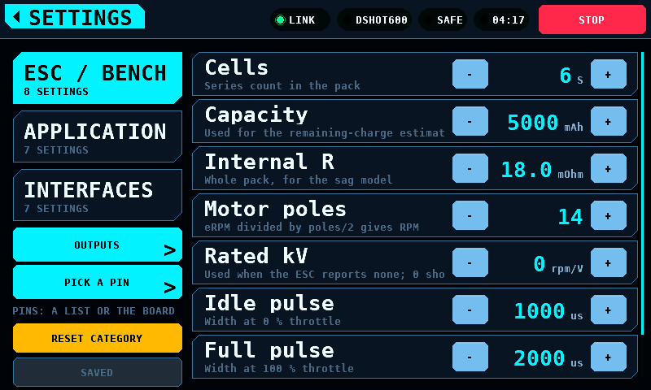

Built, and the seven screen cases that were held back while it was re-cut are
back with it. In the light theme too, because a palette change that only
breaks one theme is the kind that ships:

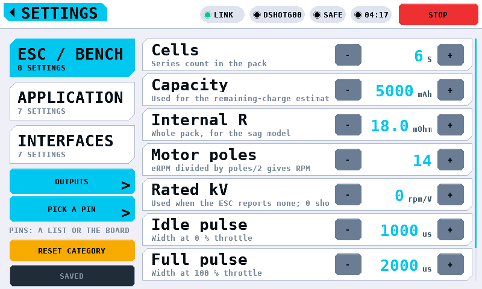

Both themes are committed, because a palette change that only breaks one theme
is the kind that ships:

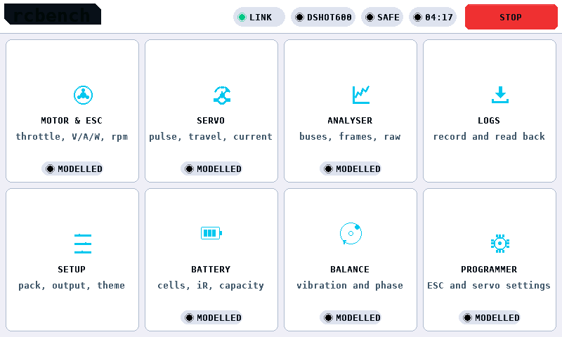

## A screen that cannot do its job yet says why

A "coming soon" panel teaches nobody anything. One that names what it will do,
and the single decision or part that has to arrive first, is a to-do list
somebody can answer.

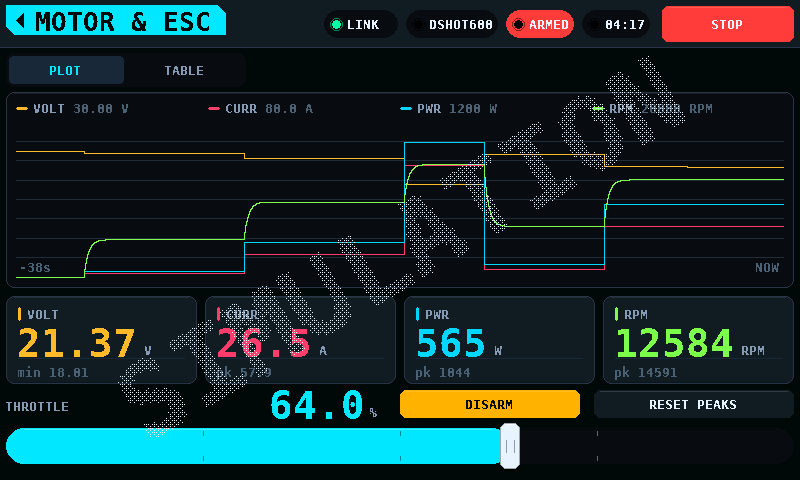

And the note turns **green** when nothing is blocking it — which is a different
and less comfortable position than being blocked:

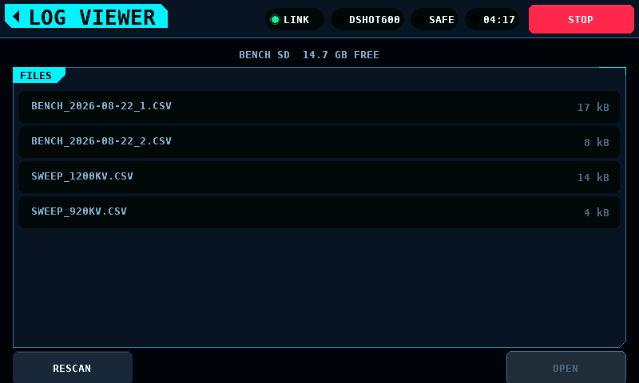

Which is now built: browse the card, see what the import view detected and the
evidence behind it, then plot.

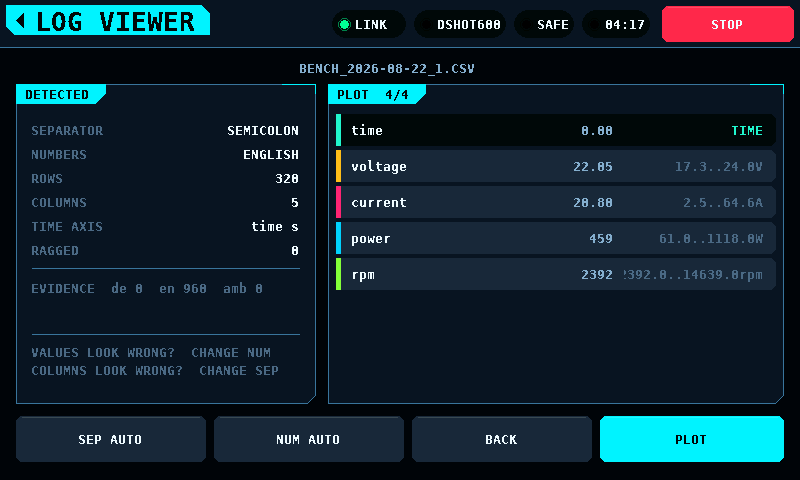
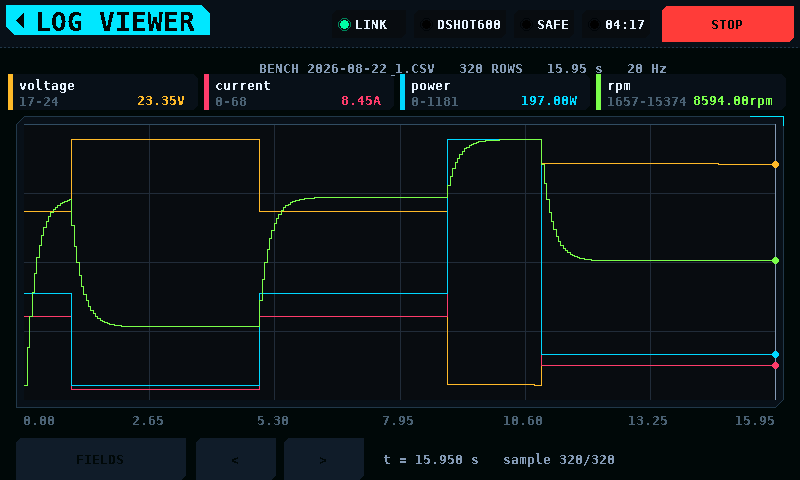

The layout moved up 40 px on the way in. It was drawn for a screen that owned
all 480 and painted its own home tag in the top 40; the router owns both now
and hands it a 432 px window, so without the shift the footer ran from 430 to
472 in a canvas 432 tall and RESCAN, OPEN and PLOT could not be pressed at
all.

The servo bench is commanded by its horn: drag anywhere on the sweep and the
arm points there. The case beside it is not the dial, and neither is the middle
of the boss, which is not a direction.

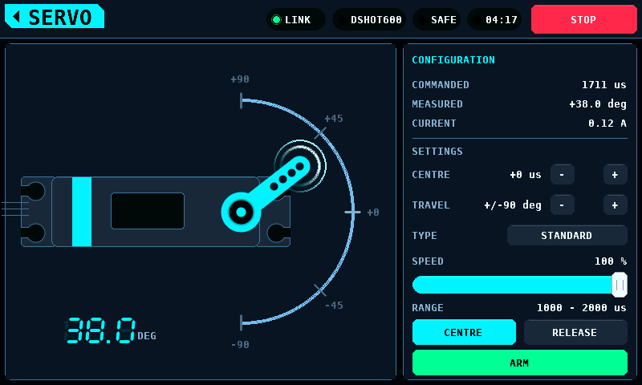

The arm follows the *measured* position and not the commanded one, with no
easing of its own. Easing towards a measurement would add the bench's lag on
top of the servo's, and once drawn the two are indistinguishable -- a slow
servo and a slow screen look identical, and only one of them is under test. So
the commanded position is drawn faintly behind the measured one, and lag shows
as two arms rather than as a number disagreeing with a picture.

The analyser is two thirds history and one third now. The question it is asked
is "I moved that -- which channel was it?", and no arrangement of current
values can answer it, because the information is in the movement. Each channel
keeps the last second and a half, so the one that moved is the one with a step
in it, and the eye finds a step among fifteen flat lines without being told
where to look. The bar beside each trace answers the other question -- how far
is it now -- without reading a number.

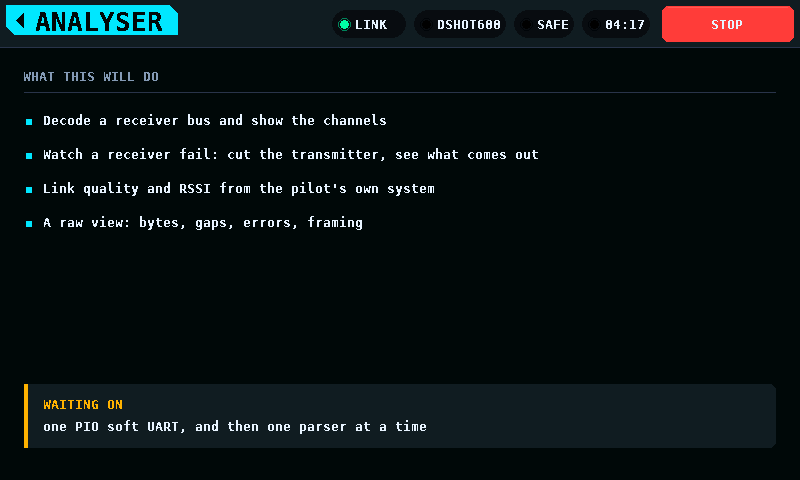

It is also the only arrangement that separates the two faults worth catching: a
glitch is a spike in one lane, a dropout is a notch across all sixteen at the
same instant.

The state block is the largest thing on that screen, and this is why:

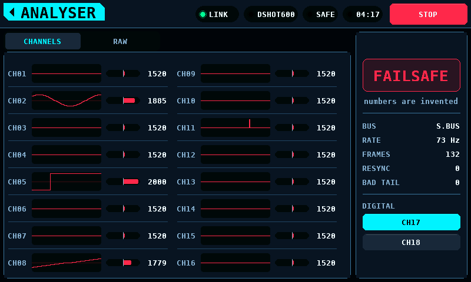

A receiver in failsafe sends sixteen perfectly well-formed channel values that
it was told to invent. Every trace and every bar turns red and the screen says
so in words, because a bench that draws invented numbers the same colour as
measured ones is helping somebody trust them. Four states, not two: silent,
failsafe, frame lost and live, each with a line saying what it means.

The programmer is not one programmer. BLHeli_S and AM32 speak a one-wire
bootloader at 19,200; ESCape32 answers a text CLI; VESC wants framed packets; a
Hitec D-series servo has its own thing entirely. They share a connector and
nothing else, so the protocol is chosen first and named out loud along with its
transport, rather than being guessed at from whatever answers.

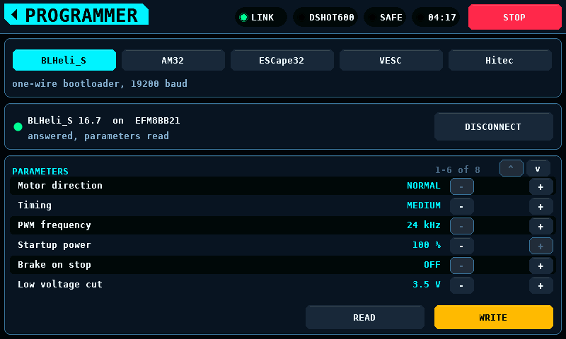

That costs a tap before every session and buys the thing a bench needs most: at
no point is there a screen full of parameters whose provenance is ambiguous.
You picked the protocol, these are its parameters, that is the device that
answered it. Changing protocol therefore drops the connection -- the device
that answered a bootloader is not the one that will answer a CLI, and showing
one identity above the other's parameters is the single lie this screen must
not tell.

Until something answers, there is nothing to show, and it says so:

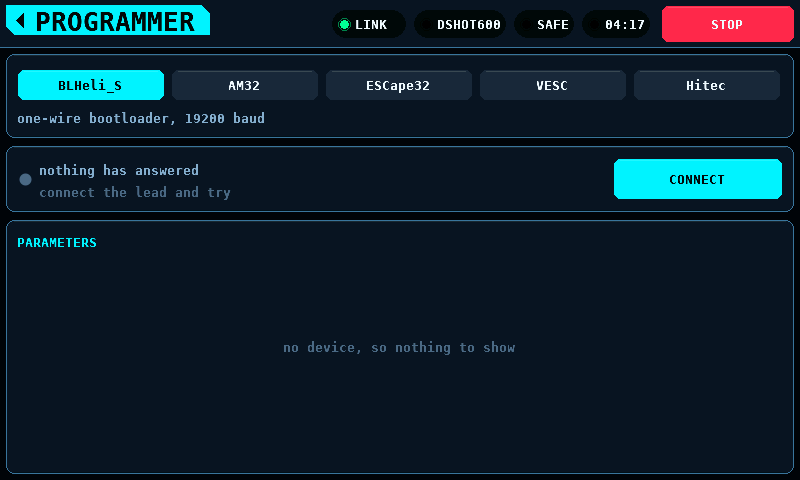

Steppers clamp rather than wrap. A parameter that rolls from its last value
round to its first will one day be set to the wrong end by somebody pressing
once more than they meant to, and on an ESC the wrong end is a direction.

The rest, each naming its own blocker:

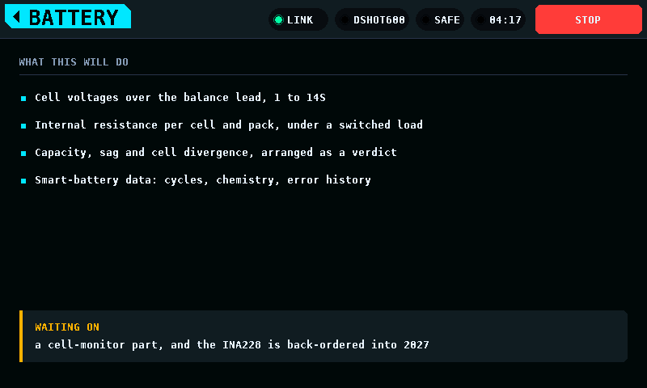
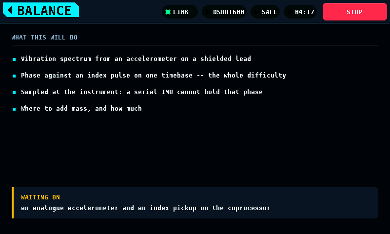

## When the numbers are not real

The bench is useful without hardware: a modelled pack, motor and propeller let
every screen be built, reviewed and demonstrated before the coprocessor exists.
The whole danger of that is a simulated reading being screenshotted, quoted or
remembered as a measured one, and no caption in a corner prevents it.


So it is written across the whole screen, corner to corner, at 15% — faint
enough to read straight through and impossible to crop out of a photograph.
The router draws it last, over the band and over any alert, and **no screen can
opt out**: every screen would find its own reason to think itself exempt.

It is sized by solving for the largest scale whose *rotated bounding box* fits
the canvas, not by a fraction of the diagonal — sizing against the diagonal
alone ignores the text's own height, which is what pushes the first and last
letters off the corners.

It costs about 1,650 cache-line fills a frame — 15,079 against 13,423 on the
bench screen — and both sides of that are inside the budget for one frame per
telemetry sample. See [Performance](Performance.md). It is only paid while the
numbers are fake.

## What a bench will look like

Numbers and controls stay put; the large area switches pane. Full-width
horizontal bands rather than columns, because that is what the frame budget
prefers:

```
├─ band ─────────────────────────────────────────────────────── 800,48 ┤
│ [PLOT] [TABLE] [TELEMETRY] [PROGRAMME]                               │
│ ┌rails┬ four traces, one time base, independent scales ────────────┐ │
│ └──────────────────────────────────────────── -24s … NOW ──────────┘ │
├─ 0,300 ────────────────────────────────────────────────────── 800,384┤
│  VOLT 20.71 V    CURR 32.5 A    PWR 673 W    RPM 11419    46 °C      │
│  pk 24.32        pk 68.1        pk 1151      pk 13581     184 mAh    │
├─ 0,384 ────────────────────────────────────────────────────── 800,480┤
│  THROTTLE ▓▓▓▓▓▓▓▓▓▌░░░░░░ 64.0 %   [-1][0][25][50][75][100][+1]     │
│  ARM                                                  RESET PEAKS    │
└──────────────────────────────────────────────────────────────────────┘
```

## Adding a screen

1. Add an id to `ui_screen_id_t`.
2. Write it: a `ui_screen_t` with whichever callbacks it needs, and a
   `..._invalidate()` for its per-framebuffer chrome cache.
3. Route it in `screen_for()` and invalidate it in `ui_router_invalidate()`.
4. Add a tile to `k_tiles` in `overview_screen.c`.
5. Add it to `SCREENS` in `tools/render_ui.py` and commit its screenshot.
6. List its source in `test/host/CMakeLists.txt` and in `TRACKED` in
   `tools/coverage.py`.

Steps 5 and 6 are the ones worth not skipping: the golden image is what notices
when a screen changes appearance, and the coverage check fails loudly if you
forget it, which is the point.
