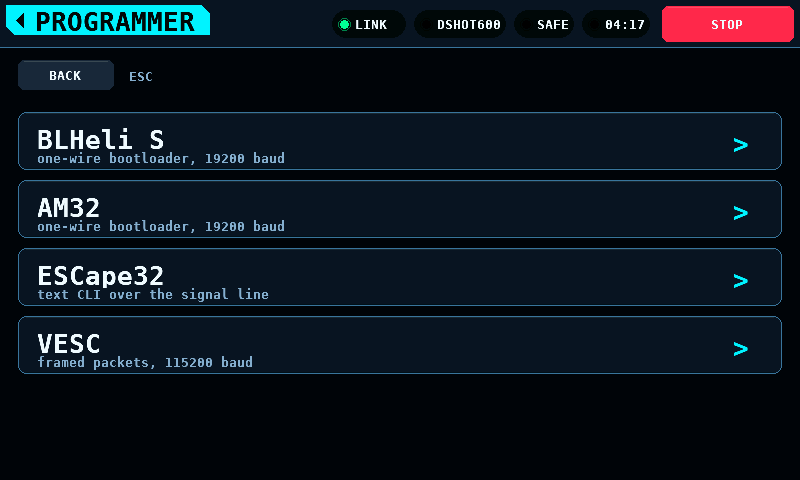
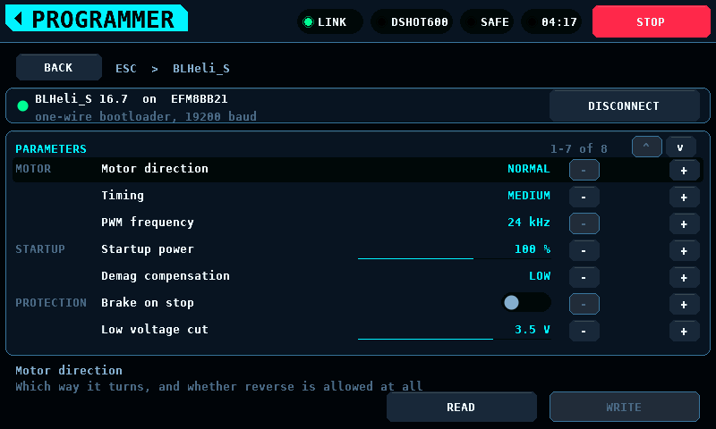
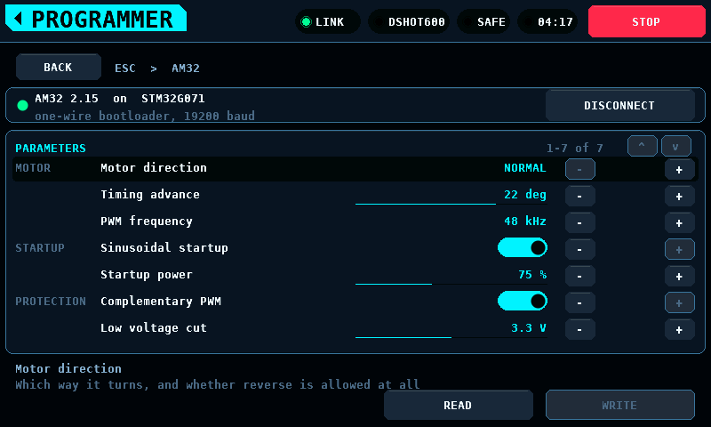
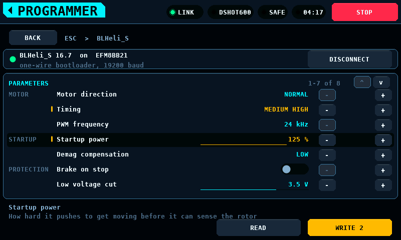
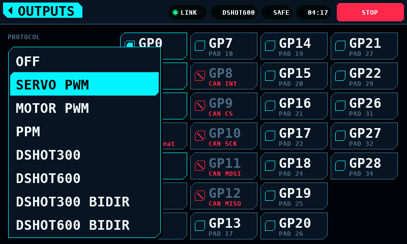

# Screens

**English** · [Deutsch](Screens-de.md)

What is on every screen, what the menu marks mean, and how each screen is
operated.

## The status band

The top band is shared by every screen. From the right: STOP, the run clock
(while armed or after a run), ARMED or SAFE, a FAULT code when one is reported,
the output mode (LINK or SIM), and LINK or NO LINK.

STOP works on every screen. It disarms and latches: the bench stays disarmed
until it is armed again. Navigating away, an alert expiring or the link
recovering does not clear a stop.

ARM is at the bottom of a bench screen; STOP is at the top of the band.

## Menu marks

| Mark | Meaning |
| --- | --- |
| SOON | the screen does not exist; the tile lists what it will do and what it waits on |
| MODELLED | the screen exists and works, but its hardware is not fitted; every value is simulated and the screen says so |
| none | the hardware is fitted and the readings are measured |

The mark is derived from the capability bits the coprocessor reports at
bring-up. A screen whose hardware is missing opens and runs from the model.

The menu in the light theme:

## Splash

Each subsystem reports its result as it comes up: board, display, touch, SD
card, settings, link, coprocessor. The board line carries the panel's own
firmware version, and the coprocessor line carries the protocol version and
the firmware version that coprocessor reported -- two boards can speak the
same protocol and be different builds, and this is where that shows. A missing card or an unusable NVS
(non-volatile storage) is a warning. A touch
controller that does not answer, or a coprocessor with a different protocol
major version, is a failure and the bench will not arm. When every step has
answered, the splash hands over to the menu after a hold of 1.6 s; a tap skips
the hold.

## Motor & ESC

Two columns. The plot and the throttle take the left, the four readouts and
the controls take a rail on the right, so reading the numbers and working the
throttle do not compete for the same part of the screen.

The strip above both columns carries the poll rate, the link's error count
(cyclic redundancy check failures and resyncs added together) and three
temperatures. ESC and MOT come from the bench page. MCU is the panel's own
die, read from the ESP32-S3's sensor: it is the display board's temperature,
not the coprocessor's.

The throttle moves by how far a finger travels, not to where it lands. A press
on the track commands nothing, so a touch at the far end cannot ask for full
travel in one contact. `-1` and `+1` at the ends of the track step one
percentage point.

ARM is a hold. The fill fades from green to the danger red across two
seconds, and the bench arms when the fade completes; letting go before then
arms nothing, and the release itself arms nothing either. Arming flashes the
whole button twice: white, black, red, and again, one drawn frame each. An
armed bench carries the danger red, and DISARM is a press rather than a hold:
stopping never needs a hold. DISARM and STOP stop the output immediately, with
no ramp. RESET PEAKS clears the peak markers and leaves the live readings.

### EFF is a guessimetric

The telemetry panel's header shows the rated kV, the revolutions per minute
per volt the motor is actually turning, and EFF, the second divided by the
first.

The arithmetic behind it is sound. Terminal voltage divides into the resistive
drop and the back electromotive force (back-EMF), so rpm/V under load is the
rated kV scaled by the fraction of the voltage that reaches the back-EMF, and
that fraction is the fraction of the input power that becomes mechanical. In
an ideal motor the ratio is the conversion efficiency exactly.

The number on the screen is not that, for three reasons, and it is labelled
EFF rather than efficiency because of them:

- It accounts for copper loss (I squared R) only. Iron loss, friction and
  windage fall on the mechanical side of the split, so the figure is an upper
  bound on shaft efficiency rather than a value of it.
- The bench measures pack voltage, not the motor's terminals, so the ESC's
  conduction and switching losses are inside the figure. It describes the
  drivetrain, and comparing it against a motor datasheet compares two
  different things.
- It is only as good as the rated kV. An error there maps straight into the
  percentage, and a figure above 100 % means the rated value is wrong; the
  screen shows that rather than hiding it, capped at 199 %.

The rated kV comes from the connected ESC when it reports one. No ESC reports
it yet, so in practice it is the `Rated kV` setting, which defaults to zero: a
guessed kV produces a plausible-looking percentage that is wrong, so with no
value the field is drawn empty and no percentage is shown. The measured rpm/V
is shown either way, being a measurement rather than an inference.

While the values are simulated, SIMULATION is drawn across the screen. The
panel simulates only while no coprocessor answers, so the watermark goes when
one does. What replaces it is what that coprocessor can actually measure: rpm
from bidirectional DShot today, and its own sensors when a measurement front
end is fitted. A quantity nothing measures is drawn as an empty field rather
than as a modelled number.

## Servo

Drag anywhere on the sweep to command a position. The solid arm is the measured
position; the faint arm is the commanded position. The gap between them is the
servo's own lag. The rings around the tip pulse while the servo is being
driven. Releasing the sweep clears the output slot.

## Analyser

Sixteen channels, each with 1.5 s of history and a bar for its current value.
CH17 and CH18 are the two digital channels. A glitch is a spike in one lane; a
dropout is a notch across all sixteen at the same instant.

The state block shows one of SILENT, FAILSAFE, FRAME LOST and LIVE, with one
line of explanation:

In FAILSAFE the receiver is sending well-formed values it has generated itself;
every trace is drawn red. Treat FAILSAFE as a stop, not as sixteen valid
channels. [Receiver buses](Receivers.md) describes the states.

## Programmer

The sequence is: device class, protocol, connect.

Every protocol row names its transport. There is no autodetection:

BLHeli_32 is not in the ESC list. The bench identifies and drives these ESCs
and sends the DShot special commands, but cannot read their parameters:
[BLHeli_32 parameters](BLHeli32.md).

Nothing is editable until a device has answered:

After a device answers, the parameters are shown in groups with the selected
row's help under the list:

Each firmware shows its settings in its own units. BLHeli_S shows timing as
named steps; the others show degrees of advance:

A changed value is not written until WRITE is pressed. Staged changes carry a
mark and their own colour, and the WRITE button shows how many are staged:

Steppers stop at the ends of a list; they do not wrap.

Going back one level drops the connection. Back climbs one level at a time; the
band's home tag leaves the screen.

## Battery

Cells are drawn as their departure from the pack's mean. The verdict follows
the spread, the widest gap between any two cells: HEALTHY below 30 mV, WATCH
from 30 mV, REPLACE from 60 mV. The scale follows the pack down to a floor of
12 mV and is printed beside the plot.

Measure under load. At rest a weak cell reads like the others.

## Logs

Browse the card, open a file, check what the import detected, then plot:

The CSV (comma-separated values) reader accepts decimal comma and decimal
point, a units row and ragged rows; the import view shows what it decided
before the file is plotted. Runs recorded by the bench are written as
`BENCHnnn.CSV` in the card's root directory.

## Setup

Settings are behind the SETUP tile, in both themes:

## Outputs

Behind the OUTPUTS key on the Setup screen. A protocol, and the pins it
drives.

One protocol at a time, not eight independent slots: a bench is wired one
protocol at a time, and asking for the protocol once and then for the pins is
the shape of that job. Each ticked pin becomes one slot on the [OUTPUTS
page](Link.md#page-map), in pin order, taking channels from zero upward — so
the lowest ticked pin is channel 0 whatever order the screen was touched in.

The protocol is a list rather than a stepper, because there are seven of them
and stepping past six to reach the seventh is not choosing:

Reserved pins are shown and cannot be ticked. GP3 carries the safety heartbeat
and GP8 to GP12 are the CAN (Controller Area Network) controller, and each
says so under its name. Hiding them would leave an operator hunting for GP10
and finding a gap. [DShot and the output drivers](DShot.md#which-pin) has the
whole map.

The pad number under each pin is the one printed on the board, so an operator
counting pads and an operator reading GPIO (general-purpose input/output)
numbers arrive at the same pin.

Changing anything writes the pages at once. There is no APPLY key: a screen
holding a choice that has not been sent is a screen that disagrees with the
bench, with nothing to say which of the two is driving. What became of the
write is under the protocol — WRITTEN, NO LINK, or REFUSED.

Switching protocol drops the pins that no longer fit rather than refusing the
switch. Choosing PPM with four pins ticked keeps the first, because the
protocol is what was asked for and the pins are the part that has to give.

### The coprocessor keeps it, not the panel

A binding describes wiring, and the panel is not the board the wires are in.
The coprocessor writes the OUTPUTS and CHAN_CFG pages to its own flash and
restores them at boot; the panel never stores a binding and never sends one
unasked. When the link comes up the panel reads the page and shows what is
configured over there. After a panel restart, what this screen shows and what
is driving pins are the same thing.

Restoring configures the outputs. It does not drive them: every driver is
gated on the bench being armed, the heartbeat being trusted and a command
arriving, so a restored binding claims its pins and holds them at idle until
somebody arms. Channel commands are not restored — a configuration survives a
power cycle and a throttle position does not.

The save waits for the bench to stop driving. Writing flash stops the
coprocessor for tens of milliseconds with interrupts off, which is longer than
the heartbeat's window, so a change made while something is being driven is
written once it stops.

A page the screen cannot describe — two protocols at once, a rate no entry
offers, a pin that is not on the header — reads back as nothing configured
rather than as a selection that disagrees with the page it came from.

## Balancing

Described on its own page: [Balancing](Balance.md).

## Screens that are not ready

A tile marked SOON names what the screen will do and the part or decision it
waits on.
