# Screens

<sub>**English** · [Deutsch](Screens-de.md)</sub>

What is on every screen, what the menu marks mean, and how each screen is
operated.

## The status band

The top band is shared by every screen. From the right: STOP, the run clock
(while armed or after a run), ARMED or SAFE, a FAULT code when one is reported,
the mode, and LINK or NO LINK. The mode is BENCH while the link is up and the
panel drives the coprocessor's outputs, and SIM while no coprocessor answers
and the panel runs on its own models.

STOP works on every screen. It disarms and latches: the bench stays disarmed
until it is armed again. Navigating away, an alert expiring or the link
recovering does not clear a stop.

ARM is at the bottom of a bench screen; STOP is at the top of the band.

A touch belongs to what it came down on until it lifts. The band is the top
48 px of the panel.

- A touch that comes down on the band stays the band's. Sliding it down into
  the screen moves nothing there, and lifting it there presses nothing.
- A touch that comes down on the screen and slides up into the band is
  released at the last point it had on the screen. A drag on a slider or on
  the SERVO dial ends with the value it had at that point, and the distance
  travelled on the band is not added. A hold on ARM or OUTPUT ON is abandoned.
  A button acts as for a finger lifted at that point: one the finger had
  left asks for nothing. The touch is not picked up again when the finger
  comes back down onto the screen; lift and press again.
- STOP and the home tag answer to a press that lands on them. A finger that
  slides onto STOP from the screen stops nothing.
- A second finger on STOP, on the home tag or on the alert band is answered
  while the first finger drags. After the home tag, the finger still on the
  glass moves nothing on the overview.

## The alert band

A fault the screen itself does not show appears in a red band, 34 px high,
across the bottom of every screen that has the status band. It covers the
bottom of the screen, ARM included, while it shows.

- It clears 30 s after the frame it arrived in. A new alert, even with the
  same text, starts the 30 s again.
- A tap on the band clears it earlier: press and lift on the band, marked
  with an `x` at its right end. The screen beneath receives neither that tap
  nor a second finger's on the band; only the first finger's lift clears.
- An alert that arrives while a finger is on the band is not cleared by
  that lift.
- "touch did not answer -- the bench will not arm", shown at start, stays
  until restart and has no `x`: no touch is there to tap with. A later alert
  shows over it; once that one clears, it shows again.

## Menu marks


| Mark | Meaning |
| --- | --- |
| SOON | the screen does not exist; the tile lists what it will do and what it waits on |
| MODELLED | the screen exists and works, but its hardware is not fitted; every value is simulated and the screen says so |
| none | the hardware is fitted and the readings are measured |

The mark is derived from the capability bits the coprocessor reports at
bring-up. A screen whose hardware is missing opens and runs from the model.
SUPPLY is marked MODELLED while the PD mini is disabled on SETUP under
INTERFACES, whatever the coprocessor reports: the panel then runs its own
model of a supply.

The menu in the light theme:


## Splash


Each subsystem reports its result as it comes up: board, display, touch, SD
card, settings, link, coprocessor. The board line carries the panel's own
firmware version, and the coprocessor line carries the protocol version and
the firmware version that the coprocessor reported -- two boards can speak
the same protocol and be different builds, and this is where that shows.

A missing card or an unusable NVS (non-volatile storage) is a warning. A
touch controller that does not answer, or a coprocessor with a different
protocol major version, is a failure and the bench will not arm.

When every step has answered, the splash hands over to the menu after a hold
of 1.6 s; a tap skips the hold.

## Motor & ESC


Two columns. The plot and the throttle take the left, the four readouts and
the controls take a rail on the right, so reading the numbers and working the
throttle do not compete for the same part of the screen. With the rotary knob
on, turning it moves the throttle ([the knob](#application-the-rotary-knob)).
### The plot covers one run


The trace is the record of a run. It advances only while the bench is armed:
arming clears it, disarming holds it as it stood. The panel tag reads
`LIVE TELEMETRY` while it advances, `TELEMETRY HELD` while it holds a run, and
`TELEMETRY IDLE` before the first arm, when the plot reads `no run recorded`.
The right-hand axis label reads `NOW` while it advances and `END` where a held
one stopped. The readouts, the TABLE pane, the totals and the temperature
strip are live at all times, armed or not.

The window is 534 columns at 20 samples per second, 26.7 s. A longer run holds
its last 26.7 s; what came before is in the CSV file and not on the screen.

The trace ends at the disarm, not when the motor stops. Disarming commands
zero throttle and the propeller coasts down after it. That coast-down is on
the readouts and not on the plot, and not in the CSV file either, which closes
on the same edge.

Arming clears the plot, and a latched stop is cleared by arming, so the trace
of a run a STOP ended does not survive making the bench usable again. One
arming writes one CSV file, and the log viewer plots it.


The strip above both columns carries the poll rate, the link's error count
(cyclic redundancy check failures and resyncs added together) and three
temperatures. ESC and MOT come from the bench page. MCU is the panel's own
die, read from the ESP32-S3's sensor: it is the display board's temperature,
not the coprocessor's.

The throttle moves by how far a finger travels, not to where it lands. A press
on the track commands nothing, so a touch at the far end asks for nothing; a
drag across the whole track asks for the whole span, and the pin follows it
unramped. `-1` and `+1` at the ends of the track step one percentage point.

The throttle changes only on an armed bench. What each control does:

| Control | Not armed | Armed |
| --- | --- | --- |
| The track | refused: no command, the slider and the readout stay; drawn dimmed | moves the throttle by the finger's travel |
| `-1`, `+1` | refused; drawn dimmed | step one percentage point |
| Rotary knob | refused; the turn is not kept | moves the throttle from its value |
| ARM | arms after its 2 s hold | disarms on a tap |
| RESET PEAKS | resets the peaks | resets the peaks |
| PLOT, TABLE | switch the pane | switch the pane |

Not armed, the line under the track reads `ARM FIRST`. The bench is not armed
from the disarm until it reports armed: a control touched after the ARM hold
completes and before that report is refused as well. Behind a DISARM the
screen has posted and the panel has not sent, the controls are refused too.

A disarm returns the throttle to 0 %, however it happens: the DISARM tap,
STOP, a lost link, a touch controller that stops answering, or leaving the
screen. The slider, the readout and the `-1` and `+1` steps then stay at
0.0 % until the next arm, so the first `+1` after an arm asks for 1.0 % and
the first 1 % turn of the knob asks for 1.0 %. A bench armed without the ARM
hold, by a stick run on PROGRAMMER, starts from 0 % as well. A throttle the
screen has posted and the panel has not sent when the bench disarms is not
sent. A finger on the track when the bench arms or disarms moves nothing
until it lifts and presses again.

ARM is a hold. The fill fades from green to the danger red across two
seconds, and the bench arms when the fade completes; letting go before then
arms nothing, and the release itself arms nothing either.

The finger has to stay on the button. One that leaves it abandons the hold,
because the gesture is contact with the control and not with the panel.
Coming back is not resuming: the contact is finished as far as ARM is
concerned, so arming after that takes lifting the finger and pressing again.
A bench that disarms under a finger still held on the button ends the gesture
too — otherwise the contact made to stop it would arm it again two seconds
later. Arming flashes the
whole button twice: white, black, red, and again, one drawn frame each. An
armed bench carries the danger red, and DISARM is a press rather than a hold:
stopping never needs a hold. DISARM and STOP stop the output immediately, with
no ramp. RESET PEAKS clears the peak markers and leaves the live readings.

### EFF is a guessimetric

The telemetry panel's header shows the rated kV, the revolutions per minute
per volt the motor is actually turning, and EFF, the second divided by the
first.

The arithmetic behind it is sound. Terminal voltage divides into the resistive
drop and the back electromotive force (back-EMF), so rpm/V under load is the
rated kV scaled by the fraction of the voltage that reaches the back-EMF, and
that fraction is the fraction of the input power that becomes mechanical. In
an ideal motor the ratio is the conversion efficiency exactly.

The number on the screen is not that, for three reasons, and it is labelled
EFF rather than efficiency because of them:

- It accounts for copper loss (I squared R) only. Iron loss, friction and
  windage fall on the mechanical side of the split, so the figure is an upper
  bound on shaft efficiency rather than a value of it.
- The bench measures pack voltage, not the motor's terminals, so the ESC's
  conduction and switching losses are inside the figure. It describes the
  drivetrain, and comparing it against a motor datasheet compares two
  different things.
- It is only as good as the rated kV. An error there maps straight into the
  percentage, and a figure above 100 % means the rated value is wrong; the
  screen shows that rather than hiding it, capped at 199 %.

The rated kV comes from the connected ESC when it reports one. No ESC reports
it yet, so in practice it is the `Rated kV` setting, which defaults to zero: a
guessed kV produces a plausible-looking percentage that is wrong, so with no
value the field is drawn empty and no percentage is shown. The measured rpm/V
is shown either way, being a measurement rather than an inference.

While the values are simulated, SIMULATION is drawn across the screen. The
panel simulates only while no coprocessor answers, so the watermark goes when
one does. What replaces it is what that coprocessor can actually measure: rpm
from bidirectional DShot today, and its own sensors when a measurement front
end is fitted. A quantity nothing measures is drawn as an empty field rather
than as a modelled number.

### TABLE, and what the ESC says

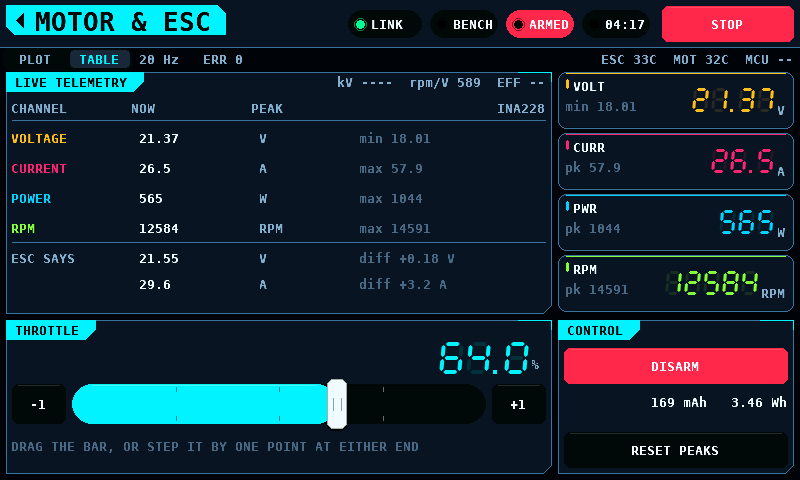

TABLE lists the four channels, each with its extreme. A channel nothing
answered for reads `--`.

With the INA228 enabled on SETUP under INTERFACES and answering (BENCH flag
bit 5), voltage, current and power are the INA228's: the means of the
coprocessor's last 50 ms window, read at 20 Hz, with the run's peaks from its
500 Hz samples. The heading names the source, `INA228`, and adds `CLIPPED`
while a current read the end of the part's range in the last window or since
the arm: current and power, or their peaks, are then bounds and not values.
Under the channels, `ESC SAYS` lists the ESC's own telemetry voltage and
current from the SENSE page, and `diff` is the ESC's figure less the
INA228's. An ESC that reports a current it does not measure shows a
difference the size of the reading. An INA228 that stops answering during a
run leaves voltage, current and power empty to the end of that run; they do
not fall back to the ESC's figures. The peaks it measured in that run stay
shown, here and on the rail. Without the INA228, the channels are the
ESC's telemetry and `ESC SAYS` is not shown.

The mAh and Wh under ARM are the INA228's own while BENCH flag bit 6 is
set: its charge and energy since the arm, accumulated in the part at every
conversion and read in 0.01 mAh and 0.01 Wh steps. The coprocessor takes
the last run's totals and bit 6 off the bench page on the arm, and the panel
counts the first 100 ms of a run itself as well, so a page built before the
arm cannot carry the last run's totals into this one. Without bit 6 the panel counts both from the current
and power shown. When the INA228 stops
answering mid-run, the count carries on from its last total and does not go
back.

A run's CSV file has one row for every sample the panel takes, and no row
without one:

- With the link up a sample is one answered read of the BENCH page. The
  panel polls every 50 ms plus the 5 ms pass of its control task that looks
  at the gate and the pass's own exchanges: 52.9 ms on average on one bench,
  about 19 rows per second. Other benches are not measured.
- With the link down a sample is one step of the model, every 50 ms.
- Nothing else gates a row. A row the card's queue cannot take is dropped
  and counted, and the band says so at the run's end (see [Logs](#logs)).

`time` is the wall time since the arm in seconds, written to 1 ms, and is
not a row count: the first row is not at 0, and a stretch without samples or
with dropped rows is a step in `time` of that length. The value keeps 1 ms
of resolution for the first 4.5 h of a run and 2 ms up to 9.1 h.

A file written by firmware 0.15.0 or older differs in two ways. Rows are
missing in stretches of up to 30 s after a servo command, and
`time` advances only with a written row, so it ends short of the run's
length and shows no gap. In such a file the `window` numbers, 50 ms apart,
give the spacing of the rows while the INA3221 is enabled.


```
time (s);voltage (V);current (A);power (W);rpm (rpm);esc (C);motor (C);charge (mAh);energy (Wh);ina voltage (V);ina current (A);esc current (A);window;ch1 current (A);ch1 max (A);ch1 voltage (V);ch2 current (A);ch2 max (A);ch2 voltage (V);ch3 current (A);ch3 max (A);ch3 voltage (V)
```

`voltage`, `current` and `power` are what the screen shows. `ina voltage` and
`ina current` are the INA228's and are empty while it is not the source;
`esc current` is the ESC's own telemetry current, from the SENSE page while
the INA228 is the source and from the BENCH page otherwise, and empty when
the ESC reports none or the panel models the bench. A quantity nothing
measured is an empty cell. `window` and the nine channel columns are the
INA3221's 50 ms window -- per channel the mean and highest current and the
lowest bus voltage -- on the first row after the panel read it and on no
other, so each window is in the file once, under its number; a channel the
window has no readings of is empty. The log viewer groups `ina voltage`,
`ina current` and `esc current` under INA228 and ESC, and the window's
columns under INA3221.

## Servo


On an armed bench, drag anywhere on the sweep to command a position. The solid arm is the measured
position; the faint arm is the commanded position. The gap between them is the
servo's own lag. The rings around the tip pulse while the servo is being
driven. Lifting the finger does not let go: the screen keeps saying the last
position every SERVO_HOLD_MS, so a servo stays where it was put. **RELEASE**,
the button, is what returns the surfaces to centre -- and even that leaves the
pins bound and driving, at the middle of their travel. A disarm, or leaving
the screen, which disarms, is what stops the edges. With the rotary knob on,
turning it moves the horn from where it is ([the knob](#application-the-rotary-knob)).

One finger drags the dial. A press by a second finger anywhere on the screen
ends the drag, as it ends a drag on SPEED: the horn stays where it was
commanded, and the dial follows again after a new press on it.

The screen drives the channels the binding marks as surfaces, not a fixed pin
and not a fixed protocol. PPM's eight channels are surfaces too, so a bound
PPM output moves with this screen exactly as a bound SERVO PWM one does. With
no surface channel bound at all it commands nothing and no pin moves.

SPEED is the rate the bench may move the output, in degrees a second of the
horn's travel, not a speed for the drawing alone. At 100% the command goes
straight through and the servo moves at its own rate; below that the bench
ramps the command in front of it, so 30% takes three times as long to cross
as 90%. It applies to a held output as soon as it is changed. Without
feedback the horn is drawn moving at the same rate, and at 100% at the
command at once.

**ARM before anything moves.** While the bench is not armed the coprocessor
writes a pulse of length zero to every PWM pin, and the screen takes no
position: the commanded value changes only while the servo follows it. The
button is a two-second hold, the same
gesture and the same fade as the one on MOTOR & ESC, and a press on it while
armed disarms. Leaving the screen disarms and lets go of the pin: a screen
that is not visible must not be holding a servo somewhere, or leaving the
bench armed behind it.

What each control does on a disarmed bench:

| Control | Disarmed | Armed |
| --- | --- | --- |
| The dial | refused: no command, the horn and COMMANDED stay | commands the position under the finger |
| Rotary knob | refused; the turn is not kept | moves the horn from the commanded value |
| CENTRE | refused; drawn dimmed | commands PULSE CENTRE plus TRIM |
| SWEEP, PAUSE, PAUSED | refused; drawn dimmed | starts, pauses and resumes the sweep |
| RELEASE | sends the release; the value shown stays | centres the surfaces; the value shown becomes the rest |
| SPEED | set; sends nothing | set; a held position is sent again at the new rate |
| SETTINGS: TYPE, FRAME RATE, PULSE MIN, CENTRE and MAX, TRIM, TRAVEL, REVERSE | set; send nothing | set; a held position or the rest is sent again under them |
| SET, OUTPUT ON, OUTPUT OFF | as on SUPPLY | as on SUPPLY |
| START TEST | refused: `ARM FIRST` | starts the run after its hold |

Disarmed, the horn is drawn dimmed and the left card reads `ARM FIRST`. The
horn and COMMANDED show the position last driven; after a restart, PULSE
CENTRE. A pulse-width setting changed while disarmed changes the
microseconds COMMANDED shows for that angle, and TRAVEL does not clamp it.

When the bench arms, the commanded value becomes the rest the pins drive:
the midpoint of the channel's endpoints, 1500 us for STANDARD PWM and 760 us
for NARROW 760, without TRIM. Without feedback the horn is drawn there at
once. The first drag or knob turn after an arm starts from that value,
whatever the screen showed before; a 1 % turn of the knob on STANDARD PWM
asks for 1510 us. A type or pulse width changed on an armed bench before the
first position moves the rest, and the value with it.

A finger on the dial when the bench arms, disarms or stops moves nothing
until it lifts and presses again. A position, a sweep or a pause the screen
has posted and the panel has not sent when the bench disarms or stops is not
sent, and a knob turn in that state is withdrawn: the value returns to the
one before the turn.

RELEASE on an armed bench is the arm's rule again. The pins go to the rest,
and the commanded value becomes that rest: 1500 us for STANDARD PWM, 760 us
for NARROW 760, without TRIM. The horn is drawn moving there at SPEED. A
drag under way ends. A press on the dial drives the servo again, and the
first knob turn counts from the rest: a 1 % turn on STANDARD PWM asks for
1510 us. The same holds for the release a run of the automatic test ends
with, and for the one a changed type or pulse width sends on a resting
bench. One command waits for each frame: of a position and a RELEASE made in
the same frame the later is sent, and the value shown is that one's. A knob
turn in a frame in which RELEASE waits is dropped.

The right card shows what is commanded and measured, the type and frame rate
in force -- in the danger colour while they are ones that can destroy a servo
not made for them -- and the supply that feeds the servo: its voltage, current
and power, read and plotted over the last 13 s. Without a supply sample the
readings are `--`.

MEASURED is the horn's angle from the centre count while AS5600 is on in
SETUP, INTERFACES, the sensor answers and it detects its magnet: `+38.0 deg`,
tenths of a degree, -180.0 to +179.9, read 20 times a second. It is `---`
while the sensor does not answer and while it reports no magnet (STATUS MD
clear): its count is no angle then. A magnet reported too weak or too strong
leaves the angle on show; the band says which. Where AS5600 is off the row
shows the feedback's angle. The commanded position beside it is the
pulse width in microseconds.

**The supply is set and switched here too.** The SET line under the plot
holds SUPPLY's two set points, the voltage and the current limit, and its
output switch. They are SUPPLY's, not a copy: a change on either screen is
the change on both.

- A tap on a set point opens the keypad over the left card. A value outside
  the caps is brought inside them, as on SUPPLY.
- While the output is on, a typed set point waits for SUPPLY's question,
  OUTPUT IS ON, with APPLY and CANCEL, unless SUPPLY's SETTINGS, CONFIRM
  WHILE ON, KEYPAD is off. The question goes, unanswered, when the output
  goes off or on STOP. An APPLY tapped in the same frame as STOP applies
  nothing, though the supply reports the output off a sample later.
- A voltage raised from 6.0 V or below to above it opens the warning HV
  SERVOS ONLY: standard servos are rated for 4.8 to 6.0 V, and above that
  only a servo specified as HV (high voltage) is within its rating; a
  standard servo above it can be destroyed immediately. The
  voltage is applied after HOLD TO APPLY is held for 2 s, the gesture of the
  profile warning; CANCEL drops it. STOP ends the hold. With the output on it replaces SUPPLY's
  question, and it stays if the output goes off. A voltage already above
  6.0 V changes without it. A voltage set on SUPPLY does not open it.

  

- OUTPUT ON is a two-second hold, OUTPUT OFF a tap, as on SUPPLY. STOP ends
  a hold under way. With a voltage set point above 6.0 V, wherever it was
  set, OUTPUT ON opens HV SERVOS ONLY instead, naming the voltage, and the
  output comes on only after HOLD TO APPLY is held for 2 s; the switch's own
  hold and a tap on APPLY switch nothing on. A set point that rises above
  6.0 V during the ordinary hold -- on SUPPLY, or put back after a run --
  is seen as the hold completes: HV SERVOS ONLY opens and nothing comes on.
  Leaving SERVO leaves the output as it is; a press on
  OUTPUT OFF as the screen is left is sent as the OFF it was.

**SWEEP drives the servo through a curve** on the coprocessor, where its
timing does not depend on the link: the TEST page's CURVE (square, sine or
triangle), SPEED (0.05 to 5 cycles a second) and DWELL (the hold at each
end), about PULSE CENTRE. RANGE is a share of the travel the servo may make:
of TRAVEL, and of the nearer of PULSE MIN and MAX, so the sweep reaches
neither end it may not. SPEED on the right card limits it as it limits a
drag, and trim is not applied. The horn follows the same curve, computed on
the panel and timed from when the coprocessor started its own. The panel
draws only what the coprocessor is known to do: a sweep asked for, or
resumed, is drawn once its start is acknowledged, and until then the horn
stays where the output is. Without feedback it is then worked on from where
the output was when the coprocessor began, along the curve at SPEED. Two
taps on the sweep button that reach the screen in one frame, before the
first one's command has left, cancel out: nothing is sent and the sweep
goes on as it was.

**PAUSE pauses it.** While a sweep runs the button reads PAUSE in the accent
colour. A tap stops the sweep where the output has got to -- which SPEED can
leave behind the curve -- and holds it there; the button then reads PAUSED,
filled in the warning colour. The coprocessor does the holding (the link's
HOLD, SWEEP register 4), because only it knows exactly where that is;
without feedback the horn drawn on the panel is an estimate of it. The panel
repeats the hold every 100 ms (`SERVO_HOLD_MS`), so a pause outlasts the
coprocessor's 500 ms rule. A pause does not wait behind sweep writes already
on the wire. A tap on PAUSED carries the sweep on from the point of the
curve it was paused at: its place in a dwell and the ends it has reached go
on from there too, and the horn is drawn on from that phase. The phase is
the curve's when the coprocessor acknowledged the HOLD, not at the tap: the
curve runs on there for the exchange in between, and so the drawing runs
on too, at the SPEED in force at the tap, for at most 500 ms -- the longest
the coprocessor runs a sweep it has not heard. Without feedback the drawn
horn is then put where the output had got at the acknowledgement: the curve
to that phase, slewed as the drawing slews. A SPEED changed in between reaches the
coprocessor only with the resume. A tap on PAUSED leaves the horn where it
is until the resume is acknowledged; the panel then times the drawing from
the phase the coprocessor kept, as it timed the two acknowledgements, also
when the tap came before the HOLD's acknowledgement; that acknowledgement,
arriving after the tap, still moves the horn to where the coprocessor held
the output, and the resume goes on from there. The coprocessor
keeps the phase while it holds and resumes the curve (`LINK_SV_RESUME`,
protocol 4.6); the output slews from where it was held to the curve at
SPEED's rate, at once at 100 %, and is normally already there. A curve
changed on the TEST page while paused starts as a new sweep instead. A
coprocessor older than 4.6, or one that refuses the resume because its hold
has ended, starts the curve over from its beginning -- the centre for a
sine or a triangle, the first end for a square -- and the alert band says
so: `coprocessor older than 4.6 -- the sweep starts over` or `coprocessor
refused the resume -- the sweep starts over`. So does PAUSED tapped while
the HOLD has gone unanswered, since the coprocessor may then be holding or
still running: `the pause went unanswered -- the sweep starts over`. A
PAUSED tapped before a HOLD that the panel then lets go of (below) starts
nothing: the pause ends with that HOLD.

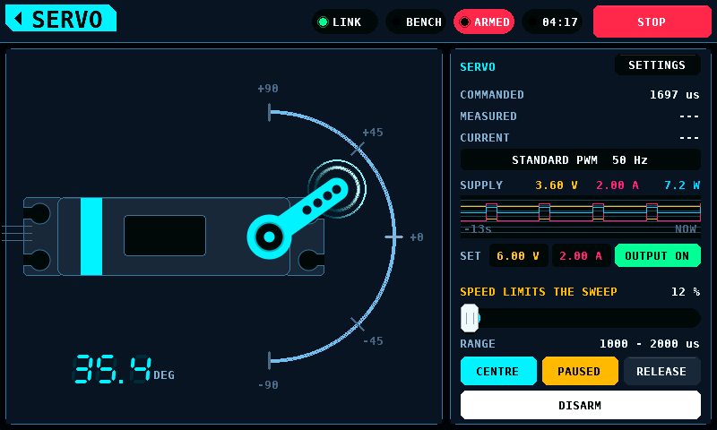

A hold the link left unrepeated for 500 ms has been let go at the far end,
so the panel releases the surfaces to their centre and the horn goes there.
So does a HOLD answered only at a retry, or after longer than 500 ms: the
coprocessor may have let it go and held again elsewhere, so where it holds
is not known on the panel, and the pause ends rather than keep an angle a
later change of profile would send to the servo. The link going ends a
sweep or a pause too, and the horn is drawn at rest, as the coprocessor
rests the surfaces 500 ms after the last write it heard; no sweep or hold
asked for before is sent when the link comes back, and the next tap starts
a sweep.
A finger on the dial, CENTRE, RELEASE, STOP, a disarm and leaving the screen
end a sweep, running or paused, and the button reads SWEEP again. A changed
type, frame rate, pulse, trim, travel or reverse ends a pause too, and the
servo is held at the paused angle as a position. With feedback the paused
angle is the one the servo last reported, which it can still be moving to
after the tap; without feedback it is the drawn estimate at the
acknowledgement. A changed SPEED keeps the
pause; the resume runs at the new SPEED. Touch events going missing pause a
running sweep as PAUSE would. A changed setting starts a running sweep over
with the new curve, drawn from when the coprocessor acknowledges it; until
then the old curve is drawn on, as the coprocessor runs it, under the
pulses and TRAVEL it was sent with. Each acknowledgement is matched to the
command it answers: a SPEED or curve changed while a start waits does not
let the earlier command's acknowledgement draw the newer one. A changed
profile or frame rate goes with it at once. SWEEP is offered on an armed
bench, with a surface bound and the link up, and a coprocessor speaking
protocol 4.2;
greyed otherwise; the coprocessor stops a sweep the panel has not
repeated for 500 ms and leaves each surface where its output has got to.

**SPEED LIMITS THE SWEEP** replaces SPEED's label on the right card, in the
warning colour, while SPEED is slower than the fastest change the curve asks
for. SPEED then shapes the motion instead of CURVE: a square, a sine and a
triangle all move as ramps at SPEED's rate and look alike, and the output
can turn back before it reaches an end. The line follows the settings, so it
shows before SWEEP is pressed as well as while a sweep runs. Raise SPEED, or
lower the TEST page's SPEED (the rate in Hz) or RANGE, to clear it. A square
jumps between its ends, so it shows at every SPEED below 100 %. With the
TEST page's defaults (sine, 0.5 Hz, RANGE 80 %) and TRAVEL +/-90 deg it
clears at SPEED 63 %, and for a triangle at 40 %.
[Servo procedures](Servo.md#sweep-and-speed) gives the rule.

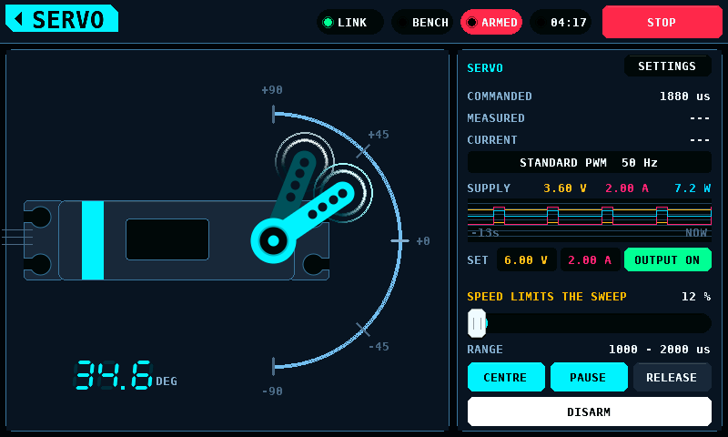

**START TEST runs the automatic test** on the TEST page: the servo stepped
through the supply voltages chosen there, its current measured at rest,
moving and holding, its travel timed, and the voltage at which it stops
moving. [Servo procedures](Servo.md#automatic-test) gives the method and the
files. START TEST needs an armed bench and a supply that answers; the line
under it says ARM FIRST, NO STEP CHOSEN, SUPPLY NOT ANSWERING, RANGE TOO
SMALL (the ends RANGE and TRAVEL give land on PULSE CENTRE), A STEP IS
OUTSIDE THE CAPS (a chosen step above the voltage cap in force, checked
before any warning opens) or LAST REPORT STILL WRITING, and follows the
bench and the settings as they change.
It is a two-second hold,
the gesture OUTPUT ON uses, because a run switches the supply on and moves
the servo. With HV SERVO on and a step above 6.0 V chosen, a tap opens HV
SERVOS ONLY instead, naming the highest step, and the run starts only after
its HOLD TO APPLY is held for 2 s. HV SERVO is for the session: every restart
turns it off.

The settings close as the run starts, and its step and phase show at the top
of the left card. The run owns the servo and SUPPLY's set points and switch
until it ends. It ends early, the output switched off and the servo released
to its centre, on STOP TEST (on the left card or the TEST page), STOP, a
disarm, the link going, leaving the screen, a finger on the dial, CENTRE,
SWEEP, RELEASE, a tap on a set point, a change to the servo's type, pulses,
trim, travel, reverse or SPEED, touch events going missing, and on the
supply: see [the list](Servo.md#what-ends-a-run). Once a run is over, whichever screen is up, SUPPLY's set points go back to
what they were before it. That waits until the run's OFF has been sent, a
reading taken after that in which the supply itself reports the output off
-- not the panel's request, which the PD mini follows a link exchange and a
module transaction later -- no ON is on its way and
OUTPUT ON is not being held on SERVO or SUPPLY. Set points changed after
the run ended are
left as they are.


The result stays on the left card until CLOSE: PASS, FAIL or ABORTED and
why, the longest travel time and the highest holding current, and the files
the card took: `BENCHnnn.CSV`, and `+ .TXT` once the card has taken the
report whole.


### Settings

SETTINGS, at the top of the right card, opens the servo's settings over the
left card. ARM, CENTRE, RELEASE and STOP stay where they are and work. A value
opens the keypad, a list opens a list, a switch flips on the tap, and the
name opens a keyboard.


| Page | Setting | What it does |
| --- | --- | --- |
| OUTPUT | TYPE | the servo profile: STANDARD PWM, NARROW 760, WIDE, HELI CYCLIC or HELI TAIL 760 |
| OUTPUT | FRAME RATE | how often a pulse is sent; the type's list, or CUSTOM on the keypad |
| OUTPUT | PULSE MIN, CENTRE, MAX | the pulse widths the travel maps onto, 400 to 2500 us: -90 deg is MIN, 0 is CENTRE, +90 deg is MAX, and RELEASE rests at CENTRE. An end lies no further from CENTRE than CENTRE lies from 400 us or 2500 us |
| OUTPUT | TRIM | added to the centre, 5 us a step, up to 200 us either way |
| OUTPUT | TRAVEL | how far the horn may go each way, 10 to 90 degrees |
| OUTPUT | REVERSE | the direction the horn's angle maps onto the pulse |
| TEST | CURVE, SPEED, RANGE | the movement of SWEEP: square, sine or triangle, 0.05 to 5 Hz, 10 to 100 % of the travel. The automatic test moves in steps between the ends RANGE gives |
| TEST | LENGTH BY, TEST TIME, MOVEMENTS | how long each supply step runs: a time, or a number of movements |
| TEST | DWELL, SETTLE | held at each end; waited after a supply step before measuring |
| TEST | STEP 4.8 / 6.0 / 7.4 / 8.4 V, BROWN-OUT | the supply steps, and the brown-out run from 5.0 V down; 7.4 and 8.4 V run only with HV SERVO on |
| TEST | HV SERVO | adds the 7.4 and 8.4 V steps, off by default and at every restart; a run with them starts only through HV SERVOS ONLY |
| TEST | START TEST | the automatic test: a 2 s hold on an armed bench; STOP TEST while it runs |
| LIMITS | VOLTAGE MAX, CURRENT MAX | the SUPPLY screen's caps, the same settings |
| LIMITS | STALL AT | above this current the servo counts as stalled |
| LIMITS | IDLE CURRENT, HOLD CURRENT, TRAVEL TIME | pass/fail limits; 0 is not checked |
| DUT | NAME | the device under test, up to 23 characters, for the report |
| DUT | REPORT | a text report beside each test's log |
| DUT | AS5600 | the output encoder, the same setting as SETUP, INTERFACES, AS5600: adds the horn's angle to the MEASURED row and to a run's CSV and report ([Servo](Servo.md#the-output-encoder)) |
| DUT | ENC CENTRE | a tap takes the live count as the centre, with the servo at its neutral, and sets nothing without a reading from the current link (none after a link loss until a new one arrives) or while the sensor reports no magnet; the row shows the stored count, 0 to 4095, and is dimmed while AS5600 is off. The same setting as SETUP, INTERFACES, AS5600 centre |

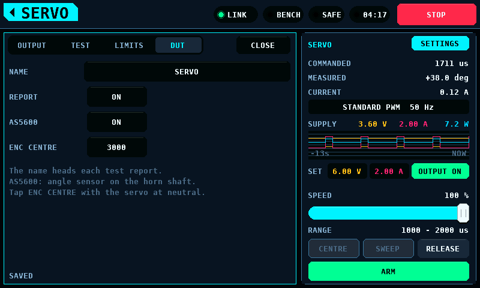

| Type | Centre | Travel | Frame rates |
| --- | --- | --- | --- |
| STANDARD PWM | 1500 us | 1000-2000 us | 50, 60, 100, 150, 200, 250, 300, 333 Hz |
| NARROW 760 | 760 us | 660-860 us | as STANDARD PWM |
| WIDE | 1500 us | 800-2200 us | as STANDARD PWM, up to 312 Hz |
| HELI CYCLIC | 1520 us | 820-2220 us | 50, 120, 200, 333 Hz |
| HELI TAIL 760 | 760 us | 410-1110 us | 200, 333, 560 Hz |

A pulse needs a pause before the next frame. STANDARD PWM, NARROW 760 and WIDE
keep at least 1 ms between pulses, so their fastest rate is 1 / (longest
pulse + 1 ms): 333 Hz for 2000 us. The heli profiles run at Rotorflight's
rates for digital cyclic and narrow-band tail servos, with at least 0.5 ms
between pulses. A frame rate the pulses leave no pause for is refused, and a
longer PULSE MAX is refused at a rate it does not fit. The pause is kept after
the longest pulse the coprocessor can render, the top of the range a command
carries: PULSE MAX, or past it when CENTRE is off the middle, by as much as
CENTRE lies nearer MAX than MIN. So a CENTRE that would push that top past
the rate's pause is refused too.

**A heli type, or any frame rate above 60 Hz, can destroy a servo that is not
made for it.** Choosing one opens a warning in the danger colour that names
what is chosen and what it does to a servo not made for it; it is applied only
after HOLD TO APPLY has been held for 2 s. CANCEL, a finger that slides off,
a touch loss and leaving the screen apply nothing. The type and frame rate in
force stay red on the right card, and every restart goes back to STANDARD PWM
at 50 Hz: a servo plugged in after a restart never meets a rate meant for
another one.


**The frame rate reaches the pins** through the coprocessor's SERVO page
(protocol 4.1). It applies to every PWM output whose first channel is a
surface; a PPM output keeps its own frame. It goes with every held position,
and a profile changed while the armed servo rests restates the rest with it;
one changed while an arm is on its way is the one the arm uses.
A faster rate goes after the pulse widths, once all of them have landed; any
other rate goes before them, and nothing wider goes out until it has landed,
so the pins never carry a fast rate with a slower profile's wider pulses. The
OUTPUT page says what became of it:

| Note | Meaning |
| --- | --- |
| In force | every PWM surface runs at the rate shown |
| The rate goes with the next position | not written yet |
| REFUSED | a surface shares a PWM slice with an output at another rate; the pins keep the rate they had |
| This coprocessor takes no frame rate | protocol 4.0: every PWM output runs at its binding's 50 Hz |

A coprocessor restart, and every binding written on OUTPUTS, put each slot
back at its own rate, 50 Hz for a servo; the screen sends its rate again with
its next position, against the binding then in force. A binding is not
written while the reset to each slot's own rate goes unanswered (OUTPUTS says
`NO LINK`) or is refused (`REFUSED`), and the bench
does not arm, from any screen, while the rate the surfaces run at is not
known: the arm is refused with `servo frame rate not known -- arm again`, and
an arm made while the link was down reaches the coprocessor only once the
reset has landed.

The OUTPUT settings and HV SERVO are kept for the session; the rest of the
TEST, LIMITS and DUT settings are kept in NVS (non-volatile storage) and
written as on SUPPLY.


Current limitations:

- Until the screen sends a position, the pins run at the rate the SERVO page
  holds, which after a restart or a new binding is 50 Hz.
- The automatic test has not run on hardware, and on the panel's supply
  model its currents are the model's load, not the servo's: a run there
  measures the model. [What is not measured](Servo.md#not-run-on-hardware).
- The supply on the right card is SUPPLY's: the PD mini when SETUP enables
  it, the panel's model otherwise, whose voltage, current and power are
  simulated, not measured.

## Supply


Sets, switches and records a programmable supply: the PD mini, a USB-PD (USB
Power Delivery) trigger controlled over a UART (universal asynchronous
receiver-transmitter). The coprocessor drives it on a PIO (programmable
input/output) UART on two of its pins, through the SUPPLY link page
(protocol 4.3). The panel writes the page and reads it every 100 ms. With
the PD mini enabled on SETUP under INTERFACES, the header says PD MINI. With
it disabled, the panel runs a model of a supply in its place: the header
says SUPPLY MODEL and the menu tile is marked MODELLED. The PD mini ran
against a module on 0.10.0 and 0.10.1; nothing added after 0.10.1 has.

The layout is the one MOTOR & ESC uses. The plot shows voltage, current and
power over the last 27 s. The rail shows the readings, the run's lowest
voltage and its highest current and power. MODE says which set point the
supply holds: CV (constant voltage) at the set voltage, or CC (constant
current) at the current limit. CC is drawn in the warning colour: a supply in
CC is not giving the load the voltage it was set to.

A set point is shown beside its reading. VOLT and CURR carry it in brackets
after the label, and the plot draws it as a dashed line in the reading's
colour, on the reading's scale. TABLE lists both. The bracketed value is the
set point the supply reports holding; while it does not answer, the one the
screen holds.

| Set point | Model | PD mini | Buttons |
| --- | --- | --- | --- |
| VOLTAGE | 3.3 to 21 V, 20 mV steps | 1 to 20 V, 10 mV steps | 0.1 V |
| CURRENT LIMIT | 0.5 to 5 A, 50 mA steps | 0.05 to 3 A, 10 mA steps | 0.1 A |

The model's ranges are a USB-PD PPS (Programmable Power Supply) source's
widest profile, 3.3 to 21 V at up to 5 A. The PD mini's are from the
vendor's page, not measured. The PD mini is a buck converter and gives no
more than it is fed: its voltage is also capped 0.5 V under the input it
reports, so a 5 V input allows at most 4.5 V. A set point over the input
puts the module into ERR until it is power cycled; the 0.5 V margin is not
measured. Both are narrowed by the caps in SETTINGS, and
the sliders follow the supply in use. A tap on a track sets the value under
the finger.

**A tap on the VOLT or CURR card, or on a set point's value, opens a keypad**
over the left column. It shows the range in the title row and the current
value faint until a digit is typed. OK takes a value inside the range,
rounded to the supply's step; a value outside it is refused and the range
turns to the warning colour. OK with nothing typed, and CANCEL, leave the set
point as it was.


**A change to a live output asks first.** While the output is on, a new set
point from the slider or its step buttons, or from the keypad, opens a
question that names the change. APPLY gives it to the supply; CANCEL drops it
and the slider goes back. A drag asks once, on the release, and the supply
holds the old set point until then. With the output off nothing is asked.
STOP closes the question unanswered: an APPLY tapped in the same frame
(about 50 ms) as STOP applies nothing. SETTINGS switches the question off for the slider and for the keypad
separately.


**OUTPUT ON is a two-second hold**, the gesture and the fade ARM uses. OUTPUT
OFF is a tap. STOP switches the output off on every screen. So does every
other stop the bench counts -- touch that stops answering, an ON whose touch
events went missing before the screen showed it, and the coprocessor refusing
to stay armed -- and a supply that stops answering, and a trip. The output
stays off until it is switched on again. Leaving the screen keeps the output
on, so a servo or an ESC fed by the supply stays powered on the screen that
tests it, and the link-lost screen, which has no STOP, does not open while
the output is on.

**With the PD mini**, an OFF goes to the SUPPLY page before anything else
the panel owes it, and the coprocessor switches the output off itself when
the panel's heartbeat stops. An enabled PD mini reads NOT ANSWERING while no
coprocessor that speaks protocol 4.3 answers, or while the page's readings
are older than 1500 ms; an output that is on is switched off then. The
output is also switched off, with a line in the band, when the coprocessor
refuses an ON (no heartbeat) or lets one go (its heartbeat stopped, or it
started again). The output is switched off too, and not on
again until a new hold, when the module switches it off itself -- its
overcurrent protection or its button. The band also says when the pins are
refused, when the output would not switch, and when the set points would not
take. A pin or baud change, and enabling or disabling the PD mini, switch the
output off.

**A sagging input switches the PD mini off.** While the output is on, the
coprocessor reads the module's input every 500 ms. When the input reads
under the set point plus 0.5 V on 2 input reads in a row, it switches the
output off at once, and the band names the input and the set point, for
example `PD mini input 6.18 V under set 6.00 V + 0.5 V -- output off`. The
output stays off until a new hold. One low reading switches nothing, and a
read that fails neither counts nor clears. While the output is on, its set
point is not lowered to follow a falling input. The rule is chosen without
a bench measurement: whether a live module goes to ERR when its input sags
is not measured, so the rule may cut a run that would have survived.

OUTPUT ON and OFF, RESET PEAKS and the readings stay live under the keypad,
the question and SETTINGS. One finger at a time: while one holds a control, a
second finger does nothing anywhere on the screen.

### Settings

SETTINGS, at the right of the strip above both columns, opens the supply's
settings over the left column. Each is kept in the panel's NVS (non-volatile
storage) and survives a restart. A value opens the keypad; a switch flips on
the tap. Every change is written at the next frame the bench is disarmed, the
supply's output is off and the board's photograph is not being fetched, and
with it any change on SETUP that was not saved: a flash write stalls both
cores, OUTPUT OFF and the trips included. The bottom line says SAVED, SAVE
WAITING, NOT SAVED (the write was refused), or SETUP CHANGES NOT SAVED: a
change made on SETUP and left without SAVE, which nothing writes until SAVE
there or a change here asks for it.


| Setting | Range | Default | What it does |
| --- | --- | --- | --- |
| VOLTAGE MAX | 3.3 to 21 V | 21.00 V | the highest voltage a set point takes |
| CURRENT MAX | 0.5 to 5 A | 5.00 A | the highest current limit a set point takes |
| START VOLTAGE | up to VOLTAGE MAX | 6.00 V | the voltage set point after a restart |
| START CURRENT | up to CURRENT MAX | 2.00 A | the current limit after a restart |
| CURRENT TRIP | 0 to 5 A | OFF | output off once the current has been over it for TRIP TIME |
| VOLTAGE TRIP | 0 to 21 V | OFF | output off once the voltage has been over it for TRIP TIME |
| TRIP TIME | 0 to 5000 ms | 100 ms | how long a reading is over a trip before it fires |
| SLIDER AND STEPS | ON, OFF | ON | ask before the slider changes a live output |
| KEYPAD | ON, OFF | ON | ask before the keypad changes a live output |

A cap lowered under a set point brings the set point down to it at once, and a
start value with it. A typed value goes onto the setting's step the safe way: a
cap rounds down, so 12.01 V allows 12.00 V, and a trip typed above 0 is at
least one step, never OFF. A trip of 0 is off. The time over a trip counts from
the first reading over it. A reading under its trip starts the
count again; a reading that did not arrive leaves it where it was. A trip
switches the output off, MODE shows TRIP until the output is switched on
again, and the band says which trip fired. The supply holds its current limit
in CC, so a current trip at or above CURRENT LIMIT does not fire; set it below
the limit to switch off a load that draws too much for too long.

The output stays off at a restart, whatever the start values.

With the PD mini as the supply, SETTINGS also offers RESET PD MINI. It
switches the output off and restarts the module (its SYSTEM_RESET command),
for a module that shows ERR -- a set point over its input puts it there --
without unplugging it. The module is asked who it is again about 1 s later.
Whether a restart clears every ERR is not measured. A coprocessor older than
protocol 4.4 has no reset: the output goes off and the band says so.

### The log

A run is one switch-on of the output. The plot clears when the output comes on
and holds the run after it goes off. The mAh and Wh under the switch count the
run from the readings shown, each step capped at 1 s. RESET PEAKS starts the
lowest and highest values again from the current reading.

A run is recorded to a `BENCHnnn.CSV` of its own, one row every 50 ms:

```
time (s);set (V);voltage (V);limit (A);current (A);power (W);mode;charge (mAh);energy (Wh)
```

A reading that did not arrive is an empty cell. `mode` is CV, CC or OFF, and
empty while the supply does not answer. The bench takes the log: arming during
a supply run ends that run's file, and an output still on at the disarm starts
a new file. That file's charge and energy go on from the totals counted since
the output came on, as the screen's do, so its first row does not start at 0. The supply is stepped and logged on its own 50 ms cadence while
the control task waits on the link, so an unanswered coprocessor does not thin
out the supply's plot or its log.

The model is a 6 ohm load with a 1.4 A burst for 0.6 s every 3 s, behind a
0.05 ohm source resistance. At the starting set points, 6.00 V and 2.00 A, the
burst takes it into CC. Its readings are not measured and nothing on the bench
is powered.

The PD mini's wiring -- PD mini, PD mini TX, PD mini RX and PD mini baud -- is
on SETUP under INTERFACES. TX and RX are coprocessor GPIO numbers: TX goes to
the module's DM, RX comes from its DP. The coprocessor refuses a pin that is
reserved, bound to an output or the other pin. Once the module has
answered, a change waits for a state read of the module sent after it, at
most about 1.2 s, and is taken only if that read shows the output off: the
module can switch itself on between two of the 500 ms reads, by its button
or its AUTO OUT setting, and new pins would leave it no OFF path. A read
that shows the output on, or fails, refuses the change, and the band says
`PD mini wiring refused -- its output may be on`. A refused change is not
written again until the wiring changes in SETUP. PD mini baud is the module's
own UART Baudrate setting: 9600, 19200 (as shipped), 38400, 57600,
115200, 230400 or 460800 baud, or AUTO. AUTO, the default, lets the
coprocessor find it: it tries each of the 7 rates, one a second. The
SUPPLY header shows the rate in use after ONLINE, e.g. `ONLINE 38400`, with
AUTO and with a fixed rate alike.

## Analyser


Sixteen channels, each with 1.5 s of history and a bar for its current value.
CH17 and CH18 are the two digital channels. A glitch is a spike in one lane; a
dropout is a notch across all sixteen at the same instant.

The state block shows one of SILENT, FAILSAFE, FRAME LOST and LIVE, with one
line of explanation:


In FAILSAFE the receiver is sending well-formed values it has generated itself;
every trace is drawn red. Treat FAILSAFE as a stop, not as sixteen valid
channels. [Receiver buses](Receivers.md) describes the states.

## Programmer

The sequence is: device class, protocol, connect. ESC STICK, the third
class, lists ESC profiles instead of protocols and programs an ESC through
its throttle-stick menu; it has a page of its own,
[Stick programming](StickProgramming.md).


Every protocol row names its transport. There is no autodetection:


BLHeli_32 is not in the ESC list. The bench identifies and drives these ESCs
and sends the DShot special commands, but cannot read their parameters:
[BLHeli_32 parameters](BLHeli32.md).

Nothing is editable until a device has answered:


After a device answers, the parameters are shown in groups with the selected
row's help under the list:


Each firmware shows its settings in its own units. BLHeli_S shows timing as
named steps; the others show degrees of advance:


A changed value is not written until WRITE is pressed. Staged changes carry a
mark and their own colour, and the WRITE button shows how many are staged:


Steppers stop at the ends of a list; they do not wrap.

Going back one level drops the connection. Back climbs one level at a time; the
band's home tag leaves the screen.

### ESC STICK

The list shows the makers first, alphabetical, each with how many of its
models run:

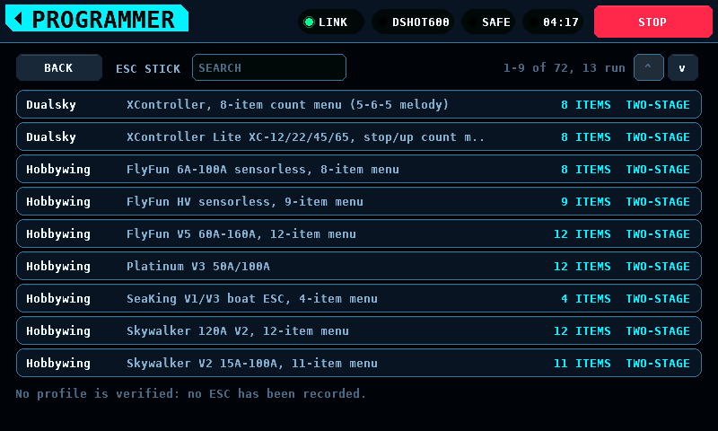

A maker opens its models, one row a model, by current, then voltage, then
name, each with its family and what the profile is or why it does not run.
A model opens its family's profile:

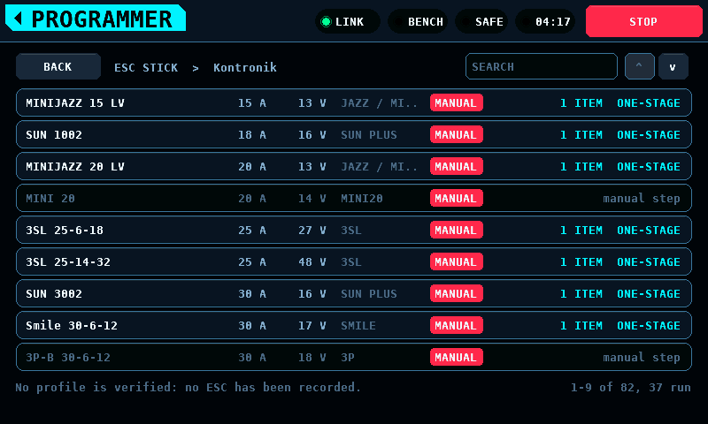

SEARCH filters the level showing. Its keyboard docks on the right, the rows
narrow beside it, and every key filters at once. A model is found when the
text appears in its maker and family read as one text, or in its maker and
its own name; a maker shows when any of its models is found. Case does not
matter, and `*` stands for any run of characters:

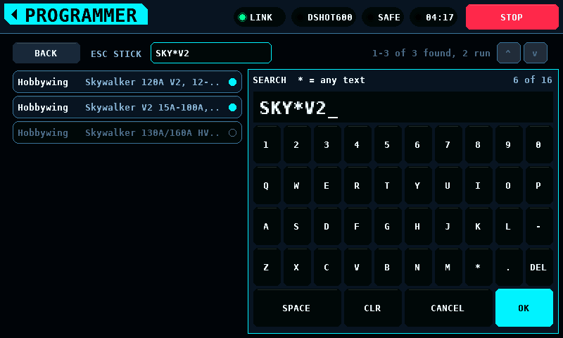

OK keeps the search on both levels, X clears it:

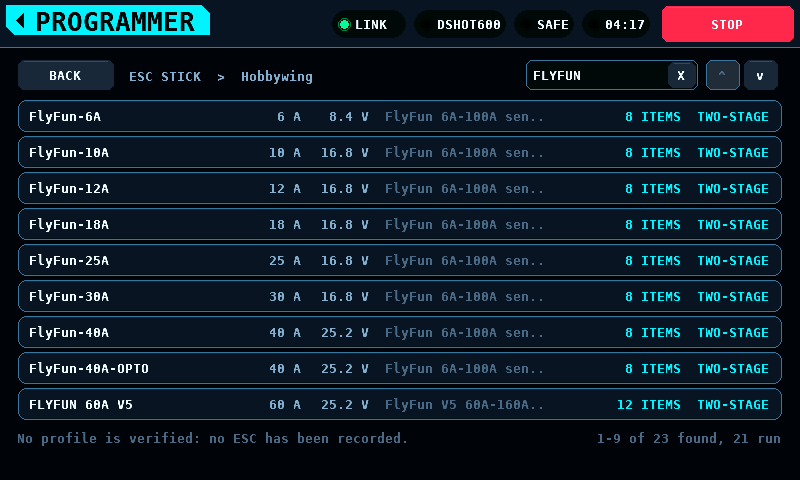

A profile's items start at KEEP. The steppers pick a value; RUN counts the
values picked:

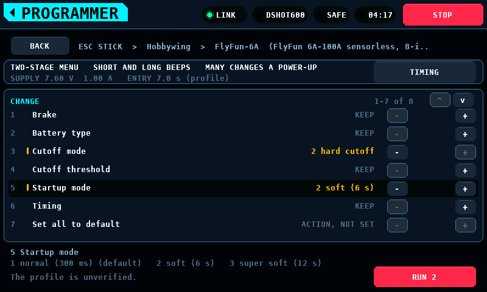

RUN opens a warning over the whole screen, NO PROPELLER, MOTOR SECURED?: a
motor on the ESC must be mounted solid and carry no propeller, or a
resistor load takes its place. The run starts after HOLD TO RUN is held
for 2 s:

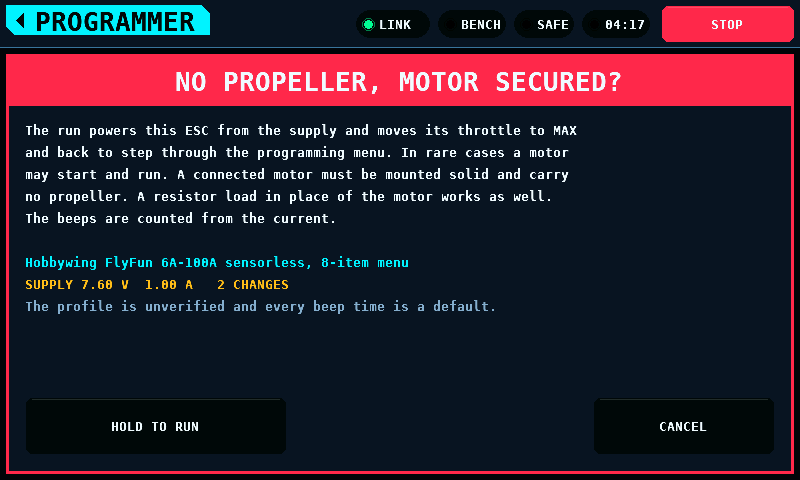

A profile whose ESC needs a person at it -- a jumper fitted and pulled, a
button pressed -- carries a red MANUAL tag in the list and MANUAL
INTERVENTION REQUIRED in red on its page. The button shows the steps and
when each is due; so does the first opening of the profile. The warning
lists the steps due before the power-up, and the run stops for each later
step with DONE and ABORT, waiting at most 60 s
([Manual steps](StickProgramming.md#manual-steps)):

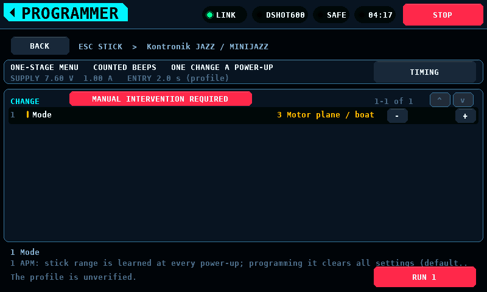

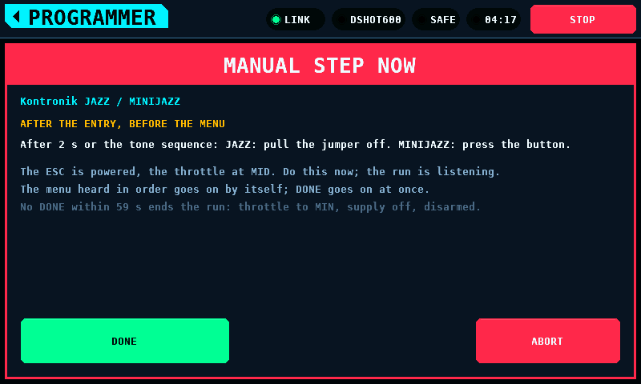

A Kontronik ESC that locks itself when its supply goes off before it has
confirmed the stored mode holds the run powered after the store, the stick
where it stored, until DONE:

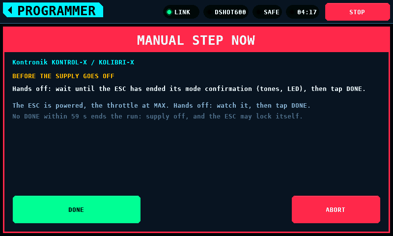

While it runs, the page shows the phase, the beeps of the group under way
and the last group. ABORT, STOP and leaving the screen end it with the
throttle at MIN, the supply off and the bench disarmed. The stack light's
green is on while a beep is detected, for at least 150 ms:

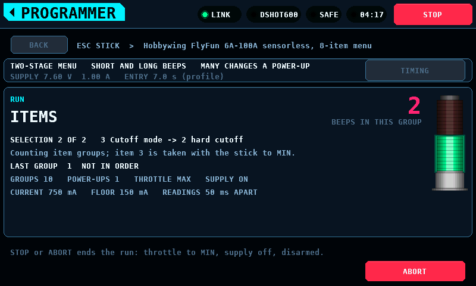

While the phase tap is enabled on SETUP the run's page adds a read-only
readout under the current line: the tap's state, the pitch of its last 8 ms
window, the counts of beeps the coprocessor lost and beeps the panel did not
read, and the last four
beeps with their number, length in ms and mean pitch in Hz. The run still
counts its beeps from the supply current.

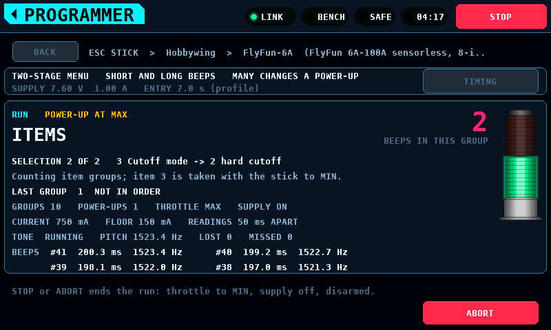

| State | Meaning |
| --- | --- |
| `RUNNING` | the capture runs |
| `OVERRUN` | it runs, and the capture ring or FIFO overran since the tap was enabled |
| `WAITING` | no link, or the TONE page has not answered in the last 500 ms, or the tap was switched off and the page still holds it on |
| `NO TONE PAGE` | the coprocessor speaks a protocol older than 4.8 |
| `PIN NOT FREE` | the coprocessor holds the tap off: its pin is bound elsewhere |
| `NOT RUNNING` | enabled, and the page holds the tap off or does not run it: the set-up was refused or is not written yet |

The result stays until OK. Its red light is on when the run ended because
something was not as expected, a stop the bench raised itself included,
and dark on DONE, a STOP pressed, ABORT and leaving the screen ([the list](StickProgramming.md#how-a-run-ends)):

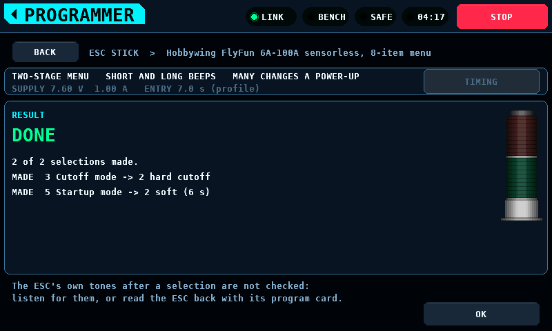

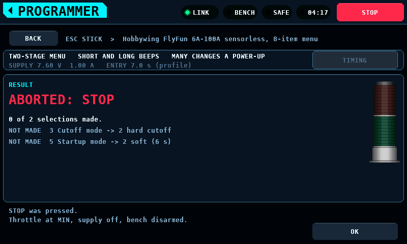

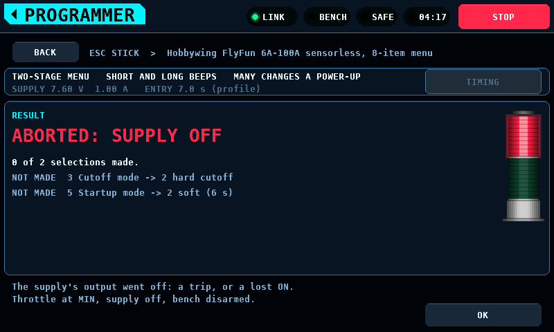

TIMING holds the beep timings and the supply settings. None of them is
measured:

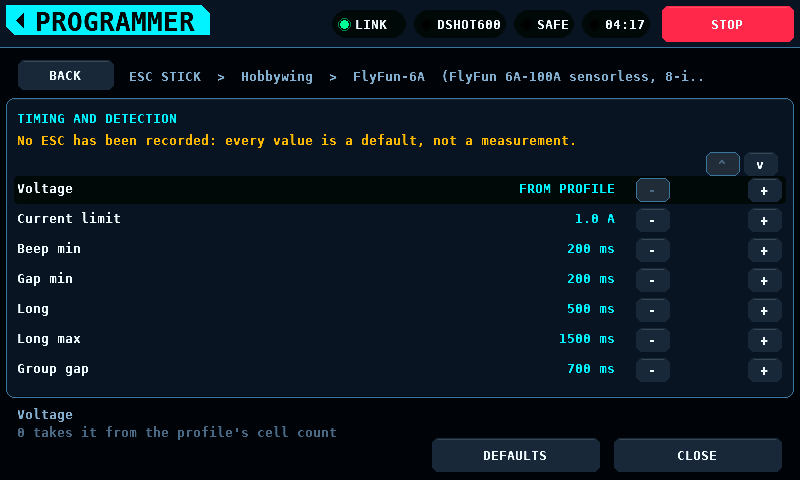

## Battery


Cells are drawn as their departure from the pack's mean. The verdict follows
the spread, the widest gap between any two cells: HEALTHY below 30 mV, WATCH
from 30 mV, REPLACE from 60 mV. The scale follows the pack down to a floor of
12 mV and is printed beside the plot.

Measure under load. At rest a weak cell reads like the others.

## Logs


Browse the card, open a file, check what the import detected, then plot:


The CSV (comma-separated values) reader accepts decimal comma and decimal
point, a units row and ragged rows; the import view shows what it decided
before the file is plotted. Runs recorded by the bench are written as
`BENCH001.CSV` to `BENCH999.CSV` in the card's root directory. A run is one
arming, or one switch-on of the SUPPLY output while the bench is not armed.
An automatic servo test takes the next number too: its log is `BENCHnnn.CSV`,
which the list shows as a run, and its report `BENCHnnn.TXT`, which the list
does not show. A number carried by either file is taken, and DELETE on a run
removes its report too.

The list holds 48 entries and a card holds up to 999 runs. When there are more
than fit, the list keeps the newest runs and its tab reads `48 OF 137 FILES`
instead of `FILES`, so a run that is missing from the list is a run the list
was too short for rather than a run that was never written. The number in the
name is what newest means: the panel has no clock that survives a power cycle,
so every file on the card is dated 1980-01-01. A run outranks a file the bench
did not write, so a card holding 48 or more runs lists no other file. Delete
old runs to get one back.

RESCAN, and every read of the card, selects the newest run and scrolls it
into view, so OPEN opens the run just recorded. A card with no numbered run
selects nothing.

In the plot, two fingers zoom: spreading them zooms in, pinching zooms out,
and moving both together pans. The view stays where the fingers leave it, and
a bar under the plot shows which part of the run is on screen. The narrowest
view is 8 samples, the widest the whole run. One finger and the `<` and `>`
buttons move the cursor as before; stepping the cursor past the edge of a
zoomed view carries the view with it. BACK returns to the import view.

The plot places the rows evenly by row number. The labels under it and the
cursor's read-out are the file's time column, counted from the file's first
row, and the header's duration is the last row's time less the first's. A
gap in the rows is a jump in those times, not a wider stretch of plot. For
an armed bench's run the time is wall time, so the duration is the run's;
for a file written by firmware 0.15.0 or older it is shorter than the run
(see Motor & ESC, the CSV file).

SETUP → APPLICATION → One finger pans, off by default, lets a single finger
pan a zoomed view. While it is on and the view is zoomed in, a finger that
moves more than 10 px from where it touched down drags the view sideways, and
the sample under the finger stays under it. A touch that stays within 10 px
selects a value as with the setting off, and a pan leaves the cursor where it
was. A view that shows the whole run is not panned: one finger moves the
cursor. A second finger on the plot starts a zoom, as before.

DELETE removes the selected file from the card. It asks first: a second panel
names the file and its size, and only its own DELETE, pressed and released on
that button, removes the file. CANCEL, or leaving the screen, closes the
question without deleting. The run the logger has open is refused. A file
that was open in the import view or the plot is dropped from both when it is
deleted. The logger numbers each run above the highest run it found on the
card. It reads the card at the first run after boot and after a run that could
not be opened, and counts on from there otherwise. A deleted number is used
again only if it was above every run left on the card at that read.


A run is committed to the card every 20 rows or 1000 ms of run, whichever
comes first. Power lost mid-run costs the rows the commit has not finished
with and the rows still in the queue between the control task and the card's
own task: under 1.0 s of run while the card keeps up, and 84 rows, 4.20 s at
the panel's 20 Hz sample rate, if the card has stalled and the queue is full.
The rest of the file is readable either way. The card is written by a task of its own: an SD (Secure
Digital) card is allowed 250 ms to finish a write, and the task that beats the
safety line has a ceiling of 150 ms.

Eight messages say what a card did to a run. Each appears on the band:

| Message | What happened |
|---|---|
| `no card -- this run is not recorded` | nothing is mounted, so the run was never opened |
| `card unreadable -- run not recorded` | the card would not list, so a run number could not be chosen |
| `card full or unwritable -- run not recorded` | no run number could be created |
| `the card did not keep up -- run not recorded` | every row was dropped, so there is no file for this run at all |
| `the card fell behind -- the log has gaps` | some rows were dropped; the file's time column shows where |
| `the card stopped taking rows -- run not recorded past here` | a write failed mid-run; every later row is rejected |
| `the card stopped taking rows -- the log is short` | the same failure, said again when the run closes |
| `the card failed on the last write -- the log is short` | the close failed, so the rows since the last commit are not in the file |

The first four mean there is no file to look for. The last four mean there is
one and it stops early.

A run being written is not offered in LOGS. A file's length lives in its
directory entry and is written when the file is closed, so a run still open
would list at its last committed length and read as a finished one.

## Setup


Settings are behind the SETUP tile, in both themes:


APPLICATION's Language switches the whole interface between English and
German on the next frame, with no restart. What follows it, what stays
English and why: [Interface language](Language.md). One finger pans, in the
same category, sets whether one finger pans the zoomed log plot; it is off by
default and is described under the log viewer.

### APPLICATION: the rotary knob

An AS5600 magnetic angle sensor on the panel's I2C terminal (I2C:
Inter-Integrated Circuit) turns the slider of the bench screen on top: the
throttle on MOTOR & ESC, the horn on SERVO. Wiring:
[Building](Building.md#rotary-knob-wiring). Other screens ignore it.

| Setting | Range | Default |
| --- | --- | --- |
| Rotary knob | OFF, ON | OFF |
| Knob scale | 90 to 720 deg in steps of 10 | 270 deg |

Knob scale is the knob angle that moves the slider across its whole span.
At 270 deg a quarter turn moves the throttle 33.3 points, and the horn
across a third of its travel from -travel to +travel.

- The knob moves a value by how far it turns, never to where it points. A
  turn adds to the throttle or the horn's angle and stops at 0 and 100 % or
  at the travel limit. Turning past an end and back moves the value from the
  end.
- It never arms. ARM is the same hold on the same button.
- The first reading after power-up and the first one after the sensor stopped
  answering set a reference and move nothing, so a knob that comes back
  turned does not jump the slider.
- The sensor is read every 10 ms, and every 100 ms while it does not answer.
  A reading with no magnet detected, a magnet too weak or too strong, or a
  magnitude of 0 counts as no answer. A step of more than 90 deg between two
  readings counts as a glitch and is dropped.
- A finger on the throttle track or on the SERVO dial owns the value while it
  is down, and for the whole frame in which it touched the control, also when
  it lifts in that frame. On SERVO the knob does not take the horn from a running or paused
  sweep, a test run, or the open settings panel.
- A frame that lost touch events drops the knob's motion with its gestures,
  and so does a frame in which the router navigated at all, also away from
  the screen and back to it. The knob's command goes out with the next frame;
  if that frame finds lost touch events first, the command is withdrawn and
  the slider returns to its value from before the knob.
- The knob replaces only a throttle or a horn position. While another
  command waits for the frame (an arm that has just completed, a disarm, a
  peak reset, a release), the knob's motion in that frame is dropped, not
  held.
- On SERVO a turn on a disarmed bench moves nothing and is not kept. The arm
  sets the horn to the rest, and the next turn counts from there. A turn
  posted and not yet sent when the bench disarms or stops is withdrawn. On
  MOTOR & ESC a turn on a bench that is not armed moves nothing and is not
  kept either; the disarm returns the slider to 0 %, and the next turn after
  an arm counts from there.
- Known limitation: On the Waveshare ESP32-S3 Touch LCD 7 panel the board's CH422G I/O expander answers at I2C addresses 0x20 to 0x27 and 0x30 to 0x3F, which includes the AS5600's fixed address 0x36, so an AS5600 knob cannot be read on that bus. The Rotary knob setting is OFF by default.

### INTERFACES: the current monitors

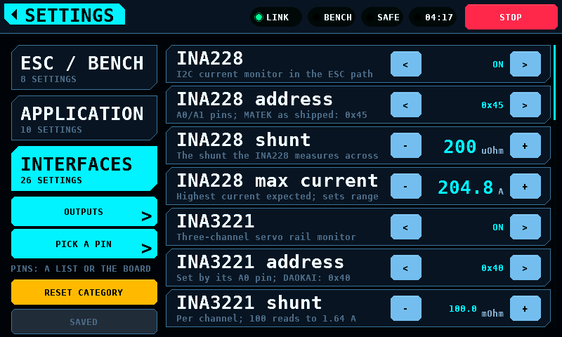

The coprocessor reads two I2C (Inter-Integrated Circuit) current monitors on
one bus on two of its pins: a TI INA228 in the ESC's power path and a TI
INA3221 on the servo rail. Their rows are at the top of INTERFACES:

| Setting | Range | Default | |
| --- | --- | --- | --- |
| INA228 | ON, OFF | OFF | the monitor in the ESC's power path |
| INA228 address | 0x40 to 0x4F | 0x45 | the MATEK I2C-INA-BM as shipped; its solder bridges give 0x44 or 0x41 |
| INA228 shunt | 50 to 20000 µΩ, 1 µΩ steps | 200 | the MATEK's |
| INA228 max current | 1.0 to 300.0 A, 0.1 A steps | 204.8 | the current the range is set for: it chooses the ADC (analog-to-digital converter) range and nothing else. 300 A is the bench's design maximum; the coprocessor refuses more. Its refusal of a range past 2000 A full scale stays, and 300 A on the smallest shunt, 50 µΩ, does not reach it |
| INA3221 | ON, OFF | OFF | the servo rail's three channels |
| INA3221 address | 0x40 to 0x43 | 0x40 | the DAOKAI module as shipped |
| INA3221 shunt | 5.0 to 1000.0 mΩ, 0.1 mΩ steps | 100.0 | one a channel; the DAOKAI's R100 reads to 1.64 A |
| INA3221 channels | CH1, CH1+2+3 | CH1 | CH1 is the servo test's; CH2 and CH3 a synchronised pair's |
| Sensor SDA | −1, 0 to 47 | 16 | coprocessor GPIO (general-purpose input/output); −1 until wired |
| Sensor SCL | −1, 0 to 47 | 17 | the GPIO after SDA |

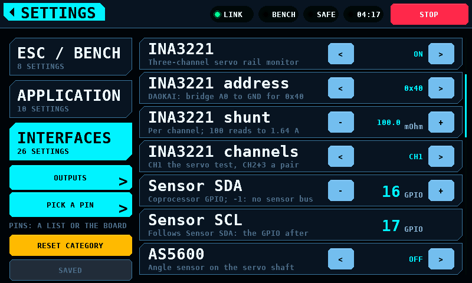

SDA and SCL are one I2C block's pair: SDA's GPIO number mod 4 is 0 or 2, and
SCL is the GPIO after it. The bus runs at 400 kHz, which is not a setting:
the coprocessor takes no other clock. A reading at the top of the INA3221's
range, 163.8 mV across the shunt, is shown as clipped and never as a value.

The panel writes the set-up to the coprocessor's SENSE page (protocol 4.7)
500 ms after the last edit, only while the bench is disarmed, and only what
differs from what the page holds: the coprocessor refuses a change while it
drives, and keeps each change in flash. It reads the page at every link-up
first, so a set-up the coprocessor already keeps is not written again. When
a monitor's own values change while both are enabled, both are switched off
on the page first and on again after, so no step on the way puts the two
parts on one address. A
coprocessor older than 4.7 is sent nothing. After a write is taken the panel
reads the coprocessor's identity again: capability bits 3 and 4 follow the
set-up, and with the INA228 enabled the MOTOR & ESC tile loses its MODELLED
mark.

While a monitor is enabled, the panel reads SENSE's 14 read-only registers
every 50 ms; while the INA3221 is, SERVO_SENSE's channel windows every
50 ms, each 50 ms window once. The band says what they show, each once and one at a time: the most
pressing first, and the next no sooner than 5 s later, so two at once are
both said. In order:

| Message | When |
| --- | --- |
| `coprocessor has no SENSE page -- current monitors not read` | a monitor is enabled and the coprocessor speaks a protocol older than 4.7; said at the link-up, and when a monitor is enabled while it answers |
| `sensor SDA or SCL not set -- see SETUP INTERFACES` | a monitor is enabled with a pin at −1; neither is enabled on the page |
| `INA228 and INA3221 both at 0x40 -- see SETUP INTERFACES` | both enabled on one address; neither is enabled on the page |
| `sensor pins GP5/GP6 refused -- see SETUP INTERFACES` | the coprocessor refused the pins: not one I2C block's pair, reserved, bound to an output or held by the PD mini; both monitors stay off |
| `INA228 shunt or max current refused -- see SETUP INTERFACES` | the shunt's voltage at the max current passes 163.84 mV, or the range it gives passes 2000 A; the INA228 stays off |
| `INA3221 set-up refused -- see SETUP INTERFACES` | the INA3221 stays off |
| `sensor bus stuck: SDA held low -- clocking it free` | the coprocessor found SDA held low and clocks it free |
| `INA228 not answering at 0x45` | enabled, and not answering 2.5 s after its set-up was taken, or no longer answering after it did. `-- 0x44 answers` is added when the coprocessor's address scan found something where the part could be |
| `0x40 answers 1408h, not an INA3221 -- not used` | something answers at the part's address with another identity |
| `INA228 current at the end of its range -- current is a bound` | the INA228 read the end of its range in the last 50 ms window or since the arm |
| `INA3221 CH1 clipped at 1.64 A -- current is a bound` | a channel the INA3221 reads hit the top of its range; the current is its full scale |
| `coprocessor store off -- set-ups last until it restarts` | STATUS fault bit 6: the coprocessor saves nothing this boot, so the set-up, the bindings and the supply's wiring are lost at its restart; said once per link-up |

A refused set-up is not written again until it changes on SETUP. Pins that
are one I2C block's pair, refused because an output, the PD mini or the
board holds one, are offered again every 5 s without another alert, so
freeing the pin on OUTPUTS or SUPPLY lets the bus open. A monitor
that stops answering does not disarm the bench: nothing trips on the
monitors' readings.

### INTERFACES: the output encoder

An ams OSRAM AS5600 magnetic angle sensor on the servo's output shaft, on the
sensor bus beside the monitors, at its fixed address 0x36 (protocol 4.9):

| Setting | Range | Default | |
| --- | --- | --- | --- |
| AS5600 | ON, OFF | OFF | the output encoder; it takes the sensor bus's SDA and SCL above, and needs both pins set |
| AS5600 centre | 0 to 4095, 1 count steps | 0 | the sensor's 12-bit count with the servo at its neutral; 4096 counts a turn, 0.0879 degrees a count. The SERVO screen's ENC CENTRE sets it from the live reading |

The panel writes the enable bit with the rest of the bus frame, 500 ms after
the last edit and only while the bench is disarmed, to a coprocessor that
names protocol 4.9; an older one is sent nothing. While the encoder is
enabled it reads SENSE's registers 12 to 31 every 40 ms. The band says, each
once and one at a time like the monitors':

| Message | When |
| --- | --- |
| `coprocessor older than 4.9 -- AS5600 not read` | the encoder is enabled and the coprocessor speaks a protocol older than 4.9; said at the link-up, and when the encoder is enabled while it answers |
| `AS5600 not answering at 0x36` | enabled, and not answering 2.5 s after its set-up was taken, or no longer answering after it did; also when something at 0x36 gives a STATUS no AS5600 gives, ML and MH both set |
| `AS5600 sees no magnet -- check the magnet on the horn shaft` | it answers, an angle has been read, and STATUS MD (magnet detected) is clear. The count is no angle: MEASURED shows `---`, ENC CENTRE sets nothing, and a run logs and judges no angle |
| `AS5600 magnet too weak -- move it closer` | STATUS MD and ML are set. The angle is used; the sensor's datasheet specifies its noise for 30 to 90 mT only |
| `AS5600 magnet too strong -- move it away` | STATUS MD and MH are set. The angle is used, as with ML |

A magnet message is said once until the field reads right again, and again
when a magnet that read weak or strong goes missing or a missing one comes
back weak or strong: the angle stops with the first and returns with the
second. The sensor's
DIR pin sets the direction its count rises in; the panel takes the count to
rise with the servo's pulse width. Not run on hardware.

### INTERFACES: the phase tap

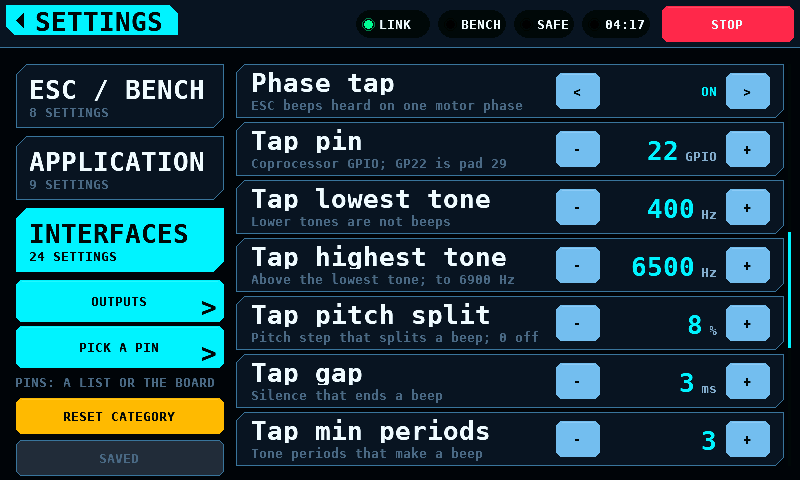

The phase tap hears an ESC's beeps on one motor phase. One coprocessor
GPIO reads the phase through a series resistor and a zener clamp; the
coprocessor times the pin's edges and reports each beep's length and pitch.
The wiring is not in the build guide. The tap is an input: it drives
nothing, and the coprocessor takes a change armed or not. Its rows follow
the bus's pins:

| Setting | Range | Default | |
| --- | --- | --- | --- |
| Phase tap | ON, OFF | OFF | the capture runs on the coprocessor |
| Tap pin | 0 to 47 | 22 | coprocessor GPIO; GP22 is pad 29. Refused: an ADC (analog-to-digital converter) pin, GP26 to GP29 on the RP2350A and GP40 to GP47 on the RP2354B; a pin bound to an output; a pin the SENSE or SUPPLY page holds |
| Tap lowest tone | 50 to 2000 Hz, 10 Hz steps | 400 | a tone below it is not a beep |
| Tap highest tone | 100 to 6900 Hz, 50 Hz steps | 6500 | above the lowest tone |
| Tap pitch split | 0 to 50 %, 1 % steps | 8 | a pitch change this large starts a new beep with no silence between; 0 splits on silence only |
| Tap gap | 1 to 100 ms | 3 | the silence that ends a beep; at least one period of the lowest tone, so 20 ms at 50 Hz |
| Tap min periods | 1 to 64 | 3 | the tone periods that make a beep |

The panel writes the set-up to the coprocessor's TONE page (protocol 4.8)
500 ms after the last edit, and only what differs from what the page holds:
the coprocessor keeps each change in flash. It reads the page at every
link-up first. The set-up goes in two frames, the pin and the tone range,
then the split, the gap and the periods. When both change, the one that
leaves the page a valid set-up goes first: a lower tone with a gap shorter
than its period is refused, so the gap is written before the tone goes down
and after it goes up. Switching the tap off writes the first frame with
the values the page holds and the tap disabled, whatever range is asked, so
a range the page would refuse cannot keep the tap running; the range
follows in a frame of its own. Until the page holds the tap off the screen
shows `WAITING`, not off. A set-up kept in flash that met a busy pin at the
coprocessor's boot is written again every 5 s, without another message,
while the page reports the pin refused. A change of ENABLE or of the pin
empties the coprocessor's ring and the panel takes its place at the newest
beep number, so none is read twice and none counted as missed; a change
of the range or of the other values leaves the ring and the numbering
alone. A coprocessor older than 4.8 is sent nothing.

While the page holds the tap on, the panel reads its 16 read-only registers
every 50 ms: the flags, the last 8 ms window's pitch, the number of the
newest beep and the counts of beeps lost and lows ignored. It takes the
beeps one by one by number. The coprocessor keeps the last 64 beeps,
numbered 1 to 65535 and then 1 again, and a read does not remove one, so a
reply lost on the link loses no beep. A beep that left the ring before it
was read, or that the ring moved past while the panel was more than 64
behind, is counted as missed. The last 8 beeps are kept for the screen; the
run page of ESC STICK shows 4 of them ([Programmer](#programmer)).

The band says what the tap reports, each once and one at a time, as for the
current monitors:

| Message | When |
| --- | --- |
| `coprocessor has no tone page -- phase tap not read` | the tap is enabled and the coprocessor speaks a protocol older than 4.8; said at the link-up, and when the tap is enabled while it answers |
| `phase tap on GP22, 400 to 6500 Hz refused -- see SETUP INTERFACES` | the coprocessor refused the first frame: the pin is not allowed or the tone range is not one it takes (the highest tone not above the lowest, or the gap shorter than the lowest tone's period). Offered again every 5 s without another message, so freeing the pin lets the tap start |
| `phase tap split, gap or periods refused -- see SETUP INTERFACES` | the coprocessor refused the second frame; not written again until a value changes |
| `phase tap pin GP22 not free -- tap not running` | the coprocessor reports the pin refused: a set-up it kept in flash met a binding at its boot. The first frame is offered again every 5 s without another message, so freeing the pin lets the tap start |
| `phase tap capture overrun -- beeps cut` | the coprocessor's capture ring or FIFO (first in, first out buffer) overran since the tap was enabled; the beep under way was cut |

### Keeping the values

A changed value takes effect at once and is not written to flash until SAVE is
pressed. The button under RESET CATEGORY says which of three states the
screen is in:

| Label | Meaning |
| --- | --- |
| `SAVED` | Nothing is unwritten. The button is inert. |
| `SAVE` | Something is unwritten. Pressing it asks for a write. |
| `WHEN IDLE` | A write has been asked for and is waiting for a moment to happen in. |
| `NOT SAVED` | The store refused the write. What reached the medium is not known from the screen: a refusal on one key leaves the keys written before it committed, so the next boot can load a mix of the new values and the old. Pressing it tries again. |


The press asks; it does not write. Writing settings commits a page of NVS
(non-volatile storage), and a flash operation on the ESP32-S3 disables the
instruction cache, so neither core runs for its duration. The write is taken
on the first frame at which the bench is disarmed and no board photograph is
being fetched or stored. On the settings screen that is the next frame, and
the label goes to `SAVED` as fast as the eye follows the press. Armed, the
request stands as `WHEN IDLE` until the bench is disarmed.

A store that refuses leaves the label at `NOT SAVED` in the danger colour
until the next successful write or the next edit. A refusal does not undo what
was already written: the values are set key by key and a failure part way
through leaves the earlier keys committed, so the medium can hold a mix of the
new values and the old. The screen cannot say which. A panel whose NVS could
not be brought up at all refuses every write of the session, writes nothing,
and says so once more on the splash as `NVS unavailable`.

Values not saved are kept until the panel is switched off. Leaving the screen
writes nothing.

## The bus-fault screen

The panel runs the CAN (Controller Area Network) echo self-test at every
start-up, for 1200 ms inside the splash. A verdict other than every probe
coming back intact puts this on the panel instead of the menu.


It exists because the fault is invisible from every other screen: a bus that
does not carry frames looks exactly like a coprocessor that is not fitted, and
both look like a bench that shows no numbers. The verdict is the heading, the
list is what to check in the order that costs least to check, and the right
column is what both ends counted.


Leaving it takes a two-second hold, the ARM gesture and the same fade.
Acknowledging repairs nothing: the bench runs in simulation, nothing drives an
output, and the test runs again at the next start-up. There is no band and no
STOP, because nothing can be armed behind it.

### A link that stops

The same screen carries the other half: a link that was up and has been gone
for 4 s. The heading is what this panel's own CAN controller is doing, because
the wire carried frames a moment ago.


| Heading | Meaning |
| --- | --- |
| `this panel is off the bus` | too many frames went unacknowledged; it stopped transmitting |
| `this panel is rejoining` | it is counting the quiet time a rejoin needs, about 3 s |
| `the controller has stopped` | idle and not restarted — a fault in the firmware |
| `the link stopped answering` | the controller is on the bus and nothing answers |
| `the controller cannot be read` | the driver is not running; nothing can be sent |

Four seconds, not one: the link drops for a poll now and then, and a screen
that took over on every blip is a screen operators learn to dismiss.

**Never while armed.** The screen has no STOP, and a bench with something
spinning must not have its stop button covered by a diagnosis. Armed, the
alert band says the link is gone and the screen waits for the disarm.

The same numbers go to `RCBENCH.LOG` on the SD card, one line per report while
the link is down:

    t=182s link=down for 47s  bus=OFF tx_err=248 rx_err=0 bus_err=1976 rejoins=44/44  polls=5323 replies=5279 timeouts=44

The fields are the same in the same order every time. `rejoins` is this outage
over the total since boot, and an unreadable controller writes `?` in its
columns rather than a differently shaped line: the reading that most needs a
timestamp is the one where the controller would not answer.

The card is there because the panel's console is not reachable on every board.
The native USB socket carries GPIO19 and GPIO20, which the multiplexer hands to
CAN about a second into boot, so it is gone before a bench fault happens. The
bridged socket is on UART0 and normally carries the console right through, but
what it is connected to is switchable: a slide switch beside the BOOT and
RESET buttons is marked UART1 and UART2. In one position the bridge chip
enumerates and passes nothing in either direction, and the panel then has no
console at all.

[Bringing up the link](Link.md) has the verdicts and what each one means.

## Outputs

Behind the OUTPUTS key on the Setup screen. The protocols bound to the
coprocessor's pins, and which pins each one drives.


A set of pins per protocol, not eight independent slots: a bench is wired a
protocol at a time — four servo leads, then one ESC (electronic speed
controller) — and asking for the protocol and then for its pins is the shape
of that job. More than one protocol can be bound at once, and a pin belongs to
at most one of them.

Each ticked pin becomes one slot on the [OUTPUTS page](Link.md#page-map), in
pin order across every protocol, taking channels from zero upward — so the
lowest ticked pin is channel 0 whatever order the screen was touched in and
whichever protocol holds it. Eight slots and eight channels are the budget,
shared. PPM renders eight channels on its one pin, so a bench with PPM on it
has room for nothing else. It runs at 40 Hz, not the 50 Hz the pulse drivers
use: eight channels need 23,300 us of frame and 50 Hz gives 20,000.

SERVO PWM and MOTOR PWM are the same pulse at the same 50 Hz and differ in
what the channel is for. A servo channel centres when nothing commands it; a
motor channel stops. Nothing in the pulse says which is on the pin, so the
entry says it: bind an ESC as MOTOR PWM and a control surface as SERVO PWM.
The MOTOR & ESC throttle drives every channel bound as a motor — MOTOR PWM
and the DShot entries — and leaves the servo channels alone.

A MOTOR PWM channel sends 0 % throttle as the Idle pulse and 100 % as the
Full pulse: 1000 us and 2000 us by default, set under SETUP, ESC / BENCH, in
steps of 10 us (Idle pulse 800 to 1600 us, Full pulse 1400 to 2400 us). The
two settings reach the channels bound as a motor and no others: a SERVO PWM
channel keeps 1000 to 2000 us, or the range the SERVO screen sends for the
servo chosen there. An edit reaches the coprocessor 300 ms after the last
change while the bench is disarmed; one made while it is armed waits for the
disarm. A coprocessor that links up is brought to the two settings before
the bench drives it: on a bench already armed, the coprocessor is held
disarmed until it has them. An Idle pulse that is not below the Full pulse is not sent, and the
band says `idle pulse must be below full pulse -- not sent`.

An ESC whose throttle range was calibrated on a transmitter takes that
transmitter's shortest pulse as zero. An Idle pulse above it reads to the ESC
as throttle not at the bottom, and the ESC does not arm; many ESCs beep
rapidly in that state. Set the Idle pulse at or below the transmitter's
shortest pulse and the Full pulse at or above its longest: for a transmitter
that sends 985 to 2012 us, 980 us and 2020 us.

When the protocol can take no more pins, the reason is under it in amber:
`NEEDS 8 CHANNELS, 4 FREE`, `ALL 8 SLOTS IN USE`, or `SERVO PWM TAKES 8
PINS`. A board drawn entirely in grey with nothing beside it reads as a
fault, and PPM greys the whole board whenever anything else is bound.


The protocol is a list rather than a stepper, because there are eight of them
and stepping past seven to reach the eighth is not choosing:


Reserved pins are shown and cannot be ticked. GP3 carries the safety heartbeat
and GP8 to GP12 are the CAN (Controller Area Network) controller, and each
says so under its name. Hiding them would leave an operator hunting for GP10
and finding a gap. [DShot and the output drivers](DShot.md#which-pin) has the
whole map.

The pad number under each pin is the one printed on the board, so an operator
counting pads and an operator reading GPIO (general-purpose input/output)
numbers arrive at the same pin.

Ticking or unticking a pin writes the binding at once. There is no APPLY key:
a screen holding a choice that has not been sent is a screen that disagrees
with the bench, with nothing to say which of the two is driving. The panel
then reads both pages back and shows what the coprocessor holds. What became
of the write is under the protocol, as LAST WRITE:

| LAST WRITE | Meaning |
| --- | --- |
| `NOT WRITTEN` | nothing has been written since the panel started, or a write was not sent because the binding on the screen was not one a read confirmed |
| `WRITTEN` | the coprocessor acknowledged every exchange of the write |
| `NO LINK` | an exchange of the write got no answer within 1000 ms, or the link was down |
| `REFUSED` | the coprocessor answered and refused: a pin it cannot bind, a change while the bench is armed, or a frame rate it could not put back |

To a coprocessor speaking protocol 4.10 the binding is written whole: the
two pages are prepared beside the ones in force and taken together by one
commit ([Link](Link.md#a-binding-taken-whole)). `NO LINK` and `REFUSED` then
leave the binding in force exactly as it was, except when the one
acknowledgement of the commit is lost: the binding is then in force, the
screen says `NO LINK`, and the read at the next link-up shows it. An older
coprocessor takes the pages one entry at a time, and a write that stops part
way leaves the entries before it in force.

Picking a protocol in the list writes nothing. It says which set of pins the
screen shows as ticked and which set the next tick joins. Nothing is dropped:
the pins ticked for the protocol being left stay bound, and the pins of the
one arrived at come back as they were. A selector that retargeted the current
pins would make binding a second protocol mean unbinding the first. On entry
the list shows the lowest-numbered protocol that holds a pin, in the list's
order, or OFF when no pin is bound. A protocol picked without ticking a pin
stays selected across read-backs and across leaving the screen, and is the
one a tap on PICK A PIN joins.

`DSHOT600 BIDIR` and `DSHOT300 BIDIR` are the longest entries, 14 characters:

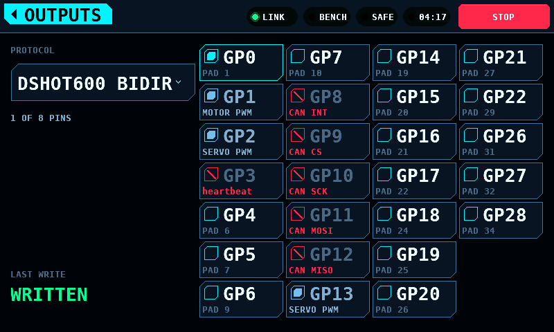

A pin another protocol holds is drawn greyed, with that protocol's name under
it where a free pin shows its pad number. That is a choice, undone by going to
that protocol and unticking it there — unlike a reserved pin, which is drawn
red and struck through because it is the wiring rather than a choice.

Four servo leads and an ESC, with DSHOT300 the protocol being edited. GP5 is
ticked; GP0, GP1, GP2 and GP4 say SERVO PWM and cannot be ticked here; GP3 and
GP8 to GP12 are red because the coprocessor reserves them:


So a cell is in one of four states, and each says what to do about it: ticked
in this protocol, held by another and named, reserved and struck through, or
free and showing its pad number.

### OFF

OFF is the first entry of the list and binds nothing: it takes 0 pins, and
the count under it reads `0 OF 0 PINS`. With OFF picked, every bound pin
shows the name of the protocol that holds it, so the whole binding is on one
screen. No pin can be ticked or unticked: a tap on a pin does nothing, and
the line under the list says `OFF SHOWS ALL, EDITS NOTHING`. Picking OFF
writes nothing and unbinds nothing.

OFF stays picked across read-backs, repaints and a link that goes down and
comes back, until another entry is picked or the screen is left. The next
entry opens on the lowest-numbered protocol that holds a pin.

GP0 bound as DSHOT600 BIDIR, GP1 as MOTOR PWM, GP2 and GP13 as SERVO PWM,
with OFF picked:

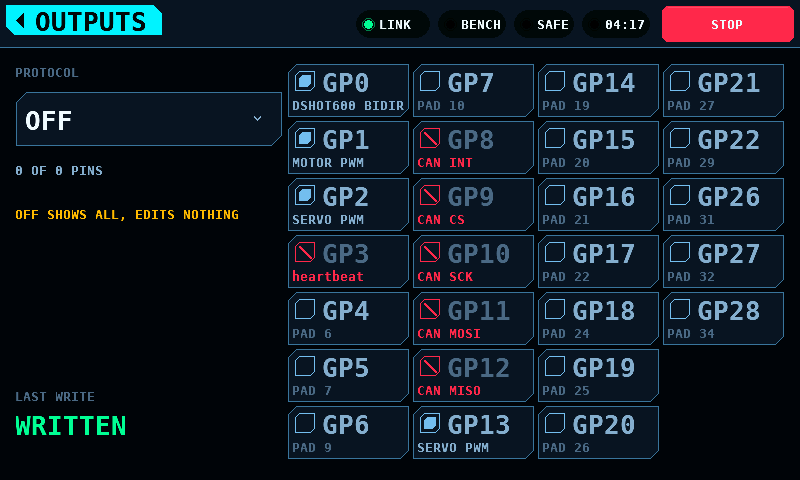

With SERVO PWM picked on the same bench, GP2 and GP13 are ticked and show
`PAD 4` and `PAD 17`: a pin ticked in the selected protocol shows its pad
number, because the protocol is the one named in the list.

### A binding that is not confirmed

The screen edits a binding only after reading it. A read gives one of four
results:

| Read | The screen |
| --- | --- |
| both pages read and they describe a binding, one with no pin bound included | shows it and takes edits |
| a page did not read: no answer within 1000 ms, a refusal, or the link is down | keeps the last binding read, dimmed, with `BINDING NOT READ - NO EDITS` |
| both pages read and no binding describes them: one pin in two slots, a rate or driver no protocol entry has, a pin off the board or reserved, channels out of slot order | keeps the last binding read, dimmed, with `PAGES HOLD NO VALID BINDING` and the key `HOLD: UNBIND ALL PINS` |
| the coprocessor is a board this build has no pin map for | shows no pins |

In the second and third state a tap on a pin does nothing here and on PICK
A PIN, and no write is sent. A tick made just before the read failed is
taken back: the pins shown are the ones last read, not the ones last
tapped. The list still opens, and a pick still changes which protocol's pins
show their pad. The panel reads again at every link-up and every 500 ms while
the link is up and the binding is not confirmed; the first read that gives a
binding ends the state.

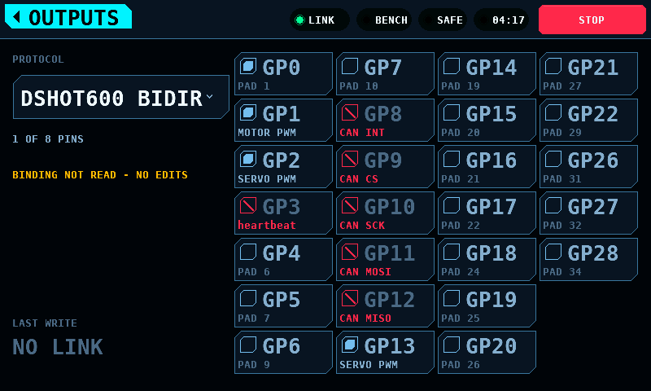

Pages no binding describes do not become readable by reading them again.
`HOLD: UNBIND ALL PINS`, held for 2 s, writes a binding with no pin; the
read-back then shows nothing bound and edits are taken again. It is the one
write the screen sends in this state. A finger that leaves the key, a lift
before 2 s, and leaving the screen abandon the hold.

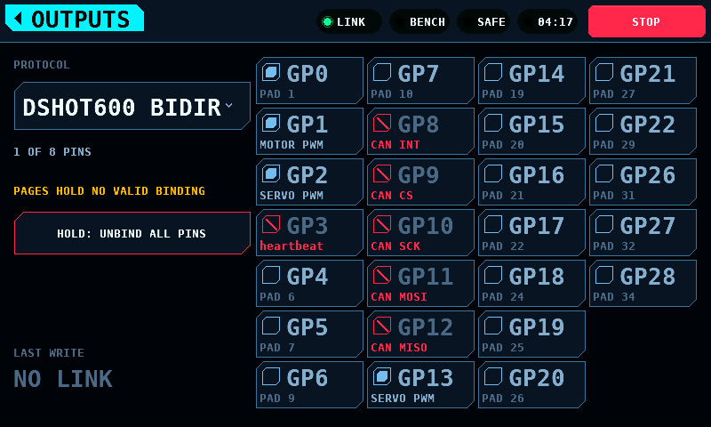

A coprocessor older than 4.10 can be left in this state by a write that
lost a frame part way. A coprocessor speaking 4.10 written by this panel is
not; it shows this state only for pages another host or an older panel left
in its flash.

### Pick a pin

Behind the PICK A PIN key on the Setup screen, and the same binding the
Outputs screen holds. The list answers "which GPIO is bound"; this answers
"where do I put the lead".


The buttons are not the pads. At any size that fits a 480-pixel panel a pad is
under 40 pixels across, which is smaller than a fingertip, so the pads are
drawn where they are and the touching happens on staggered rows of buttons
beside the board, each on a straight trace to its own pad.

A button is coloured the way its cell is on the Outputs screen: this
protocol's pins are accented, a pin another protocol holds is grey, and a pin
the coprocessor reserves has no button at all — it is crossed on the pad,
because a button under a pin that cannot be chosen says it could be.

Down the left are this protocol's pins in channel order; down the right are
the pins other protocols hold, named. The two together read as one run of
channels, because that is what the OUTPUTS page carries.

The protocol is the one selected on the Outputs screen; this screen has no
control for it. A tap on a button writes the binding through the same
sequence as a tick on the Outputs screen, with the same results. While the
binding is not confirmed — a read failed, or the pages describe no binding —
every button is drawn grey, `NOT READ` stands under the protocol's name on
the left, and a tap changes nothing and writes nothing.

Where the pads are comes from the board, not from the panel: the [shape
page](Link.md#page-map) carries the outline, the pitch and the corner pad 1
sits at. A board that does not say is not drawn at all — a picture from a
guessed shape points at the wrong pad as confidently as the right one, and
this screen's whole job is finding a pad on the board in front of you. Its
pins are still on the Outputs screen.

The photograph is separate again. With one, the board on screen is the board
in your hands; without one, the outline and every pad are drawn from the
shape and the buttons are in the same places:


The photograph is fetched over the link once per board and kept in the
panel's flash, so it costs about ten seconds the first time a board is seen
and nothing after that. A board with no photograph, or one whose transfer has
not finished, is drawn rather than left blank.

A servo lead has three wires and the buttons describe one. The other two are
marked on the board itself: a ground carries a white **G**, and a rail carries
its voltage — **5V0**, **3V3**. A rail that is an input rather than a fixed
voltage carries **PWR** instead, because a number that is only sometimes true
is worse here than no number. Pads that are neither, like RUN, are dotted and
left unlabelled.

They are marked inside the outline on a short trace, at two depths so a run of
rails at one end of a row does not draw one label over the next. Inside is the
only room left: the space beside the board belongs to the buttons, and a mark
on the pad itself would be as small as the pad.

These come from the [pads page](Link.md#page-map), which is separate from the
catalogue because they do not fit in it — a page is 32 registers and a
40-pad board has more pads than that between the two. A board that does not
serve it has its grounds and rails unmarked, and a lead is placed by reading
the board rather than the screen.

### The coprocessor keeps it, not the panel

A binding describes wiring, and the panel is not the board the wires are in.
The coprocessor writes the OUTPUTS and CHAN_CFG pages to its own flash and
restores them at boot; the panel never stores a binding and never sends one
unasked. When the link comes up the panel reads the page and shows what is
configured over there. After a panel restart, what this screen shows and what
is driving pins are the same thing.

Restoring configures the outputs. It does not drive them: every driver is
gated on the bank being armed, which the coprocessor grants only while the ARM
register is set, the link is out of failsafe and the heartbeat is trusted, so
a restored binding claims its pins and holds them at idle until somebody arms.
Channel commands are not restored — a configuration survives a power cycle and
a throttle position does not.

The save waits for the bench to stop driving, and then for a gap in the
traffic. Writing flash stops the coprocessor with interrupts off, and it
answers nothing while it is stopped: on the bring-up module a save that
erased and programmed inside one window measured 19,178 us, against a CAN
frame of about 130 us and two frames of buffer in the controller. The erase
and the page program have not been timed apart from each other. A request lost
in that window costs the panel 1000 ms of waiting, which is past the
coprocessor's 200 ms silence failsafe, so one lost frame ends as `FAULT 01`
(`LINK_FAULT_LINK_SILENT`) over a cable with nothing wrong with it.

So the sector is not erased per save. Two sectors hold sixteen records each; a
save writes the next record, and a sector is erased only once every record in
it has been superseded. That erase is taken before the save that needs it: at
boot before the coprocessor starts answering, or on a pass after the save that
first writes into the other sector, once the bus has been quiet for 5 ms. It
is the sector left behind that is erased, not the one just filled, so the
erase and the save that needs it are separated by the fifteen saves in
between. Fifteen saves in
sixteen therefore cost one page program and no erase. How long a page program
takes on the module's flash is not measured; the console line printed after
each save carries it.

A power cut during a save leaves the binding from before it. Each record
carries the number of 0 bits it holds, beside that number complemented. An
erase sets bits and a program clears them, so a record caught in either holds
fewer 0 bits than it claims, and the claim cannot survive a partial write in
either direction. The record being written is therefore rejected rather than
probably rejected, the record before it is still the newest good one, and the
sector being erased is never the one holding the record still wanted.

Pages the screen cannot describe — one pin in two slots, a rate no entry
offers, a pin that is not on the header — are shown as such and not as
nothing configured: see [A binding that is not
confirmed](#a-binding-that-is-not-confirmed).

## Balancing

Described on its own page: [Balancing](Balance.md).

## Screens that are not ready

A tile marked SOON names what the screen will do and the part or decision it
waits on.
