# Screens

<sub>**English** · [Deutsch](Screens-de.md)</sub>

What is on every screen, what the menu marks mean, and how each screen is
operated.

## The status band

The top band is shared by every screen. From the right: STOP, the run clock
(while ARMED or after a run), the arm chip, a FAULT code when one is reported,
the mode, and LINK or NO LINK. The mode is BENCH while the link is up and the
panel drives the IOmcu's outputs, and SIM while no IOmcu answers
and the panel runs on its own models.

The arm chip names what the switch to ARMED drives:

| Chip | Outputs that drive |
| --- | --- |
| SAFE | none |
| ARMED MOTOR | the throttle outputs, from MOTOR & ESC's ARM or a stick run on its PROGRAM; no surface and no programming port |
| ARMED SERVO | the surfaces and a pulsing PROG PORT, from SERVO; no throttle output |
| ARMED | every bound output, on an IOmcu older than protocol 4.18 |

STOP works on every screen. It switches to SAFE and latches: the bench stays SAFE
until it is ARMED again. Navigating away, an alert expiring or the link
recovering does not clear a stop.

ARM is at the bottom of a bench screen; STOP is at the top of the band.

A touch belongs to what it came down on until it lifts. The band is the top
48 px of the panel.

- A touch that comes down on the band stays the band's. Sliding it down into
  the screen moves nothing there, and lifting it there presses nothing.
- A touch that comes down on the screen and slides up into the band is
  released at the last point it had on the screen. A drag on a slider or on
  the SERVO dial ends with the value it had at that point, and the distance
  travelled on the band is not added. A hold on ARM or OUTPUT ON is abandoned.
  A button, a key, a tile, a tab or a list row under that point is not
  pressed: the release is the panel's and not the finger's. Three controls
  take it, because they stop something: DISARM, OUTPUT OFF and START TEST
  while a servo test runs. The touch is not picked up again when the finger
  comes back down onto the screen; lift and press again.
- A contact that is more than 120 px (the x and the y distance added) from
  where the previous report had it is taken as a lift there and a new press
  here. The touch controller is read every 10 ms; its report interval on the
  panel is not measured. That lift presses nothing either, with the same
  three exceptions and STOP. The new press is a press like any other, except
  on a key of the SETUP list, where it scrolls and steps nothing.
- STOP and the home tag answer to a press that lands on them. A finger that
  slides onto STOP from the screen stops nothing.
- A second finger on STOP, on the home tag or on the alert band is answered
  while the first finger drags. After the home tag, the finger still on the
  glass moves nothing on the screen the tag leads to.

Current limitation: the chips stand from STOP to the left. A row that would
reach x 226, where the widest home tag (MOTOR & ESC) ends, starts each label
16 px into its chip instead of 24 px. One row is still wider and reaches
under MOTOR & ESC's home tag: ARMED with a FAULT code, down to x 224, in
German down to x 216. A tap there acts on the home tag, not on the chip.

The home tags end at x 226 (MOTOR & ESC) and at x 210 or less on the other
screens.

### Chip help

A tap on a chip of the band opens a box under the band that says what the
chip's state means for the bench and what to do: LINK or NO LINK, the mode,
FAULT, the arm chip and the run clock. The box opens 4 px under the band at
the tapped chip's left edge, moved left as far as it needs to stay 8 px
inside the panel. It is 520 px wide; FAULT's box spans the panel (784 px),
with one paragraph per set bit. No box reaches into the band, so none covers
STOP, and none reaches the alert band.

- A tap opens it: press and lift on the same chip. A press that slides off
  the chip before it lifts opens nothing.
- The text follows the state while the box is open. A fault that appears
  shows at once, one that clears goes, and a box follows its chip when the
  run clock appears and moves the chips.
- A box whose chip goes closes: FAULT when the faults clear, the run clock
  when it goes.
- Any tap closes it and does nothing else. A tile, a button, another chip or
  the alert band under the finger is not pressed.
- STOP is the exception: a press on STOP closes the box and stops at once,
  as with no box.
- Leaving the screen closes it.
- A finger dragging on the screen when a second finger opens a box is
  released as at the band's edge.

While the link is up and the IOmcu has refused link frames, the LINK
box ends with the count, the same line MOTOR & ESC shows in its header
strip: `Rejected link frames: 37` ([Refused frames](Link.md#refused-frames)).
The line follows the count while the box is open and goes with the link.

The FAULT box names each bit, its code and what it means:

| Code | Bit | Set by this release |
| --- | --- | --- |
| 01 | LINK_SILENT | the IOmcu heard no request for 200 ms; stays until the next arm |
| 02 | OVERCURRENT | never |
| 04 | OVERTEMP | never |
| 08 | STALL | never |
| 10 | HEARTBEAT | the safety line from the panel stopped: after any STOP until the next arm, a pressed emergency stop or an open heartbeat wire |
| 20 | VERSION | never |
| 40 | STORE_OFF | the IOmcu cannot write its flash this boot |

For a bit this release never sets, or one the panel has no name for, the box
says to flash both boards from one release.

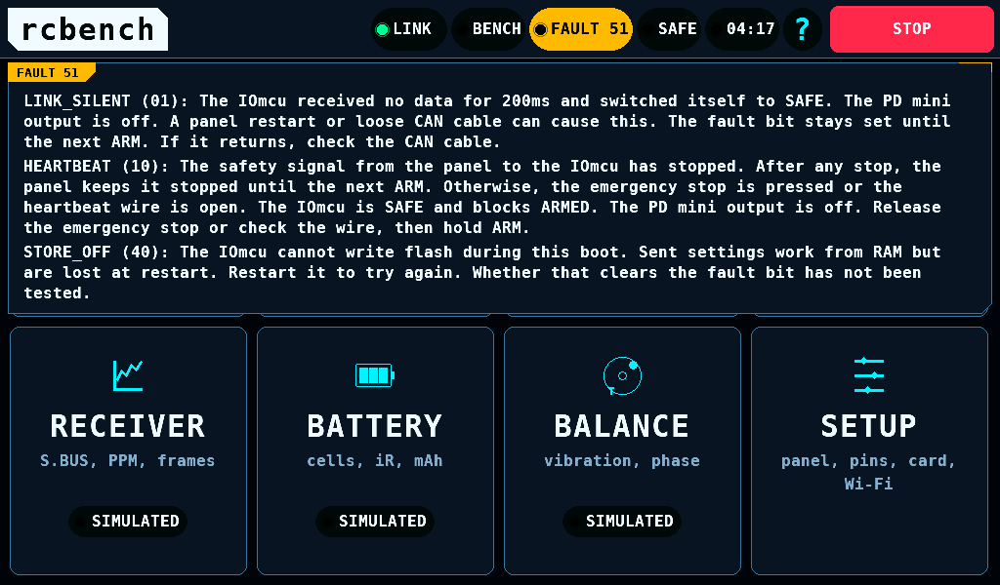

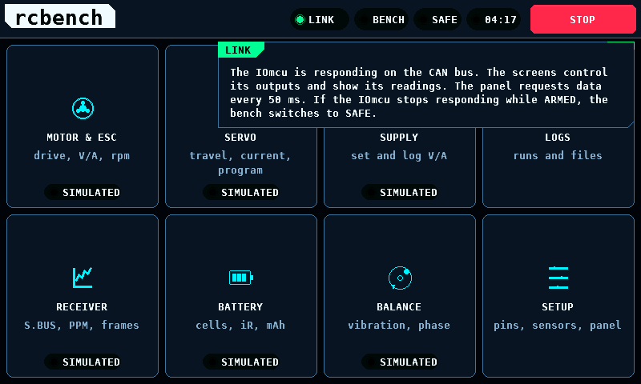

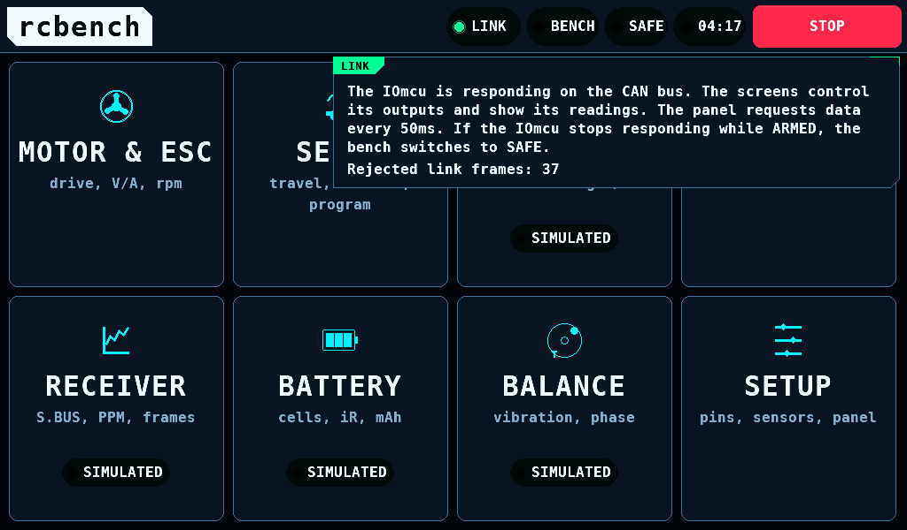

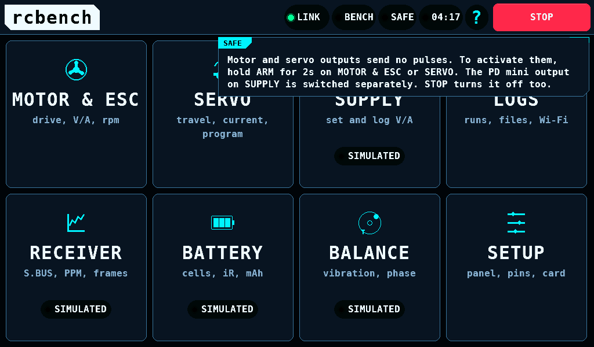

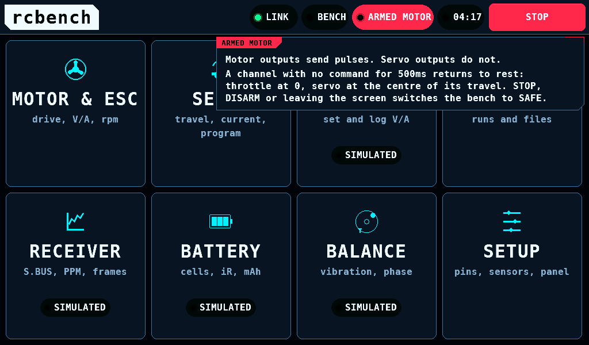

## The alert band

A fault the screen itself does not show appears in a red band, 34 px high,
across the bottom of every screen that has the status band. It covers the
bottom of the screen, ARM included, while it shows.

- It clears 30 s after the frame it arrived in. A new alert, even with the
  same text, starts the 30 s again.
- A tap on the band clears it earlier: press and lift on the band, marked
  with an `x` at its right end. The screen beneath receives neither that tap
  nor a second finger's on the band; only the first finger's lift clears.
- An alert that arrives while a finger is on the band is not cleared by
  that lift.
- "Touchscreen not responding. ARMED is blocked.", shown at start, stays
  until restart and has no `x`: no touch is there to tap with. A later alert
  shows over it; once that one clears, it shows again.

## Menu marks

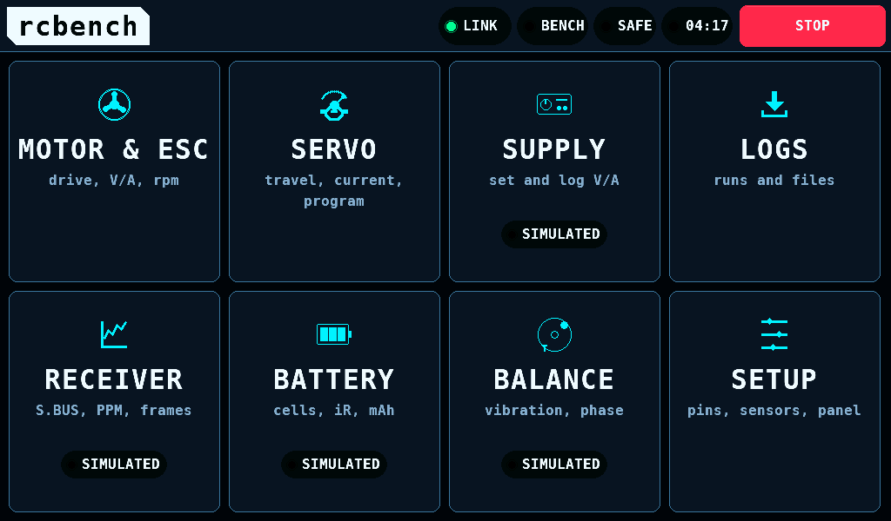

The menu is a grid of 4 columns by 2 rows, each tile 190 x 204 px with 8 px
margins. The first row holds the workbenches, MOTOR & ESC, SERVO and
SUPPLY; the second the instruments, RECEIVER, BATTERY and BALANCE; the last
column LOGS over SETUP. A fourth workbench or a fourth instrument fails the
build at 4 columns (`shared/ui/overview_screen.c`). Programming has no tile:
it is the PROGRAM task of MOTOR & ESC and of SERVO.

Each tile carries a line under its name, 2 rows of at most 23 characters:

| Tile | Line |
| --- | --- |
| MOTOR & ESC | drive, V/A, rpm |
| SERVO | travel, current, program |
| SUPPLY | set and log V/A |
| LOGS | runs and files |
| RECEIVER | S.BUS, PPM, frames |
| BATTERY | cells, iR, mAh |
| BALANCE | vibration, phase |
| SETUP | pins, sensors, panel |

A tile marked SIMULATED opens a screen whose source the bench does not
report: the IOmcu reports no capability for it, or its sensor is not
enabled on SETUP under INTERFACES. A screen without its hardware opens and runs
from the model. The mark does not classify each value on a screen. RECEIVER
and BATTERY carry the mark and show no values. SERVO without the mark shows the
panel's supply model as its rail meter when neither a PD mini nor an INA3221 is
enabled. Each screen names the source of its readings itself.

| Tile | Without the mark when |
| --- | --- |
| MOTOR & ESC | the IOmcu drives ESCs and holds an INA228 set-up enabled on SETUP, INTERFACES |
| SERVO | the IOmcu drives servo PWM outputs |
| SUPPLY | the PD mini is enabled on SETUP, INTERFACES, whatever the IOmcu reports; otherwise the panel runs its own model of a supply |
| RECEIVER, BATTERY, BALANCE | never in this release: no IOmcu reports these capabilities |
| LOGS, SETUP | always: they hold no measurement |

The capability bits come from the IOmcu at bring-up. With no IOmcu
answering, MOTOR & ESC and SERVO carry the mark too.

The menu in the light theme:

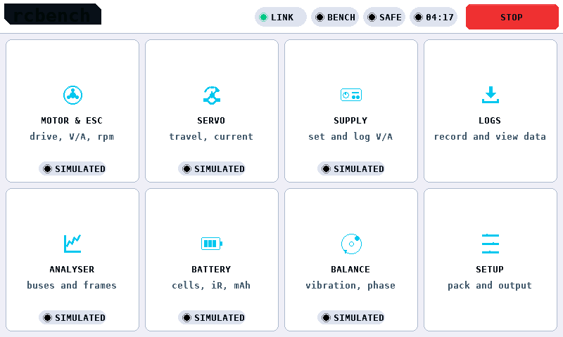

## Splash

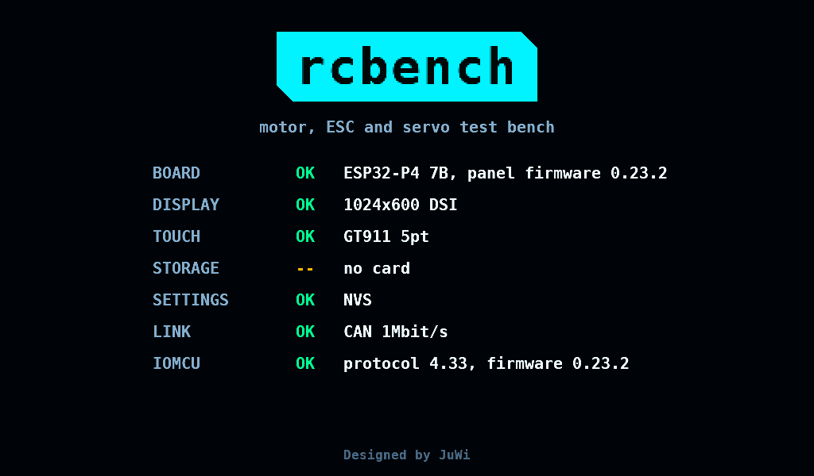

Each subsystem reports its result as it comes up: board, display, touch, SD
card, settings, link, IOmcu. The board line carries the panel's own
firmware version, and the IOmcu line carries the protocol version and
the firmware version that the IOmcu reported -- two boards can speak
the same protocol and be different builds, and this is where that shows.

A missing card or an unusable NVS (non-volatile storage) is a warning. A
touch controller that does not answer, or an IOmcu with a different
protocol major version, is a failure and the bench does not switch to ARMED.

When every step has answered, the splash hands over to the menu after a hold
of 1.6 s; a tap skips the hold.

## Motor & ESC

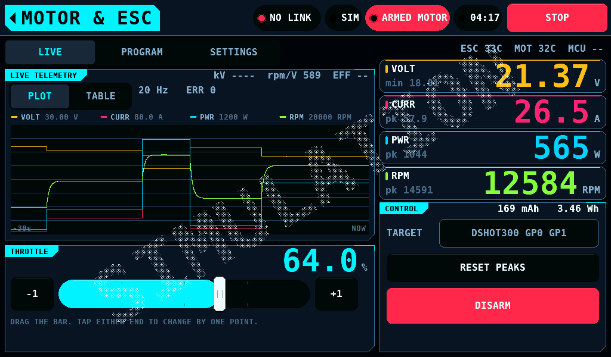

MOTOR & ESC is a workbench: a strip of tasks at the top, LIVE, PROGRAM and
SETTINGS (German `LIVE`, `PROGRAMMIEREN`, `OPTIONEN`), each 112 x 24 px, and
a page under it. The menu's tile always opens LIVE. A tap on a tab switches
the task; a switch is no navigation level and leaves LIVE's view, PLOT or
TABLE, as it was.

| Task | The left column, 546 px |
| --- | --- |
| LIVE | the plot or the table over the throttle |
| PROGRAM | the list of ESC programmers; a row opens its session over the whole body ([PROGRAM](#program)) |
| SETTINGS | the 8 ESC settings under PACK, MOTOR and THROTTLE OUTPUT ([Settings](#motor--esc-settings)) |

Two columns. The page takes the left, the four readouts and the CONTROL card
take a rail of 236 px on the right, so reading the numbers and working the
throttle do not compete for the same part of the screen. The rail is the same
on LIVE, PROGRAM's list and SETTINGS, and ARM works on all three; a session
opened from PROGRAM covers it. With the rotary knob on, turning it moves the
throttle on LIVE ([the knob](#panel-the-rotary-knob)); on PROGRAM and
SETTINGS a turn moves nothing.

The home tag climbs one level at a time:

| From | The home tag leads to |
| --- | --- |
| the keypad on SETTINGS | SETTINGS; the value is not changed |
| a session on PROGRAM | one level up in the session; from its top, PROGRAM's list ([PROGRAM](#program)) |
| LIVE, PROGRAM's list or SETTINGS | the menu; the bench switches to SAFE |

### TARGET names the protocol and the pins

The CONTROL card opens with the TARGET row: the label, 64 px, and a value box
of 18 characters that names what the throttle drives, the protocol and then
the pins, `DSHOT300 GP0 GP1`. They are the pins bound as MOTOR PWM or as a
DShot protocol, read from the same SETUP > OUTPUTS pages the IOmcu's throttle
role reads. The pins are in pin order; those that do not fit are counted.
With GP0 to GP7 bound as DSHOT300 it reads `DSHOT300 GP0 +7`.

| TARGET reads | Condition |
| --- | --- |
| `DSHOT300 GP0 GP1` | one protocol drives every throttle pin |
| `MIXED GP0 GP4` | the throttle pins run on two or more protocols, or one of them on a rate no OUTPUTS protocol has |
| `GP0 GP1` | every throttle pin runs on a rate no OUTPUTS protocol has |
| `NO MOTOR PIN` | the binding is read and no pin is bound as a motor; warning colour |
| `PINS NOT READ` | no binding was read: the link is down, the pages did not read, or no pin map exists for the board; warning colour |

The throttle still moves in the two warning states. ARM switches the whole
bank to ARMED, not only the pins named here.

A tap on TARGET opens [OUTPUTS](#outputs) on the protocol the throttle's
pins are bound as, on the overview while they are bound as several or none
is known. Leaving switches the bench to SAFE,
as every way off the screen does. The home tag on OUTPUTS returns to MOTOR &
ESC on the task TARGET was tapped on; any other screen opened in between
makes the next entry a tile's, on LIVE. TARGET takes no tap, and is drawn
with the locked edge, while any of these holds:

| Condition | Why |
| --- | --- |
| ARMED, an ARM asked and not answered, or a DISARM asked and not answered | a binding changes the pins the bench drives |
| ARM held | the press is ARM's |
| the [servo programmer](ServoProgrammer.md) holds a port | ARM is locked for the same reason |
### The plot covers one run

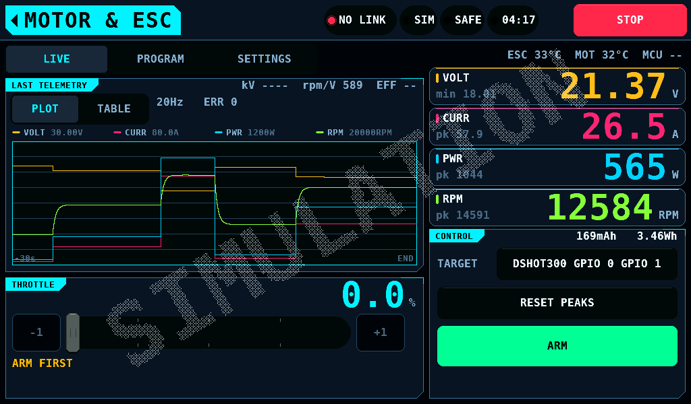

The trace is the record of a run. It advances only while the bench is ARMED:
switching to ARMED clears it, switching to SAFE holds it as it stood. The panel tag reads
`LIVE TELEMETRY` while it advances, `LAST TELEMETRY` while it holds a run, and
`TELEMETRY IDLE` before the first switch to ARMED, when the plot reads `No run recorded yet.`.
The right-hand axis label reads `NOW` while it advances and `END` where a held
one stopped. The readouts, the TABLE pane, the totals and the temperature
strip are live at all times, ARMED or not.

The window is 534 columns at 20 samples per second, 26.7 s. A longer run holds
its last 26.7 s; what came before is in the CSV file and not on the screen.

The trace ends at the switch to SAFE, not when the motor stops. Switching to SAFE commands
zero throttle and the propeller coasts down after it. That coast-down is on
the readouts and not on the plot, and not in the CSV file either, which closes
on the same edge.

Switching to ARMED clears the plot, and a latched stop is cleared by switching to ARMED, so the trace
of a run a STOP ended does not survive making the bench usable again. One
switching to ARMED writes one CSV file, and LOGS plots it.

On LIVE the line under the strip carries PLOT and TABLE, the poll rate, the
link's error count (cyclic redundancy check failures and resyncs added
together) and three temperatures. ESC and MOT come from the bench page. MCU
is the panel's own die, read from the ESP32-S3's sensor: it is the display
board's temperature, not the IOmcu's. While the link is up and the IOmcu has
refused link frames since its power-up, the line shows how many after the
error count: `Rejected link frames: 37`. An IOmcu older than protocol 4.21
sends no count, and the line shows none
([Refused frames](Link.md#refused-frames)). On SETTINGS the line holds the
temperatures alone, over the rail.

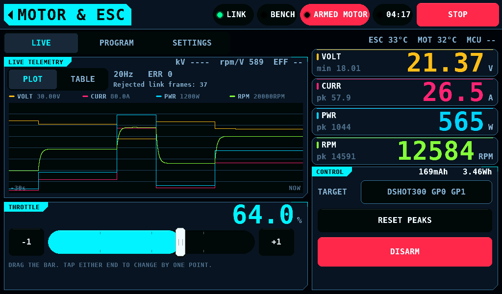

The throttle moves by how far a finger travels, not to where it lands. A press
on the track commands nothing, so a touch at the far end asks for nothing; a
drag across the whole track asks for the whole span, and the pin follows it
unramped. `-1` and `+1` at the ends of the track step one percentage point.

The throttle changes only while the bench is ARMED. What each control does:

| Control | SAFE | ARMED |
| --- | --- | --- |
| The track | refused: no command, the slider and the readout stay; drawn dimmed | moves the throttle by the finger's travel |
| `-1`, `+1` | refused; drawn dimmed | step one percentage point |
| Rotary knob | refused; the turn is not kept | moves the throttle from its value |
| ARM | switches the throttle outputs to ARMED after its 2 s hold; drawn disabled and without effect while the [servo programmer](ServoProgrammer.md) holds a port | switches to SAFE on a tap |
| RESET PEAKS | resets the peaks | resets the peaks |
| PLOT, TABLE | switch LIVE's view | switch LIVE's view |

While SAFE, the line under the track reads `ARM FIRST`. The refusal runs
from the switch to SAFE until the bench reports ARMED: a control touched after
the ARM hold completes and before that report is refused too. From a DISARM the
screen asks for, by the tap or by leaving, or a STOP while the bench is ARMED,
until the bench reports SAFE, the controls are refused too.

A switch to SAFE returns the throttle to 0 %, however it happens: the DISARM tap,
STOP, a lost link, a touch controller that stops answering, or leaving the
screen. The slider, the readout and the `-1` and `+1` steps then stay at
0.0 % until the next switch to ARMED, so the first `+1` after a switch to ARMED asks for 1.0 % and
the first 1 % turn of the knob asks for 1.0 %. A bench switched to ARMED without the ARM
hold, by a stick run on PROGRAM, starts from 0 % as well. A throttle the
screen has posted and the panel has not sent when the bench switches to SAFE is not
sent. A finger on the track when the bench switches to ARMED or to SAFE moves nothing
until it lifts and presses again.

ARM is a hold. The fill fades from green to the danger red across two
seconds, and the bench switches to ARMED when the fade completes; letting go before then
switches nothing, and the release itself switches nothing either.

The finger has to stay on the button. One that leaves it abandons the hold,
because the gesture is contact with the control and not with the panel.
Coming back is not resuming: the contact is finished as far as ARM is
concerned, so a switch to ARMED after that takes lifting the finger and pressing again.
A bench that switches to SAFE under a finger still held on the button ends the gesture
too — otherwise the contact made to stop it would switch it to ARMED again two seconds
later. The switch to ARMED flashes the
whole button twice: white, black, red, and again, one drawn frame each. While ARMED, the button carries the danger red, and DISARM is a press rather than a hold:
stopping never needs a hold. DISARM and STOP stop the output immediately, with
no ramp. RESET PEAKS clears the peak markers and leaves the live readings.

### EFF is a guessimetric

The telemetry panel's header shows the rated kV, the revolutions per minute
per volt the motor is actually turning, and EFF, the second divided by the
first.

The arithmetic behind it is sound. Terminal voltage divides into the resistive
drop and the back electromotive force (back-EMF), so rpm/V under load is the
rated kV scaled by the fraction of the voltage that reaches the back-EMF, and
that fraction is the fraction of the input power that becomes mechanical. In
an ideal motor the ratio is the conversion efficiency exactly.

The number on the screen is not that, for three reasons, and it is labelled
EFF rather than efficiency because of them:

- It accounts for copper loss (I squared R) only. Iron loss, friction and
  windage fall on the mechanical side of the split, so the figure is an upper
  bound on shaft efficiency rather than a value of it.
- The bench measures pack voltage, not the motor's terminals, so the ESC's
  conduction and switching losses are inside the figure. It describes the
  drivetrain, and comparing it against a motor datasheet compares two
  different things.
- It is only as good as the rated kV. An error there maps straight into the
  percentage, and a figure above 100 % means the rated value is wrong; the
  screen shows that rather than hiding it, capped at 199 %.

The rated kV comes from the connected ESC when it reports one. No ESC reports
it yet, so in practice it is the `Rated kV` setting, which defaults to zero: a
guessed kV produces a plausible-looking percentage that is wrong, so with no
value the field is drawn empty and no percentage is shown. The measured rpm/V
is shown either way, being a measurement rather than an inference.

While the values are simulated, SIMULATION is drawn across the screen. The
panel simulates only while no IOmcu answers, so the watermark goes when
one does. What replaces it is what that IOmcu can actually measure: rpm
from bidirectional DShot today, and its own sensors when a measurement front
end is fitted. A quantity nothing measures is drawn as an empty field rather
than as a modelled number.

### TABLE, and what the ESC says

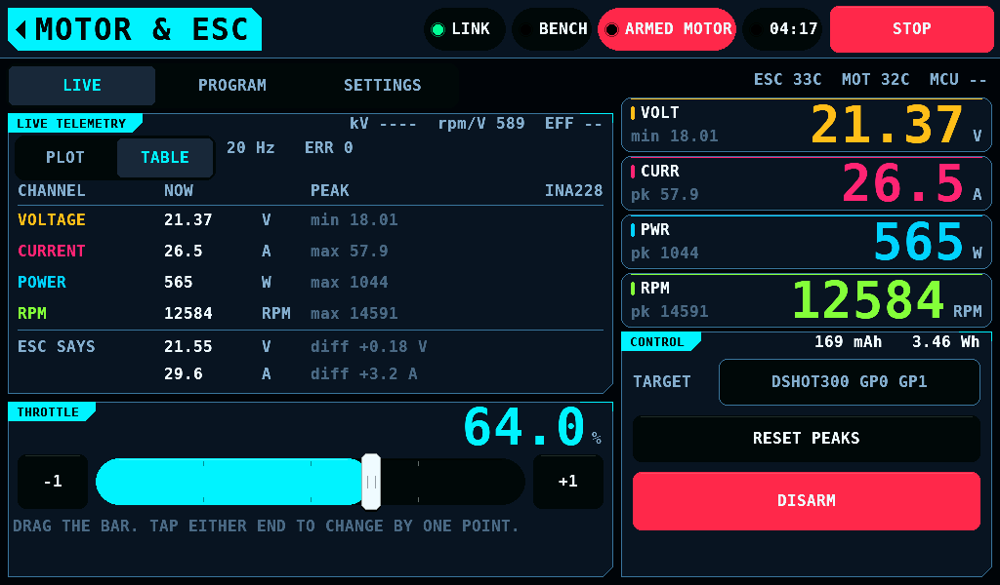

TABLE lists the four channels, each with its extreme. A channel nothing
answered for reads `--`.

With the INA228 enabled on SETUP under INTERFACES and answering (BENCH flag
bit 5), voltage, current and power are the INA228's: the means of the
IOmcu's last 50 ms window, read at 20 Hz, with the run's peaks from its
500 Hz samples. The heading names the source, `INA228`, and adds `CLIPPED`
while a current read the end of the part's range in the last window or since
the switch to ARMED: current and power, or their peaks, are then bounds and not values.
Under the channels, `ESC SAYS` lists the ESC's own telemetry voltage and
current from the SENSE page, and `diff` is the ESC's figure less the
INA228's. An ESC that reports a current it does not measure shows a
difference the size of the reading. An INA228 that stops answering during a
run leaves voltage, current and power empty to the end of that run; they do
not fall back to the ESC's figures. The peaks it measured in that run stay
shown, here and on the rail. Without the INA228, the channels are the
ESC's telemetry and `ESC SAYS` is not shown.

The mAh and Wh under ARM are the INA228's own while BENCH flag bit 6 is
set: its charge and energy since the switch to ARMED, accumulated in the part at every
conversion and read in 0.01 mAh and 0.01 Wh steps. The IOmcu takes
the last run's totals and bit 6 off the bench page on the switch to ARMED, and the panel
counts the first 100 ms of a run itself as well, so a page built before the
switch cannot carry the last run's totals into this one. Without bit 6 the panel counts both from the current
and power shown. When the INA228 stops
answering mid-run, the count carries on from its last total and does not go
back.

A run's CSV file has one row for every sample the panel takes, and no row
without one:

- With the link up a sample is one answered read of the BENCH page. The
  panel polls every 50 ms plus the 5 ms pass of its control task that looks
  at the gate and the pass's own exchanges: 52.9 ms on average on one bench,
  about 19 rows per second. Other benches are not measured.
- With the link down a sample is one step of the model, every 50 ms.
- A sample is one row. With the INA3221 read through the window ring
  (IOmcu protocol 4.11, CH1 enabled) a poll that brings more than one
  50 ms window writes one row for each: the rows of one poll carry the same
  `time`, the sample is in the last of them with the newest window, and the
  rows before it hold `window` and the channel columns and are empty
  otherwise. At a 53 ms poll one poll in 17 writes two rows.
- Nothing else gates a row. A row the card's queue cannot take is dropped
  and counted, and the band says so at the run's end (see [Logs](#logs)).

`time` is the wall time since the switch to ARMED in seconds, written to 1 ms, and is
not a row count: the first row is not at 0, and a stretch without samples or
with dropped rows is a step in `time` of that length. The value keeps 1 ms
of resolution for the first 4.5 h of a run and 2 ms up to 9.1 h.

A file written by firmware 0.15.0 or older differs in two ways. Rows are
missing in stretches of up to 30 s after a servo command, and
`time` advances only with a written row, so it ends short of the run's
length and shows no gap. In such a file the `window` numbers, 50 ms apart,
give the spacing of the rows while the INA3221 is enabled.


```
time (s);voltage (V);current (A);power (W);rpm (rpm);esc (C);motor (C);charge (mAh);energy (Wh);ina voltage (V);ina current (A);esc current (A);window;ch1 current (A);ch1 max (A);ch1 voltage (V);ch2 current (A);ch2 max (A);ch2 voltage (V);ch3 current (A);ch3 max (A);ch3 voltage (V);source
```

`voltage`, `current` and `power` are what the screen shows. `source` is
`measured` on a row whose values a meter produced and `model` on a row the
panel's model produced (the SIMULATED mark); a supply file has the same last
column. A file without the column ends at `ch3 voltage` or `energy`, and
LOGS and the tools read both forms: `source` is a
text column and is never plotted. `ina voltage` and
`ina current` are the INA228's and are empty while it is not the source;
`esc current` is the ESC's own telemetry current, from the SENSE page while
the INA228 is the source and from the BENCH page otherwise, and empty when
the ESC reports none or the panel models the bench. A quantity nothing
measured is an empty cell. `window` and the nine channel columns are the
INA3221's 50 ms window -- per channel the mean and highest current and the
lowest bus voltage -- on the first row after the panel read it and on no
other, so each window is in the file once, under its number; a channel the
window has no readings of is empty, and so are CH1's current cells or its
voltage cell for a window that holds no sample of that quantity. With an
IOmcu of protocol 4.11 and
CH1 enabled every CH1 window is in the file while two reads lie at most
200 ms apart, and a step in `window` of more than 1 is a window that was
lost or a number the IOmcu skipped. A window taken while the bench
was SAFE is in no file. CH1's figures count a clipped sample at the end
of the range, 1.638 A on the 0.1 Ω shunt, and keep the sign of a negative
current. CH2 and CH3 are on the row of their window when the panel read
both pages within that window, and empty on a row the poll caught up. With
an older IOmcu, or with CH1 off, the columns hold the last window of
each read: a poll longer than 50 ms skips windows, 1 in 17 at 53 ms, and a
clipped sample is left out of the figures. LOGS groups `ina voltage`,
`ina current` and `esc current` under INA228 and ESC, and the window's
columns under INA3221.

### MOTOR & ESC settings

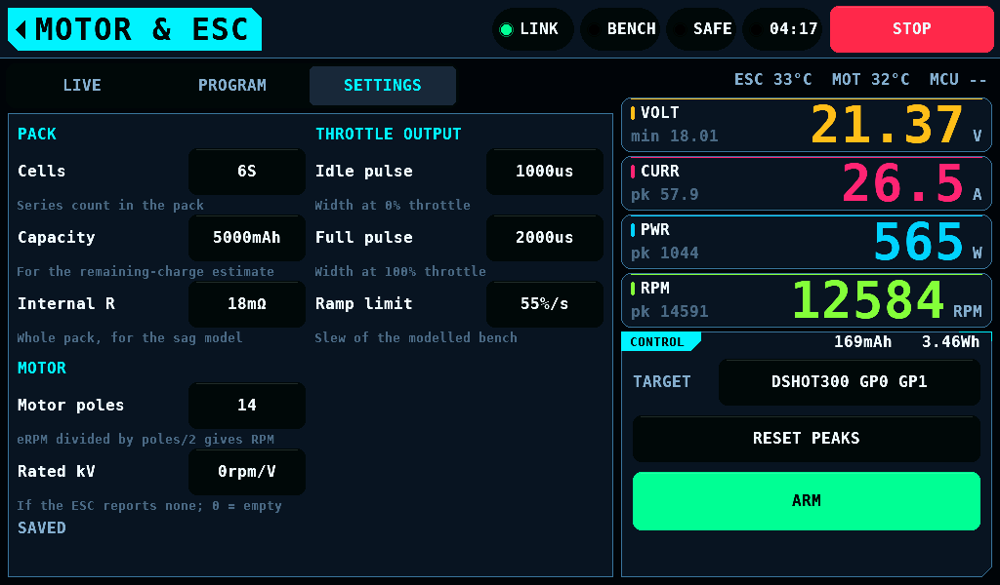

SETTINGS holds the 8 settings of the motor, the pack and the throttle
output (`SET_CAT_ESC` in the settings schema) in schema order, under three headings:

| Heading | Settings |
| --- | --- |
| PACK | Cells, Capacity, Internal R |
| MOTOR | Motor poles, Rated kV |
| THROTTLE OUTPUT | Idle pulse, Full pulse, Ramp limit |

A row is 34 px: the label, the help line, and the value with its unit in a
box of 100 x 28 px. A tap on the box opens the keypad over the left column
and the strip, 546 x 423 px, so no tab switches the task under it; the rail
stays in reach. The keypad names the setting, its range and its unit. OK
takes a value inside the range and lands it on the setting's step, 4321 mAh
as 4300 mAh; outside the range it keeps the keypad open and names the range
in the warning colour. CANCEL and the home tag close it with the value
unchanged.

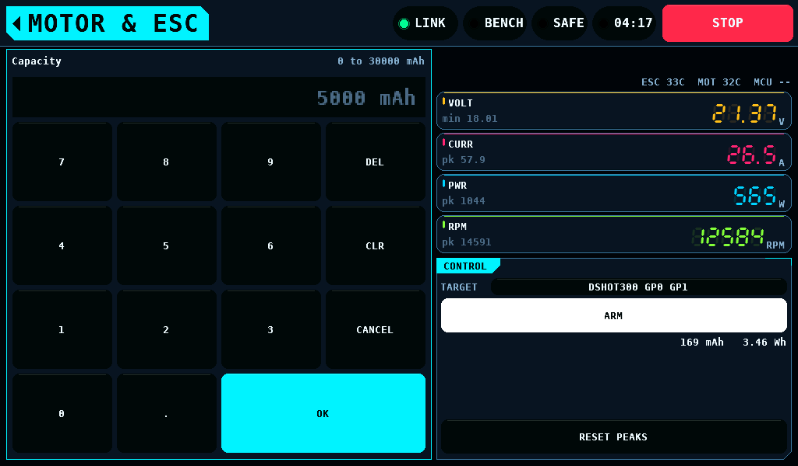

Idle pulse and Full pulse take a value on a SAFE bench only: the IOmcu takes
the endpoints while it is disarmed, 300 ms after the last edit, and the
switch to ARMED sends none. While the bench is ARMED, ARM is held, or an ARM
or a DISARM waits for its answer, their help line reads `Set on a SAFE bench
only` in the warning colour and the box takes no tap; a keypad open for one
closes when ARM is pressed or the bench leaves SAFE. The 2 s hold of ARM
leaves an edit made before the press the time to reach the IOmcu. While an
edit is still owed to the IOmcu with the link up, the switch to ARMED is
refused with `Pulse range not yet sent to the IOmcu. Hold ARM again.` and
the bench stays SAFE. A pair the IOmcu refused, or stored otherwise, keeps
the switch refused with a text that names what to change, until an edit
here, a binding on OUTPUTS or a link-up brings the pair into force ([A
pulse range on its way](Safety.md#a-pulse-range-on-its-way)). The other 6 rows take a value at any time.

The settings are one store. Every value OK sets is in force at once and asks
for a write; the panel writes the whole store on the first frame with the
bench SAFE, the supply output off and no board drawing being fetched or
kept, the same write SETUP's SAVE asks for ([Keeping the
values](#keeping-the-values)). A value left unsaved on SETUP is written with
it, so SETUP has nothing left to warn about. A refused write leaves every
value unsaved, and SETUP's warning on leaving lists the ESC rows with its
own. The line under the rows names the store's state:

| Line | State |
| --- | --- |
| `SAVED` | nothing is unwritten |
| `SAVE PENDING` | a write is asked and waits for a quiet bench |
| `NOT SAVED` | the last write was refused |
| `SETUP CHANGES NOT SAVED` | values are unsaved and no write is asked; the next change here writes them |

### PROGRAM

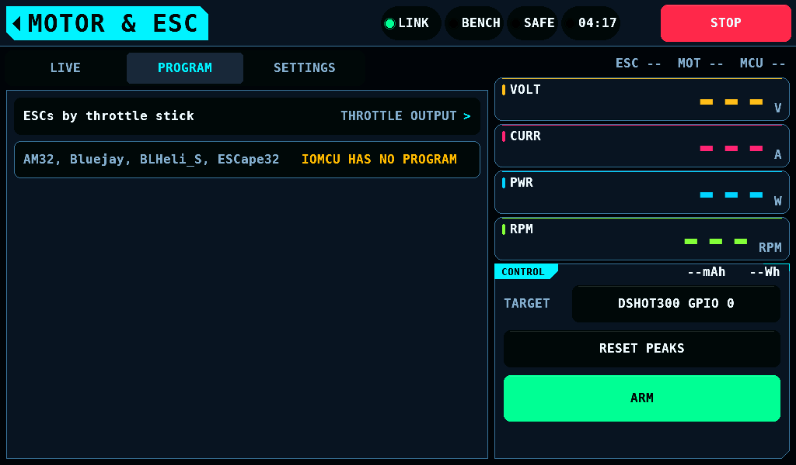

PROGRAM in the strip shows the list of ESC programmers in the page area, from
the table SERVO's list comes from (`shared/ui/prog_registry.c`,
[Programmer](#programmer) on SERVO). The list has one row, `ESCs by throttle
stick` (German `ESCs per Gasknüppel`), in the group STICK MENU (German
`STICK-MENÜ`); a list draws its group headings only above 8 rows. The row's
right side reads `THROTTLE OUTPUT >`: it drives the pins bound as throttle,
not a programming port, and needs no IOmcu capability. The output card stays
on the right while the list shows.

A tap on the row opens ESC STICK, one level down. ESC STICK is a full-width
session: it covers the left column, the rail and the strip's tabs, and no
press reaches ARM or a tab while it is open. Opening it on a bench that is
not SAFE switches the bench to SAFE, a DISARM held by another finger
included. The strip row holds the output
strip in their place, one line of 16 px from x 12:

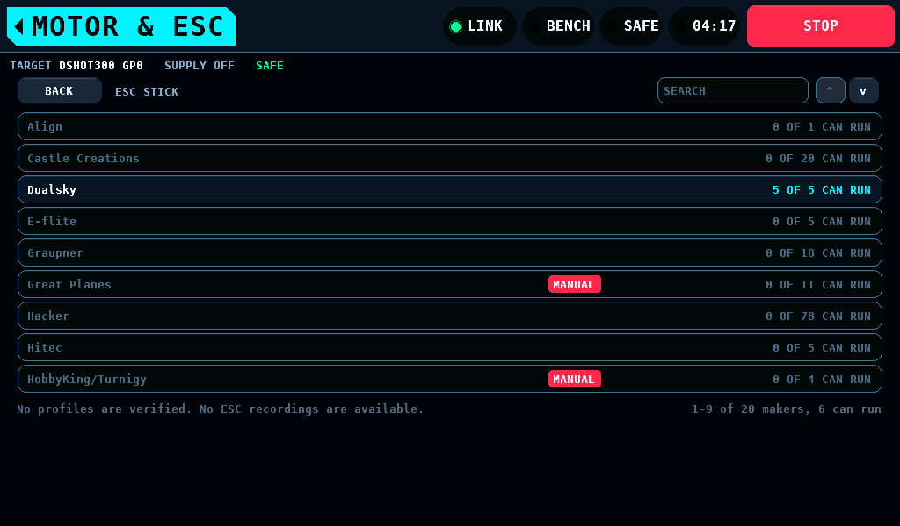

```
TARGET DSHOT300 GP0 GP1   SUPPLY 7.60 V  1.00 A   SAFE
```

| Part | Shows |
| --- | --- |
| `TARGET` (German `ZIEL`) | the protocol and the pins bound as throttle, as the CONTROL card's TARGET row names them, in at most 26 characters; in the warning colour while no pin is bound or the binding is not read |
| `SUPPLY` (German `NETZTEIL`) | the PD mini's output as it reads: `SUPPLY 7.60 V  1.00 A`; `SUPPLY ON` while it is on without a voltage and a current reading; `SUPPLY OFF`; `SUPPLY --` while the supply does not answer |
| `SAFE` or `ARMED` | the bench; ARMED in the danger colour |

The strip is at most 97 characters, 776 px, in English and in German. It is
repainted when its text changes.

From ESC STICK's makers the home tag closes the session to PROGRAM's list;
from the list it leaves for the menu. Leaving MOTOR & ESC from any level ends
a stick run, switches off the supply output the run switched on, switches the
bench to SAFE and closes ESC STICK. Back on MOTOR & ESC, PROGRAM shows its
list.

The parameter tables for ESCs with BLHeli_S, AM32, ESCape32 and VESC firmware
and for Hitec D-series servos are a model in the firmware
(`shared/ui/prog_models.c`). No transport carries their protocols, and no
PROGRAM list has a row for them. The bench identifies and drives ESCs with
BLHeli_32 firmware and sends the DShot special commands, but cannot read
their parameters: [Parameters of ESCs with BLHeli_32 firmware](BLHeli32.md).

### ESC STICK

ESC STICK programs an ESC through its throttle-stick menu, from an ESC
profile; [Stick programming](StickProgramming.md) describes the runs.

Every control on ESC STICK takes a tap. It acts when the finger lifts
inside the control it pressed, no more than 8 px from the press in x and in
y. A finger that comes down on a control and travels on presses nothing, and
neither does one that crosses a control. One finger at a time presses a
control. Three controls act on the press:

- HOLD TO RUN: its 2 s hold starts at the press.
- ABORT of a stick run, on the run's page and on a manual step's prompt. It
  stops a motor, so it does not wait for the lift, and it answers a second
  finger.
- The keys of the search keyboard, which follow their own press and lift.

BACK and the band's home tag climb one level at a time: a stick profile's
page to the list, a maker's models to the makers, the makers to PROGRAM's
list. Over the RUN warning the home tag is CANCEL, and over the manual steps
it is OK. On a stick run under way it is ABORT: the run ends, and its result
stays on the page.

The list shows the makers first, alphabetical, each with how many of its
models run:


A maker opens its models, one row a model, by current, then voltage, then
name, each with its family and what the profile is or why it does not run.
A model opens its family's profile:

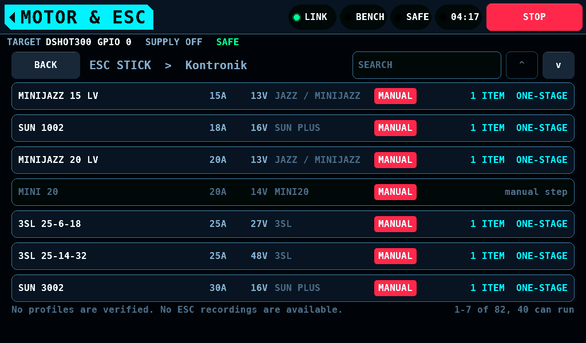

SEARCH filters the level showing. Its keyboard docks on the right, the rows
narrow beside it, and every key filters at once. A model is found when the
text appears in its maker and family read as one text, or in its maker and
its own name; a maker shows when any of its models is found. Case does not
matter, and `*` stands for any run of characters:

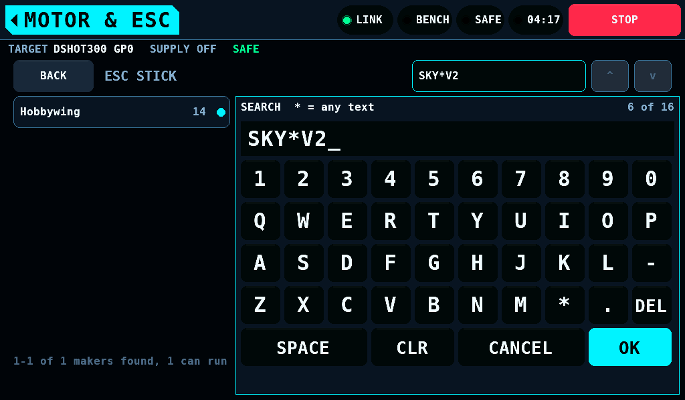

OK keeps the search on both levels, X clears it:

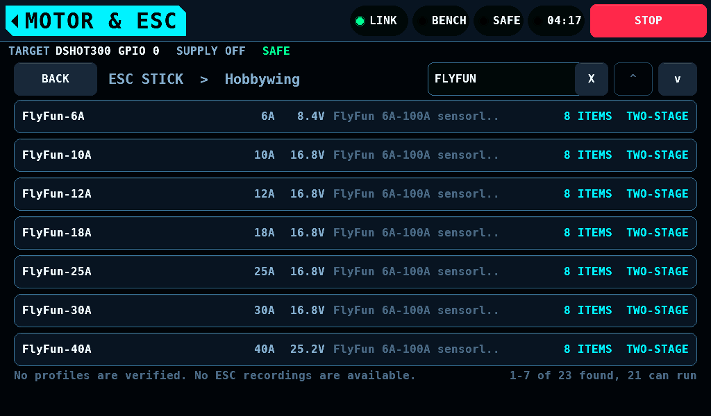

A profile's items start at KEEP. The steppers pick a value; RUN counts the
values picked:

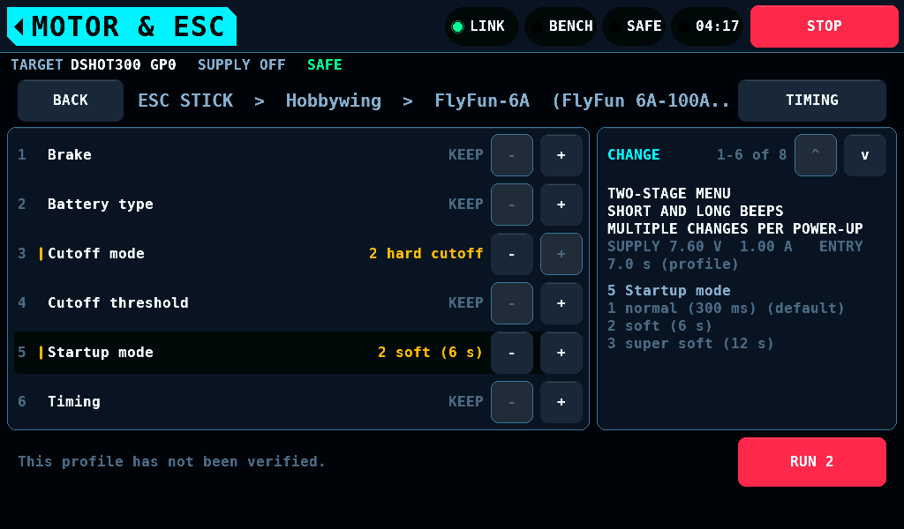

RUN opens a warning over the whole screen, PROPELLER REMOVED? MOTOR SECURED?: a
motor on the ESC must be mounted solid and carry no propeller, or a
resistor load takes its place. The run starts after HOLD TO RUN is held
for 2 s:

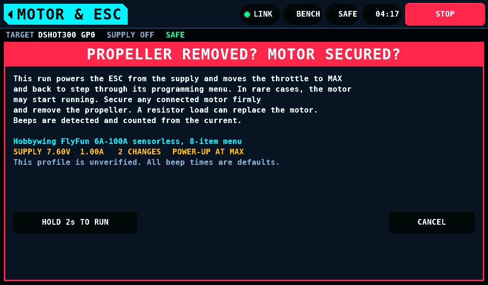

RUN opens nothing, and the line beside it names the reason, while no pin
is bound as a throttle, while the output binding is not read, and while
the supply is the panel's model; such a reason closes a warning that is
open ([Before a run](StickProgramming.md#before-a-run)).

A profile whose ESC needs a person at it -- a jumper fitted and pulled, a
button pressed -- carries a red MANUAL tag in the list and MANUAL
INTERVENTION REQUIRED in red on its page. The button shows the steps and
when each is due; so does the first opening of the profile. The warning
lists the steps due before the power-up, and the run stops for each later
step with DONE and ABORT, waiting at most 60 s
([Manual steps](StickProgramming.md#manual-steps)):

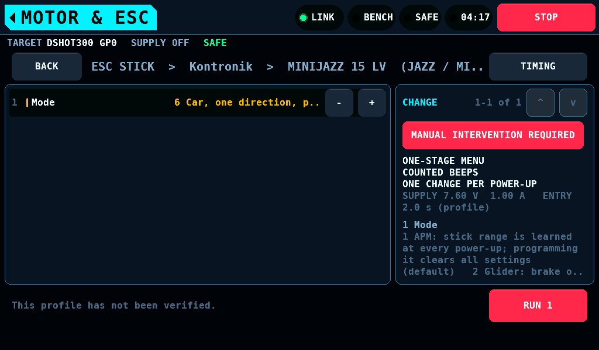

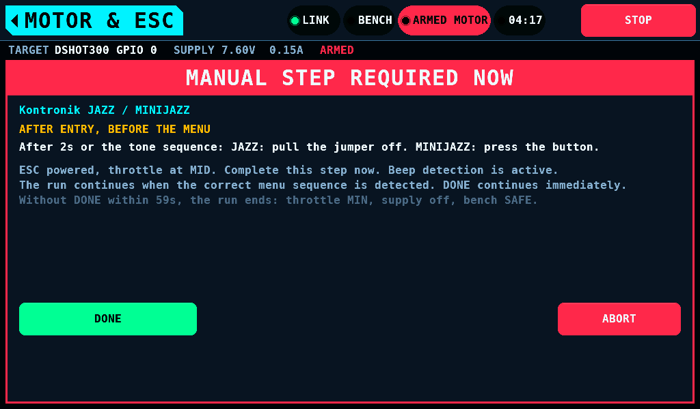

A Kontronik ESC that locks itself when its supply goes off before it has
confirmed the stored mode holds the run powered after the store, the stick
where it stored, until DONE:

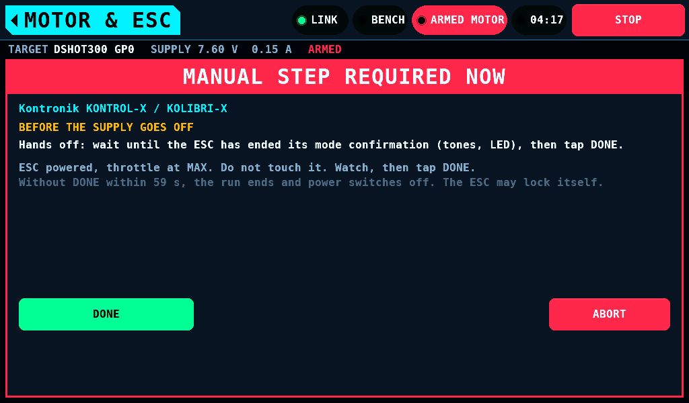

While it runs, the page shows the phase, the beeps of the group under way
and the last group. ABORT, the home tag, STOP and leaving the screen end it
with the throttle at MIN, the supply off and the bench SAFE. The stack light's
green is on while a beep is detected, for at least 150 ms:

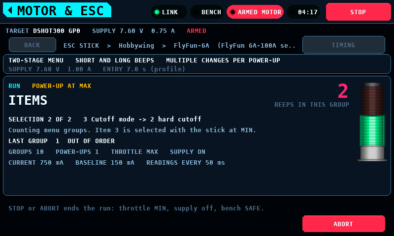

While the phase tap is enabled on SETUP the run's page adds a read-only
readout under the current line: the tap's state, the pitch of its last 8 ms
window, the counts of beeps the IOmcu lost and beeps the panel did not
read, and the last four
beeps with their number, length in ms and mean pitch in Hz. The run still
counts its beeps from the supply current.

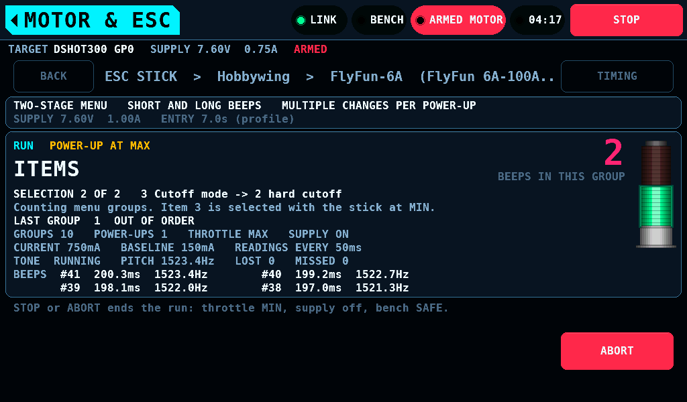

| State | Meaning |
| --- | --- |
| `RUNNING` | the capture runs |
| `OVERRUN` | it runs, and the capture ring or FIFO overran since the tap was enabled |
| `WAITING` | no link, or the TONE page has not answered in the last 500 ms, or its flags say the tap runs and its window number has not moved for 1.5 s, or the tap was switched off and the page still holds it on |
| `NO TONE PAGE` | the IOmcu speaks a protocol older than 4.8 |
| `PIN NOT FREE` | the IOmcu holds the tap off: its pin is bound elsewhere, or the IOmcu runs no capture since its boot (core 1 not started) and its saved set-up has the tap enabled; the second clears only with a restart of the IOmcu |
| `NOT RUNNING` | enabled, and the page holds the tap off or does not run it: the set-up was refused or is not written yet |

PITCH and LOST are the page's values from the last status read. They read
`--`, and OVERRUN is not shown, while no read younger than 500 ms gives the
state: in `WAITING`, in `NO TONE PAGE`, and in `NOT RUNNING` while the
set-up the page holds has the tap off. MISSED and the beeps are the panel's
own count and record and stay.

The result stays until OK. Its red light is on when the run ended because
something was not as expected, a stop the bench raised itself included,
and dark on DONE, a STOP pressed, ABORT, the home tag and leaving the screen ([the list](StickProgramming.md#how-a-run-ends)):

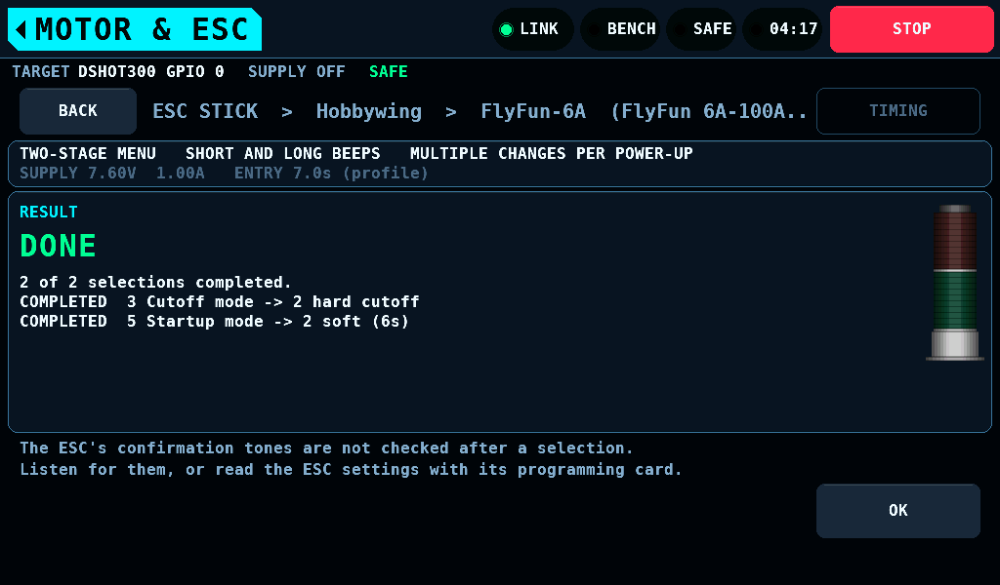

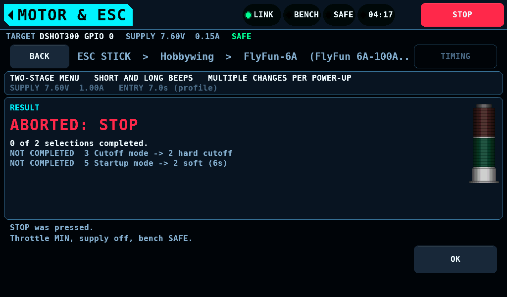

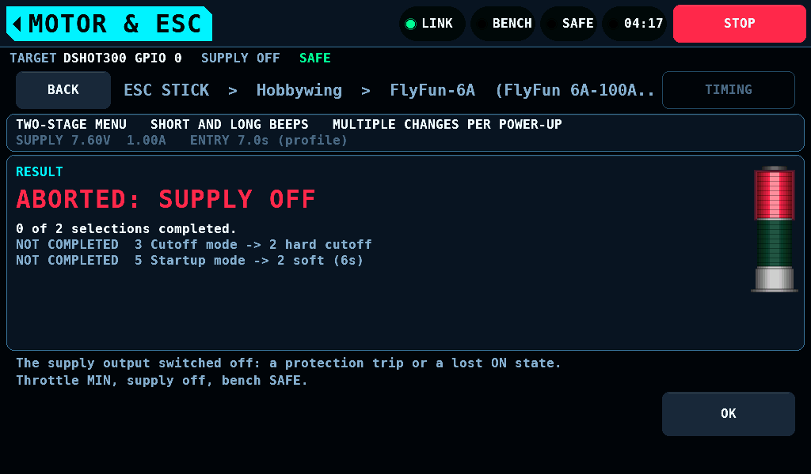

TIMING holds the beep timings and the supply settings. None of them is
measured:

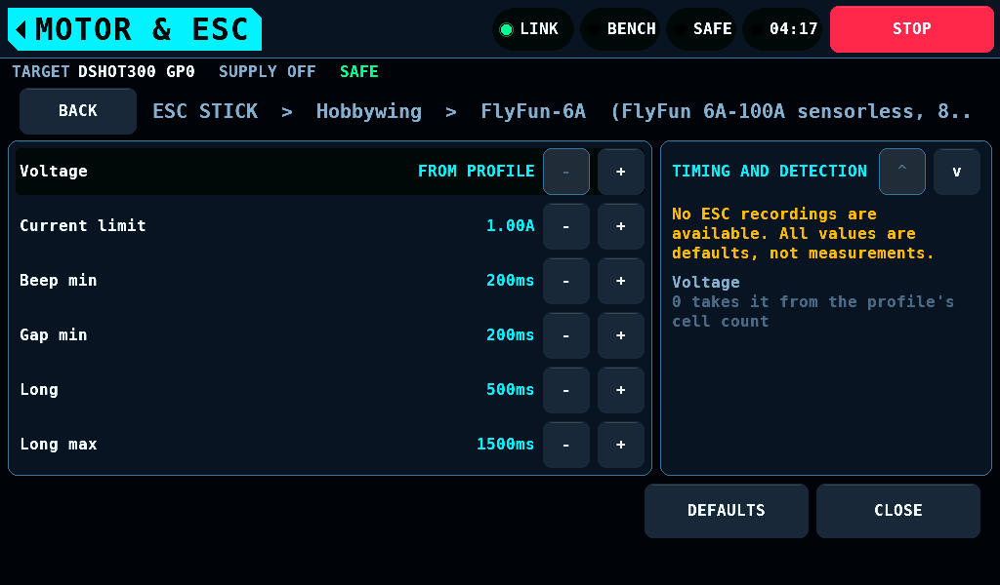

## Servo

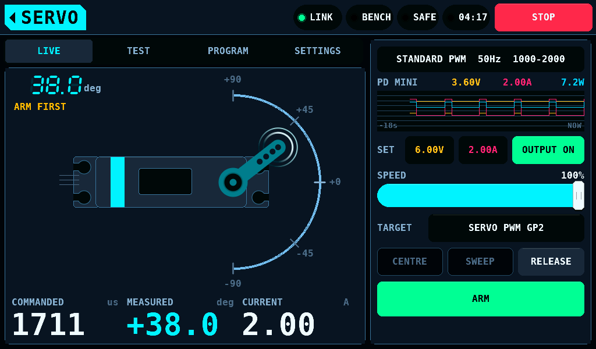

SERVO is a workbench. The strip under the band holds its tasks, **LIVE**,
**TEST**, **PROGRAM** and **SETTINGS** (German `LIVE`, `TEST`,
`PROGRAMMIEREN`, `OPTIONEN`), 112 px a tab. The tile opens LIVE. A tab
switch is no navigation level: the home tag goes home from every task, and
climbs one level only from a run's settings back to TEST and from a
programmer back to PROGRAM's list. Each task keeps its page and what is
selected on it until the panel restarts. Leaving SERVO switches the bench to
SAFE, from any task.

| Task | Left card, the page area |
| --- | --- |
| LIVE | the dial, and a run's box over it while a run is under way or its result is shown |
| TEST | the AUTOMATIC TEST and LIMIT RUN cards, and SUPPLY's caps, read-only |
| PROGRAM | the list of programmers, one row each; a row opens its programmer over the left column |
| SETTINGS | the pages OUTPUT, SWEEP and DUT |

The right card is the output card, the same on every task: the readings,
the SET line, SPEED, the TARGET row, CENTRE, SWEEP, RELEASE and ARM. A
panel -- a keypad, the keyboard, a list, a warning, the question or a
programmer -- covers the whole left column, the strip's tabs with it, and
is answered or closed before the task changes.

On LIVE, while the bench is ARMED, drag anywhere on the sweep to command a position. The solid arm is the measured
position; the faint arm is the commanded position. The gap between them is the
servo's own lag. The rings around the tip pulse while the servo is being
driven. Lifting the finger does not let go: the screen keeps saying the last
position every SERVO_HOLD_MS, so a servo stays where it was put. **RELEASE**,
the button, is what returns the surfaces to centre -- and even that leaves the
pins bound and driving, at the middle of their travel. A switch to SAFE, or leaving
the screen, which switches to SAFE, is what stops the edges. With the rotary knob on,
turning it moves the horn from where it is ([the knob](#panel-the-rotary-knob)),
on LIVE alone: on TEST, on PROGRAM, on SETTINGS, under a panel and under a
programmer the dial is out of sight and a turn moves nothing. A turn in the
frame in which LIVE comes back moves nothing either; the next one does.

One finger drags the dial. A press by a second finger anywhere on the screen
ends the drag, as it ends a drag on SPEED: the horn stays where it was
commanded, and the dial follows again after a new press on it.

The screen drives the channels the binding marks as surfaces, not a fixed pin
and not a fixed protocol. PPM's eight channels are surfaces too, so a bound
PPM output moves with this screen exactly as a bound SERVO PWM one does. With
no surface channel bound at all it commands nothing and no pin moves.

SPEED is the rate the bench may move the output, in degrees a second of the
horn's travel, not a speed for the drawing alone. At 100% the command goes
straight through and the servo moves at its own rate; below that the bench
ramps the command in front of it, so 30% takes three times as long to cross
as 90%. It applies to a held output as soon as it is changed. Without
feedback the horn is drawn moving at the same rate, and at 100% at the
command at once.

**ARM before anything moves.** ARM here switches the surfaces and a pulsing PROG
PORT to ARMED; a throttle output sends no pulse ([An arm for one
role](Link.md#an-arm-for-one-role)). While the bench is SAFE for the
surfaces the IOmcu writes a pulse of length zero to every PWM pin, and
the screen takes no position: the commanded value changes only while the servo follows it. The
button is a two-second hold, the same
gesture and the same fade as the one on MOTOR & ESC, and a press on it while
ARMED switches to SAFE. Leaving the screen switches to SAFE and lets go of the pin: a screen
that is not visible must not be holding a servo somewhere, or leaving the
bench ARMED behind it.

What each control does while the bench is SAFE:

| Control | SAFE | ARMED |
| --- | --- | --- |
| The dial | refused: no command, the horn and COMMANDED stay | commands the position under the finger |
| Rotary knob | refused; the turn is not kept | moves the horn from the commanded value |
| CENTRE | refused; drawn dimmed | commands PULSE CENTRE plus TRIM |
| SWEEP, PAUSE, PAUSED | refused; drawn dimmed | starts, pauses and resumes the sweep |
| RELEASE | sends the release; the value shown stays | centres the surfaces; the value shown becomes the rest |
| SPEED | set; sends nothing | set; a held position is sent again at the new rate |
| SETTINGS > OUTPUT: TYPE, FRAME RATE, PULSE MIN, CENTRE and MAX, TRIM, TRAVEL, REVERSE | set; send nothing | set; a held position or the rest is sent again under them |
| TARGET | a tap opens SETUP > OUTPUTS | locked; names the target |
| SET, OUTPUT ON, OUTPUT OFF | as on SUPPLY | as on SUPPLY |
| START TEST | refused: `ARM FIRST` | starts the run after its hold |

While SAFE, the horn is drawn dimmed and LIVE's left card reads `ARM FIRST`. The
horn and COMMANDED show the position last driven; after a restart, PULSE
CENTRE. A pulse-width setting changed while SAFE changes the
microseconds COMMANDED shows for that angle, and TRAVEL does not clamp it.
From a DISARM the screen asks for, by the tap or by leaving, or a STOP while the
bench is ARMED, until the bench reports SAFE, the SAFE column holds as
well, and a sweep, a pause, a held position and a run of the automatic test
end where it is asked.

When the bench switches to ARMED, the commanded value becomes the rest the pins drive:
the midpoint of the channel's endpoints, 1500 us for STANDARD PWM and 760 us
for NARROW 760, without TRIM. Without feedback the horn is drawn there at
once. The first drag or knob turn after a switch to ARMED starts from that value,
whatever the screen showed before; a 1 % turn of the knob on STANDARD PWM
asks for 1510 us. A type or pulse width changed while the bench is ARMED before the
first position moves the rest, and the value with it.

A finger on the dial when the bench switches to ARMED, switches to SAFE or stops moves nothing
until it lifts and presses again. A position, a sweep or a pause the screen
has posted and the panel has not sent when the bench switches to SAFE or stops is not
sent, and a knob turn in that state is withdrawn: the value returns to the
one before the turn.

RELEASE while the bench is ARMED follows the rule of the switch to ARMED again. The pins go to the rest,
and the commanded value becomes that rest: 1500 us for STANDARD PWM, 760 us
for NARROW 760, without TRIM. The horn is drawn moving there at SPEED. A
drag under way ends. A press on the dial drives the servo again, and the
first knob turn counts from the rest: a 1 % turn on STANDARD PWM asks for
1510 us. The same holds for the release a run of the automatic test ends
with, and for the one a changed type or pulse width sends on a resting
bench. One command waits for each frame: of a position and a RELEASE made in
the same frame the later is sent, and the value shown is that one's. A knob
turn in a frame in which RELEASE waits is dropped.

The right card shows what is commanded and measured, the type, frame rate and
pulse range in force -- in the danger colour while they are ones that can
destroy a servo not made for them -- and the servo rail as its meter reads
it: voltage, current and power on the line over the plot, plotted over the
last 13 s, and the current again in the CURRENT row. The type row reads
`STANDARD PWM  50 Hz  1000-2000`: the type, the frame rate and PULSE MIN to
PULSE MAX in microseconds, two spaces apart. The longest, a 13-character type
at 560 Hz with two 4-digit ends, takes 32 of the row's 33 characters, so the
range carries no unit. A pulse width typed in the settings reaches the row
at once.

| The servo rail's meter | Name on the line | CURRENT, the line and the plot show |
| --- | --- | --- |
| INA3221 CH1 | `INA3221 CH1` | CH1's last 50 ms window: the mean current, the mean bus voltage at the load side of the shunt, and their product. One point of the plot per window, 20 a second |
| the PD mini | `PD MINI` | the supply's last sample. One point per sample |
| the model, while no IOmcu answers | `PD MINI` | the supply's last sample: the supply model's under the SIMULATION watermark, and no reading where SETUP INTERFACES enables the PD mini, which does not answer without the link |

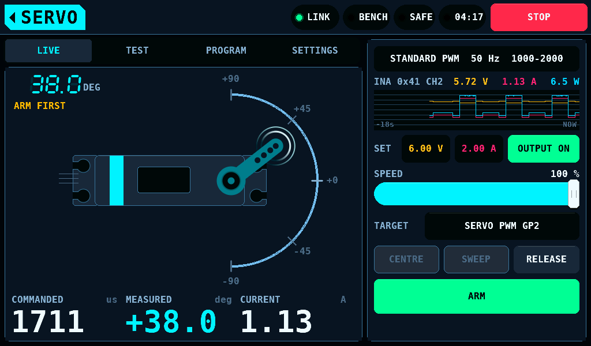

The name stays `PD MINI` in both languages. While the PD mini is disabled on
SETUP under INTERFACES, the supply is the panel's model of it, as on SUPPLY:
then a SIMULATED pill (SIMULIERT in German), 20 px high and 24 px plus the word
wide but at least 88 px (88 px for SIMULATED, 96 px for SIMULIERT), sits
on the plot's top-left corner under the name, because the line beside the
name holds the three readings. The pill comes and goes with the model,
without a tap. With INA3221 CH1 as the meter the line names the INA3221 and
carries no pill, the supply's model or not.

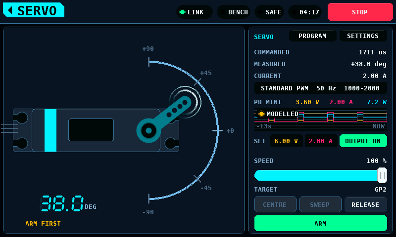

Which meter it is is decided once per poll
([the current monitors](#interfaces-the-current-monitors)): the INA3221
1000 ms after its conditions hold, the PD mini from the first poll in which
one fails.

- A current is signed and shown in hundredths of an amp: `0.41 A`,
  `-0.02 A`, `-1.64 A`. A reading that rounds to zero is `0.00 A`. The
  power on the line is signed in tenths of a watt. Beside `INA3221 CH1` the
  three readings have 60, 64 and 56 px, 7, 8 and 7 characters: a power of
  more than 7 characters in tenths, `-100.0 W` and beyond or `1000.0 W` and
  beyond, is shown in whole watts.
- A reading that did not arrive is `---` in the CURRENT row, `--` on the
  line and a gap in the plot: no sample yet, a supply that does not answer,
  no window since the link came up, a window without samples of that
  quantity.
- A window in which a sample read an end of the INA3221's range, 1.638 A or
  -1.638 A on a 0.1 Ω shunt, shows its mean as it is, in the warning colour
  in the CURRENT row and on the line. The clipped samples count in that mean
  at the end of the range.

  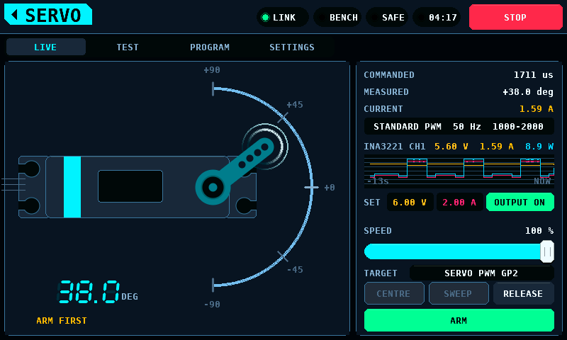

- A link that goes down takes the INA3221's last window with it: `---`
  and `--` until the meter changes or a window arrives over the link.
- The plot is emptied when the INA3221 becomes the meter and when it stops
  being it: the trace is of the meter the line names. Each window and
  each supply sample carries the meter of the poll that took it, so a
  reading taken before its meter became the rail's is no point of the
  trace, and none taken after is left out. The plot's scale starts at 0,
  and a negative current is drawn on its lower edge.
- The CURRENT row's value is repainted when its digits or its colour change,
  and by itself.

The automatic test reads the supply whichever meter the rail has.

MEASURED is the horn's angle from the centre count while AS5600 is on in
SETUP, INTERFACES, the sensor answers and it detects its magnet: `+38.0 deg`,
tenths of a degree, -180.0 to +179.9, read 20 times a second. It is `---`
while the sensor does not answer and while it reports no magnet (STATUS MD
clear): its count is no angle then. A magnet reported too weak or too strong
leaves the angle on show; the band says which. Where AS5600 is off the row
shows the feedback's angle. The commanded position beside it is the
pulse width in microseconds.

**The supply is set and switched here too.** The SET line under the plot
holds SUPPLY's two set points, the voltage and the current limit, and its
output switch. They are SUPPLY's, not a copy: a change on either screen is
the change on both.

- A tap on a set point opens the keypad over the left card. A value outside
  the caps is brought inside them, as on SUPPLY.
- While the output is on, a typed set point waits for SUPPLY's question,
  OUTPUT IS ON, with APPLY and CANCEL, unless SUPPLY's SETTINGS, CONFIRM
  WHILE ON, KEYPAD is off. The question goes, unanswered, when the output
  goes off or on STOP. An APPLY tapped in the same frame as STOP applies
  nothing, though the supply reports the output off a sample later.
- A voltage raised from 6.0 V or below to above it opens the warning HV
  SERVOS ONLY: standard servos are rated for 4.8 to 6.0 V, and above that
  only a servo specified as HV (high voltage) is within its rating; a
  standard servo above it can be destroyed immediately. The
  voltage is applied after HOLD TO APPLY is held for 2 s, the gesture of the
  profile warning; CANCEL drops it. STOP ends the hold. With the output on it replaces SUPPLY's
  question, and it stays if the output goes off. A voltage already above
  6.0 V changes without it. A voltage set on SUPPLY does not open it.

  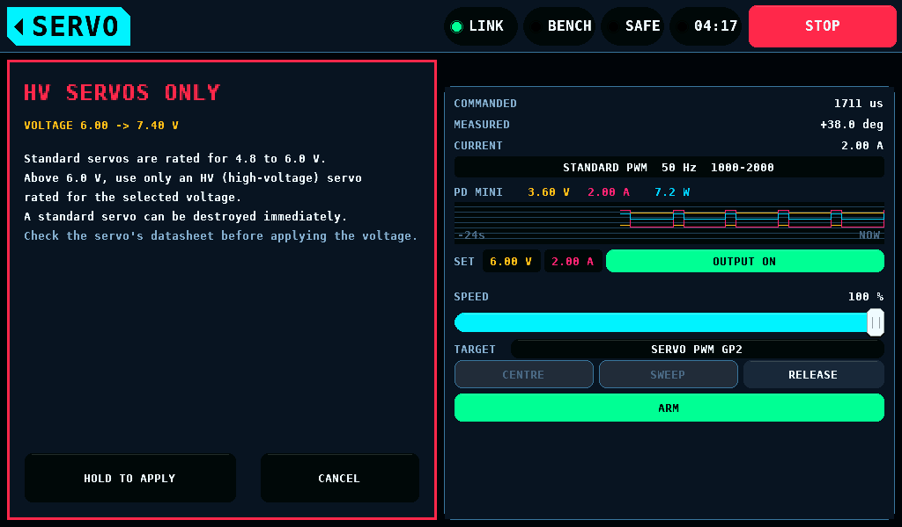

- OUTPUT ON is a two-second hold, OUTPUT OFF a tap, as on SUPPLY. STOP ends
  a hold under way. With a voltage set point above 6.0 V, wherever it was
  set, OUTPUT ON opens HV SERVOS ONLY instead, naming the voltage, and the
  output comes on only after HOLD TO APPLY is held for 2 s; the switch's own
  hold and a tap on APPLY switch nothing on. A set point that rises above
  6.0 V during the ordinary hold -- on SUPPLY, or put back after a run --
  is seen as the hold completes: HV SERVOS ONLY opens and nothing comes on.
  Leaving SERVO switches off an output SERVO switched on: by OUTPUT ON,
  by a test, or by the servo programmer's CONNECT. While the servo
  programmer holds a port the output stays on, as an OFF would end the
  session and cut a write under way; it goes off when the port lets go,
  unless SERVO is shown again first. An ON SERVO asked for that is on its
  way when the port takes the supply counts as switched on. An output SERVO did not switch on
  stays as it is. The servo programmer, the keypads and the questions
  belong to SERVO and are no leave. A press on OUTPUT OFF as the screen is
  left is sent as the OFF it was.

**SWEEP drives the servo through a curve** on the IOmcu, where its
timing does not depend on the link: SETTINGS > SWEEP's CURVE (square, sine
or triangle) and SPEED (0.05 to 5 cycles a second), and the automatic test's
DWELL TIME (the hold at each end), about PULSE CENTRE. RANGE is a share of the travel the servo may make:
of TRAVEL, and of the nearer of PULSE MIN and MAX, so the sweep reaches
neither end it may not. SPEED on the right card limits it as it limits a
drag, and trim is not applied. The horn follows the same curve, computed on
the panel and timed from when the IOmcu started its own. The panel
draws only what the IOmcu is known to do: a sweep asked for, or
resumed, is drawn once its start is acknowledged, and until then the horn
stays where the output is. Without feedback it is then worked on from where
the output was when the IOmcu began, along the curve at SPEED. Two
taps on the sweep button that reach the screen in one frame, before the
first one's command has left, cancel out: nothing is sent and the sweep
goes on as it was.

**PAUSE pauses it.** While a sweep runs the button reads PAUSE in the accent
colour. A tap stops the sweep where the output has got to -- which SPEED can
leave behind the curve -- and holds it there; the button then reads PAUSED,
filled in the warning colour. The IOmcu does the holding (the link's
HOLD, SWEEP register 4), because only it knows exactly where that is;
without feedback the horn drawn on the panel is an estimate of it. The panel
repeats the hold every 100 ms (`SERVO_HOLD_MS`), so a pause outlasts the
IOmcu's 500 ms rule. A pause does not wait behind sweep writes already
on the wire. A tap on PAUSED carries the sweep on from the point of the
curve it was paused at: its place in a dwell and the ends it has reached go
on from there too, and the horn is drawn on from that phase. The phase is
the curve's when the IOmcu acknowledged the HOLD, not at the tap: the
curve runs on there for the exchange in between, and so the drawing runs
on too, at the SPEED in force at the tap, for at most 500 ms -- the longest
the IOmcu runs a sweep it has not heard. Without feedback the drawn
horn is then put where the output had got at the acknowledgement: the curve
to that phase, slewed as the drawing slews. A SPEED changed in between reaches the
IOmcu only with the resume. A tap on PAUSED leaves the horn where it
is until the resume is acknowledged; the panel then times the drawing from
the phase the IOmcu kept, as it timed the two acknowledgements, also
when the tap came before the HOLD's acknowledgement; that acknowledgement,
arriving after the tap, still moves the horn to where the IOmcu held
the output, and the resume goes on from there. The IOmcu
keeps the phase while it holds and resumes the curve (`LINK_SV_RESUME`,
protocol 4.6); the output slews from where it was held to the curve at
SPEED's rate, at once at 100 %, and is normally already there. A curve
changed on SETTINGS > SWEEP while paused starts as a new sweep instead. An
IOmcu older than 4.6, or one that refuses the resume because its hold
has ended, starts the curve over from its beginning -- the centre for a
sine or a triangle, the first end for a square -- and the alert band says
so: `IOmcu firmware older than 4.6. Sweep starts again.` or `IOmcu could not resume. Sweep starts again.`. So does PAUSED tapped while
the HOLD has gone unanswered, since the IOmcu may then be holding or
still running: `Pause was not confirmed. Sweep starts again.`. A
PAUSED tapped before a HOLD that the panel then lets go of (below) starts
nothing: the pause ends with that HOLD.

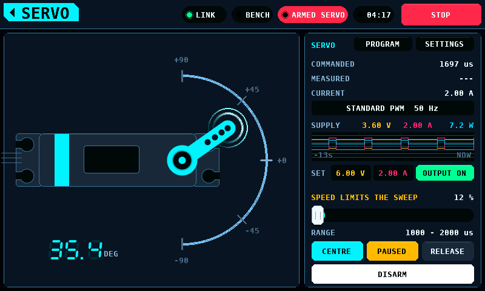

A hold the link left unrepeated for 500 ms has been let go at the far end,
so the panel releases the surfaces to their centre and the horn goes there.
So does a HOLD answered only at a retry, or after longer than 500 ms: the
IOmcu may have let it go and held again elsewhere, so where it holds
is not known on the panel, and the pause ends rather than keep an angle a
later change of profile would send to the servo. The link going ends a
sweep or a pause too, and the horn is drawn at rest, as the IOmcu
rests the surfaces 500 ms after the last write it heard; no sweep or hold
asked for before is sent when the link comes back, and the next tap starts
a sweep.
A finger on the dial, CENTRE, RELEASE, STOP, a switch to SAFE and leaving the screen
end a sweep, running or paused, and the button reads SWEEP again. A changed
type, frame rate, pulse, trim, travel or reverse ends a pause too, and the
servo is held at the paused angle as a position. With feedback the paused
angle is the one the servo last reported, which it can still be moving to
after the tap; without feedback it is the drawn estimate at the
acknowledgement. A changed SPEED keeps the
pause; the resume runs at the new SPEED. Touch events going missing pause a
running sweep as PAUSE would. A changed setting starts a running sweep over
with the new curve, drawn from when the IOmcu acknowledges it; until
then the old curve is drawn on, as the IOmcu runs it, under the
pulses and TRAVEL it was sent with. Each acknowledgement is matched to the
command it answers: a SPEED or curve changed while a start waits does not
let the earlier command's acknowledgement draw the newer one. A changed
profile or frame rate goes with it at once. SWEEP is offered while the
bench is ARMED, with a surface bound and the link up, and an IOmcu speaking
protocol 4.2;
greyed otherwise; the IOmcu stops a sweep the panel has not
repeated for 500 ms and leaves each surface where its output has got to.

**SPEED LIMITS THE SWEEP** replaces SPEED's label on the right card, in the
warning colour, while SPEED is slower than the fastest change the curve asks
for. SPEED then shapes the motion instead of CURVE: a square, a sine and a
triangle all move as ramps at SPEED's rate and look alike, and the output
can turn back before it reaches an end. The line follows the settings, so it
shows before SWEEP is pressed as well as while a sweep runs. Raise SPEED, or
lower SETTINGS > SWEEP's SPEED (the rate in Hz) or RANGE, to clear it. A square
jumps between its ends, so it shows at every SPEED below 100 %. With the
SWEEP page's defaults (sine, 0.5 Hz, RANGE 80 %) and TRAVEL +/-90 deg it
clears at SPEED 63 %, and for a triangle at 40 %.
[Servo procedures](Servo.md#sweep-and-speed) gives the rule.

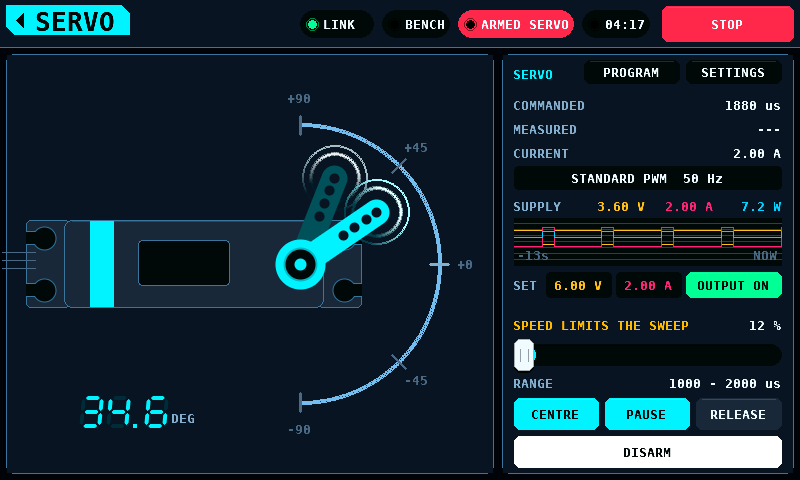

**START TEST runs the automatic test** from TEST's AUTOMATIC TEST card: the servo stepped
through the supply voltages chosen there, its current measured at rest,
moving and holding, its travel timed, and the voltage at which it stops
moving. [Servo procedures](Servo.md#automatic-test) gives the method and the
files. The card holds the run's name and its SETTINGS, a summary line
(`4.8 6.0 V BROWN-OUT, 60 s EACH`, or `..., 20 MOVEMENTS EACH`), START
TEST, the state line, the last result with its files
(`LAST: PASS ATEST004.CSV + .TXT`) and the STALL AT note. START TEST needs
the bench in ARMED and a supply that answers; the state line says ARM FIRST, NO STEP CHOSEN, SUPPLY NOT ANSWERING, RANGE TOO
SMALL (the ends RANGE and TRAVEL give land on PULSE CENTRE), A STEP IS
OUTSIDE THE CAPS (a chosen step above the voltage cap in force, checked
before any warning opens) or LAST REPORT STILL WRITING, and follows the
bench and the settings as they change. The note under the last result says when no reading can pass STALL AT: `STALL AT 2.00 A
cannot be reached: current limit 2.00 A` while STALL AT is at or above the
SET line's current limit, else `STALL AT 2.00 A cannot be reached: INA3221
range 1.638 A` while the INA3221 is the rail's meter and STALL AT is at or
above its range. START TEST stays open: see
[Stall and constant current](Servo.md#stall-and-constant-current).
It is a two-second hold,
the gesture OUTPUT ON uses, because a run switches the supply on and moves
the servo. With HV SERVO on and a step above 6.0 V chosen, a tap opens HV
SERVOS ONLY instead, naming the highest step, and the run starts only after
its HOLD TO APPLY is held for 2 s. HV SERVO is for the session: every restart
turns it off.

TEST stays shown as the run starts, and the card's state line reads the
step. LIVE shows the run's box at the top of the left card: its step and
phase, with the meter the run reads beside STOP TEST: `PD mini`,
`INA3221 CH1` or `SIMULATION`. It is the servo rail's meter at START TEST, and
the run reads it to its end ([The meter](Servo.md#the-meter)). The run owns
the servo and SUPPLY's set points and switch until it ends. It ends early, the output switched off and the servo released
to its centre, on STOP TEST (in LIVE's box or on the card), STOP, a
switch to SAFE, the link going, leaving the screen, a finger on the dial, CENTRE,
SWEEP, RELEASE, a tap on a set point, a change to the servo's type, pulses,
trim, travel, reverse or SPEED, touch events going missing, and on the
supply: see [the list](Servo.md#what-ends-a-run). Once a run is over, whichever screen is up, SUPPLY's set points go back to
what they were before it. That waits until the run's OFF has been sent, a
reading taken after that in which the supply itself reports the output off
-- not the panel's request, which the PD mini follows a link exchange and a
module transaction later -- no ON is on its way and
OUTPUT ON is not being held on SERVO or SUPPLY. Set points changed after
the run ended are
left as they are.

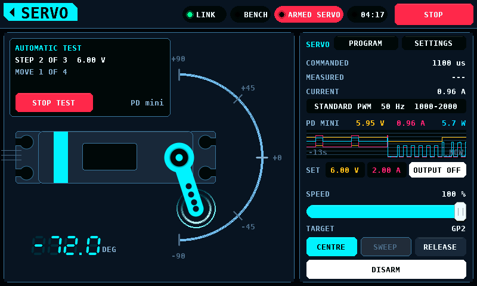

The result stays in LIVE's box until CLOSE, and on the card's LAST line
until the next run: PASS, FAIL or ABORTED and why, the longest travel time and the highest holding current, and the files
the card took in `USER/LOGS`: `ATESTnnn.CSV`, and `+ .TXT` once the card has
taken the report whole. With User logs OFF on [Setup](#setup) > SD CARD the
line reads `USER LOGS OFF` and no file is written.

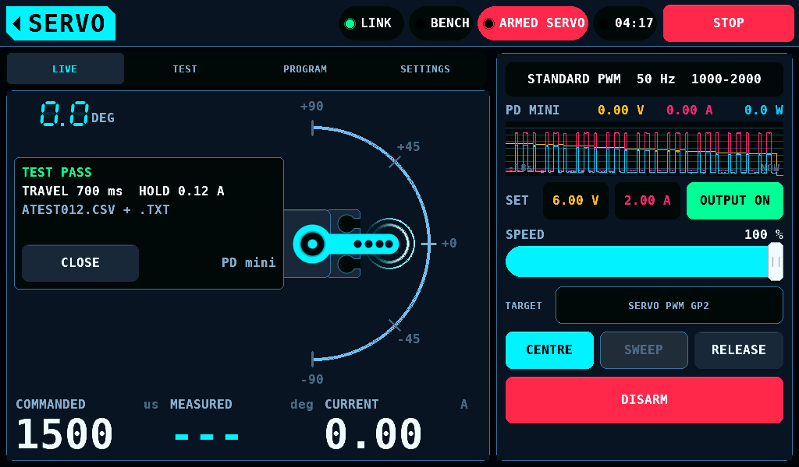

A run that read the INA3221's windows names it there, as the line over the
plot does:

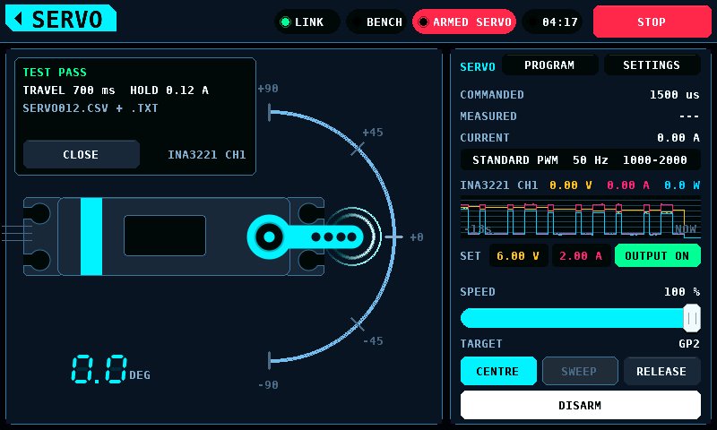

**START LIMIT RUN runs the limit search** from TEST's LIMIT RUN card: the servo
stepped outward in 10 us steps until its current shows the linkage bound,
and, with LIMIT RUN on SEARCH + PROGRAM, a KST or Chaservo servo's LEFT ANGLE
and RIGHT ANGLE lowered until neither end binds. On a SERVO PWM pin the
search runs from PULSE CENTRE to PULSE MIN and PULSE MAX; on PROG PORT a
read session comes first, and the search runs from the servo's NEUTRAL to
its own PULSE LOWER and PULSE UPPER. [Servo procedures](Servo.md#installed-mechanical-limit)
gives the method, the protections and the report. It is a 2 s hold while
the bench is ARMED and the INA3221 is the servo rail's meter. Over it the
card's summary names the mode, `SEARCH ONLY` or `SEARCH + PROGRAM`, and
SERVO PULSES while the run reads the port. Under it a line names the
output it drives and the meter, `OUTPUT PROG PORT GP13, CURRENT INA3221
CH1` or `OUTPUT SERVO PWM GP2, CURRENT INA3221 CH1`, the next line says why
it cannot start or what it does now, then the last result and its report.
TEST stays shown as the run starts. Its box on LIVE's left card shows the
values written of 8, the phase with the side and the pulse, and the output
it drives, with STOP RUN; after the run, the verdict, the values or the
ends, and `LIMITnnn.TXT` until CLOSE (`USER LOGS OFF` with User logs OFF). The run switches the bench to SAFE and
to ARMED itself for each write; the operator's STOP, SAFE or any of the
automatic test's reasons end it with the output off.

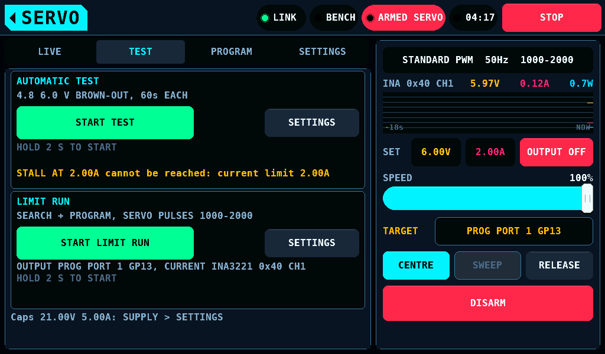
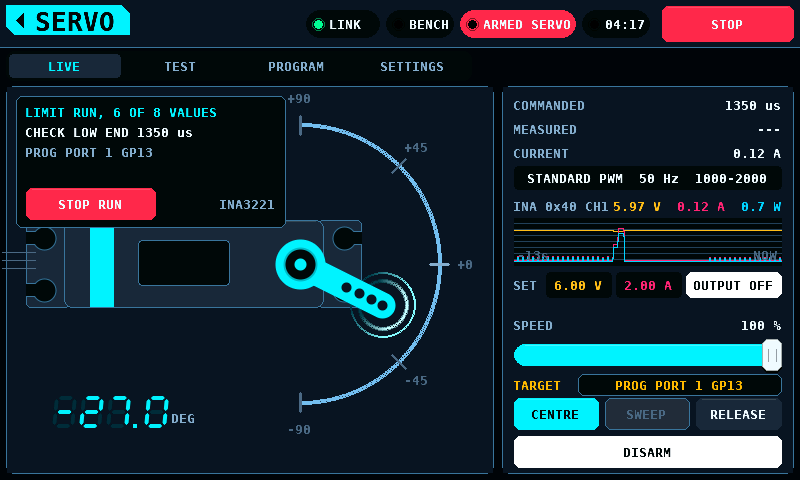
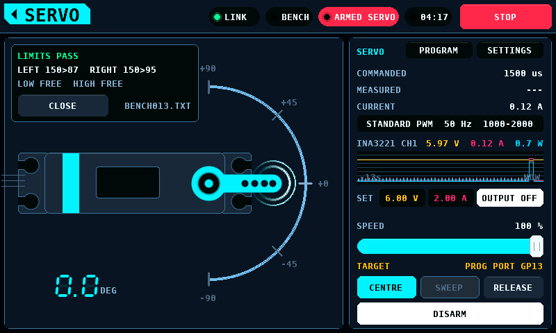
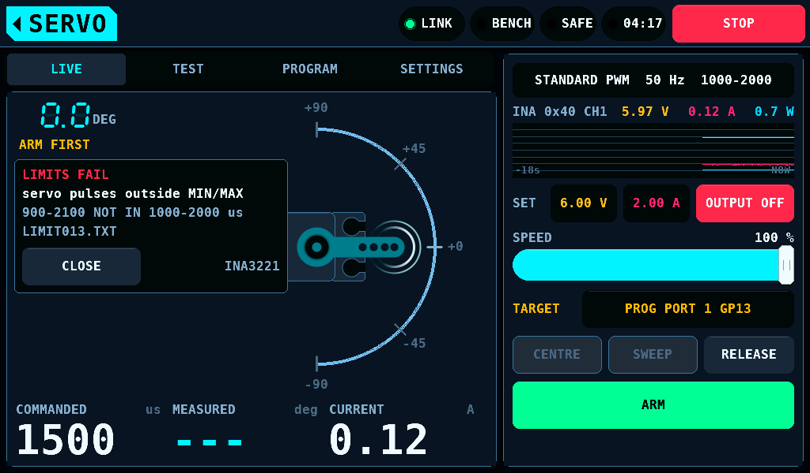

### Programmer

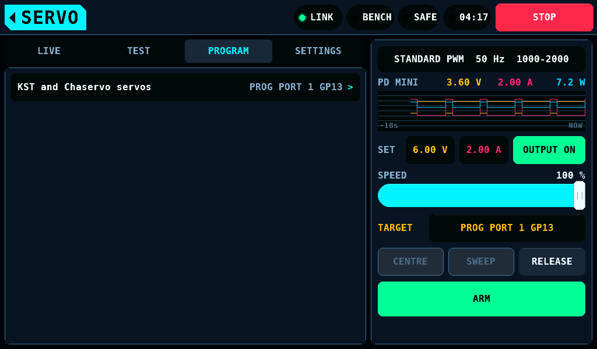
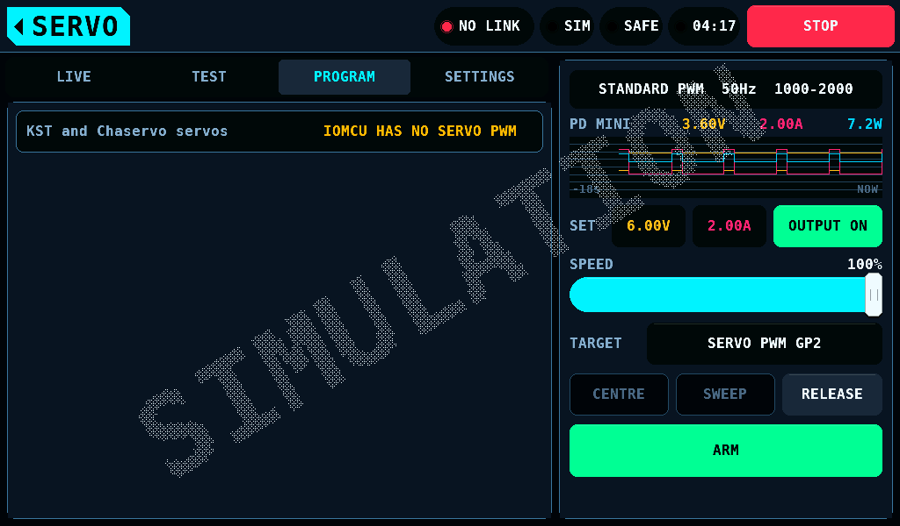

PROGRAM in the strip shows the list of programmers in the page area, one
row each: the name on the left, and on the right what the row drives with
its pin, `PROG PORT GP13`, then `>`. The list has one row, `KST and
Chaservo servos` (German `KST- und Chaservo-Servos`). A tap on a live row
opens its programmer over the left column, the strip's tabs with it, one
level down, and ends a running automatic test. CLOSE in the programmer, or
the home tag, climbs back to the list; the next home tag goes home. Over a
keypad, a list, a warning or the keyboard in the programmer the home tag
closes that one, and the programmer stays.

A row is drawn dimmed, with its reason in place of its port, and a tap on
it opens nothing:

| Reason | When |
| --- | --- |
| `IOMCU HAS NO SERVO PWM` | the IOmcu, the RP2350 board, does not report the capability the row needs; with no IOmcu answering it reports none. The capability's name is the link's, the same in German |
| `PORT IN USE` | another row's programmer holds the same programming port |

The rows come from one table in the firmware, `shared/ui/prog_registry.c`.
A new servo maker is one row there and its programmer, never a tile or a
tab. A list of more than 9 rows gets a SEARCH box that opens the keyboard,
`*` for any text; a list showing more than 8 rows draws them under their
group headings; a list taller than the page area pages with `^` and `v`. A
list holds 48 rows at most. With one row none of these is drawn. Modelled
protocols without a transport on the IOmcu, the Hitec D-series servos among
them, have no row ([PROGRAM](#program) on MOTOR & ESC).

The KST and Chaservo programmer takes the IOmcu's programming port, GP13 on
pad 17 by default, out of PWM (pulse-width modulation) and reads and writes
the servo's settings on its signal wire. It connects only with SERVO
TESTER on SETUP > OUTPUTS set to PROG PORT; with OUTPUTS it shows `Use the
programming port to program a servo.` and `Set SERVO TESTER to PROG PORT on
SETUP > OUTPUTS.`, and CONNECT is locked. While it holds the port it stays open: CLOSE and the
home tag open LEAVE PROGRAMMING, and while the port moves into or out of
programming they do nothing. Leaving SERVO leaves the port as it is; back
on SERVO the programmer is open again on PROGRAM. ARM is drawn disabled and
takes no press, CENTRE, RELEASE and STOP work, and COMMANDED reads `---`: the
tester sends no pulse to the port. In PWM with a PD mini answering, the
programmer's PORT row names the voltage and the current limit CONNECT sets,
`PORT  5.0 V  1000 mA`. The set points and OUTPUT ON of
the SET row and of the SUPPLY screen are dimmed and take no press for as
long; OUTPUT OFF works.
It leaves programming without a cycle of the servo's supply. Whether a KST
servo follows PWM while in programming mode is not measured.
[Servo programmer for KST and Chaservo servos](ServoProgrammer.md)
describes it.

### Settings

SETTINGS in the strip shows the servo's settings in the page area, on three
pages under their own tabs: OUTPUT, SWEEP and DUT (German `AUSGANG`,
`SWEEP`, `PRÜFLING`). Each run's own settings open from its card's
SETTINGS on TEST, as a list in the page area one level down; the home tag
or another task closes them. The output card stays where it is and works. A
value opens the keypad, a list opens a list, a switch flips on the tap, and
the name opens a keyboard.

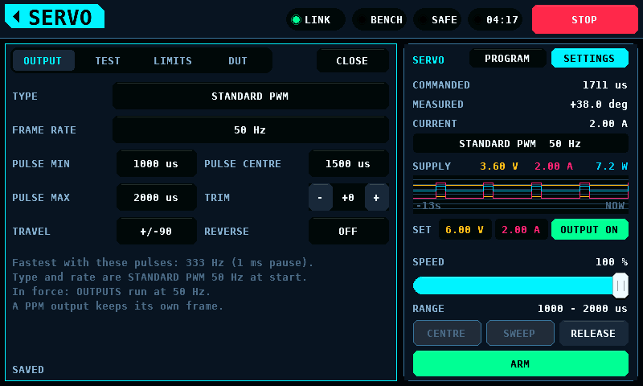
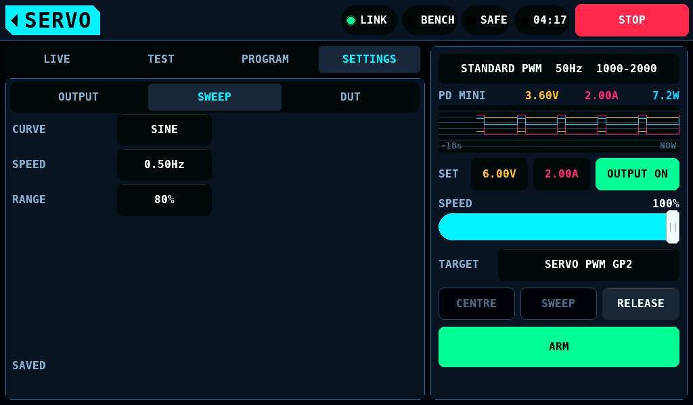

| Where | Setting | What it does |
| --- | --- | --- |
| SETTINGS > OUTPUT | TYPE | the servo profile: STANDARD PWM, NARROW 760, WIDE, HELI CYCLIC or HELI TAIL 760 |
| SETTINGS > OUTPUT | FRAME RATE | how often a pulse is sent; the type's list, or CUSTOM on the keypad |
| SETTINGS > OUTPUT | PULSE MIN, CENTRE, MAX | the pulse widths the travel maps onto, 400 to 2500 us: -90 deg is MIN, 0 is CENTRE, +90 deg is MAX, and RELEASE rests at CENTRE. An end lies no further from CENTRE than CENTRE lies from 400 us or 2500 us |
| SETTINGS > OUTPUT | TRIM | added to the centre, 5 us a step, up to 200 us either way |
| SETTINGS > OUTPUT | TRAVEL | how far the horn may go each way, 10 to 90 degrees |
| SETTINGS > OUTPUT | REVERSE | the direction the horn's angle maps onto the pulse |
| SETTINGS > SWEEP | CURVE, SPEED, RANGE | the movement of SWEEP: square, sine or triangle, 0.05 to 5 Hz, 10 to 100 % of the travel. The automatic test moves in steps between the ends RANGE gives |
| AUTOMATIC TEST > SETTINGS | TEST LENGTH BY, TEST TIME, MOVEMENTS | how long each supply step runs: a time, or a number of movements |
| AUTOMATIC TEST > SETTINGS | DWELL TIME, SETTLING TIME | held at each end, by the test and by SWEEP; waited after a supply step before measuring |
| AUTOMATIC TEST > SETTINGS | STEP 4.8 / 6.0 / 7.4 / 8.4 V, BROWN-OUT | the supply steps, and the brown-out run from 5.0 V down; 7.4 and 8.4 V run only with HV SERVO on |
| AUTOMATIC TEST > SETTINGS | HV SERVO | adds the 7.4 and 8.4 V steps, off by default and at every restart; a run with them starts only through HV SERVOS ONLY |
| AUTOMATIC TEST > SETTINGS | STALL AT | above this current the servo counts as stalled |
| AUTOMATIC TEST > SETTINGS | IDLE CURRENT, HOLD CURRENT, TRAVEL TIME | pass/fail limits; 0 is not checked |
| LIMIT RUN > SETTINGS | LIMIT RUN | SEARCH ONLY or SEARCH + PROGRAM, a tap switches; SEARCH + PROGRAM is offered for a servo on the programming port only, and the row reads SEARCH ONLY with the reason under it otherwise. For the session |
| LIMIT RUN > SETTINGS | SERVO PULSES | KEEP or 1000-2000, a tap switches; shown with TARGET on PROG PORT only. 1000-2000 writes the servo's PULSE LOWER and PULSE UPPER to 1000.0 and 2000.0 us in the run's read session, before the search. KEEP by default; for the session |
| SETTINGS > DUT | NAME | the device under test, up to 23 characters, for the report |
| SETTINGS > DUT | REPORT | a text report beside each test's log |
| SETTINGS > DUT | ENC CENTRE | a tap takes the live count as the centre, with the servo at its neutral, and sets nothing without a reading from the current link (none after a link loss until a new one arrives) or while the sensor reports no magnet; the row shows the stored count, 0 to 4095, and is dimmed while AS5600 is off. The same setting as SETUP, INTERFACES, AS5600 centre |

AS5600, the output encoder, is switched on and off on SETUP > INTERFACES
alone ([the output encoder](#interfaces-the-output-encoder)); DUT's note
says so. It adds the horn's angle to the MEASURED row and to a run's CSV
and report ([Servo](Servo.md#the-output-encoder)).

SUPPLY's caps, the voltage and current the set points and a run's steps stay
inside, show read-only under TEST's cards and on DUT, with their home and
the caps in force: `Caps 21.00 V 5.00 A: SUPPLY > SETTINGS` (German
`Grenzen 21.00 V 5.00 A: SUPPLY > OPTIONEN`). They are set on SUPPLY >
SETTINGS.

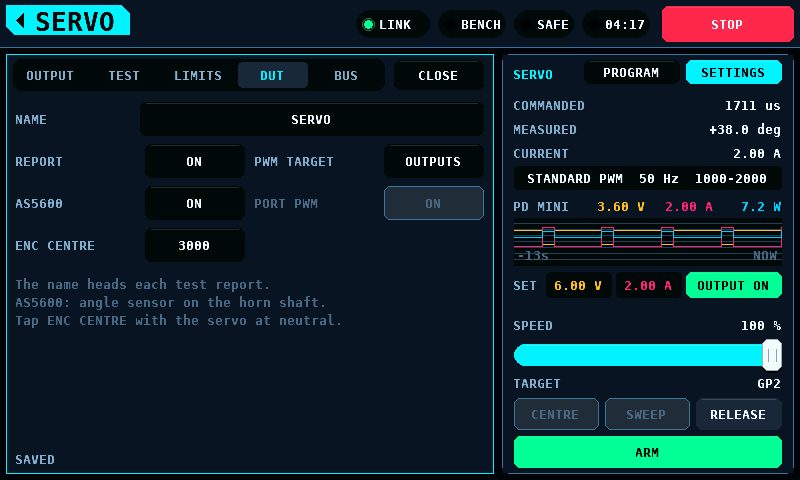

The TARGET row of the output card, between SPEED and CENTRE, names what
the tester drives as `protocol pins`, centred in its value box, and is the
control that picks it, as MOTOR & ESC's TARGET row is. A tap on the box
opens SETUP > OUTPUTS on what the row shows, where the IOmcu sends the
commands now, not on the TARGET setting: on the PROG PORT entry while it
drives the port, on SERVO PWM while it drives the outputs, and on the
overview while the target is not known or no IOmcu answers
([OUTPUTS](#outputs)). A TARGET write still pending, or PROG PORT asked
for with no pin on the port, opens on what is driven. There SERVO TESTER
picks OUTPUTS or PROG PORT, the TARGET setting, and PORT PWM the port's
pulse, both kept in NVS (non-volatile storage). Leaving SERVO switches the
bench to SAFE and ends a sweep or a test; the home tag on OUTPUTS comes back
to SERVO on the task the row was tapped on. The row is locked
-- outlined, its value dimmed, and it takes no press -- while the bench is
ARMED, during a sweep (running or paused), an automatic test or a limit
run, and while the servo programmer holds the port; it names the target all
the same. The output card stays in sight under the pages, their keypads and
the servo programmer, so the row names the pin while any of them covers the
left column.

With OUTPUTS the row names the GPIOs bound as SERVO PWM in the binding the
tester drives: `SERVO PWM GP4`, `SERVO PWM GP2 GP4`; as many pins as fit
the 23 characters of the value, then `+N`: 8 pins from GP40 read
`SERVO PWM GP40 GP41 +6`. The row is in the warning colour, label and
value, with no such pin (`NO SERVO PWM PIN`) and before a binding has been
read (`PINS NOT READ`). With PROG PORT the row reads `PROG PORT GP13` in the
warning colour; the pin is the GPIO the IOmcu reports for the
programming port. The tester's commands then do not reach the SERVO PWM
outputs; while the bank is ARMED they hold their rest pulse, the centre
between their endpoints. A port target without a usable pin (none, refused
at start, or a port the IOmcu does not have) reads `PROG PORT`, also in
the warning colour: the commands go to the port all the same. With PORT PWM
off the port renders no pulse, and the row adds `PWM OFF`:
`PROG PORT GP13 PWM OFF`, 22 characters with a two-digit pin. Two states name
no target, both in the warning colour, and the tester sends no command in
either: `NO LINK` while no IOmcu answers, and `UNKNOWN` while the
IOmcu's programming-port page has not been read since the link came
up, a write to it was not acknowledged, or a read of it went unanswered.
While the servo programmer holds the port, the row does not change: it keeps
naming the target the IOmcu holds, a port or the outputs; the
programmer drives the port and the tester sends nothing. The page is read
every 500 ms. An IOmcu without that page (protocol older than 4.13) has
the standard outputs as target. The row follows the target the IOmcu
holds, not the setting: a SERVO TESTER change waits for a quiet bench and
reaches the row once the IOmcu has taken it.

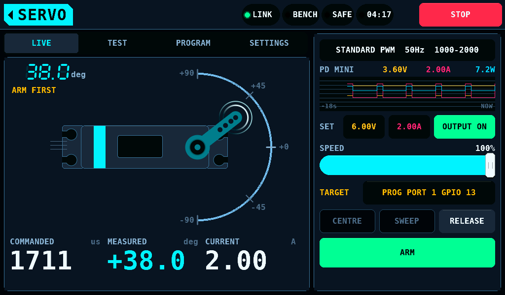

| Type | Centre | Travel | Frame rates |
| --- | --- | --- | --- |
| STANDARD PWM | 1500 us | 1000-2000 us | 50, 60, 100, 150, 200, 250, 300, 333 Hz |
| NARROW 760 | 760 us | 660-860 us | as STANDARD PWM |
| WIDE | 1500 us | 800-2200 us | as STANDARD PWM, up to 312 Hz |
| HELI CYCLIC | 1520 us | 820-2220 us | 50, 120, 200, 333 Hz |
| HELI TAIL 760 | 760 us | 410-1110 us | 200, 333, 560 Hz |

A pulse needs a pause before the next frame. STANDARD PWM, NARROW 760 and WIDE
keep at least 1 ms between pulses, so their fastest rate is 1 / (longest
pulse + 1 ms): 333 Hz for 2000 us. The heli profiles run at Rotorflight's
rates for digital cyclic and narrow-band tail servos, with at least 0.5 ms
between pulses. A frame rate the pulses leave no pause for is refused, and a
longer PULSE MAX is refused at a rate it does not fit. The pause is kept after
the longest pulse the IOmcu can render, the top of the range a command
carries: PULSE MAX, or past it when CENTRE is off the middle, by as much as
CENTRE lies nearer MAX than MIN. So a CENTRE that would push that top past
the rate's pause is refused too.

**A heli type, or any frame rate above 60 Hz, can destroy a servo that is not
made for it.** Choosing one opens a warning in the danger colour that names
what is chosen and what it does to a servo not made for it; it is applied only
after HOLD TO APPLY has been held for 2 s. CANCEL, a finger that slides off,
a touch loss and leaving the screen apply nothing. The type and frame rate in
force stay red on the right card, and every restart goes back to STANDARD PWM
at 50 Hz: a servo plugged in after a restart never meets a rate meant for
another one.

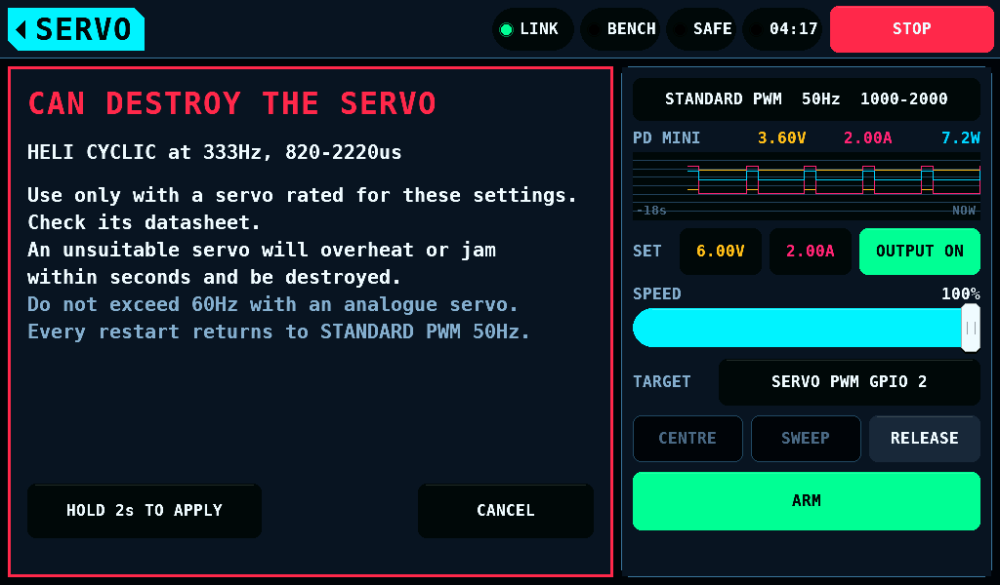

**The frame rate reaches the pins** through the IOmcu's SERVO page
(protocol 4.1). It applies to the TARGET alone. With OUTPUTS, the standard
servo ports, as target that is every PWM output whose first channel is a surface; a
PPM output keeps its own frame. With PROG PORT as target it is the
programming port's pin, and every slot keeps its own rate (protocol 4.19).
Every other programming port runs at 50 Hz. A port whose pin shares its PWM
slice with another programming port's pin runs at 50 Hz only: the RP2350
gives both pins of a slice one divider and one wrap, so a faster rate there
is refused. A change of TARGET puts the rate back to 0, each output at
its own rate, and the screen sends its rate again with the next position. It goes with every held position,
and a profile changed while the servo rests ARMED restates the rest with it;
one changed while a switch to ARMED is on its way is the one that switch uses.
A faster rate goes after the pulse widths, once all of them have landed; any
other rate goes before them, and nothing wider goes out until it has landed,
so the pins never carry a fast rate with a slower profile's wider pulses. The
OUTPUT page says what became of it:

| Note | Meaning |
| --- | --- |
| In force | the rate runs on the target the IOmcu holds, named from its PROG page: `Active: OUTPUTS run at 330 Hz.` or `Active: PROG PORT GP13 runs at 330 Hz.` The note is in the warning colour while that target differs from the TARGET chosen (second line `The TARGET chosen is not active.`; PROG PORT with no pin bound to the port leaves OUTPUTS the target), while the port target has no pin, while PORT PWM is OFF (`PORT PWM is OFF. The port sends no pulses.`) and while the target is not known. Against an IOmcu before protocol 4.19 the note reads "every PWM surface runs at": such an IOmcu runs every PWM surface at the rate, whatever the TARGET. With no link both read `No link. The active frame rate is unknown.` in the warning colour: an IOmcu restarted while the link is down runs every pin at its own rate again |
| The rate goes with the next position | not written yet |
| REFUSED | a pulse of the target -- a surface, or the programming port while its pulse is on -- is longer than the frame at that rate, or a target pin shares a PWM slice with an output at another rate; the pins keep the rate they had |
| This IOmcu takes no frame rate | protocol 4.0: every PWM output runs at its binding's 50 Hz |

An IOmcu restart, and every binding written on OUTPUTS, put each slot
back at its own rate, 50 Hz for a servo; the screen sends its rate again with
its next position, against the binding then in force. A binding is not
written while the reset to each slot's own rate goes unanswered (OUTPUTS says
`NO LINK`) or is refused (`REFUSED`), and the bench
does not switch to ARMED, from any screen, while the rate the TARGET runs at is not
known: the switch to ARMED is refused with `Servo frame rate unknown. Hold ARM again.`, and
a switch to ARMED made while the link was down reaches the IOmcu only once the
reset has landed.

The OUTPUT settings, HV SERVO, LIMIT RUN and SERVO PULSES are kept for the
session; SWEEP's, the automatic test's and DUT's settings and TARGET are
kept in NVS. A change asks for the write at once; the store takes it at
the first frame the bench is idle ([Keeping the values](#keeping-the-values)).
The save line at the foot of each page says `SAVED`, `SAVE PENDING`,
`NOT SAVED` or `SETUP CHANGES NOT SAVED`.

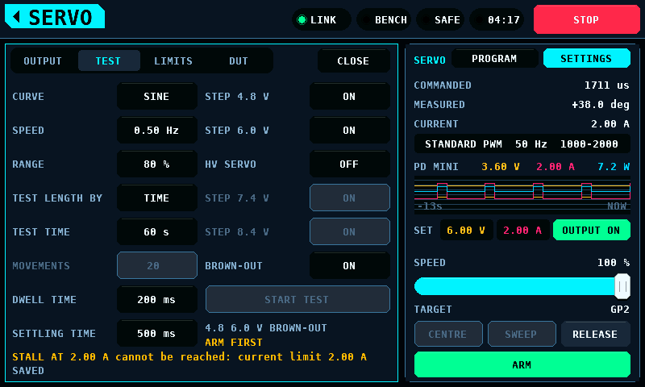
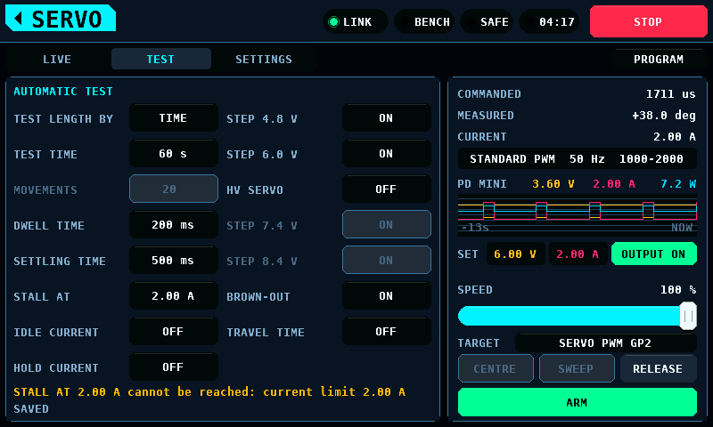
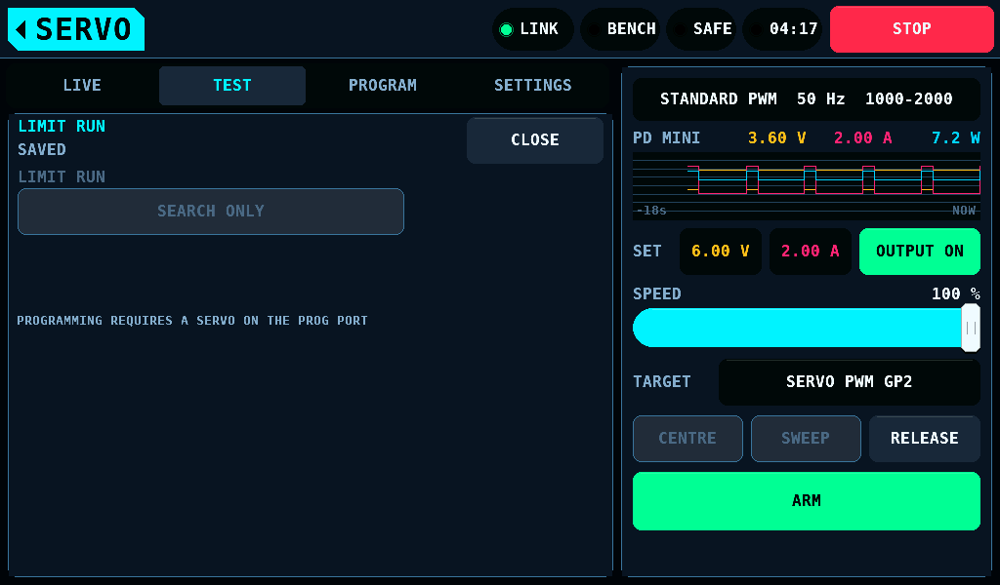
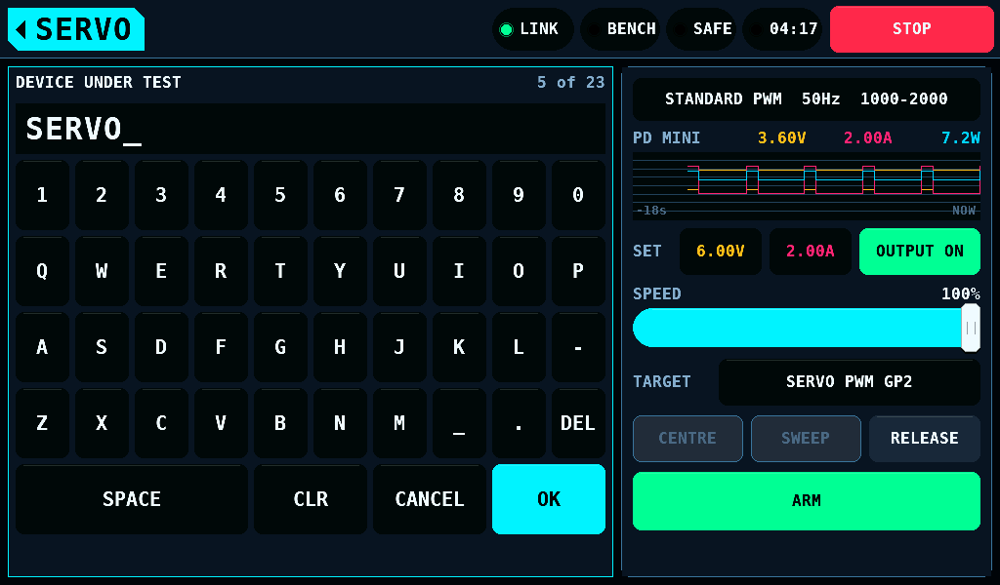

Current limitations:

- Until the screen sends a position, the pins run at the rate the SERVO page
  holds, which after a restart or a new binding is 50 Hz.
- On the panel's supply model the automatic test's currents are the model's load, not the servo's: a run there
  measures the model. [What is not measured](Servo.md#what-is-not-measured).
- The supply on the right card is SUPPLY's: the PD mini when SETUP enables
  it, the panel's model otherwise, whose voltage, current and power are
  simulated, not measured.

## Supply

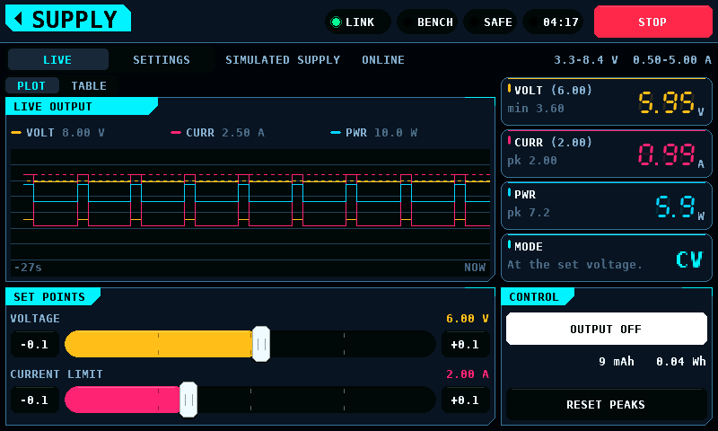

Sets, switches and records a programmable supply: the PD mini, a USB-PD (USB
Power Delivery) trigger controlled over a UART (universal asynchronous
receiver-transmitter). The IOmcu drives it on a PIO (programmable
input/output) UART on two of its pins, through the SUPPLY link page
(protocol 4.3). The panel writes the page and reads it every 100 ms. With
the PD mini enabled on SETUP under INTERFACES, the header names the module
and the IOmcu's UART pins that carry it, `PD MINI TX GP12 RX GP13`,
from the PD mini TX and PD mini RX settings. With either pin not set the
header says `PD MINI NO PINS`. With the PD mini disabled, the panel runs a model of a supply in its place: the header
says SIMULATED SUPPLY and the menu tile is marked SIMULATED.

SUPPLY is a workbench: a strip of tasks at the top, LIVE and SETTINGS
(German `LIVE`, `OPTIONEN`), each 112 x 24 px, and a page under it. The
menu's tile always opens LIVE. A tap on a tab switches the task; a switch
is no navigation level and leaves LIVE's view, PLOT or TABLE, as it was.

| Task | The left column, 546 px |
| --- | --- |
| LIVE | the plot or the table over the set points |
| SETTINGS | the 9 supply settings under LIMITS, AFTER RESTART, TRIPS and CONFIRM WHILE ON ([Supply settings](#supply-settings)) |

The header is the row right of the strip: the module and its pins, ONLINE
or NOT ANSWERING, and at the right end the range the set points may take,
for example `3.3-8.4 V  0.50-5.00 A`. It stays in sight on both tasks and
under the keypad and the question. The rail on the right, the readings,
OUTPUT ON and RESET PEAKS, is the same on both tasks.

The layout is the one MOTOR & ESC uses. The plot shows voltage, current and
power over the last 27 s. The rail shows the readings, the run's lowest
voltage and its highest current and power. MODE says which set point the
supply holds: CV (constant voltage) at the set voltage, or CC (constant
current) at the current limit. CC is drawn in the warning colour: a supply in
CC is not giving the load the voltage it was set to.

A set point is shown beside its reading. VOLT and CURR carry it in brackets
after the label, and the plot draws it as a dashed line in the reading's
colour, on the reading's scale. TABLE lists both. The bracketed value is the
set point the supply reports holding; while it does not answer, the one the
screen holds.

| Set point | Model | PD mini | Buttons |
| --- | --- | --- | --- |
| VOLTAGE | 3.3 to 21 V, 20 mV steps | 1 to 20 V, 10 mV steps | 0.1 V |
| CURRENT LIMIT | 0.5 to 5 A, 50 mA steps | 0.05 to 3 A, 10 mA steps | 0.1 A |

The model's ranges are a USB-PD PPS (Programmable Power Supply) source's
widest profile, 3.3 to 21 V at up to 5 A. The PD mini's are from the
vendor's page, not measured. The PD mini is a buck converter and gives no
more than it is fed: its voltage is also capped 0.7 V under the input voltage
it reports, so a 5 V input voltage allows at most 4.3 V. An input voltage
under 1.7 V leaves the 1 V minimum, which the screen shows as the cap, and
one under 1.5 V holds the output off; until the input voltage is read the
cap is 20 V. A set point over the input voltage
puts the module into ERR until it is power cycled; the margin it needs is
not measured. The cap lies 0.2 V above the line the output is cut at (see
below), so the input voltage can drop 0.2 V under load before a set point at the
cap is cut. Both are narrowed by the caps in SETTINGS, and
the sliders follow the supply in use. A tap on a track sets the value under
the finger.

**A tap on the VOLT or CURR card, or on a set point's value, opens a keypad**
over the left column. It shows the range in the title row and the current
value faint until a digit is typed. OK takes a value inside the range,
rounded to the supply's step; a value outside it is refused and the range
turns to the warning colour. OK with nothing typed, and CANCEL, leave the set
point as it was.

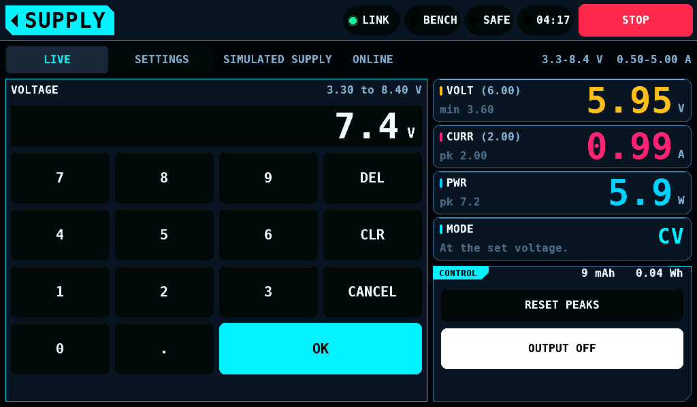

**A change to a live output asks first.** While the output is on, a new set
point from the slider or its step buttons, or from the keypad, opens a
question that names the change. APPLY gives it to the supply; CANCEL drops it
and the slider goes back. A drag asks once, on the release, and the supply
holds the old set point until then. A drag that ends without its finger
lifting -- the home tag tapped with a second finger, or a contact the touch
controller loses -- asks nothing, and the slider goes back. With the output
off nothing is asked.
STOP closes the question unanswered: an APPLY tapped in the same frame
(about 50 ms) as STOP applies nothing. SETTINGS switches the question off for the slider and for the keypad
separately.

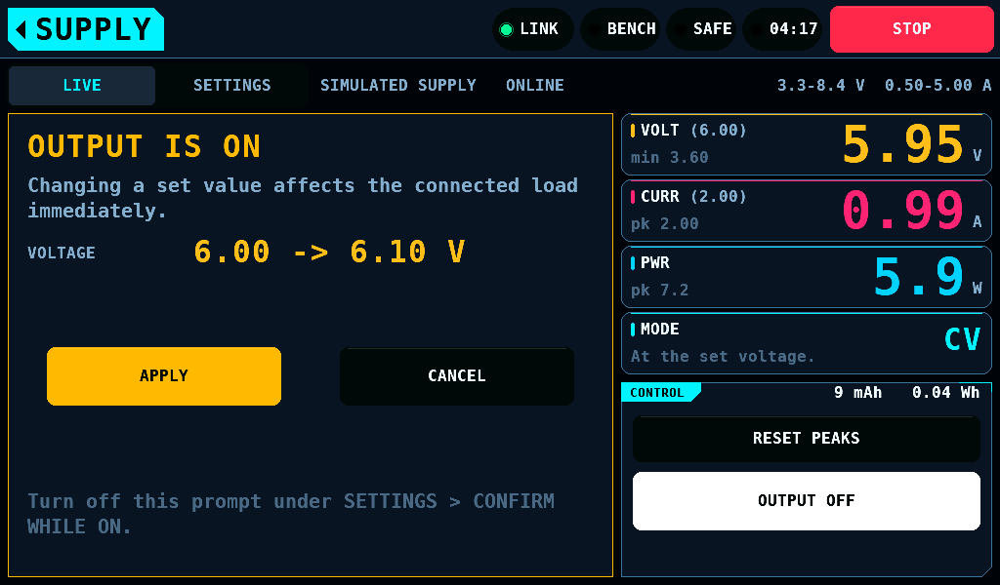

**OUTPUT ON is a two-second hold**, the gesture and the fade ARM uses. OUTPUT
OFF is a tap. STOP switches the output off on every screen. So does every
other stop the bench counts -- touch that stops answering, an ON whose touch
events went missing before a whole frame saw the output on, and the
IOmcu refusing to stay ARMED -- and a supply that stops answering, and a
trip. The output stays off until it is switched on again. Leaving the screen
switches off an output SUPPLY switched on: one reported on, or an ON on its
way. SERVO and ESC STICK do the same for the output each switched on, so an
output is on only while the screen that switched it on is shown. The
exception: an output SERVO switched on stays on after SERVO is left while the
servo programmer holds its port, until the port lets go (see SERVO). A servo
is powered from SERVO and an ESC from ESC STICK. MOTOR & ESC switches no
supply; an ESC run there is powered from its own source. An output another
screen switched on stays as it is when SUPPLY is left. The keypad, the
question, the other overlays of SUPPLY and a switch of task are no leave. The link-lost screen,
which has no STOP, does not open while the output is on.

**The home tag climbs one level at a time.** The output stays as it is
while it climbs:

| From | The home tag leads to |
| --- | --- |
| the question | what is under it; the change is dropped, as CANCEL drops it |
| a keypad | what is under it, LIVE or SETTINGS; the value is not changed |
| LIVE or SETTINGS | the menu; an output SUPPLY switched on goes off |

The tasks are siblings, not levels, as on MOTOR & ESC and SERVO: the home
tag never climbs from SETTINGS to LIVE.

**With the PD mini**, an OFF goes to the SUPPLY page before anything else
the panel owes it, and the IOmcu switches the output off itself when
the panel's heartbeat stops. An enabled PD mini reads NOT ANSWERING while no
IOmcu that speaks protocol 4.3 answers, or while the page's readings
are older than 1500 ms; an output that is on is switched off then. A page
that answers while the module's reading count (SAMPLES) stands -- a display
read that fails while the other reads answer -- keeps ONLINE: after
1500 ms without a new reading the voltage, current and power cards show
dashes and no trip, peak or total takes a reading, and after 3000 ms (`SUPPLY_LINK_BLIND_MS`) an
output that is on is switched off and the band says
`No readings from the supply. Output off.`. A set point changed faster than
the module takes it -- the slider dragged with SLIDER AND STEPS off, about
one new set point every 50 ms -- does not hold the readings back: a reading
400 ms past its due (`PDMINI_POLL_LATE_MS`) goes before the next set-point
write, one at a time with another transaction between two; the state read,
and the input voltage read before a write, may also follow another reading straight
away. With a module that answers at once, the display is then read about
500 ms after the last display read and the output state about 900 ms after
the last state read, each with up to two transactions more. An output the
module switches on while it is off on the panel, or switches off itself, is
seen during the drag. The input voltage is read before a set-point write or an ON
only when one is waiting, and not between the reads for an ON. Set points
and an ON reach a module that answers up to 390 ms late (the driver waits
400 ms; host model, 40 start phases): one set point within 2.5 s; an ON
within 3.6 s when the set points are already written, up to 7.5 s when it
is asked right after a set point change or a drag; a module switching its
output itself seen within 2.1 s during a drag. An output the module
switches on while OFF is asked is switched off about 500 ms later with a
module that answers at once, up to 1.8 s later at rest and up to 2.1 s
during a drag with one that answers up to 390 ms late. The real module's
reply time is not measured.
Current limitation: a module that answers late stretches the 500 ms of the
state and input voltage reads, as each transaction takes its reply time. At rest
the input voltage is read 850 ms apart at 100 ms late, 1.3 s apart at 200 ms and
2.5 s apart at 390 ms; the state up to 1.5 s apart.
Current limitation: with a module answering 279 ms or more late and the
slider dragged, the display is read only 3.7 s to 5.0 s after the last
display read (5.0 s at 390 ms), past `SUPPLY_LINK_BLIND_MS`; an output that
is on is switched off and the band says
`No readings from the supply. Output off.`. The panel reads the page every
100 ms, which adds up to 100 ms to the gap it sees: from 263 ms late the
driver's gap is over 2.9 s, so the cut is possible from 263 ms. At rest the
display read stands up to 2.5 s at 390 ms. It stands over 1.4 s from
259 ms late and 1.5 s from 279 ms, so the cards can show dashes from about
260 ms. The
output is also switched off, with a line in the band, when the IOmcu
refuses an ON (no heartbeat) or lets one go (its heartbeat stopped, or it
started again). The output is switched off too, and not on
again until a new hold, when the module switches it off itself -- its
overcurrent protection or its button. The band also says when the pins are
refused, when the output would not switch, and when the set points would not
take. A pin or baud change, and enabling or disabling the PD mini, switch the
output off.

**A sagging input voltage switches the PD mini off.** While the output is on, the
IOmcu reads the input voltage of the module every 500 ms with a module that
answers at once, and further apart with one that answers late (see above).
When the input voltage reads under the set point plus 0.5 V on 2 reads in a
row, it switches the output off at once, and the band names the input voltage
and the set point, for example
`PD mini input 6.18 V is below the required 6.00 V + 0.5 V. Output off.`. From the
sag to the cut takes about 1.0 s with a module that answers at once.
Current limitation: with one that answers late it takes 1.7 s at 100 ms
late, 1.9 s at 200 ms and up to 4.7 s up to 390 ms (host model). The
output stays off until a new hold. An input voltage reading under 1.5 V leaves no
room for the lowest set point, 1.0 V: the ON is not written, and the band
shows the same message. One low reading switches nothing, and a
read that fails neither counts nor clears. While the output is on, its set
point is not lowered to follow a falling input voltage. The rule is chosen without
a bench measurement: whether a live module goes to ERR when its input voltage
sags is not measured, so the rule may cut a run that would have survived.

OUTPUT ON and OFF, RESET PEAKS and the readings stay live on SETTINGS and
under the keypad and the question. One finger at a time: while one holds a control, a
second finger does nothing anywhere on the screen.

### Supply settings

SETTINGS, the strip's second tab, shows the supply's settings in the left
column. Each is kept in the panel's NVS (non-volatile storage) and survives
a restart. A value opens the keypad over the page; a switch flips on the
tap. A tap on LIVE while the keypad is open closes it, and the setting keeps
its value, as CANCEL leaves it. The same holds for a set point's keypad and
a tap on SETTINGS. While the question about a live output is open, the
strip takes no tap until APPLY or CANCEL answers it. Every change is written at the next frame the bench is SAFE with
no switch to ARMED waiting, the supply's output is off with no ON queued and the board's
drawing is not being fetched or kept, and with it any change on SETUP that was not saved: a flash write stalls both
cores, OUTPUT OFF and the trips included. The bottom line says SAVED, SAVE PENDING, NOT SAVED (the write was refused), or SETUP CHANGES NOT SAVED: a
change made on SETUP and left without SAVE, which nothing writes until SAVE
there or a change here asks for it.

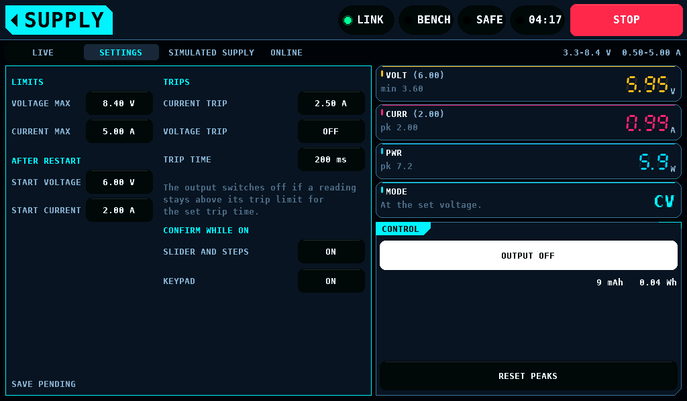

| Setting | Range | Default | What it does |
| --- | --- | --- | --- |
| VOLTAGE MAX | 3.3 to 21 V | 21.00 V | the highest voltage a set point takes |
| CURRENT MAX | 0.5 to 5 A | 5.00 A | the highest current limit a set point takes |
| START VOLTAGE | up to VOLTAGE MAX | 6.00 V | the voltage set point after a restart |
| START CURRENT | up to CURRENT MAX | 2.00 A | the current limit after a restart |
| CURRENT TRIP | 0 to 5 A | OFF | output off once the current has been over it for TRIP TIME |
| VOLTAGE TRIP | 0 to 21 V | OFF | output off once the voltage has been over it for TRIP TIME |
| TRIP TIME | 0 to 5000 ms | 100 ms | how long a reading is over a trip before it fires |
| SLIDER AND STEPS | ON, OFF | ON | ask before the slider changes a live output |
| KEYPAD | ON, OFF | ON | ask before the keypad changes a live output |

A cap lowered under a set point brings the set point down to it at once, and a
start value with it. A typed value goes onto the setting's step the safe way: a
cap rounds down, so 12.01 V allows 12.00 V, and a trip typed above 0 is at
least one step, never OFF. A trip of 0 is off. The time over a trip counts from
the first reading over it. A reading under its trip starts the
count again; a reading that did not arrive leaves it where it was. A trip
switches the output off, MODE shows TRIPPED until the output is switched on
again, and the band says which trip fired. The supply holds its current limit
in CC, so a current trip at or above CURRENT LIMIT does not fire; set it below
the limit to switch off a load that draws too much for too long.

The output stays off at a restart, whatever the start values.

With the PD mini as the supply, SETTINGS also offers RESET PD MINI. It
switches the output off and restarts the module (its SYSTEM_RESET command),
for a module that shows ERR -- a set point over its input voltage puts it there --
without unplugging it. The module is asked who it is again about 1 s later.
Whether a restart clears every ERR is not measured. An IOmcu older than
protocol 4.4 has no reset: the output goes off and the band says so.

### The log

A run is one switch-on of the output. The plot clears when the output comes on
and holds the run after it goes off. The mAh and Wh under the switch count the
run from the readings shown, each step capped at 1 s. RESET PEAKS starts the
lowest and highest values again from the current reading.

A run is recorded to a `SUPPLnnn.CSV` of its own in `BENCH/LOGS`, one row
every 50 ms, while Auto logs on [Setup](#setup) > SD CARD is ON:

```
time (s);set (V);voltage (V);limit (A);current (A);power (W);mode;charge (mAh);energy (Wh);source
```

A reading that did not arrive is an empty cell. `mode` is CV, CC or OFF, and
empty while the supply does not answer. `source` is `measured` for the PD mini's
readings and `model` for the panel's model. The bench takes the log: switching to ARMED during
a supply run ends that run's file, and an output still on at the switch to SAFE starts
a new file. That file's charge and energy go on from the totals counted since
the output came on, as the screen's do, so its first row does not start at 0. The supply is stepped and logged on its own 50 ms cadence while
the control task waits on the link, so an unanswered IOmcu does not thin
out the supply's plot or its log.

The model is a 6 ohm load with a 1.4 A burst for 0.6 s every 3 s, behind a
0.05 ohm source resistance. At the starting set points, 6.00 V and 2.00 A, the
burst takes it into CC. Its readings are not measured and nothing on the bench
is powered.

The PD mini's wiring -- PD mini, PD mini TX, PD mini RX and PD mini baud -- is
on SETUP under INTERFACES. TX and RX are IOmcu GPIO numbers: TX goes to
the module's DM, RX comes from its DP. The IOmcu refuses a pin that is
reserved, bound to an output or the other pin. Once the module has
answered, a change waits for a state read of the module sent after it, at
most about 1.2 s, and is taken only if that read shows the output off: the
module can switch itself on between two state reads, by its button
or its AUTO OUT setting, and new pins would leave it no OFF path. A read
that shows the output on, or fails, refuses the change, and the band says
`PD mini wiring rejected. Its output may still be on.`. A refused change is not
written again until the wiring changes in SETUP. PD mini baud is the module's
own UART Baudrate setting: 9600, 19200 (as shipped), 38400, 57600,
115200, 230400 or 460800 baud, or AUTO. AUTO, the default, lets the
IOmcu find it: it tries each of the 7 rates, one a second. The
SUPPLY header shows the rate in use after ONLINE, e.g. `ONLINE 38400`, with
AUTO and with a fixed rate alike.

## Receiver

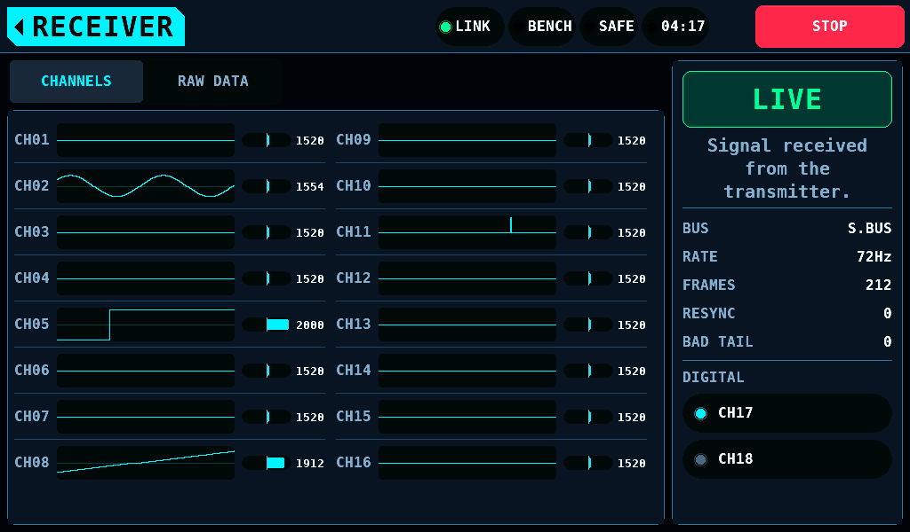

Sixteen channels, each with about 1.7 s of history (118 samples) and a bar for its current value.
CH17 and CH18 are the two digital channels. A glitch is a spike in one lane; a
dropout is a notch across all sixteen at the same instant.

No firmware feeds this screen yet (see [Receiver buses](Receivers.md)); it
shows NO SIGNAL.

The state block shows one of NO SIGNAL, FAILSAFE, FRAME LOST and LIVE, with one
line of explanation:

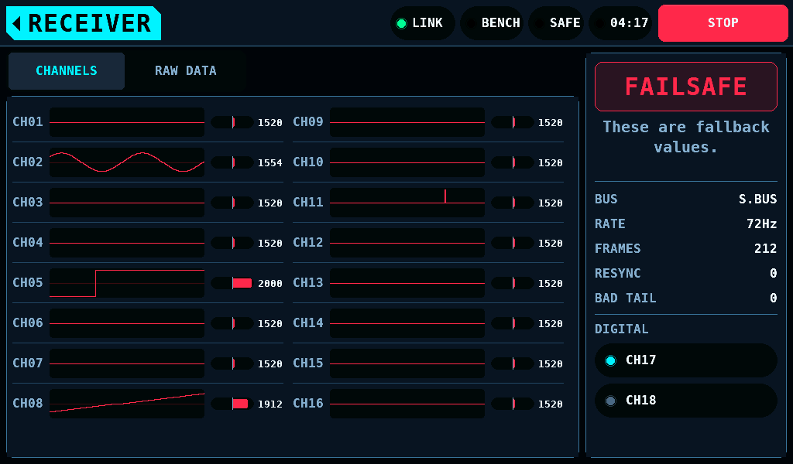

In FAILSAFE the receiver is sending well-formed values it has generated itself;
every trace is drawn red. Treat FAILSAFE as a stop, not as sixteen valid
channels. [Receiver buses](Receivers.md) describes the states.

## Battery

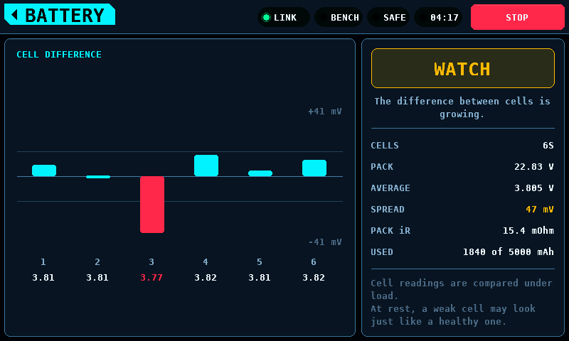

Cells are drawn as their departure from the pack's mean. The verdict follows
the spread, the widest gap between any two cells: HEALTHY below 30 mV, WATCH
from 30 mV, REPLACE from 60 mV. The scale follows the pack down to a floor of
12 mV and is printed beside the plot.

Measure under load. At rest a weak cell reads like the others.

No firmware feeds this screen: no cell monitor is read, so a bench shows
NO PACK. The picture above is rendered from a model.

## Logs

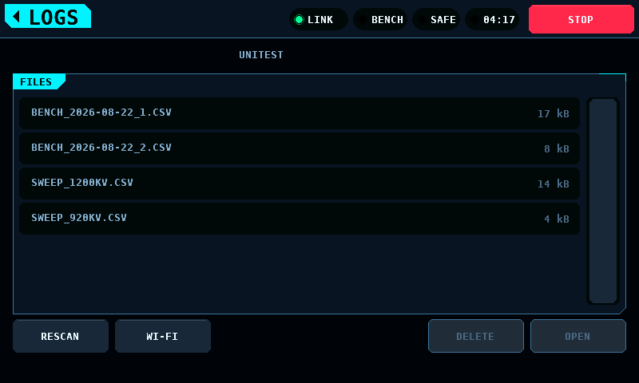

Browse the card, open a file, check what the import detected, then plot:

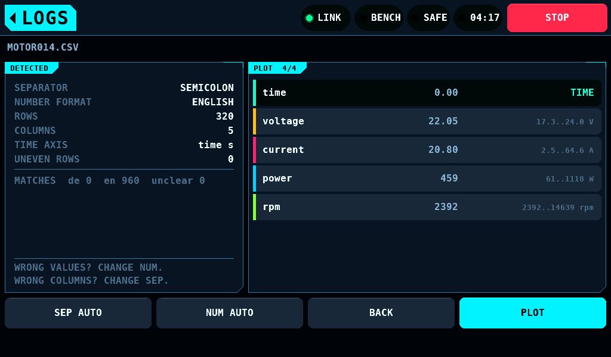
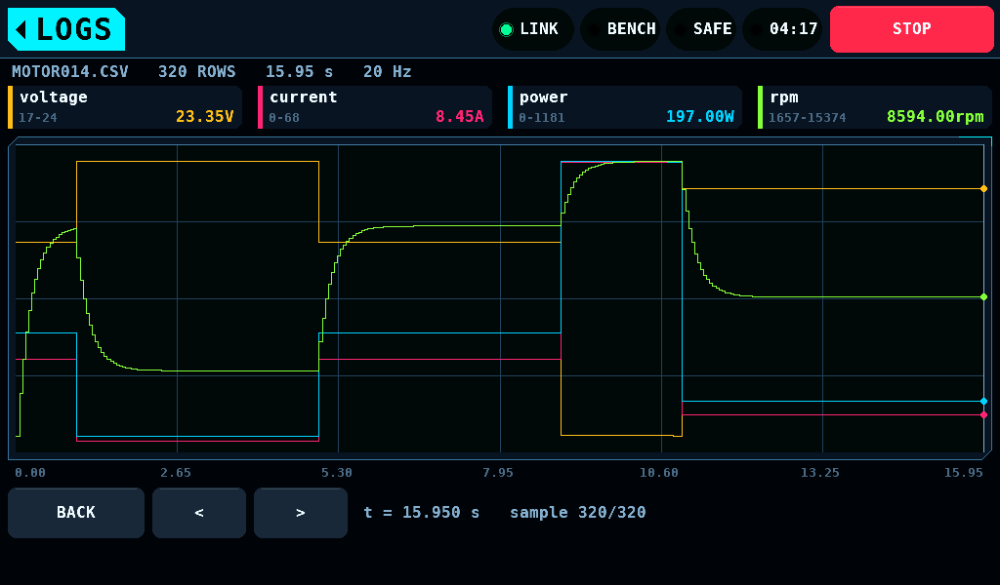

The home tag climbs one level, as BACK does: the plot to the import view,
the import view to the file list, the file list to the menu. Over the DELETE
question it is CANCEL. WI-FI, in the bottom row beside RESCAN, opens
[Wi-Fi](#wi-fi).

The CSV (comma-separated values) reader accepts decimal comma and decimal
point, a units row and ragged rows; the import view shows what it decided
before the file is plotted. Each numeric column shows its range, lowest to
highest: one decimal while both ends are below 1000, none from 1000 on
(`11.9..12.6 V`, `2392..14639 rpm`). A range wider than the 17 glyphs of
its box drops the decimal, then the space before the unit
(`-1000..-1000 rpm`, `-14639..-14639rpm`); a wider one is cut at the box's
edge. A row ends at its line feed (LF, 0x0A).
Text after the last line feed is a row cut off by a power loss or a full
card: it can hold every field and a number cut short, `95` of `9554`, so it
is left out of the rows, the figures and the plot. ROWS then shows in the
warning colour and the import view says `INCOMPLETE LAST ROW. SKIPPED.`. A
file from another program that ends without a line feed loses its last row
the same way. Spaces, tabs and carriage returns (CR) after the last line
feed are no row.

Runs recorded by the bench are written to two folders of the card, each run
under the name of what started it and a number from 001 to 999. The panel
makes each folder, one level at a time, the first time it writes there:

| Folder | Name | Run |
| --- | --- | --- |
| `BENCH/LOGS` | `SERVOnnn.CSV` | one switch to ARMED from SERVO |
| `BENCH/LOGS` | `MOTORnnn.CSV` | one switch to ARMED from MOTOR & ESC's ARM or a stick run on its PROGRAM |
| `BENCH/LOGS` | `SUPPLnnn.CSV` | one switch-on of the SUPPLY output while the bench is SAFE |
| `USER/LOGS` | `ATESTnnn.CSV` | one AUTOMATIC TEST; its report is `ATESTnnn.TXT` |
| `USER/LOGS` | `LIMITnnn.TXT` | one LIMIT RUN's report, with no CSV beside it |

The name follows the screen that armed the bench: an arm that asks for the
throttle outputs writes `MOTORnnn`, an arm that asks for the surfaces writes
`SERVOnnn`. An IOmcu older than protocol 4.18 arms the throttle outputs with
every arm; a switch to ARMED from SERVO still writes `SERVOnnn.CSV`.

Two switches on [Setup](#setup) > SD CARD decide what is written. Auto logs
OFF writes nothing to `BENCH/LOGS`; switched off during a run, it ends that
run's file. User logs OFF writes nothing to `USER/LOGS`; a test keeps the
state it started with. Both are ON by default. The fault log,
`BENCH/RCBENCH.LOG`, is written whatever the switches say.

Firmware 0.21 and older wrote every run to the card's root as
`BENCHnnn.CSV`, `ESCnnn.CSV`, `SERVOnnn.CSV` with its `SERVOnnn.TXT` (a
servo test) and `SERVOnnn.TXT` alone (a limit run). Those files stay where
they are and stay readable: nothing moves them, and the ROOT tab lists them.

The numbers are one series per folder, across every name in it: the next
run takes one above the highest number the folder holds, whichever name
carries it, so in `BENCH/LOGS` `SUPPL041.CSV` and `SERVO042.CSV` are
followed by `MOTOR043.CSV` or `SUPPL043.CSV`. A number carried by a CSV or a
TXT file is taken, and so is one carried by a folder's name. The panel walks
a folder once, the first time it writes there after a start, and remembers
the number after that; before it takes a number it checks the 10 names that
number can carry (5 names, CSV and TXT), so a file written in between is
stepped over and not overwritten. A gap left by a deleted file is not
filled. A folder holding a number 999 under any name takes no further run,
even with lower numbers free: the band reads
`Card full or not writable. Run not recorded.`, or for a test
`Card missing or full. Servo test not recorded.` A folder that cannot be
made, because a file holds its name or the card is write-protected or full,
reads `Cannot make folder BENCH/LOGS. Run not recorded.` A failed run makes
the panel walk the folder again next time, so a file deleted in between
frees its number. The list shows the CSV files and not the reports, and
DELETE on a run removes the report with the same name and number too.
Runs are listed newest first by number, across all names in the folder:
`MOTOR043.CSV`, then `SERVO042.CSV`, then `SUPPL041.CSV`.

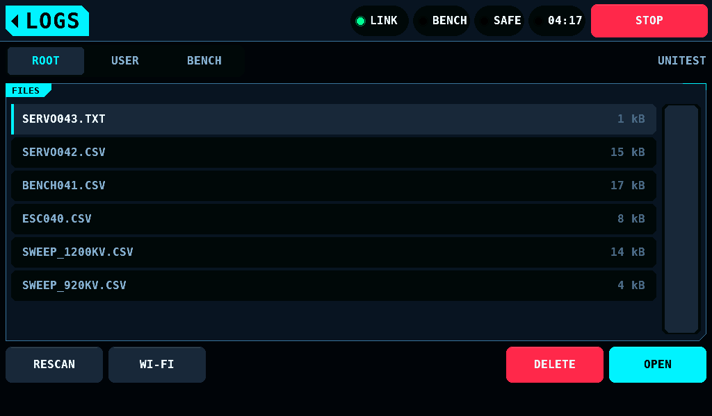

Three tabs at the header row's left choose the folder on the list: USER
(`USER/LOGS`), BENCH (`BENCH/LOGS`) and ROOT (the card's root). A tab
tapped lists its folder from the first page. The header right of the tabs
names the card and the folder, `UNITEST  BENCH/LOGS`, and the card alone on
ROOT. An empty folder says why and what goes there:
`No .csv files in BENCH/LOGS.` and the names it takes, or with its switch OFF
`AUTO LOGS OFF in SETUP > SD CARD.`. Under the DELETE question the tabs are
hidden. A file opened from one tab stays that tab's file: its import view
and plot read it from that folder whichever tab is chosen since.

The list shows the folder a page of 48 entries at a time, and a folder holds
up to 999 runs. Pages run newest run first: runs by number, highest first, then
the files the bench did not write, by name. The rows of a page run the same
way, the newest run at the top. The number in the name is what newest means:
the panel has no clock that survives a power cycle, so every file on the card
is dated 1980-01-01.

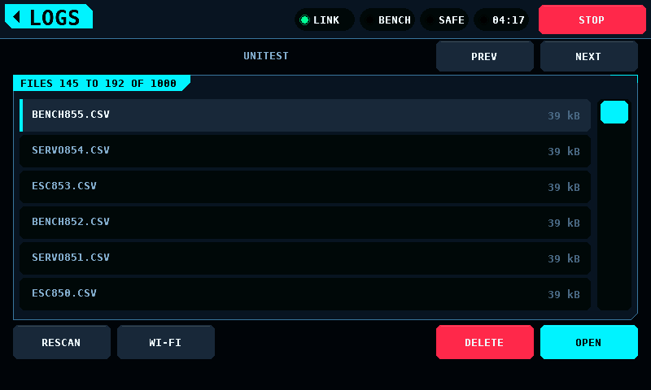

With more than 48 files in the folder, PREV and NEXT show in the header row and
the tab names the page's part of the card, `FILES 145 TO 192 OF 1000`, instead
of `FILES`. PREV is grey on the first page and NEXT on the last. Pages are cut
from the top, 48 at a time: when fewer than 48 entries stand ahead of the page
on screen, for example after a run was recorded, PREV reads the first page
from the top. Runs recorded while a later page is open are on page 1. PREV
back from page 3 or later then passes over as many entries as were recorded;
NEXT from page 1 shows them, and the tab numbers show the shift. Each page is one
read of the tab's folder: the walk keeps the 48 entries of that page
and counts the rest, so the panel holds one page in memory whatever the card
holds. The read runs on the task that draws the screen and handles touch. For
999 runs the selection takes about 2 ms on a desktop computer (x86-64,
measured); on the panel it is estimated at 20 to 40 ms, and the directory read
at 63 sectors of 512 bytes, about 25 ms at the card's 20 MHz SPI (Serial
Peripheral Interface) clock, or 125 sectors, about 50 ms, with a report beside
every run. Neither is measured on the panel. Each entry's size comes with the
directory read, so a page costs one walk and the selection.

The scroll bar along the list's right edge is 42 px wide, 8.1 mm on the
panel's 0.194 mm pixels. Its thumb is the rows on screen against the rows on
the page, and it scrolls within the page. A tap on the track brings the
thumb's middle to the finger; a finger on the thumb drags it.

LOGS reads the card each time it opens, from the menu or back from WI-FI:
the first page of the tab's folder, its newest run selected, so a run
recorded while LOGS was closed is on the list without RESCAN. When the panel
has written a file since LOGS was last open, LOGS opens on that file's tab;
otherwise the tab stays as it was left, and BENCH after a restart. A file's import or plot view left open
stays open; the list behind it is the one just read.

RESCAN reads the page on screen again. On the first page it reads from the
top, so a run recorded since shows. On another page it reads from that page's
first entry, also when that file has been deleted since. When the folder holds
fewer entries than that place, RESCAN shows the last page. Every read selects
the page's newest run, the top row, so OPEN opens the run just recorded. A
page with no numbered run selects nothing. DELETE reads the page again the
same way and keeps the scroll, with nothing selected: DELETE and OPEN are grey
until a row is chosen. Deleting the last page's only file shows the page
before.

The header names the card by its volume label, read once when the card is
mounted. A card without a label shows the product name the card reports
(for example `SC16G`), and a card that reports neither shows `SD CARD`.

A card put in while none is mounted is mounted by RESCAN and opens on its
first page. A card swapped for another while one is mounted is not mounted
again until the panel restarts
([STATUS](https://github.com/subtilitas/rcbench/blob/main/STATUS.md)); what
the list shows in that state is not measured. The viewer reads from the first
page whenever the name in the header changes, and on the panel that name
changes only with a new mount. Two cards with the same label, or two
unlabelled cards of one model, carry the same name.

In the plot, two fingers zoom: spreading them zooms in, pinching zooms out,
and moving both together pans. The view stays where the fingers leave it, and
a bar under the plot shows which part of the run is on screen. The narrowest
view is 8 samples, the widest the whole run. One finger and the `<` and `>`
buttons move the cursor as before; stepping the cursor past the edge of a
zoomed view carries the view with it. BACK returns to the import view.

The plot places the rows evenly by row number. The labels under it and the
cursor's read-out are the file's time column, counted from the file's first
row, and the header's duration is the last row's time less the first's. A
gap in the rows is a jump in those times, not a wider stretch of plot. For
a run with the bench in ARMED the time is wall time, so the duration is the run's;
for a file written by firmware 0.15.0 or older it is shorter than the run
(see Motor & ESC, the CSV file).

SETUP → PANEL → One finger pans, off by default, lets a single finger
pan a zoomed view. While it is on and the view is zoomed in, a finger that
moves more than 10 px from where it touched down drags the view sideways, and
the sample under the finger stays under it. A touch that stays within 10 px
selects a value as with the setting off, and a pan leaves the cursor where it
was. A view that shows the whole run is not panned: one finger moves the
cursor. A second finger on the plot starts a zoom, as before.

A button or a row on LOGS takes a tap. It acts when the finger that pressed
it lifts inside it, having been no more than 8 px from the press in x and in
y. A vertical drag of more than 8 px on the file list or on the column list
scrolls it and selects nothing. On those two views one finger at a time
presses; a second finger does nothing.

DELETE removes the selected file from the card. It asks first: a second panel
names the file and its size, and only its own DELETE, pressed and released on
that button, removes the file. CANCEL, or leaving the screen, closes the
question without deleting. The run the logger has open is refused. A file
that was open in the import view or the plot is dropped from both when it is
deleted. The logger numbers each run above the highest run it found on the
card. It reads the card at the first run after boot and after a run that could
not be opened, and counts on from there otherwise. A deleted number is used
again only if it was above every run left on the card at that read.

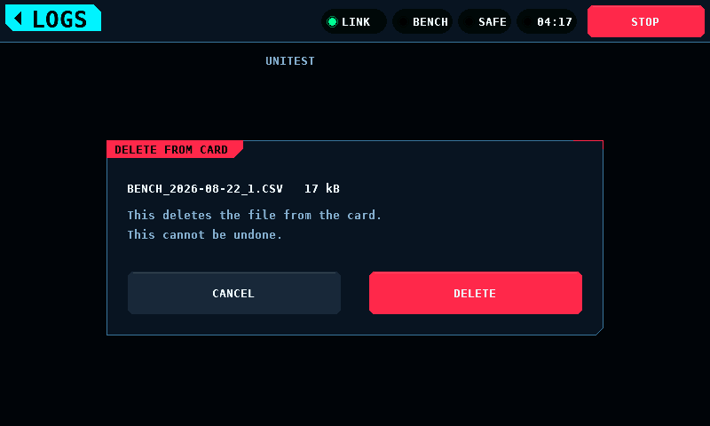

A run is committed to the card every 20 rows or 1000 ms of run, whichever
comes first. Power lost mid-run costs the rows the commit has not finished
with and the rows still in the queue between the control task and the card's
own task: under 1.0 s of run while the card keeps up, and 84 rows, 4.20 s at
the panel's 20 Hz sample rate, if the card has stalled and the queue is full.
The rest of the file is readable either way; a row the cut stopped part way
through has no line feed and is left out on reading (see [Logs](#logs)). The card is written by a task of its own: an SD (Secure
Digital) card is allowed 250 ms to finish a write, and the task that beats the
safety line has a ceiling of 150 ms.

Eight messages say what a card did to a run. Each appears on the band:

| Message | What happened |
|---|---|
| `No card. This run is not being recorded.` | nothing is mounted, so the run was never opened |
| `Cannot read the card. Run not recorded.` | the card would not list, so a run number could not be chosen |
| `Card full or not writable. Run not recorded.` | no run number could be created |
| `Card too slow. Run not recorded.` | every row was dropped, so there is no file for this run at all |
| `The card was too slow. Some data is missing from the recording.` | some rows were dropped; the file's time column shows where |
| `Data can no longer be saved to the card. Recording stopped here.` | a write failed mid-run; every later row is rejected |
| `Data could no longer be saved to the card. Recording incomplete.` | the same failure, said again when the run closes |
| `The last write to the card failed. Recording incomplete.` | the close failed, so the rows since the last commit are not in the file |

The first four mean there is no file to look for. The last four mean there is
one and it stops early.

A run being written is not offered in LOGS. A file's length lives in its
directory entry and is written when the file is closed, so a run still open
would list at its last committed length and read as a finished one.

## Wi-Fi

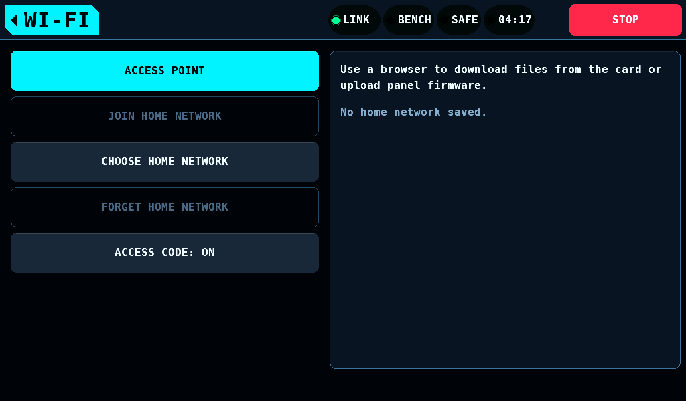

WI-FI runs the panel's Wi-Fi for two jobs in a browser: every file on the
card to download, and a panel firmware image to upload. It opens from the
WI-FI tile on [SETUP](#setup) and from WI-FI in the bottom row of
[LOGS](#logs). Its home tag returns to the screen that opened it, SETUP or
LOGS; so does CLOSE on PANEL UPDATE after an upload's install failed. Over
the network list or a keyboard the home tag climbs one level first, as
CANCEL does: from a keyboard to the list, keeping nothing typed, and from the
list to the buttons. Over the question about an uploaded image the home tag
is CANCEL: the image is dropped, a list or keyboard under the question
closes with it, and the screen stays. A second tap while the image is still
there leaves the screen. The
radio runs only while
this screen is open, and for the release check and the download of
[Updates](#updates). It is off at every start of the panel, and it goes off
when the screen is left, before an install writes the flash, and after
10 min without a request.

The radio starts only with the bench SAFE, the supply output off and no log
run open. Otherwise the buttons that start it are grey and the card says what
is missing:

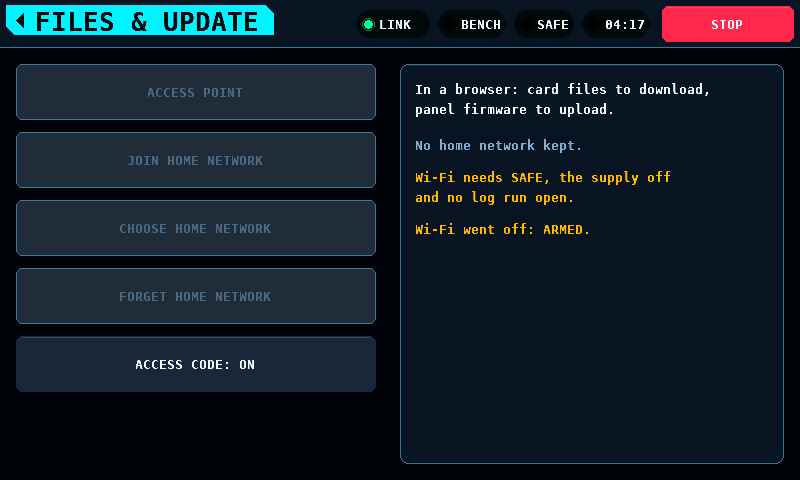

It goes off by itself on a switch to ARMED, on STOP, on the supply output
coming on, on a log run opening, after 10 min without a request and after 16
wrong access codes. The card then says which, in one line:
`Wi-Fi switched off: bench ARMED.`, `Wi-Fi switched off: STOP.`,
`Wi-Fi switched off: supply output on.`, `Wi-Fi switched off: a recording session started.`,
`Wi-Fi switched off after 10 min without a request.`,
`Wi-Fi switched off after 16 wrong access codes.`, or `Wi-Fi could not start.` A STOP
or a switch to ARMED also drops an uploaded image that waits on the panel.
While the radio is up, the link to the IOmcu and the heartbeat run as
on every other screen.

When Wi-Fi could not be set up at start (no memory for its lock or its
buffers), every button is grey and the card says `Wi-Fi setup failed at startup. It is unavailable. Restart to try again.` The rest of the panel runs
as without Wi-Fi.

### ACCESS POINT

ACCESS POINT starts the panel's own network. The screen shows what a phone
or a computer needs:

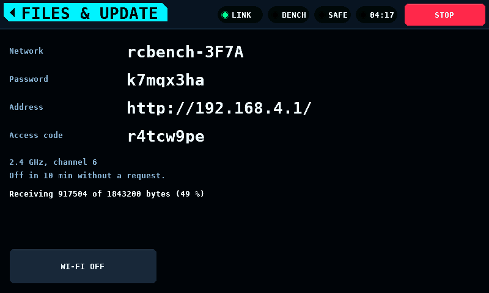

| | |
| --- | --- |
| Band and channel | 2.4 GHz, channel 6 (`WIFI_ACCESS_AP_CHANNEL`) |
| Security | WPA2 (Wi-Fi Protected Access 2) personal |
| Network name | `rcbench-` and 4 hex digits of the panel's MAC (media access control) address, `rcbench-3F7A` |
| Password | 8 characters, made new at every start, from `abcdefghjkmnpqrstuvwxyz23456789` (no 0, 1, i, l or o) |
| Clients | 1 at a time |
| IP address | `http://192.168.4.1/` |
| Range | not measured |

1. SETUP → WI-FI → ACCESS POINT, or LOGS → WI-FI → ACCESS POINT.
2. On the phone or the computer, join the network the screen names, with
   the password it shows.
3. Open `http://192.168.4.1/` and enter the access code the screen shows.

### Home network

The panel can join a network that is already there instead: WPA2 or WPA3
(Wi-Fi Protected Access 3) personal. Enterprise networks and open networks
are not offered.

CHOOSE HOME NETWORK scans for 10 s at most, then lists up to 16 networks,
strongest first, with their signal in dBm. A network without a name, an open
one and an enterprise one are left off the list.

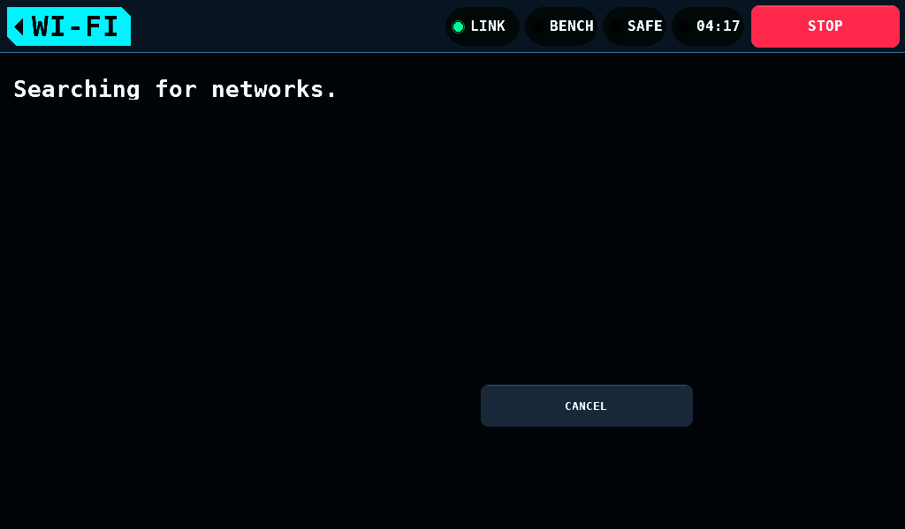
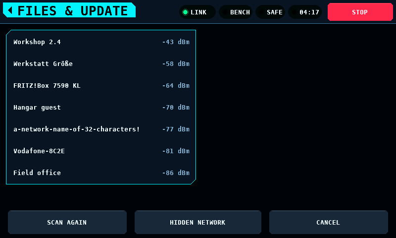

A tap on a network opens the keyboard for its password. HIDDEN NETWORK
opens it for the name of a network that does not announce itself, and then
for the password. SCAN AGAIN scans again; CANCEL goes back.


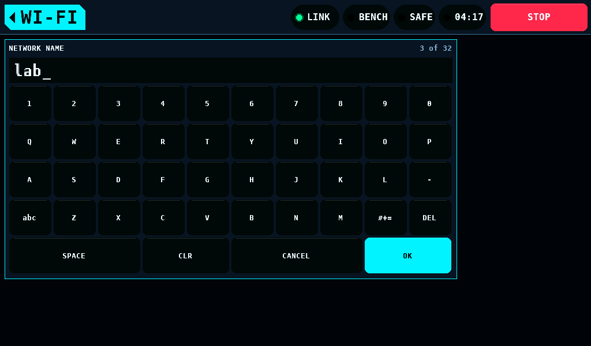
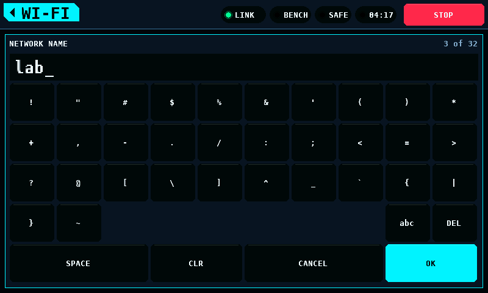

The keyboard has three layers of the same grid: lower case, `ABC` for upper
case, `#+=` for the 32 printable marks of ASCII (American Standard Code for
Information Interchange). Each of the 95 printable ASCII characters is on
one layer once; SPACE is the wide key. A name takes 1 to 32 bytes. A
password takes 8 to 63 characters, the WPA2 and WPA3 personal range: the
64th is refused, and OK under 8 says so.

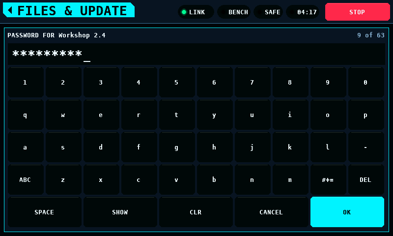
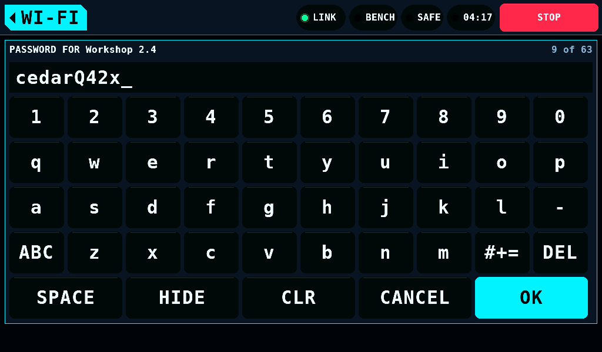
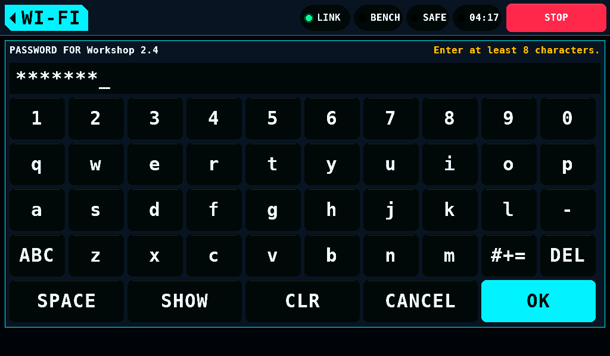

The password shows as dots until SHOW; HIDE hides it again. OK keeps the
network: its name and its password go to NVS (non-volatile storage), and the
screen then offers JOIN HOME NETWORK.

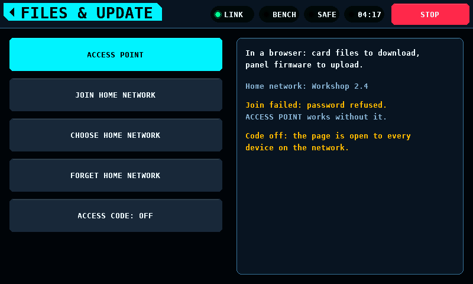

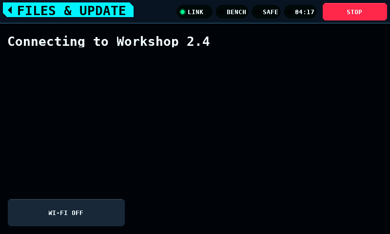
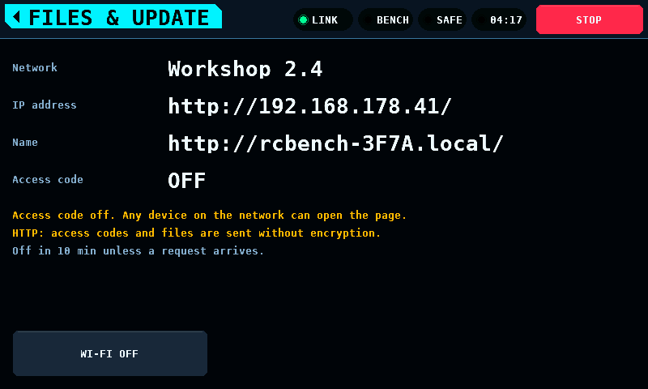

Joined, the screen shows the network, the panel's address and its name,
`http://rcbench-3F7A.local/`, with the same 4 hex digits as the access
point's name. The name answers through mDNS (multicast domain name system)
on computers that resolve `.local` names; which phones do is not measured.
The address works on every one. A name responder that fails to start (no
task, no socket, no multicast group) is tried again 3 times, 5 s apart
(`WA_MDNS_RETRIES`, `WA_MDNS_RETRY_MS`); after that the name stays silent
until the next join, and the address still works.

A join that fails says why, and offers ACCESS POINT, which works without
the home network:

| Line on the card | Condition |
| --- | --- |
| `Could not connect. Password rejected.` | 3 auth-class drops in a row within 20 s (`WA_AUTH_TRIES`): the key refused, a MIC (message integrity code) failure, or the key handshake out of time; or no association within 20 s (`WA_JOIN_MS`) with an auth-class drop as the last drop |
| `Could not connect. Network not found.` | no association within 20 s (`WA_JOIN_MS`), and the last drop of another kind, or none |
| `Connection failed. No IP address within 15 s.` | associated, and no address from DHCP (dynamic host configuration protocol) within 15 s (`WA_ADDRESS_MS`) |
| `Connection to the home network lost.` | joined, then the network dropped the panel |

A drop while joining connects again. One auth-class drop does not end the
join: ESP-IDF reports a wrong password and a key handshake answered late
with the same reasons, 15 and 204, and a correct password is answered late
when the panel or the router is busy. Any other drop sets the count back
to 0. Each drop goes to the serial log as one line with its reason number
(ESP-IDF's `wifi_err_reason_t`).

FORGET HOME NETWORK erases the name and the password from NVS and sets the
access code back to on.

A change of what is kept (a network, FORGET, the access code switch) takes
effect at once and reaches NVS on the next frame that may write flash. A
write that fails is tried again 3 times, 10 s apart (`WA_PENDING_RETRIES`,
`WA_PENDING_RETRY_MS`), and the card says `Not saved. Writing to flash failed. Saving will be tried again with the next change.` until one succeeds. The change holds
until the panel restarts either way; only a write that succeeded outlasts
the restart.

Current limitations:

- NVS is not encrypted. The home network's password is kept in plain form in
  the panel's flash, where anyone who reads the flash over USB (Universal
  Serial Bus) reads it.
- The page is plain HTTP (hypertext transfer protocol). On a home network
  the access code and every file cross the network unencrypted. The screen
  says so while joined.
- An uploaded image is checked against its own SHA-256, not against a
  signature. Any image built as `rcbench-panel` for the ESP32-S3 installs
  after the 2 s hold, and on a home network a device between the browser
  and the panel can replace the image on its way. The IOmcu image a
  panel image carries comes with it and is offered to the IOmcu at the
  next link-up.
- The panel joins only while this screen is open. A panel that stays joined
  whenever the bench is SAFE is not built.

### The access code

The page asks for an 8-character code before it lists a file or takes an
upload. The screen shows it, and it is made new at every start of the radio,
so a code from an earlier session opens nothing. The browser keeps it for the
session. 16 wrong codes switch the radio off.

ACCESS CODE switches it, for both ways in. It is on by default, after
FORGET HOME NETWORK and on a panel with nothing kept. The switch is kept in
NVS. Off, the page lists, sends files and takes an upload without a code,
and the screen says `Access code off. Any device on the network can open the page.` An upload still installs only after the 2 s hold on the
panel.

### The page

One HTML (hypertext markup language) page, with no script or style from
elsewhere, so it works on a phone with no other connection. It follows the
panel's language. It has two parts.

**Panel firmware.** The version installed, a file picker, Upload with a
progress bar, and the panel's answer as a line of text. The file is the
release asset `rcbench-panel-vX.Y.Z.bin`. A file larger than the panel's
slot, 4,063,232 bytes, is refused before a byte is sent. The panel checks
the whole image before it asks anything: the ESP image header for the
ESP32-S3, the application's project name `rcbench-panel`, a version of the
form MAJOR.MINOR.PATCH and the appended SHA-256 (secure hash algorithm, 256
bits). A second upload while one waits is refused until CANCEL on the panel.
The screen shows the bytes received while an upload runs.

**Files on the card.** Every file, folder by folder, with its name, its size
in bytes and its modification time as the card has it. Each name downloads
that file. The page reads the card only: nothing on it is deleted, renamed or
written. A name over 255 characters, a path over 384 bytes and a folder
deeper than 16 are left out, and the page says how many. With no card, or a
card that cannot be read, the page says so and the upload still works.

**Download all as one ZIP file** sends the whole card as one ZIP file. The
page gives the number of files, their bytes and the ZIP file's bytes before
the click. The files are stored as they are, not compressed, with their
folder paths from the card's root, names in UTF-8 and the card's times. A
file over 4 GiB − 1 B, an archive over 4 GiB − 1 B and more than 65,535
entries use ZIP64. Nothing is held in memory or written to the card to make
it: it is sent as it is read.

The transfer rate is not measured. A download of S bytes at a rate of R
bytes per second takes S / R seconds: at 1,000,000 B/s, a 50,000,000-byte
card takes 50 s. A card pulled during a download ends the download short;
the browser reports it as failed, and the panel runs on.

### Installing: PANEL UPDATE

An image the page received waits on the panel as a question with both
versions:

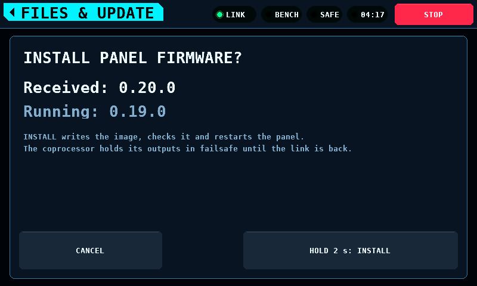

An older version is allowed and the question says it is older. A board
drawing being fetched or kept makes the install wait:

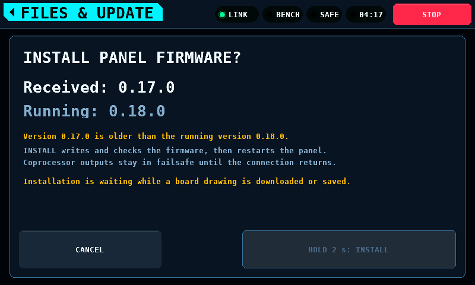

The same version from another build is offered as a reinstall. The build
that runs already is not offered:

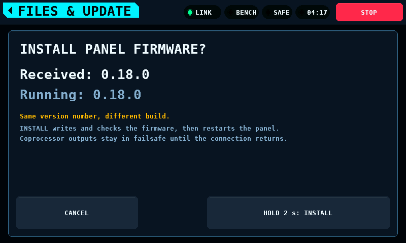
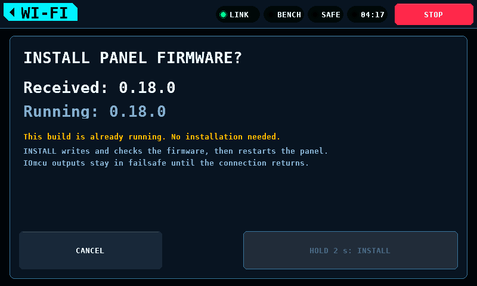

INSTALL is a 2 s hold (`HOLD 2 s: INSTALL`). The browser cannot start it.
It needs the bench SAFE, the supply output off, no log run open, no board
drawing being fetched or kept and no update of the IOmcu running
(`Installation is waiting for the IOmcu update to finish.`). CANCEL drops the image.

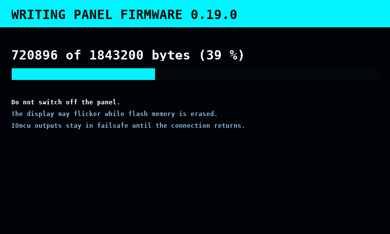

The hold switches the radio off first. Then the control task stops its polls
and withholds the heartbeat on purpose, so the IOmcu holds its outputs
in failsafe as it does at any restart of the panel. PANEL UPDATE takes the
whole screen, with no band and no STOP: nothing can be switched to ARMED
behind it. It writes the slot that is not running in pieces of 64 KiB and
shows the bytes and the percentage. The picture can be disturbed while the
flash is erased, and is in place again from the first whole frame after
each erase.
Then the slot is read back and checked, it becomes the one that starts, and
the panel restarts.

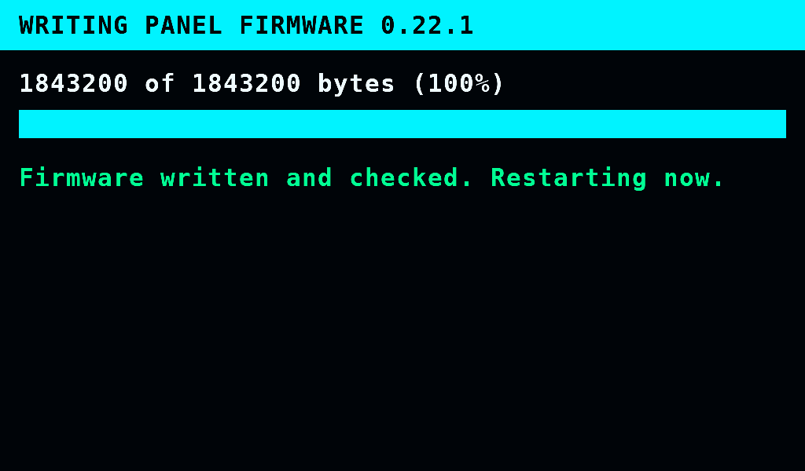

The splash shows the new version, and the band says
`Panel firmware 0.19.0 installed.`. A write that fails changes nothing that
starts: the running build stays, and CLOSE goes back to the screen that
opened WI-FI, SETUP or LOGS, or after a download from GitHub to where the
download started.

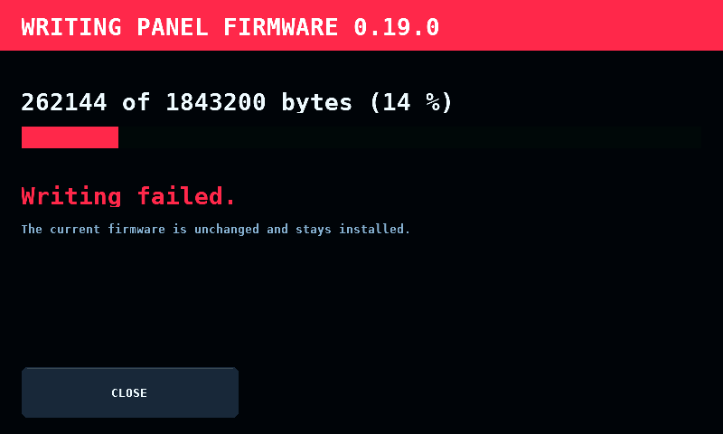

A new build's first start is a trial. The build is kept once the display and
touch are up. A start that does not get there, by a fault, a restart or a
missing touch controller, goes back to the build before it, which says
`Panel firmware 0.19.0 failed to start. Version 0.18.0 is running again.` on the band.
A failed start is never kept: when marking it invalid fails, the panel
restarts with the trial unconfirmed, and the bootloader goes back all the
same. When keeping a good start fails (otadata not written), the band says
`Panel firmware 0.19.0 was not kept. The next restart restores the previous version.`; the build
runs until then.

Current limitations:

- A power cut during the trial start loses that line; the panel still goes
  back to the build before.
- How long the erase and the write take is not measured, and neither is
  what the glass shows during an erase.

Before the first update over Wi-Fi, the panel needs one flash over USB to
reach the layout with two application slots: [First run, §1](FirstRun.md#1-flash-both-boards).

## Setup

The SETUP tile of the menu opens a page of tiles, 3 by 3, in the menu's
style. Each tile is 256 x 108 px, its icon centred over its name.

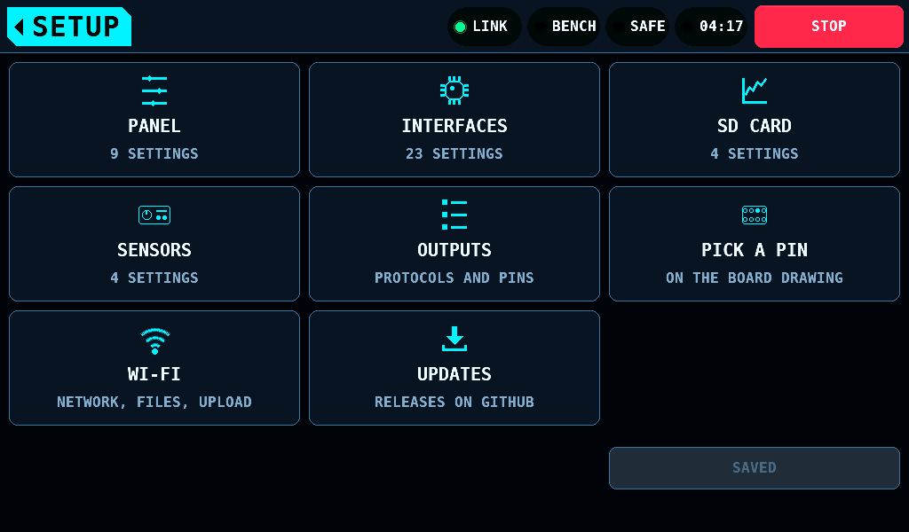

- Three categories: PANEL, INTERFACES and SD CARD, the bench-wide settings.
  Each tile names its number of settings. A tap opens the category's list.
  The settings of the pack, the motor and the throttle output are on
  MOTOR & ESC > SETTINGS
  ([MOTOR & ESC settings](#motor--esc-settings)).
- Four screens of their own: OUTPUTS ([Outputs](#outputs)), PICK A PIN
  ([Pick a pin](#pick-a-pin)), WI-FI ([Wi-Fi](#wi-fi)) and UPDATES
  ([Updates](#updates)). The band of each names it as its tile does, and
  the band of this page reads SETUP.
- Two slots are free. A tenth entry has no slot: the page holds 9, and
  the build fails at the tenth.
- SAVE, bottom right, is the same button the lists show
  ([Keeping the values](#keeping-the-values)). A change left unsaved in any
  category shows here too:

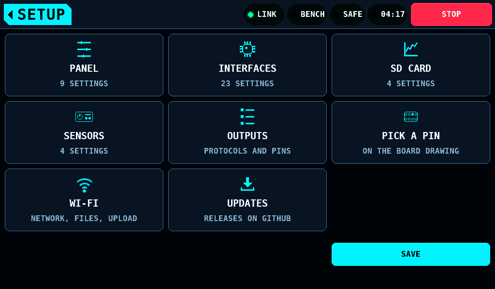

The same page in the light theme:

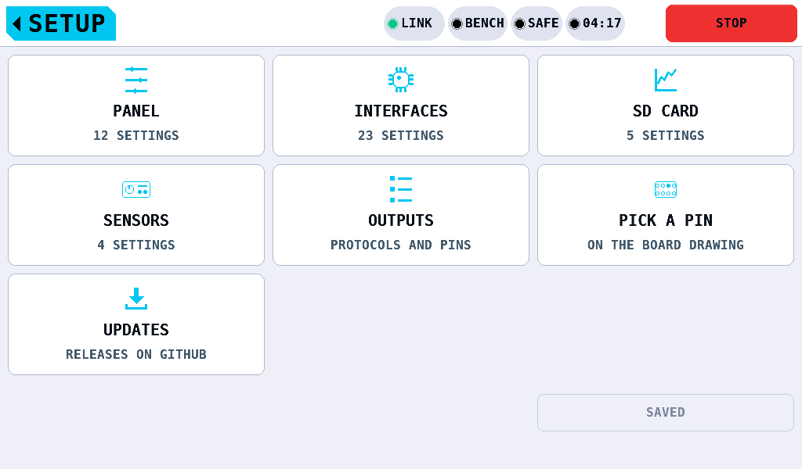

A category's list spans the panel's width, 776 px, and shows 348 px of it,
6 rows, over a strip of three columns: the category's name, RESET CATEGORY
and SAVE. The strip ends at panel y 442, 4 px above the alert band
([The alert band](#the-alert-band)), so an alert never covers a key, a row,
RESET CATEGORY or SAVE, on the tiles or on a list.

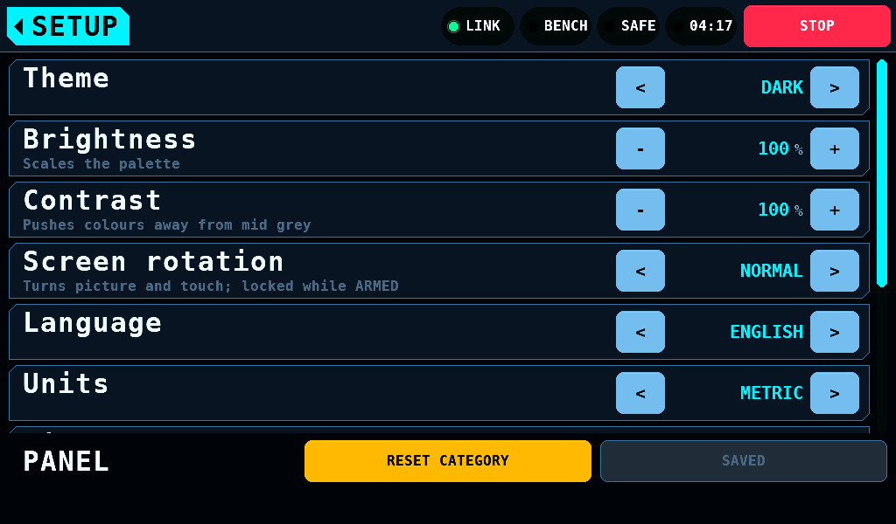

The home tag climbs one level at a time:

| From | The home tag leads to |
| --- | --- |
| a category's list | the tiles; the list keeps its position |
| the tiles | the menu; with a value unsaved, the warning first ([Leaving with values unsaved](#leaving-with-values-unsaved)) |
| OUTPUTS, PICK A PIN, WI-FI, UPDATES | the tiles; WI-FI opened from LOGS goes back to LOGS, OUTPUTS opened from TARGET on MOTOR & ESC or SERVO goes back there. A list or a keyboard open on one of them closes first ([Outputs](#outputs), [Pick a pin](#pick-a-pin), [Wi-Fi](#wi-fi)) |

The menu's SETUP tile always opens the tiles. Leaving SETUP writes nothing,
from the tiles or from a list.

PANEL's Language switches the whole interface between English and
German on the next frame, with no restart. What follows it, what stays
English and why: [Interface language](Language.md). One finger pans, in the
same category, sets whether one finger pans the zoomed log plot; it is off by
default and is described under [Logs](#logs).

Nine settings are stored and shown, and no part of the firmware reads them:
Backlight, Units and Dim after under PANEL; Cells, Capacity and
Internal R on MOTOR & ESC; Vibration, Optical tacho and Tacho pin. Ramp limit is read only
as the slew of the modelled bench.

### Keys and the list

A row's `-` and `+` keys (`<` and `>` on a switch or a choice) change its
value by one step. A changed value is in force at once; SAVE decides whether
it survives a restart ([Keeping the values](#keeping-the-values)).

- **Tap.** A key steps once when the finger lifts. The lift counts when the
  finger is the one that pressed the key, is inside the key, and is no more
  than 8 px from the press in x and in y. The key is drawn pressed from the
  press on.
- **Hold.** A key held steps for the first time 0.45 s after the press, then
  8 times a second, and 30 times a second from 2.25 s after the press. Held
  for 1.00 s it has stepped 5 times, for 3.00 s 38 times. The lift after a
  hold adds no step. The hold ends when the finger is more than 8 px from the
  press or outside the key.
- **Scroll.** A vertical drag of more than 8 px that starts anywhere on the
  list scrolls it, the key columns included. A scroll changes no value. The
  bar at the list's right edge shows the position and takes no touch.
- A key is its column, 44 px wide, over the 54 px of its row. The 4 px
  between two rows belong to no key.
- One finger at a time. While one presses or scrolls, a second finger does
  nothing on this screen.

Two limits:

- A finger that rests on a key for 0.45 s or longer and then scrolls has
  stepped the key: that is a hold.
- A contact the touch controller leaves out of one report arrives as a lift
  and a new press. If the new press is on a key and lifts there without
  moving, it is a tap. How often the GT911 drops a moving contact from a
  report is not measured.

### PANEL: the rotary knob

An MT6701 magnetic angle sensor at 0x06 on the panel's I2C terminal (I2C:
Inter-Integrated Circuit) turns the slider of the bench screen on top: the
throttle on MOTOR & ESC, the horn on SERVO. Wiring:
[Building](Building.md#rotary-knob-wiring). Other screens ignore it.

| Setting | Range | Default |
| --- | --- | --- |
| Rotary knob | OFF, ON | OFF |
| Knob scale | 90 to 720 deg in steps of 10 | 270 deg |

Knob scale is the knob angle that moves the slider across its whole span.
At 270 deg a quarter turn moves the throttle 33.3 points, and the horn
across a third of its travel from -travel to +travel.

- The knob moves a value by how far it turns, never to where it points. A
  turn adds to the throttle or the horn's angle and stops at 0 and 100 % or
  at the travel limit. Turning past an end and back moves the value from the
  end.
- It never switches to ARMED. ARM is the same hold on the same button.
- The first reading after power-up and the first one after the sensor stopped
  answering set a reference and move nothing, so a knob that comes back
  turned does not jump the slider.
- The sensor is read every 10 ms, and every 100 ms while it does not answer.
  A poll is three reads, 0x03, 0x04 and 0x03 again, each with a 5 ms bus
  timeout; a NACK or a timeout on any counts as no answer. While the knob
  has no reference, a probe of 0x06 (the address byte alone) comes first,
  and the reads follow only when it is acknowledged. A poll whose two 0x03
  bytes differ moves nothing and keeps the reference. A high byte that
  changes and changes back between the two 0x03 reads is accepted, so one
  step of up to 64 counts (0.52 % of the span at 270 deg) at a slider end
  stop remains possible; how often is not measured. The sensor reports no
  magnet status over I2C, so an answer is a reading. A step of more than
  90 deg between two readings counts as a glitch and is dropped.
- A finger on the throttle track or on the SERVO dial owns the value while it
  is down, and for the whole frame in which it touched the control, also when
  it lifts in that frame. On SERVO the knob does not take the horn from a running or paused
  sweep, a test run, or the open settings panel.
- A frame that lost touch events drops the knob's motion with its gestures,
  and so does a frame in which the router navigated at all, also away from
  the screen and back to it. The knob's command goes out with the next frame;
  if that frame finds lost touch events first, the command is withdrawn and
  the slider returns to its value from before the knob.
- The knob replaces only a throttle or a horn position. While another
  command waits for the frame (a switch to ARMED that has just completed, a switch to SAFE, a
  peak reset, a release), the knob's motion in that frame is dropped, not
  held.
- On SERVO a turn while the bench is SAFE moves nothing and is not kept. The switch to ARMED
  sets the horn to the rest, and the next turn counts from there. A turn
  posted and not yet sent when the bench switches to SAFE or stops is withdrawn. On
  MOTOR & ESC a turn while the bench is SAFE moves nothing and is not
  kept either; the switch to SAFE returns the slider to 0 %, and the next turn after
  a switch to ARMED counts from there.
- The panel never puts the knob, or another device of the builder's, at an
  address the board answers at on that bus, 0x14, 0x20 to 0x27, 0x30 to 0x3F
  and 0x5D, or at one the I2C specification reserves, 0x00 to 0x03 and 0x78
  to 0x7F. At 0x20 to 0x27 and 0x30 to 0x3F a transaction would reach the
  CH422G expander as a command. With no sensor fitted, Rotary knob ON sends
  one unacknowledged probe to 0x06 every 100 ms. In the host tests' model of
  the bus that changes nothing else. On the panel it is not measured: 0x00
  to 0x07 have not been scanned on this board.
- The knob is not measured on hardware: its direction, its noise and its
  behaviour with no magnet over it.

### INTERFACES: the current monitors

INTERFACES lists its 26 settings in four sections. A heading above the first
row of each names it: I2C BUS (the two current monitors, Sensor SDA and
SCL, and the AS5600), PHASE TAP, BALANCE SENSORS (Vibration and Optical
tacho) and SUPPLY (the PD mini). A heading is a row of its own, 54 px high
at the list's 58 px pitch, in the accent colour over a rule, with no keys
and no value: a tap or a drag on it changes nothing, and a drag scrolls the
list. The list is 30 rows long.

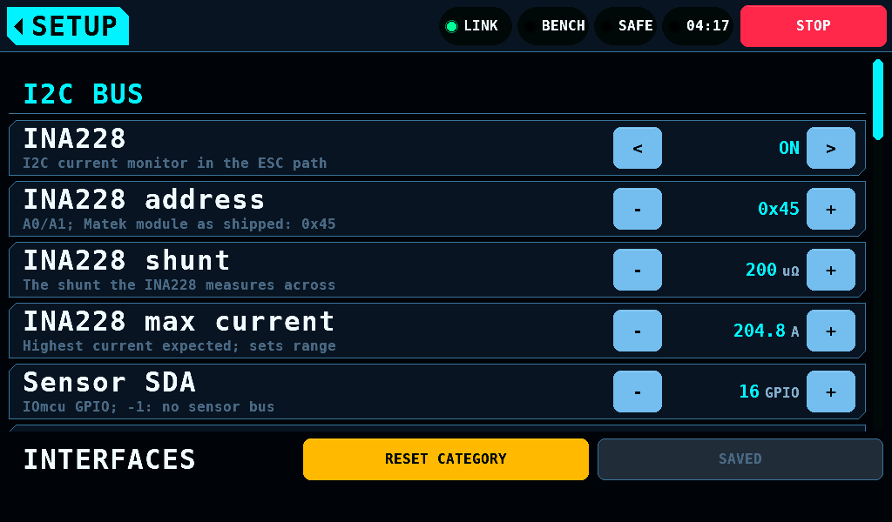

The IOmcu reads two I2C (Inter-Integrated Circuit) current monitors on
one bus on two of its pins: a TI INA228 in the ESC's power path and a TI
INA3221 on the servo rail. Their rows are at the top of INTERFACES:

| Setting | Range | Default | |
| --- | --- | --- | --- |
| INA228 | ON, OFF | OFF | the monitor in the ESC's power path |
| INA228 address | 0x40 to 0x4F | 0x45 | the MATEK I2C-INA-BM as shipped; its solder bridges give 0x44 or 0x41 |
| INA228 shunt | 50 to 20000 µΩ, 1 µΩ steps | 200 | the MATEK's |
| INA228 max current | 1.0 to 300.0 A, 0.1 A steps | 204.8 | the current the range is set for: it chooses the ADC (analog-to-digital converter) range and nothing else. 300 A is the bench's design maximum; the IOmcu refuses more. Its refusal of a range past 2000 A full scale stays, and 300 A on the smallest shunt, 50 µΩ, does not reach it |
| INA3221 | ON, OFF | OFF | the servo rail's three channels |
| INA3221 address | 0x40 to 0x43 | 0x40 | the DAOKAI module with its A0 solder bridge closed to GND. As shipped all four A0 bridges are open and the address floats between 0x40 and 0x41 |
| INA3221 shunt | 5.0 to 1000.0 mΩ, 0.1 mΩ steps | 100.0 | one a channel; the DAOKAI's R100 reads to 1.64 A |
| INA3221 channels | CH1, CH1+2+3 | CH1 | CH1 is the servo test's; CH2 and CH3 a synchronised pair's |
| Sensor SDA | −1, 0, 4, 6, 14, 16, 18, 20, 26 | 16 | IOmcu GPIO (general-purpose input/output). `-` and `+` step from one of these values to the next and stop at −1 and at 26. −1: the pins are not set, and no part is enabled on the page |
| Sensor SCL | SDA + 1, or −1 | 17 | the GPIO after Sensor SDA, and −1 with it. The row shows the value and has no keys |

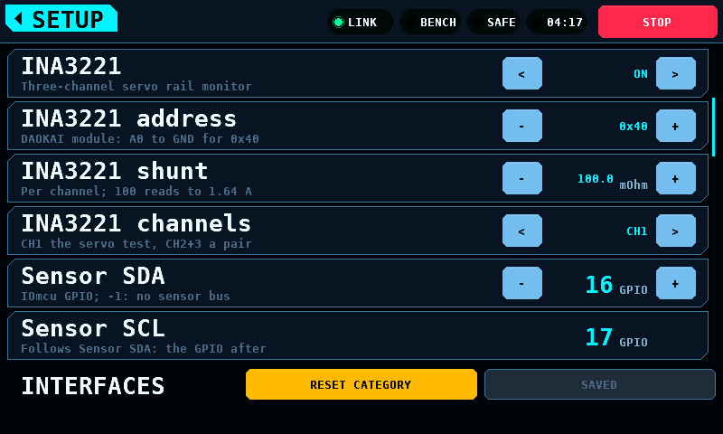

SDA and SCL are one I2C block's pair: SDA's GPIO number mod 4 is 0 or 2, and
SCL is the GPIO after it. Sensor SDA takes only the pins of such a pair that
the RP2350-CAN brings out and does not reserve: GP2 is left out because GP3
is the heartbeat, GP8 to GP12 are the CAN controller's, and GP22, GP24 and
GP28 because the module does not bring out GP23, GP25 and GP29. The rule is
the one the IOmcu's SENSE page judges a write by
(`link_sn_pins_pair()`, `settings_sense_sda_valid()`). A pin an output, the
PD mini or the phase tap holds is offered all the same, and the IOmcu
refuses it. With Sensor SDA at −1 the panel writes ENABLE 0, SDA 0 and SCL 0
to the page.

Stored settings: the `sns_scl` key is not read. Sensor SCL is derived from
the stored Sensor SDA, and the key is saved with the derived value. A stored
Sensor SDA outside the values above loads as 16, with no alert and without
marking the settings as changed.

The bus runs at 400 kHz, which is not a setting:
the IOmcu takes no other clock. A reading at the top of the INA3221's
range, 163.8 mV across the shunt, is shown as clipped and never as a value.

The panel writes the set-up to the IOmcu's SENSE page (protocol 4.7)
500 ms after the last edit, only while the bench is SAFE, and only what
differs from what the page holds: the IOmcu refuses a change while it
drives, and keeps each change in flash. It reads the page at every link-up
first, so a set-up the IOmcu already keeps is not written again. When
a monitor's own values change while both are enabled, both are switched off
on the page first and on again after, so no step on the way puts the two
parts on one address. An
IOmcu older than 4.7 is sent nothing. After a write is taken the panel
reads the IOmcu's identity again: capability bits 3 and 4 follow the
set-up, and with the INA228 enabled the MOTOR & ESC tile loses its SIMULATED
mark.

While a monitor is enabled, the panel reads SENSE's 14 read-only registers
every 50 ms; while the INA3221 is, SERVO_SENSE's channel windows every
50 ms, each 50 ms window once. With an IOmcu of protocol 4.11 and CH1
among the INA3221's channels it also reads SERVO_WIN every 50 ms, which
holds CH1's last four windows, and SENSE to register 31
([Link](Link.md#the-window-ring)).

The servo rail has one meter at a time: the INA3221's CH1 while it is on
with CH1, the IOmcu speaks protocol 4.11, the IOmcu holds the
set-up, the part answers as an INA3221 on a bus that is not stuck, a window
with current samples closed in the last 200 ms, its reset count stands, and
all of that has held for 1000 ms; the PD mini otherwise. The SERVO screen's
CURRENT row, line and plot show the meter's reading ([Servo](#servo)); the
servo test reads the PD mini whichever it is.

The band says what they show, each once and one at a time: the most
pressing first, and the next no sooner than 5 s later, so two at once are
both said. In order:

| Message | When |
| --- | --- |
| `IOmcu has no SENSE page. Current monitors cannot be read.` | a monitor is enabled and the IOmcu speaks a protocol older than 4.7; said at the link-up, and when a monitor is enabled while it answers |
| `Sensor SDA or SCL not set. Check SETUP > INTERFACES.` | a monitor is enabled with a pin at −1; neither is enabled on the page |
| `INA228 and INA3221 both use 0x40. Check SETUP > INTERFACES.` | both enabled on one address; neither is enabled on the page |
| `Sensor pins GP16/GP17 rejected. Check SETUP > INTERFACES.` | the IOmcu refused the pins: bound to an output, held by the PD mini or the phase tap, or reserved; both monitors stay off. Shown for 30 s or until tapped, once per edit |
| `INA228 shunt or maximum current rejected. Check SETUP > INTERFACES.` | the shunt's voltage at the max current passes 163.84 mV, or the range it gives passes 2000 A; the INA228 stays off |
| `INA3221 settings rejected. Check SETUP > INTERFACES.` | the INA3221 stays off |
| `Sensor bus blocked: SDA low. Trying clock pulses to release it.` | the IOmcu found SDA held low and clocks it free |
| `INA228 is not responding at 0x45.` | enabled, and not answering 2.5 s after its set-up was taken, or no longer answering after it did. `A device responds at 0x44.` is added when the IOmcu's address scan found something where the part could be |
| `0x40 reports 1408h, not an INA3221. Device not used.` | something answers at the part's address with another identity |
| `INA228 current at its range limit. Reading shows only the limit.` | the INA228 read the end of its range in the last 50 ms window or since the switch to ARMED |
| `INA3221 CH1 clipped at 1.64 A. Reading shows only the limit.` | a channel the INA3221 reads hit the top of its range; the current is its full scale |
| `IOmcu storage unavailable. Settings will be lost at restart.` | STATUS fault bit 6: the IOmcu saves nothing this boot, so the set-up, the bindings and the supply's wiring are lost at its restart; said once per link-up |
| `IOmcu firmware older than 4.11. Servo current is read from the PD mini.` | the INA3221 is on with CH1 and the IOmcu speaks protocol 4.7 to 4.10: it has no window ring, and the PD mini is the servo rail's meter. Said at the link-up, and when the INA3221 is switched on while it answers |
| `INA3221 has reset. Check its power supply.` | the IOmcu found the INA3221 on its power-on set-up and set it up again 1000 ms later; said once per reset. The windows of those 1000 ms hold no samples |

A refused set-up is not written again until it changes on SETUP. Pins that
are one I2C block's pair, refused because an output, the PD mini or the
board holds one, are offered again every 5 s without another alert, so
freeing the pin on OUTPUTS or SUPPLY lets the bus open. A monitor
that stops answering does not switch the bench to SAFE: nothing trips on the
monitors' readings.

#### A row the IOmcu does not hold

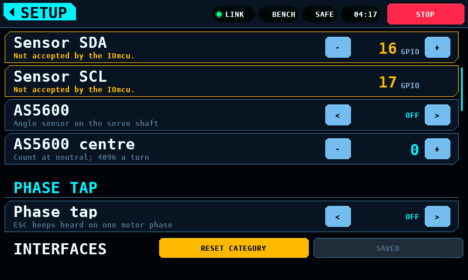

A row whose value is not the one the IOmcu's page holds is marked: its
edge and its value are drawn in the warning colour, and its help line reads
`Not accepted by the IOmcu.`. The panel compares the set-up it asks for
with the one the page last acknowledged or read back (`sense_link_unheld()`,
`tone_link_unheld()`). The mark covers the current monitors' rows, Sensor
SDA and Sensor SCL (one mark, the pins are one frame), AS5600, and the phase
tap's rows in two groups: Phase tap, Tap pin and the two tones, and Tap
pitch split, Tap gap and Tap min periods.

| The mark shows | Until |
| --- | --- |
| from an edit | the write is acknowledged: 500 ms after the last edit, and for the current monitors only once the bench is SAFE |
| on a value the IOmcu refused | the value is changed to one it takes; for pins held elsewhere, until the 5 s retry is taken |
| on INA228, INA3221 or AS5600 at ON while the page has the part off | the cause is gone: a refused frame, Sensor SDA at −1, both monitors on one address, an IOmcu older than the part |
| after an IOmcu restart or a link-up, on what its page reads differently | the panel has written it |

No row is marked while no IOmcu answers, or before the page has been
read after a link-up: there is nothing to compare with. AS5600 centre is the
panel's own and is never marked. The alert on the band is separate and stays
as described above.

### INTERFACES: the output encoder

An ams OSRAM AS5600 magnetic angle sensor on the servo's output shaft, on the
sensor bus beside the monitors, at its fixed address 0x36 (protocol 4.9):

| Setting | Range | Default | |
| --- | --- | --- | --- |
| AS5600 | ON, OFF | OFF | the output encoder; it takes the sensor bus's SDA and SCL above, and needs both pins set |
| AS5600 centre | 0 to 4095, 1 count steps | 0 | the sensor's 12-bit count with the servo at its neutral; 4096 counts a turn, 0.0879 degrees a count. The SERVO screen's ENC CENTRE sets it from the live reading |

The panel writes the enable bit with the rest of the bus frame, 500 ms after
the last edit and only while the bench is SAFE, to an IOmcu that
names protocol 4.9; an older one is sent nothing. While the encoder is
enabled it reads SENSE's registers 12 to 31 every 40 ms. The band says, each
once and one at a time like the monitors':

| Message | When |
| --- | --- |
| `IOmcu firmware older than 4.9. AS5600 not read.` | the encoder is enabled and the IOmcu speaks a protocol older than 4.9; said at the link-up, and when the encoder is enabled while it answers |
| `AS5600 is not responding at 0x36.` | enabled, and not answering 2.5 s after its set-up was taken, or no longer answering after it did; also when something at 0x36 gives a STATUS no AS5600 gives, ML and MH both set |
| `AS5600 detects no magnet. Check the magnet on the servo horn shaft.` | it answers, an angle has been read, and STATUS MD (magnet detected) is clear. The count is no angle: MEASURED shows `---`, ENC CENTRE sets nothing, and a run logs and judges no angle |
| `AS5600: magnetic field too weak. Move the magnet closer.` | STATUS MD and ML are set. The angle is used; the sensor's datasheet specifies its noise for 30 to 90 mT only |
| `AS5600: magnetic field too strong. Move the magnet farther away.` | STATUS MD and MH are set. The angle is used, as with ML |

A magnet message is said once until the field reads right again, and again
when a magnet that read weak or strong goes missing or a missing one comes
back weak or strong: the angle stops with the first and returns with the
second. The sensor's
DIR pin sets the direction its count rises in; the panel takes the count to
rise with the servo's pulse width.

### INTERFACES: the phase tap

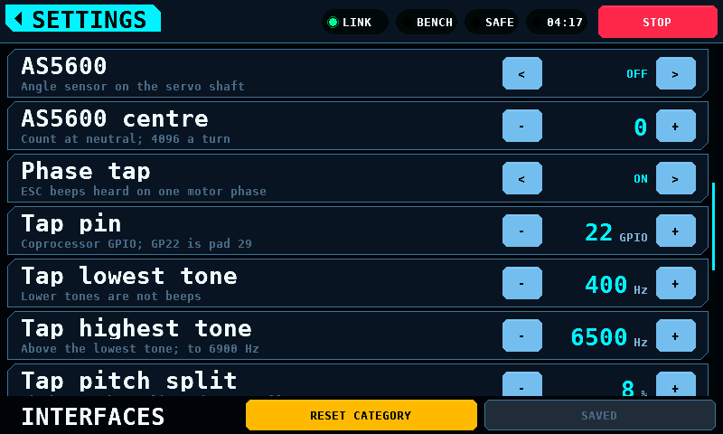

The phase tap hears an ESC's beeps on one motor phase. One IOmcu
GPIO reads the phase through a series resistor and a zener clamp; the
IOmcu times the pin's edges and reports each beep's length and pitch.
The wiring is not in the build guide. The tap is an input: it drives
nothing, and the IOmcu takes a change ARMED or not. Its rows follow
the bus's pins:

| Setting | Range | Default | |
| --- | --- | --- | --- |
| Phase tap | ON, OFF | OFF | the capture runs on the IOmcu |
| Tap pin | 0 to 47 | 22 | IOmcu GPIO; GP22 is pad 29. Refused: an ADC (analog-to-digital converter) pin, GP26 to GP29 on the RP2350A and GP40 to GP47 on the RP2354B; a pin bound to an output; a pin the SENSE or SUPPLY page holds |
| Tap lowest tone | 50 to 2000 Hz, 10 Hz steps | 400 | a tone below it is not a beep |
| Tap highest tone | 100 to 6900 Hz, 50 Hz steps | 6500 | above the lowest tone |
| Tap pitch split | 0 to 50 %, 1 % steps | 8 | a pitch change this large starts a new beep with no silence between; 0 splits on silence only |
| Tap gap | 1 to 100 ms | 3 | the silence that ends a beep; at least one period of the lowest tone, so 20 ms at 50 Hz |
| Tap min periods | 1 to 64 | 3 | the tone periods that make a beep |

The panel writes the set-up to the IOmcu's TONE page (protocol 4.8)
500 ms after the last edit, and only what differs from what the page holds:
the IOmcu keeps each change in flash. It reads the page at every
link-up first. The set-up goes in two frames, the pin and the tone range,
then the split, the gap and the periods. When both change, the one that
leaves the page a valid set-up goes first: a lower tone with a gap shorter
than its period is refused, so the gap is written before the tone goes down
and after it goes up. Switching the tap off writes the first frame with
the values the page holds and the tap disabled, whatever range is asked, so
a range the page would refuse cannot keep the tap running; the range
follows in a frame of its own. Until the page holds the tap off the screen
shows `WAITING`, not off. A set-up kept in flash that met a busy pin at the
IOmcu's boot is written again every 5 s, without another message,
while the page reports the pin refused. A change of ENABLE or of the pin
empties the IOmcu's ring and the panel takes its place at the newest
beep number, so none is read twice and none counted as missed; a change
of the range or of the other values leaves the ring and the numbering
alone. An IOmcu older than 4.8 is sent nothing.

While the page holds the tap on, the panel reads its 16 read-only registers
every 50 ms: the flags, the last 8 ms window's pitch, the number of the
newest beep and the counts of beeps lost and lows ignored. A read whose
flags say the tap runs speaks for it while its window number moves: the
IOmcu closes a window every 8 ms, so a number that has stood for
1.5 s (`TONE_LINK_WINDOW_STALE_MS`) is a capture that stopped while the
page still answers, and the screen shows `WAITING` as for a read older
than 500 ms. It takes the
beeps one by one by number. The IOmcu keeps the last 64 beeps,
numbered 1 to 65535 and then 1 again, and a read does not remove one, so a
reply lost on the link loses no beep. A beep that left the ring before it
was read, or that the ring moved past while the panel was more than 64
behind, is counted as missed. The last 8 beeps are kept for the screen; the
run page of ESC STICK shows 4 of them ([ESC STICK](#esc-stick)).

The band says what the tap reports, each once and one at a time, as for the
current monitors:

| Message | When |
| --- | --- |
| `IOmcu has no TONE page. Phase tap not read.` | the tap is enabled and the IOmcu speaks a protocol older than 4.8; said at the link-up, and when the tap is enabled while it answers |
| `Phase tap on GP22, 400 to 6500 Hz rejected. Check SETUP > INTERFACES.` | the IOmcu refused the first frame: the pin is not allowed, the tone range is not one it takes (the highest tone not above the lowest, or the gap shorter than the lowest tone's period), or it runs no capture since its boot (core 1 not started). A pin that an output, the sensor bus, the PD mini or a programming port holds is refused as busy (BUSY, protocol 4.17): offered again every 5 s without another message, so freeing the pin lets the tap start. Any other refusal is written again only after the next change on SETUP INTERFACES or link-up. From a 4.16 or older IOmcu, which says BAD_VALUE for both, the frame is offered again every 5 s when its tone range and gap are valid ([Link](Link.md#a-busy-pin-on-the-phase-tap)) |
| `Phase tap split, gap or periods rejected. Check SETUP > INTERFACES.` | the IOmcu refused the second frame; not written again until a value changes |
| `Phase tap pin GP22 is in use. Capture not running.` | the IOmcu reports the pin refused, for one of two causes. A set-up it kept in flash met a binding at its boot: the first frame is offered again every 5 s without another message, so freeing the pin lets the tap start. The IOmcu runs no capture since its boot (core 1 not started, protocol 4.17): no pin is bound and freeing one changes nothing. The next offer of the first frame is refused with BAD_VALUE without another message, and the frame is not offered again until the next change on SETUP INTERFACES or link-up; only a restart of the IOmcu lets the tap run. The band says `Phase tap on GP22, 400 to 6500 Hz rejected. Check SETUP > INTERFACES.` only for a set-up other than the one the IOmcu kept, written at link-up before the first status read or less than 5 s after the pin was first reported not free or last offered; a change made later goes out as a quiet offer |
| `Phase tap capture overflow. Beeps are incomplete.` | the IOmcu's capture ring or FIFO (first in, first out buffer) overran since the tap was enabled; the beep under way was cut |

### SD CARD: which logs are written

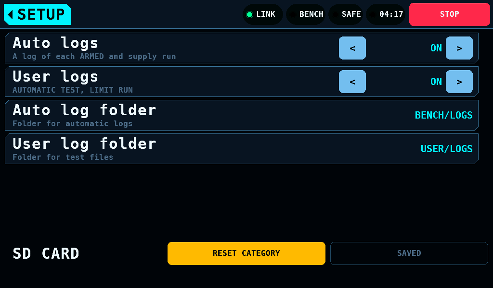

| Setting | Range | Default | Writes |
| --- | --- | --- | --- |
| Auto logs | OFF, ON | ON | `SERVOnnn.CSV`, `MOTORnnn.CSV` and `SUPPLnnn.CSV` in `BENCH/LOGS`: a log of each ARMED and supply run |
| User logs | OFF, ON | ON | `ATESTnnn.CSV` with its `ATESTnnn.TXT`, and `LIMITnnn.TXT`, in `USER/LOGS`: the AUTOMATIC TEST and the LIMIT RUN |

- OFF writes no file and takes no number, and no card alert of that kind of
  run shows.
- Auto logs is read on every pass of the control task: switched OFF during
  a run it ends that run's file, switched ON during an ARMED or supply run
  it starts one.
- User logs is read at START TEST and START LIMIT RUN: a test keeps the
  state it started with. With it OFF, the run card and LIVE's box read
  `USER LOGS OFF` where the files would be named.
- REPORT on SERVO > OPTIONS > DUT decides, with User logs ON, whether
  `ATESTnnn.TXT` is written.
- The fault log, `BENCH/RCBENCH.LOG`, is written whatever the two say.
- [Logs](#logs) gives the names and the numbering.

### Keeping the values

A changed value takes effect at once and is not written to flash until SAVE is
pressed. SAVE, beside RESET CATEGORY on a list and alone on the tiles,
says which of four states the values are in. The values are one set: the
state is the same on the tiles and on every list.

| Label | Meaning |
| --- | --- |
| `SAVED` | Nothing is unwritten. The button is inert. |
| `SAVE` | Something is unwritten. Pressing it asks for a write. |
| `WHEN IDLE` | A write has been asked for and is waiting for a moment to happen in. |
| `NOT SAVED` | The store refused the write. What reached the medium is not known from the screen: a refusal on one key leaves the keys written before it committed, so the next boot can load a mix of the new values and the old. Pressing it tries again. |

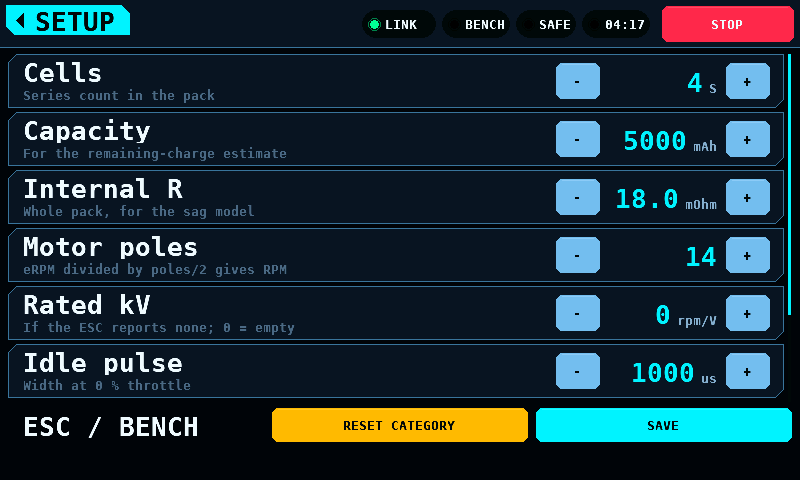

The press asks; it does not write. Writing settings commits a page of NVS
(non-volatile storage), and a flash operation on the ESP32-S3 disables the
instruction cache, so neither core runs for its duration. The write is taken
on the first frame at which the bench is SAFE with no switch to ARMED waiting, the
supply's output is off with no ON queued, and no board drawing is being
fetched or kept. On the settings screen that is the next frame, and
the label goes to `SAVED` as fast as the eye follows the press. While ARMED, the
request stands as `WHEN IDLE` until the bench is SAFE.

A store that refuses leaves the label at `NOT SAVED` in the danger colour
until the next successful write or the next edit. A refusal does not undo what
was already written: the values are set key by key and a failure part way
through leaves the earlier keys committed, so the medium can hold a mix of the
new values and the old. The screen cannot say which. A panel whose NVS could
not be brought up at all refuses every write of the session, writes nothing,
and says so once more on the splash as `NVS unavailable`.

Values not saved are kept until the panel is switched off. Leaving the screen
writes nothing.

A value stepped back to the one stored is no change, and the label returns to
`SAVED`; a write asked for and not yet taken is dropped. A float stepped
away and back can miss its stored word by a rounding, and counts as back
while it is less than half a step from it. The stored values are a copy the panel keeps: the ones loaded at
start-up, the defaults where the store had none, or the ones the last
successful save wrote. A refused save leaves the copy as it was and no
longer known to be the medium's, so the label stays `NOT SAVED` or `SAVE`
until a save succeeds, even with every value stepped back.

### Leaving with values unsaved

The home tag on the tiles, the only way from SETUP to the menu, is held while
the label reads `SAVE` or `NOT SAVED`. A warning covers the body instead: a
card of 784 x 344 px with a 3 px edge in the warning colour, over the strip.

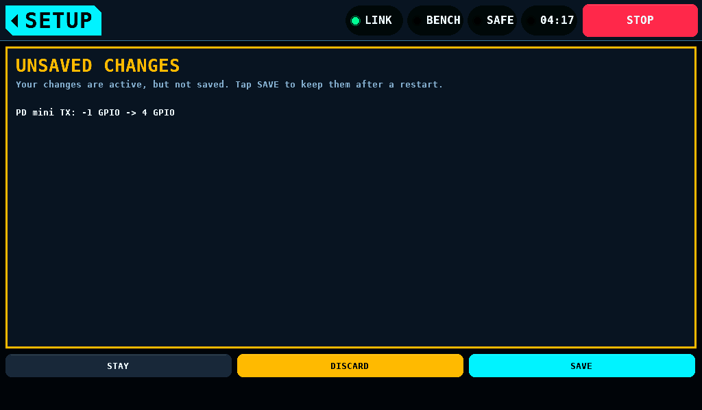

It lists each value and string that differs from the stored copy, one line
of 22 px each, as `name: stored -> now`. A value is written as the list
writes it, with its unit; a string, the DUT (device under test) name, as it
is. Values set on other screens, such as SERVO's settings, ESC STICK's or
MOTOR & ESC's, are listed too: they are in the same set and the same save
keeps them. A change on MOTOR & ESC, SETTINGS asks for that save itself. The
lines follow the schema's order, the strings after the values. With more
than 10 changes, 9 lines show and the tenth reads `and 3 more` for 12.

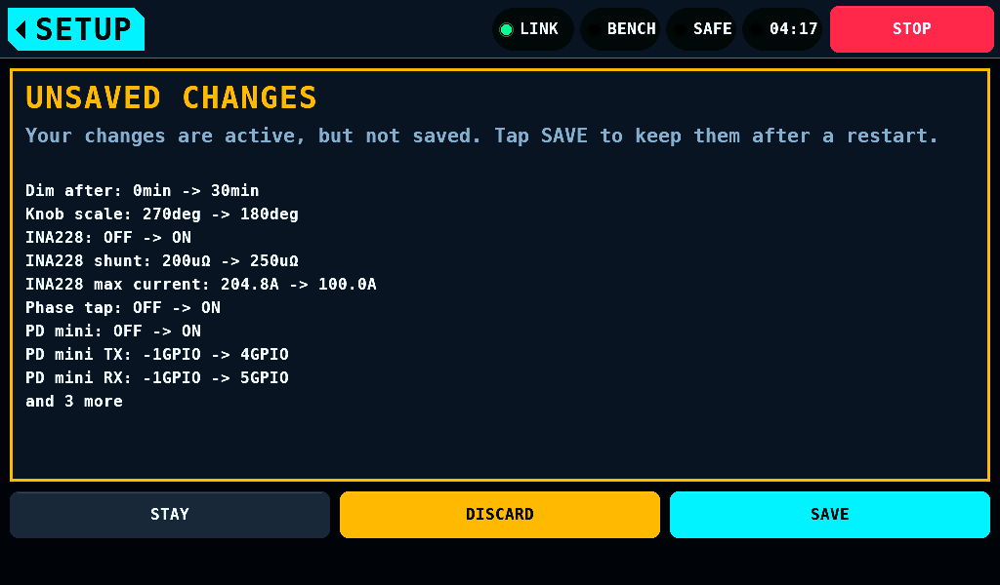

The strip's three columns hold the answers:

| Button | What it does |
| --- | --- |
| STAY | Closes the warning. The tiles show again; a list keeps its category and its scroll. |
| DISCARD | Sets every changed value back to its stored one through the path a step by hand takes, then opens the menu. |
| SAVE | Asks for a write as the save button does, then opens the menu. The write follows the same rule: the first idle frame. |

DISCARD sets each value with the same call a key does, in schema order, so
the IOmcu hears each pin and port that moves, and PANEL's
language, theme, brightness and contrast apply on the next frame. A PD mini
wiring set back switches the supply output off and raises the alert a change by hand
raises. PWM target and Port PWM are not set back while the servo programmer
holds the servo port, as a key does not step them then; they stay unsaved.
After a refused save DISCARD also asks for a write of the values put back:
the medium can hold part of the refused write, and a restart would load it.

While the bench is ARMED, DISCARD is drawn inert and a line
`DISCARD waits until the bench is SAFE.` says why. Setting back several values at once,
pins among them, on a running bench is a change the operator did not make
in that moment. STAY and SAVE work while ARMED; a save waits for SAFE as
`WHEN IDLE`. The line `Saving failed. Tap SAVE to try again.` shows in
the danger colour after a refused save.

The warning holds only the home tag:

- Nothing unsaved, or a save asked (`WHEN IDLE`): no warning, the menu opens.
- OUTPUTS, PICK A PIN, WI-FI and UPDATES open from a tile and return to
  SETUP: no warning on the way out or back.
- The home tag over the warning is STAY.
- STOP stops the bench and leaves the warning as it is.
- A screen the panel opens by itself, such as the bus-fault screen after a
  link loss, closes the warning at once. The values stay in force and
  unsaved.

## The bus-fault screen

The panel runs the CAN (Controller Area Network) echo self-test at every
start-up, for 1200 ms inside the splash. A verdict other than every probe
coming back intact puts this on the panel instead of the menu.

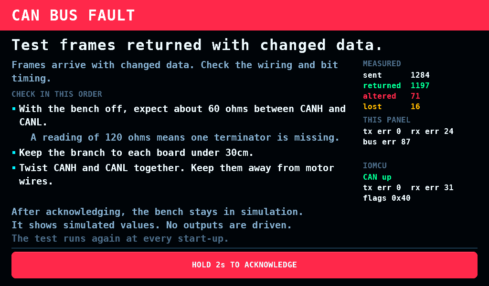

It exists because the fault is invisible from every other screen: a bus that
does not carry frames looks exactly like an IOmcu that is not fitted, and
both look like a bench that shows no numbers. The verdict is the heading, the
list is what to check in the order that costs least to check, and the right
column is what both ends counted.

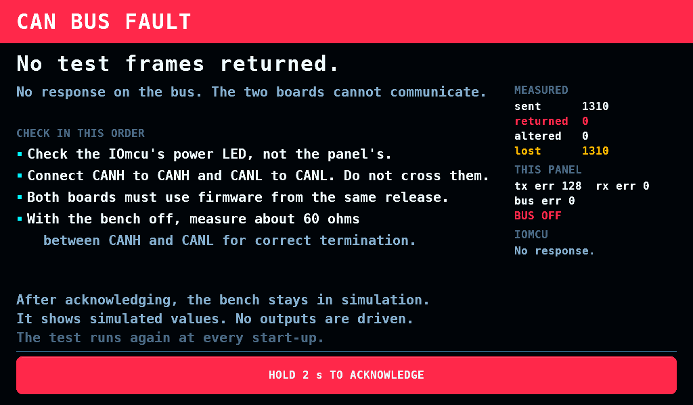

Leaving it takes a two-second hold, the ARM gesture and the same fade.
Acknowledging repairs nothing: the bench runs in simulation, nothing drives an
output, and the test runs again at the next start-up. There is no band and no
STOP, because the bench cannot switch to ARMED behind it.

### A link that stops

The same screen carries the other half: a link that was up and has been gone
for 4 s. The heading is what this panel's own CAN controller is doing, because
the wire carried frames a moment ago.

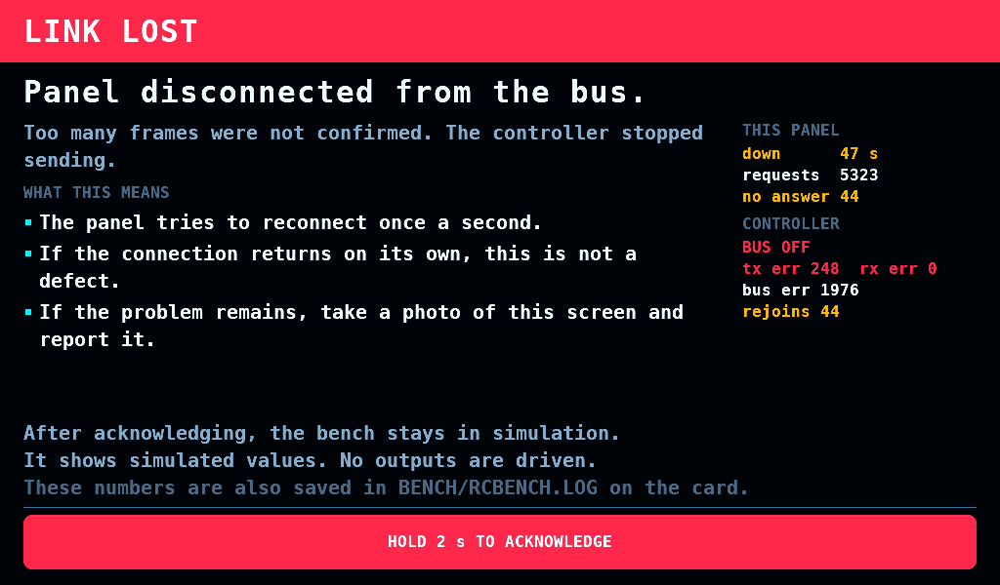

| Heading | Meaning |
| --- | --- |
| `Panel disconnected from the bus.` | too many frames went unacknowledged; it stopped transmitting |
| `Panel is reconnecting.` | it is counting the quiet time a rejoin needs, about 3 s |
| `The panel's CAN controller has stopped.` | idle and not restarted — a fault in the firmware |
| `The link stopped responding.` | the controller is on the bus and nothing answers |
| `Cannot read the controller's state.` | the driver is not running; nothing can be sent |

Four seconds, not one: the link drops for a poll now and then, and a screen
that took over on every blip is a screen operators learn to dismiss.

**Never while ARMED.** The screen has no STOP, and a bench with something
spinning must not have its stop button covered by a diagnosis. While ARMED, the
alert band says the link is gone and the screen waits for the switch to SAFE.

The same numbers go to `BENCH/RCBENCH.LOG` on the SD card, one line per report
while the link is down, whatever Auto logs on [Setup](#setup) > SD CARD says.
The file holds at most 1 MiB (1,048,576 bytes): a line that would take it past
that renames it to `BENCH/RCBENCH.OLD`, replacing the one there, and starts a
new `BENCH/RCBENCH.LOG`. The card holds at most 2 MiB of fault log; at 208
bytes a line every 5 s, one file is about 7 hours of link loss. When the
rename fails the line is not written. Firmware 0.21.0 and older wrote
`RCBENCH.LOG` in the root; that file stays and is not written again:

    t=182s link=down for 47s  bus=OFF tx_err=248 rx_err=0 bus_err=1976 rejoins=44/44  polls=5323 replies=5279 timeouts=44

The fields are the same in the same order every time. `rejoins` is this outage
over the total since boot, and an unreadable controller writes `?` in its
columns rather than a differently shaped line: the reading that most needs a
timestamp is the one where the controller would not answer.

The card is there because the panel's console is not reachable on every board.
The native USB socket carries GPIO19 and GPIO20, which the multiplexer hands to
CAN about a second into boot, so it is gone before a bench fault happens. The
bridged socket is on UART0 and normally carries the console right through, but
what it is connected to is switchable: a slide switch beside the BOOT and
RESET buttons is marked UART1 and UART2. In one position the bridge chip
enumerates and passes nothing in either direction, and the panel then has no
console at all.

[Bringing up the link](Link.md) has the verdicts and what each one means.

## IOmcu update

A panel built with the IOmcu's image carries it and offers it when the
IOmcu runs another build. The check runs at every link-up and compares
SHA-256 (Secure Hash Algorithm) digests, not version numbers. A different
build raises the alert `IOmcu runs a different build. Update it under SETUP > UPDATES.`, and the question opens on the menu while the bench is SAFE, the
supply's output is off, the panel's Wi-Fi radio is wholly off and no install
of a panel image is under way. A START given while either holds is spent,
and the question opens again once both have ended.

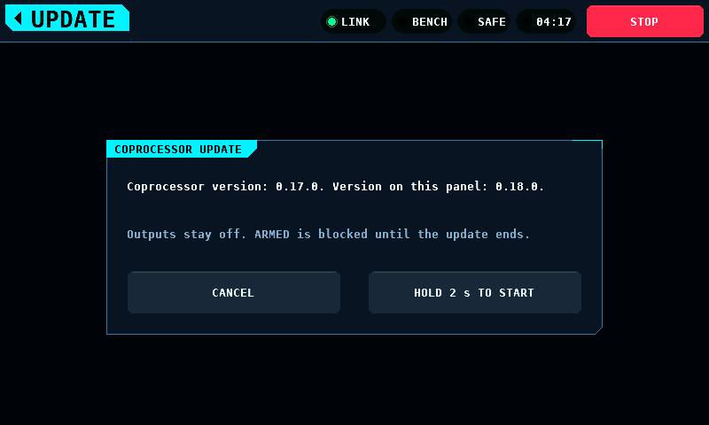

The question names the version the IOmcu runs and the version this
panel carries. CANCEL is a tap: the question closes, and the panel does not
ask again for that IOmcu version until it restarts. Leaving the
question another way declines the same way. SETUP > UPDATES still starts
the update after a decline ([The IOmcu](#the-iomcu)). START
takes the 2 s hold, the ARM gesture and the same fade.

An older image is offered too. The question then says `The firmware on this panel is older.` in the warning colour, and START takes the same hold.

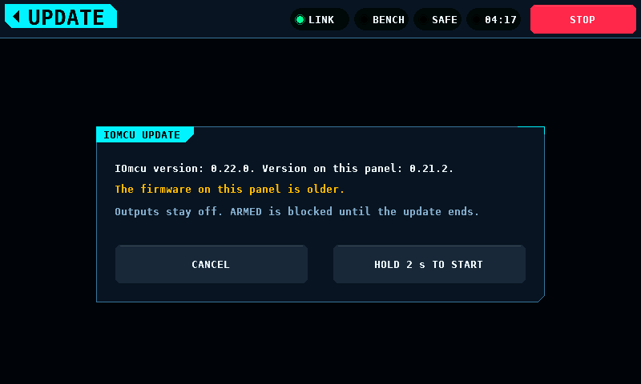

Once START's hold completes, the update has the panel to itself: the link to
the IOmcu goes down, the outputs are off, the IOmcu refuses ARM
until the update ends, and the progress fills the screen. It has no band and
no STOP, as the bus-fault screen has none: the bench cannot switch to ARMED
behind it.

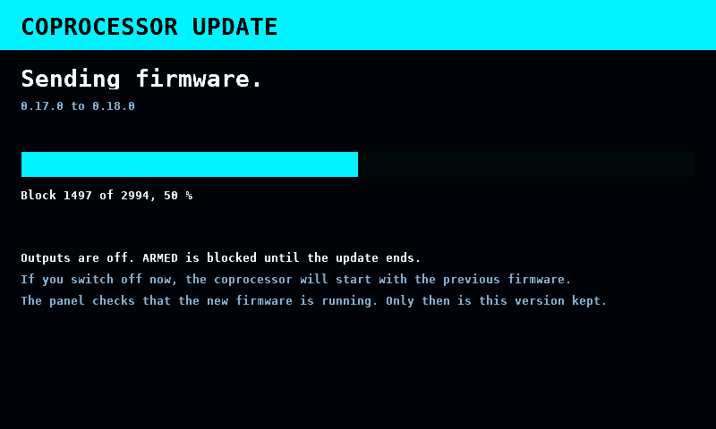

| Step | Shown while |
| --- | --- |
| `Preparing firmware.` | the panel hashes the image, 8 KiB a step |
| `Sending firmware.` | the blocks go out, 64 bytes each; the bar and `Block 1497 of 2994, 50 %` count them |
| `IOmcu is checking the firmware.` | the IOmcu hashes the slot it wrote |
| `IOmcu is starting the new firmware.` | it restarts into the new slot, on trial |
| `Keeping the new firmware.` | the panel reads the new image's identity and writes BUY |

The screen returns to the menu when the update ends, or to UPDATES when
UPDATES' hold started it. The alert band then says how it ended:

| Alert | Meaning |
| --- | --- |
| `IOmcu updated to 0.18.0.` | the new image runs and is kept |
| `IOmcu update stopped: no response. Previous firmware is running.` | nothing answered for 4 s |
| `IOmcu update stopped: refused, error 6. Previous firmware is running.` | the IOmcu refused a step; the error numbers are in [Link](Link.md#the-pages) |
| `IOmcu update stopped: firmware check failed. Previous firmware is running.` | the SHA-256 of the slot is not the image's |
| `IOmcu update stopped: flash memory stayed busy. Previous firmware is running.` | the store's gate stayed shut for 10 s |
| `IOmcu update stopped: IOmcu restarted 3 times. Previous firmware is running.` | three starts from block 0 |
| `IOmcu update stopped: new firmware did not start. Previous firmware is running.` | no identity from the new image within 12 s; the boot ROM goes back to the old one |
| `IOmcu cannot update over CAN. Install firmware once via USB.` | an IOmcu without the update pages or without the partition table ([First run](FirstRun.md#the-iomcus-partition-table)) |
| `New IOmcu firmware kept.` | an image found on trial at link-up was bought |

Power off during the update: the IOmcu starts its old image, and the
next link-up offers the update again. The update writes the slot the
IOmcu does not run from. [Link](Link.md#firmware-update-over-the-link)
has the transfer, the flash layout and the limits. The transfer time is not
measured.

The question opens from the menu rather than from LOGS: the offer comes with
the link, and LOGS is about the SD card.

## Updates

UPDATES asks GitHub which panel firmware release is the newest, and installs
it. It opens from the UPDATES tile on SETUP, and its home tag leads back
there. A reminder at start
asks the same question once per start of the panel.

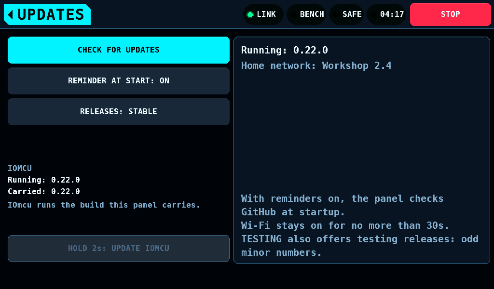

| Control | Action |
| --- | --- |
| `CHECK FOR UPDATES` | Asks GitHub once. `CANCEL` on the same key while the check runs. |
| `REMINDER AT START: ON` / `OFF` | Switches the start-up check and its reminder. Kept with SAVE on SETUP, as every setting. On by default. |
| `RELEASES: STABLE` / `TESTING` | Sets which releases a check offers ([The check](#the-check)). Kept with SAVE on SETUP. `STABLE` by default. A switch hides the last check's result: a release found on the other setting is not offered. |
| `HOLD 2 s: DOWNLOAD & INSTALL` | Shown once a check found a newer release. Downloads, checks and installs it. |
| `HOLD 2 s: UPDATE IOMCU` | Starts the IOmcu's update from the image this panel carries ([The IOmcu](#the-iomcu)). |

The card names the running version and the kept home network. Both the
check and the download need:

- a home network kept on WI-FI ([Home network](#home-network)).
  Without one, the card says `No home network saved.` and
  `Save a network under SETUP > WI-FI.`, and CHECK FOR UPDATES is grey;
- the bench SAFE, the supply output off and no log run open. Otherwise the
  key is grey and the card says `Wi-Fi requires SAFE, the supply output off,` and
  `and no open recording session.`;
- no update of the IOmcu running and no panel install under way.

The download needs, as an install does, no board drawing being fetched or
kept.

### The check

Releases are numbered by kind. An odd minor number is a testing release,
published on GitHub as a pre-release (0.21.x). An even minor number is a
stable release (0.22.x).

The panel joins the home network, sends one HTTPS (HTTP over transport layer
security) request and reads the newest release's tag from the answer.
RELEASES sets the request:

| RELEASES | Request | What is read |
| --- | --- | --- |
| `STABLE` | `GET https://github.com/subtilitas/rcbench/releases/latest` | The `Location` header of the redirect, which names the tag (`.../releases/tag/v0.20.0`). The body is not read. GitHub's latest release is never a pre-release. |
| `TESTING` | `GET https://api.github.com/repos/subtilitas/rcbench/releases?per_page=10` with `Accept: application/vnd.github+json` and `X-GitHub-Api-Version: 2022-11-28` | `tag_name` and `draft` of each of the 10 newest releases by date in the JSON (JavaScript Object Notation) answer, testing or stable. The highest version among those that are no draft is the newest release, whatever their order. The answer is read in pieces of 4096 bytes up to the 10th release's end, and is not stored. |

Then the radio goes off. The join, the address and the request take 30 s at
most, together. On either setting only a release newer than the running
build is offered: a panel on testing release 0.21.0 with `STABLE` is not
offered stable release 0.20.0.

Current limitations of `TESTING`: GitHub answers 60 API requests an hour for
each public IP (Internet Protocol) address without an account, and the
devices behind one address share them. Each check is one request, and the
panel sends no retry. A release older by date than the 10 newest is not
seen, however high its version.

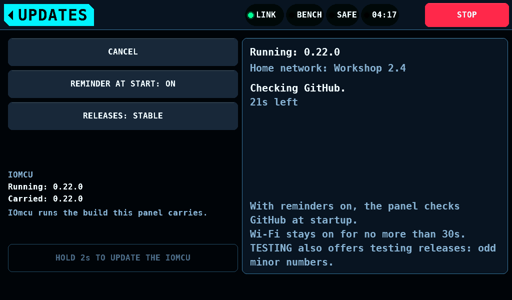

The card shows the step (`Connecting to Workshop 2.4`, `Checking GitHub.`) and the
seconds left (`26 s left`). The result stays on the card until the next
check:

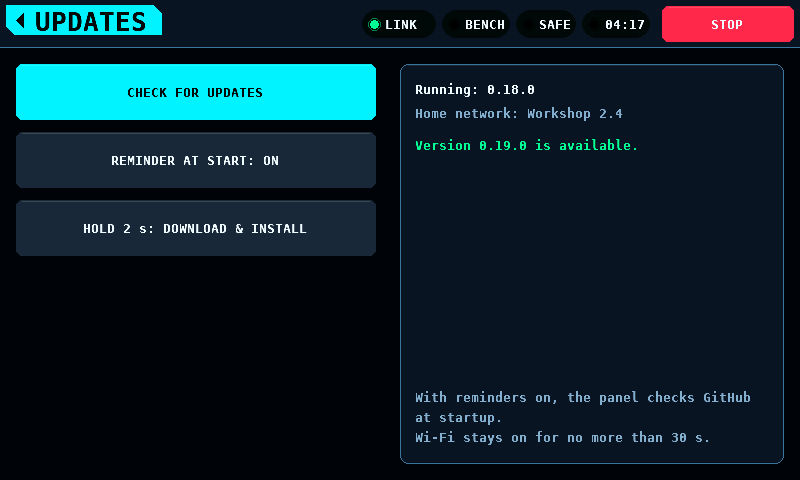
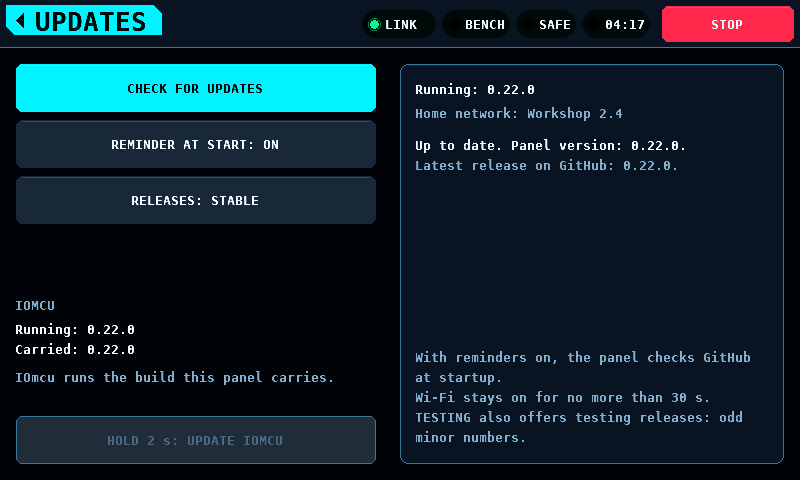
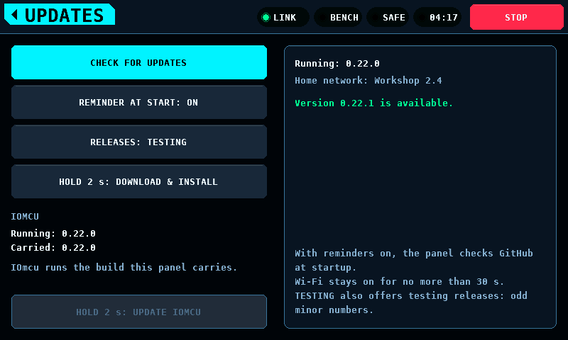

| Card | Meaning |
| --- | --- |
| `Version 0.20.0 is available.` | The newest release is newer than the running build. The hold appears. |
| `Up to date. Panel version: 0.19.0.` and `Latest release on GitHub: 0.19.0.` | The newest release is the running version or older. |
| `Could not connect. Password rejected.`, `Could not connect. Network not found.`, `Connection failed. No IP address within 15 s.`, `Connection to the home network lost.` | The join failed, as on WI-FI. |
| `No response within 30 s.` | The 30 s ran out. |
| `No connection to GitHub.` | The name lookup, the connection or the certificate check failed. |
| `GitHub rejected the request: HTTP 404.` | An answer other than a redirect (`STABLE`) or other than 200 (`TESTING`). |
| `GitHub's request limit is reached: HTTP 403.` and `GitHub allows 60 API requests an hour per address.` | `TESTING`: GitHub answered 403 or 429, its limit for requests without an account. |
| `The panel's own version is not MAJOR.MINOR.PATCH: no update offered.` and `Latest release on GitHub: 0.21.0.` | The running build's version does not parse. No release is offered. |
| `Unexpected answer from GitHub.` | The `Location` (`STABLE`) or the API's answer (`TESTING`) is missing or out of form; a second line says which (tables below). |
| `Wi-Fi switched off: bench ARMED.`, `...: supply output on.`, `...: a recording session started.`, `...: STOP.` | The check ended for that. |
| `Stopped: the WI-FI screen is using Wi-Fi.` | WI-FI opened. |
| `Stopped: the IOmcu update has started.` | The IOmcu's update began. |
| `Cancelled.` | CANCEL. |
| `Wi-Fi could not start.` | The radio did not come up. |

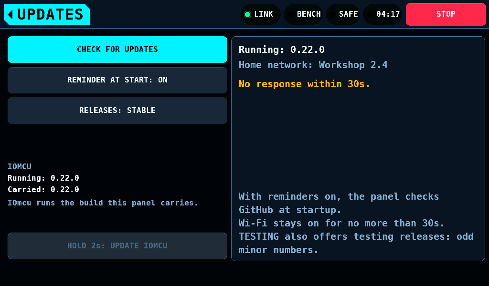

The version text is read strictly: `v`, then MAJOR.MINOR.PATCH, digits only,
each number from 0 to 65535 in at most 5 digits and without a leading zero
(`v0.20.0`, not `v0.020.0`), and nothing after it. A release is newer when
its MAJOR is higher, or MAJOR is equal and MINOR is higher, or both are
equal and PATCH is higher.

| Second line | Meaning |
| --- | --- |
| `The response has no Location header.` | The redirect carries no `Location`. |
| `The address is too long.` | A `Location` longer than 69 bytes: the tag address and 18 bytes. |
| `A byte is outside printable ASCII.` | A space, a control character or a byte above 126. |
| `The address is in an unexpected location.` | Not `https://github.com/subtilitas/rcbench/releases/tag/...`. |
| `The version text has an invalid format.` | The tag fails the rule above. |

The API's answer under `TESTING` is read as strictly. It needs status 200
and a `Content-Length` from 1 to 262,144 bytes, not chunked; the 10 newest
releases on 2026-10-18, v0.12.0 to v0.20.0, were 108,198 bytes, the largest
one 13,734. Of each release, only its own `tag_name` and `draft` count: a
key in a nested object or inside a string is passed over. A release with
`draft` true is passed over. A release out of form refuses the whole
answer, a draft's included, and nothing is offered: the second line says
why. An 11th release and anything after the 10th is not read.

| Second line | Meaning |
| --- | --- |
| `The response does not specify a size.` | No `Content-Length`, or a chunked answer. |
| `The response is empty.` | A `Content-Length` of 0. |
| `The download is too large for the panel.` | A `Content-Length` over 262,144 bytes. |
| `Received less data than expected.` | The answer ended before its `Content-Length`. |
| `Received more data than expected.` | A read returned more bytes than asked for. |
| `The answer names no tag_name.` | A release has no `tag_name`, there is no release but drafts, or the answer ended before its array or its 10th release did. |
| `The tag_name is too long.` | A `tag_name` over 18 bytes. |
| `The answer is not in the expected JSON form.` | Not an array of objects; a `tag_name` that is not a plain string (an escape, a control character, a number); a `draft` other than `true` or `false`; either key twice in a release; a control character in another string; a bracket closed by the other kind; nesting deeper than 32 levels. |
| `The releases do not end within 262144 bytes.` | The scan's own bound of 262,144 bytes, which an answer within its `Content-Length` bound does not pass. |
| `The version text has an invalid format.` | A tag fails the rule above. |

### The IOmcu

Under the buttons, UPDATES shows the IOmcu's update: the version the
IOmcu runs (`Running: 0.17.0`), the version of the image this panel
carries (`Carried: 0.18.0`), one line of state, and
`HOLD 2 s: UPDATE IOMCU`. The hold starts the update that the
link-up's question starts, with the same progress screen
([IOmcu update](#iomcu-update)). It also starts it after that
question was declined. When the update ends, or the START was spent
without one, the screen returns to UPDATES.

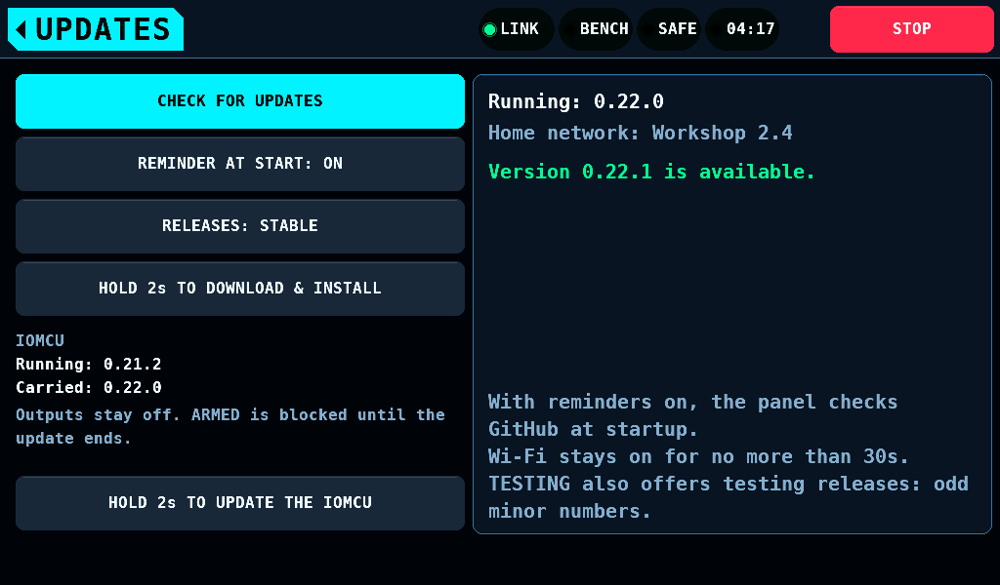

The hold is live only in the last row of the table below. Otherwise it is
grey, and the line names the first reason that holds, in this order:

| Line | Condition |
| --- | --- |
| `This panel carries no IOmcu firmware.` | The panel was built without the IOmcu's image. `Carried: not known`. |
| `Waiting for the IOmcu update to finish.` | An update runs, an image found on trial is being kept, or a START is not taken yet. |
| `No IOmcu is responding.` | No link, and no IOmcu of another protocol major answers. `Running: not known`. |
| `Waiting for the IOmcu's build check.` | An IOmcu answers; its build was not compared yet. |
| `Checking the IOmcu's build.` | The SHA-256 comparison runs. |
| `Build check failed. It runs again at the next link-up.` | The comparison ended without an answer. |
| `No update over CAN. Install firmware once via USB.` | The IOmcu has no update pages or no partition table. |
| `IOmcu runs the build this panel carries.` | The digests are equal: there is nothing to send. |
| `The update requires SAFE and the supply output off.` | ARMED, an arm waiting, or the supply output on or switching on. |
| `Waiting for the panel's Wi-Fi to switch off.` | A check, a download or the WI-FI screen has the radio on, or it is still switching off. |
| `Waiting: panel firmware installation is running.` | A panel install is under way. |
| `Outputs stay off. ARMED is blocked until the update ends.` | The hold starts the update. For an older image the line reads `The firmware on this panel is older.` in the warning colour; for the same version number `Same version number, but a different build.` |

The conditions are the question's: another build, the bench SAFE, the
supply output off, the radio wholly off and no panel install. An IOmcu
that runs the carried build gets no hold; the link-up's question does not
open for it either. An IOmcu of another protocol major shows NO LINK in
the band and still takes the update, as the question offers it to that
IOmcu too.

### The reminder

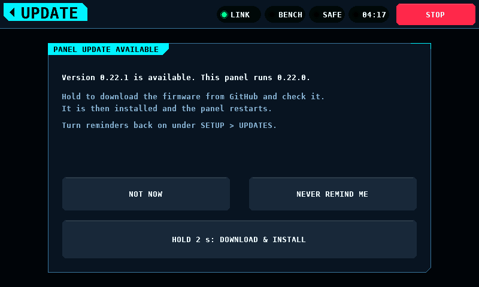

With REMINDER AT START on and a home network kept, the panel runs the check
once after each start. It waits for a moment the bench allows: the splash
gone, the bench SAFE, the supply output off, no log run open, WI-FI closed
and no IOmcu update offered or running. A start-up check
that has found no such moment 10 min after the start does not run at that
start.

When the check finds a newer release, the reminder opens on the menu
(OVERVIEW). It does not open while the bench is ARMED or an arm waits,
while the supply output is on, or while the IOmcu's update question or
its progress is up: those come first, and the reminder opens once they have
gone and the menu shows.

| Control | Action |
| --- | --- |
| `NOT NOW` | Closes the reminder until the next start of the panel. Leaving it by the HOME tag does the same. |
| `NEVER REMIND ME` | Switches REMINDER AT START off and asks for the save, which happens at the next moment the settings may be written ([Keeping the values](#keeping-the-values)). SETUP > UPDATES switches it on again. |
| `HOLD 2 s: DOWNLOAD & INSTALL` | The same hold as on UPDATES. |

The start-up check shows nothing when it finds no newer release or fails.
Its result is on UPDATES.

### The download

The 2 s hold is the one confirmation: no question follows the download. The
panel joins the home network within 30 s, then fetches two files of the
release's tag over HTTPS, `SHA256SUMS` and `rcbench-panel-v0.20.0.bin`.
GitHub answers each with a redirect to its file host; the panel follows at
most 3 redirects, and only to `github.com`, `release-assets.githubusercontent.com`
and `objects.githubusercontent.com`. Then:

1. `SHA256SUMS` is 4096 bytes at most, and holds exactly one line for the
   image's file name.
2. The image announces its size before a byte is kept. An image without a
   size, of 0 bytes, or larger than the slot (4,063,232 bytes) is refused.
   The image is kept in PSRAM (pseudo-static random-access memory).
3. The image's SHA-256 (Secure Hash Algorithm, 256 bits) must equal its line
   in `SHA256SUMS`.
4. Every check an uploaded image passes ([Installing](#installing-panel-update))
   runs, and the image must name the release's version.

Only then does the install start, as INSTALL starts it: the radio off
wholly, the write, the restart, the trial start. From the hold to the write,
nothing touches the flash.

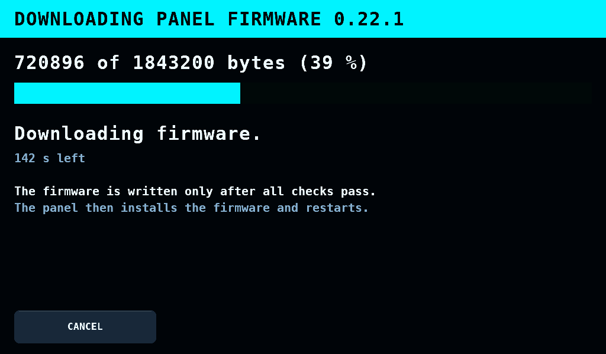

| Step | Shown while |
| --- | --- |
| `Connecting to Workshop 2.4` | the join and the address |
| `Reading SHA256SUMS.` | the first file |
| `Downloading firmware.` | the image; the bar and `720896 of 1843200 bytes (39 %)` count it |
| `Checking the SHA-256 checksum and firmware.` | the checks |

CANCEL ends the download. The download also ends on STOP, on ARMED, on the
supply output coming on, on a log run opening, on a board drawing being
fetched, and after 180 s from the hold. The running build stays, and CLOSE
goes back to UPDATES, or to the menu when the hold was the reminder's.

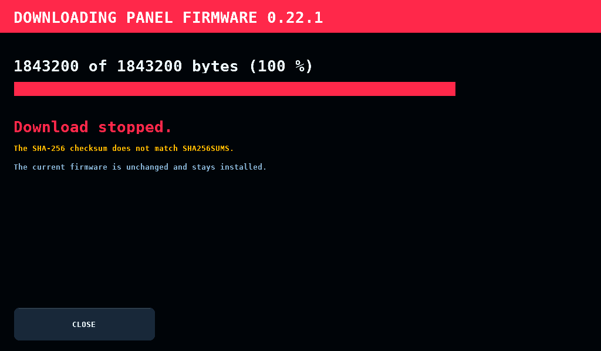

| Line | Meaning |
| --- | --- |
| `Cannot use the SHA256SUMS file.` | `SHA256SUMS` missing (`HTTP status 404.`), over 4096 bytes, `A checksum line has an invalid format.`, `No checksum entry for this firmware.` or `Two checksum entries for this firmware.` |
| `The SHA-256 checksum does not match SHA256SUMS.` | The image is not the one the release lists. |
| `The firmware did not pass the panel's checks.` | One of the image checks refused it. |
| `GitHub rejected the request: HTTP 404.` | An answer to the image other than the file or a redirect. |
| `Unexpected answer from GitHub.` | `More than 3 redirects.`, `Redirect to a host that is not allowed.`, `The address is too long.` (a `Location` over 2048 bytes), `The response does not specify a size.`, `The response is empty.`, `The download is too large for the panel.`, `Received less data than expected.`, `The firmware file specifies a different version.` |
| `Not enough memory for the firmware.` | PSRAM had no room for the announced size. |
| `No response within 30 s.`, `No response within 180 s.` | The join's 30 s or the download's 180 s ran out. |

Current limitations:

- The check's and the download's durations on a real network are not
  measured.
- No certificate's dates are checked: the panel has no clock.
- A release whose assets are not named `rcbench-panel-vX.Y.Z.bin` and
  `SHA256SUMS` cannot be downloaded.

## Outputs

Behind the OUTPUTS tile on SETUP, and behind the TARGET rows of MOTOR & ESC
and SERVO; its home tag leads back to the screen that opened it. Over the
open protocol list the home tag closes the list, choosing nothing, and the
screen stays. The protocols bound to the IOmcu's pins, which pins each one
drives, and the IOmcu's programming ports. From SETUP it opens on the
[overview](#the-overview-off): OFF selected, every bound pin named by its
protocol, and no pin editable until a protocol is picked. From a TARGET row
it opens on what that workbench drives:

| Opened from | Opens on |
| --- | --- |
| SETUP's OUTPUTS tile | the overview, OFF |
| MOTOR & ESC's TARGET row | the protocol the throttle's pins are bound as; the overview while they are bound as several (`MIXED`) or none is known |
| SERVO's TARGET row | what the row shows: the PROG PORT entry while the IOmcu drives the port, SERVO PWM while it drives the outputs, the overview while the target is not known |

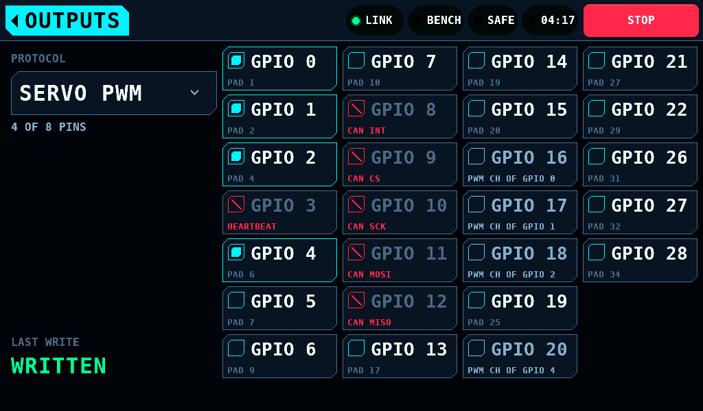

A set of pins per protocol, not eight independent slots: a bench is wired a
protocol at a time — four servo leads, then one ESC (electronic speed
controller) — and asking for the protocol and then for its pins is the shape
of that job. More than one protocol can be bound at once, and a pin belongs to
at most one of them.

Each ticked pin becomes one slot on the [OUTPUTS page](Link.md#page-map), in
pin order across every protocol, taking channels from zero upward — so the
lowest ticked pin is channel 0 whatever order the screen was touched in and
whichever protocol holds it. Eight slots and eight channels are the budget,
shared. PPM renders eight channels on its one pin, so a bench with PPM on it
has room for nothing else. It runs at 40 Hz, not the 50 Hz the pulse drivers
use: eight channels need 23,300 us of frame and 50 Hz gives 20,000.

SERVO PWM and MOTOR PWM are the same pulse at the same 50 Hz and differ in
what the channel is for. A servo channel centres when nothing commands it; a
motor channel stops. Nothing in the pulse says which is on the pin, so the
entry says it: bind an ESC as MOTOR PWM and a control surface as SERVO PWM.
The MOTOR & ESC throttle drives every channel bound as a motor — MOTOR PWM
and the DShot entries — and leaves the servo channels alone.

A MOTOR PWM channel sends 0 % throttle as the Idle pulse and 100 % as the
Full pulse: 1000 us and 2000 us by default, set under MOTOR & ESC, SETTINGS, in
steps of 10 us (Idle pulse 800 to 1600 us, Full pulse 1400 to 2400 us). The
two settings reach the channels bound as a motor and no others: a SERVO PWM
channel keeps 1000 to 2000 us, or the range the SERVO screen sends for the
servo chosen there. An edit reaches the IOmcu 300 ms after the last
change while the bench is SAFE; one made while it is ARMED waits for the
switch to SAFE. An IOmcu that links up is brought to the two settings before
the bench drives it: with the bench already ARMED, the IOmcu is held
SAFE until it has them. An Idle pulse that is not below the Full pulse is not sent, and the
band says `Idle pulse must be shorter than full-throttle pulse. Not sent.`.

An ESC whose throttle range was calibrated on a transmitter takes that
transmitter's shortest pulse as zero. An Idle pulse above it reads to the ESC
as throttle not at the bottom, and the ESC does not arm; many ESCs beep
rapidly in that state. Set the Idle pulse at or below the transmitter's
shortest pulse and the Full pulse at or above its longest: for a transmitter
that sends 985 to 2012 us, 980 us and 2020 us.

When the protocol can take no more pins, the reason is under it in amber:
`NEEDS 8 CHANNELS, 4 FREE`, `ALL 8 SLOTS IN USE`, or `SERVO PWM TAKES 8
PINS`. A board drawn entirely in grey with nothing beside it reads as a
fault, and PPM greys the whole board whenever anything else is bound.

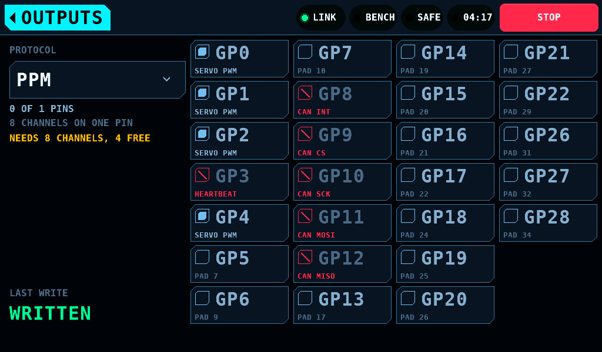

The protocol is a list rather than a stepper, because there are eight of them
and stepping past seven to reach the eighth is not choosing:

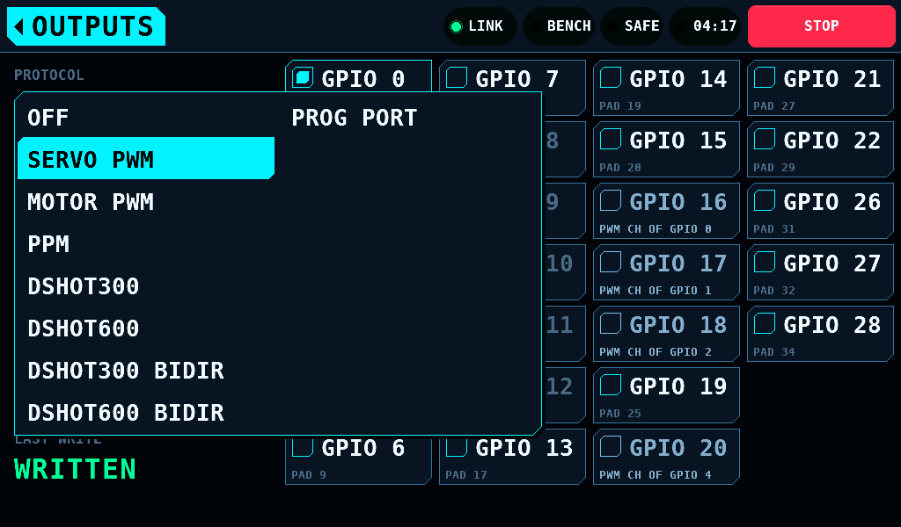

Reserved pins are shown and cannot be ticked. GP3 carries the safety heartbeat
and GP8 to GP12 are the CAN (Controller Area Network) controller, and each
says so under its name. Hiding them would leave an operator hunting for GP10
and finding a gap. [DShot and the output drivers](DShot.md#which-pin) has the
whole map.

The pin of the IOmcu's programming port, GP13 by default, is shown as
`PROG PORT` and cannot be ticked either:

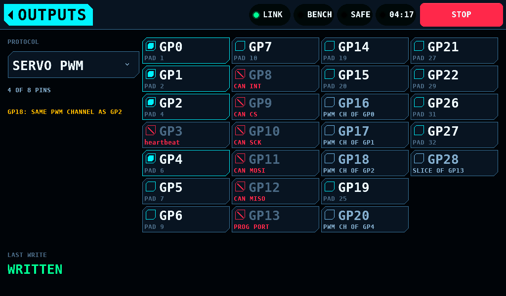

A stored binding that holds that pin keeps it: the port then has no pin, and
the programmer's CONNECT ends with the line for a port without a pin
([the port](ServoProgrammer.md#the-port)).

### The PROG PORT entry

The protocol list ends in one PROG PORT entry per programming port the
IOmcu reports: 1 on the bring-up build, at most 4. While the count is
not known (no link, the page not read since the link came up) the list
holds one entry, for port 1. An IOmcu older than protocol 4.13 has no
programming port, and the list holds no entry. With more than one the entries are
named `PROG PORT 1` to `PROG PORT 4`. A programming port is an output of
its own kind, no slot and no protocol
([Link](Link.md#the-programming-ports)). Its entry shows:

- the pins as the overview names them, the port's own pin lit; no pin takes
  a tick, and the port's pin is read-only;
- `PIN GP13`, or `NO PIN KNOWN` in the warning colour;
- what the port carries: `CARRIES SERVO PWM AND KST/CHASERVO PROGRAMMING`.
  The IOmcu renders no throttle protocol on a port: no MOTOR PWM, no
  DShot;
- on port 1, SERVO TESTER (OUTPUTS | PROG PORT) and PORT PWM (ON | OFF),
  two segments under their labels, with the reason under them while one is
  locked ([the target](ServoProgrammer.md#the-target)). The SERVO tester
  drives port 1 alone; another port's entry says `THE SERVO TESTER DRIVES
  PROG PORT 1 ONLY`.

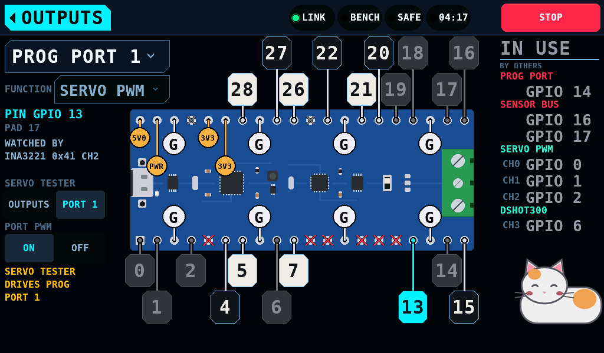

Neither segment writes a page from this screen: the setting is kept in NVS,
and the panel takes it to the IOmcu on a bench at rest. Picking the entry
writes nothing, and LAST WRITE is not shown on it.

SERVO PWM and MOTOR PWM run on the PWM slices, and the IOmcu refuses
two bindings there ([Servo PWM](DShot.md#servo-pwm)). Under those two
entries the screen holds such a pin, as it holds a pin of another protocol:
grey, no tick, and the pin it clashes with named under its name.

| Cell | Line after a tap on it | Rule |
| --- | --- | --- |
| `SLICE OF GP13` | `GP28: SHARES PWM SLICE WITH PROG PORT GP13` | the pin shares a slice with a programming port's pin while the port holds it, checked against every port the IOmcu reports; GP13 and GP28 are slice 6 |
| `PWM CH OF GP0` | `GP16: SAME PWM CHANNEL AS GP0` | the pin shares a compare register with a pin bound as SERVO PWM or MOTOR PWM: GP0 and GP16, GP1 and GP17, GP2 and GP18, GP4 and GP20, GP5 and GP21, GP6 and GP22 |

The line stands under the protocol, in amber, until the next pick, the next
tick that lands, the next visit to the screen or a change of board. A line
on the protocol's own budget (`ALL 8 SLOTS IN USE` and the others) comes
first. DShot and PPM run on PIO (programmable I/O), not on a slice, and are
offered both pins.

Limitation: the slice rule needs the programming port's pin, which the panel
reads from the IOmcu. Until that reading arrives, up to 500 ms after
the link comes up or the port's pin changes, GP28 is offered, and a tap on
it ends in `LAST WRITE: REFUSED`. Other IOmcu checks, such as the
SERVO page's frame rate on a pin shared with MOTOR PWM, also refuse with no
reason on this screen.

The pad number under each pin is the one printed on the board, so an operator
counting pads and an operator reading GPIO (general-purpose input/output)
numbers arrive at the same pin.

Ticking or unticking a pin writes the binding at once. There is no APPLY key:
a screen holding a choice that has not been sent is a screen that disagrees
with the bench, with nothing to say which of the two is driving. The panel
then reads both pages back and shows what the IOmcu holds. What became
of the write is under the protocol, as LAST WRITE:

| LAST WRITE | Meaning |
| --- | --- |
| `NOT WRITTEN` | nothing has been written since the panel started, or a write was not sent because the binding on the screen was not one a read confirmed |
| `WRITTEN` | the IOmcu acknowledged every exchange of the write |
| `NO LINK` | an exchange of the write got no answer within 1000 ms, or the link was down |
| `REFUSED` | the IOmcu answered and refused: a pin it cannot bind, a change while the bench is ARMED, or a frame rate it could not put back |

To an IOmcu speaking protocol 4.10 the binding is written whole: the
two pages are prepared beside the ones in force and taken together by one
commit ([Link](Link.md#a-binding-taken-whole)). `NO LINK` and `REFUSED` then
leave the binding in force exactly as it was, except when the one
acknowledgement of the commit is lost: the binding is then in force, the
screen says `NO LINK`, and the read at the next link-up shows it. An older
IOmcu takes the pages one entry at a time, and a write that stops part
way leaves the entries before it in force.

Picking a protocol in the list writes nothing. It says which set of pins the
screen shows as ticked and which set the next tick joins. Nothing is dropped:
the pins ticked for the protocol being left stay bound, and the pins of the
one arrived at come back as they were. A selector that retargeted the current
pins would make binding a second protocol mean unbinding the first. On entry
the list shows OFF, the overview. A protocol picked stays selected across
read-backs of the same board. The list on PICK A PIN selects the same
protocol.

`DSHOT600 BIDIR` and `DSHOT300 BIDIR` are the longest entries, 14 characters:

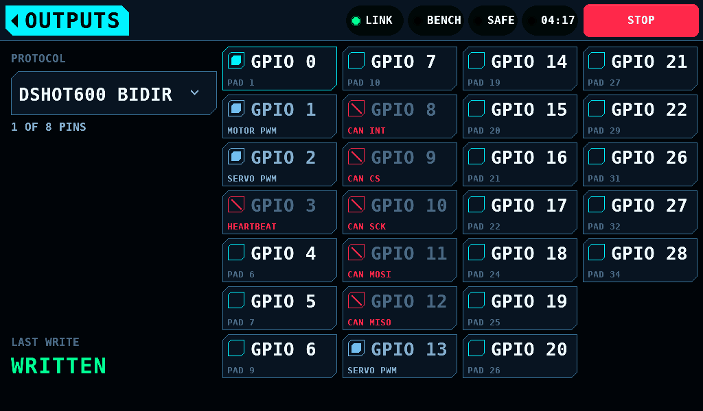

A pin another protocol holds is drawn greyed, with that protocol's name under
it where a free pin shows its pad number. That is a choice, undone by going to
that protocol and unticking it there — unlike a reserved pin, which is drawn
red and struck through because it is the wiring rather than a choice.

Four servo leads and an ESC, with DSHOT300 the protocol being edited. GP5 is
ticked; GP0, GP1, GP2 and GP4 say SERVO PWM and cannot be ticked here; GP3 and
GP8 to GP12 are red because the IOmcu reserves them:

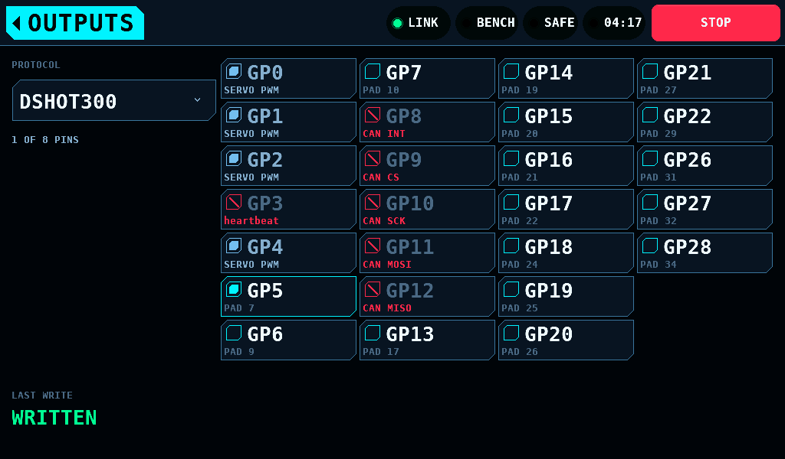

So a cell is in one of four states, and each says what to do about it: ticked
in this protocol, held by another and named, reserved and struck through, or
free and showing its pad number.

### The overview: OFF

Every visit from SETUP opens with OFF selected; a TARGET row opens the
screen on what its workbench drives. OFF is the first entry of
the list and binds nothing: it takes 0 pins, so no pin count is shown under
it. With OFF selected, every bound pin shows the name of the
protocol that holds it in full-brightness text, so the whole binding and
every pin the IOmcu drives are on one screen. No pin can be ticked or
unticked: a tap on a pin does nothing and writes nothing, and the line under
the list says `CHOOSE A PROTOCOL, THEN TAP PINS`. Opening the screen writes
nothing. Picking a protocol in the list leaves the overview, and picking OFF
goes back to it; neither writes or unbinds anything.

OFF stays selected until another entry is picked: across read-backs,
repaints, a link that goes down and comes back, and leaving the screen. A
change of board selects OFF, whatever was selected: an IOmcu that
answers for the first time during the visit, or one swapped for another
board. A protocol picked before is not carried to the board that answers,
so the next tap writes nothing. A press on a pin draws no pressed face.
PICK A PIN opens with OFF selected too.

One write is reachable with OFF selected. With pages that describe no
binding, the line reads `NO VALID ASSIGNMENT IN THE PAGES`, and holding
`HOLD: CLEAR ALL PIN ASSIGNMENTS` for 2 s writes a binding with no pin. That
hold is the way out of those pages
([A binding that is not confirmed](#a-binding-that-is-not-confirmed)).

GP0 bound as DSHOT600 BIDIR, GP1 as MOTOR PWM, GP2 and GP13 as SERVO PWM,
with OFF selected. A slot holds GP13 on this bench, so the programming port
has no pin:

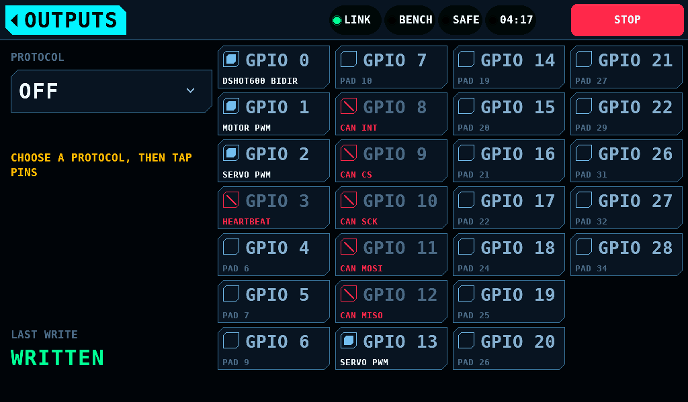

With SERVO PWM picked on the same bench, GP2 and GP13 are ticked and show
`PAD 4` and `PAD 17`: a pin ticked in the selected protocol shows its pad
number, because the protocol is the one named in the list.

### A binding that is not confirmed

The screen edits a binding only after reading it. A read gives one of four
results:

| Read | The screen |
| --- | --- |
| both pages read and they describe a binding, one with no pin bound included | shows it and takes edits |
| a page did not read: no answer within 1000 ms, a refusal, or the link is down | keeps the last binding read, dimmed, with `ASSIGNMENT NOT READ. EDITING LOCKED.` |
| both pages read and no binding describes them: one pin in two slots, a rate or driver no protocol entry has, a pin off the board or reserved, channels out of slot order | keeps the last binding read, dimmed, with `NO VALID ASSIGNMENT IN THE PAGES` and the key `HOLD: CLEAR ALL PIN ASSIGNMENTS` |
| the IOmcu is a board this build has no pin map for | shows no pins |

In the second and third state a tap on a pin does nothing here and on PICK
A PIN, and no write is sent. A tick made just before the read failed is
taken back: the pins shown are the ones last read, not the ones last
tapped. The list still opens, and a pick still changes which protocol's pins
show their pad. The panel reads again at every link-up and every 500 ms while
the link is up and the binding is not confirmed; the first read that gives a
binding ends the state.

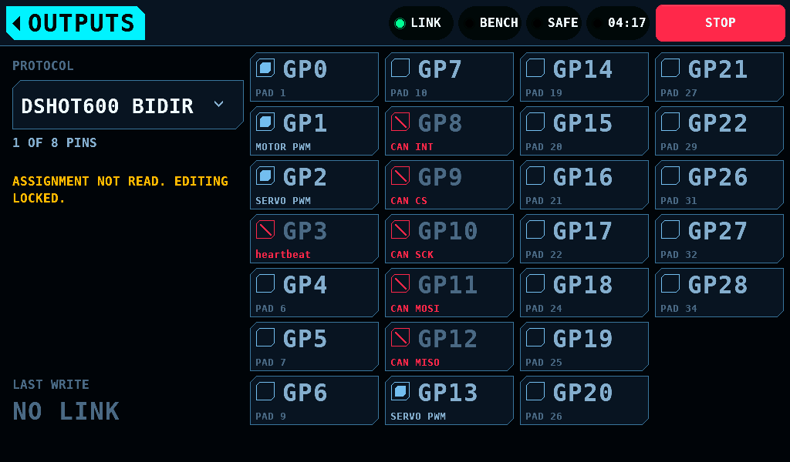

Pages no binding describes do not become readable by reading them again.
`HOLD: CLEAR ALL PIN ASSIGNMENTS`, held for 2 s, writes a binding with no pin; the
read-back then shows nothing bound and edits are taken again. It is the one
write the screen sends in this state. A finger that leaves the key, a lift
before 2 s, and leaving the screen abandon the hold.

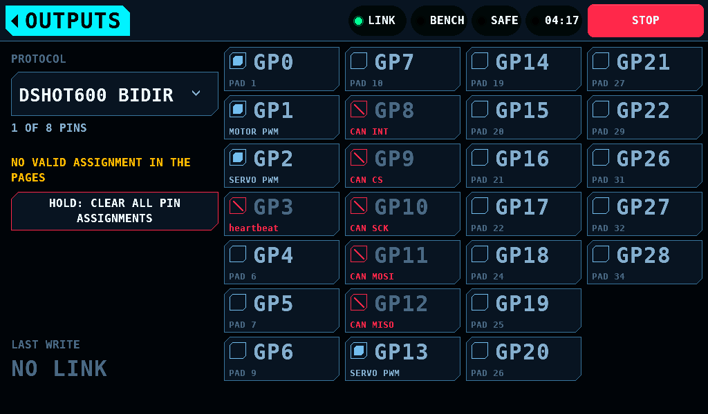

An IOmcu older than 4.10 can be left in this state by a write that
lost a frame part way. An IOmcu speaking 4.10 written by this panel is
not; it shows this state only for pages another host or an older panel left
in its flash.

### Pick a pin

Behind the PICK A PIN tile on SETUP, and its home tag leads back there.
Over the open protocol list the home tag closes the list, choosing
nothing, and the screen stays.
The same binding the
Outputs screen holds. The list answers "which GPIO is bound"; this answers
"where do I put the lead".

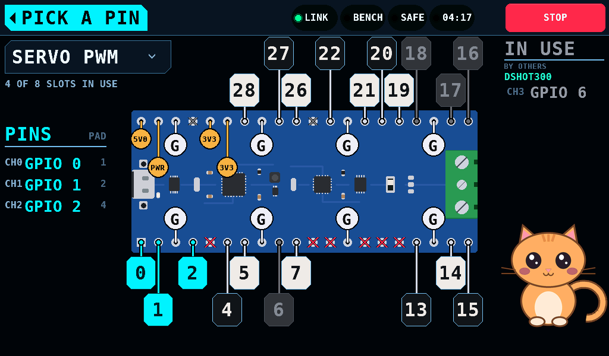

The keys are not the pads. At any size that fits a 480-pixel panel a pad is
under 40 pixels across, which is smaller than a fingertip, so the pads are
drawn where they are and the touching happens on two staggered rows of keys
above the board and two below, 43 px wide, each on a straight trace to its
own pad.

A key's colour says what a tap on it does:

| Key | Pin | A tap |
| --- | --- | --- |
| ivory (row nearer the board) or ebony (row beyond it) | free | binds it to the selected protocol |
| accent | bound in the selected protocol | gives it back |
| grey | another protocol holds it, the programming port has it, the selected protocol can take no more pins, or the binding is not confirmed | changes nothing |
| none, red cross on the pad | reserved by the IOmcu: GP3 heartbeat, GP8 to GP12 CAN | — |

Neighbouring keys differ in height and in colour, like the keys of a
keyboard. A reserved pin has no key because a key under a pin that cannot be
chosen says it could be.

Top left is the protocol list, the same control as on the Outputs screen. It
names the selected protocol. A tap opens it over the board; a pick selects
the protocol a tap on a key joins, on this screen and on the Outputs screen,
and writes nothing. A tap outside the open list closes it and picks nothing.
Every visit opens with OFF selected, on this screen and on the Outputs
screen from SETUP: no key binds or unbinds a pin until a protocol is picked, and the
line under the list says `CHOOSE A PROTOCOL, THEN TAP PINS`. OFF stays
selected across read-backs until a protocol is picked, and a change of
board selects OFF, whatever was selected.

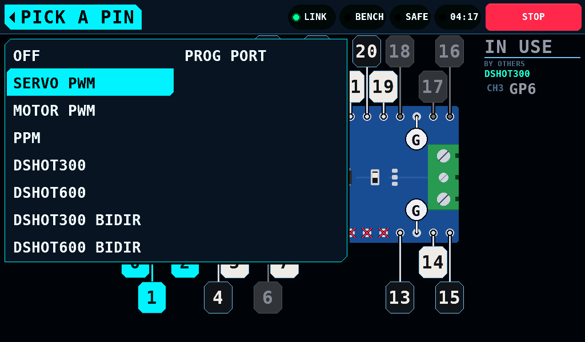

Under the list is `N OF 8 SLOTS IN USE`, counted over every protocol: the
protocols share the 8 slots of the OUTPUTS page. Under that, in amber, is
the reason no key can be added, in the words of the Outputs screen:

| Line | When |
| --- | --- |
| `ALL 8 SLOTS IN USE` | 8 pins are bound over all protocols |
| `NEEDS 8 CHANNELS, 4 FREE` | PPM, which carries 8 channels on one pin, with 4 servo pins bound |
| `SERVO PWM TAKES 8 PINS` | the selected protocol holds as many pins as it takes |
| `CHOOSE A PROTOCOL, THEN TAP PINS` | OFF is selected |
| `NOT READ` | the binding is not confirmed |

Without the line a board drawn all grey reads as a fault.

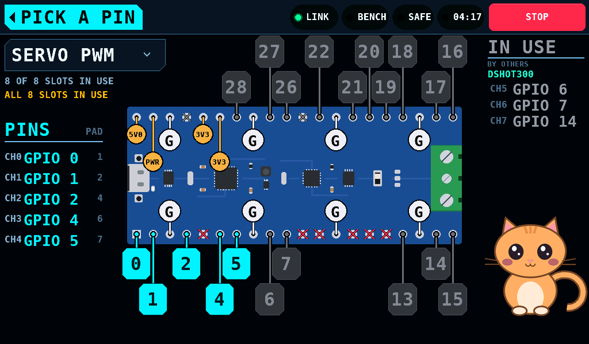

Down the left, under PINS, are the selected protocol's pins in channel
order, each with the pad number printed on the board in the PAD column. Down
the right, under IN USE, are the pins other protocols hold, each group named
and listed where its first pin falls. The two tables together read as one
run of channels, because that is what the OUTPUTS page carries. With OFF
selected the PINS table is not drawn, because OFF holds no pin; the slot
count and IN USE stay, and IN USE then lists every bound pin.

The pin of the IOmcu's programming port, GP13 (pad 17) by default, is
drawn grey while no protocol holds it, a tap on it changes nothing, and IN
USE lists it first under `PROG PORT`, without a channel. Every port the
IOmcu reports, at most 4, holds its pin so, each listed once under the
one `PROG PORT` name, and the slice rule below is checked against each.
A protocol whose stored binding holds that pin keeps it, the IOmcu gives
the port no pin then, and the key is that protocol's like any other.

Under SERVO PWM and MOTOR PWM a key the IOmcu refuses on a PWM slice
is grey too, as on the Outputs screen: GP28 while the port holds GP13, and
the partner of a pin bound as PWM, GP16 beside GP0. A tap on it changes
nothing and puts the Outputs screen's line under the count:
`GP28: SHARES PWM SLICE WITH PROG PORT GP13`, `GP16: SAME PWM CHANNEL AS GP0`.

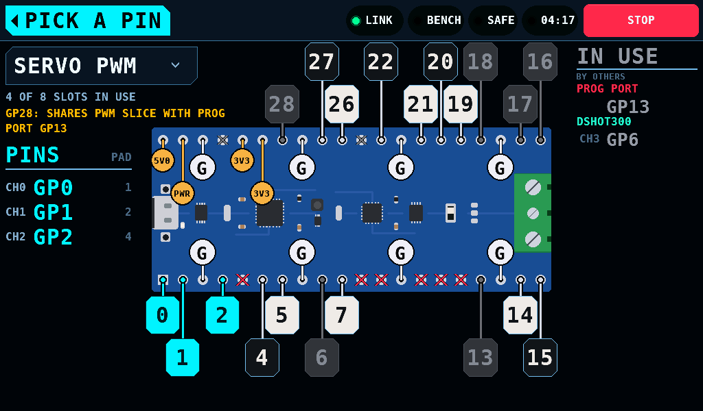

IN USE lists every pin it holds. A protocol's name takes a 20 px line and a
pin a 28 px line. When those run past the foot of the table, every pin line
is 20 px with the GPIO in the smaller face. The tallest table is OFF
selected, the programming port listed and the 8 slots over the 6 protocols
that take one channel a pin: 16 lines, 320 px of the 360 px under the
heading.

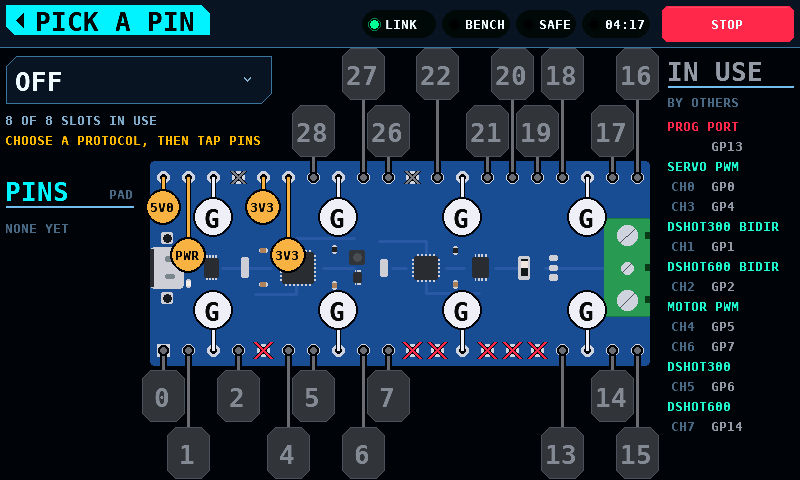

A tap on a key writes the binding through the same sequence as a tick on the
Outputs screen, with the same results. While the binding is not confirmed — a
read failed, or the pages describe no binding — every key is grey, `NOT
READ` stands under the count, and a tap on a key changes nothing and writes
nothing. The protocol list still selects.

Where the pads are comes from the board, not from the panel: the [shape
page](Link.md#page-map) carries the outline, the pitch and the corner pad 1
sits at. A board that does not say is not drawn at all — a picture from a
guessed shape points at the wrong pad as confidently as the right one, and
this screen's whole job is finding a pad on the board in front of you. Its
pins are still on the Outputs screen.

The board's drawing comes from the board as well. The IOmcu carries a
drawing of itself, the one the configurator draws: the outline, the parts as
flat shapes and every pad, to scale in 0.01 mm ([The board
drawing](Link.md#the-board-drawing)). The panel draws it on the shape's pad
grid, so the board on screen is laid out like the board in your hands.
Without a drawing, the outline and every pad are drawn from the shape and
the keys are in the same places:

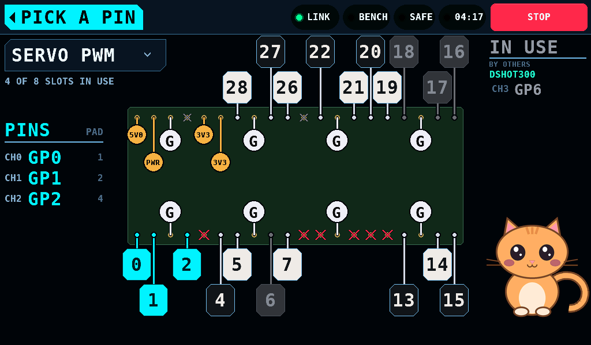

The panel shows a drawing only when it describes the board the panel binds:
the outline and every pad position match the shape, every pin pad carries
the catalogue's GPIO, and every other pad the catalogue's ground or rail. A
drawing that disagrees is not shown, and the shape is drawn instead.

The drawing of the RP2350-CAN is 1,560 bytes, fetched over the link in 26
blocks of 62 bytes in a 15 ms slice of each 50 ms poll. The time this takes
on a bench is not measured. The panel keeps it in its flash with the
drawing's length, CRC (cyclic redundancy check) and hash, and shows the kept
copy only while the IOmcu still reports the same three; an IOmcu
flashed with another drawing is fetched again. Writing it to flash waits for
a bench that is SAFE with the supply off and pauses between two 4 kB sectors
when the bench is ARMED or the supply comes on
([Safety](Safety.md#deliberate-behaviours)).
A board with no drawing, or one whose transfer has not finished, is drawn
from the shape rather than left blank.

A servo lead has three wires and the keys describe one. The other two are
marked on the board itself, on a short trace in from the pad:

| Mark | Pad |
| --- | --- |
| white round marker, 36 px, with a large **G**, 40 px in from the pad | ground |
| amber round marker, 32 px, with the voltage: **5V0**, **3V3** | a rail at a fixed voltage |
| amber round marker with **PWR** | a rail that is an input, VSYS: a number that is only sometimes true is worse here than none |
| dim cross on the pad | neither, like RUN and 3V3_EN |

The marks go inside the outline because that is the only room left: the
space beside the board belongs to the keys, and a mark on the pad itself
would be as small as the pad. Rails sit on neighbouring pads, 25 px apart,
so a rail's marker is 30 px or 78 px in from its pad, alternating along the
row; the deeper one clears the marker of a ground on the pad beside it.

These come from the [pads page](Link.md#page-map), which is separate from the
catalogue because they do not fit in it — a page is 32 registers and a
40-pad board has more pads than that between the two. A board that does not
serve it has its grounds and rails unmarked, and a lead is placed by reading
the board rather than the screen.

### The IOmcu keeps it, not the panel

A binding describes wiring, and the panel is not the board the wires are in.
The IOmcu writes the OUTPUTS and CHAN_CFG pages to its own flash and
restores them at boot; the panel never stores a binding and never sends one
unasked. When the link comes up the panel reads the page and shows what is
configured over there. After a panel restart, what this screen shows and what
is driving pins are the same thing.

Restoring configures the outputs. It does not drive them: every driver is
gated on the pin's role being ARMED, which the IOmcu grants only while
the ARM register names that role, the link is out of failsafe and the heartbeat is trusted, so
a restored binding claims its pins and holds them at idle until somebody switches to ARMED.
Channel commands are not restored — a configuration survives a power cycle and
a throttle position does not.

The save waits for the bench to stop driving, and then for a gap in the
traffic. Writing flash stops the IOmcu with interrupts off, and it
answers nothing while it is stopped: on the bring-up module a save that
erased and programmed inside one window measured 19,178 us, against a CAN
frame of about 130 us and two frames of buffer in the controller. The figure is one
measurement: 1 sample, taken on the bring-up module, with the flash part not
yet identified. The erase and the page program have not been timed apart from
each other. The window is to be argued again against the flash part's
datasheet maximum once the part is known. A request lost
in that window costs the panel 1000 ms of waiting, which is past the
IOmcu's 200 ms silence failsafe, so one lost frame ends as `FAULT 01`
(`LINK_FAULT_LINK_SILENT`) over a cable with nothing wrong with it.

So the sector is not erased per save. Two sectors hold sixteen records each; a
save writes the next record, and a sector is erased only once every record in
it has been superseded. That erase is taken before the save that needs it: at
boot before the IOmcu starts answering, or on a pass after the save that
first writes into the other sector, once the bus has been quiet for 5 ms. It
is the sector left behind that is erased, not the one just filled, so the
erase and the save that needs it are separated by the fifteen saves in
between. Fifteen saves in
sixteen therefore cost one page program and no erase. How long a page program
takes on the module's flash is not measured; the console line printed after
each save carries it.

A power cut during a save leaves the binding from before it. Each record
carries the number of 0 bits it holds, beside that number complemented. An
erase sets bits and a program clears them, so a record caught in either holds
fewer 0 bits than it claims, and the claim cannot survive a partial write in
either direction. The record being written is therefore rejected rather than
probably rejected, the record before it is still the newest good one, and the
sector being erased is never the one holding the record still wanted.

Pages the screen cannot describe — one pin in two slots, a rate no entry
offers, a pin that is not on the header — are shown as such and not as
nothing configured: see [A binding that is not
confirmed](#a-binding-that-is-not-confirmed).

## Balancing

Described on its own page: [Balancing](Balance.md).

The BALANCE pane shows a fixed angle (265°) and two fixed readings (0.42 g
vibration, 0.35 g mass to add) until a sensor is fitted. The SIMULATED pill and
the words "Not measured." stand under the readings, 20 px high and 88 px wide.
The TEST RIG and AIRCRAFT panes show placement guides and carry no mark.

## Unknown screen ids

A screen id that names no screen draws the overview.
