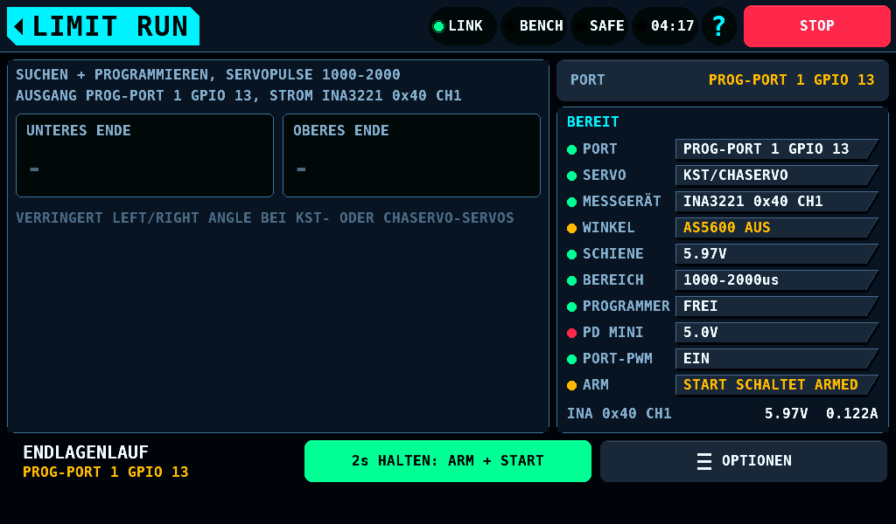
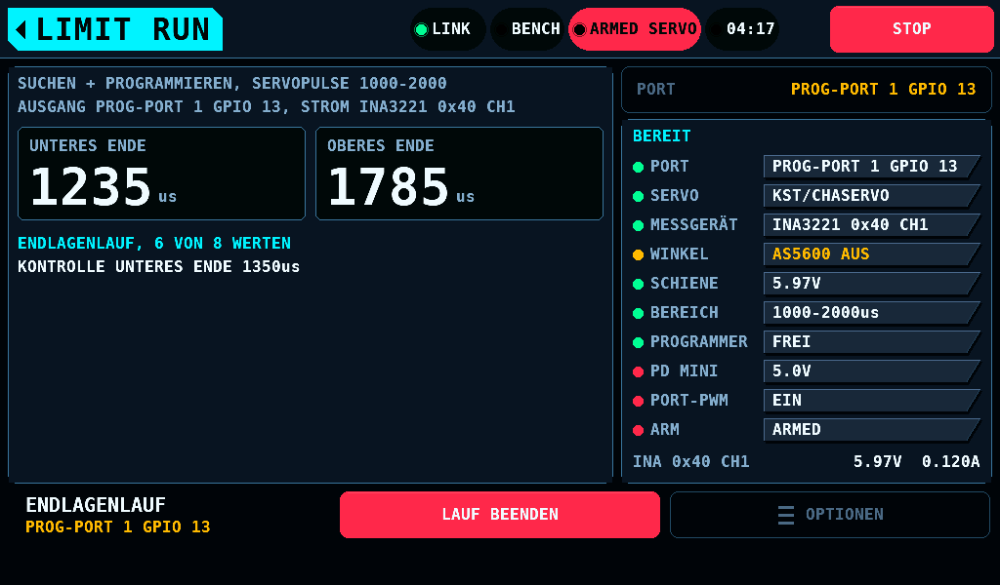
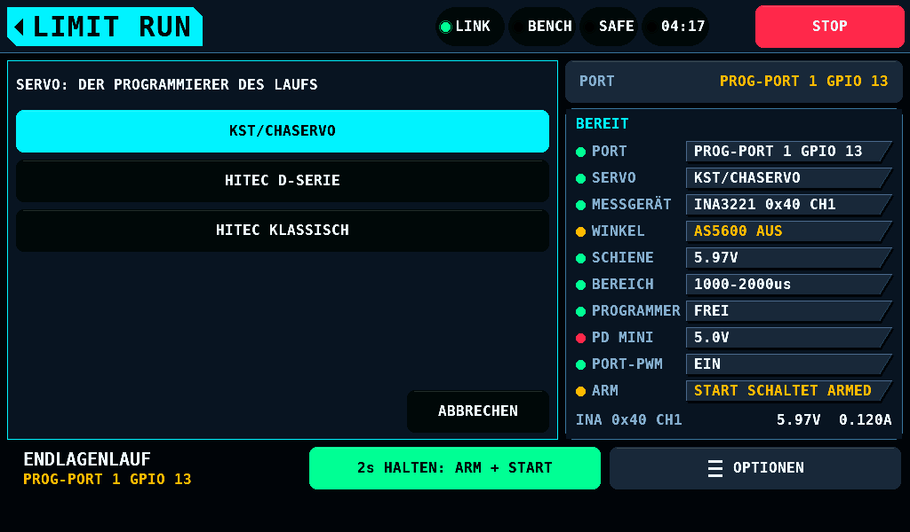
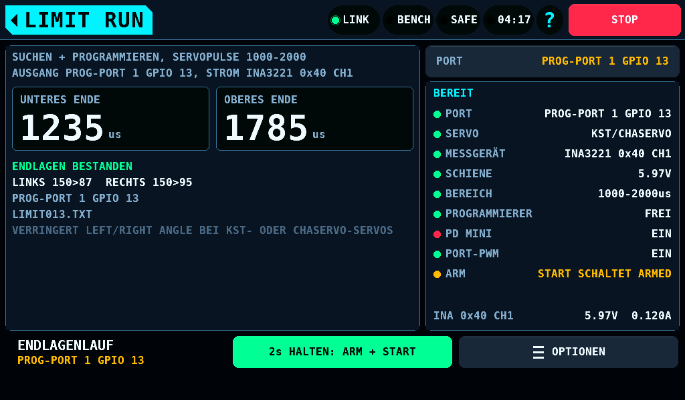
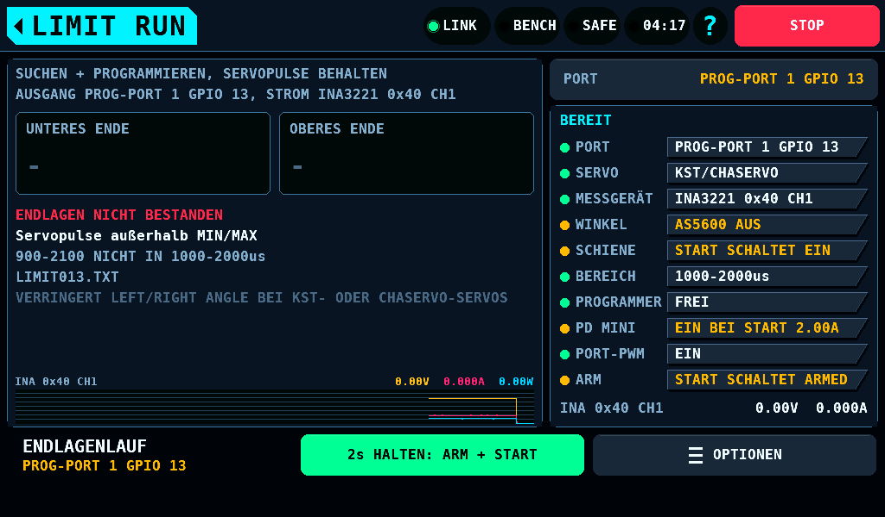
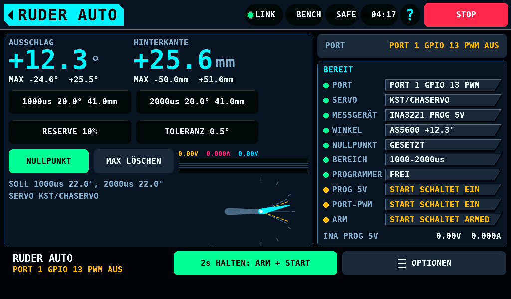

# Servoverfahren

<sub>[English](Servo.md) · **Deutsch**</sub>

Diese Seite beschreibt drei Servoverfahren. Das erste misst ein Servo
im eingebauten Zustand: Die Endlagensuche auf SERVO liest den
INA3221-Kanal aus, der dem Ziel des Servotesters zugeordnet ist. Bei
einem KST-, Chaservo- oder unterstützten Hitec-Servo am Programmierport
kann sie auch die eigenen Weggrenzen des Servos verringern. Das zweite
Verfahren, der Abgleich, braucht einen Sensor für den gemeinsamen Strom
zweier Ausgänge. Dieser Sensor ist nicht bestückt; der Abgleich läuft
deshalb nur mit einem simulierten Servo. Ihre Vorgabewerte stammen aus
`servo_limit_defaults()` und `servo_sync_defaults()` in `shared/servo/`. Das
dritte, der [automatische Test](#automatischer-test), liest den Strom des
Netzteils, das das Servo versorgt. RUDER, eine Funktionsseite von SERVO,
liest den Ausschlag einer Ruderfläche in ° und mm
([Ruderausschlag](#ruderausschlag)).

## Eingebaute mechanische Endlage

### Zweck

Im Sender gesetzte Endpunkte sind Schätzungen. Ein Servo, das gegen einen mechanischen Anschlag drückt, zieht
Blockierstrom, solange diese Stellung angefordert wird. Wo der Anschlag
liegt, hängt vom Einbau ab. Die beiden Enden des Ruderwegs unterscheiden
sich; miss deshalb beide.

### Verfahren

Die Suche schreitet von der Mitte nach außen, in Schritten von 10µs Pulsweite
(etwa 0,9° bei einem Servo mit 11µs je Grad Weg), bis 600µs von der Mitte
und nie über 500 oder 2500µs hinaus. Ein letzter Schritt unter 10µs erreicht
dieses Ende, so wird das Ende selbst gemessen.
Nach jedem Schritt wartet sie 120ms, bis das Servo steht, und mittelt den
Strom über 80ms. Solange die Fläche frei läuft, ist der Strom flach und
niedrig. Das Gestänge gilt als blockiert, wenn der Strom das 1,8-Fache des
Grundstroms im freien Lauf übersteigt und mindestens 0,15A darüber liegt. Die Suche stoppt beim ersten solchen Schritt. Als Endpunkt meldet sie
die letzte freie Pulsweite, um weitere 25µs zur Mitte zurückgenommen.

Am Prüfstand sucht der Endlagenlauf (`shared/servo/servo_limrun.c`) zuerst
die untere Seite, dann die obere. Wo, hängt vom Ziel ab:

| PORT | Zuerst gelesen | Suche |
| --- | --- | --- |
| ein SERVO-PWM-Pin auf OUTPUTS | nichts | PULS MITTE bis PULS MIN und PULS MAX |
| PROG-PORT, KST/CHASERVO | eine Lesesitzung der [Servoprogrammierung](ServoProgrammer-de.md) | NEUTRAL des Servos bis zu seinem eigenen PULSE LOWER und PULSE UPPER, nie darüber hinaus |

Der Abstand zu diesem Ende ersetzt die 600µs. Der Strom wird in Fenstern von 50ms am zugeordneten INA3221-Kanal
gemessen; jede Stellung dauert deshalb 250ms. Vor und nach jeder Suche
bleibt das Servo 1000ms in der Mitte. Der Rückweg von einem 600µs
entfernten Ende dauert bei 0,67µs/ms 900ms und muss vor der Messung des
Grundstroms abgeschlossen sein.

Dauer: der Host-Test begrenzt eine vollständige Suche gegen das modellierte
Servo auf unter 12s. Ein Lauf am Prüfstand ist nicht gemessen.

### Starten



Der Endlagenlauf hat einen eigenen Bildschirm im Rahmen jedes
SERVO-Funktionsbildschirms. Der Bildschirm steht in
`shared/ui/servo_limit_panel.c`, seine linke Karte in
`shared/ui/servo_limit_card.c`, seine Karte BEREIT in
`shared/ui/servo_limit_ready.c` und `shared/ui/servo_ready.c`.

- Die linke Karte hält die Moduszeile, die Ausgangszeile, UNTERES ENDE
  und OBERES ENDE und die Zustandszeilen. Die Moduszeile lautet `SUCHEN +
  PROGRAMMIEREN, SERVOPULSE 1000-2000` oder `NUR SUCHE`. Die Ausgangszeile
  nennt, was der Lauf treibt und liest: `AUSGANG PROG-PORT 1 GPIO 13,
  STROM INA3221 0x41 CH2`, oder an den Ausgängen des Prüfstands `AUSGANG
  SERVO PWM GPIO 2, STROM INA3221 0x40 CH1`. Der Kanal ist der, der in
  SETUP > SENSORS das Ziel des Testers überwacht, der niedrigste mit Shunt
  auf einem bestückten Baustein; `STROM INA3221`, solange keiner es tut.
- UNTERES ENDE und OBERES ENDE, je 295 x 96px: das Ende, das der letzte
  Lauf zuerst fand, in us; `FREI`, wo er vor PULS MIN oder PULS MAX keinen
  Anschlag fand; `-` vor dem ersten Lauf.
- Die Zustandszeilen ab y 178 der Karte, 24px Abstand: Titel und Schritt
  des Laufs, während er läuft, etwa `ENDLAGENLAUF, 6 VON 8 WERTEN` und
  `KONTROLLE UNTERES ENDE 1350us`; sonst der Schritt der Startfolge, oder der
  Fehler der letzten Startfolge, oder warum das Halten gesperrt ist; warum
  der gewählte Modus nicht angeboten wird; das letzte Ergebnis; der
  Hinweis des Modus.
- OPTIONEN öffnet die Liste des Laufs: MODUS (NUR SUCHE oder SUCHEN +
  PROGRAMMIEREN), SERVO (KST/CHASERVO, HITEC D-SERIE oder HITEC
  KLASSISCH, der Programmierer, an den die Sitzungen des Laufs gehen,
  [Hitec-Servos](#hitec-servos)), SERVOPULSE (BEHALTEN oder 1000-2000),
  STROM und Warten vor PWM des Programmierers. STROM ist SET A von SUPPLY
  ([Die Strombegrenzung des Laufs](#die-strombegrenzung-des-laufs)). Der
  Lauf programmiert mit 5,0V und hat keine Zeile für die Spannung
  ([Die 5,0V des Laufs](#die-50v-des-laufs)) und keine für den
  Programmierstrom: kein Lauf wendet ihn an. Mit SERVO auf HITEC D-SERIE folgt unter SERVO der
  Hitec-D-Empfang (PULL-UP oder PRECHARGE), dieselbe gespeicherte
  Einstellung wie auf der [HITEC-Seite](HitecProgrammer-de.md). An den
  Ausgängen des Prüfstands sind MODUS, SERVO und SERVOPULSE gesperrt mit
  `Nur an einem PROG-PORT: wähle einen mit PORT`. SERVOPULSE ist
  gesperrt, solange SERVO auf HITEC steht. MODUS beginnt bei NUR SUCHE,
  SERVOPULSE bei BEHALTEN. Die Liste schließt, wenn der Prüfstand SAFE
  verlässt oder die Startschritte beginnen.
- SERVO ist die eigene gespeicherte Einstellung des Endlagenlaufs
  (`lim_family`), KST/CHASERVO, bis eine andere gewählt wird. Ein Tippen
  auf die Zeile SERVO der Karte BEREIT oder der Liste öffnet die drei
  Einträge; eine Wahl wird sofort gespeichert. RUDER AUTO hat seine
  eigene (`rauto_family`): eine Wahl auf einem Bildschirm lässt die des
  anderen stehen. Das Öffnen der KST- oder HITEC-Programmierung und die
  SERIE der HITEC-Seite ändern keine von beiden. Eine Wahl wird
  abgelehnt, solange der Prüfstand nicht SAFE ist, ein Lauf oder eine
  Startfolge läuft oder eine Programmierung den Port hält.
- Die Karte BEREIT an der Stelle der Ausgangskarte, zehn Zeilen zu 30px
  von y 96 bis y 396, 4px über der Schienenzeile: PORT, SERVO, MESSGERÄT,
  WINKEL, SCHIENE, BEREICH, PROGRAMMER, die Versorgung, PORT-PWM und ARM,
  je ein Punkt, die Bezeichnung und der Zustand. WINKEL nennt die
  Winkelquelle und verweigert nichts: grün, solange der Lauf einen Winkel
  liest, gelb `AS5600 AUS` oder `IMU X+ KEIN MESSWERT`, solange nicht. Die Versorgungszeile heißt PROG 5V am Programmierport des
  rbmod-Carriers, PD MINI, wo ein PD mini das Servo speist, sonst
  VERSORGUNG. PROG 5V zeigt die `5.0V` des Laufs, PD MINI die `5.0V` des
  Laufs und SET A von SUPPLY, `5.0V 2.00A`, gelb `EIN BEI START 2.00A`,
  solange das Halten es einschaltet, und VERSORGUNG die mittlere Spannung
  der Schiene. Die Farben sind die von RUDER AUTO
  ([AUTO-Endpoints](#auto-endpoints)): grün erfüllt, rot sperrt das Halten
  oder ein Ausgang ist über sie aktiv, gelb erledigt das Halten selbst,
  grau wartet auf die Zeile PORT. An den Ausgängen des Prüfstands zeigt
  SERVO `NUR SUCHE` in Grau, PROGRAMMER und PORT-PWM `--`.
- Ein Tippen auf PORT öffnet die PORT-Auswahl; auf WINKEL die
  [Liste WINKELQUELLE](#winkelquelle); auf SERVO die Auswahl
  SERVO, KST/CHASERVO, HITEC D-SERIE und HITEC KLASSISCH über der linken
  Spalte, an den Ausgängen des Prüfstands nennt das Band `SERVO:
  Nur an einem PROG-PORT: wähle einen mit PORT`; auf ein rotes MESSGERÄT
  öffnet es SETUP > SENSORS an dem INA3221, dessen Kanal das Ziel des
  Testers überwacht, sonst am ersten bestückten, und das Home-Feld dort
  führt zum ENDLAGENLAUF zurück; auf ein rotes PD MINI mit
  `PD MINI: 5.0V AUSSERHALB SEINER GRENZEN` öffnet es die Einstellungen von
  SUPPLY bei AUSGANGSGRENZEN; auf ein grünes oder gelbes PD MINI öffnet es
  das Tastenfeld von SET A
  ([Die Strombegrenzung des Laufs](#die-strombegrenzung-des-laufs)). Ein
  Tippen auf eine andere rote oder graue Zeile nennt sie im Alarmband,
  `ZEILE: Grund`.
- 2s HALTEN: ARM + START in der Mitte der Fußleiste, 328 x 48px, grün,
  solange keine Zeile rot ist. Es startet die Startfolge von RUDER AUTO:
  PORT-PWM, PROG 5V oder das PD mini, die Rückmeldung in 1000ms, ARM in
  500ms, der Start ([AUTO-Endpoints](#auto-endpoints)). Ein
  fehlgeschlagener Schritt nennt sein Teil, und jeder Fehler, STOP,
  Link-Verlust und jedes Verlassen endet mit allen Ausgängen aus und dem
  Prüfstand SAFE. Das Halten blendet von grün nach gelb über und blinkt
  300ms, wenn es auslöst. Während des Laufs zeigt es LAUF BEENDEN in Rot.
  Eine Zeile, die unter dem Finger rot wird, lässt das Halten fallen.
- Der Lauf startet mit den Einstellungen, wie sie beim Auslösen des
  Haltens standen.
- Nach dem letzten Befehl des Laufs schaltet der Prüfstand auf SAFE: die
  Fußleiste hat kein DISARM. Nach GEFUNDEN, FREI oder BESTANDEN bleibt
  PROG 5V für den nächsten SERVO-Bildschirm an, bis SERVO verlassen wird,
  und der Ausgang eines PD mini bleibt, wie der Lauf ihn hinterlässt, auf
  5,0V. Ein
  NICHT BESTANDEN schaltet beide aus, sobald das LEAVE des Programmierers
  den Port zurückgegeben hat
  ([Was einen Endlagenlauf beendet](#was-einen-endlagenlauf-beendet)).
- Während des Laufs zeigt die Zeile ARM den Prüfstand, wie er ist: ARMED
  mit dem roten Punkt, oder SAFE in Grün, solange eine Sitzung des
  Programmierers den Prüfstand SAFE hält, wie das Band.



Der Lauf liest den INA3221 und sonst nichts. Die Messwerte des PD mini und
das Modell des Panels werden abgelehnt, bevor etwas angesteuert wird. Der
Text gehört zu einer Zeile der Karte BEREIT (`test_servo_limrun_ready`),
die Zeile ist rot, das Halten grau, und die erste Zustandszeile nennt ihn.
Bei SAFE stehen die Texte, die das Halten selbst erledigt, gelb auf ihrer
Zeile und sperren nichts. Eine rote Zeile zeigt die Kurzform des Textes,
wo der Text länger als die 20 Zellen der Zeile ist; das Alarmband und ein
Tippen auf die Zeile nennen den ganzen Text
([AUTO-Endpoints](#auto-endpoints)).

| Zeile | Text | Kurzform | Bedingung |
| --- | --- | --- | --- |
| PROG 5V | `PROG 5V AUS: START SCHALTET ES EIN` | `PROG 5V AUS` | SAFE auf dem rbmod-Carrier mit PORT auf einem Programmierport und PROG 5V aus. Vor `ZUERST ARM` genannt: der Puls des Ports braucht PROG 5V und kommt nur bei SAFE ([Carrier](Carrier-de.md#der-programmierport)). Gelb: das Halten schaltet es ein |
| ARM | `ZUERST ARM` | der Text | der Prüfstand ist SAFE. Gelb: `START SCHALTET ARMED` |
| ARM | `BERICHT WIRD NOCH GESCHRIEBEN` | `SCHREIBT BERICHT` | ein automatischer Test oder ein Endlagenlauf läuft, oder sein Bericht geht noch auf die Karte |
| PORT | `KEIN SERVO-PWM-PIN`, `PINS NICHT AUSGELESEN` | der Text, `PINS NICHT GELESEN` | PORT auf den Ausgängen des Prüfstands, ohne einen SERVO PWM zugeordneten Ausgang oder mit noch nicht ausgelesener Zuordnung: die Worte der Taste PORT. Vor dem Messgerät genannt: auf dem rbmod-Carrier überwacht ein Kanal eine Schiene, und die Ausgänge liegen erst auf einer Schiene, wenn einer zugeordnet ist ([Carrier: Der Strommonitor](Carrier-de.md#der-strommonitor)) |
| MESSGERÄT | `INA3221 NICHT ZUR SERVOSTROMMESSUNG EINGERICHTET` | `NICHT EINGERICHTET` | kein Kanal eines bestückten INA3221 überwacht in SETUP > SENSORS das Ziel des Testers, an einem IOmcu älter als 4.25 überwacht CH2 oder CH3 es, ein IOmcu älter als Protokoll 4.11, oder eine SENSE-Page, die die Einrichtung nicht hält |
| MESSGERÄT | `INA3221 NICHT ERREICHBAR` | `NICHT ERREICHBAR` | kein Link, das Bauteil antwortet nicht, oder sein Reset-Zähler hat sich geändert |
| MESSGERÄT | `NOCH KEINE INA3221-MESSFENSTER` | `NOCH KEINE FENSTER` | der INA3221 ist noch nicht das Messgerät der Servoschiene: seine Einrichtung ist seit weniger als 1000ms bestätigt, oder kein Fenster mit Strom in den letzten 200ms |
| SCHIENE | `SERVOVERSORGUNG UNTER 3.0V ODER OHNE MESSWERT` | `UNTER 3.0V` | das letzte INA3221-Fenster enthält keine Schienenspannung, oder ihr Mittel liegt unter 3,0V (`SERVO_LIMRUN_RAIL_MIN_MV`). An einem ausgeschalteten Ausgang werden 0V gemessen, und eine Suche dort fände zwei freie Enden an einem Servo, das sich nie bewegt hat. 3,0V liegen unter den 4,8V, für die Servos üblicherweise angegeben sind, so dass die Schiene einer einzelnen Lithiumzelle noch startet; die Spannung, bei der ein bestimmtes Servo stehen bleibt, ist nicht gemessen. Gelb bei SAFE, wo die Versorgung des Haltens die Schiene speist: PROG 5V am Port des Carriers, ein PD mini mit ausgeschaltetem Ausgang. Gelb auch in RÜCKMELDUNG, solange die Versorgung, die die Schritte eingeschaltet haben, die Schiene hochfährt |
| PROGRAMMER | `GESPERRT: SERVOPROGRAMMIERUNG BELEGT DEN PORT` | `SERVOPROGRAMMIERUNG` | PORT auf PROG-PORT, und eine Sitzung eines Programmers hält den Port. Vor PORT-PWM genannt: die Sitzung ist der Grund, dass kein Puls läuft, gleich was PORT-PWM sagt |
| PORT-PWM | `PORT-PWM AUS: DISARM, SCHALTE ES IN OUTPUTS EIN` | `PORT-PWM AUS: DISARM` | PORT auf PROG-PORT mit PORT-PWM aus, der Prüfstand ARMED |
| PORT-PWM | `PORT-PWM AUS: SCHALTE ES IN OUTPUTS EIN` | `PORT-PWM AUS` | dasselbe bei SAFE. Gelb: das Halten schaltet es ein und speichert es |
| PORT-PWM | `PORT-PWM EIN, WARTET AUF SAFE: DISARM, DANN ARM` | `WARTET AUF SAFE` | PORT auf PROG-PORT mit PORT-PWM ein, kein Programmer hält den Port, und sein Puls ist noch aus. Ein Puls kommt nur bei SAFE, und das Panel des rbmod-Carriers fordert ihn nur mit PROG 5V ein an. Gelb bei SAFE: die Rückmeldung wartet auf ihn |
| BEREICH | `MITTE MUSS ZWISCHEN PULS MIN UND PULS MAX LIEGEN` | `MITTE AUSSERHALB` | PULS MITTE liegt nicht zwischen PULS MIN und PULS MAX |
| PD MINI | `PD MINI: 5.0V AUSSERHALB SEINER GRENZEN` | `5.0V NICHT ERLAUBT` | ein PD mini speist das Servo, und der erlaubte Sollwertbereich von SUPPLY, eingeengt durch seine AUSGANGSGRENZEN, lässt 5,0V aus. Ein Tippen auf die Zeile öffnet die Einstellungen von SUPPLY bei AUSGANGSGRENZEN |

### Die Weggrenzen des Servos programmieren

SUCHEN + PROGRAMMIEREN wird für ein Servo am Programmierport angeboten: PORT auf
PROG-PORT, der Port in PWM und eine Versorgung für die 5,0V des Laufs.
Versorgt ein PD mini den Port, muss sein Ausgang eingeschaltet sein oder
auf einer Schiene unter 3,0V vom Halten eingeschaltet werden, und START
stellt ihn auf 5,0V. Ohne PD mini muss die mittlere Schienenspannung im
letzten INA3221-Fenster 4,8V oder mehr betragen. Auf dem rbmod-Carrier muss
zusätzlich PROG 5V eingeschaltet sein. Ein PD mini an den anderen
Servoausgängen versorgt den Programmierport nicht. An den Ausgängen des
Prüfstands sucht der Lauf nur: MODUS ist in der Liste des Laufs gesperrt,
und die Zeile SERVO der Karte BEREIT zeigt NUR SUCHE. Am PROG-PORT beginnt
jeder Lauf mit einer Lesesitzung, deshalb halten die übrigen Bedingungen
auch NUR SUCHE an: das Halten bleibt grau, die Zeile der Bedingung ist rot,
und die erste Zustandszeile nennt sie.

| Zeile | Text | Kurzform | Bedingung |
| --- | --- | --- | --- |
| PROGRAMMER | `PROGRAMMIEREN: PORT IST NICHT IM PWM-MODUS` | `NICHT IM PWM-MODUS` | der Programmierer hält den Port, oder der Port ist nicht für einen Lauf bereit |
| PD MINI | `PROGRAMMIEREN: PD-MINI-AUSGANG AUS` | `PD MINI: AUSGANG AUS` | ein PD mini antwortet mit ausgeschaltetem Ausgang auf einer anderweitig gespeisten Schiene: die Lesesitzung schaltete ihn neben dem Netzteil ein, das die Schiene speist. Auf einer Schiene unter 3,0V steht er bei SAFE gelb, und das Halten schaltet das PD mini ein |
| SCHIENE | `PROGRAMMIEREN: SERVOVERSORGUNG UNTER 4.8V` | `UNTER 4.8V` | kein PD mini antwortet, und die Servoschiene liegt im letzten Fenster des INA3221 unter 4,8V oder ist nicht gelesen |

Ein KST- oder Chaservo-Servo übernimmt geschriebene Werte nach einem
Aus- und Einschalten
([der Versorgungszyklus](ServoProgrammer-de.md#der-versorgungszyklus)).
Der Lauf kann dafür den PD mini oder die 5V-Versorgung der
Programmierports auf dem Carrier schalten. Ohne beides sind SUCHEN +
PROGRAMMIEREN und **SERVOPULSE** auf 1000-2000 nicht verfügbar. Bei ihrer
Auswahl erscheint
`PROGRAMMIEREN: KEIN PD MINI ZUM AUS- UND EINSCHALTEN`, auf seiner
Zeile `KEIN PD MINI`; der Lauf liest
das Servo nur aus und sucht. Hitec-Servos der D-Serie starten nach dem
Schreiben selbst neu und brauchen für diesen Schritt keine schaltbare
Versorgung, wie unten beschrieben.


Versorgt ein PD mini den Port, schaltet jedes VERBINDEN seinen Ausgang
1s aus und wieder ein; VERLASSEN nach einem Schreiben ebenso. Auf dem
Carrier übernimmt die feste 5V-Versorgung der Programmierports diese
Zyklen. Die Suche nach dem Schreiben prüft das Servo deshalb mit den
bereits wirksamen neuen Werten.

#### Die 5,0V des Laufs

Endlagenlauf und RUDER AUTO programmieren mit 5,0V
(`SERVO_LIMRUN_SUPPLY_MV`, `shared/ui/servo_run_supply.c`).

- Jede Programmiersitzung eines Laufs fordert 5000mV, KST/Chaservo wie
  Hitec, mit und ohne PD mini. Die Programmierspannung der KST- und
  HITEC-Seite (`SET_SERVO_PROG_V`) erreicht keinen Lauf, was sie auch
  hält und was die KST-Seite beim Öffnen geladen hat. Die Seiten nutzen
  sie weiter, und das Ende des Laufs gibt ihrem Programmierer die
  Spannung der Einstellung zurück.
- Die Stromgrenze der Sitzung ist SET A von SUPPLY, wo ein PD mini das
  Servo speist ([Die Strombegrenzung des Laufs](#die-strombegrenzung-des-laufs)).
- Speist ein PD mini das Servo, stellt START den Sollwert von SUPPLY vor
  den Schritten auf 5,0V, SET A bleibt. Ein schon eingeschalteter
  Ausgang wird eingeschaltet auf 5,0V gesenkt oder angehoben. Das PD mini
  bleibt nach dem Lauf auf 5,0V, nach Ende, Abbruch und Fehler gleich;
  ein Fehler schaltet wie jeder Fehler alle Ausgänge aus.
- Der Schritt RÜCKMELDUNG wartet, bis der Messwert des PD mini 5,0V mit
  eingeschaltetem Ausgang zeigt. Ein PD mini, das nicht mit 5,0V
  antwortet, lässt ihn nach 1000ms fehlschlagen: `PD MINI FEHLGESCHLAGEN:
  KEINE RÜCKMELDUNG IN 1000ms`, der Lauf startet nicht, und alle Ausgänge
  gehen aus.
- Das PD mini meldet seinen Ausgang EIN, bevor der Ausgang gestiegen ist:
  an einem D485HW las der INA3221 die Schiene danach mit 0,10V, 2,48V und
  4,99V in Bildern im Abstand von 100ms. Die Rückmeldung gibt der Schiene
  dieselben 1000ms, um 3,0V zu erreichen. Eine Schiene, die nach 1000ms
  noch unter 3,0V liegt, lässt den Schritt fehlschlagen: `PD MINI
  FEHLGESCHLAGEN: SERVOVERSORGUNG UNTER 3.0V ODER OHNE MESSWERT`, und alle
  Ausgänge gehen aus.
- Ein erlaubter Sollwertbereich ohne 5,0V (der von SUPPLY, eingeengt
  durch seine AUSGANGSGRENZEN) sperrt das Halten: PD MINI ist rot mit
  `PD MINI: 5.0V AUSSERHALB SEINER GRENZEN`, und ein Tippen auf die Zeile
  öffnet die Einstellungen von SUPPLY bei AUSGANGSGRENZEN. Mit
  eingeschaltetem Ausgang des PD mini öffnet SUPPLY seine Live-Ansicht,
  und sein Alarmband nennt, warum die Liste zu bleibt, wie bei der
  GRENZEN-Taste von TEST. Nimmt SUPPLY bei START keinen Sollwert an,
  zeigt die erste Zustandszeile `PD MINI HAT 5.0V NICHT ÜBERNOMMEN`, und
  kein Schritt wird getan.
- PROG 5V des Carriers ist fest 5V und hat keinen Sollwert.

#### Die Strombegrenzung des Laufs

Ein Lauf von ENDLAGENLAUF und RUDER AUTO und jede Stufe des automatischen
Tests laufen mit SET A von SUPPLY, wo ein PD mini das Servo speist
(`shared/ui/servo_run_supply.c`).

- Die Zeile PD MINI der Karte BEREIT zeigt sie nach der Spannung:
  `5.0V 2.00A` auf ENDLAGENLAUF und RUDER AUTO, `EIN 2.00A` auf TEST, gelb
  `EIN BEI START 2.00A`, solange das Halten oder die Stufen den Ausgang
  einschalten. Der Zustand bleibt in Englisch und Deutsch in seinen 20
  Zellen, auch mit drei Stellen mA (`EIN BEI START 2.125A`).
- Die Listen OPTIONEN von ENDLAGENLAUF und RUDER AUTO führen sie als
  STROM, `SET A 2.00A`.
- Ein Tippen auf die Zeile, grün oder gelb, oder auf STROM öffnet das
  Tastenfeld von SUPPLY über der linken Spalte: STROMBEGRENZUNG in A, zwei
  Nachkommastellen, innerhalb der Grenzen von SUPPLY, eingeengt durch
  seine AUSGANGSGRENZEN. OK setzt SET A und behält SET V. Ein Wert
  außerhalb des Bereichs lässt das Tastenfeld offen und nennt den Bereich.
- Bei eingeschaltetem Ausgang und Rückfrage Tastenfeld von
  SUPPLY an (die Vorgabe) kommt zuerst die Frage von SUPPLY: `AUSGANG IST
  EINGESCHALTET`, die Änderung als `2.00 -> 1.50A`, ÜBERNEHMEN oder
  ABBRECHEN. Ein Ausgang, der unter der Frage ausgeht, nimmt sie
  unbeantwortet mit, wie auf SUPPLY.
- Die Zeile nimmt kein Tippen, solange ein Lauf oder seine Startschritte
  laufen, wie die anderen Zeilen von TEST dann keines nehmen; die Zeile
  PD MINI von TEST zeigt die Grenze, mit der der Lauf begann. Belegt ein
  Programmierport das Netzteil, lehnt das Tastenfeld mit
  `Servoprogrammierung belegt das Netzteil: Sollwerte und EIN gesperrt.`
  ab, der Ablehnung von SUPPLY.

Speist kein PD mini das Servo, begrenzt die eigene Grenze der externen
Versorgung oder M7 des rbmod-Carriers den Strom. Die Sitzung eines Laufs
fragt weiter den Programmierstrom der Programmierer (`SET_SERVO_PROG_I`)
an, und der IOmcu speichert ihn und wendet nichts an: er schaltet keine
Versorgung, die er nicht hält (`shared/outputs/kst_port.c`), und PROG 5V
des Carriers nimmt keine Strombegrenzung
(`firmware/iomcu/src/iomcu_kst.c`). STROM zeigt dann `--`, gesperrt mit
`Kein PD mini speist das Servo: seine Versorgung begrenzt`, und die Zeile
der Versorgung zeigt keinen Strom. Die KST- und die HITEC-Seite stellen
den Programmierstrom für ihre eigenen Sitzungen.

#### Zuerst lesen

Jeder Lauf auf PROG-PORT, auch NUR SUCHE, beginnt mit einer Lesesitzung.
Das Servo steht auf PULS MITTE, der Lauf schaltet den Prüfstand auf SAFE,
VERBINDEN liest alle Register, VERLASSEN gibt den Port zurück, und der Lauf
schaltet den Prüfstand auf ARMED. Vorher wird nichts angesteuert.

- Ein Lesen, das scheitert, beendet den Lauf vor jeder Suche: NICHT
  BESTANDEN, `kein KST/Chaservo ausgelesen`, wenn das erste VERBINDEN kein
  Servo findet, das antwortet (ein Servo, das kein KST oder Chaservo ist,
  antwortet nicht), oder das gelesene Servo Werte hält, die die harten
  Regeln nicht annehmen; ABGEBROCHEN, `PROG-PORT-Sitzung gescheitert`, wenn
  das erste VERBINDEN aus einem anderen Grund scheitert oder sein Lesen
  nicht abschließt. Ein Servo, das kein KST oder Chaservo ist, wird mit
  PORT auf einem SERVO-PWM-Pin gesucht. Jedes spätere VERBINDEN, ein
  VERLASSEN oder ein Schritt, der nicht abschließt, beendet den Lauf als
  ABGEBROCHEN mit demselben Grund.
- NEUTRAL nicht zwischen PULSE LOWER und PULSE UPPER beendet ihn als NICHT
  BESTANDEN, `NEUTRAL außerhalb LOWER/UPPER`.
- PULSE LOWER bis PULSE UPPER nicht innerhalb von PULS MIN bis PULS MAX
  des Prüfstands beendet ihn als NICHT BESTANDEN, `Servopulse außerhalb
  MIN/MAX`. Der Prüfstand bleibt SAFE, nichts wird angesteuert, die
  Versorgung geht nach dem LEAVE aus, und linke Karte und Bericht nennen
  beide Bereiche, zum Beispiel `900-2100 NICHT IN 1000-2000us`.

Den Bereich eines KST- oder Chaservo-Servos prüft der Lauf erst nach dem
Lesen: PULSE LOWER und PULSE UPPER sind Register des Servos, und die
Lesesitzung braucht die Versorgung eingeschaltet. Die Karte BEREIT kann
ein solches Servo vor dem Halten nicht ablehnen, also schaltet ARM +
START PORT-PWM, die Versorgung und ARM für einen Lauf, der beim Lesen
endet. Der Bereich eines Hitec-Servos ist der seines Modells und wird vor
dem Halten auf der Zeile BEREICH geprüft.

Ein KST-Servo im Lieferzustand hält PULSE LOWER 900,0µs und PULSE UPPER
2100,0µs. PULS MIN und PULS MAX des PWM-Typs STANDARD sind 1000µs und
2000µs, also wird dieses Servo bei BEHALTEN abgelehnt. SERVOPULSE auf
1000-2000, oder ein PWM-Typ, dessen Bereich 900 bis 2100µs enthält, lässt
es laufen.

SERVOPULSE auf 1000-2000 schreibt in der Lesesitzung PULSE LOWER 1000,0µs
und PULSE UPPER 2000,0µs, bevor etwas angesteuert wird, und liest sie
zurück. NEUTRAL wird nicht geschrieben. Ein Servo, das diese Werte schon
hält, bekommt kein Schreiben. NEUTRAL außerhalb des neuen Bereichs beendet
den Lauf als NICHT BESTANDEN, bevor etwas angesteuert wird, mit
ZURÜCKSPIELEN im Angebot. Die Einstellung wirkt mit NUR SUCHE und mit
SUCHEN + PROGRAMMIEREN; mit NUR SUCHE sind die Pulse das einzige Schreiben, und der
Hinweis in den Einstellungen des Laufs sagt `NUR SUCHE: SETZT NUR PULSE LOWER/UPPER`.

#### Die Register und das Modell

LEFT ANGLE und RIGHT ANGLE sind die eigenen Weggrenzen des Servos, je ein
8-Bit-Register, in einer unbekannten Einheit. Der kleinste zulässige Wert ist bei einem KST 1; die harten Grenzen der
Servoprogrammierung schließen 0 aus. Ein Wert unter 50 ist eine weiche Grenze; das Halten von 2s
beim Start ist die Zustimmung dazu.

Der Lauf setzt einen linearen Zusammenhang zwischen Pulsweite und
Servoweg voraus. PULSE LOWER und PULSE UPPER sind die
Eingangspulse, bei denen das Servo den vollen Weg erreicht, den LEFT ANGLE
und RIGHT ANGLE setzen. Zwischen NEUTRAL und diesem Puls ist der Weg linear
im Puls; darüber hinaus hält das Servo den vollen Weg. Der Anteil einer
Seite beim Puls p ist

```text
f = (p - NEUTRAL) / (P_lim - NEUTRAL)
```

mit P_lim gleich PULSE LOWER auf der unteren und PULSE UPPER auf der oberen
Seite, so wie das Servo sie während der Suche hält. Die Einheit von LEFT
ANGLE und RIGHT ANGLE ist unbekannt, und der lineare Zusammenhang ist eine
Annahme, keine Messung. Eine blockierte Seite, deren letzter freier Puls
nicht jenseits von NEUTRAL liegt, beendet den Lauf vor jedem Schreiben als
NICHT BESTANDEN, `freies Ende vor NEUTRAL`.

#### Zwei Schreibvorgänge je blockierter Seite

v0 ist der Wert, den das Register der Seite beim Lesen hält.

1. Der Vorhalt: `v1 = ceil(v0 x fb x 1.03)`, fb der Anteil am ersten
   blockierten Puls der ersten Suche, höchstens v0 und mindestens der
   kleinste Wert. Der erste blockierte Puls liegt am Anschlag oder
   dahinter, also bleibt der Anschlag bei v1 erreichbar und rückt nahe an
   die Pulsgrenze. Die Seite wird erneut gesucht. Ist sie dort frei, endet
   der Lauf als NICHT BESTANDEN, `kein Anschlag nach dem Vorhalt`, ohne
   zweites Schreiben und mit ZURÜCKSPIELEN im Angebot.
2. Der Endwert: `v2 = floor(v1 x f1)`, f1 der Anteil am letzten freien Puls
   der Vorhalt-Suche, mindestens der kleinste Wert. Kein Abstand kommt
   hinzu: der letzte freie Puls liegt einen Schritt von 10µs vor dem
   blockierten. Eine Vorhalt-Suche, die weit innerhalb der Pulsgrenze
   anläuft, ergibt v2 ebenso; kein weiterer Vorhalt folgt.

Durchgerechnet am modellierten Servo des Hosts: NEUTRAL 1500,2µs, PULSE
LOWER 900,0µs, v0 150, der Anschlag bei 1000µs. Die erste Suche ist frei
bei 1000µs und läuft bei 990µs an: fb = 510,2 / 600,2 = 0,850, v1 =
ceil(150 x 0,850 x 1,03) = 132. Bei 132 ist die Suche frei bis 930µs:
f1 = 570,2 / 600,2 = 0,950, v2 = floor(132 x 0,950) = 125. Bei 125 endet
der volle Weg bei 1000,2µs.

Der Vorhalt entfällt, wo v1 nicht unter v0 läge, oder wo das Modell den
Anschlag um weniger als 20µs verschiebt: d0 x (v0 - v1) / v1 unter 20µs,
d0 der Abstand des letzten freien Pulses der ersten Suche von NEUTRAL. Eine Suche könnte eine so kleine Verschiebung nicht von einer
unveränderten Endlage unterscheiden. Die erste
Suche zählt dann als die des Vorhalts, und `v2 = floor(v0 x f0)`, f0 der
Anteil an ihrem letzten freien Puls: ein Schreibvorgang für diese Seite.

#### Welches Register welche Seite begrenzt

Die Protokollnotizen sagen nicht, welche Pulsseite jedes Register begrenzt,
und nicht, wie REVERSION das ändert. Der Lauf findet es beim ersten
Schreiben der ersten blockierten Seite: dieser Wert geht nur an LEFT ANGLE
(an RIGHT ANGLE, wo LEFT ANGLE schon den kleinsten Wert hat), und die Seite
wird gesucht. Das Ende hat sich bewegt, wenn es frei ist oder sein
Endpunkt 20µs weiter außen liegt. Ein Ende, das innerhalb von 20µs blieb,
schickt LEFT ANGLE auf seinen Wert zurück und den aus dem v0 von RIGHT
ANGLE neu berechneten Wert an RIGHT ANGLE; bewegt es sich dann, begrenzt
RIGHT ANGLE diese Seite. Bleibt das Ende bei beiden versuchten Registern unverändert, endet der
Lauf als NICHT BESTANDEN, `LEFT/RIGHT ANGLE: Seite
unklar`. Dasselbe gilt, wenn sich das Ende um 20µs oder mehr nach innen bewegt.
Blockiert eine Seite noch beim kleinsten Registerwert, endet der Lauf
als NICHT BESTANDEN, `blockiert beim kleinsten Winkel`. Ein Register, dessen Seite nie blockierte, bleibt unverändert.

Zuletzt werden beide Enden noch einmal gesucht: BESTANDEN, wenn beide frei
sind, NICHT BESTANDEN `Endlage blockiert weiterhin`, wenn eines anläuft.
Nach NICHT BESTANDEN folgt kein weiteres Schreiben. Mit ZURÜCKSPIELEN
kannst du die Werte vor dem Lauf wiederherstellen.

#### Sitzungen

Der Lauf schreibt in Sitzungen des [Programmierers](ServoProgrammer-de.md):

1. Das Servo geht in die Mitte zurück und wird dort 1000ms gehalten.
2. Der Lauf schaltet den Prüfstand auf SAFE.
3. VERBINDEN nimmt den Port und liest alle Register.
4. Das Schreiben: SCHREIBEN INS SERVO FREIGEBEN an, die Felder des Laufs,
   der Schreibschalter wieder aus. Es ist das gewöhnliche Schreiben des
   Programmierers mit jeder Grenzprüfung, und es liest die Werte zurück.
5. VERLASSEN gibt den Port an PWM zurück.
6. Der Lauf schaltet den Prüfstand auf ARMED und sucht die Seite, für die
   geschrieben wurde.

Die Lesesitzung schreibt nichts außer den Pulsen von SERVOPULSE. Ein
VERLASSEN, das dieser Link oder diese Versorgung nicht abschließt, beendet
den Lauf, bevor sich ein Wert ändert. Das erste Schreiben des Laufs sichert
die Werte des Servos in eine Datei auf der Karte, wie das erste Schreiben
des Programmierers; die späteren Sitzungen sichern nicht. Jede spätere
Sitzung liest das Servo erneut. Ein anderer Typ, umgeschaltete REVERSION,
ein anderer Bereich der Werte, die die harten Regeln annehmen, andere
Pulse, oder LEFT ANGLE und RIGHT ANGLE anders, als der Lauf sie zuletzt
schrieb, beenden den Lauf als ABGEBROCHEN, `Servo hat andere Werte`, bevor
er wieder schreibt.

| Konstante | Wert | Zweck |
| --- | ---: | --- |
| `SERVO_LIMRUN_WRITES_MAX` | 8 | Registerwerte, die ein Lauf höchstens schreibt: PULSE LOWER und PULSE UPPER (2), Vorhalt und Endwert auf jeder Seite (4), und das erste Schreiben von LEFT ANGLE mit seinem Wert zurück, wenn RIGHT ANGLE diese Seite begrenzt (2). Eine Sitzung, deren Werte darüber gingen, wird nicht gesendet: NICHT BESTANDEN `Grenze von 8 Werten erreicht` |
| `SERVO_LIMRUN_OVERSET_PCT` | 3% | der Vorhalt über dem Anteil am ersten blockierten Puls |
| `SERVO_LIMRUN_STD_LOWER_DUS`, `SERVO_LIMRUN_STD_UPPER_DUS` | 1000,0µs, 2000,0µs | was SERVOPULSE auf 1000-2000 schreibt |
| `SERVO_LIMRUN_MOVED_US` | 20µs | ein Ende, das sich bewegt hat oder blieb; die kleinste Verschiebung des Anschlags, für die ein Vorhalt geschrieben wird |
| `SERVO_LIMRUN_RETURN_MS` | 1000ms | in der Mitte vor jeder Suche und vor jedem SAFE |

Ein eigener Protokollschritt zum dauerhaften Speichern ist nicht bekannt;
ebenso wenig ein Schreibbefehl, der nur das RAM ändert. Jeder Schreibvorgang
schreibt ein Register und liest es zur Kontrolle zurück. Ob ein KST-Servo den
Wert bei jedem Schreiben im EEPROM (elektrisch löschbarer programmierbarer
Nur-Lese-Speicher) ablegt und wie viele Schreibvorgänge dieser Speicher
verträgt, ist unbekannt; die Grenze hält einen Lauf bei 8 Werten. Ein Lauf
mit beiden Enden blockiert und SERVOPULSE auf 1000-2000 schrieb am
modellierten Servo des Hosts 6 Werte in 4 Schreibvorgängen und 4
Sitzungen, 85,6s, mit REVERSION AUS, und 8 Werte in 5 Schreibvorgängen
und 5 Sitzungen, 97,7s, mit REVERSION EIN.

Die gefundenen Enden werden nicht auf PULS MIN und PULS MAX des
Prüfstands angewendet.

### Hitec-Servos

Mit SERVO auf HITEC D-SERIE oder HITEC KLASSISCH übernimmt die
[Hitec-Servoprogrammierung](HitecProgrammer-de.md#läufe) die Sitzungen des
Laufs in dieser Serie, gleich, was die Zeile SERIE der HITEC-Seite hält.
Suche, Vorhalt, Zuordnung und Prüfung sind die oben beschriebenen.




Was anders ist:

| | D-SERIE | KLASSISCH |
| --- | --- | --- |
| LINKS, RECHTS | LEFT END (0xB2), RIGHT END (0xB0) | LEFT END und RIGHT END: Zelle 0x14 und Zelle 0x13 an einem CW-Servo, an einem CCW-Servo vertauscht |
| Einheit | Zählwerte ab NEUTRAL 0xC2: 0xC2 - 0xB2 und 0xB0 - 0xC2; 74,5 je Grad an einem Standardservo | die rohe Zelle, 0 bis 255, Einheit unbekannt |
| Bereich eines Schreibens | 1 Zählwert bis zum kleineren von 0xC2 - 1 und 16383 - 0xC2 | 0 bis 255 |
| Pulse: NEUTRAL, voller Weg | 1500,0us; 850,0us und 2150,0us: das Zielmodell aus `hitec_live.h`, t = (us - 750) x 4, Ziele 400 und 5600 | 1500,0us; 900,0us und 2100,0us, der PWM-Bereich von Hitec |
| Ein Schreiben | die Register im Abstand von 20ms, das Speichern (0x70), 100ms, der Neustart (0x46), 1000ms, das Zurücklesen | jede Zelle mit ihrem Ausgleich in 0x1C, das Zurücklesen von 0x00 bis 0x23 |
| Versorgung | wie sie ist: die D-Serie übernimmt ein Schreiben nach ihrem eigenen Neustart | ein PD mini, oder PROG 5V am rbmod-Carrier, für jede Sitzung, auch das Lesen: Einstieg und VERLASSEN schalten die Versorgung aus und ein |

- Ein Hitec-Servo hat keine Pulsregister. Der Lauf nimmt die Pulse der
  Tabelle, die nicht gemessen sind, und sucht bis zu ihnen: PULS MIN und
  PULS MAX müssen sie enthalten, sonst bleibt 2s HALTEN: ARM + START grau
  und BEREICH rot mit
  `HITEC: PULS MIN/MAX MUSS 850-2150us ABDECKEN` (KLASSISCH: `900-2100us`),
  auf der Zeile `BRAUCHT 850-2150us`.
  Der TYP WEIT, 800 bis 2200us, enthält beide. SERVOPULSE wird nicht
  angezeigt.
- KLASSISCH ohne PD mini oder PROG 5V hält das Halten grau und die
  Versorgungszeile rot mit
  `Klassische Servos brauchen ein PD mini: Der Prüfstand schaltet die
  Versorgung.`, auf der Zeile `BRAUCHT EIN PD MINI`.
- Die 2s Halten von ARM + START sind die Zustimmung, die ÄNDERUNG
  PRÜFEN verlangt: die Schreibvorgänge des Laufs zeigen keine Seite, und
  jeder schaltet SCHREIBEN INS SERVO FREIGEBEN für sich ein und an seinem
  Ende aus. Ein Wert außerhalb des Bereichs wird abgelehnt, nicht
  begrenzt.
- Ein erstes VERBINDEN, auf das kein Servo antwortet, oder ein Servo, dessen
  Endpoints sich nicht ändern lassen, beendet den Lauf als NICHT BESTANDEN
  mit `kein Hitec-Servo ausgelesen`.
- Die Backup-Datei HITEC001 bis HITEC999 wird vor dem ersten Schreiben
  des Laufs gespeichert. Lade sie zum Zurückspielen unter DATEIEN der
  Hitec-Servoprogrammierung und schreibe sie mit n WERTE SCHREIBEN. Das
  Die linke Karte nennt sie, `HITEC001 IN DATEIEN LADEN`, oder `KEINE BACKUP-DATEI`, wenn keine gespeichert ist: ohne Karte, oder der Lauf
  endete, bevor die Sitzung des ersten Schreibens eine speicherte.
- Der Bericht nennt die Register, `LEFT END (0xB2): 4841 vorher, 2341
  nachher`, das Servo als `Hitec D SERIES, DIRECTION CW` und die Pulse als
  Pulsmodell.

Am modellierten D485HW des Hosts, beide Enden blockiert, schrieb ein Lauf
4 Werte in 3 Schreibvorgängen und 4 Sitzungen, 107,9s. Welche Hornstellung
ein Endpoint der D-Serie an einem CCW-Servo ergibt, welche klassische
Zelle welche Seite begrenzt, die Einheit der klassischen Zelle und ob der
Weg beider Serien linear von der Pulsweite abhängt, ist nicht gemessen.
Der Zuordnungsschritt ermittelt das Register jeder Seite wie bei einem
KST-Servo,
und ein NICHT BESTANDEN mit `LEFT/RIGHT ANGLE: Seite unklar` (die
KST-Wörter, auch für LEFT END und RIGHT END) oder `Endlage blockiert weiterhin` beendet einen Lauf, dessen Servo dem Modell nicht folgt.

### Schutzmechanismen

| Schutz | Wert | Wirkung |
| --- | ---: | --- |
| Stromobergrenze | 3,0A | Abbruch, bei jedem 1-ms-Messwert eines Fensters geprüft |
| Der INA3221 an seiner Messgrenze | ein abgeschnittener Messwert | Abbruch |
| Stall-Timeout | Fenstermittel über 1,0A für 400ms | Abbruch |
| Kein Fenster | 200ms, 4 Fenster zu 50ms | Abbruch; `SERVO_TEST_WIN_STALE_MS`, der Wert des automatischen Tests. Ein Fenster ohne Strommesswert zählt nicht als Fenster. Die drei Schutzmechanismen darüber verwenden diese Fenster; für eine Lücke gilt deshalb keine zusätzliche Toleranzzeit |
| Der AS5600, ab dem Start in Gebrauch | länger als 300ms keine Antwort oder eine erneute Lücke innerhalb von weniger als 10s seit Beginn der vorherigen | Abbruch als Fehler, `AS5600 antwortet nicht` oder `AS5600 2x in 10s ausgefallen`, mit WINKELQUELLE IMU `IMU antwortet nicht` oder `IMU 2x in 10s ausgefallen`; bei einer kürzeren, selteneren Lücke läuft der Test weiter, ohne dabei Winkelwerte zu übernehmen, wie im automatischen Test ([Der Ausgangsencoder](#der-ausgangsencoder)). Der Bericht hat die Zeile `AS5600-Aussetzer: N, längster Mms. ...`, wenn N größer als 0 ist |
| Eine Suche | 40s | Abbruch: 1000µs Weg sind 100 Stellungen zu 250ms, 25s |
| Ein Schritt des Programmierers | 150s | Abbruch: VERBINDEN mit seinem Lesen, ein Schreiben oder VERLASSEN |
| Das Umschalten des Prüfstands | 3s | Abbruch, wenn SAFE oder ARMED 3s nach der Anforderung nicht steht |
| Das Netzteil | Sollwerte und Ausgang, ein oder aus, wie bei seiner ersten Messung, ob es antwortet oder nicht, in jeder Phase außer den Sitzungen des Programmierers (VERBINDEN bis VERLASSEN), denen das Netzteil gehört; ein Ausgang, der beim Start aus ist und eingeschaltet wird, oder ein Netzteil, das beim Start nicht antwortet und später antwortet, mit ein- oder ausgeschaltetem Ausgang, beendet den Lauf als `Netzteil oder Spannung geändert`, so wird neben einer Schiene, die anderswo gespeist wird, kein zweites Netzteil eingeschaltet; ein VERBINDEN wird nicht gesendet, solange ein PD mini antwortet, mit dem der Lauf nicht begonnen hat, oder dessen Ausgang aus ist: der Lauf endet, wie eine Messung außerhalb einer Sitzung ihn beendet, mit `Netzteil oder Spannung geändert` für einen PD mini, mit dem der Lauf nicht begonnen hat, und mit `Netzteilausgang abgeschaltet` für seinen eigenen; während einer Suche zudem die Schienenspannung innerhalb 1,0V des ersten Fensters | Abbruch |
| Die Schienenspannung im Fenster einer Suche | in jedem Fenster einer Suche vorhanden, ihr Mittel bei 3,0V oder mehr (`SERVO_LIMRUN_RAIL_MIN_MV`), das erste Fenster eingeschlossen | Abbruch, bevor das Fenster die Suche bewegt: `kein Spannungswert im Fenster` ohne Wert, `Netzteil oder Spannung geändert` unter 3,0V; Bezug des 1,0-V-Bands ist das erste Fenster des Laufs, das die Spannung enthält |
| Schrittweite | 10µs | begrenzt die Änderung der angeforderten Pulsweite je Schritt; wie stark das Horn dabei gegen einen Anschlag drückt, hängt vom Einbau ab |

Sie gelten in jeder Phase. Suche und Schutzmechanismen verwenden den
Betrag des Stroms. Bei umgekehrtem Shunt wird der Strom eines
blockierenden Servos stärker negativ; die Blockierung wird trotzdem
wie bei richtig eingebautem Shunt erkannt. Ein Messwert von -32768mA zählt als
32768mA, über der Grenze von 3,0A. Der Lauf folgt den Regeln für ARMED des
SERVO-Bildschirms und des Programmierports: sein ARM wird abgelehnt,
solange der Port gehalten wird, eine STOP-Sperre oder verlorene
Touch-Ereignisse halten den Prüfstand SAFE, und ein ARM, das nicht ankommt,
beendet den Lauf.

Der Abgleich ist ein Modul in `shared/servo`, auf dem Host gegen ein
modelliertes Servo getestet; keines der beiden Firmware-Images ruft es auf.

### Was einen Endlagenlauf beendet

STOP, LAUF BEENDEN in der Fußleiste von ENDLAGENLAUF, ein Umschalten auf
SAFE durch den Bediener, Linkverlust, das Verlassen des Bildschirms, die manuelle Übernahme des Servos, eine Änderung an den Einstellungen des
Servos, verlorene Touch-Ereignisse, der INA3221, der aufhört, das Messgerät zu sein,
und ein Netzteil, das aufhört zu antworten, auslöst, ausschaltet oder
dessen Sollwerte sich ändern: die Gründe des automatischen Tests, in
[Was einen Lauf beendet](#was-einen-lauf-beendet). SAFE und ARM des Laufs
selbst beenden nichts. Jeder Grund beendet den Lauf als ABGEBROCHEN, mit
ausgeschaltetem Ausgang und freigegebenem Servo. Ein Fehler während einer
Suche, einer Probe oder der Prüfung schaltet den Prüfstand zudem auf SAFE:
ein Wert an der Grenze von 3,0A, ein abgeschnittener Wert, 1,0A für 400ms,
ein Fenster ohne Spannung der Schiene und die Fehler des automatischen Tests,
darunter die beiden des AS5600 ([Sicherheit, Fehler](Safety-de.md#fehler)).
In einer Sitzung des Programmierers ist der Prüfstand schon SAFE, und eine
Lücke des AS5600, die den Lauf dort beendet, fordert kein SAFE an. Ein Lauf, der endet,
während er auf ARMED wartet, fordert zudem SAFE an: ein ARM, das er
anforderte und das der Prüfstand noch nicht übernommen hat, schaltet den
Prüfstand nach dem Ende nicht auf ARMED. Ein Start des Panels löscht den
Lauf ohne Bericht.

Ein Lauf, der als NICHT BESTANDEN endet, schaltet den Prüfstand auf SAFE
und die Versorgung des Servos aus: den Ausgang des PD mini und PROG 5V am
Port des rbmod-Carriers. Ein NICHT BESTANDEN in einer Sitzung des
Programmierers fordert zuerst LEAVE an, und die Versorgung geht aus,
sobald der Port zurück ist. Ein Ende als GEFUNDEN, FREI oder BESTANDEN
schaltet den Prüfstand auf SAFE und lässt die Versorgung an.

Die zuletzt geschriebenen Werte bleiben im Servo. Ein Lauf, der schrieb und
nicht bestand, zeigt auf der linken Karte `ZURÜCKSPIELEN IN KST`, an
einem Hitec-Servo `HITEC001 IN DATEIEN LADEN` ([Hitec-Servos](#hitec-servos)). Ein
Schreiben, das nach dem Senden scheitert, ohne Antwort oder mit einer
Antwort, die der Programmierer nicht annimmt, gilt als geschrieben: ein Teil
davon kann angekommen sein. Ebenso ein Schreiben, das dem Programmierer
übergeben und beim Ende des Laufs nicht beantwortet ist, auch nach einem
STOP in seiner Sitzung; die Zeile `Backup:` nennt dann die Datei, die diese
Sitzung davor gespeichert hat. Ein Schreiben, das der Programmierer vor dem
Senden ablehnt, gilt als keines.
ZURÜCKSPIELEN im Programmierer bietet nach VERBINDEN und ALLES AUSLESEN `Werte vor dem Endlagenlauf.` an: das Servo, wie die erste Sitzung des Laufs es las,
zurückgeschrieben als gewöhnliches Schreiben von LEFT ANGLE, RIGHT ANGLE,
PULSE LOWER und PULSE UPPER. Das Angebot steht, solange das gelesene Servo
sich darin in diesen vier Feldern und in keinem anderen unterscheidet. Diese Werte liegen im Arbeitsspeicher des Panels und gehen bei einem
Neustart verloren. Die Backup-Datei auf der Karte bleibt erhalten.
Eine Sitzung nach dem Lauf ist unabhängig davon; ihr erstes Schreiben
legt eine eigene Backup-Datei an.


### Ergebnisse

- Ein Endpunkt wird bereits um 25µs zurückgenommen gemeldet.
- „Keine Endlage gefunden“ (`FREI`) heißt: die Suche hat das Ende ihres
  Wegs gemessen, ohne dass das Gestänge blockiert ist: PULS MIN oder PULS
  MAX an einem SERVO-PWM-Pin, PULSE LOWER oder PULSE UPPER des Servos am
  PROG-PORT.
- Eine Endlage nahe der Mitte kann eine Schwergängigkeit im Gestänge sein,
  etwa ein klemmender Umlenkhebel oder eine streifende Schubstange, statt des
  Endes des Ruderwegs.

| Urteil | Bedeutung |
| --- | --- |
| GEFUNDEN | nur Suche: eine Endlage blockiert; die Endpunkte werden gemeldet |
| FREI | keine Endlage blockiert; nichts wird geschrieben |
| BESTANDEN | programmiert, und beide Enden in der letzten Suche frei |
| NICHT BESTANDEN | der Lauf endete wie geplant und eine Endlage blockiert weiterhin, oder das Servo lässt sich nicht programmieren |
| ABGEBROCHEN | ein Schutz, der Bediener, der Link, das Messgerät, das Netzteil oder der Programmierer hat ihn beendet |

Die Zustandszeilen der linken Karte zeigen bis zum Start des nächsten
Laufs das Urteil, den Grund oder die Werte (`LINKS 150>87  RECHTS 150>95`),
ZURÜCKSPIELEN, beide Bereiche oder den Ausgang, an dem der Lauf begann, und
den Dateinamen des Berichts. UNTERES ENDE und OBERES ENDE zeigen die Enden,
die der Lauf zuerst fand.





Der Bericht ist eine eigene `LIMITnnn.TXT` in `USER/LOGS` ohne CSV-Datei
daneben, unter der nächsten freien Nummer dieses Ordners, geschrieben
unabhängig davon, was BERICHT auf PRÜFLING sagt. Mit Testaufzeichnungen AUS unter
SETUP > SD CARD wird kein Bericht geschrieben
([Setup](Screens-de.md#sd-card-welche-logs-geschrieben-werden-und-wohin)). Während eines Laufs schreiben weder die Prüfstands- noch die
Netzteilaufzeichnung eine Zeile. Die Laufzeit und Summen der
Netzteilaufzeichnung werden weitergezählt. Vom Start bis zum Schließen
der Berichtsdatei auf der Karte gilt der Lauf als offener Aufzeichnungslauf: WLAN und ein Update warten
darauf, wie auf die CSV eines Laufs. Ein Lauf am modellierten
Servo des Hosts mit REVERSION AUS und SERVOPULSE auf 1000-2000; die
Anschläge bei 1150µs und 1880µs Hornweg liegen bei 1208µs und 1817µs
Eingangspuls, sobald PULSE LOWER und PULSE UPPER 1000,0µs und 2000,0µs
sind:

```text
RCBENCH SERVO-ENDLAGEN-BERICHT
Ergebnis:        BESTANDEN
Prüfling:        SERVO
Firmware:        rcbench 0.23.10
Modus:           Suche, dann LEFT ANGLE und RIGHT ANGLE programmiert
Ausgang:         PROG-PORT 1 GPIO 13, 50Hz
Pulsbereich:     Mitte 1500us, 1000-2000us
Gesucht:         von 1500us bis 1000us und 2000us
Strom:           INA3221 0x40 CH1, Fenster zu 50ms, Shunt 100.0mΩ
Suchregel:       Schritte zu 10us, 120ms warten, Mittel über 80ms; blockiert über 1.8 x frei und +0.15A
Schutz:          ein Messwert ab 3.0A, über 1.0A für 400ms, 200ms kein Fenster, 40s je Suche
Dauer:           85.6s
AS5600:          nicht eingebaut, keine Winkel

ENDEN (die Suche vor dem Programmieren)
Unteres Ende:    blockiert bei 1200us, Endpunkt 1235us; frei 0.120A, blockiert 0.627A
Oberes Ende:     blockiert bei 1820us, Endpunkt 1785us; frei 0.120A, blockiert 0.322A

PROGRAMMIEREN (LEFT ANGLE und RIGHT ANGLE, Einheit unbekannt)
Servo:           20k_sel 1, REVERSION AUS
Servopulse:      NEUTRAL 1500.2us, PULSE LOWER 900.0us, PULSE UPPER 2100.0us
Pulse schreiben: PULSE LOWER 900.0 -> 1000.0us, PULSE UPPER 2100.0 -> 2000.0us
LEFT ANGLE:      150 vorher, 87 nachher; begrenzt das untere Ende
                 Anteil frei 0.580, blockiert 0.600; Vorhalt 93, Anteil 0.940; Endwert 87
RIGHT ANGLE:     150 vorher, 95 nachher; begrenzt das obere Ende
                 Anteil frei 0.620, blockiert 0.640; Vorhalt 99, Anteil 0.960; Endwert 95
Verfahren:       linear im Puls; Vorhalt +3% auf den Anteil am ersten blockierten Puls, dann der Anteil, den seine Suche frei fand
Schreibvorgänge: Werte geschrieben 6, Schreibvorgänge gesendet 4, Grenze 8 Werte; Sitzungen 4
Backup:          KST001, die Werte vor dem Lauf

ENDEN NACH DEM PROGRAMMIEREN (beide neu gesucht)
Unteres Ende:    frei bis 1000us; frei 0.120A
Oberes Ende:     frei bis 2000us; frei 0.120A

Einheit: Die Einheit von LEFT ANGLE und RIGHT ANGLE ist unbekannt. Der Weg wird als linear zur Pulsbreite von NEUTRAL bis PULSE LOWER und PULSE UPPER angenommen. Das ist nicht gemessen.
Prüfstand: die gefundenen Enden werden nicht auf PULS MIN und PULS MAX angewendet.
```

Mit eingebautem AS5600 hat jedes Ende eine Zeile mit dem Winkel des Horns
an seiner letzten freien Stellung, `AS5600 +38.5° an der letzten freien
Stellung`. Ein Lauf, der schrieb und nicht bestand, hat eine Zeile
`Zurückspielen:`. Ein Lauf, der kein Schreiben sendete, hat keine Zeile
`Backup:`: die Werte vor dem Lauf liegen ab dem ersten Schreiben vor.
Die Zeile `Backup:` nennt die Datei, die das erste Schreiben dieses
Laufs sicherte, auch wenn dieses Schreiben gesendet wurde und verloren ging,
nie die Datei eines früheren Laufs. Die Zeile `Gesucht:` nennt Mitte und Enden der Suche; ein
Lauf, der vor seiner ersten Suche endete, hat keine. Ein Lauf an einem
SERVO-PWM-Pin hat keine Zeile `Servopulse:`.

Der vollständige Endlagenlauf und die Zahlen oben wurden nicht an einem
echten Servo gemessen. Unbekannt bleiben die Einheit von LEFT ANGLE und
RIGHT ANGLE, ihre Zuordnung zu den Pulsseiten an einem echten KST- oder
Chaservo-Servo, Bewegungen beim Schreiben einer Grenze, die Dauer einer
Sitzung an der Hardware und die Zeit von VERLASSEN bis zu einem wirksamen
ARM. Bei den Versuchen mit der Servoprogrammierung an einem Chaservo
überstanden geschriebene Werte einen Versorgungszyklus. Die Persistenz
bei KST-Servos und über wiederholte Zyklen ist nicht gemessen.

## Zwei Servos auf einer Ruderfläche abgleichen

### Zweck

Zwei Servos an einer Fläche (Doppelquerruder, geteiltes Höhenruder) arbeiten
gegeneinander, sobald ihr Weg oder ihre Mitte nicht übereinstimmen, und ziehen
dafür dauerhaft zusätzlichen Strom. Die Fläche zeigt kein sichtbares Zeichen.

### Verfahren

Die beiden hören am Punkt des kleinsten Gesamtstroms auf, gegeneinander zu
arbeiten. Die Suche hält Servo A fest und fährt eine Korrektur an Servo B
durch, in der Mitte und bei ±300µs Ausschlag:

- ein Unterschied in der Mitte ist ein Offsetfehler (Trimmung);
- ein Unterschied an einem Ende ist ein Wegfehler für dieses Ende.

Jede Stufe führt 3 Suchläufe mit je 7 Punkten aus. Der erste Suchlauf deckt
±40µs um den Startpunkt der Stufe ab: 0µs bei der Mittenstufe, der Ausschlag
von ±300µs bei den Endstufen. Jeder spätere Suchlauf ist auf den besten Punkt
des vorigen zentriert und deckt ±13µs, dann ±4µs ab. Jeder Punkt wartet 120ms plus die Fahrzeit bei angenommenen
0,8µs/ms und mittelt den Strom dann über 100ms. Ein Minimum gilt, wenn der
Strom über den Suchlauf um mindestens 0,08A schwankt. Die Stromobergrenze
für das Paar liegt bei 4,0A.

Jedes Ende bekommt seine eigene Korrektur; ein Gestänge mit Horn und
Schubstange ist nicht symmetrisch zur Mitte. Ein Sensor für den gemeinsamen Strom beider Servos genügt.

### Ergebnisse

- Ein Paar, das bereits abgeglichen ist, liefert ein Minimum bei Korrektur
  null.
- „Kein Minimum“ heißt: der Strom schwankt über den breitesten Suchlauf um
  weniger als 0,08A.
- Zwei Servos, die sich einig sind und beide falsch stehen, erzeugen keinen
  Stromunterschied. Dieser Fall braucht den Beschleunigungssensor oder eine
  Sichtprüfung.

## Automatischer Test

### Zweck

Der automatische Test misst den Strom in Ruhe, während der Bewegung
und beim Halten einer Endstellung. Er schätzt die Stellzeit bei den für
das Servo vorgesehenen Spannungen und sucht die Spannung, bei der keine
Bewegung mehr erkennbar ist (Brown-out). Ohne eingeschaltete Winkelquelle
(siehe unten) misst er keine Hornposition. Bewegung wird aus dem Strom
des Netzteils abgeleitet, das das Servo versorgt: am PD mini (WeAct PD
Power Mini V1), wenn der Abschnitt PD MINI der SUPPLY-Optionen ihn freigibt, sonst am Netzteilmodell
des Panels. Ein Lauf am Modell ist im Bericht als Simulation gekennzeichnet; seine
Messwerte sind simuliert. Ist der INA3221 beim Start des Laufs das Messgerät der
Servo-Schiene und das Netzteil der PD mini, liest der Lauf stattdessen den
INA3221-Kanal, der das Ziel des Testers überwacht, in 50-ms-Fenstern: siehe
[Der Strommesser des Laufs](#der-strommesser-des-laufs).

Starte den Test mit 2s HALTEN: ARM + START in der Fußleiste von TEST auf
SERVO: Bei SAFE schaltet das Halten PORT-PWM ein, wo der Port es braucht,
fordert ARM an, wartet bis zu 500ms auf ARMED und startet den Lauf mit den
Einstellungen, die es beim Auslösen gelesen hat. Jedes Ende eines Laufs,
BESTANDEN eingeschlossen, schaltet den Prüfstand auf SAFE. Die
[Bildschirmbeschreibung](Screens-de.md#servo) erklärt die Bedienung und
die Karte BEREIT. Der Ablauf ist in `shared/servo/servo_test.c` implementiert;
die unten genannten Konstanten stehen in `servo_test.h`.

### Verfahren

Die Spannungsstufen sind Stufe 4.8V und Stufe 6.0V des Laufs (Liste OPTIONEN von TEST), und mit HV-SERVO an Stufe 7.4V und Stufe 8.4V. HV-SERVO ist nach jedem Neustart aus. Ein
Lauf mit einer Stufe über 6,0V startet nur über die Warnung NUR HV-SERVOS,
2s gehalten. Die Strombegrenzung im Lauf ist SET A von SUPPLY, die die
Zeile PD MINI der Karte BEREIT zeigt und ein Tippen dort setzt
([Die Strombegrenzung des Laufs](#die-strombegrenzung-des-laufs)).

Jede Stufe durchläuft diese Phasen:

| Phase | Das Servo | Endet |
| --- | --- | --- |
| SETZEN | auf PULS MITTE; die Spannung wird verlangt; die erste Stufe schaltet den Ausgang ein | wenn das Netzteil den Sollwert auf 0,05V genau zurückliest, spätestens nach 3000ms |
| EINSCHWINGEN | auf PULS MITTE | nach EINSCHWINGZEIT des Laufs |
| RUHE | auf PULS MITTE: der Ruhestrom ist der Mittelwert der Messwerte, das Ruherauschen ihre Standardabweichung | nach 1000ms |
| BEWEGEN | ein Sprung auf ein Ende, ohne Rampe: TEMPO gilt nicht | bei der Ankunft oder nach 3000ms plus der Verzögerung des Strommessers (3300ms am PD mini): verspätet mit erkannter Bewegung, unerkannt ohne |
| HOLD | an diesem Ende: der Haltestrom ist der Mittelwert der Messwerte | nach HALTEZEIT, mindestens 600ms |

Die beiden Enden sind die von SWEEP: BEREICH des Wegs zu beiden Seiten von
PULS MITTE, ohne Trim. Mit den Vorgaben (BEREICH 80%, WEG +/-90 Grad,
PULS MIN 1000us, MAX 2000us) sind das 1100 und 1900us. KURVE und TEMPO
gelten nur für SWEEP.

Auch nach einem vollständig abgeschlossenen Lauf wird der Ausgang
ausgeschaltet und das Servo zur Mitte freigegeben. Der Prüfstand bleibt
ARMED. Die angezeigte Sollposition ist dann wie nach FREIGEBEN die
Ruhelage: bei STANDARD PWM 1500us, unabhängig von TRIMMUNG. Die nächste
Ziehbewegung oder Drehknopfbewegung beginnt dort.

Die ersten beiden Bewegungen jeder Stufe gehen von der Mitte zum unteren
und dann zum oberen Ende. Sie messen den Haltestrom an beiden Enden und
zählen nicht zum Ergebnis. Danach folgen Bewegungen von Ende zu Ende:
entweder die unter BEWEGUNGEN gewählte Anzahl oder so lange wie TESTZEIT
vorgibt, abhängig von TESTDAUER NACH. Je Stufe werden höchstens
1000 Bewegungen gezählt.

- **Schwelle:** je Stufe der größere Wert aus 0,020A
  (`SERVO_TEST_MOVE_MIN_A`) und dem 3-fachen (`SERVO_TEST_NOISE_K`)
  Ruherauschen, der Standardabweichung der Messwerte in RUHE. Der Bericht
  nennt sie in der Spalte `Schw.`. Ein Servo, dessen Messwerte in Ruhe um
  0,010A streuen, hat eine Schwelle von 0,030A.
- **Bewegung:** ein Messwert, der mehr als die Schwelle vom Wert vor dem
  Befehl entfernt ist: darüber, oder darunter, wenn das Servo ein Ende
  verlässt, an dem es gegen einen Anschlag gedrückt hat.
- **Ankunft:** Nach erkannter Bewegung muss zunächst ein Messwert um
  mehr als die Schwelle über dem Haltestrom des Zielendes liegen. Als
  Ankunft zählt dann der erste Messwert, der wieder innerhalb von 0,05A
  (`SERVO_TEST_BAND_A`) um diesen Haltestrom liegt. Ein Messwert, der noch
  um mehr als die Schwelle darüber liegt, gilt weiterhin als Bewegung,
  auch wenn er schon im Band von 0,05A liegt. Das breitere Band erkennt
  deshalb keine Ankunft zu früh. Fällt der Strom stattdessen um mehr als
  0,05A unter den Haltestrom, etwa nach einem Stromstoß beim
  Beschleunigen, gilt die folgende Regel. Die Halteströme beider Enden
  können sich um mehr als 0,05A unterscheiden. Ein Messwert noch auf dem
  Niveau des Startendes oder ein steigender Strom beim Durchlaufen des
  Zielniveaus zählt deshalb nicht als Ankunft.
- **Ankunft bei einem höheren Halte- als Bewegungsstrom**, etwa an einem
  mechanischen Anschlag: Der Strom überschreitet das Halteniveau nicht.
  Als Ankunft zählt deshalb der erste von zwei aufeinanderfolgenden
  Messwerten nach erkannter Bewegung, die jeweils höchstens 0,05A vom
  Halteniveau und voneinander abweichen. Ein Strom, der das Zielniveau
  mit weniger als 0,05A Anstieg je Messwert durchläuft, kann dabei
  irrtümlich als Ankunft erkannt werden.
- **Nicht unterscheidbar:** Liegt der Bewegungsstrom innerhalb von 0,05A
  um den Haltestrom des Ziels, lässt sich das bewegte Servo nicht von
  einem bereits angekommenen unterscheiden. Die ersten zwei Messwerte
  nach erkannter Bewegung bestimmen dann die Ankunft.
- **Fenster:** eine Bewegung hat 3000ms (`SERVO_TEST_TRAVEL_TIMEOUT_MS`)
  plus die Verzögerung des Strommessers, um anzukommen: 3300ms am PD mini,
  dessen Messwerte eine Ankunft etwa 300ms später zeigen. Die Verzögerung
  wird addiert, statt die letzten 300ms des Fensters unbeurteilt zu
  lassen: ein Servo, das bei 2900ms ankommt, zeigt das bei etwa 3200ms
  und wird gemessen, und eine Bewegung, die nie ankommt, ist trotzdem
  verspätet, 300ms später. Ein Messwert am Ende des Fensters oder danach,
  3300ms am PD mini, ist nie eine Ankunft: die Bewegung ist verspätet.
- **Unerkannt:** eine gezählte Bewegung ohne Messwert jenseits der Schwelle
  binnen des Fensters. Der Strom unterscheidet sie nicht von einem stillstehenden
  Servo: sie wird weder gemessen noch als verspätet gezählt, und der Bericht
  zählt sie in der Spalte `Unerk.`. Eine Stufe, bei der keine Bewegung
  erkannt wurde, lautet `NICHT MESSBAR`.
- **Stellzeit:** vom Befehl bis zum Messwert der Ankunft.
- **Strom in Bewegung:** der Mittelwert der Messwerte zwischen Befehl und
  Ankunft; der Spitzenwert ist der höchste davon.

Das Ankunftsband bleibt bei 0,05A, während sich die Bewegungsschwelle an
das Ruherauschen anpasst. Beim Nachspielen der beiden unten beschriebenen
Prüfstandsläufe liefern ein Band von 0,05A und ein Band in Höhe der
Schwelle dieselben Stellzeiten, auf die Millisekunde genau. Messwerte um
mehr als die Schwelle über dem Haltestrom gelten in beiden Fällen noch
als Bewegung. Entscheidend ist daher die angepasste Bewegungsschwelle. Eine feste
Bewegungsschwelle von 0,10A, der Wert der Firmware 0.13.0, übersieht den
MG90S, der sich mit 0,04 bis 0,077A über 0,001A Haltestrom bewegt: keine
Bewegung wird erkannt, jede läuft nach 3000ms aus und zählt als verspätet,
und der Lauf lautet NICHT BESTANDEN.

**Einschränkung: die Bewegung zur Mitte kann in RUHE reichen.** Mit
EINSCHWINGZEIT 500ms tragen die Messwerte in RUHE noch das Ende der Bewegung
der Stufe zur Mitte: beim 1102HB bei 5,00V 0,025A, fallend auf 0,003A,
aus der Verzögerung des PD mini von 0,3s und der Bewegung selbst. Das hebt
den Ruhemittelwert und das Rauschen und damit die Schwelle: dort 0,026A
statt 0,020A. Eine längere EINSCHWINGZEIT vermeidet diese Überlagerung.

**Brown-out.** Nach den Stufen, mit BROWN-OUT an: ab 5,00V
(`SERVO_TEST_BROWNOUT_START_V`) oder der geltenden Spannungsgrenze, wenn
die niedriger ist, in Schritten von SCHRITT abwärts bis NIEDRIGSTE
SPANNUNG, der Untergrenze, oder bis zum kleinsten Sollwert des Netzteils,
wenn der höher liegt. SCHRITT ist 0,1 bis 1,0V, vorgegeben 0,20V
(`SERVO_TEST_BROWNOUT_STEP_V`); NIEDRIGSTE SPANNUNG ist 2,0 bis 4,8V,
vorgegeben 3,00V (`SERVO_TEST_BROWNOUT_FLOOR_V`). Beide werden unter
BROWN-OUT in der Liste OPTIONEN von TEST gesetzt, deren Überschriftzeile
den Lauf am geltenden Netzteil nennt, und im NVS (nichtflüchtiger
Speicher) gehalten.
Die k-te Spannung ist der Start abzüglich k Schritten, auf 0,01V. Die
geltende Grenze ist die niedrigste aus SPANNUNG MAX, dem Höchstwert des
Netzteils und beim PD mini seiner Eingangsspannung abzüglich 0,7V. Liegt die Untergrenze zwischen zwei regulären Stufen, wird sie als letzte
Stufe angefahren; dieser letzte Schritt ist kürzer als SCHRITT: NIEDRIGSTE SPANNUNG 3,1V in Schritten von 0,20V geht 5,0, 4,8 ...
3,2, 3,1V, und 4,8V in Schritten von 1,0V geht 5,0, 4,8V. Am Modell, dessen
kleinster Sollwert 3,3V ist, geht der vorgegebene Lauf 5,0, 4,8 ... 3,4,
3,3V, und eine NIEDRIGSTE SPANNUNG unter 3,3V endet ebenfalls dort. Liegt NIEDRIGSTE SPANNUNG bei oder über der Startspannung, wird nur die
Startspannung geprüft. Bei einer Grenze von 4,5V und NIEDRIGSTE SPANNUNG
4,8V läuft der Test deshalb nur bei 4,5V. Die
feinste Einstellung, 2,0V in Schritten von 0,1V, verlangt 31 Spannungen
(`SERVO_TEST_BROWNOUT_MAX`). Jede Spannung durchläuft SETZEN, EINSCHWINGEN
und RUHE, dann zwei Bewegungen (`SERVO_TEST_BROWNOUT_MOVES`), von der Mitte
zum oberen Ende und weiter zum unteren, jede 600ms gehalten. Bei einer Spannung wird **keine Bewegung** erkannt, wenn kein Messwert
der beiden Bewegungen um mehr als die zugehörige Schwelle vom Strom vor
dem jeweiligen Befehl abweicht. Die Schwelle stammt aus der RUHE-Messung
bei dieser Spannung. Der Lauf abwärts endet bei der ersten
Spannung ohne Bewegung; der Bericht nennt sie, die niedrigste, bei der sich
das Servo noch bewegt hat, und die Schwelle der zuletzt gelaufenen
Spannung. Keine Bewegung schon bei der ersten Spannung, 5,00V, lautet
`nicht messbar`: ein Servo, an dem nie Bewegung erkannt wurde, kann sich
unter der Schwelle bewegen.

| Konstante | Wert | Bedeutung |
| --- | ---: | --- |
| `SERVO_TEST_MOVE_MIN_A` | 0,020A | die kleinste Schwelle: Bewegung; über dem Wert des Ziels, noch nicht angekommen |
| `SERVO_TEST_NOISE_K` | 3 | die Schwelle in Ruherauschen, wo das größer ist |
| `SERVO_TEST_BAND_A` | 0,05A | am Haltestrom angekommen |
| `SERVO_TEST_PDMINI_LAG_MS` | 300ms | die Verzögerung des PD mini, wie der Bericht sie nennt |
| `SERVO_TEST_IDLE_MS` | 1000ms | die Ruhestrommessung |
| `SERVO_TEST_HOLD_MIN_MS` | 600ms | das kürzeste gemessene Halten |
| `SERVO_TEST_TRAVEL_TIMEOUT_MS` | 3000ms | eine Bewegung, die nicht angekommen ist, ist verspätet, nach diesem Wert plus der Verzögerung des Strommessers |
| `SERVO_TEST_SET_TOL_V` | 0,05V | ein zurückgelesener Sollwert |
| `SERVO_TEST_SET_TIMEOUT_MS` | 3000ms | für den Sollwert und für das Einschalten |
| `SERVO_TEST_STALE_MS` | 1500ms | kein neuer Messwert beendet den Lauf |
| `SERVO_TEST_STALL_ABORT_MS` | 1000ms | so lange über BLOCKIERT AB beendet den Lauf |
| `SERVO_TEST_CC_ABORT_MS` | 1000ms | so lange Netzteil im Konstantstrom beendet den Lauf |
| `SERVO_TEST_WIN_STALE_MS` | 200ms | ein Lauf am INA3221: so lange kein Fenster beendet ihn; 4 Fenster von 50ms. Der Endlagenlauf teilt den Wert |
| `SERVO_TEST_WIN_MS` | 50ms | ein Fenster des INA3221 |
| `SERVO_TEST_NEG_IDLE_A` | 0,020A | ein Ruhestrom unter minus diesem Wert wird als Richtung des Shunts berichtet |
| `SERVO_TEST_BROWNOUT_START_V` | 5,00V | wo der Brown-out-Lauf beginnt |
| `SERVO_TEST_BROWNOUT_STEP_V` | 0,20V | Vorgabe von SCHRITT: jeder Schritt abwärts |
| `SERVO_TEST_BROWNOUT_STEP_MIN_V`, `_MAX_V` | 0,10V, 1,00V | Bereich von SCHRITT |
| `SERVO_TEST_BROWNOUT_FLOOR_V` | 3,00V | Vorgabe von NIEDRIGSTE SPANNUNG: die niedrigste verlangte Spannung |
| `SERVO_TEST_BROWNOUT_FLOOR_MIN_V`, `_MAX_V` | 2,00V, 4,80V | Bereich von NIEDRIGSTE SPANNUNG |
| `SERVO_TEST_BROWNOUT_MAX` | 31 | die meisten Spannungen eines Laufs: (5,0 - 2,0) / 0,1 + 1 |
| `SERVO_TEST_BROWNOUT_MOVES` | 2 | Bewegungen je Brown-out-Spannung |

### Zeitauflösung

Ein Messwert zählt einmal. Beim PD mini ist der Zähler das Register SAMPLES
der SUPPLY-Seite: die Zahl der beantworteten Ausgangsmessungen des Moduls,
vom IOmcu gezählt. Ein Lesen der Seite, bei dem SAMPLES stehen
geblieben ist, bringt keinen neuen Messwert, gleich welche Spannung und
welchen Strom es trägt (ein Display-Lesen auf dem IOmcu, das langsam
war (bis 400ms, `PDMINI_REPLY_MS`) oder fehlschlug, lässt die letzten stehen),
und ein Lauf ohne neuen Messwert über 1,5s endet. Als Zeitstempel erhält der Messwert die Panelzeit der ersten Abfrage,
die diesen Zählerstand liefert. Das Modell zählt seine eigenen Schritte
und versieht sie selbst mit Zeitstempeln. Der IOmcu liest den
Ausgang des PD mini alle 100ms (`PDMINI_DISPLAY_MS`), das Panel die Seite
alle 100ms (`SUPPLY_LINK_READ_MS`); ein neuer Messwert erreicht den Test
also bestenfalls alle 100ms, beim Modell alle 50ms. Springt SAMPLES
zwischen zwei Lesevorgängen um mehr als eins, erreichen die Messwerte
dazwischen den Test nie: der Bericht zählt sie in seiner Zeile `Skipped`, und
die Rate des Netzteils schließt sie ein. Der Bericht nennt beide Raten, im
Lauf gemessen, und den mittleren Abstand zweier Messwerte, die den Test
erreicht haben.

Die Stellzeit endet am ersten Messwert, der wieder am Haltestrom liegt.
Sie kann deshalb um bis zu ein Messintervall zu lang ausfallen. Sie enthält auch den Weg des Befehls
vom Panel zum Pin: Render-Schleife, Control-Task, CAN-Link (Controller Area
Network) und den nächsten PWM-Frame (Pulsweitenmodulation). Diese
Verzögerung ist nicht gemessen. Wie der PD mini einen Messwert mittelt, ist
nicht bekannt.

**Die Messwerte des PD mini sind verzögert und wiederholen sich.** Zwei
Läufe am Prüfstand mit dem PD mini auf 0.13.0, ein MG90S und ein 1102HB,
lasen ihn alle 102 bis 106ms. Vom Befehl bis zum ersten Messwert 0,02A
über dem Wert davor vergehen im Median 0,31s, und ein Strom wiederholt sich
oft über mehrere Messwerte. Jede am PD mini abgelesene Stellzeit ist darum
eine Obergrenze: beim MG90S 771 bis 989ms für ein Servo mit etwa 0,1s je
60 Grad. Der Bericht sagt das in seinen Zeilen `Verzögerung`,
`Wiederholung` und `Stellzeiten`, und STELLZEIT kann einen Lauf am PD mini
nicht scheitern lassen: ihre Zeile nennt die längste Stellzeit und lautet
`Obergrenze, nicht gegen die Grenze geprüft`. Was den Strom misst, wird dem
Lauf beschrieben (`servo_test_meter_t`: ein Name, die Verzögerung, ob sich
Messwerte wiederholen, ob Stellzeiten eine Obergrenze sind); ein schnellerer
Stromsensor setzt seine eigenen Werte und lässt STELLZEIT prüfen. Ein Lauf
am Netzteilmodell des Panels nennt keine eigene Verzögerung und prüft
STELLZEIT wie der PD mini: gar nicht.

Am INA3221 ist ein Messwert ein Fenster, gezählt an der Nummer des Fensters:
springt sie zwischen zwei Fenstern, die der Lauf bekam, um mehr als eins,
zählt die Zeile `Übersprungen` die fehlenden. Das Panel nimmt jedes Fenster
einmal und in Reihenfolge. Die Warteschlange zum Bildschirm fasst 8;
dauert ein Frame länger als 400ms, gehen die ältesten Fenster verloren. Die Zeit eines Fensters ist der
späteste Zeitpunkt, zu dem es geschlossen haben kann: die Panelzeit des
Lesens, das es brachte, abzüglich 50ms für jedes Fenster, das nach ihm
schloss und im selben Lesen kam. Fenster, die zusammen ankommen, liegen im
Lauf und in der CSV also 50ms auseinander, wie die, die einzeln ankommen.

### Der Strommesser des Laufs

Ein Lauf liest von seinem Start bis zu seinem Ende ein Messgerät: das
Messgerät der Servo-Schiene, wie das Panel es beim Start des Laufs nennt
([Link](Link-de.md#der-fenster-ring)).

| | PD mini | der INA3221-Kanal |
| --- | --- | --- |
| Der Lauf liest es, wenn | der INA3221 beim Start des Laufs nicht das Messgerät der Schiene ist oder das Netzteil das Modell des Panels ist | der INA3221 beim Start des Laufs das Messgerät der Schiene ist und das Netzteil der PD mini |
| Ein Messwert | ein Messwert des Netzteils, alle 102 bis 106ms | ein 50-ms-Fenster des Kanals, der das Ziel des Testers überwacht, 20 je Sekunde |
| Strom | der Messwert | das Mittel des Fensters. Die Spitze ist der höchste oder der tiefste 1-ms-Messwert des Fensters, je nachdem, welcher weiter von null liegt |
| Spannung | der Messwert am Ausgang des Netzteils | die Busspannung des Kanals an der Lastseite des Shunts: das Mittel des Fensters in `Ist V`, sein tiefster Messwert in `V min` |
| RUHE und HOLD | die Messwerte, die in der Phase genommen wurden | die Fenster, die ganz in der Phase liegen; eines, das vor ihr begann, gehört zu keiner. Am modellierten Prüfstand der Host-Suite liegen in den 1000ms von RUHE 19 bis 20 Fenster und in 600ms Halten 11 bis 12 |
| BEWEGEN | die Messwerte ab dem Befehl | die Fenster ab dem, das beim Befehl offen ist |
| Stellzeit | bis zum Messwert, der die Ankunft zeigt: um bis zu einen Messwert und etwa 300ms Verzögerung zu lang | bis zum Fenster, das die Ankunft zeigt: um bis zu zwei Fenster und den Poll, der sie liest, zu lang, 145ms |
| STELLZEIT | berichtet, nicht geprüft | berichtet, nicht geprüft |
| Eine Bewegung ist verspätet nach | 3300ms | 3050ms |
| Spannung und Strom des Netzteils | jede Zahl und jede Zeile | nicht verwendet und nicht aufgezeichnet |
| Zustand des Netzteils: antwortet, Ausgang, Abschaltung, zurückgelesener Sollwert, Modus | gelesen | gelesen |

Beim INA3221 ermittelt das Panel die Stellzeit aus den Messfenstern. Die
Bewegungsaufzeichnung des IOmcu, die eine Bewegung in 1ms ab dem
PWM-Frame misst, verwendet der Lauf nicht.

- **Bis zum Ende gehalten.** Ein Lauf am INA3221 endet ABGEBROCHEN, wenn der
  INA3221 aufhört, das Messgerät der Schiene zu sein, mit der Bedingung, die
  ausfiel, als Grund (siehe
  [Was einen Lauf beendet](#was-einen-lauf-beendet)), und wenn ihn 200ms
  lang kein Fenster erreicht (`SERVO_TEST_WIN_STALE_MS`). Er läuft nie mit
  dem PD mini weiter: die beiden Messgeräte stimmen nicht überein. In einem
  aufgezeichneten Lauf eines MS24 war der höchste Messwert des PD mini
  0,390A und der höchste 1-ms-Messwert des INA3221 1,637A. Ein Lauf am PD
  mini verwendet ihn weiter, auch wenn der INA3221 währenddessen als
  Messgerät verfügbar wird.
- **Warum nicht der INA3221.** Ein Lauf am PD mini, bei dem ein INA3221
  unter SETUP > SENSORS bestückt ist, hat die Berichtszeile `INA3221: nicht verwendet: <Grund>`:
  `IOmcu-Firmware älter als 0.16.0`, `der IOmcu hält
  seine Einstellung nicht`, `er antwortet nicht`, `kein Fenster mit Strommesswert in den letzten 200ms`, `er hat sich zurückgesetzt`, `er arbeitet seit weniger
  als 1s` oder `das Netzteil ist vom Panel simuliert`.
- **Strom mit Vorzeichen.** Ein negativer Strom ist ein Messwert.
  RUHESTROM, HALTESTROM, BLOCKIERT AB und die Spitze nehmen seinen Betrag,
  CSV und Bericht behalten das Vorzeichen. Ein Lauf, dessen Ruhestrom in
  einer Stufe unter -0,020A liegt (`SERVO_TEST_NEG_IDLE_A`), hat die
  Berichtszeile `Strom in Ruhe negativ: Richtung des Shunts`.
- **Übersteuern.** Der INA3221 misst Shuntspannungen bis 163,8mV:
  1,638A an einem Shunt von 0,1Ω, 3,276A an 0,05Ω. Ein abgeschnittener
  Messwert geht mit dem Wert der Messgrenze in sein Fenster ein. Mittelwert,
  Spitze und Bewertung beruhen weiterhin auf den vom Baustein gelieferten
  Werten. Die CSV-Spalte `clipped` zählt solche Messwerte je Fenster;
  die Berichtszeile `Übersteuert` zählt Fenster mit mindestens einem davon.
  Bei Übersteuerung sind die Stromangaben nur Untergrenzen. Die Anzahl
  abgeschnittener Messwerte entscheidet nicht über das Ergebnis. Ein
  höherer tatsächlicher Strom wird weiterhin als Messgrenze angezeigt.
  Welcher Shunt bestückt ist, bestimmt daher den messbaren Strombereich.
- **Der Spannungsabfall am Shunt.** `Ist V` und `V min` werden hinter dem
  Shunt gemessen. Der Sollwert wird für den Abfall nicht angehoben: am
  Bereichsende fallen am Shunt 0,164V ab, bei jedem Shuntwert, und die
  Berichtszeile `Shunt` sagt das.

### Blockieren und Konstantstrom

| Regel | Bedingung | Wirkung |
| --- | --- | --- |
| BLOCKIERT AB | ein Messwert nach EINSCHWINGZEIT in einer Spannungsstufe, dessen Betrag über BLOCKIERT AB liegt | NICHT BESTANDEN |
| 1s über BLOCKIERT AB | Messwerte über BLOCKIERT AB über 1000ms (`SERVO_TEST_STALL_ABORT_MS`) ohne einen bei oder unter dem Wert, in jeder Phase und im Brown-out-Lauf | der Lauf endet, `1s über BLOCKIERT AB` |
| 1s Konstantstrom | das Netzteil meldet in jedem Messwert Konstantstrom (CC, constant current), 1000ms (`SERVO_TEST_CC_ABORT_MS`) ab dem ersten | der Lauf endet, `1s im Konstantstrom`, gleich wie BLOCKIERT AB steht |
| Konstantstrom unter 1s | | nichts endet und nichts fällt durch; die Berichtszeile `Konstantstrom` nennt die Zahl solcher Messwerte und die längste Folge vom ersten bis zum letzten |
| BLOCKIERT AB bei oder über der Strombegrenzung | beim Start des Laufs | der Lauf startet. Die Karte AUTOMATISCHER TEST und der Bericht sagen `BLOCKIERT AB 3.00A unerreichbar: Strombegrenzung 2.00A` |
| BLOCKIERT AB bei oder über dem Bereich des INA3221 | beim Start des Laufs mit dem INA3221 als Messgerät | der Lauf startet. Die Karte AUTOMATISCHER TEST und der Bericht sagen `BLOCKIERT AB 2.00A unerreichbar: INA3221-Bereich 1.638A` |

- Jeder Vergleich eines Stroms mit RUHESTROM, HALTESTROM und BLOCKIERT AB
  geschieht in ganzen mA, im Urteil wie im Bericht: ein Messwert von 0,050A
  gegen eine Grenze von 0,05A besteht, 0,051A nicht.
- Am PD mini zählen die 1000ms ab dem ersten Messwert über BLOCKIERT AB:
  ein Messwert 999ms später lässt den Lauf laufen, einer 1000ms später
  beendet ihn.
- Am INA3221 ist der Messwert das Mittel des Fensters, gleich wie hoch sein
  höchster Messwert ist, und die 1000ms zählen ab dem Beginn des ersten
  Fensters über BLOCKIERT AB: 20 Fenster in Folge beenden den Lauf.
- Ein Netzteil im Konstantstrom hält seine Strombegrenzung; kein Messwert
  liegt also über einem BLOCKIERT AB bei oder über dieser Grenze. BLOCKIERT
  AB und der Startstrom des Netzteils stehen beide ab Werk auf 2,00A. Die
  Konstantstrom-Regel beendet einen solchen Lauf: ein Servo am Anschlag,
  das die Grenze zieht, beendet ihn 1,0 bis 1,1s, nachdem das Netzteil
  Konstantstrom meldet.
- Mit dem INA3221 an seinem 0,1-Ω-Shunt und BLOCKIERT AB auf dem Werkswert
  2,00A ist BLOCKIERT AB unerreichbar. Ein Servo am Anschlag, das weniger
  zieht als die Grenze des Netzteils und mehr als 1,638A, liest sich den
  ganzen Lauf als 1,638A; der Bericht hat dann die Zeile `Übersteuert` und
  die Zeile `unerreichbar`. BLOCKIERT AB auf 1,60A oder tiefer oder ein
  Shunt von 0,05Ω legt BLOCKIERT AB in den Bereich.

Nicht gemessen: was der PD mini mit einem Servo am Anschlag meldet
(Konstantstrom oder Überstrom, und ob er selbst abschaltet) und wie lange er
nach einem Einschaltstrom Konstantstrom hält. Im aufgezeichneten Lauf des
MS24 hielt er ihn zweimal 0,43s lang während unauffälliger Bewegungen, bei 0,004
bis 0,342A.

### Der Ausgangsencoder

Ein magnetischer Winkelsensor AS5600 auf der Ausgangswelle des Servos, in
SETUP, SENSORS unter AS5600 eingestellt (Standard AUS) und vom IOmcu
gelesen ([Link](Link-de.md), SENSE-Register 26 bis 31), fügt einem Lauf den
Winkel des Horns hinzu. Die aus dem Strom ermittelten Ergebnisse bleiben unverändert. Der
Winkel geht nicht in das Urteil ein und hat keinen Grenzwert. Ist AS5600
ausgeschaltet, verhalten sich Lauf, CSV und Bericht wie ohne den Sensor.
Der IOmcu übernimmt die SENSE-Einstellungen nur in SAFE. Ein Lauf nutzt
den Winkel erst, wenn der IOmcu AS5600 als eingeschaltet bestätigt hat.
Schaltest du AS5600 in ARMED ein, fehlen deshalb die Winkelspalten,
bis die Einstellung in SAFE übernommen wurde.

Der Winkel ist der 12-Bit-Zählerstand des Sensors minus der Mitte (AS5600-Mitte
oder SENSOR-MITTE in den OPTIONEN von RUDER, die den aktuellen Zählerstand nimmt,
wenn das Servo in Neutral steht), in Grad von -180 bis knapp unter 180. Der
Sensor zählt in der Richtung hoch, auf die sein DIR-Pin gelegt ist; der Test
nimmt an, dass der Winkel mit der Pulsbreite steigt, eine DIR-Beschaltung in
die andere Richtung zeigt sich also als Winkelfehler vom Doppelten des Wegs.
Die Sollwinkel entsprechen der Anzeige: -90 Grad bei PULS MIN, +90 bei
PULS MAX, mit UMKEHREN und TRIMMUNG. Bei UMKEHREN an wird der gemessene Winkel
genauso negiert, auf der Seite, im Bericht und in der CSV; ein Horn an der angeforderten Endstellung zeigt dann keinen Fehler. Ein Servo, das über diese Spanne weniger als
90 Grad dreht, zeigt den Unterschied als Winkelfehler.

Der Zählerstand springt von 4095 auf 0. Jeder Winkel beschreibt deshalb
eine Position auf einer Umdrehung. Differenzen und Mittelwerte werden
auf dem Kreis berechnet; der Übergang über null wird dabei berücksichtigt. Der Abstand einer Bewegung von ihrem Start wird auf dem kürzeren
Weg genommen, 0 bis 180 Grad: zwei Positionen 1 Schritt beiderseits der halben Umdrehung von
der Mitte liegen 0,18 Grad auseinander, nicht 359,8. Die Endwinkel einer Stufe
an einem Ende werden als Abstände vom ersten von ihnen gemittelt, und der
Mittelwert wird auf den Kreis zurückgelegt; Enden bei +179,9 und -179,9 Grad
ergeben also 180 (angezeigt als -180.00), nicht 0. Auch der Winkelfehler wird
auf -180 bis +180 Grad gefaltet.

Der Sensor unterscheidet nur eine Umdrehung, und das begrenzt, was für ein
Servo berichtet wird, das mehr als 180 Grad dreht:

| Fall | Berichtet |
| --- | --- |
| die Enden mehr als 180 Grad auseinander, jedes innerhalb von 180 Grad um die Mitte (-100 und +100) | beide Endwinkel und beide Fehler, wie sie sind; die beiden Enden werden nie voneinander subtrahiert |
| ein Ende mehr als 180 Grad von der Mitte (+200) | der Endwinkel um 360 Grad versetzt (-160); der Winkelfehler stimmt, solange der befohlene Winkel dieselbe Position nennt (+200), weil er gefaltet wird |
| eine Bewegung, die innerhalb von 2,0 Grad um eine ganze Umdrehung von ihrem Start endet | unbewegt |
| die Richtung einer Bewegung und die Umdrehungen eines Windenservos | nicht beurteilt, nicht gezählt |

Für jede Bewegung, vom Befehl bis zum nächsten Befehl (Konstanten in
`servo_test.h`):

| Begriff | Regel |
| --- | --- |
| bewegt | der Winkel verlässt `SERVO_TEST_ENC_MOVED_DEG`, 2,0 Grad, um den Winkel vor dem Befehl, auf dem kürzeren Weg; dieser Messwert muss jünger sein als `SERVO_TEST_ENC_STALE_MS`, 500ms, sonst wird die Bewegung nicht beurteilt |
| beruhigt | nach der Bewegung ein Messwert, dessen Ruhezeit mindestens `SERVO_TEST_ENC_HOLD_MS`, 100ms, beträgt und deren Ruhe nach dem Befehl begann. Der Winkel ist dann so lange innerhalb von `SERVO_TEST_ENC_TOL_COUNTS`, 12 Schritten oder 1,05 Grad, eines Ankers geblieben |
| Stellzeit (Winkel) | der Beginn dieser Ruhe minus der Befehl: der Moment, in dem der Winkel in die Toleranz um seinen Endwert kam |
| Endwinkel | der Winkel beim letzten Messwert vor dem nächsten Befehl, bei einer beruhigten Bewegung |
| Winkelfehler | der mittlere Endwinkel an einem Ende, auf dem Kreis ab dem ersten Endwinkel der Stufe dort gemittelt, minus der befohlene Winkel dieses Endes, auf -180 bis +180 Grad gefaltet |
| unbewegt | der Winkel verließ die 2,0 Grad nie |
| spät | er bewegte sich und war vor dem nächsten Befehl keine 100ms ruhig |

Die Toleranz ist `SENSE_ENC_STILL_TOL` des IOmcu; `test_as5600` hält
beide gleich. Der IOmcu ermittelt die Ruhezeit mit seinem Messintervall von 2ms,
die Stellzeit hängt also nicht davon ab, wie oft das Panel die Page liest (alle
40ms). Sie beginnt beim Befehl, wie der Test ihn ausgibt, und enthält den
Weg des Befehls zum Pin: die Render-Schleife, den Control-Task, den Link und
den nächsten PWM-Frame, bis zu einem Poll-Intervall und einem Frame, nicht
gemessen. Sie endet, sobald der Winkel höchstens 1,05 Grad vom Endwert abweicht.
Der Arm kann sich während des verbleibenden Wegs noch bewegen: bei einem Servo mit 0,09 Grad je Mikrosekunde und 1,2µs je
Millisekunde etwa 10ms. Berichtet werden nur gezählte Bewegungen; die
Bewegungen, die das Horn zuerst an jedes Ende stellen, nicht. Eine Bewegung
fällt aus den Zählungen des Winkels heraus, weder unbewegt noch spät, wenn der
Winkel eine Lücke hat, während sie offen ist, und sie sich noch nicht beruhigt
hatte (ein als ungültig markierter Messwert oder einer, der auf Messwerte
folgt, die nach einem Stillstand der Anzeige von 320ms oder mehr auf dem Weg
zum Bildschirm verloren gingen, löscht den Winkelverlauf), wenn
sie keinen Startwinkel hat und wenn der Lauf aus einem anderen Grund als dem
Abschluss endet (STOP, Wechsel auf SAFE, Linkverlust, Versorgungsfehler, Blockade),
bevor sie sich beruhigt hat: ihr Fenster wurde abgeschnitten, und die
Ergebnisse aus dem Strom zählen so eine Bewegung auch nicht. Eine Bewegung,
die sich vor der Lücke oder dem Abbruch beruhigt hatte, behält ihr Ergebnis.

Der Winkel ist nur ein Messwert, solange der Sensor seinen Magneten erkennt
(STATUS MD, [Link](Link-de.md)). Meldet er keinen, ist sein Zählerstand keine
Position. Das Panel verwendet ihn nicht als Winkel. Der Lauf erhält
einen ungültigen Messwert mit Begründung, die Winkelspalte der CSV bleibt
leer und eine noch nicht abgeschlossene Bewegung ohne bestätigte Ruhe
wird wie oben aus der Auswertung ausgeschlossen. Der Bericht hat
dann die Zeile `Kein Magnet: AS5600 meldete N-mal keinen Magneten. ...`; N zählt, wie
oft der Sensor im Lauf aus einem anderen Zustand zu "kein Magnet" wechselte,
ein in diesem Zustand gestarteter Lauf eingeschlossen. Ein als zu schwach oder
zu stark gemeldeter Magnet (ML, MH) bei gesetztem MD lässt den Winkel in
Gebrauch: das Datenblatt nennt keine Wirkung auf den Winkel und spezifiziert
sein Rauschen nur für 30 bis 90mT. Der Bericht zählt diese Messwerte: `Feld:
N Messwert(e) bei zu schwachem Magnetfeld, M bei zu starkem. ...`. Keine der
beiden Zeilen steht im Bericht, wenn ihre Zahlen 0 sind.

Der Bericht bekommt eine Kopfzeile (`Encoder:`), eine Tabelle je Stufe (den
mittleren Endwinkel und seinen Fehler an jedem Ende, die mittlere und die
längste Stellzeit, die gezählten, unbewegten und späten Bewegungen) und die
befohlenen Winkel mit den Regeln oben. Die Tabelle des Stroms und seine Spalte
`Stell.` bleiben, die beiden Zeiten stehen also nebeneinander: am PD mini ist
die aus dem Strom eine Obergrenze und hinkt dem Horn um etwa 0,3s nach, die aus dem Winkel
nicht. Die CSV bekommt drei Spalten, `angle (deg)` in jeder Zeile, deren
Winkelmesswert jünger als 500ms ist, `travel angle (ms)` in der ersten
Zeile, die zur Zeit des Messwerts, der die Beruhigung fand, oder danach
genommen wurde, und `angle gap (ms)` in der ersten Zeile zur Zeit des
Messwerts, der eine Lücke des nicht antwortenden Bausteins beendete, oder
danach. Jede Zeile nimmt den neuesten Winkelmesswert, der zur Zeit der
Zeile oder davor genommen wurde, aus den letzten 16 Messwerten (etwa 640ms);
die Reihenfolge, in der das Panel Messwerte und Zeilen abarbeitet, schiebt
also keinen Winkel in die falsche Zeile. Der Bericht vermerkt, dass das Totband nicht
gemessen wird: es braucht Schritte, die kleiner sind als die Bewegungen von
Ende zu Ende, und der Test macht keine. Die Zeile GEMESSEN der Seite SERVO
zeigt den aktuellen Winkel, solange AS5600 an ist. Fällt der Link aus, wird
der Messwert gelöscht: die Zeile zeigt Striche, und SENSOR-MITTE setzt nichts,
bis mit dem Link wieder ein Messwert eintrifft. Dasselbe gilt, solange der
Sensor keinen Magneten meldet.

Bleibt die Antwort eines seit Laufbeginn verwendeten AS5600 aus, beginnt
eine Messlücke des Encoders. Motor- und ESC-Läufe mit hohem Strom stören den
gemeinsamen I2C-Bus, und ein Baustein, der während eines Laufs an den Bus
gesteckt wird, lässt einen anderen daran kurz ausfallen; kein Schutzmechanismus hängt vom Winkel ab, deshalb toleriert der Lauf
eine solche Lücke (Konstanten in
`servo_gap.h`):

| Lücke | Lauf |
| --- | --- |
| bis 300ms (`SERVO_GAP_MAX_MS`), Beginn 10.000ms (`SERVO_GAP_EVERY_MS`) oder mehr nach dem Beginn der Lücke davor | geht weiter: die Winkelspalte der CSV ist darin leer, eine Bewegung, die über die Lücke offen und nicht beruhigt war, fällt wie oben heraus, ab dem nächsten Messwert zählen die Winkel wieder |
| länger als 300ms | endet im ersten Durchlauf nach 300ms, oder mit dem Messwert, der eine Lücke von 301ms beendet: `AS5600 antwortet nicht` |
| Beginn weniger als 10.000ms nach dem Beginn der Lücke davor, 9999ms eingeschlossen | endet mit ihrem Beginn: `AS5600 2x in 10s ausgefallen` |

Beide Abbruchgründe gelten als Fehler: Der Ausgang wird ausgeschaltet
und der Prüfstand auf SAFE gesetzt. Eine Lücke beginnt
mit der Abfrage der Control-Task, die den Baustein nicht antwortend findet
(das SENSE-Lesen alle 40ms), und endet mit dem ersten Lesen eines
antwortenden Bausteins, mit Winkel oder mit "kein Magnet". Ein Lauf, der
startet, während der Baustein nicht antwortet, startet in einer Lücke. Ein
Messwert ohne Magnet ist keine Lücke: der Baustein antwortet. Eine
übergelaufene Warteschlange zum Bildschirm (oben) ist auch keine: am IOmcu
fehlte kein Lesen des Bausteins. Der Bericht hat die Zeile `AS5600-Aussetzer:
N, längster Mms. ...`, wenn N größer als 0 ist, und die Spalte
`angle gap (ms)` der CSV die Länge jeder Lücke, durch die der Lauf fuhr. Ein
Lauf ohne AS5600 in Gebrauch hat keine Lücken. Das Band sagt `AS5600 antwortet nicht unter 0x36.`,
wenn der Baustein verstummt, und nimmt die Zeile mit dem ersten
Lesen zurück, das ihn antwortend findet: ein Baustein, den seine Kontakte
beim Einstecken noch einmal verlieren, hinterlässt kein "antwortet nicht"
über einem Encoder, der antwortet.

Diese Toleranzzeit gilt nur für die Winkelmessung. Ein Messwert, von dem ein Schutz abhängt,
beendet einen Lauf bei seinem ersten Ausfall: die Fenster des INA3221
speisen den Stopp von BLOCKIERT AB ([Was einen Lauf
beendet](#was-einen-lauf-beendet)), die Messwerte des Netzteils seine
Abschaltungen. Ein INA3221, der verstummt, während eine Lücke des AS5600
offen ist, beendet den Lauf sofort mit dem Grund des INA3221.

#### Winkelquelle

WINKELQUELLE legt fest, woher Servotest, ENDLAGENLAUF und
SERVO-Aufzeichnung den Hornwinkel beziehen: `AS5600` als Vorgabe oder
`IMU`. Bei `IMU` wird die gewählte IMU-Achse mit dem IMU-Vorzeichen
verwendet, bezogen auf den auf der IMU-Seite gesetzten NULLPUNKT. Die
Einstellung ist die zweite Zeile unter SETUP > SENSORS > IMU, auch bei
ausgeschalteter IMU gezeigt, und steht in der Liste WINKELQUELLE.

Die Liste WINKELQUELLE öffnet sich über der linken Spalte, von der Zeile
WINKEL der Karte BEREIT auf RUDER, RUDER AUTO, TEST und ENDLAGENLAUF und
von der Zeile WINKELQUELLE der OPTIONEN von RUDER und RUDER AUTO, nur bei SAFE: ARMED, ein angefordertes ARM,
ein Lauf oder ein gehaltener Druck verweigern sie, und ein Prüfstand, der
SAFE verlässt, schließt sie. Der Code ist `shared/ui/servo_angle_pick.c`.
Ihre Einträge, von oben, höchstens 10:

| Eintrag | Was ein Tippen tut |
| --- | --- |
| `AS5600` | WINKELQUELLE AS5600, gespeichert; die Liste schließt |
| `AS5600: AUS IN SETUP` (verweigert, gelb) | öffnet SETUP > SENSORS am AS5600; das Home-Tag dort kehrt zurück |
| der gebundene Sensor, `HC-06 00:0C:BF:08:19:29 P`, wenn die letzte Suche ihn nicht listete | IMU EIN, falls aus, WINKELQUELLE IMU, gespeichert; die Liste schließt |
| jeder Sensor der letzten Suche, `HC-06 00:0C:BF:08:19:29 P -50dBm`: der Name (`OHNE NAMEN` ohne einen) auf 18 Zeichen gekürzt, die ganze Adresse, ihr Typ (`P` öffentlich, `R` zufällig), die RSSI (Empfangsfeldstärke) | bindet ihn, wenn er nicht der gebundene ist, IMU EIN, falls aus, WINKELQUELLE IMU, gespeichert; die Liste schließt. Solange keine Bindung angenommen wird (kein Sync mit dem C6, die Kalibrierung läuft, die IMU ist aus), ist jeder Sensor außer dem gebundenen verweigert: ein Tippen nennt den Grund im Alarmband und ändert nichts |
| `KEINE IMU GEFUNDEN` (verweigert) nach einer Suche ohne Fund, oder `SUCHE FEHLGESCHLAGEN: n` | nennt `KEIN SENSOR GEFUNDEN: IST ER AN, KEIN HANDY DRAN?` oder den Code im Alarmband |
| `KEINE ANDERE IMU GEFUNDEN` (verweigert) nach einer Suche ohne Fund, während der gebundene Sensor verbunden ist: ein verbundener Sensor sendet keine Advertisements, seine Zeile bleibt darüber | nennt `KEIN ANDERER SENSOR: DER GEBUNDENE IST VERBUNDEN` im Alarmband |
| `IMU SUCHEN` | IMU EIN, falls aus, gespeichert; die Suche startet, sobald Bluetooth LE läuft. Die Liste bleibt offen: der Eintrag zeigt `BLUETOOTH STARTET`, solange der Start läuft, `SUCHE: 10s`, solange die Suche läuft, danach stehen die gefundenen Sensoren oder `KEINE IMU GEFUNDEN` in der Liste. Ohne Sync mit dem C6 ist der Eintrag als `KEIN BLUETOOTH AM C6` verweigert, bei ausgefallenem C6 als `C6 AUSGEFALLEN: NEUSTART` |

Der gültige Eintrag steht in der Akzentfarbe: der AS5600, bei WINKELQUELLE
IMU der gebundene Sensor. Öffnet sich die Liste bei eingeschalteter IMU,
ohne gebundenen Sensor, ohne Suche seit dem Start und ohne Fehler, startet
sofort eine Suche. Die Liste folgt dem Zustand der IMU in jedem Bild,
solange kein Finger auf ihr liegt; eine Wahl bindet den Sensor der
Adresse und des Adresstyps (öffentlich oder zufällig), aus denen ihr
Eintrag gebaut wurde. Mit 8 gefundenen Sensoren hält die Liste
`AS5600`, die 8 und `IMU SUCHEN` in zwei Spalten zu 5; ein gebundener
Sensor, den die Suche nicht listete, nimmt den Platz des achten ein. Zwei
Sensoren, deren Adressen gleich enden, sind unterscheidbar: jeder
Sensoreintrag nennt die ganze Adresse und ihren Typ. Eine Spalte, bis zu
5 Einträge, zeigt einen Eintrag in einer Zeile mit Zeichen von 10 x 20;
in zwei Spalten zu je 295px nimmt ein Sensoreintrag zwei Zeilen, Name und
RSSI in 10 x 20 über der Adresse und ihrem Typ in 8 x 16.

Eine Suche bei verbundenem Sensor behält die Verbindung
([Die Bluetooth-IMU](IMU-de.md#suchen-und-binden)).

Der IMU-Winkel wird in Zählerstände des AS5600 umgerechnet. Dadurch
gelten die oben beschriebenen Regeln auch für diese Quelle:

```
count = round(angle x 4096 / 360) mod 4096     center count 0
```

Ein Zählschritt entspricht 0,088°. Der Servotest beurteilt und meldet den
Winkel der IMU in dieser Schrittweite. Der Messwert trägt zudem die Grad
der IMU, wie sie kommen: GEMESSEN, RUDER, AUTO, die Winkelzeilen des LIMIT
RUN und das SERVO-Laufprotokoll nehmen diese, und die Bildschirme zeigen
sie auf 0,01°. Der Winkel der IMU durchläuft zuerst ihren IMU-Filter
([Die Bluetooth-IMU](IMU-de.md#der-filter)). Die angegebene Sensorauflösung beträgt 0,05 bis
0,2° auf X und Y sowie 1° auf Z. Z benötigt das Magnetometer; dies ist
am Prüfstand nicht gemessen. AS5600-Mitte gilt nicht für die IMU,
und SENSOR-MITTE übernimmt keinen Zählerstand von ihr.

| | AS5600 | IMU |
| --- | --- | --- |
| ein Lauf liest Winkel, wenn | AS5600 an ist und der IOmcu es an hält | beim Start ein Messwert unter 300ms Alter angezeigt wird |
| Ruhezeit | die des IOmcu, 12 Zählschritte (1,05°) | die eigene der IMU, nur die der Einstellung IMU-Achse (`IMU_STILL_DEG`, 0,5°, `imu.h`); die anderen Achsen dürfen sich bewegen |
| Lücke | antwortet nicht | 300ms kein Messwert (`IMU_STALE_MS`) |
| Bericht, `Encoder:` | `AS5600 an der Welle des Ruderhorns, Mittenwert N` | `IMU X+, in AS5600-Zählschritten (0.088° je Schritt)` |

Für IMU-Lücken gilt dieselbe Toleranz wie für den AS5600: höchstens
300ms, wobei der Beginn der vorherigen Lücke mindestens 10s zurückliegen
muss. Längere oder häufigere Lücken beenden den Lauf. Beide Berichte tragen die Zeile
`Winkelquelle:    AS5600` oder `Winkelquelle:    IMU X+`. Der Bericht des
ENDLAGENLAUFS nennt die Quelle in der Winkelzeile jeder Endlage. Die CSV des
Servotests hat die Spalte `angle source` zuletzt, nach den Spalten des
Messgeräts, mit `AS5600` oder `IMU X+` in jeder Zeile; eine Datei ohne die
Spalte liest LOGS nach denselben Spaltennamen. `angle (deg)` der SERVO-Aufzeichnung enthält den Winkel dieser Quelle,
wie er unter GEMESSEN angezeigt wird.

Ein Lauf mit der IMU, der an einer Lücke endet, nennt im Abbruchgrund die
IMU, auf der Karte und im Bericht: `IMU antwortet nicht` für eine Lücke über
300ms, `IMU 2x in 10s ausgefallen` für eine zweite Lücke innerhalb von 10s.

### Was einen Lauf beendet

Jeder Abbruch schaltet den Ausgang aus und schreibt trotzdem einen
Bericht mit ABGEBROCHEN und dem Grund. Bleibt der Prüfstand ARMED,
wird die Steuerung des Servos freigegeben und die Sollposition kehrt
zur Ruhelage zurück. Der
Grund steht auch in der zweiten Zeile des Ergebniskastens auf LIVE und in
der letzten Zeile der Karte AUTOMATISCHER TEST (`ZULETZT: ABGEBROCHEN -
STOP`), die dann den Grund statt der Dateien nennt. Ein
Fehler schaltet den Prüfstand statt der Freigabe auf SAFE: ein Netzteil, das
nicht antwortet oder abgeschaltet hat, kein neuer Messwert, ein Ausgang, der
nicht anging, ein nicht bestätigter Sollwert, eine Stufe über der Grenze,
BLOCKIERT AB, Konstantstrom, jeder Grund des INA3221 und beide Gründe des
AS5600 ([Sicherheit, Fehler](Safety-de.md#fehler)). Auf SAFE schalten auch DISARM,
STOP und das Verlassen der Seite. Bei manuellen Eingriffen bleibt der Prüfstand ARMED und die Sollposition
kehrt zur Ruhelage zurück: Berühren der Bedienelemente, Ändern der
Einstellungen und AUSGANG AUS. Dasselbe gilt bei verlorenen
Touch-Ereignissen. Eine vom Lauf angeforderte, aber vom Panel noch nicht gesendete Stufe, wenn der Prüfstand auf SAFE schaltet oder
stoppt, wird nicht gesendet. Nach einem Lauf, den DISARM, STOP oder das
Verlassen der Seite beendet hat, bleiben die Hornanzeige und SOLL-PULSBREITE auf der zuletzt vom Lauf
angeforderten Stellung; nach einem Ende, das den
Prüfstand in ARMED lässt, zeigen sie die Ruhelage, in die die Freigabe die Pins
stellt, 1500us bei STANDARD PWM, gleich welcher TRIMMUNG, und der nächste Drag
oder die nächste Knopfdrehung beginnt dort. Nach dem Lauf werden die vorherigen Sollwerte von SUPPLY
wiederhergestellt, unabhängig von der geöffneten Seite. Das geschieht
erst, wenn der Ausschaltbefehl des Laufs gesendet wurde, eine spätere
Messung den Ausgang als ausgeschaltet bestätigt, kein Einschaltbefehl
unterwegs ist und AUSGANG EIN weder auf SERVO noch auf SUPPLY gehalten
wird. Sollwerte, die du nach dem Lauf geändert hast, bleiben erhalten.

| Grund im Bericht | Ursache |
| --- | --- |
| `STOP` | STOP in der Leiste |
| `Prüfstand SAFE` | DISARM oder alles andere, was den Prüfstand auf SAFE geschaltet hat |
| `Verbindung verloren` | der Link zum IOmcu ging während des Laufs verloren |
| `Seite SERVO verlassen` | eine andere Seite wurde geöffnet |
| `vom Bediener gestoppt` | TEST BEENDEN, ein Finger auf der Skala, ZENTRIEREN, SWEEP, FREIGEBEN, ein Tippen auf einen Sollwert, ein Programmierer, geöffnet aus dem Hub |
| `Servo-Optionen geändert` | Typ, Pulsrate, Pulse, Trimmung, Weg, Umkehrung oder TEMPO geändert |
| `Touch-Ereignisse verloren` | zwischen zwei Frames gingen Ereignisse verloren |
| `Netzteil antwortet nicht` | ein Messwert als nicht antwortend markiert |
| `Netzteil abgeschaltet` | der Ausgang ging durch eine Abschaltschwelle aus |
| `Netzteilausgang abgeschaltet` | der Ausgang ging anders aus, AUSGANG AUS eingeschlossen |
| `seit 1.5s kein Messwert` | `SERVO_TEST_STALE_MS` |
| `Netzteilausgang blieb aus` | 3000ms nach dem ON nicht an |
| `Sollwert 3s nicht bestätigt` | das Netzteil hat die Spannung einer Stufe nicht übernommen |
| `Stufe über Spannungsgrenze` | eine Stufe über der geltenden Grenze: SPANNUNG MAX oder die Eingangsspannung des PD mini abzüglich 0,7V |
| `1s über BLOCKIERT AB` | `SERVO_TEST_STALL_ABORT_MS` |
| `1s im Konstantstrom` | das Netzteil meldete `SERVO_TEST_CC_ABORT_MS` lang Konstantstrom |
| `0.2s kein INA3221-Fenster` | ein Lauf am INA3221: `SERVO_TEST_WIN_STALE_MS` ohne ein Fenster mit Strom und Spannung. Ein Durchlauf 199ms nach dem letzten Fenster lässt den Lauf laufen, einer bei 200ms beendet ihn |
| `INA3221 setzte sich zurück` | ein Lauf am INA3221: der Reset-Zähler des Bausteins hat sich geändert |
| `INA3221 antwortet nicht` | ein Lauf am INA3221: kein Lesen von SENSE in 200ms zeigt den Baustein online und erkannt an einem Bus, der nicht hängt |
| `INA3221-Fenster ohne Stromwert` | ein Lauf am INA3221: das neueste Fenster enthält keine Strommesswerte, oder seine Nummer steht seit 200ms |
| `INA3221-Einstellung fehlt` | ein Lauf am INA3221: der IOmcu hört auf, die Einstellung zu halten, oder SETUP hat den INA3221 aus |
| `INA3221 misst nicht mehr` | ein Lauf am INA3221: das Messgerät wechselte, und das Panel nannte die Bedingung nicht |
| `AS5600 antwortet nicht` | ein Lauf mit AS5600 in Gebrauch: der Baustein antwortet länger als `SERVO_GAP_MAX_MS`, 300ms, nicht ([Der Ausgangsencoder](#der-ausgangsencoder)) |
| `AS5600 2x in 10s ausgefallen` | ein Lauf mit AS5600 in Gebrauch: der Baustein verstummte weniger als `SERVO_GAP_EVERY_MS`, 10.000ms, nach Beginn der vorherigen Lücke |
| `IMU antwortet nicht` | ein Lauf mit WINKELQUELLE IMU: länger als `SERVO_GAP_MAX_MS`, 300ms, kein Messwert der IMU ([Winkelquelle](#winkelquelle)) |
| `IMU 2x in 10s ausgefallen` | ein Lauf mit WINKELQUELLE IMU: die IMU verstummte weniger als `SERVO_GAP_EVERY_MS`, 10.000ms, nach Beginn der vorherigen Lücke |

Die sechs Gründe eines Laufs am INA3221 sind die Bedingungen, unter denen der
INA3221 das Messgerät der Schiene ist. Jeder beendet den Lauf in der ersten
Abfrage, die ihn findet: die Fenster des INA3221 speisen den Stopp von
BLOCKIERT AB, der immer aktiv ist (0,1A bis 5,0A, kein AUS). Für fehlende
INA3221-Fenster gibt es deshalb keine zusätzliche Toleranzzeit. Die Gründe
des Netzteils gelten an beiden Messgeräten: sein Zustand wird in jedem Lauf
gelesen.

Eine Stufe wird nie über der Grenze verlangt: ein Lauf, dessen Stufen
außerhalb des Bereichs des Netzteils liegen, wird bei START abgelehnt, und
eine Grenze, die während des Laufs sinkt, beendet ihn vor der Stufe darüber.

### Urteil

Die Spannungsstufen erhalten das Urteil NICHT BESTANDEN, wenn eine der
folgenden Bedingungen erfüllt ist. Der Brown-out-Lauf wird berichtet,
aber nicht gegen diese Grenzen bewertet:

- der höchste Ruhestrom liegt über RUHESTROM;
- der höchste Haltestrom liegt über HALTESTROM;
- die längste Stellzeit liegt über STELLZEIT, wo der Strommesser
  Stellzeiten misst (nicht der PD mini und nicht die Fenster des INA3221);
- ein Messwert nach EINSCHWINGZEIT liegt über BLOCKIERT AB;
- eine gezählte Bewegung war verspätet: Bewegung erkannt, keine Ankunft
  binnen des Fensters, 3000ms plus der Verzögerung des Strommessers.

Sonst NICHT MESSBAR, wenn eine gezählte Bewegung unerkannt blieb oder der
Brown-out-Lauf bei seiner ersten Spannung keine Bewegung erkannte, und
BESTANDEN, wenn keines davon zutrifft. Ein Lauf nur aus dem Brown-out, der
nichts erkennt, lautet NICHT MESSBAR, nicht BESTANDEN. Seine Zeile
`Ergebnis` lautet dann `keine Bewegung erkannt bei 5.00V, der ersten
Spannung des Brown-out`, und `Brown-out-Start` unter den Grenzen nennt
dieselbe Spannung mit NICHT MESSBAR. NICHT MESSBAR sagt, dass der Strom nicht jede
Bewegung zeigen konnte: ein Servo, das sich unter der Schwelle bewegt, und
eines, das stillsteht, lesen sich gleich. Die Zeile `Ergebnis` nennt, bei
wie vielen der gezählten Bewegungen keine Bewegung erkannt wurde, und
`Unerkannt` deren Zahl. Ein Servo, das sich nicht bewegt, lautet NICHT
MESSBAR, nicht NICHT BESTANDEN. Kam keine Bewegung an, gibt es keine
längste Stellzeit, und die Zeile `Stellzeit` lautet `längste --` und
`nicht gemessen, keine Bewegung erreichte das Ziel`, an jedem Strommesser.

Eine Bestehensgrenze von 0 ist ausgeschaltet. BLOCKIERT AB wird dagegen
immer geprüft. Ein
Strom wird mit seinem Betrag und in ganzen mA verglichen: siehe
[Blockieren und Konstantstrom](#blockieren-und-konstantstrom).

### Dateien

Ein Lauf nimmt die nächste Laufnummer des Ordners `USER/LOGS`, und die
eigene Task der SD-Karte schreibt seine Dateien dorthin: `ATESTnnn.CSV`, eine
Zeile je Messwert des Messgeräts des Laufs, und mit BERICHT an (OPTIONEN >
PRÜFLING) `ATESTnnn.TXT`. Die Nummer gehört zu einer Reihe mit den
`LIMITnnn.TXT` der Endlagenläufe in diesem Ordner
([Logs](Screens-de.md#logs)). Mit Testaufzeichnungen AUS unter SETUP > SD CARD,
gelesen beim Start des Laufs, schreibt der Lauf keine Datei, und das Ergebnis
nennt `TESTAUFZEICHNUNGEN AUS`. Ein Lauf ist eine CSV: das eigene
Laufaufzeichnung des Prüfstands in ARMED schreibt keine Zeile, solange ein Lauf
läuft. Seine Zeitspalte springt über den Lauf, und seine Zeilen beginnen
wieder, wenn der Lauf endet. Eine Nummer, die nur ein
`ATESTnnn.TXT` trägt, dessen CSV am Computer gelöscht wurde, ist trotzdem
vergeben, damit kein Bericht überschrieben wird, und LÖSCHEN in der
Aufzeichnungsansicht löscht mit einem Lauf seinen Bericht. Ein Lauf, den die Karte nicht
annimmt, sagt das in der Leiste und im Ergebnis, `NICHT AUFGEZEICHNET`. Zeilen, für
die die Warteschlange zur Karte keinen Platz hatte, zählt der Bericht. Vom
Start des Laufs, bis die Karte seine CSV und seinen Bericht geschlossen hat,
gilt der Lauf als offener Aufzeichnungslauf, die Zeit zwischen dem OPEN der Datei und
seiner Antwort eingeschlossen: WLAN und ein Update warten darauf, und die
Aufzeichnungsansicht listet und öffnet die Datei, die noch geschrieben wird, nicht.

Die CSV verwendet Semikolons als Trennzeichen und den Dezimalpunkt,
wie jede Aufzeichnung des Prüfstands:

| Spalte | Einheit | Bedeutung |
| --- | --- | --- |
| `time (s)` | s | wann das Panel den Messwert hatte, ab Laufbeginn |
| `test` | | `STEP` oder `BROWN-OUT` |
| `step` | | die Stufe, 1 bis n in der Reihenfolge des Laufs |
| `phase` | | `SET`, `SETTLE`, `IDLE`, `MOVE` oder `HOLD` |
| `command (us)` | us | der befohlene Impuls |
| `position (us)` | us | die gemessene Stellung; leer, weil nichts sie misst |
| `set (V)` | V | die Spannung der Stufe |
| `voltage (V)` | V | die des Messgeräts: am Ausgang des Netzteils, oder die mittlere Busspannung des Kanals im Fenster |
| `limit (A)` | A | die Strombegrenzung |
| `current (A)` | A | der des Messgeräts, mit Vorzeichen: der Messwert des Netzteils, oder das Mittel des Fensters |
| `power (W)` | W | Spannung mal Strom |
| `mode` | | der des Netzteils: `CV`, `CC` oder `OFF`. Am INA3221 der Modus des letzten Messwerts des Netzteils, leer vor dem ersten |
| `travel (ms)` | ms | in der Zeile einer Ankunft: die Stellzeit dieser Bewegung |
| `angle (deg)` | deg | bei verwendeter Winkelquelle: der Winkel des Horns ab der Mitte, aus dem neuesten Messwert, der zur Zeit der Zeile oder davor genommen wurde; leer, wenn dieser älter als 500ms ist oder fehlt |
| `travel angle (ms)` | ms | bei verwendeter Winkelquelle: in der Zeile nach einer beruhigten Bewegung ihre Stellzeit aus dem Winkel |
| `angle gap (ms)` | ms | bei verwendeter Winkelquelle: in der ersten Zeile zur Zeit des Messwerts, der eine Lücke des nicht antwortenden Bausteins beendete, oder danach, die Länge der Lücke; sonst leer |
| `meter` | | `INA3221`, `PDMINI` oder `MODEL`, in jeder Zeile |
| `window` | | am INA3221: die Nummer des Fensters, modulo 65536; ein Schritt von mehr als 1 sind Fenster, die den Lauf nie erreichten |
| `current max (A)` | A | am INA3221: der höchste 1-ms-Messwert des Fensters |
| `current min (A)` | A | am INA3221: sein tiefster |
| `voltage min (V)` | V | am INA3221: der tiefste Messwert der Busspannung im Fenster |
| `clipped` | | am INA3221: Messwerte des Fensters an einem Bereichsende, bei 255 gehalten |
| `angle source` | | bei verwendeter Winkelquelle: ihr Name, `AS5600` oder `IMU X+`, in jeder Zeile |

Die sechs Messgerätespalten stehen ohne Winkeldaten an Position 14 bis
19, mit Winkeldaten an Position 17 bis 22. Bei verwendeter Winkelquelle
folgt ihr Name in Spalte 23. Beim PD mini und beim Modell bleiben die
fünf Spalten nach `meter` leer. Auch ältere Dateien mit weniger Spalten
lassen sich öffnen: 13 ohne AS5600 oder 15 beziehungsweise 21 mit AS5600.
Die Aufzeichnungsansicht erkennt die Spalten an den Namen in der Kopfzeile.

Der Bericht steht in der Sprache, die beim Start seines Laufs gilt; jedes
seiner Wörter ist ein Eintrag in `shared/text/include/ui_text.def`, mit
Englisch und Deutsch ([Sprache der Oberfläche](Language-de.md)).
Die CSV ist in jeder Sprache englisch. Ein englischer Bericht aus der
Wiedergabe eines Laufs eines MG90S am Prüfstand mit dem PD mini steht auf
der [englischen Seite](Servo.md#files); auf Deutsch lauten seine Stufen:

```
Ergebnis:        BESTANDEN
...
ERGEBNISSE JE STUFE (Ströme in mA, Zeiten in ms)
 Soll   Ist     V                             Halten Halten
    V     V   min   Ruhe  Schw. Beweg. Spitze  unten   oben Stell. Längste  Anz. Spät Unerk.
 4.80  4.80  4.80      4     20     37     65      1      1    861     989    41    0      0
 6.00  6.00  5.99      1     20     40     77      1      1    892     978    41    0      0
```

Dieselbe Wiedergabe eines 1102HB, das 0,015 bis 0,029A hält und in
Bewegung bis 0,039 bis 0,044A zieht, lautet `NICHT MESSBAR - bei 25 von 46
gezählten Bewegungen keine Bewegung am Stromverlauf erkannt`: seine Bewegungen zum
oberen Ende verlassen die 0,028A des unteren Endes und überschreiten sie
nie um 0,020A. Mit der festen Schwelle von 0,10A (Firmware 0.13.0) lautet dasselbe Servo
NICHT BESTANDEN, alle 34 gezählten Bewegungen verspätet. Ein abgebrochener Lauf zeigt `Ergebnis: ABGEBROCHEN -
<Grund>`. Unter einer abgeschnittenen Stufe steht eine Zeile `(verkürzt)`,
unter einer Stufe, deren gezählte Bewegungen alle unerkannt blieben, eine
Zeile `NICHT MESSBAR`, bei beidem beides in einer Zeile. Eine nie erreichte
Stufe zeigt `nicht ausgeführt`. Die Zeilen der Stufentabelle sind höchstens
92 Zeichen breit, so breit wie eine Zeile der Aufzeichnungsansicht: Ströme in ganzen
mA nehmen je 6 Zeichen, die Spaltenköpfe zwei Zeilen. `Kann zerstören` nennt das rote Schild, wenn
ein Heli-Typ oder eine Pulsrate über 60Hz gilt.

Ein Lauf am INA3221 hat diese Zeilen anstelle derer des PD mini, hier vom
modellierten Prüfstand der Host-Suite:

```
Aufzeichnung:    .CSV mit derselben Dateinummer; eine Zeile je INA3221-Fenster
Netzteil:        PD mini
Strom:           INA3221 0x40 CH1, Shunt 100.0mΩ, Bereich 1.638A
Spannung:        INA3221 0x40 CH1, Lastseite des Shunts
Shunt:           Spannungsabfall bis 0.164V am Ende des Messbereichs; der Sollwert wird nicht zum Ausgleich erhöht
Messwerte:       20.0/s abgeschlossene INA3221-Fenster, 20.0/s im Test angekommen
Übersprungen:    0 Fenster des INA3221 erreichten den Test nie
Auflösung:       ein Fenster alle 50ms; die Stellzeit kann um bis zu zwei Fenster plus Abfragezeit zu lang sein
Verzögerung:     etwa 50ms von einer Stromänderung bis zum Messwert, der sie zeigt
Stellzeiten:     Obergrenzen; nicht mit der eingestellten Grenze verglichen
...
Position: Die Lage des Ruderhorns wird nicht gemessen. Alle Ergebnisse beruhen auf dem Strom des oben genannten INA3221-Kanals.
Strom zwischen zwei Messwerten dieses Kanals im Abstand von 1ms: Ein Fenster enthält deren Mittel-, Höchst- und Tiefstwert.
```

### Was nicht gemessen ist

Ein Tester hat drei Prüfstandsläufe mit Firmware 0.13.0 und dem PD mini
aufgezeichnet: mit einem MG90S-Mikroservo, einem Digitalservo 1102HB und
einem Digitalservo MS24. Das MS24, in Bewegung 0,16 bis 0,18A, bestand. MG90S
und 1102HB lauteten NICHT BESTANDEN, jede Bewegung verspätet, weil die Firmware 0.13.0
die Bewegungsschwelle auf 0,10A festlegte; beide Servos bewegten sich. Die Host-Suite spielt die gekürzten CSVs von MG90S und 1102HB
(`test/host/fixtures/`) gegen den Testablauf nach. Hinzu kommt ein
MS24-ähnlicher Fall mit den dreifachen Stromwerten des MG90S.
Die Host-Suite prüft den Ablauf außerdem mit `servo_sim` und
`supply_sim`, seine Steuerung durch die Seite SERVO und das erneute
Einlesen der CSV durch den Parser der Aufzeichnungsansicht. Nicht gemessen: die Mittelung des PD mini und die
Verzögerung des Befehls bis zum Pin.

`test_servo_test_win`, `test_servo_test_win_read` und `test_servo_test_win_chain` fahren den Test mit dem INA3221 als Messgerät auf dem Host: der modellierte INA3221 führt den Strom von `servo_sim`,
Zeitplan und Seiten des IOmcu machen daraus Fenster, `sense_link`
nimmt jedes einmal und `servo_source` nennt das Messgerät, neben einem
Modell des PD mini, das alle 104ms gelesen wird. Zwei Aufzeichnungen von
einem Prüfstand auf 0.14.0 werden wiedergegeben: die ganze CSV eines MS24 am
PD mini (`servo-ms24-pdmini.csv`) mit ihren zwei Abschnitten im
Konstantstrom, und die parallel geschriebene Prüfstandsaufzeichnung
(`servo-ms24-windows.csv`), das 1309 der 3817 Fenster enthält, die der
INA3221 schloss, und einen Lauf am INA3221 an seiner ersten Lücke von mehr als
200ms beendet: auf Fenster 19804 folgt 20409, 30,25s später. Der Lauf liest
50 Fenster und zählt die 5 Fensternummern, die vor dieser Lücke fehlen, als
ausgelassen. Nicht am Prüfstand gemessen: wie weit ein Fenster hinter dem Horn
liegt, ob das 50-ms-Mittel die Bewegungen eines Servos zeigt, die der PD mini
nicht zeigt, was der Kanal mit einem Servo am Anschlag liest, und die
Konstantstrom-Regel an einem PD mini.

## Die befohlene Stellung folgt dem Zustand ARMED

Die auf SERVO angezeigte Sollposition ändert sich nur in ARMED, wenn
die Ausgänge den Steuerbefehlen folgen.

| Prüfstand | Befohlene Stellung |
| --- | --- |
| SAFE | die zuletzt gefahrene Stellung; Zifferblatt, Drehknopf, ZENTRIEREN und SWEEP werden abgelehnt, und nichts wird gesendet |
| beim ARM | die Ruhelage der Ruderfläche: die Mitte zwischen den Endpunkten des Kanals, ohne TRIMMUNG |
| ARMED | was Zifferblatt, Knopf, ZENTRIEREN, ein Sweep oder ein Lauf befehlen |

| TYP | Endpunkte | Wert beim ARM |
| --- | --- | ---: |
| STANDARD PWM | 1000 bis 2000us | 1500us |
| NARROW 760 | 660 bis 860us | 760us |
| WIDE | 800 bis 2200us | 1500us |
| HELI CYCLIC | 820 bis 2220us | 1520us |

Die Ruhelage wird durch `outputs_role_rest()` in
`shared/outputs/outputs.c` bestimmt. Diesen Wert gibt der IOmcu in ARMED
auf einem Kanal ohne aktiven Steuerbefehl aus, umgerechnet auf den
Pulsbereich der Bildschirmbefehle. Dieser Bereich ist auf PULS MITTE zentriert; ein PULS MITTE abseits
der Mitte zwischen PULS MIN und MAX ist also der Wert beim ARM. TRIMMUNG verändert die angeforderten Stellungen, lässt die Ruhelage
aber unverändert. Mit TRIMMUNG +20 werden beim Wechsel zu ARMED 1500us
angezeigt; ein Befehl für 0deg entspricht dagegen 1520us.

Ein Sweep endet beim Wechsel auf SAFE, und seine zuletzt gezeichnete Stellung
bleibt auf dem Bildschirm; keine seiner Stellungen wird nach dem Wechsel auf SAFE
gesendet. Die Bedienelemente im Einzelnen:
[Bildschirme](Screens-de.md#servo).

Das Panel zentriert die Ruderflächen, bevor es
auf ARMED schaltet, und der Bildschirm zeigt die Ruhelage, wenn der Prüfstand
ARMED meldet; die Zeit zwischen beidem ist auf einem Prüfstand nicht
gemessen.

## ARM schaltet die Versorgung auf LIVE, SWEEP und RUDER

LIVE, SWEEP und RUDER zeigen Zeilen von BEREIT an der Stelle der
Ausgangskarte: PORT, VERSORGUNG und ARM, auf RUDER dazu WINKEL und
NULLPUNKT zwischen PORT und VERSORGUNG ([Bildschirme](Screens-de.md#servo)).
Die Zeilen sind `shared/ui/servo_drive_ready.c`. Ein Tippen auf die Zeile
WINKEL von RUDER öffnet bei SAFE die [Liste WINKELQUELLE](#winkelquelle),
mit Messwert oder ohne. Das 2s-Halten von ARM
schaltet ein, was das Servo braucht und aus ist, und schaltet dann auf
ARMED, mit den Schritten 1 bis 4 der [Startfolge](#auto-endpoints):

| Teil | ARM schaltet es ein, wenn | ARM lässt es aus, wenn |
| --- | --- | --- |
| PORT-PWM | das Ziel ein PROG PORT ist und die Option AUS steht | ein Programmierport den Port hält |
| PROG 5V | der Programmierport des rbmod-Carriers das Ziel ist | ein Programmierport die 5V hält oder die 5V nicht ausgelesen sind: die Zeile ist rot |
| Ausgang des PD mini | ein PD mini antwortet und das Servo speist | sein Sollwert über 6.0V liegt: nur die HV-Warnung von AUSGANG EIN schaltet ihn dann ein, und die rote Zeile VERSORGUNG öffnet diese Warnung beim Tippen. Ein INA3221 misst die Schiene bei PD mini aus mit 3.0V oder mehr: die Schiene ist fremd gespeist. Ein Programmierport hält den PD mini |

Ist jeder Teil schon an, schaltet das Halten sofort auf ARMED. Ein
gescheiterter Schritt nennt sich im Alarmband und schaltet alle Ausgänge
aus. Auf diesen Bildschirmen schalten DISARM, STOP, ein Fehler und eine
verlorene Verbindung den Prüfstand auf SAFE und PROG 5V und den Ausgang
des PD mini aus. Ein Verlassen schaltet auf SAFE und den PD mini aus; PROG
5V bleibt zwischen den SERVO-Bildschirmen an und schaltet aus, wenn SERVO
verlassen wird.

Ohne INA3221-Fenster auf der Schiene misst sie nichts: ARM schaltet den PD
mini auch neben einer Schiene ein, die ein anderes Netzteil speist.

Eine Zeile, deren Text länger als ihre 20 Zellen ist, zeigt die Kurzform
des Textes, und ein Tippen auf die Zeile nennt den ganzen Text im
Alarmband:

| Zeile | Text | Kurzform |
| --- | --- | --- |
| PROG 5V | `PROG-Ports 5V: von einem Programmierport belegt oder nicht ausgelesen.` | `GESPERRT` |
| PD MINI | `Servoprogrammierung belegt das Netzteil: Sollwerte und EIN gesperrt.`, dasselbe für die ESC-Programmierung | `SERVOPROGRAMMIERUNG`, `ESC-PROGRAMMIERUNG` |
| WINKEL | `WINKELQUELLE: KEIN MESSWERT` | `KEIN MESSWERT` |
| NULLPUNKT | `SETZE DEN NULLPUNKT MIT DEM RUDER IN NEUTRALLAGE` | `NICHT GESETZT` |
| ARM | `ARMED gesperrt: Die Servoprogrammierung belegt einen Port.`, der Pin der ESC-Programmierung | `SERVOPROGRAMMIERUNG`, `ESC-PROGRAMMIERUNG` |
| PORT | `PINS NICHT AUSGELESEN`, 21 Zellen | `PINS NICHT GELESEN` |

### SET V, SET A und die Grafik

Unter den Zeilen von BEREIT auf LIVE, SWEEP und RUDER trägt die SET-Zeile
die Sollwerte des PD mini und die Grafik der Versorgung
([Bildschirme](Screens-de.md#servo)):

| Teil | Tut | Grenzen |
| --- | --- | --- |
| SET V, SET A | Tippen öffnet das Tastenfeld SPANNUNG oder STROMBEGRENZUNG von SUPPLY; OK setzt den Wert auf SUPPLY | die Grenzen von SUPPLY, eingeengt durch dessen AUSGANGSGRENZEN. Bei eingeschaltetem Ausgang und OPTIONEN, RÜCKFRAGE IM BETRIEB, TASTENFELD EIN erst die Rückfrage von SUPPLY, bei ARMED wie bei SAFE. Eine Spannung über 6.0V: erst das 2s-Halten der HV-Warnung. Abgewiesen, der Grund im Alarmband, solange ein Programmierport den PD mini hält |
| Grafik | Spannung, Strom und Leistung dessen, was das Servo speist, die letzten 9.0s, 180 x 48px, unter einer Legende `5.02V  0.120A  0.60W` | die Grafik, die jeder Funktionsbildschirm zeigt ([Bildschirme](Screens-de.md#servo)): KST und HITEC unter den Zeilen von BEREIT, TEST unter den Grenzen von SUPPLY, ENDLAGENLAUF unter seinen Zustandszeilen, RUDER AUTO rechts von NULLPUNKT und MAX LÖSCHEN |

Am Programmierport des rbmod-Carriers läuft das Servo an den festen PROG
5V. Die Zeile zeigt `PROG 5V` über `5V FEST` an Stelle von SET V und SET A
und nimmt kein Tippen an. Grafik und Schienenzeile lesen den
INA3221-Kanal, der die PROG 5V überwacht (0x40 CH3 des Carriers), ein
Punkt je 50ms-Fenster. Ohne Fenster dieses Kanals zeigt die
Schienenzeile `PROG 5V KEIN MESSWERT` und `--V  --A`, die Grafik nimmt
keinen Punkt, und die Werte des PD mini stehen nie dafür. AUSGANG EIN bleibt bei
SUPPLY: auf diesen Bildschirmen schaltet das 2s-Halten von ARM die
Versorgung ein.

## Ruderausschlag

### Zweck

RUDER steuert ein Servo und zeigt, wie weit die Fläche ausschlägt, die es
bewegt: in Grad ab einem Nullpunkt und, mit eingegebener Länge der Fläche,
in mm an der Hinterkante. Es beantwortet „wie viele mm schlägt dieses Ruder
aus“ ohne Lineal am Modell. Die Geometrie steht in
`shared/servo/servo_rudder.c`, die Seite in
`shared/ui/servo_rudder_panel.c`.

### Verfahren

- Der Winkel entspricht GEMESSEN auf LIVE und stammt aus der unter
  WINKELQUELLE gewählten Quelle: AS5600 relativ zu SENSOR-MITTE oder IMU,
  umgerechnet in AS5600-Zählerstände relativ zu 0. UMKEHREN kehrt das
  Vorzeichen um. Die erste Zustandszeile nennt die Quelle, `AS5600` oder
  `IMU X+`, mit der gewählten IMU-Achse und dem IMU-Vorzeichen.
- NULLPUNKT speichert seine Referenz relativ zum rohen Zählwert 0 der
  Quelle. Eine spätere Änderung von SENSOR-MITTE verändert den Ausschlag
  deshalb nicht. Änderst du WINKELQUELLE, IMU-Achse oder IMU-Vorzeichen,
  werden Nullpunkt und MAX verworfen, ebenso bei einem anderen
  IMU-Algorithmus. Dasselbe gilt für NULLPUNKT und NULLPUNKT LÖSCHEN auf
  der IMU-Seite. Die Anzeige entspricht dann wieder dem Zustand vor dem
  Setzen des RUDER-Nullpunkts.
- Ein Nullpunkt am AS5600 übersteht einen Neustart. NULLPUNKT speichert
  ihn (Einstellungen `rud_zero` und `rud_zero_key`), und beim Start kommt
  er zurück, solange der AS5600 die WINKELQUELLE ist; MAX nicht. Eine
  andere WINKELQUELLE in den Einstellungen verwirft auch den gespeicherten
  Nullpunkt; ein Wechsel zurück braucht einen neuen NULLPUNKT.
- Ein Nullpunkt an der IMU gilt bis zum Neustart und wird nie
  gespeichert. Die BLE-Verbindung (Bluetooth Low Energy) der IMU ist nicht
  authentifiziert ([IMU](IMU-de.md#die-verbindung), `SECURITY.md`): Ein
  Gerät an der Stelle des Sensors darf beim NULLPUNKT keinen Nullpunkt
  hinterlassen, der die Sitzung überdauert.
- NULLPUNKT nimmt den aktuellen Winkel als Neutrallage der Fläche. Der
  Ausschlag ist der Winkel ab ihr, auf -180 bis unter 180° gefaltet. Vor
  NULLPUNKT ist der Ausschlag der Winkel selbst.
- LÄNGE L ist der Abstand von der Scharnierlinie bis zur Hinterkante, 0 oder
  10 bis 500mm (Einstellung `rud_len_mm`, 0 = nicht gesetzt). Der Weg ist
  L x sin(Ausschlag): der Abstand der Hinterkante von der Neutralebene, was
  ein senkrecht an die Hinterkante gehaltenes Lineal anzeigt. Bei 30° zeigt
  eine Fläche von 100mm einen Weg von 50,0mm; der Bogen L x Ausschlag
  ergäbe 52,4mm.
- MAX hält den größten Ausschlag je Seite, aus jedem angezeigten Messwert,
  auf RUDER und RUDER AUTO. NULLPUNKT und MAX LÖSCHEN löschen ihn.
- Die Seitenansicht rechts der Zustandszeilen zeichnet die Fläche im
  Schnitt, die Nasenkante links: eine graue feste Fläche, das Scharnier
  und das Ruder als cyanfarbener Keil im angezeigten Ausschlag. Positiver
  Ausschlag zeichnet die Hinterkante nach oben, also wie das Vorzeichen
  von HINTERKANTE. Das Ruder ist 62px lang, in einer Fläche von
  190 x 152px; Striche markieren 0, ±30, ±60 und ±90°, gestrichelte
  Linien das MAX jeder Seite und im Kasten von AUTO die beiden Sollwerte
  in Bernstein. Ein Ausschlag über ±90° wird bei ±90° gezeichnet; die
  Zahlen bleiben, wie sie sind. Ohne Messwert liegt das Ruder gedimmt auf
  der Neutrallinie. Die Zeichnung steht in `shared/ui/servo_rudder_flap.c`.
- 1000us und 2000us befehlen diese Pulse als Winkel des eingestellten Typs,
  begrenzt auf WEG und den Pulsbereich des Typs; ZENTRIEREN befiehlt PULS
  MITTE plus TRIMMUNG. Alle drei und der Drehknopf wirken nur, solange der
  Prüfstand ARMED ist. Die Taste PORT und die Zeile PORT der Karte BEREIT
  nennen den Pin, den sie ansteuern.

| Messwert | Auflösung | Bereich |
| --- | --- | --- |
| AUSSCHLAG | AS5600: 0,1° angezeigt, 4096 Schritte je Umdrehung, 0,088°; IMU: 0,01° angezeigt, die Grad, wie sie kommen | AS5600: -180,0 bis +179,9°; IMU: -180,00 bis +180,00° |
| HINTERKANTE | 0,1mm angezeigt | -500,0 bis +500,0mm |

### Grenzen

- Der AS5600 misst die Servoabtriebswelle. Ein Gestänge zwischen Horn und
  Fläche lässt den Ausschlag der Fläche von dem der Welle abweichen; der
  Unterschied ist nicht gemessen. Die IMU misst das, woran sie befestigt
  ist.
- Der Ausschlag ist nicht gefiltert: das Rauschen eines Messwerts zeigt
  sich in seinen Zehnteln und kann MAX darum erhöhen. Das Rauschen des
  AS5600 am Prüfstand ist nicht gemessen.
- UMKEHREN ändert das angezeigte Vorzeichen und erhält den Nullpunkt.
  MAX speichert die Seiten in der ursprünglichen Sensorrichtung; mit
  UMKEHREN tauschen sie deshalb auf dem Bildschirm die Seiten.

## AUTO-Endpoints

### Zweck

AUTO, auf der eigenen Seite RUDER AUTO, programmiert die
Endpoints eines KST-, Chaservo- oder Hitec-Servos so, dass 1000us und 2000us den je
Seite eingegebenen Ausschlag erreichen, gemessen an der Winkelquelle. Es
schließt den Regelkreis über den Winkel der Fläche statt über einen nach
Augenmaß eingestellten Weg am Sender. Der Lauf steht in
`shared/servo/servo_rudder_auto.c`, der Bildschirm in
`shared/ui/servo_rudder_auto_panel.c`, seine Karte BEREIT in
`shared/ui/servo_rudder_auto_ready.c` und `shared/ui/servo_ready.c`. AUTO vertraut der Winkelquelle: Mit
WINKELQUELLE IMU nimmt es die Winkel, die die Bluetooth-Verbindung liefert,
und diese Verbindung ist nicht authentifiziert (`SECURITY.md`, die
Bluetooth-IMU).

### Ablauf



- Die linke Karte hält die Anzeige, Soll bei 1000us und bei 2000us,
  RESERVE und TOLERANZ, NULLPUNKT und MAX LÖSCHEN, die Seitenansicht und
  drei Zustandszeilen. Die Seitenansicht zeigt zusätzlich das Soll bei
  1000us auf der negativen und das bei 2000us auf der positiven Seite,
  jedes auf der Seite, auf der der letzte Lauf es gemessen hat. Solange
  der Lauf läuft, sind NULLPUNKT und MAX LÖSCHEN abgelehnt und gedimmt,
  damit der Lauf ab dem Nullpunkt misst, mit dem er begann, und der
  Drehknopf bewegt nichts.
- Soll bei 1000us und bei 2000us: der Ausschlag, den jede Seite erreichen
  soll, 0,5 bis 90,0° in Schritten von 0,5°, vorgegeben 20,0°
  (Einstellungen `rud_defl_lo`, `rud_defl_hi`). Mit gesetzter LÄNGE zeigt
  die Zeile die mm an der Hinterkante neben den Grad. RESERVE: 0 bis 50%,
  10% (`rud_margin`). TOLERANZ: 0,1 bis 5,0°, vorgegeben 0,5°
  (`rud_tol`). Ein Tippen öffnet das Tastenfeld. Dieselben vier, SERVO,
  SERVO-PULSE, WINKELQUELLE, STROM und Warten vor PWM stehen in OPTIONEN.
  STROM ist SET A von SUPPLY, wie auf ENDLAGENLAUF
  ([Die Strombegrenzung des Laufs](#die-strombegrenzung-des-laufs));
  Warten vor PWM ist die Wartezeit des KST-Programmierers, die VERLASSEN
  des Laufs sendet.
- Der Zielwert einer Seite ist der eingegebene Ausschlag x (1 + RESERVE):
  20,0° bei 10% ergeben 22,0°.
- Die Karte BEREIT an der Stelle der Ausgangskarte, 380 x 374px: eine
  Zeile je Prüfung des Starts, je 30px, ein Punkt, die Bezeichnung und der
  Zustand. Grün: erfüllt. Rot: sperrt das Halten, oder ein Ausgang ist
  über sie aktiv (PROG 5V EIN, ARMED). Gelb: das Halten erledigt es selbst
  (`START SCHALTET EIN`, `START SCHALTET ARMED`). Grau: wartet auf die
  Zeile PORT. Der Zustand einer Zeile fasst 20 Zellen: ein Text der
  Startprüfung, der länger ist, zeigt eine eigene Kurzform, `GIEREN
  GESPERRT` für `IMU-GIEREN GESPERRT: SCHARNIER AUF X ODER Y`, und das
  Alarmband und ein Tippen auf die Zeile nennen den ganzen Text. Die
  Kurzformen sind eine Tabelle, `k_tags` in `shared/ui/servo_ready.c`, für
  jede Karte BEREIT; `test_servo_ready_tags` hält jeden Text, der eine
  Zeile erreichen kann, nach seiner Kurzform auf 20 Zellen, auf Englisch
  und Deutsch. Die Portzeile ist die Zeile der Taste PORT, bis 25 Zellen:
  auf einer Zeile endet sie nach dem letzten ganzen Wort, `PORT 1 GPIO 13
  PWM AUS` als `PORT 1 GPIO 13 PWM`. Die Zeile der Versorgung zeigt wie
  beim Endlagenlauf: PD MINI `5.0V 2.00A` mit SET A von SUPPLY, wo ein PD
  mini das Servo speist. Die Schienenzeile unter den Zeilen nennt das
  Messgerät des Laufs mit Volt und Ampere.
- Ein Tippen auf PORT öffnet die PORT-Auswahl; auf SERVO die Auswahl
  SERVO, KST/CHASERVO, HITEC D-SERIE und HITEC KLASSISCH über der linken
  Spalte; auf einen roten NULLPUNKT mit Messwert setzt es den
  Nullpunkt; auf WINKEL die [Liste WINKELQUELLE](#winkelquelle), rot oder
  nicht; auf ein rotes MESSGERÄT öffnet es SETUP > SENSORS an dem
  INA3221, dessen Kanal
  das Ziel des Testers überwacht (sonst am ersten bestückten); auf ein
  rotes PD MINI mit `PD MINI: 5.0V AUSSERHALB SEINER GRENZEN` öffnet es die
  Einstellungen von SUPPLY bei AUSGANGSGRENZEN; auf ein grünes oder gelbes
  PD MINI das Tastenfeld von SET A. Ein Tippen auf eine andere rote oder
  graue Zeile nennt sie im Alarmband, `ZEILE: Grund`.
- 2s HALTEN: ARM + START in der Mitte der Fußleiste, 328 x 48px, grün,
  solange keine Zeile rot ist. Es startet die Startfolge
  (`shared/servo/servo_start_seq.c`, gemeinsam mit dem Endlagenlauf und
  dem automatischen Test). Das Halten blendet von grün nach gelb über und
  blinkt 300ms, wenn es auslöst.
- Die drei Zeilen: der Schritt der Startfolge, etwa `START, SCHRITT 3 VON
  5: RÜCKMELDUNG`, oder der Schritt des Laufs, etwa `EINSCHWINGEN 2000us:
  SCHREIBEN 1/8, SITZUNGEN 2`, oder der Fehler der letzten Startfolge,
  oder der Grund der ersten roten Zeile, oder die Sollwerte; das
  Ergebnis, `BESTANDEN: 150>92, 150>92` mit dem Wert jedes Endpoints davor
  und danach, oder `NICHT BESTANDEN: Grund`; das Servo, das der Lauf
  programmiert, `SERVO KST/CHASERVO` oder `SERVO HITEC D-SERIE`, während
  er läuft und vor dem ersten Lauf; danach die Datei des Berichts, oder
  `ZURÜCKSPIELEN IN KST` (an einem Hitec-Servo `HITEC001 IN DATEIEN
  LADEN`) nach einem NICHT BESTANDEN oder einem Abbruch, der geschrieben
  hat oder ein Schreiben unterwegs abbrach, das angekommen sein kann.
- Das Servo ist die Zeile SERVO: die eigene gespeicherte Einstellung von
  RUDER AUTO (`rauto_family`), KST/CHASERVO, HITEC D-SERIE oder HITEC
  KLASSISCH, getrennt von der des Endlagenlaufs. Die Auswahl SERVO der
  Karte und die Zeile SERVO der OPTIONEN setzen sie, sonst nichts. Mit
  HITEC D-SERIE zeigt die Liste unter SERVO den Hitec-D-Empfang. An einem
  Hitec-Servo sind die Endpoints LEFT END und
  RIGHT END in den Einheiten aus [Hitec-Servos](#hitec-servos), die
  Lesesitzung schreibt keine Pulse, und ein Servo der D-Serie braucht kein
  PD mini.

Die Startfolge, jeder Schritt eine Zustandszeile und die Beschriftung des
Haltens:

| Schritt | Tut | Endet mit |
| --- | --- | --- |
| FAILSAFE LÖSEN | CLEAR an den IOmcu, wenn STATUS beim Halten FEHLER 01 und nicht FEHLER 10 zeigt: das Schreiben, das ARM vor dem Schalten auf ARMED macht, bei SAFE ([Arm-Latch](Safety-de.md#arm-latch)). Nur dann als Schritt 1 gezeigt | FEHLER 01 erlischt innerhalb von 500ms; noch gesetzt nach 500ms lässt den Schritt fehlschlagen |
| 1 PORT-PWM | PORT-PWM EIN, gespeichert, wenn das Ziel ein PROG-PORT ist und die Einstellung AUS | sofort |
| 2 PROG 5V oder PD MINI | PROG 5V EIN am Port des rbmod-Carriers; AUSGANG EIN des PD mini, wo es das Servo speist, mit SET V und SET A von SUPPLY, SET V die 5,0V, die START gestellt hat | sofort |
| 3 RÜCKMELDUNG | wartet, bis PROG 5V oder der Ausgang des PD mini EIN zurückmeldet, der Messwert des PD mini auf 5,0V, dann das PORT-PWM-Bit des IOmcu (das Panel setzt es nur bei SAFE; der Puls selbst läuft nur bei ARMED), dann auf ein INA3221-Messfenster, das nach beiden begann. Die Zeilen werden an diesem Fenster geprüft. Eine niedrige Schiene (`SERVOVERSORGUNG UNTER 3.0V ODER OHNE MESSWERT`, `PROGRAMMIEREN: SERVOVERSORGUNG UNTER 4.8V`) wird an jedem weiteren Fenster geprüft, bis die 1000ms um sind, da der Ausgang der Versorgung erst nach ihrer Rückmeldung EIN steigt; jede andere rote Zeile lässt den Schritt am ersten fehlschlagen | 1000ms ab Schritt 2 für alle drei; ein Teil ohne Rückmeldung lässt den Schritt fehlschlagen, ebenso eines, das erst nach den 1000ms zurückmeldet, oder eine Schiene, die nach 1000ms noch niedrig ist |
| 4 ARM | ARM, wenn der Prüfstand SAFE ist | ARMED innerhalb von 500ms; ein ARMED, das erst nach den 500ms kommt, lässt den Schritt fehlschlagen |
| 5 START | der Lauf startet über die Prüfung der Tabelle unten | sofort |

Ein Teil, das schon EIN meldet, wird nicht erneut angefragt: ein von Hand
eingerichteter Prüfstand durchläuft dieselben Schritte. Ein fehlgeschlagener
Schritt nennt sich im Alarmband und in der ersten Zeile, `PROG 5V
FEHLGESCHLAGEN: KEINE RÜCKMELDUNG IN 1000ms`, `ARM FEHLGESCHLAGEN: NICHT
ARMED IN 500ms`, `FAILSAFE LÖSEN FEHLGESCHLAGEN: NACH 500ms NOCH
AUSGELÖST`, `Netzteil bleibt aus: IOmcu-Failsafe ausgelöst. Halte ARM,
dann tippe DISARM.` sofort, wenn FEHLER 10 oder ein nach dem ON der
Versorgung gelesenes FEHLER 01 PROG 5V oder den PD mini abweist, `<Schritt> FEHLGESCHLAGEN: <Grund>` für eine Zeile, die
unterwegs rot wird, `<Schritt> FEHLGESCHLAGEN: STOP` für ein Tippen auf das
Halten, ein STOP oder einen Touch-Verlust. Das Band des Fehlers geht,
wenn der Bildschirm verlassen wird. Eine rote Zeile nennt den Schritt
ihres Teils: eine Versorgungszeile nennt PROG 5V oder PD MINI, `PROG 5V
FEHLGESCHLAGEN: PROGRAMMIEREN: SERVOVERSORGUNG UNTER 4.8V` für eine
Schiene, die nach der Rückmeldung von 5V EIN die 1000ms der Rückmeldung lang niedrig bleibt; die Zeile
PORT-PWM nennt PORT PWM; die Zeile ARM nennt ARM. Jeder Fehler fragt DISARM, PROG
5V AUS und AUSGANG AUS des PD mini an: der Prüfstand endet SAFE mit allen
Ausgängen aus. Ein Verlassen von RUDER AUTO während der Startfolge beendet
sie wie jedes Verlassen: SAFE, und PROG 5V bleibt für einen anderen
SERVO-Bildschirm an, bis SERVO verlassen wird. Während der Startfolge zeigt
das Halten den Schritt in Gelb, ein Druck darauf stoppt sie, gleich was
über dem Bildschirm offen ist; während des Laufs zeigt es LAUF BEENDEN in
Rot, ein Druck beendet den Lauf sofort. Während der Startfolge nehmen die
Zeilen der linken Karte, OPTIONEN, PORT und die Karte BEREIT keinen Druck
an. Der Lauf startet mit den Einstellungen, wie sie beim Auslösen des
Haltens standen. PORT-PWM bleibt nach einem Fehler EIN, und das Bit des
IOmcu mit ihm: der Prüfstand endet SAFE, und der Port sendet bis zum
nächsten ARM keinen Puls. Die 1000ms und 500ms sind Konstanten in
`servo_start_seq.h`, auf dem Host bei 900ms und 1100ms und bei 400ms und
600ms getestet (`test_servo_start_seq`). Auf dem Bildschirm startet ein bei
800ms zurückgemeldetes PROG 5V den Lauf, eines bei 1100ms schlägt fehl
(`test_servo_rauto_seq`): eine Rückmeldung bei 900ms lässt von den 1000ms
zu wenig für das Bit des Ports und ein 50ms-Fenster danach.

Die Zeilen sind die Prüfungen des Starts, `rauto_blocked()`
(`shared/ui/servo_rudder_auto_ready.c`), in deren Reihenfolge; jeder Text
gehört zu genau einer Zeile (`test_servo_ready`). Eine Zeile ist rot und das
Halten grau, solange:

| Zeile | Bedingung | Text | Kurzform |
| --- | --- | --- | --- |
| PORT | PORT die Ausgänge des Prüfstands sind oder der Ausgang sonst nicht der Programmierport ist | `AUTO PROGRAMMIERT EIN SERVO AM PROG-PORT`. Vor dem Messgerät genannt: auf dem rbmod-Carrier überwacht kein Kanal die Ausgänge, bis einer als SERVO PWM zugeordnet ist | `KEIN PROG-PORT` |
| MESSGERÄT | das Messgerät nicht für den Servostrom eingerichtet, nicht erreichbar oder ohne Messfenster ist | die Zeile des Endlagenlaufs | die Kurzform des Endlagenlaufs |
| PROGRAMMER | eine Sitzung eines Programmierers den Port hält oder der Programmierer nicht im PWM-Modus ist | `GESPERRT: SERVOPROGRAMMIERUNG BELEGT DEN PORT`, `PROGRAMMIEREN: PORT IST NICHT IM PWM-MODUS` | `SERVOPROGRAMMIERUNG`, `NICHT IM PWM-MODUS` |
| PROG 5V, PD MINI, VERSORGUNG | ARMED mit PROG 5V aus, ein Port hält es; eine Schiene unter 4.8V ohne PD mini; kein PD mini und kein PROG 5V, um die Versorgung eines KST/Chaservo- oder klassischen Hitec-Servos aus- und einzuschalten; ein erlaubter Bereich von SUPPLY ohne die 5.0V des Laufs | die Zeile des Endlagenlaufs; `PD MINI: 5.0V AUSSERHALB SEINER GRENZEN` für den Bereich, wobei ein Tippen auf die Zeile die Einstellungen von SUPPLY bei AUSGANGSGRENZEN öffnet. START stellt das PD mini auf 5.0V ([Die 5,0V des Laufs](#die-50v-des-laufs)). PROG 5V ist fest 5V und hat keinen Sollwert | die Kurzform des Endlagenlaufs; `5.0V NICHT ERLAUBT` |
| PORT-PWM | ARMED mit dem Puls des Ports aus | `PORT-PWM AUS: DISARM, SCHALTE ES IN OUTPUTS EIN`, `PORT-PWM EIN, WARTET AUF SAFE: DISARM, DANN ARM` | `PORT-PWM AUS: DISARM`, `WARTET AUF SAFE` |
| BEREICH | PULS MIN über 1000us, PULS MAX unter 2000us oder PULS MITTE nicht strikt zwischen 1000us und 2000us liegt | `PULS MIN BIS MAX MUSS 1000 BIS 2000us ABDECKEN` | `BRAUCHT 1000-2000us` |
| WINKEL | die IMU-Achse Z (Gieren) gewählt ist, in 6-AXIS und in 9-AXIS: an einer BWT901CL driftet das Gieren in 6-AXIS 2,4° in 100s und bleibt in 9-AXIS 38° daneben stehen, gegen 0,5° Toleranz. Ein Tippen öffnet die Liste IMU-GIEREN, `IMU-ACHSE X NEHMEN (ROLLEN)`, `IMU-ACHSE Y NEHMEN (NICKEN)`, für einen um 90° gedrehten Sensor, dessen Achse X oder Y das Scharnier ist; eine Wahl schreibt die Einstellung und speichert sie ([IMU](IMU-de.md#die-verbindung)) | `IMU-GIEREN GESPERRT: SCHARNIER AUF X ODER Y` | `GIEREN GESPERRT` |
| WINKEL | die Winkelquelle keinen Messwert liefert | `WINKELQUELLE: KEIN MESSWERT` | `KEIN MESSWERT` |
| NULLPUNKT | kein Nullpunkt gesetzt ist | `SETZE DEN NULLPUNKT MIT DEM RUDER IN NEUTRALLAGE` | `NICHT GESETZT` |
| ARM | ein anderer Lauf läuft oder ein Bericht noch geschrieben wird | die Zeile des Laufs, wie auf TEST | `TEST LÄUFT`, `SCHREIBT BERICHT`; `ENDLAGENLAUF LÄUFT` ganz |

Eine Zeile mit einem Text, der das Halten sperrt, ist rot, auch wenn ein
anderer ihrer Texte einer ist, den das Halten erledigt: ein Bericht, der
noch geschrieben wird, steht rot auf ARM, nicht `START SCHALTET ARMED`.

Gelb bei SAFE, vom Halten erledigt: `PROG 5V AUS: START SCHALTET ES
EIN` (PROG 5V), `PROGRAMMIEREN: PD-MINI-AUSGANG AUS` (PD MINI, nur
solange der INA3221 die Schiene unter 3.0V misst: eine Schiene, die bei
ausgeschaltetem Ausgang mehr misst, wird anderweitig versorgt, und die Zeile
ist rot),
`PORT-PWM AUS: SCHALTE ES IN OUTPUTS EIN` und `PORT-PWM EIN, WARTET AUF
SAFE: DISARM, DANN ARM` (PORT-PWM), und `ZUERST ARM` (ARM, auch solange ARM
angefragt ist).

### Verfahren

- Die Lesesitzung hält das Servo 1000ms auf PULS MITTE und fordert SAFE
  an. VERBINDEN liest das Servo aus. Nur bei KST/Chaservo werden
  PULSE LOWER und PULSE UPPER bei Bedarf auf 1000,0us und 2000,0us
  geschrieben. Danach folgen VERLASSEN und die Anforderung von ARMED.
- Für eine Messung wird der Endpuls angefordert. Ab 500ms nach dem
  Befehl zählt der erste Winkel, der seit 500ms ruhig ist. Mit der IMU
  ist das die Ruhezeit der Einstellung IMU-Achse allein. Liegt bis 3000ms
  kein solcher Winkel vor, endet der Lauf.
- Die Richtung einer Seite ist das Vorzeichen ihrer ersten Messung. Beide
  Seiten mit einem Vorzeichen beenden den Lauf mit `Endpoint einer Seite fehlt`.
- Eine Seite außerhalb der Toleranz bekommt Wert x Sollwert / gemessen,
  begrenzt auf den Bereich des Registers. Ein Wert, der auf den geltenden
  rundet, geht einen Zählwert zum Sollwert hin.
- Welches Register welche Seite bewegt. Ein Hitec-Servo der D-Serie mit
  CW hat LEFT END (0xB2) bei 1000us und RIGHT END (0xB0) bei 2000us, bekannt
  aus dem Lesen: die Ziellinie der D-Serie legt 1000us zwischen Ziel 400
  (0xB2) und 3000 (0xC2) (`hitec_live.h`), wie an einem D485HW gemessen. Bei jedem anderen Servo (KST/Chaservo, Hitec Classic, ein
  Servo der D-Serie mit CCW) ist die Seite nicht bekannt, und das erste
  Schreiben findet sie. Dieses Schreiben geht an das Register mit dem
  Namen der Seite (LEFT für 1000us), wenn REVERSION (Hitec: CCW) aus ist,
  sonst an das andere. Das Register hat die Seite bewegt, wenn sie in der
  Toleranz landet oder sich um mindestens die Hälfte der erwarteten
  Änderung zum Sollwert hin bewegt. Die Hälfte in die andere Richtung
  beendet den Lauf mit `Endpoint einer Seite fehlt`. Bleibt die Seite
  stehen, bekommt das andere Register den Wert, und das erste geht auf
  seinen Wert zurück. Bleibt sie wieder stehen, endet der Lauf mit
  `Schreiben bewegt 1000us-Seite nicht` oder `... 2000us-Seite nicht`. Das
  gefundene Register bewegt diese Seite, das andere die andere Seite. Eine
  Seite, die bei ihrer ersten Messung in der Toleranz liegt, bekommt kein
  Schreiben: das erste Schreiben der anderen Seite findet beide.
- Jedes Schreiben wird an seiner Wirkung gemessen. E ist die Summe der
  Änderungen, die das Modell für die Schreibvorgänge einer Seite seit dem
  letzten erwartet, das sie bewegt hat; O ist die gemessene Änderung seit
  der Messung vor dem ersten davon. Sie haben die Seite bewegt, wenn sie in
  der Toleranz landet, oder wenn |E| mindestens die Toleranz ist und O um
  mindestens |E| / 2 oder die Toleranz, je nachdem was kleiner ist, in
  Richtung E liegt. Bei 0,5° Toleranz braucht eine erwartete Änderung von
  2,4° also 0,5°, eine von 0,6° braucht 0,3°. Zwei solche Schreibvorgänge
  ohne Bewegung der Seite, Bewegungen in die falsche Richtung
  eingeschlossen, beenden den Lauf mit `Schreiben bewegt 1000us-Seite
  nicht` oder `... 2000us-Seite nicht`. Schreibvorgänge mit |E| unter der
  Toleranz werden nicht bewertet: das Rauschen der Winkelquelle hat diese
  Größe. Aus demselben Grund beendet ein einzelnes Schreiben den Lauf
  nicht.
- Jedes Schreiben ist begrenzt: der neue Wert eines Registers liegt
  innerhalb von 50% der ersten Schätzung des Modells, Wert0 x Sollwert /
  gemessen0, mit Wert0 dem Wert des Registers beim Lesen und gemessen0 der
  ersten Messung der Seite. Ein Wert darüber hinaus beendet den Lauf vor
  dem Schreiben mit `Endpoint zu weit von der Schätzung`. Beispiel: 150
  Zählwerte bei 30° und 49,5° Sollwert ergeben eine Schätzung von 247,5
  und eine Grenze von 124 bis 371.
- Jedes Schreiben ist eine Sitzung: das Servo 1000ms auf PULS MITTE
  gehalten, SAFE, VERBINDEN, Schreiben und Kontrolllesen, VERLASSEN mit dem für
  diese Servofamilie nötigen Versorgungszyklus, ARMED und erneutes Messen
  der Seite. Hitec-Servos der D-Serie starten bereits beim Schreiben
  selbst neu. Die Datei mit den Werten vor dem Lauf wird vor dem
  ersten Schreiben gespeichert.
- BESTANDEN: beide Seiten innerhalb der Toleranz, jede nach dem letzten
  Schreiben gemessen. Eine Seite außerhalb nach 8 Schreibvorgängen beendet
  den Lauf mit `8 Schreibvorgänge je Seite`.
- NICHT BESTANDEN endet wie jedes Ende mit losgelassenem Servo, dem
  Prüfstand in SAFE und den Versorgungen aus (siehe Schutz). Nach einem
  Lauf mit NICHT BESTANDEN oder ABGEBROCHEN, der einen Wert geändert hat,
  nennt die dritte Zeile der AUTO-Box, wie die Werte vor dem Lauf
  zurückkommen: `ZURÜCKSPIELEN IN KST` bei KST/Chaservo, `HITEC001 IN
  DATEIEN LADEN` mit dem Namen der Backup-Datei bei Hitec, `KEINE
  BACKUP-DATEI`, wo keine gespeichert wurde. Der Lauf schreibt selbst
  keinen Wert zurück. Die Zeile nennt wieder den Bericht, sobald ein
  späteres Lesen oder Schreiben auf der KST- oder HITEC-Seite die Werte vor
  dem Lauf zeigt oder Werte, die der Lauf nicht hinterlassen hat; ein
  Lesen mit den Werten, die der Lauf hinterlassen hat, lässt sie stehen.
  Nach einem Ende mit fehlender Antwort auf ein Schreiben löschen sie nur
  die Werte vor dem Lauf.

### Schutz

Der des Endlagenlaufs, in jeder Phase:

| Bedingung | Ende |
| --- | --- |
| ein Messwert im Abstand von 1ms ab 3000mA oder an der Messgrenze abgeschnitten | ABGEBROCHEN |
| Fenstermittel über 1000mA für 400ms vor dem Sollwert minus der Toleranz | NICHT BESTANDEN, `Ruder klemmt bei x°` |
| dasselbe am Sollwert oder darüber | ABGEBROCHEN, Blockieren |
| 200ms kein Fenster | ABGEBROCHEN |
| der Winkel über 300ms verloren oder eine zweite Lücke binnen 10s | ABGEBROCHEN, `Winkelquelle ausgefallen` |
| eine abgelehnte Sitzung oder ein Rücklesen, das vom Schreiben abweicht | ABGEBROCHEN |
| WINKELQUELLE, IMU-Achse oder IMU-Vorzeichen geändert: der Nullpunkt wird verworfen | ABGEBROCHEN |
| STOP, DISARM, SERVO verlassen, Messgerät oder Versorgung geändert | ABGEBROCHEN |

Jedes Ende lässt das Servo los, fordert SAFE an und schaltet den Ausgang
der Versorgung aus; ein Lesen in der ersten Sitzung, das kein Servo
findet, fordert zuerst ein LEAVE an, damit der Port zurückkommt, und
schaltet die Versorgung aus, sobald das LEAVE vorbei ist. Während des
Laufs zeigt die Zeile ARM ARMED, oder SAFE, solange eine Sitzung des
Programmierers den Prüfstand SAFE hält.
Die zuletzt geschriebenen Werte bleiben im Servo. Bei KST/Chaservo
bietet ZURÜCKSPIELEN auf der Programmierseite die Werte vor dem Lauf an.
Bei Hitec lädst du die Backup-Datei unter DATEIEN der
Hitec-Servoprogrammierung und schreibst sie mit n WERTE SCHREIBEN.

### Ergebnisse

Der Bericht RUDDRnnn.TXT und die CSV RUDDRnnn.CSV, eine Zeile je Messung,
gehen nach USER/LOGS. RUDDR, nicht RUDDER: ein 8.3-Name fasst 5 Buchstaben
und 3 Ziffern. Der Bericht nennt das Servo, den Ausgang, die Winkelquelle
und das Messgerät, eingegebene Ausschläge, Zielwerte und Toleranz, die Endpoints davor und
danach mit der Seite, die jeder bewegt, die Schreibvorgänge und Sitzungen,
die Backup-Datei und jede Messung mit Registerwert, Winkel und der
Angabe, ob sie innerhalb der Toleranz liegt.

Endpoints erscheinen so, wie die Programmierseite sie zeigt, mit der
Einheit in den Registerzeilen des Berichts (`(Zählwerte)`, `(Rohwert)`) und
in der BESTANDEN-Zeile der Box:

| Servo | Einheit | Beispiel |
| --- | --- | --- |
| Hitec D-Serie | Positions-Zählwerte, 8192 die Mitte, wie WEG auf der HITEC-Seite sie unter `ENDE LINKS (ZÄHLWERTE)` und `ENDE RECHTS (ZÄHLWERTE)` zeigt | `LEFT END (0xB2): 3351 vorher, 3466 nachher (Zählwerte)` |
| Hitec Classic | die rohe Zelle, Einheit unbekannt, wie auf der HITEC-Seite | `LEFT END (CELL 0x14): 162 vorher, 170 nachher (Rohwert)` |
| KST/Chaservo | der rohe Registerwert, Einheit unbekannt, wie auf der KST-Seite | `LEFT ANGLE:      150 vorher, 92 nachher (Rohwert)` |

Der Lauf selbst rechnet mit dem Abstand jedes Endpoints von NEUTRAL (bei
der D-Serie 8192 - LEFT END und RIGHT END - 8192); eine Funktion,
`servo_rauto_reg_of()`, macht daraus den angezeigten Wert, und ein
Host-Test hält sie gleich dem `hitec_run_to_reg()` des Schreibwegs. Der
Bericht des ENDLAGENLAUFS nennt einen Endpoint der D-Serie weiter als
Abstand von NEUTRAL.

### Grenzen

- Das Modell ist linear: der Ausschlag am Endpuls gilt als proportional zum
  Wert des Endpoints ab dem Nullpunkt der Fläche. Ein nicht lineares Servo kann mehr Schreibvorgänge benötigen oder den
  Zielwert verfehlen. Der Lauf misst nach jedem Schreiben.
- Eingegeben werden Grad; ein Soll in mm an der Hinterkante nicht.
- Ein Servo der D-Serie hält bei 1000us nach dem Zielmodell aus
  `hitec_live.h` bei 76,9% des Wegs zu seinem Endpoint an; das ist nicht
  gemessen, der Lauf misst nach jedem Schreiben. Die Zuordnung der
  D-Serie an einem CCW-Servo ist nicht gemessen; der Lauf findet sie beim
  ersten Schreiben.
- Eine Drift der Winkelquelle in Richtung der erwarteten Änderung sieht
  aus wie eine bewegte Seite. Eine BWT901CL im 6-Achs-Modus auf Gieren
  driftet 2,4° in 100s (ein Lauf am Prüfstand). Ein Register, das auf
  so einer Messung gefunden wurde, wird an den folgenden Schreibvorgängen
  gemessen: 2 ohne Bewegung der Seite beenden den Lauf. Eine Drift, die
  mit jedem Schreiben Schritt hält, wird nicht erkannt.
- Die Grenze von 50% um die erste Schätzung ist gewählt, nicht gemessen.
  Sie ist weiter, als ein Servo braucht, das dem Modell folgt: mit den
  Zahlen von Lauf 2 am Prüfstand (LEFT END 4726, erste Messung 50,02°,
  Sollwert 49,5°) reicht sie von 2339 bis 7015, und das letzte Schreiben
  dieses Laufs, 6627, liegt darin.

## Sweep und TEMPO

SWEEP auf der Seite SWEEP von SERVO fährt das Servo die Kurve aus deren OPTIONEN ab.
TEMPO auf der rechten Karte begrenzt, wie schnell sich der Ausgang bewegen
darf. Ist TEMPO langsamer als die schnellste Änderung, die die Kurve
verlangt, bestimmt TEMPO die Bewegung statt der Kurve, und die Zeile von
TEMPO lautet in der Warnfarbe TEMPO BEGRENZT DEN SWEEP
([Bildschirme](Screens-de.md#servo)).

Die schnellste Änderung, mit f der Rate von SWEEP in Hz und A der
Amplitude in Grad (BEREICH des Wegs zu beiden Seiten von PULS MITTE):

| KURVE | Schnellste Änderung | Wo |
| --- | --- | --- |
| Rechteck | ein Sprung | bei jedem Wechsel des Endes |
| Sinus | 2 pi f A | durch die Mitte |
| Dreieck | 4 f A | überall |

TEMPO unter 100% erlaubt 3,6 Grad/s je Prozent: 36 Grad/s bei 10%,
356,4 Grad/s bei 99%. Bei 100% wird der Befehl nicht verlangsamt, und
nichts wird begrenzt. Ein Rechteck ist bei jedem TEMPO unter 100%
begrenzt. HALTEZEIT beeinflusst diese Grenze nicht: Sie verlängert die Pausen an
den Enden, nicht die Bewegung dazwischen. Die Zeile folgt den Einstellungen, vor dem Druck auf SWEEP und
während er läuft. `sweep_slew_limited()` in `shared/servo/servo_sweep.c`
entscheidet das, in den Befehlseinheiten, in denen der IOmcu die Rampe
fährt.

| Seite SWEEP | A | Schnellste Änderung | Verschwindet ab TEMPO |
| --- | ---: | ---: | ---: |
| Sinus, 0,5Hz, BEREICH 80%, WEG +/-90 Grad | 72 Grad | 226 Grad/s | 63% |
| Dreieck, 0,5Hz, BEREICH 80%, WEG +/-90 Grad | 72 Grad | 144 Grad/s | 40% |
| Rechteck, beliebig | beliebig | ein Sprung | 100% |

Die Zeile verschwindet, wenn TEMPO steigt oder TEMPO (die Rate) oder
BEREICH auf der Seite SWEEP sinkt.

Die Warnung vergleicht die angeforderte Kurve mit TEMPO. Ein Servo,
das langsamer als beide Vorgaben läuft, kann den tatsächlichen Sweep
ebenfalls begrenzen. Die Warnung verwendet jedoch keine Messung des
Hornwinkels.

PAUSE, der Sweep-Knopf während ein Sweep läuft, hält den Ausgang dort, wo
er gerade steht, und der Knopf heißt PAUSIERT, gefüllt in der Warnfarbe.
Ein Tippen auf PAUSIERT setzt den Sweep ab der Phase fort, an der er
angehalten wurde, bei einem IOmcu mit Protokoll 4.6; ein älterer
startet die Kurve von vorn. Ein angehaltener Sweep ist der Moment, TEMPO zu
erhöhen: die Pause bleibt, und das Fortsetzen läuft mit der neuen Rate.

## Voraussetzungen

Die Strommessung an der Servoschiene. Die Endlagensuche liest den
INA3221-Kanal, der das Ziel des Testers überwacht, verdrahtet und
bestückt in SETUP > SENSORS, und sonst nichts. Der Abgleich braucht einen Sensor für den gemeinsamen Strom beider
Ausgänge; dieser Sensor ist nicht bestückt. Der automatische Test liest den INA3221 oder den PD mini, oder läuft am
Netzteilmodell des Panels. Das Programmieren von LEFT ANGLE und RIGHT ANGLE
braucht den Programmierport ([Servo-Programmierer](ServoProgrammer-de.md)).

Der PWM-Treiber (Pulsweitenmodulation) des IOmcu erzeugt die Pulse;
[DShot und die Ausgangstreiber](DShot-de.md) beschreibt ihn.
Die geplanten Arbeiten stehen in
[STATUS.md](https://github.com/subtilitas/rcbench/blob/main/STATUS.md).
