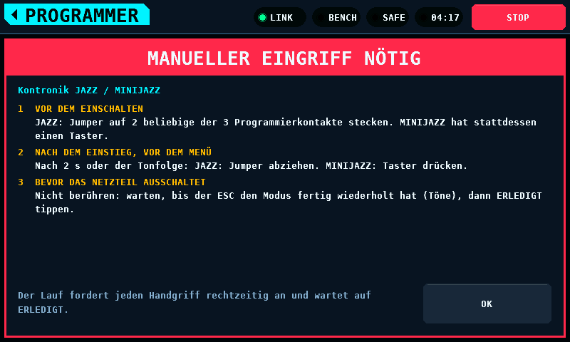
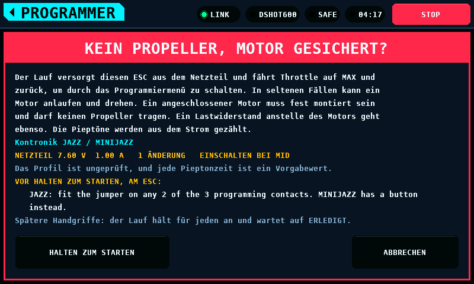

# Stick-Programmierung

[English](StickProgramming.md)

Die Stick-Programmierung stellt einen ESC (Electronic Speed Controller) über
sein Gasknüppel-Menü ein. Der Prüfstand versorgt den ESC aus dem PD mini,
mit einem Lastwiderstand anstelle des Motors oder einem fest montierten
Motor ohne Propeller. Er bewegt das Gas in die
Stellungen, die das [ESC-Profil](EscProfiles-de.md) nennt, und zählt die
Pieptöne des Menüs als Pulse im Versorgungsstrom. Auf dem Bildschirm ist es
die Klasse ESC STICK des Bildschirms PROGRAMMER.

Was sie nicht weiß:

- Kein ESC ist aufgenommen worden. Jede Zeit unten ist ein Vorgabewert, der
  für eine Messung steht, und als Einstellung gehalten, damit eine Aufnahme
  ihn ohne neues Image ersetzen kann.
- Kein Profil ist verifiziert. Punkt- und Wertnummern und Einstiegsgesten
  sind die der Handbücher.
- Die eigenen Töne des ESCs nach einer Auswahl werden nicht ausgewertet.
  FERTIG heißt: jede Auswahlbewegung kam auf eine gezählte Gruppe in der
  Reihenfolge des Menüs, nicht, dass der ESC sie gespeichert hat.

## Vor einem Lauf

1. Den Propeller abnehmen. Ein Lauf fährt das Gas auf MAX und zurück,
   während der ESC versorgt ist. Der ESC ist dann in seinem
   Programmiermenü und treibt nicht, aber in seltenen Fällen kann ein Motor
   anlaufen und drehen.
2. Entweder den Motor am ESC lassen, fest montiert, oder an seiner Stelle
   einen Lastwiderstand an die Motorleitungen des ESCs legen. Die Pieptöne
   werden in beiden Fällen aus dem Strom gezählt. Der Wert des Widerstands
   ist nicht festgelegt: kein ESC ist in einen solchen gelaufen. Er muss
   den Strom bei der Spannung des Laufs unter dessen Strombegrenzung
   halten. Wie gut Pieptöne durch die Wicklungen eines Motors im Strom zu
   lesen sind, ist nicht gemessen.
3. Die Signalleitung des ESCs an einen Pin legen, der auf dem Bildschirm
   OUTPUTS mit der Rolle Throttle gebunden ist. Ein Lauf steuert jeden als
   Throttle gebundenen Kanal, wie der Bildschirm MOTOR.
4. Die Versorgungsleitungen des ESCs an den Ausgang des Netzteils legen.
5. Den Ausgang des Netzteils ausschalten. Ein Lauf, der ihn an oder auf dem
   Weg findet, wird abgelehnt.

## Auf dem Bildschirm

PROGRAMMER, dann ESC STICK:

Die Liste enthält jedes Profil, die ausführbaren zuerst. Ein Profil, das der
Prüfstand nicht ausführen kann, nennt den Grund in seiner Zeile und öffnet
nichts; ebenso eines, dessen Spannung über der Grenze von SUPPLY liegt.
Reihenfolge und Anzahl folgen SPANNUNG und der Grenze, wenn sie sich
ändern. Ein
Profil von der SD-Karte (Secure Digital) trägt KARTE. Ein Profil mit
[Handgriffen](#handgriffe) trägt am Ende seines Namens ein rotes Schild
HAND; eines davon, das nicht läuft, öffnet statt nichts seine Handgriffe.

### Suche

SUCHE neben ESC STICK filtert die Liste. Ein Tippen darauf dockt die
Texttastatur rechts an, und die Zeilen werden links davon schmaler: der
Hersteller, der gekürzte Name und ein Zeichen, ob das Profil ausführbar ist
(ein gefüllter Punkt) oder nicht (ein Ring). Jede Taste filtert die Liste
sofort, und die Liste springt auf ihre erste Zeile, sobald sich die Suche
ändert.

- Ein Profil wird gefunden, wenn der Suchtext irgendwo in Hersteller und
  Name steht, als ein Text gelesen ("Hobbywing Skywalker V2 15A-100A,
  11-item menu"), oder in Hersteller und einem seiner Modelle ("Kontronik
  JAZZ 55 LV").
- Groß- und Kleinschreibung spielen keine Rolle: `KONTR*Jazz` findet
  "Kontronik JAZZ / MINIJAZZ".
- `*` steht für eine beliebige Folge von Zeichen, auch für keine. Die Taste
  `*` sitzt dort, wo die Namenstastatur `_` hat. `sky*v2` findet die drei
  Profile Skywalker V2; `kontr*jazz*55` findet das Jazz-Profil über sein
  Modell JAZZ 55 LV.
- Eine leere Suche zeigt jedes Profil. Die Suche fasst bis zu 16 Zeichen.
- Die Kopfzeile zählt, was die Suche gefunden hat:
  `1-3/3 gefunden, 2 ausführbar`. Findet sie nichts, sagt die Liste
  `Kein Profil passt zur Suche.`

OK schließt die Tastatur und behält die Suche, ABBRECHEN kehrt zu der Suche
zurück, mit der die Tastatur geöffnet wurde, und CLR, dann OK leert sie.
Eine Zeile, die bei offener Tastatur angetippt wird, öffnet ihr Profil, die
Suche bleibt. Bei geschlossener Tastatur leert X im Feld die Suche. Die
Suche bleibt über die Seite eines Profils und zurück und beim Verlassen des
Bildschirms erhalten und ist nach einem Neustart leer.

Die Groß- und Kleinschreibung wird nur für die Buchstaben A bis Z
ausgeglichen. Ä, Ö und Ü in einem Profil von der Karte passen nur auf
denselben Buchstaben in derselben Schreibung, und die Tastatur hat keine
Taste für sie; `*` steht für einen davon. Kein eingebautes Profil hat einen
Buchstaben außerhalb von ASCII (American Standard Code for Information
Interchange) im Namen.

### Ein Profil und sein Lauf

Die Seite eines Profils listet seine Menüpunkte. Jeder steht anfangs auf
BEHALTEN und bleibt dann, wie er ist; die Stepper gehen durch die Werte des
Punkts und halten an beiden Enden an. Punkte mit dem Schlüssel `reset` oder
`exit` sind Aktionen, keine Einstellungen: der ESC handelt auf die
Auswahlbewegung und gibt keine Werte aus, deshalb zeigen ihre Zeilen AKTION,
NICHT SETZBAR und bieten nichts an. Ein Punkt mit einem einzigen Wert -- die
einzige Einstellung, die es gibt, oder eine Regel, die als Wert geschrieben
ist, wie die Zellenzahl von `hobbywing-flyfun-hv-9item`, "N Pieptöne = N
Zellen" -- bietet nichts zur Wahl; seine Zeile zeigt NICHTS ZU WÄHLEN. Die Zeile unter der Liste nennt die
Werte des gewählten Punkts und den Standardwert. START erscheint, sobald ein
Wert gewählt ist und der Lauf starten kann; kann er es nicht, sagt die Zeile
neben START, warum.

### Die Einschaltstellung

Ein Lauf schaltet den ESC mit dem Knüppel dort ein, von wo das Handbuch den
Wert programmiert: beim `entry_throttle` des Werts, wo das Profil eines
nennt, sonst beim Einstieg des Profils. Ein Kontronik-Car-Modus wird mit
dem Knüppel in der Motor-Aus-Stellung in der Mitte programmiert, der
Neutralstellung, die der Modus lernt; der Lauf schaltet ihn bei MID ein.
Der Knüppel bewegt sich nur bei ausgeschaltetem Netzteil: vor dem ersten
Einschalten, und zwischen zwei Einschaltungen erst, wenn das Netzteil
selbst seinen Ausgang aus meldet und der Strom unten ist
(`ESC_STICK_OFF_MA`, `ESC_STICK_OFF_SETTLE_MS`). Er bleibt dort 1000 ms
(`ESC_STICK_SIGNAL_MS`), bevor das Netzteil einschaltet, wie bei jedem
Einstieg.

- Ein einstufiges Menü nimmt eine Änderung je Einschalten, und jedes
  Einschalten nimmt die Stellung des Werts, den es speichern wird.
- Ein zweistufiges Menü, oder eines mit mehreren Änderungen je Einschalten,
  macht seine Änderungen in der Reihenfolge, in der der ESC sie ausgibt;
  alle Änderungen eines Laufs teilen sich deshalb ein Einschalten. Ein Lauf,
  dessen Änderungen verschiedene Stellungen brauchen, wird abgelehnt, mit
  `Änderungen brauchen verschiedene Einschaltstellungen`, nicht umsortiert.
  Kein Profil im Satz hat eine solche Mischung.
- Wo das Profil keine Ruhestellung nennt, ruht der Knüppel in der
  Einschaltstellung, und die Auswahlbewegung muss sich von ihr
  unterscheiden.

Die Warnung und die Karte des Laufs zeigen EINSCHALTEN BEI und die
Stellung, wenn sie nicht MIN ist; die Warnung jede Stellung, die die
Einschaltungen des Laufs nehmen.

START öffnet eine Warnung über den ganzen Bildschirm mit dem Titel KEIN
PROPELLER, MOTOR GESICHERT?. Sie sagt, was der Lauf tut: er versorgt den
ESC aus dem Netzteil und fährt Throttle auf MAX und zurück, um durch das
Programmiermenü zu schalten. In seltenen Fällen kann ein Motor anlaufen und
drehen, deshalb muss ein angeschlossener Motor fest montiert sein und darf
keinen Propeller tragen; ein Lastwiderstand anstelle des Motors geht
ebenso. Die Pieptöne werden aus dem Strom gezählt. Darunter stehen das
Profil, die Sollwerte des Netzteils mit der Zahl der Änderungen und die
Zeile, dass das Profil ungeprüft und jede Pieptonzeit ein Vorgabewert ist.

HALTEN ZUM STARTEN startet den
Lauf nach 2 s Halten, wie ARM. Ein Finger, der den Knopf verlässt, ein
verlorenes Touch-Ereignis oder ein STOP während des Haltens bricht es ab;
ABBRECHEN schließt die Warnung. Das ARM, das das Halten anfordert, verlässt den
Bildschirm mit den Befehlen des nächsten Frames; ein STOP oder ein
verlorenes Touch-Ereignis davor nimmt es zurück und beendet den Lauf, damit
es keinen Stopp aufheben kann, der danach kam.

Während des Laufs zeigt die Seite die Phase, die Pieptöne der laufenden
Gruppe, die letzte Gruppe und ob sie in der Reihenfolge war, und den Strom
neben seinem Grundwert. ABBRECHEN beendet den Lauf, ebenso STOP im Band und das
Verlassen des Bildschirms. ZURÜCK und TIMING sind nicht verfügbar. Die
Signalsäule neben der Pieptonzahl ist [unten](#die-signalsäule)
beschrieben.

Das Ergebnis bleibt bis OK: welche Auswahlen getroffen wurden, und bei einem
abgebrochenen Lauf der Grund. Bei mehr als fünf Änderungen zählt die letzte
Zeile den Rest.

TIMING öffnet die Einstellungen unten. SCHLIESSEN fordert das Speichern an;
gespeichert wird, während der Prüfstand entschärft und der Ausgang des
Netzteils aus ist.

### Handgriffe

Manche ESCs gehen nur in ihren Programmiermodus, wenn ein Mensch außer Gas
und Versorgung etwas am ESC tut: vor dem Einschalten einen Jumper auf zwei
Kontakte stecken und ihn nach den ersten Tönen abziehen, oder danach einen
Taster am ESC drücken. Jeder Kontronik-ESC im Satz gehört dazu. Das Profil
listet diese Schritte in `manual` ([ESC-Profile](EscProfiles-de.md)), jeden
mit dem Zeitpunkt, an dem er fällig ist:

| Fällig | Der Lauf |
| --- | --- |
| `before_power` | nennt ihn auf der Warnung: HALTEN ZUM STARTEN sagt, dass er erledigt ist. Ab dem zweiten Einschalten eines Laufs hält er vor jedem Einschalten an und fragt erneut |
| `at_power_up` | hält vor jedem Einschalten mit ausgeschaltetem Netzteil an und fragt; ERLEDIGT schaltet das Netzteil ein, und der Lauf zählt das Halten herunter, das das Profil nennt |
| `before_menu` | hält an, sobald der Einstieg seine Zeit hatte, mit versorgtem ESC und dem Knüppel auf MIN, und fragt; ERLEDIGT startet das Menü |
| `during_menu` | kann den Zeitpunkt nicht kennen: das Profil läuft nicht, `Handgriff` |
| `after_programming` | zeigt ihn auf dem Ergebnis |

Ein Profil mit Handgriffen zeigt im Kopf seiner Punktliste rot MANUELLER
EINGRIFF NÖTIG. Ein Tippen öffnet die Schritte über dem ganzen Bildschirm:
wann jeder fällig ist, was er ist und ob der Lauf danach fragt. Beim ersten
Öffnen des Profils nach einem Start erscheinen sie von selbst; OK schließt
sie.

Die Warnung vor einem Lauf nennt die Schritte vor dem Einschalten und sagt,
wann der Lauf für weitere anhält.

Ein Schritt, nach dem der Lauf fragt, deckt die Seite ab: der Schritt, wo
Netzteil und Knüppel stehen und wie lange der Lauf wartet. ERLEDIGT geht
weiter; es ist die ersten 1000 ms dunkel (`ESC_STICK_HAND_MIN_MS`), damit
ein Tippen für den Schritt davor nicht den nächsten bestätigt, und es wirkt
im nächsten Frame, nachdem dieser STOP, das Scharfschalten, den Link und
das Netzteil beurteilt hat. ABBRECHEN beendet den Lauf, ebenso STOP im Band.
Kein ERLEDIGT innerhalb von 60 s (`ESC_STICK_HAND_WAIT_MS`) beendet den
Lauf mit NICHT BESTÄTIGT. Während er wartet, hält der Lauf jede Regel, die er
sonst hält: ein versorgtes Warten beobachtet das Netzteil und seine
Messwerte, und jedes Ende setzt Throttle auf MIN, schaltet das Netzteil aus
und entschärft.

Um einen Schritt an einem versorgten ESC wird nur mit dem Knüppel in der
Motor-Aus-Stellung gebeten: MIN, oder MID, wo das `entry_throttle` eines
Werts sie nennt, die Motor-Aus-Stellung des Handbuchs in der Mitte. Ein
Profil, dessen Schritt `at_power_up` oder `before_menu` mit einem Einstieg
auf MID oder MAX kommt, läuft nicht, `Handgriff`, und ein Wert, den es bei
MAX einschalten würde, wird ebenso abgelehnt. Die 60 s sind die Zeit des Bedieners, den ESC zu erreichen,
nicht die des ESCs: kein Handbuch im Satz nennt, wie lange ein ESC auf
seinen Jumper oder Taster wartet, außer HELI JIVE und JIVE Pro, 10 s nach
dem Einschalten, und keiner von beiden läuft.

Das Ergebnis eines Laufs nennt die Schritte `after_programming` des
Profils. Nach einem abgebrochenen Lauf eines Profils mit einem Schritt vor
oder beim Einschalten sagt es, den ESC zu prüfen: ein für den Lauf
gesteckter Jumper kann noch stecken.

24 Profile haben Handgriffe: die 22 Kontronik-Familien, `turnigy-aquastar`
und `greatplanes-electrifly-c-series`. 10 laufen:

| Profil | Schritte | Werte, bei MID eingeschaltet |
| --- | --- | --- |
| `kontronik-3sl` | Jumper vor dem Einschalten auf, nach 2 s oder dem Dreiklang ab | Modus 6 |
| `kontronik-beat` | Jumper auf 2 beliebige der 3 Kontakte, ab nach 2 s oder den Tönen | Modi 6, 8 |
| `kontronik-beat-car` | wie BEAT | Modi 2 bis 6, 8 |
| `kontronik-beat-fai` | wie BEAT | keine |
| `kontronik-jazz` | JAZZ: Jumper wie BEAT; MINIJAZZ: Taster nach 2 s oder den Tönen | Modi 6, 8 |
| `kontronik-kontrol-x` | Taster unter dem Schrumpfschlauch nach 2 s oder den Tönen | Modus 3 |
| `kontronik-pix` | Taster mit der Aufschrift Taster nach 2 s oder den Tönen | keine |
| `kontronik-smile` | Taster drücken und loslassen nach 2 s oder den Tönen | Modus 6 |
| `kontronik-star-line` | Jumper vor dem Einschalten auf, nach 5 s oder den Tönen ab | Modus 6 |
| `kontronik-sun-plus` | Taster nach den Tönen | Modi 2, 3, 5, 6, 9 |

Die anderen 14 zeigen ihre Schritte und nennen den Grund in ihrer Zeile:
`Handgriff` bei `kontronik-3p`, `kontronik-cyber-line`,
`kontronik-heli-line`, `kontronik-mini20` und `kontronik-optomax`, deren
Jumper oder Brücke während des Menüs bewegt wird, und bei
`turnigy-aquastar`, dessen Schalter bei Vollgas eingeschaltet wird; bei den
übrigen der Grund ihres Menüs.

### Die Signalsäule

Eine Signalsäule rechts auf der Karte des Laufs und des Ergebnisses zeigt
zwei Dinge, gezeichnet wie eine Signalsäule an einer Maschine: Rot über
Grün auf einem hellgrauen Fuß.

- **Grün** leuchtet, solange der Pieptondetektor einen Puls hält: vom
  Messwert, der über Grundwert plus SCHWELLE stieg, bis zu dem, der unter
  Grundwert plus SCHWELLE minus HYSTERESE fiel. Jeder Puls schaltet es ein, ob auf
  seine Gruppe später reagiert wird oder nicht. Ein Puls, kürzer als ein
  Frame, ist trotzdem zu sehen: Grün bleibt mindestens 150 ms
  (`ESC_STICK_BEEP_LIGHT_MS`) an, ab dem Frame, der den Puls zuerst sieht.
  Auf dem Ergebnis ist Grün aus.
- **Rot** leuchtet auf einem Ergebnis, dessen Lauf endete, weil etwas nicht
  wie erwartet war, und bleibt bis OK an. Die Gründe stehen unter
  [Wie ein Lauf endet](#wie-ein-lauf-endet). Bei FERTIG und bei den Enden,
  die ein Bediener wählt, bleibt es aus: gedrücktes STOP, ABBRECHEN und das
  Verlassen des Bildschirms. Ein Stopp, den der Prüfstand selbst auslöst,
  PRÜFSTAND GESTOPPT, schaltet es ein.

Ändert sich eine der beiden Leuchten, werden beide Bildpuffer neu
gezeichnet.

## Was ein Lauf tut

| Phase | Gas | Netzteil | Endet |
| --- | --- | --- | --- |
| ARMING | MIN | aus | wenn der Prüfstand scharf meldet; nach 3000 ms: NICHT ARMED |
| SIGNAL | Einschaltstellung | aus | nach 1000 ms, damit der ESC das Signal beim Start sieht |
| HANDGRIFF | Einstiegsstellung | aus | vor einem Einschalten mit fälligem Schritt: ERLEDIGT, dann EINSCHALTEN; kein ERLEDIGT in 60 s: NICHT BESTÄTIGT |
| EINSCHALTEN | Einstiegsstellung | an | wenn ein Messwert den Ausgang an meldet; nach 3000 ms: AUSGANG NICHT GEMELDET |
| EINSTIEG | Einstiegsstellung | an | EINSTIEG nach dem Einschalten: das `hold_ms` des Profils, wo es eines nennt, und nicht kürzer als das längste `hold_ms` eines Schritts `at_power_up` |
| HANDGRIFF, VERSORGT | Einstiegsstellung, MIN | an | nach EINSTIEG mit einem fälligen Schritt `before_menu`: ERLEDIGT, dann das Menü; kein ERLEDIGT in 60 s: NICHT BESTÄTIGT |
| PUNKTE | Ruhestellung | an | eine Punktgruppe in Reihenfolge nennt einen gewünschten Punkt: die Auswahlbewegung |
| WERTE | wo die letzte Bewegung es ließ | an | eine Wertgruppe in Reihenfolge nennt den gewünschten Wert: die Wertbewegung |
| SPEICHERN | die Wertbewegung, dann die Speicherbewegung | an | nach SPEICHERN, und nach SPEICHERN noch einmal, wo das Profil eine Speicherbewegung hat |
| AUS UND EIN | wo es speicherte, dann Einstiegsstellung | aus | das Netzteil meldet den Ausgang aus und den Strom 200 ms unten, dann AUSSCHALTZEIT (mindestens 1000 ms) in der Einstiegsstellung, dann wieder EINSCHALTEN; nicht innerhalb von 3000 ms aus: NETZTEIL BLEIBT EIN |
| AUSSCHALTEN | wo es speicherte | aus | das Netzteil meldet den Ausgang aus und den Strom 200 ms unten; nicht innerhalb von 3000 ms: NETZTEIL BLEIBT EIN |
| FERTIG | MIN | aus | entschärft |
| ABGEBROCHEN | MIN | aus | entschärft, alles in einem Schritt |

MIN, MID und MAX sind 0, 50 und 100 % des Wegs des Throttle-Ausgangs. Die
Ruhestellung ist `scheme.listen` des Profils, oder die Einstiegsstellung, wo
es keines hat. Ein zweistufiges Menü (`value_select` gesetzt) wählt den
Punkt mit `select` und speichert den Wert mit `value_select`, dann zählt es
wieder Punkte; ein einstufiges Menü zählt Werte und speichert mit `select`,
gefolgt von der Bewegung `scheme.store` des Profils, wo es eine nennt. Ein
Profil mit `"changes_per_entry": "one"` nimmt eine Änderung je Einschalten,
also schaltet ein Lauf mit mehreren Änderungen das Netzteil zwischen ihnen
für AUSSCHALTZEIT aus.

Ein Lauf, der wie geplant endet oder die Versorgung aus- und einschaltet,
schaltet zuerst das Netzteil aus und lässt den Knüppel, wo er gespeichert
hat. Er bewegt ihn erst, wenn das Netzteil selbst den Ausgang aus meldet,
in Messwerten, die nach der Anforderung genommen sind, mit dem Strom
200 ms lang bei höchstens 20 mA (`ESC_STICK_OFF_MA`,
`ESC_STICK_OFF_SETTLE_MS`). Das OFF des Panels ist eine Anforderung: das
PD mini schaltet einen Link-Austausch und eine Modultransaktion später ab,
und bis dahin ist der ESC versorgt und in seinem Menü.

Zwei Teile dieser Regel sind nicht gemessen:
- Der Strom, den das PD mini bei ausgeschaltetem Ausgang meldet. Die Regel
  nimmt unter 20 mA an. Ein Modul, das mehr meldet, beendet jeden geplanten
  Lauf mit ABGEBROCHEN und NETZTEIL BLEIBT EIN, und ein Lauf mit einer Änderung je
  Einschalten kommt nie zur zweiten Änderung.
- Wie lange der ESC aus seinen Eingangskondensatoren weiterläuft, nachdem
  der Schalter des PD mini geöffnet hat. Der Strom zeigt, dass der Schalter
  offen ist, nicht, dass der ESC aus ist. Die 200 ms decken eine kleine
  Kapazität ab, etwa 2000 µF, die bei 30 mA in rund 270 ms um 4 V fallen;
  eine große decken sie nicht ab.

Jede Bewegung geht hinaus wie die Befehle des Bildschirms MOTOR: ARM über
die Arming-Policy, THROTTLE auf die Throttle-Kanäle, und das Netzteil über
das eigene ON und OFF von SUPPLY. Nichts umgeht STOP oder die Regeln zum
Scharfschalten.

## Wie die Pieptöne gezählt werden

- **Grundwert.** Während EINSTIEG, ab 500 ms nach dem Einschalten, ist der
  Grundwert der niedrigste gelesene Strom. Ein Piepton kann ihn nicht
  anheben. Während das Menü gezählt wird, folgt der Grundwert ruhigen
  Messwerten um 1/16 des Unterschieds je Messwert.
- **Piepton.** Ein Messwert über Grundwert plus SCHWELLE beginnt einen
  Puls; einer unter Grundwert plus SCHWELLE minus HYSTERESE beendet ihn.
- **Längen in Messwerten.** Ein Puls mit weniger Messwerten, als PIEPTON MIN
  beim längsten gesehenen Abstand halten muss, oder eine Lücke zwischen zwei
  Pulsen mit weniger, als PAUSE MIN halten muss, verdirbt seine Gruppe. Ein
  Puls, dessen erster und letzter Messwert weiter als LANG MAX auseinander
  liegen, verdirbt seine Gruppe. Ein Puls ab LANG ist ein langer Piepton; in
  einem Profil ohne lange Pieptöne verdirbt er seine Gruppe, ebenso ein
  langer nach einem kurzen.
- **Gruppe.** Stille von GRUPPENPAUSE nach dem letzten Puls beendet eine
  Gruppe. Ihre Zahl sind die kurzen Pieptöne plus `long_equals_short` für
  jeden langen.
- **Erst Stille.** Wenn eine Phase zu hören beginnt, wird keine Gruppe
  gezählt, bevor GRUPPENPAUSE Stille gehört ist; die erste Gruppe ist also
  ganz und nicht das Ende einer schon laufenden.
- **Reihenfolge.** Eine Gruppe ist in Reihenfolge, wenn sie eins mehr als
  die Gruppe davor ist, oder die niedrigste Nummer der Schleife nach ihrer
  höchsten. Wo das Profil jede Gruppe wiederholt (`repeat` über 0), ist
  dieselbe Zahl noch einmal nur nach einer Gruppe in Reihenfolge in
  Reihenfolge, und höchstens `repeat`-mal. Auf eine Gruppe wird nur
  reagiert, wenn sie in Reihenfolge ist und die davor auch: drei Gruppen
  hintereinander stimmen überein. Eine Zahl, die ein verlorener Piepton
  falsch macht, ist kleiner als die wahre, also ist sie nur in Reihenfolge,
  wenn die Gruppen davor auch falsch waren. Ein verlorener Piepton übergeht
  deshalb seine Gruppe, und die nächste Schleife wird genutzt; eine falsche
  Auswahl braucht einen verlorenen Piepton in jeder von drei Gruppen
  hintereinander, oder, in einem Menü mit wiederholten Gruppen, eine ganz
  verlorene Gruppe und einen verlorenen Piepton in der nächsten.
- **Späte Messwerte.** Ein Messwert, der mehr als das Kürzere von PIEPTON MIN
  und PAUSE MIN nach dem vorigen kommt, ist spät, ebenso einer, dessen Zähler
  einen übersprungenen Messwert zeigt: er verdirbt die Gruppe, in die er
  fällt, und bricht die Reihenfolge. 3 späte Messwerte hintereinander
  beenden den Lauf mit MESSRATE.

## Die Einstellungen

TIMING auf der Seite eines Profils. Gespeichert mit den anderen
Einstellungen. Kein Wert hier ist gemessen.

| Einstellung | Vorgabe | Bereich | Was sie ist |
| --- | --- | --- | --- |
| Spannung | 0 V | 0 bis 20 V | die Spannung des Netzteils; 0 nimmt sie aus dem Profil |
| Strombegrenzung | 1,00 A | 0,10 bis 3,00 A | die Strombegrenzung des Netzteils während des Laufs |
| Piepton min | 200 ms | 20 bis 2000 ms | kürzester Piepton, den der ESC gibt |
| Pause min | 200 ms | 20 bis 2000 ms | kürzeste Stille zwischen zwei Pieptönen |
| Lang | 500 ms | 50 bis 5000 ms | ein Piepton ab dieser Länge ist ein langer |
| Lang max | 1500 ms | 100 bis 10000 ms | ein längerer Puls ist kein Piepton |
| Gruppenpause | 700 ms | 50 bis 10000 ms | Stille, die eine Gruppe beendet |
| Einstieg | 5000 ms | 1000 bis 60000 ms | Einschalten bis zum Menü, wo das Profil kein `hold_ms` nennt |
| Speichern | 2000 ms | 0 bis 10000 ms | gehalten an der letzten Auswahl vor dem Ausschalten |
| Ausschaltzeit | 3000 ms | 500 bis 20000 ms | Netzteil aus zwischen zwei Einstiegen |
| Stille | 10000 ms | 1000 bis 60000 ms | so lange kein Piepton beendet den Lauf |
| Zeitlimit | 180000 ms | 5000 bis 600000 ms | so lange keine Reaktion auf eine gewünschte Gruppe beendet den Lauf |
| Schwelle | 100 mA | 10 bis 2000 mA | über dem Grundwert: ein Piepton |
| Hysterese | 40 mA | 0 bis 1000 mA | unter der Schwelle minus diesem Wert: Stille |

Ein Lauf wird abgelehnt, nicht angepasst, wenn die Einstellungen sich
widersprechen: LANG höchstens PIEPTON MIN, LANG MAX höchstens LANG, GRUPPENPAUSE
höchstens PAUSE MIN, SCHWELLE höchstens HYSTERESE, EINSTIEG höchstens 500 ms,
oder GRUPPENPAUSE plus das Kürzere von PIEPTON MIN und PAUSE MIN mindestens das
`within_ms` des Profils für seine Auswahl- oder Wertbewegung.

## Das Netzteil

SPANNUNG 0 nimmt das niedrigste `cells_min` unter den Modellen des Profils,
mit 3,8 V je LiPo-Zelle (Lithium-Polymer) oder 1,2 V je NiMH-Zelle
(Nickel-Metallhydrid): über der Abschaltung dieses Modells und unter dem
Maximum jedes Modells. Ein Profil, dessen Modelle keine Zellenzahl nennen,
braucht SPANNUNG. Eine Spannung über der Grenze des Bildschirms SUPPLY oder
unter dem Minimum des Netzteils, und eine Strombegrenzung über der Grenze
von SUPPLY, werden abgelehnt. Die Sollwerte des Laufs werden die Sollwerte
des Bildschirms SUPPLY.

## Welche Profile laufen

24 der 72 Profile sind von einer Art, die der Ablauf ausführt: 13
zweistufige und 11 einstufige. Mit den 20 V des PD mini und den
vorgegebenen Grenzen öffnet die Liste 23 davon:
hobbywing-skywalker-v2-hv-opto braucht 22,8 V. Ein Profil läuft, wenn es
`"automatable": "full"` ist, oder `"assisted"` mit Handgriffen, auf die der
Lauf warten kann (siehe [Handgriffe](#handgriffe)), vor dem Einschalten
betreten wird, mit `count`
oder `short_long` zählt und eine Auswahlbewegung hat. Eine Ruhestellung
außer der Einstiegsstellung braucht das `hold_ms` des Profils: die Bewegung
am Ende eines Einstiegs unbekannter Länge kann in einer anderen Stufe davon
landen. Ein zweistufiges Profil sagt zudem `item_then_value` an, seine
Bewegungen unterscheiden sich voneinander und von der Ruhestellung, und es
hat keine Speicherbewegung. Ein einstufiges Profil sagt `value` an, oder
`item` mit einem Punkt; nimmt eine Änderung je Einschalten; hat keine
Wertnummer in zwei Punkten; seine Auswahlbewegung unterscheidet sich von der
Ruhestellung, und seine Speicherbewegung, wo es eine hat, von der
Auswahlbewegung. Die Speicherbewegung darf die Ruhestellung sein: in den
YGE-Mode-Setups geht der Knüppel zum Speichern zurück auf Minimum, wo er
ruhte.

| Die Zeile sagt | Warum |
| --- | --- |
| braucht eine Person am ESC | `automatable` ist `assisted`, und das Profil nennt keinen Handgriff, nach dem der Lauf fragen könnte: ein Mensch liest eine LED oder steckt eine JetiBox an |
| Handgriff | ein Handgriff während des Menüs, oder einer an einem versorgten ESC mit dem Einstieg auf MID oder MAX |
| kein nutzbares Verfahren | `automatable` ist `none` |
| Einstieg nach Einschalten | `scheme.entry.when` ist `after_power_on` |
| Melodie-Menü, Ja/Nein-Menü, Stickpositions-Menü, Menü eigener Art | `scheme.type` |
| Töne nach Tonhöhe getrennt | `scheme.announce.encoding` ist `melody` oder `yes_no` |
| Punkt und Wert: 1 Bewegung | `item_then_value` ohne `value_select`: welche Gruppe die Bewegung beantwortet, steht nicht fest |
| 2 Bewegungen, ohne Werttöne | `value_select` ohne `item_then_value` |
| viele Änderungen, einstufig | einstufig mit `"changes_per_entry": "many"` |
| Punkte gezählt, einstufig | einstufig, `item` angesagt, mehrere Punkte |
| Werte wiederholen sich | einstufig, eine Wertnummer in zwei Punkten |
| Auswahl = Ruhestellung | die Auswahlbewegung ist die Ruhestellung: keine Bewegung zu machen |
| Wertbewegung = Auswahl | zweistufig, `value_select` gleich `select` |
| Ruhe ohne Einstiegszeit | `scheme.listen` weicht von der Einstiegsstellung ab und `hold_ms` ist null: die YGE-Profile |
| Speichern, zweistufig | zweistufig mit `scheme.store` |
| Speichern = Auswahl | einstufig, `scheme.store` gleich `select` |
| 22.8 V, Obergrenze 21.0 V | die Spannung (SPANNUNG, oder die Zellenzahl des Profils) liegt über der Grenze von SUPPLY |

Ein auf der SD-Karte korrigiertes Profil steht mit seiner Korrektur in der
Liste.

## Wie ein Lauf endet

| Ergebnis | Ursache | Rote Leuchte |
| --- | --- | --- |
| FERTIG | jede Auswahl getroffen | aus |
| STOP | STOP gedrückt, im Band oder auf einer Seite, während des Laufs | aus |
| PRÜFSTAND GESTOPPT | ein Stopp, den der Prüfstand während des Laufs selbst auslöste: Touch 500 ms ohne Antwort, Touch-Ereignisse verloren unter einem STOP-Druck oder unter dem Scharfschalten, oder die Ablehnung oder der Failsafe des Koprozessors; das Band nennt, welcher | an |
| DISARMED | der Prüfstand wurde entschärft | an |
| LINK VERLOREN | der Koprozessor antwortete irgendwann während des Laufs und hörte auf | an |
| NETZTEIL AUS | der Ausgang ging aus: eine Abschaltung, oder ein ON, das das Netzteil fallen ließ | an |
| NETZTEIL ANTWORTET NICHT | das Netzteil antwortet nicht mehr | an |
| KEINE MESSWERTE | der Messwertzähler 1000 ms unverändert | an |
| MESSRATE | 3 späte Messwerte hintereinander | an |
| NICHT ARMED | nicht scharf innerhalb von 3000 ms | an |
| AUSGANG NICHT GEMELDET | der Ausgang nicht innerhalb von 3000 ms als an gemeldet | an |
| NETZTEIL BLEIBT EIN | das Netzteil meldet den Ausgang nicht innerhalb von 3000 ms nach der Anforderung des Laufs aus, mit dem Strom unten | an |
| TOUCH VERLOREN | Touch-Ereignisse verloren, solange das ARM des Laufs noch nicht genommen oder der Prüfstand noch nicht scharf war | an |
| KEINE PIEPTÖNE | STILLE lang kein Piepton | an |
| STROM BLEIBT HOCH | ein Puls länger als zweimal LANG MAX | an |
| ZEITLIMIT | innerhalb von ZEITLIMIT auf keine gewünschte Gruppe reagiert | an |
| NICHT BESTÄTIGT | kein ERLEDIGT für einen Handgriff innerhalb von 60 s | an |
| ABGEBROCHEN | ABBRECHEN | aus |
| SEITE VERLASSEN | der Bildschirm wurde verlassen | aus |

Die Spalte der roten Leuchte ist `esc_stick_reason_is_fault()` in
`shared/esc/esc_stick.c`, ein Fall je Grund. `tools/check_docs.py` liest
diese Funktion und schlägt fehl, wenn diese Tabelle oder ihr englisches
Gegenstück etwas anderes sagt. TOUCH VERLOREN ist an: Ereignisse gingen
verloren, sie wurden nicht gewählt.

STOP und PRÜFSTAND GESTOPPT kommen aus zwei Zählern, die das Panel führt:
jeder Stopp, und davon die gedrückten (`arming_stop_pressed()`, im selben
Aufruf wie der Stopp gezählt). Ein Lauf, der seit seinem Beginn mehr Stopps
als Drücke sieht, endet mit PRÜFSTAND GESTOPPT, damit ein Stopp des
Prüfstands nicht hinter einem Druck verschwindet, der mit ihm kam.

Jedes Ende setzt das Gas auf MIN, schaltet das Netzteil aus und entschärft;
ein Abbruch tut alle drei in einem Schritt.
Ein Stopp rastet ein wie jeder Stopp: der nächste Lauf schaltet erst über
seine eigene Warnung wieder scharf.

## Die Leserate

Ein Messwert ist neu, wenn der Messwertzähler des Netzteils weiterläuft:
beim PD mini SAMPLES auf der SUPPLY-Page, der Zähler des Koprozessors für
die Ausgangsmessungen, die das Modul beantwortet hat. Seine Zeit ist die
Page-Lesung, die den Zähler zuerst zeigte. Das PD mini liest seinen Ausgang
alle 100 ms (`PDMINI_DISPLAY_MS`), und das Panel liest die Page alle 100 ms
(`SUPPLY_LINK_READ_MS`) in seinem 50-ms-Poll; neue Messwerte kommen also
100 bis 150 ms auseinander, und der Zähler kann zwischen zwei Page-Lesungen
um 2 weiterlaufen. Ein Zähler, der um mehr als 1 weiterläuft, ist ein
Messwert, den das Panel nie sah, und ist spät. Ein Zähler, der stehen
bleibt, sind Messwerte, die ausbleiben: KEINE MESSWERTE nach 1000 ms, wie frisch
die Page selbst auch ist. Ein Piepton oder eine Lücke kürzer als etwa
200 ms kann zwischen zwei Messwerte des Moduls fallen und ungesehen
bleiben; die Reihenfolgeregel übergeht dann die Gruppe, statt die Nummer
darunter zu wählen. PIEPTON MIN und PAUSE MIN stehen deshalb auf 200 ms. Ob der
Strom des Moduls ein Augenblickswert oder ein Mittel über sein Intervall
ist, ist nicht bekannt.

Pieptöne aus der Zeit zu zählen, in der der Strom erhöht bleibt, würde auch
Pieptöne kürzer als ein Messwert erfassen, braucht aber die Periode der
Pieptöne, die nicht gemessen ist. Es wird nicht gemacht.

## Simulation

Ist das PD mini in SETUP ANSCHLÜSSE aus, betreibt der Bildschirm SUPPLY das
Modell eines Netzteils im Panel. Während eines Stick-Laufs ist der Strom
dieses Modells ein simulierter ESC (`shared/esc/esc_sim.c`), der dem Profil
folgt: Einschalten in der Einstiegsstellung betritt das Menü nach dem
`hold_ms` des Profils (3000 ms ohne), Gruppen laufen mit 250 ms Pieptönen,
250 ms Lücken, 800 ms langen Pieptönen und 1500 ms zwischen Gruppen, bei
150 mA Ruhestrom und 600 mA mehr je Piepton. Jede dieser Zahlen ist
ausgedacht. Wo das Profil eine Speicherbewegung nennt, wird eine Auswahl
erst behalten, wenn der Knüppel sie macht. Ein Punkt mit dem Schlüssel
`exit` verlässt das Menü, wenn er gewählt wird, und einer mit `reset` löscht,
was gespeichert war. Die Messwerte des Modells kommen alle 50 ms. Es bildet
keinen Jumper und keinen Taster nach: es betritt sein Menü nach `hold_ms`,
ob ein Handgriff bestätigt ist oder nicht, und die Regel der ruhigen Leitung
lässt den Lauf nach ERLEDIGT an einer Gruppengrenze zu zählen beginnen.

Die Host-Suite (`test_esc_stick`) lässt den Ablauf von Ende zu Ende gegen
die Simulation laufen: zwei- und einstufige Menüs, wiederholte Gruppen, eine
Ruhestellung, Ein- und Ausschalten zwischen Änderungen, Messwerte 100 bis
190 ms auseinander, 30 mA Rauschen, ein verlorener Piepton in einer Gruppe,
ein Menü mit einem Punkt mehr als das Profil, ein ESC, der nie piept, und
jeder Weg, auf dem ein Lauf endet. Ein Durchlauf mit einem verlorenen
Piepton in jeder der ersten zehn Gruppen gegen ESC-Einstiege 2000 ms vor
und nach dem des Ablaufs speichert keinen anderen Wert als den verlangten.

## Aktuelle Einschränkungen

- Kein Lauf gegen einen ESC. Die Vorgaben und die Reihenfolgeregel sind an
  echten Pieptönen nicht erprobt.
- Ein ESC, der eine Auswahl ignoriert, gibt weiter seine Punkte aus, die der
  Lauf dann als Werte zählt: er kann FERTIG melden, ohne dass etwas
  gespeichert ist.
- Bei einem Menü, das länger oder kürzer als sein Profil ist, wird auf die
  niedrigste Nummer nie reagiert, weil die höchste der Schleife nicht die
  davor gehörte ist; der Lauf endet mit ZEITLIMIT.
- Eine Auswahl braucht drei Gruppen hintereinander in Reihenfolge und
  kostet also mindestens einen Durchgang der Schleife: bis zu etwa zwei
  Schleifen, wenn die gewünschte Nummer die niedrigste ist. Ein
  zweistufiges Menü, dessen Wertschleife beim gespeicherten Wert beginnt,
  wie das YGE-Handbuch es für sein RC-Setup beschreibt, kostet mehr.
- Die Reihenfolgeregel nimmt an, dass das Menü des ESCs das des Profils
  ist. Punkte, die es nur an manchen Modellen gibt, verschieben an den
  anderen die Nummern: in `hobbywing-flyfun-v5` gibt es Punkt 6
  (BEC-Spannung) an den Modellen mit 60, 80 und 120 A, in `ztw-gecko`
  Punkt 6 an den SBEC-Modellen. An einem Modell ohne den Punkt geben die
  Punkte danach womöglich eine Nummer weniger aus, als das Profil sagt.
  Einen davon zu wählen kann dann den Punkt danach wählen, eine Nummer
  höher im Profil; die
  Reihenfolgeregel merkt das nicht, weil das Menü in Reihenfolge ist, nur
  kürzer. Ein Profil je Modellsatz wäre die Abhilfe und ist nicht angelegt.
- `sunrise-pro`: das Handbuch schaltet die Bremse mit "the first quad group"
  um, die auch der Wert für automatisches Timing ist; Timing 4 zu speichern
  schaltet womöglich auch die Bremse um. Nicht gemessen.
- Die Gasstellungen sind 0, 50 und 100 % des Wegs des Ausgangs. Ein ESC, der
  auf andere Endpunkte kalibriert ist, liest sie womöglich anders.
- Nur ein Netzteil: das PD mini, höchstens 20 V. ESCs, die mehr brauchen,
  brauchen eine externe Versorgung, die der Prüfstand nicht schaltet.
- Die Handgriffe sind die der Handbücher und unerprobt. Ob ein Kontronik-ESC
  ohne Grenze auf seinen Jumper oder Taster wartet und was er tut, wenn
  das Abziehen spät kommt, steht nicht fest, außer bei HELI JIVE und JIVE
  Pro (10 s), die nicht laufen.
- Welche Werte ein Kontronik-ESC aus der Mitte programmiert, ist den
  Handbüchern entnommen; für JAZZ-Modi 6 und 8, KONTROL-X-Modus 3 und
  SUN-PLUS-Modi 2, 3, 5, 6 und 9 nennt das Handbuch die Stellung nicht, und
  die Werte werden bei MID eingeschaltet, als wäre es die Mitte. Die Zusatzmodi (7, 9)
  werden von hinten programmiert; ob sie an einem ESC im Car-Modus den
  Knüppelweg neu speichern, steht nicht fest.
- `kontronik-pix` Modus 2 verlangt nach der Auswahl eine Bewegung in die
  Bremsstellung; der Lauf macht keine. Ob der ESC den Modus ohne sie
  speichert, ist nicht bekannt.
- Ein Schalter am ESC in der Einschaltfolge -- SeaKing V3 mit Schalter,
  Trackstar 60A V2, der BEC-Schalter der Hacker-X- und Master-Reihe, der
  Empfängerschalter des Jeti Spin -- bleibt eingeschaltet, und das Netzteil
  steht für ihn. Die Handbücher schalten ihn nach dem Anstecken des Akkus;
  ob das Einschalten des Netzteils das Menü betritt wie der Schalter, ist
  nicht gemessen.
- Kein Lauf mit einem Motor am ESC anstelle des Lastwiderstands. Ob ein
  Motor während des Menüs anläuft und wie seine Wicklungen die Pieptöne im
  Strom formen, ist nicht gemessen.
