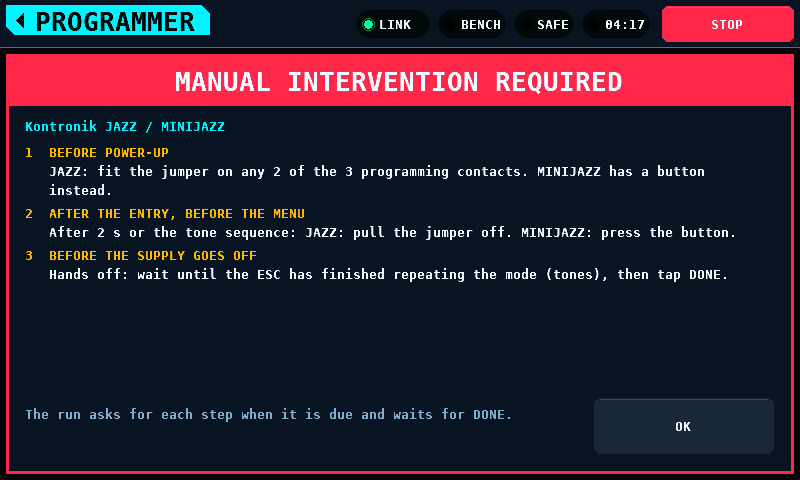
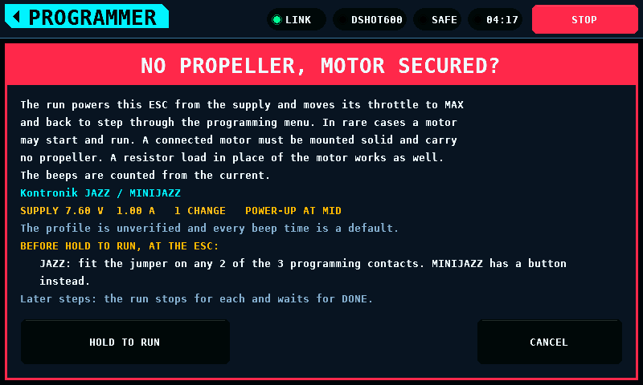
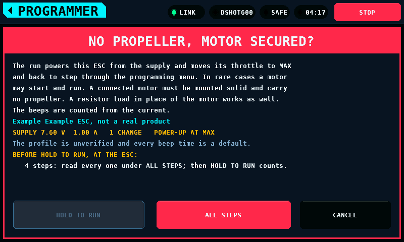
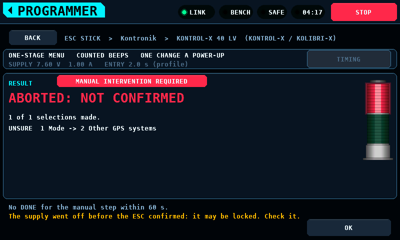
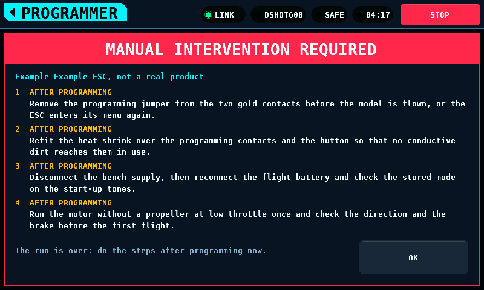

# Stick programming

[Deutsch](StickProgramming-de.md)

Stick programming sets an ESC (electronic speed controller) through its
throttle-stick menu. The bench powers the ESC from the PD mini supply, with
a resistor load in place of the motor or a motor mounted solid with no
propeller. It moves the throttle to the positions the
[ESC profile](EscProfiles.md) names, and counts the menu's beeps as pulses
in the supply current. On the screen it is the ESC STICK class of the
PROGRAMMER screen.

What it does not know:

- No ESC has been recorded. Every time below is a default standing in for a
  measurement, kept as a setting so a recording can replace it without a
  build.
- No profile is verified. Item numbers, value numbers and entry gestures are
  the manuals'.
- The ESC's own tones after a selection are not decoded. DONE means every
  selection move was made on a counted group in the menu's order, not that
  the ESC stored it.

## Before a run

1. Take the propeller off. A run moves the throttle to MAX and back while
   the ESC is powered. The ESC is in its programming menu then, not
   driving, but in rare cases a motor may start and run.
2. Either leave the motor on the ESC, mounted solid, or fit a resistor load
   across the ESC's motor leads in its place. The beeps are counted from
   the current either way. The resistor's value is not specified: no ESC
   has been run into one. It has to keep the current under the run's
   current limit at the run's voltage. How well beeps through a motor's
   windings read in the current is not measured.
3. Connect the ESC's signal lead to a pin bound with the throttle role on
   the OUTPUTS screen. A run commands every channel bound as a throttle, as
   the MOTOR screen does.
4. Connect the ESC's power leads to the supply output.
5. Switch the supply's output off. A run that finds it on or on its way is
   refused, and so is one whose supply reads live: its own state on, or
   more than 20 mA (`ESC_STICK_OFF_MA`) through the output, in its newest
   reading. The line beside RUN says to switch it off first. RUN also
   needs the supply known off: a reading no older than 1000 ms
   (`ESC_STICK_STALE_MS`) in which the supply itself reports its output
   off with the current at or under 20 mA for 200 ms. No reading, an older
   one, or a supply that does not answer refuses RUN with `no fresh
   reading says the supply is off`.

## On the screen

PROGRAMMER, then ESC STICK:

The list has two levels.

- **Makers.** One row a maker, alphabetical with case folded: its name, how
  many of its models run of all it lists (`10 OF 82 RUN`), and the red
  MANUAL tag where a model it lists has [manual steps](#manual-steps). A
  maker none of whose models runs is drawn dark. A tap opens its models.
- **Models.** One row a model of that maker, by current, then the maximum
  input voltage, then the name; a model that states no current or no
  voltage comes last on that key. A row shows the model, its current and
  voltage, its family, the MANUAL tag, and what its family's profile is
  (items, one or two stages, CARD for a profile from the SD (Secure Digital)
  card) or why it does not run. The crumb reads `ESC STICK > Kontronik`.
  BACK returns to the makers on the page it left.

A tap on a model opens its family's profile, named with the model:
`ESC STICK > Kontronik > JAZZ 55 LV (JAZZ / MINIJAZZ)`. The supply takes the
model's own lowest cell count where it states one, else the family's
lowest. A model whose profile the bench cannot run names the reason on its
row and opens nothing; so does one whose voltage is over the SUPPLY cap.
One whose profile has manual steps opens them instead, with the reason for that model. The steps, the page's supply line, RUN and the warning all judge the model opened, not the family's lowest. The rows and the
counts follow VOLTAGE and the cap as they change. A profile from the card
joins its maker's models; a card maker the set does not have joins the
makers in its alphabetical place. Every built-in profile names its maker;
the card reader refuses a file without one. The card reader also refuses a
file that would take its maker past 512 models, so a maker lists at most 512
models.

The line under the rows says no profile is verified, and the count at its
right counts the level: `1-9 of 20 makers, 6 run` -- the makers with a
model that runs -- or `1-9 of 82, 40 run` for a maker's models.

### Search

SEARCH on the crumb row filters the level showing. Tapping it docks the
text keyboard on the right of the screen, and the rows narrow to its left:
the maker or the model, the makers' models found or a model's current, and
a mark for whether it runs (a filled dot) or not (a ring); the count moves
under the narrowed rows. Every key filters the list at once, and the level
returns to its first row whenever the search changes.

- A model is found when the search text appears anywhere in its maker and
  its family's name read as one text, "Hobbywing Skywalker V2 15A-100A,
  11-item menu", or in its maker and its own name, "Kontronik JAZZ 55 LV".
- A maker shows when the search finds any of its models; its row then
  counts them: `1 OF 82 FOUND, 1 RUN`. No maker opens by itself, even
  when it is the only one found.
- Case does not matter: `KONTR*Jazz` finds Kontronik, and in it the JAZZ
  and MINIJAZZ models.
- `*` stands for any run of characters, none included. The keyboard's `*`
  key sits where the name keyboard has `_`. `sky*v2` finds Hobbywing and in
  it the 14 Skywalker V2 models; `*kontr*jazz*55*` finds Kontronik and in
  it JAZZ 55 LV alone.
- An empty search shows every maker and every model. The search holds up
  to 16 characters, and is the same on both levels.
- The count says what was found: `1-1 of 1 makers found, 1 run`. With
  nothing found the list says `No profile matches the search.`

OK closes the keyboard with the search kept, CANCEL goes back to the search
the keyboard opened on, and CLR then OK clears it. A row tapped while the
keyboard is open opens it, the search kept. With the keyboard closed, X in
the field clears the search. The search stays through both levels, a
profile's page and back and when the screen is left, and is empty after a
restart.

Case folding covers the letters A to Z only. Ä, Ö and Ü in a profile from
the card match only the same letter in the same case, and the keyboard has
no key for them; `*` stands in for one. No built-in profile name holds a
letter outside ASCII (American Standard Code for Information Interchange).

### A profile and its run

A profile's page lists its menu items. Each starts at KEEP, which leaves the
item as it is; the steppers move through the item's values and stop at
either end. Items keyed `reset` or `exit` are actions, not settings: the ESC
acts on the select move and sounds no values, so their rows show ACTION, NOT
SET and offer nothing. An item with a single value -- the only setting there
is, or a rule written as a value, such as `hobbywing-flyfun-hv-9item`'s
cell count, "N beeps = N cells" -- has nothing to choose; its row shows
NOTHING TO CHOOSE. The line under the list names the selected item's values and the
default. RUN is offered once a value is picked and the run can start; when it
cannot, the line beside RUN says why.

The page lists only the items on the model it was opened for: an item with
`applies_to` shows on the models it names, and not on the others. Two
items may share a number and values on different models -- Jeti's Cutoff
mode on six small 3P models and Switching frequency on the rest, both
item 3 -- and the ESC sounds only the one it has, so a change to the other
would store this one. RUN refuses a change to an item not on the model as
the last check (`3 Cutoff mode is not on this model`). A page with no model
picked, which only a card profile without models opens, lists the items
every model has.

### The power-up position

A run powers the ESC up with the stick where the manual programs the value
from: the value's `entry_throttle` where the profile names one, else the
profile's entry. A Kontronik car mode is programmed with the stick at
motor-off in the middle, the neutral the mode teaches; the run powers it up
at MID. The stick moves only while the supply is off: before the first
power-up, and between two power-ups only once the supply itself reports its
output off with the current down (`ESC_STICK_OFF_MA`,
`ESC_STICK_OFF_SETTLE_MS`). It is held there 1000 ms
(`ESC_STICK_SIGNAL_MS`) before the supply comes on, as at every entry.

- A one-stage menu takes one change a power-up, and each power-up uses the
  position of the value it is about to store.
- A two-stage menu, or one that takes several changes a power-up, makes its
  changes in the order the ESC sounds them, so all changes of a run share
  one power-up. A run whose changes need different positions is refused
  with `changes need different power-up positions`, and one whose changes
  need different entry times -- what the run waits: the value's
  `entry_hold_ms` or the entry's, and no less than the longest
  `at_power_up` hold -- with `changes need
  different entry times`; neither is reordered. No profile of record has
  such a mix.
- Where the profile names no rest position the stick rests at the power-up
  position, and the select move has to differ from it.

The warning and the run's card show POWER-UP AT and the position when it
is not MIN; on the warning, every position the run's power-ups take.

RUN opens a warning over the whole screen, titled NO PROPELLER, MOTOR
SECURED?. It says what the run does: it powers the ESC from the supply and
moves its throttle to MAX and back to step through the programming menu. In
rare cases a motor may start and run, so a connected motor must be mounted
solid and carry no propeller; a resistor load in place of the motor works
as well. The beeps are counted from the current. Below that stand the
profile, the supply's set points with the number of changes, and the line
that the profile is unverified and every beep time a default.

HOLD TO RUN starts the run after 2 s of holding, as ARM does. A finger that
leaves the button, a lost touch event or a STOP during the hold abandons
it; CANCEL closes the warning. The ARM the hold asks for leaves the screen
with the next frame's commands; a STOP or a lost touch event before then
takes it back and ends the run, so it cannot clear a stop that came after
it.

During the run the page shows the phase, the beeps in the group under way,
the last group and whether it was in order, and the current against its
floor. ABORT ends the run, and so does STOP in the band or leaving the
screen. BACK and TIMING are not offered. The stack light beside the beep
count is described [below](#the-stack-light).

With the phase tap enabled on SETUP under INTERFACES the page adds a
read-only readout of the tap under the current line: its state, the pitch of
its last 8 ms window, the counts of beeps lost, lows ignored and beeps not
read, and the last four beeps with their number, length in ms and pitch in
Hz ([the tap's rows and states](Screens.md#interfaces-the-phase-tap)). The
run counts its beeps from the supply current as before; it does not use the
tap's beeps.

The result stays until OK: which selections were made, and for an aborted
run the reason. Past five changes the last line counts the rest.

TIMING opens the settings below. CLOSE asks for them to be saved; the save
is taken while the bench is disarmed and the supply's output is off.

### Manual steps

Some ESCs enter their programming mode only when a person does something at
the ESC besides the throttle and the power: fits a jumper on two contacts
before the power-up and pulls it off after the first tones, or presses a
button on the ESC after them. Every Kontronik ESC in the set is one. The
profile lists these steps in `manual` ([ESC profiles](EscProfiles.md)),
each with the moment it is due:

| Due | The run |
| --- | --- |
| `before_power` | lists it on the warning: HOLD TO RUN is the word that it is done. From the second power-up of a run on, it stops before each power-up and asks again |
| `at_power_up` | stops before each power-up with the supply off and asks; DONE switches the supply on, and the run counts down the hold the profile gives |
| `before_menu` | asks once the entry has had its time, with the ESC powered and the stick at the power-up position. A step marked `starts_menu` is the action that starts the menu, and the run counts the beeps from the moment it asks (see below); every other one waits for DONE |
| `during_menu` | cannot know the moment: the profile does not run, `manual step` |
| `before_power_off` | stops after the store's last move, with the ESC powered and the stick where the store left it, and switches the supply off only on DONE. Nobody touches the ESC: the operator watches it confirm the value (tones, LED) |
| `after_programming` | shows it on the result |

A profile with manual steps shows MANUAL INTERVENTION REQUIRED in red in the
header of its item list. A tap opens the steps over the whole screen: when
each is due, what it is, and whether the run asks for it. They open by
themselves the first time the profile is opened after a start; OK closes
them.

The warning before a run lists the steps due before the power-up, and says
when the run will stop for more. It lists them, and HOLD TO RUN counts, only
while the supply reads off: a reading no older than 1000 ms
(`ESC_STICK_STALE_MS`) in which the supply itself reports its output off
with the current at or under 20 mA for 200 ms. Until then it says to switch
the supply off, and a hold under way ends when the supply stops reading
off. The run then asks the supply off itself and powers nothing, and asks
for no step at an unpowered ESC, until its own readings say the same; the
result and the steps after a run say not to touch the ESC while the supply
does not read off.

Steps that do not all fit the warning whole -- each wrapped to two lines,
above HOLD TO RUN -- are not shown cut: the warning counts them and offers
ALL STEPS beside HOLD TO RUN. HOLD TO RUN counts only once ALL STEPS has
been opened over this warning and closed with OK, so the hold attests to
every step; a new warning asks for them again.

A step asked during the run covers the page: the step, where the supply
and the stick are, and how long the run waits. DONE goes on; it is dark for
the first 1000 ms (`ESC_STICK_HAND_MIN_MS`), so one tap meant for the step
before cannot confirm the next, and it is acted on in the next frame, after
the frame has judged STOP, the arm, the link and the supply. ABORT ends the
run, and so does STOP in the band. No DONE within 60 s
(`ESC_STICK_HAND_WAIT_MS`) ends the run with NOT CONFIRMED. While it waits
the run keeps every rule it keeps elsewhere: a powered wait watches the
supply and its readings, and every end sets the throttle to MIN, switches
the supply off and disarms.

**Before the supply goes off.** A Kontronik ESC confirms a stored mode
by repeating it as tones (the manuals' control output, "Kontrollausgabe"),
mode 7 as seven, and the manuals disconnect the battery only after it.
STORE (2000 ms by default) can end before a long repeat does. Every
Kontronik profile that runs, and the five below, carry a
`before_power_off` step: after the store's last move the run holds the ESC
powered, the stick where the store left it, and asks the operator to
watch the ESC and tap DONE once the confirmation has ended; DONE switches
the supply off, and the run ends or cycles as any other. The prompt says
the ESC is powered and not to touch it. No DONE within 60 s ends the run
with NOT CONFIRMED. That end, and every other from the selection of the
value on -- while the ESC stores (STORING) or while the step is asked --
switches the supply off under the store or the confirmation, and the
result says the mode may not be stored and marks the change UNSURE, not
MADE: the count of selections made leaves it out, and where it is past
the fourth change the last line counts it (`AND 2 MORE, 1 OF THEM MADE,
1 UNSURE`). The same holds for any profile whose value is stored by moves after
its selection (`scheme.store`, `after_select`), with or without such a
step, until the last of those moves is made.

A KOBY, JIVE Pro, KOLIBRI, KONTROL-X / KOLIBRI-X or KOSMIK that loses its
supply before that confirmation has ended takes the programming as broken
off and locks itself: 8 LED flashes on a KONTROL-X
(Kontronik_Kontrol-X_Kolibri-X.pdf p.4, p.11), 9 on a KOBY, JIVE Pro or
KOLIBRI, 10 on a KOSMIK. Their step marks it (`"locks": true`), and there
the prompt and the result say the ESC may be locked and to check it -- for
every step before the power-off of such a profile, until all are
confirmed, not only for the step that marks it. Of
the five, KONTROL-X runs; the others show the step on their list of
steps. The other Kontronik manuals name no lock for a power-off during the
repeat.

**The action that starts the menu.** A profile marks the step whose
action starts the mode series with `"starts_menu": true`; a step without it
waits for DONE, whatever its place. 16 Kontronik profiles mark their last
`before_menu` step: the ESC answers the
pulled jumper or the pressed button with a three-tone sequence and sounds
mode 1, 2, 3 ... after it (for example Kontronik_Jazz.pdf p.6, "Jumper
abziehen" followed by the tone sequence and the series;
Kontronik_Pix1000_3000.pdf p.4 steps 5 and 6, "Taster drücken" followed by
the descending tones and the series; KOSMIK p.8 step 6). CYBER-Line and HELI-Line,
whose jumper is pulled as the battery is connected and which wait about
5 s for a signal, do not mark it. The operator's hand is at the ESC then, not at the screen. So the run counts the beeps
from the moment it asks for that step, with the stick where the power-up
put it:

- The step is taken as done by the first group the order rule finds in
  order with the one before it -- the menu running -- or by DONE,
  whichever comes first. The ESC's three-tone answer is a group of 3 and
  not in order with mode 1, so it does not count.
- The quiet-first and order rules hold from the prompt: no group counts
  until GROUP GAP of quiet, and a value is acted on only on the third
  group in a row in order. A partial first group is never acted on.
- SILENCE and TIMEOUT run from the moment the step is done; until then the
  ESC is silent by design. No step done within 60 s ends the run with NOT
  CONFIRMED.
- The stick does not move while the step is asked. A profile whose menu
  rests at another position than the power-up -- `scheme.listen` away from
  the entry, or a value powered up away from `scheme.listen` -- would need
  a move under the operator's hand at a powered ESC, and waiting for DONE
  first would drop the groups the action starts. The generator and the
  card reader refuse such a file (`manual[0].starts_menu: the menu rests
  elsewhere (scheme.listen)`), and the engine refuses such a profile built
  otherwise as `menu start, rest elsewhere`.

A step at a powered ESC is asked for only with the stick at the
motor-off position: MIN, or MID where a value's `entry_throttle` names it,
the manual's motor-off in the middle. A profile whose `at_power_up` or
`before_menu` step comes with an entry at MID or MAX does not run,
`manual step`, and a value it would power up at MAX is refused the same
way. The 60 s is
the operator's time to reach the ESC, not the ESC's. For the entry jumper
or button, only the HELI JIVE and JIVE Pro manuals state how long the ESC
waits: 10 s after power-up, and neither profile runs. Steps later in a
procedure have windows of their own, and none of these profiles runs
either: OPTO, BEC and OPTOMAX take the start-button press within about
5 s of the double signal (Kontronik_Opto.pdf p.3, Kontronik_BEC.pdf,
Kontronik_Optomax.pdf), 3P the jumper pulled and fitted again within about
5 s of the second phase's end (Kontronik_3P_en.pdf), and CYBER-Line the
jumper fitted again during about 30 s of signals.

The result of a run lists the profile's `after_programming` steps in two
lines under the changes; steps that need more say how many there are
instead. When a run of a profile with such steps ends, its steps open by
themselves, every one of them, also when a tap in the same frame has
already closed the result, and MANUAL INTERVENTION
REQUIRED in the result's header opens them again.

After an aborted run of a profile with a step before or at the power-up,
the result says to check the ESC: a jumper fitted for the run may still be in place.

24 profiles have manual steps: the 22 Kontronik families, `turnigy-aquastar`
and `greatplanes-electrifly-c-series`. 10 run, each with its step before the
supply goes off as well:

| Profile | Steps | Values powered up at MID |
| --- | --- | --- |
| `kontronik-3sl` | jumper on before the power-up, off after 2 s or the three-tone sequence | mode 6 |
| `kontronik-beat` | jumper on any 2 of the 3 contacts, off after 2 s or the tones | modes 6, 8 |
| `kontronik-beat-car` | as BEAT | modes 2 to 6, 8 |
| `kontronik-beat-fai` | as BEAT | none |
| `kontronik-jazz` | JAZZ: jumper as BEAT; MINIJAZZ: button after 2 s or the tones | modes 6, 8 |
| `kontronik-kontrol-x` | button under the shrink tube after 2 s or the tones; the step before the power-off marks the lock | mode 3 |
| `kontronik-pix` | button marked Taster after 2 s or the tones | none |
| `kontronik-smile` | button pressed and let go after 2 s or the tones | mode 6 |
| `kontronik-star-line` | jumper on before the power-up, off after 5 s or the tones | mode 6 |
| `kontronik-sun-plus` | button after the tones: 2 s, 5 s for modes 4 to 6 | mode 6 |

The other 14 show their steps and name the reason on their row:
`manual step` for `kontronik-3p`, `kontronik-cyber-line`,
`kontronik-heli-line`, `kontronik-mini20` and `kontronik-optomax`, whose
jumper or bridge moves during the menu, and for `turnigy-aquastar`, whose
switch goes on at full throttle; the menu's own reason for the rest.

### The stack light

A stack light at the right of the run's card and of the result shows two
things, drawn as a signal tower: red over green on a light grey base.

- **Green** is on while the beep detector holds a pulse: from the reading
  that rose above the floor plus THRESHOLD to the one that fell below the
  floor plus THRESHOLD less HYSTERESIS. Every pulse lights it, whether its
  group is later acted on or not. A pulse shorter than a frame still shows:
  green stays on at least 150 ms (`ESC_STICK_BEEP_LIGHT_MS`) from the frame
  that first sees the pulse. Green is dark on the result.
- **Red** is lit on a result whose run ended because something was not as
  expected, and stays on until OK. The reasons are listed under
  [How a run ends](#how-a-run-ends). It stays dark on DONE and on the ends
  an operator chooses: STOP pressed, ABORT and leaving the screen. A stop
  the bench raises itself, BENCH STOPPED, lights it.

A change of either light repaints both screen buffers.

## What a run does

| Phase | Throttle | Supply | Ends |
| --- | --- | --- | --- |
| ARMING | MIN | off, asked off | when the bench reports armed; after 3000 ms: NOT ARMED |
| SIGNAL | MIN, then the power-up position | off | the stick stays at MIN until the supply reads off in readings taken since the run asked it off (its own state off, the current at or under 20 mA for 200 ms), then goes to the power-up position and is held there 1000 ms, so the ESC sees the signal when it starts; not off within 3000 ms: SUPPLY STAYS ON. Once the stick has moved, a reading with the output on or the current up ends the run at once with SUPPLY STAYS ON, and no reading for 1000 ms with NO READINGS |
| MANUAL STEP | the power-up position | off, read off | before a power-up with a step due, asked only once the supply reads off: DONE, then POWER ON; no DONE in 60 s: NOT CONFIRMED; a reading with the output on or the current up: SUPPLY STAYS ON at once; no reading for 1000 ms: NO READINGS |
| POWER ON | entry position | on | when a sample reports the output on; after 3000 ms: NO POWER |
| ENTRY | entry position | on | ENTRY after power-on: the value's `entry_hold_ms`, else the profile's `hold_ms` where it states one, and no less than the longest `hold_ms` of an `at_power_up` step |
| MANUAL STEP, POWERED | the power-up position | on | after ENTRY with a `before_menu` step due that is not the menu's own start: DONE, then the next step or the menu; no DONE in 60 s: NOT CONFIRMED. The last step is asked from ITEMS or VALUES, already counting |
| WAITING FOR THE ESC | where it stored | on | after STORING with a `before_power_off` step due: DONE, then the next such step or the supply off (POWER CYCLE or POWER OFF); no DONE in 60 s: NOT CONFIRMED, and the result says the ESC may be locked |
| ITEMS | rest position | on | an item group in order names a wanted item: the select move |
| VALUES | where the last move left it | on | a value group in order names the wanted value: the value move |
| STORING | the value move, then the store move, then the value's own moves (`after_select`) | on | after STORE, and after STORE again for each move: the profile's store move, then each of the value's |
| POWER CYCLE | where it stored, then entry position | off | the supply reports the output off and the current down for 200 ms, then OFF TIME (at least 1000 ms) at the entry position, then POWER ON again; not off within 3000 ms: SUPPLY STAYS ON. Once the stick has moved, a reading with the output on or the current up ends the run at once with SUPPLY STAYS ON, and no reading for 1000 ms with NO READINGS; the next power-up, or a step before it, needs a reading no older than 1000 ms |
| POWER OFF | where it stored | off | the supply reports the output off and the current down for 200 ms; not within 3000 ms: SUPPLY STAYS ON |
| DONE | MIN | off | disarmed |
| ABORTED | MIN | off | disarmed, all in one step |

MIN, MID and MAX are 0, 50 and 100 % of the throttle output's travel. The
rest position is the profile's `scheme.listen`, or the entry position where
it has none. A two-stage menu (`value_select` set) selects the item with
`select` and stores the value with `value_select`, then counts items again;
a one-stage menu counts values and stores with `select`, followed by the
profile's `scheme.store` move where it names one. A profile with
`"changes_per_entry": "one"` takes one change per power-up, so a run of
several changes switches the supply off for OFF TIME between them.

A run that ends as planned, or cycles the power, switches the supply off
first and leaves the stick where it stored. It moves the stick only once
the supply itself reports the output off, in readings taken after the run
asked it off, with the current at or under 20 mA for 200 ms
(`ESC_STICK_OFF_MA`, `ESC_STICK_OFF_SETTLE_MS`). The panel's own OFF is a
request: the PD mini switches off a link exchange and a module transaction
later, and until then the ESC is powered and in its menu.

Two parts of this rule are not measured:
- The PD mini's current reading with its output off. The rule assumes it
  reads under 20 mA. A module that reads more ends every planned run
  ABORTED with SUPPLY STAYS ON, and a run of one change per power-up never
  makes its second change.
- How long the ESC runs on from its input capacitors once the PD mini's
  switch has opened. The current shows that the switch is open, not that
  the ESC has stopped. The 200 ms hold covers a small capacitance, for
  example 2000 µF falling 4 V at 30 mA in about 270 ms; it does not cover
  a large one.

Every move goes out as the MOTOR screen's commands do: ARM through the arming
policy, THROTTLE onto the throttle channels, and the supply through SUPPLY's
own ON and OFF. Nothing bypasses STOP or the arming rules.

## How the beeps are counted

- **Floor.** During ENTRY, from 500 ms after power-on, the floor is the
  lowest current read. A beep cannot raise it. While the menu is counted, the
  floor follows quiet readings by 1/16 of the difference each.
- **Beep.** A reading above the floor plus THRESHOLD starts a pulse; one
  below the floor plus THRESHOLD less HYSTERESIS ends it.
- **Lengths in readings.** A pulse that holds fewer readings than BEEP MIN
  must hold at the longest interval seen, or a gap between two pulses that
  holds fewer than GAP MIN must, spoils its group. A pulse whose first and
  last readings are further apart than LONG MAX spoils its group. A pulse
  measured at LONG or longer is a long beep; in a profile without long beeps
  it spoils its group, and so does a long beep after a short one.
- **Group.** Silence of GROUP GAP after the last pulse ends a group. Its
  count is the short beeps, plus `long_equals_short` for each long one.
- **Quiet first.** When a phase starts listening, no group is counted until
  GROUP GAP of quiet has been heard, so the first group is a whole one and
  not the tail of a group already sounding.
- **Order.** A group is in order when it is one more than the group before
  it, or the loop's lowest number after its highest. Where the profile
  repeats each group (`repeat` above 0), the same count again is in order
  only after a group that was itself in order, and no more often than
  `repeat` times. A group is acted on only when it is in order and the group
  before it was too: three groups in a row agree. A count made wrong by a
  missed beep is lower than the truth, so it is in order only if the groups
  before it were wrong as well. One missed beep therefore passes its group
  and the next loop is used; a wrong selection needs a missed beep in each
  of three groups in a row, or, in a menu that repeats its groups, a whole
  group lost and a beep missed in the next.
- **Late readings.** A reading more than the shorter of BEEP MIN and GAP MIN
  after the one before is late, and so is one whose count says a reading
  was skipped: it spoils the group it falls in and breaks the order. 3 late readings in a row end the run with READ RATE.

## The settings

TIMING on a profile's page. Kept in the settings with the others. No value
here is measured.

| Setting | Default | Range | What it is |
| --- | --- | --- | --- |
| Voltage | 0 V | 0 to 20 V | the supply's voltage; 0 takes it from the profile |
| Current limit | 1.00 A | 0.10 to 3.00 A | the supply's limit during the run |
| Beep min | 200 ms | 20 to 2000 ms | shortest beep the ESC sounds |
| Gap min | 200 ms | 20 to 2000 ms | shortest silence between two beeps |
| Long | 500 ms | 50 to 5000 ms | a beep this long or longer is a long one |
| Long max | 1500 ms | 100 to 10000 ms | a pulse longer than this is no beep |
| Group gap | 700 ms | 50 to 10000 ms | silence that ends a group |
| Entry | 5000 ms | 1000 to 60000 ms | power-on to the menu, where the profile gives no `hold_ms` |
| Store | 2000 ms | 0 to 10000 ms | held at the last selection before power-off |
| Off time | 3000 ms | 500 to 20000 ms | supply off between two entries |
| Silence | 10000 ms | 1000 to 60000 ms | no beep for this long ends the run |
| Timeout | 180000 ms | 5000 to 600000 ms | the wanted group not acted on in this long ends the run |
| Threshold | 100 mA | 10 to 2000 mA | above the floor: a beep |
| Hysteresis | 40 mA | 0 to 1000 mA | below the threshold less this: silence |

A run is refused, not adjusted, when the settings contradict themselves:
LONG at or under BEEP MIN, LONG MAX at or under LONG, GROUP GAP at or under
GAP MIN, THRESHOLD at or under HYSTERESIS, ENTRY at or under 500 ms, or
GROUP GAP plus the shorter of BEEP MIN and GAP MIN at or over the profile's
`within_ms` for its select or value move.

## The supply

VOLTAGE 0 takes the `cells_min` of the model opened from the list where it
states one, else the lowest `cells_min` among the profile's models, at
3.8 V a LiPo (lithium polymer) cell or 1.2 V a NiMH (nickel-metal hydride)
cell: above that model's cut-off and under every model's maximum. A profile
whose models state no cell count needs VOLTAGE set. A voltage above the
SUPPLY screen's cap or below the supply's minimum, and a current limit above
the SUPPLY cap, are refused. The run's set points become the SUPPLY screen's
set points.

The model's own ratings hold the set points too, on its row, on its page
and on RUN, the last check before the run arms:

| Set point | Refused when | Row says | RUN says |
| --- | --- | --- | --- |
| VOLTAGE, or the cell count's | over the model's `v_max_mv` | `20.0 V, ESC rated 8.4 V` | `VOLTAGE 20.0 V is over the ESC's 8.4 V` |
| VOLTAGE, or the cell count's | under the model's `v_min_mv`, where stated | `11.9 V, ESC from 12.0 V` | `VOLTAGE 11.9 V is under the ESC's lowest 12.0 V` |
| CURRENT LIMIT | over the model's `current_a`, where stated | `2.0 A, ESC rated 1 A` | `CURRENT LIMIT 2.0 A is over the ESC's 1 A` |

A model that states no `v_max_mv` runs, with a warning in place of the
row's summary and as the note beside RUN, in the warning colour:

| Set point | Row says | Note says |
| --- | --- | --- |
| VOLTAGE set by hand | `ESC rating unknown` | `VOLTAGE 7.4 V: ESC rating unknown, check it` |
| VOLTAGE 0, the model stating no cell count: the family's lowest stands in | `ESC rating unknown` | `7.6 V from the family's lowest cells: rating unknown` |

VOLTAGE 0 on a model that states its cell count but no `v_max_mv` runs at
that cell count with no warning: the data's own figure. A stated
`v_min_mv` or `current_a` holds whether or not `v_max_mv` is stated. On the family's page with no model
picked, the rating is the lowest `v_max_mv` of its models, unknown when one
of them states none, and the lowest input the highest `v_min_mv`. CURRENT
LIMIT goes to 3.0 A at most; every model of record that states a current is
rated 4 A or more, so only a card profile can meet that rule.

## Which profiles run

24 of the 72 profiles are of a kind the engine runs: 13 two-stage and 11
one-stage. With the PD mini's 20 V and the default caps the list opens 23 of
them: hobbywing-skywalker-v2-hv-opto needs 22.8 V. 4 model rows of families
that open are refused at 20 V too, each needing 22.8 V: FLYFUN 130A and
160A HV OPTO V5, and Gecko 120A and 150A OPTO HV. 4 rows open with the
rating warning (see [The supply](#the-supply)): dualsky-xcontroller's and
kontronik-beat-car's one model, which state neither a cell count nor a
voltage rating and so need VOLTAGE set, and KOLIBRI-X 60 LV and 90 LV of
kontronik-kontrol-x, which run at the family's lowest cell count. A profile runs when it is
`"automatable": "full"`, or `"assisted"` with manual steps the run can wait
for (see [Manual steps](#manual-steps)), is entered before power-on, counts
with `count` or `short_long`, and has a select move. A rest position other than the entry
position needs the profile's `hold_ms`: the move at the end of an entry of
unknown length can land in another stage of it. A two-stage profile also
announces `item_then_value`, its moves differ from each other and from the
rest position, and it has no store move. A one-stage profile announces
`value`, or `item` with one item; takes one change per power-up; has no
value number in two items; its select move differs from the rest position,
and its store move, where it has one, from the select move. The store move
may be the rest position: in the YGE mode setups the stick goes back to
minimum, where it rested, to store.

| Row says | Why |
| --- | --- |
| needs a person at the ESC | `automatable` is `assisted` and the profile lists no manual step the run could ask for: a person reads an LED or plugs in a JetiBox |
| manual step | a manual step during the menu, or one at a powered ESC with the entry at MID or MAX |
| no usable procedure | `automatable` is `none` |
| entered after power-on | `scheme.entry.when` is `after_power_on` |
| melody menu, yes/no menu, stick-position menu, menu of its own kind | `scheme.type` |
| tones told apart by pitch | `scheme.announce.encoding` is `melody` or `yes_no` |
| item and value, one move | `item_then_value` with no `value_select`: which group the move answers is not stated |
| two moves, no value tones | `value_select` without `item_then_value` |
| many changes, one stage | one-stage with `"changes_per_entry": "many"` |
| items counted, one stage | one-stage, `item` announced, several items |
| values repeat across items | one-stage, a value number in two items |
| select move is the rest | the select move is the rest position: no move to make |
| value move = select move | two-stage, `value_select` equals `select` |
| rest move, no entry time | `scheme.listen` differs from the power-up position and no time is stated: `hold_ms` is null, the value has no `entry_hold_ms` and no `at_power_up` step has a `hold_ms`: the YGE profiles. A profile whose values state their own `entry_hold_ms` is judged per change: one without a time is refused, the others run |
| store move, two stages | two-stage with a `scheme.store` |
| store move = select move | one-stage, `scheme.store` equals `select` |
| menu start, rest elsewhere | a step marked `starts_menu`, and the menu rests away from the power-up position: `scheme.listen` away from the entry, or a value powered up away from it |
| needs 22.8 V, cap 21.0 V | the voltage (VOLTAGE, or the profile's cell count) is over the SUPPLY cap |

A profile corrected on the SD card is listed with its correction.

## How a run ends

| Result | Cause | Red light |
| --- | --- | --- |
| DONE | every selection made | dark |
| STOP | STOP pressed, in the band or on a screen, while the run was under way | dark |
| BENCH STOPPED | a stop the bench raised itself while the run was under way: touch silent for 500 ms, touch events lost under a STOP press or under the arm, or the coprocessor's refusal or failsafe; the band names which | lit |
| DISARMED | the bench disarmed | lit |
| LINK LOST | the coprocessor answered at some time during the run and stopped answering | lit |
| SUPPLY OFF | the output went off: a trip, or an ON the supply let go | lit |
| SUPPLY NOT ANSWERING | the supply stopped answering | lit |
| NO READINGS | the reading count unmoved for 1000 ms | lit |
| READ RATE | 3 late readings in a row | lit |
| NOT ARMED | not armed within 3000 ms | lit |
| NO POWER | the output not reported on within 3000 ms | lit |
| SUPPLY STAYS ON | the supply not reporting its output off, with the current down, within 3000 ms of the run asking it off -- at the start, before a power-up or at the end -- or a reading with the output on or the current up while a step at an unpowered ESC is asked | lit |
| TOUCH LOST | touch events lost while the run's ARM was not yet taken, or the bench not yet armed | lit |
| NO BEEPS | no beep for SILENCE | lit |
| CURRENT STAYS HIGH | one pulse longer than twice LONG MAX | lit |
| TIMEOUT | no wanted group acted on within TIMEOUT | lit |
| NOT CONFIRMED | no DONE for a manual step within 60 s | lit |
| ABORTED | ABORT | dark |
| SCREEN LEFT | the screen was left | dark |

The red light's column is `esc_stick_reason_is_fault()` in
`shared/esc/esc_stick.c`, one case per reason. `tools/check_docs.py` reads
that function and fails when this table, or its German twin, says
otherwise. TOUCH LOST is lit: events were lost, not chosen.

STOP and BENCH STOPPED come from two counts the panel keeps: every stop,
and of those the ones pressed (`arming_stop_pressed()`, counted in the
same call as the stop). A run that sees more stops than presses since it
began ends with BENCH STOPPED, so a stop the bench raised is not hidden by
a press that came with it.

Every end sets the throttle to MIN, switches the supply off and disarms; an
abort does all three in one step. A stop latches as any stop does: the next
run arms again from its own warning.

## The read rate

A reading is new when the supply's reading count moves: for the PD mini,
SAMPLES on the SUPPLY page, the coprocessor's count of output readings the
module answered. Its time is the page read that first showed the count. The
PD mini reads its output every 100 ms (`PDMINI_DISPLAY_MS`), and the panel
reads the page every 100 ms (`SUPPLY_LINK_READ_MS`) on its 50 ms poll, so
new readings arrive 100 to 150 ms apart and the count can move by 2 between
two page reads. A count that moves by more than 1 is a reading the panel
never saw, and is late. A count that stops is readings that stop: NO
READINGS after 1000 ms, however fresh the page itself is. A beep or gap
shorter than about 200 ms can fall between two module readings and not be
seen; the order rule then passes the group rather than selecting the number
below. BEEP MIN and GAP MIN default to 200 ms for this reason. Whether the
module's current is an instant reading or an average over its interval is
not known.

Counting beeps from the time the current stays raised would cover beeps
shorter than a reading, but needs the beep's period, which is not measured.
It is not done.

## Simulation

With the PD mini off in SETUP INTERFACES, the SUPPLY screen runs the panel's
model of a supply. During a stick run the model's current is a simulated ESC
(`shared/esc/esc_sim.c`) following the profile: power-on at the entry
position enters the menu after the profile's `hold_ms` (3000 ms without
one), groups loop with 250 ms beeps, 250 ms gaps, 800 ms long beeps and
1500 ms between groups, at 150 mA idle and 600 mA more per beep. Every one of
those numbers is made up. Where the profile names a store move, a selection
is kept only once the stick makes it. An item keyed `exit` leaves the menu
when it is selected, and one keyed `reset` clears what was stored. The
model's samples arrive every 50 ms. The panel's model does not model a
jumper or a button: it enters its menu after `hold_ms`. The host suite's
does (`wait_hand`): the menu waits for the action, answers it with three
beeps and starts the series 1500 ms later.

The host suite (`test_esc_stick`) runs the engine against the simulation end
to end: two-stage and one-stage menus, repeated groups, a rest position,
power cycles between changes, readings 100 to 190 ms apart, noise of 30 mA,
a beep lost from a group, a menu one item longer than the profile, an ESC
that never beeps, and each way a run can end. A sweep of a lost beep in
each of the first ten groups against ESC entries 2000 ms either side of the
engine's stores no value other than the one asked for.

## Current limitations

- No run against an ESC. The defaults and the order rule are untested on
  real beeps.
- An ESC that ignores a selection keeps sounding its items, which the run
  then counts as values: it can report DONE with nothing stored.
- A menu longer or shorter than its profile never has its lowest number
  acted on, because the loop's highest is not the one heard before it; the
  run ends with TIMEOUT.
- A selection needs three groups in a row in order, so it costs at least one
  pass of the loop: up to about two loops when the wanted number is the
  loop's lowest. A two-stage menu whose value loop starts at the stored
  value, as the YGE manual describes for its RC-Setup, costs more.
- The order rule assumes the ESC's menu is the profile's. Items that exist
  on some models only shift the numbering on the others: in
  `hobbywing-flyfun-v5` item 6 (BEC voltage) is on the 60, 80 and 120 A
  models, and in `ztw-gecko` item 6 on the SBEC models. On a model without
  the item, the items after it may sound one number lower than the profile
  says. Selecting one of them can then pick the item after it, one number
  higher in the profile; the order
  rule does not notice, because the menu is in order, only shorter. A
  profile per model set is the fix and is not made.
- `sunrise-pro`: the manual toggles the brake with "the first quad group",
  which is also the automatic-timing value; storing timing 4 may toggle the
  brake too. Not measured.
- The throttle positions are 0, 50 and 100 % of the output's travel. An ESC
  calibrated to other end points may read them differently.
- One supply only: the PD mini, at most 20 V. ESCs that need more need an
  external supply, which the bench does not switch.
- Manual steps are the manuals' and untested. Whether a Kontronik ESC waits
  for its entry jumper or button without a limit, and what it does when
  the pull comes late, is not stated except for the HELI JIVE and JIVE Pro
  (10 s), which do not run. The later windows of OPTO, BEC, OPTOMAX, 3P
  (about 5 s) and CYBER-Line (about 30 s) belong to profiles that do not
  run.
- A KOBY, JIVE Pro, KOLIBRI, KONTROL-X / KOLIBRI-X or KOSMIK whose supply
  goes off before its mode confirmation has ended locks itself (8 to 10
  LED flashes, by family). The run switches the supply off before DONE
  on NOT CONFIRMED (no DONE within 60 s), STOP, ABORT, a disarm, a lost
  link and every supply rule, and then says the ESC may be locked. The
  bench does not see the confirmation or the lock; DONE is the operator's
  word that the confirmation has ended.
- Which values a Kontronik ESC programs from the middle is read from the
  manuals. For JAZZ modes 6 and 8, KONTROL-X mode 3 and SUN PLUS mode 6
  the manual does not place the position, and the values are powered up at
  MID as if it were the middle. SUN PLUS modes 2, 3, 5 and 9 start at the
  manual's neutral position, which its English text places at the back for
  mode 4 ("neutral position (back position)", Kontronik_Sun_Plus.pdf p.12)
  and which mode 5 sets on a two-position switch (p.13); they are powered
  up at MIN on that reading. The add-on modes (7, 9) are programmed
  from the back; whether they store the stick range again on an ESC set to
  a car mode is not stated.
- A mode list with a gap never has the numbers after the gap, nor the
  lowest, acted on, as the order rule reads a skipped number as a missed
  group: PIX modes 7, 9 and 1 (it lists 1, 2, 3, 7, 9), Smile modes 9 and
  1, SUN PLUS modes 9 and 1. The run ends with TIMEOUT. Whether these ESCs
  sound the counts they do not use is not stated.
- A value's moves after its selection (`after_select`: PIX mode 2, the
  Kontronik car modes, KONTROL-X mode 3) are each made STORE after the one
  before. The manuals time them by the ESC's answering tones, which the run
  does not decode; STORE (2000 ms by default) stands in for them, not
  measured. The optional separate motor-off position of the glider modes is
  not made.
- A switch on the ESC in the power-up sequence -- SeaKing V3 with a switch,
  Trackstar 60A V2, the BEC switch of the Hacker X and Master series, the
  Jeti Spin's receiver switch -- is left on and the supply stands in for it.
  The manuals switch it after the battery is connected; whether the supply's
  power-up enters the menu as the switch would is not measured.
- No run with a motor on the ESC in place of the resistor load. Whether a
  motor starts during the menu, and how its windings shape the beeps in
  the current, is not measured.
